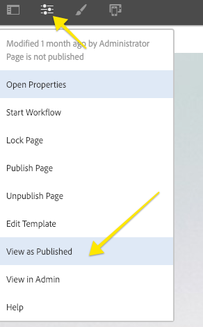

# Configurare un ambiente di sviluppo AEM locale

Guida alla configurazione di uno sviluppo locale per Adobe Experience Manager, AEM. Vengono trattati argomenti importanti relativi all’installazione locale, a Apache Maven, agli ambienti di sviluppo integrati e al debug/risoluzione dei problemi. Sviluppo con **Eclipse IDE, CRXDE Lite, Visual Studio Code e IntelliJ** sono discussi.

## Panoramica

L’impostazione di un ambiente di sviluppo locale è il primo passaggio nello sviluppo per Adobe Experience Manager o AEM. Prenditi del tempo per configurare un ambiente di sviluppo di qualità per aumentare la produttività e scrivere codice migliore, più velocemente. Possiamo spezzare un ambiente di sviluppo locale AEM in quattro aree:

* Istanze AEM locali
* [!DNL Apache Maven] progetto
* Ambienti di sviluppo integrati (IDE)
* Risoluzione dei problemi

## Installa istanze AEM locali

Quando ci riferiamo a un’istanza AEM locale, stiamo parlando di una copia di Adobe Experience Manager in esecuzione sul computer personale di uno sviluppatore. ***Tutto*** Lo sviluppo AEM dovrebbe iniziare scrivendo ed eseguendo il codice su un&#39;istanza AEM locale.

Se hai poca esperienza con AEM, puoi installare due modalità di esecuzione di base: ***Autore*** e ***Pubblica***. La ***Autore*** [modalità runmode](https://experienceleague.adobe.com/docs/experience-manager-65/deploying/configuring/configure-runmodes.html?lang=en)  è l’ambiente utilizzato dagli esperti di marketing digitale per creare e gestire i contenuti. Durante lo sviluppo della maggior parte del tempo, distribuisci il codice in un’istanza di authoring. Questo consente di creare pagine e aggiungere e configurare componenti. AEM Sites è un CMS di authoring WYSIWYG e quindi la maggior parte dei CSS e JavaScript può essere testata rispetto a un’istanza di authoring.

È anche *critico* codice di test per un locale ***Pubblica*** istanza. La ***Pubblica*** L’istanza è l’ambiente AEM con cui i visitatori del sito web interagiscono. Mentre il ***Pubblica*** L&#39;istanza è la stessa dello stack di tecnologia della ***Autore*** Ad esempio, ci sono alcune distinzioni importanti con le configurazioni e le autorizzazioni. Il codice deve essere testato su un ***Pubblica*** prima di essere promossa in ambienti di livello superiore.

### Passaggi

1. Assicurati che Java™ sia installato.
   * Preferisci [Java™ JDK 11](https://experience.adobe.com/#/downloads/content/software-distribution/en/general.html?1_group.propertyvalues.property=.%2Fjcr%3Acontent%2Fmetadata%2Fdc%3AsoftwareType&amp;1_group.property.operation=equals&amp;1_group.property.values.0_values=software-type%3Atooling&amp;orderby=%40jcr%3Acontent%2Fjcr%3AlastModified&amp;orderby.sort=desc&amp;layout=list p.offset=0&amp;p.limit=14) per AEM 6.5+
   * [Java™ JDK 8](https://www.oracle.com/java/technologies/downloads/) per AEM versioni precedenti a AEM 6.5
1. Ottieni una copia del [AEM QuickStart Jar e un [!DNL license.properties]](https://experienceleague.adobe.com/docs/experience-manager-65/deploying/deploying/deploy.html?lang=it).
1. Crea una struttura di cartelle sul computer come segue:

```plain
~/aem-sdk
    /author
    /publish
```

1. Rinomina il [!DNL QuickStart] JAR a ***aem-author-p4502.jar*** e posizionarlo sotto il `/author` directory. Aggiungi il ***[!DNL license.properties]*** sotto il `/author` directory.

1. Crea una copia del [!DNL QuickStart] JAR, rinominalo in ***aem-publish-p4503.jar*** e posizionarlo sotto il `/publish` directory. Aggiungi una copia del ***[!DNL license.properties]*** sotto il `/publish` directory.

```plain
~/aem-sdk
    /author
        + aem-author-p4502.jar
        + license.properties
    /publish
        + aem-publish-p4503.jar
        + license.properties
```

1. Fai doppio clic sul pulsante ***aem-author-p4502.jar*** file da installare **Autore** istanza. Viene avviata l’istanza di authoring, in esecuzione sulla porta **4502** sul computer locale.

Fai doppio clic sul pulsante ***aem-publish-p4503.jar*** file da installare **Pubblica** istanza. Viene avviata l’istanza Publish, in esecuzione sulla porta **4503** sul computer locale.

>[!NOTE]
>
>A seconda dell&#39;hardware del computer di sviluppo, può essere difficile avere entrambi **Creazione e pubblicazione** istanza in esecuzione contemporaneamente. Raramente è necessario eseguire entrambe le operazioni contemporaneamente su una configurazione locale.

### Uso della riga di comando

Un&#39;alternativa al doppio clic sul file JAR è avviare AEM dalla riga di comando o creare uno script (`.bat` o `.sh`) a seconda del gusto del sistema operativo locale. Di seguito è riportato un esempio del comando di esempio:

```shell
$ java -Xmx2048M -Xdebug -Xnoagent -Djava.compiler=NONE -Xrunjdwp:transport=dt_socket,server=y,suspend=n,address=30303 -jar aem-author-p4502.jar -gui -r"author,localdev"
```

Qui, il `-X` sono opzioni JVM e `-D` sono proprietà del framework aggiuntive, per ulteriori informazioni, consulta [Distribuzione e manutenzione di un&#39;istanza AEM](https://experienceleague.adobe.com/docs/experience-manager-65/deploying/deploying/deploy.html?lang=it) e [Altre opzioni disponibili nel file Quickstart](https://experienceleague.adobe.com/docs/experience-manager-65/deploying/deploying/custom-standalone-install.html#further-options-available-from-the-quickstart-file).

## Installa Apache Maven

***[!DNL Apache Maven]*** è uno strumento per gestire la procedura di creazione e distribuzione per i progetti basati su Java. AEM è una piattaforma basata su Java e [!DNL Maven] è il metodo standard per gestire il codice di un progetto AEM. Quando diciamo ***Progetto AEM Maven*** o semplicemente il tuo ***Progetto AEM***, stiamo facendo riferimento a un progetto Maven che include tutte le *personalizzato* codice del sito.

Tutti i progetti AEM devono essere basati sull’ultima versione di **[!DNL AEM Project Archetype]**: [https://github.com/adobe/aem-project-archetype](https://github.com/adobe/aem-project-archetype). La [!DNL AEM Project Archetype] fornisce un bootstrap di un progetto AEM con alcuni codici e contenuti di esempio. La [!DNL AEM Project Archetype] include anche **[!DNL AEM WCM Core Components]** configurato per essere utilizzato nel progetto.

>[!CAUTION]
>
>Quando si avvia un nuovo progetto, è consigliabile utilizzare la versione più recente dell’archetipo. Tieni presente che esistono più versioni dell’archetipo e che non tutte le versioni sono compatibili con le versioni precedenti di AEM.

### Passaggi

1. Scarica [Apache Maven](https://maven.apache.org/download.cgi)
2. Installa [Apache Maven](https://maven.apache.org/install.html) e assicurati che l&#39;installazione sia stata aggiunta alla riga di comando `PATH`.
   * [!DNL macOS] gli utenti possono installare Maven utilizzando [Ebraico](https://brew.sh/)
3. Verifica che **[!DNL Maven]** viene installato aprendo un nuovo terminale della riga di comando ed eseguendo quanto segue:

```shell
$ mvn --version
Apache Maven 3.3.9
Maven home: /Library/apache-maven-3.3.9
Java version: 1.8.0_111, vendor: Oracle Corporation
Java home: /Library/Java/JavaVirtualMachines/jdk1.8.0_111.jdk/Contents/Home/jre
Default locale: en_US, platform encoding: UTF-8
```

>[!NOTE]
>
> Inoltre, l&#39;aggiunta precedente di `adobe-public` Il profilo Maven era necessario per puntare `nexus.adobe.com` per scaricare AEM artefatti. Tutti gli artefatti AEM sono ora disponibili tramite Maven Central e `adobe-public` profilo non necessario.

## Configurare un ambiente di sviluppo integrato

Un ambiente di sviluppo integrato o IDE è un’applicazione che combina un editor di testo, il supporto della sintassi e strumenti di compilazione. A seconda del tipo di sviluppo, un IDE potrebbe essere preferibile rispetto a un altro. Indipendentemente dall’IDE, è importante essere in grado di ***push*** crea un codice per un&#39;istanza AEM locale al fine di testarla. È importante per occasionalmente ***tirare*** configurazioni da un’istanza AEM locale al progetto AEM per persistere in un sistema di gestione del controllo del codice sorgente come Git.

Di seguito sono riportati alcuni degli IDE più popolari utilizzati con lo sviluppo AEM con video corrispondenti che mostrano l’integrazione con un’istanza AEM locale.

>[!NOTE]
>
> Il progetto WKND è stato aggiornato per impostazione predefinita per funzionare su AEM as a Cloud Service. È stato aggiornato per [compatibile con le versioni 6.5/6.4](https://github.com/adobe/aem-guides-wknd#building-for-aem-6xx). Se utilizzi AEM 6.5 o 6.4, aggiungi la variabile `classic` su qualsiasi comando Maven.

```shell
$ mvn clean install -PautoInstallSinglePackage -Pclassic
```

Quando si utilizza un IDE, assicurarsi di controllare `classic` nella scheda Profilo Maven.


*Profilo Maven IntelliJ*

### [!DNL Eclipse] IDE

La **[[!DNL Eclipse] IDE](https://www.eclipse.org/ide/)** è uno degli IDE più popolari per lo sviluppo Java™, in gran parte perché è open source e ***gratuito***! L&#39;Adobe fornisce un plug-in, **[[!DNL AEM Developer Tools]](https://experienceleague.adobe.com/docs/experience-manager-64/developing/devtools/aem-eclipse.html)**, per [!DNL Eclipse] per consentire uno sviluppo più semplice con una bella interfaccia grafica per sincronizzare il codice con un&#39;istanza AEM locale. La [!DNL Eclipse] L’IDE è consigliato agli sviluppatori di AEM in larga parte a causa del supporto dell’interfaccia grafica di [!DNL AEM Developer Tools].

#### Installazione e configurazione

1. Scarica e installa la [!DNL Eclipse] IDE per [!DNL Java™ EE Developers]: [https://www.eclipse.org](https://www.eclipse.org/)
1. Segui le istruzioni per installare [!DNL AEM Developer Tools] plugin: [https://experienceleague.adobe.com/docs/experience-manager-65/developing/devtools/aem-eclipse.html](https://experienceleague.adobe.com/docs/experience-manager-65/developing/devtools/aem-eclipse.html)

>[!VIDEO](https://video.tv.adobe.com/v/25906?quality=12&learn=on)

* 00:30 - Importa progetto Maven
* 01:24 - Creare e distribuire il codice sorgente con Maven
* 04:33 - Modifiche al codice push con AEM Developer Tool
* 10:55 - Modifiche al codice di pull con AEM Developer Tool
* 13:12 - Utilizzo degli strumenti di debug integrati di Eclipse

### IDEA IntelliJ

La **[IDEA IntelliJ](https://www.jetbrains.com/idea/)** è un potente IDE per lo sviluppo professionale Java™. [!DNL IntelliJ IDEA] viene in due sapori, un ***gratuito*** [!DNL Community] Edizione e commerciale (a pagamento) [!DNL Ultimate] versione. Il libero [!DNL Community] versione di [!DNL IntellIJ IDEA] è sufficiente per uno sviluppo più AEM, tuttavia il [!DNL Ultimate] [espande il set di funzionalità](https://www.jetbrains.com/idea/download).

#### [!DNL Installation and Setup]

1. Scarica e installa la [!DNL IntelliJ IDEA]: [https://www.jetbrains.com/idea/download](https://www.jetbrains.com/idea/download)
1. Installa [!DNL Repo] (strumento a riga di comando): [https://github.com/Adobe-Marketing-Cloud/tools/tree/master/repo](https://github.com/Adobe-Marketing-Cloud/tools/tree/master/repo#installation)

>[!VIDEO](https://video.tv.adobe.com/v/26089?quality=12&learn=on)

* 00:00 - Importa progetto Maven
* 05:47 - Crea e distribuisci il codice sorgente con Maven
* 08:17 - Modifiche push con Repo
* 14:39 - Modifiche di pull con Repo
* 17:25 - Utilizzo degli strumenti di debug integrati di IntelliJ IDEA

### [!DNL Visual Studio Code]

**[Codice di Visual Studio](https://code.visualstudio.com/)** è diventato rapidamente uno strumento preferito per ***sviluppatori front-end*** con supporto JavaScript migliorato, [!DNL Intellisense]e supporto per il debug del browser. **[!DNL Visual Studio Code]** è open source, gratuito, con molte potenti estensioni. [!DNL Visual Studio Code] può essere configurato per integrarsi con AEM con l&#39;aiuto di uno strumento di Adobe, **[repo](https://github.com/Adobe-Marketing-Cloud/tools/tree/master/repo#integration-into-visual-studio-code).** Sono inoltre disponibili diverse estensioni supportate dalla community che possono essere installate per l’integrazione con AEM.

[!DNL Visual Studio Code] è una scelta ideale per gli sviluppatori front-end che scrivono principalmente codice CSS/LESS e JavaScript per creare librerie client AEM. Questo strumento potrebbe non essere la scelta migliore per i nuovi sviluppatori AEM poiché le definizioni dei nodi (finestre di dialogo, componenti) devono essere modificate in XML non elaborato. Sono disponibili diverse estensioni Java™ per [!DNL Visual Studio Code], tuttavia, se si esegue principalmente lo sviluppo Java™ [!DNL Eclipse IDE] o [!DNL IntelliJ] può essere preferito.

#### Collegamenti importanti

* [**Scarica**](https://code.visualstudio.com/Download) **Codice di Visual Studio**
* **[repo](https://github.com/Adobe-Marketing-Cloud/tools/tree/master/repo#integration-into-visual-studio-code)** - Strumento simile a FTP per il contenuto JCR
* **[aemed](https://aemfed.io/)** - Velocità del flusso di lavoro front-end AEM
* **[Sincronizzazione AEM](https://marketplace.visualstudio.com/items?itemName=Yinkai15.aemsync)** - Sostegno comunitario&#42; estensione per Visual Studio Code

>[!VIDEO](https://video.tv.adobe.com/v/25907?quality=12&learn=on)

* 00:30 - Importa progetto Maven
* 00:53 - Creare e distribuire il codice sorgente con Maven
* 04:03 - Modifiche al codice push con lo strumento a riga di comando Repo
* 08:29 - Modifiche al codice di pull con lo strumento a riga di comando Repo
* 10:40 - Modifiche al codice push con lo strumento aemfeed
* 14:24 - Risoluzione dei problemi e ricostruzione delle librerie client

### [!DNL CRXDE Lite]

[CRXDE Lite](https://experienceleague.adobe.com/docs/experience-manager-64/developing/devtools/developing-with-crxde-lite.html) è una visualizzazione basata su browser dell’archivio AEM. [!DNL CRXDE Lite] è incorporato in AEM e consente allo sviluppatore di eseguire attività di sviluppo standard come la modifica di file, la definizione di componenti, finestre di dialogo e modelli. [!DNL CRXDE Lite] è ***not*** doveva essere un ambiente di sviluppo completo ma efficace come strumento di debug. [!DNL CRXDE Lite] è utile quando estendi o semplicemente comprendi il codice prodotto al di fuori della tua base di codice. [!DNL CRXDE Lite] fornisce una visualizzazione potente dell&#39;archivio e un modo per testare e gestire in modo efficace le autorizzazioni.

[!DNL CRXDE Lite] deve essere utilizzato con altri IDE per testare e eseguire il debug del codice, ma mai come strumento di sviluppo principale. Dispone di un supporto di sintassi limitato, di funzionalità di completamento automatico e di un&#39;integrazione limitata con i sistemi di gestione del controllo del codice sorgente.

>[!VIDEO](https://video.tv.adobe.com/v/25917?quality=12&learn=on)

## Risoluzione dei problemi

***Aiuto!*** Il mio codice non funziona! Come per tutte le attività di sviluppo, ci sono momenti (probabilmente molti) in cui il codice non funziona come previsto. AEM è una piattaforma potente, ma con grande potere... arriva una grande complessità. Di seguito sono riportati alcuni punti di partenza di alto livello per la risoluzione dei problemi e il tracciamento dei problemi (ma ben lontani da un elenco completo delle cose che possono andare storte):

### Verifica distribuzione del codice

Un buon primo passo, quando si verifica un problema, è quello di verificare che il codice sia stato distribuito e installato correttamente in AEM.

1. **Controlla [!UICONTROL Gestione pacchetti]** per assicurarti che il pacchetto di codice sia stato caricato e installato: [http://localhost:4502/crx/packmgr/index.jsp](http://localhost:4502/crx/packmgr/index.jsp). Controlla la marca temporale per verificare che il pacchetto sia stato installato di recente.
1. Se si esegue un aggiornamento incrementale dei file utilizzando uno strumento come [!DNL Repo] o [!DNL AEM Developer Tools], **check[!DNL CRXDE Lite]** che il file è stato inviato all’istanza AEM locale e che il contenuto del file è aggiornato: [http://localhost:4502/crx/de/index.jsp](http://localhost:4502/crx/de/index.jsp)
1. **Verifica che il bundle sia caricato** se vedi problemi relativi al codice Java™ in un bundle OSGi. Apri [!UICONTROL Console web Adobe Experience Manager]: [http://localhost:4502/system/console/bundles](http://localhost:4502/system/console/bundles) e cerca il tuo bundle. Assicurati che il bundle abbia un **[!UICONTROL Attivo]** stato. Vedi sotto per ulteriori informazioni sulla risoluzione dei problemi di un bundle in un **[!UICONTROL Installato]** stato.

#### Controlla i registri

AEM è una piattaforma chatty e registra informazioni utili nel **error.log**. La **error.log** si trova dove AEM è stato installato: &lt; `aem-installation-folder>/crx-quickstart/logs/error.log`.

Una tecnica utile per tenere traccia dei problemi consiste nell’aggiungere istruzioni di registro nel codice Java™:

```java
import org.slf4j.Logger;
import org.slf4j.LoggerFactory;
...

public class MyClass {
    private final Logger log = LoggerFactory.getLogger(getClass());

    ...

    String myVariable = "My Variable";

    log.debug("Debug statement of myVariable {}", myVariable);

    log.info("Info statement of myVariable {}", myVariable);
}
```

Per impostazione predefinita, **error.log** è configurato per il registro *[!DNL INFO]* dichiarazioni. Per modificare il livello di log, è possibile farlo andando in [!UICONTROL Supporto del registro]: [http://localhost:4502/system/console/slinglog](http://localhost:4502/system/console/slinglog). Puoi anche trovare che **error.log** È troppo chiacchierone. È possibile utilizzare [!UICONTROL Supporto del registro] per configurare le istruzioni di registro per un solo pacchetto Java™ specifico. Questa è una best practice per i progetti, al fine di separare facilmente i problemi di codice personalizzato dai problemi di piattaforma OOTB AEM.


#### Il bundle è in stato Installato {#bundle-active}

Tutti i bundle (esclusi i frammenti) devono essere in un **[!UICONTROL Attivo]** stato. Se vedi il tuo bundle di codice in un [!UICONTROL Installato] c&#39;è un problema che deve essere risolto. Nella maggior parte dei casi si tratta di un problema di dipendenza:


Nella schermata precedente, il [!DNL WKND Core bundle] è un [!UICONTROL Installato] stato. Questo perché il bundle si aspetta una versione diversa di `com.adobe.cq.wcm.core.components.models` che è disponibile nell’istanza AEM.

Uno strumento utile che può essere utilizzato è [!UICONTROL Finder dipendenza]: [http://localhost:4502/system/console/depfinder](http://localhost:4502/system/console/depfinder). Aggiungi il nome del pacchetto Java™ per controllare quale versione è disponibile nell&#39;istanza AEM:


Continuando con l&#39;esempio precedente, possiamo vedere che la versione installata sull&#39;istanza AEM è **12,2** vs **12,6** che il bundle si aspettava. Da lì, è possibile lavorare indietro e vedere se il [!DNL Maven] le dipendenze da AEM corrispondono alle [!DNL Maven] dipendenze nel progetto AEM. In, l’esempio precedente [!DNL Core Components] **v2.2.0** è installato nell&#39;istanza AEM, ma il bundle di codice è stato generato con una dipendenza da **v2.2.2**, da qui la ragione del problema della dipendenza.

#### Verifica la registrazione dei modelli Sling {#osgi-component-sling-models}

I componenti AEM devono essere supportati da un [!DNL Sling Model] per incapsulare qualsiasi logica di business e assicurarsi che lo script di rendering HTL rimanga pulito. Se si verificano problemi in cui non è possibile trovare il modello Sling, può essere utile controllare il [!DNL Sling Models] dalla console: [http://localhost:4502/system/console/status-slingmodels](http://localhost:4502/system/console/status-slingmodels). Questo indica se il modello Sling è stato registrato e a quale tipo di risorsa (il percorso del componente) è associato.


Mostra la registrazione di un [!DNL Sling Model], `BylineImpl` legato a un tipo di risorsa componente di `wknd/components/content/byline`.

#### Problemi CSS o JavaScript

Per la maggior parte dei problemi CSS e JavaScript, l&#39;utilizzo degli strumenti di sviluppo del browser è il modo più efficace per risolvere i problemi. Per limitare il problema durante lo sviluppo rispetto a un’istanza di authoring AEM, è utile visualizzare la pagina &quot;come pubblicata&quot;.



Apri [!UICONTROL Proprietà pagina] menu e fai clic su [!UICONTROL Visualizza come pubblicato]. Viene aperta la pagina senza l’Editor AEM e con un parametro di query impostato su **wcmmode=disabled**. In questo modo è possibile disattivare l’interfaccia utente di authoring AEM e semplificare la risoluzione dei problemi front-end e il debug.

Un altro problema riscontrato comunemente durante lo sviluppo di codice front-end è vecchio o CSS/JS obsoleto è in fase di caricamento. Come primo passo, assicurati che la cronologia del browser sia stata cancellata e, se necessario, avvia un browser in incognito o una nuova sessione.

#### Debug delle librerie client

Con i diversi metodi di categorie e incorporamenti per includere più librerie client, può essere difficile risolvere i problemi. AEM espone diversi strumenti per aiutarti. Uno degli strumenti più importanti è [!UICONTROL Rigenera librerie client] che forzano AEM ricompilare qualsiasi file LESS e generare il CSS.

* [Libri di scarico](http://localhost:4502/libs/granite/ui/content/dumplibs.html) - Elenca tutte le librerie client registrate nell&#39;istanza AEM. &lt;host>/libs/granite/ui/content/dumplibs.html
* [Output del test](http://localhost:4502/libs/granite/ui/content/dumplibs.test.html) - consente a un utente di visualizzare l’output HTML previsto degli include clientlib in base alla categoria. &lt;host>/libs/granite/ui/content/dumplibs.test.html
* [Convalida delle dipendenze delle librerie](http://localhost:4502/libs/granite/ui/content/dumplibs.validate.html) - evidenzia eventuali dipendenze o categorie incorporate che non è possibile trovare. &lt;host>/libs/granite/ui/content/dumplibs.validate.html
* [Rigenera librerie client](http://localhost:4502/libs/granite/ui/content/dumplibs.rebuild.html) - consente a un utente di forzare AEM a ricostruire tutte le librerie client o di annullare la validità della cache delle librerie client. Questo strumento è efficace quando si sviluppa con MENO in quanto può forzare AEM ricompilare il CSS generato. In generale, è più efficace annullare la validità delle cache, quindi eseguire un aggiornamento della pagina anziché ricostruire tutte le librerie. &lt;host>/libs/granite/ui/content/dumplibs.rebuild.html


>[!NOTE]
>
>Se devi continuamente annullare la validità della cache utilizzando il [!UICONTROL Rigenera librerie client] può essere utile eseguire una ricostruzione una tantum di tutte le librerie client. Questo può richiedere circa 15 minuti, ma in genere elimina eventuali problemi di memorizzazione in cache in futuro.
