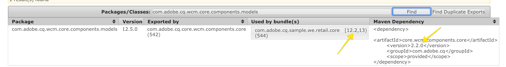

# Configurare un ambiente di sviluppo AEM locale

Guida alla configurazione di uno sviluppo locale per Adobe Experience Manager, AEM. Vengono trattati argomenti importanti relativi all’installazione locale, a Apache Maven, agli ambienti di sviluppo integrati e al debug/risoluzione dei problemi. Sono discussi lo sviluppo con **[!DNL Eclipse IDE], [!DNL CRXDE Lite], [!DNL Visual Studio Code] e[!DNL IntelliJ]**.

## Panoramica

L’impostazione di un ambiente di sviluppo locale è il primo passaggio nello sviluppo per Adobe Experience Manager o AEM. Prenditi del tempo per configurare un ambiente di sviluppo di qualità per aumentare la produttività e scrivere codice migliore, più velocemente. Possiamo spezzare un ambiente di sviluppo locale AEM in 4 aree:

* Istanze AEM locali
* [!DNL Apache Maven] progetto
* Ambienti di sviluppo integrati (IDE)
* Risoluzione dei problemi

## Installa istanze AEM locali

Quando ci riferiamo a un’istanza AEM locale, stiamo parlando di una copia di Adobe Experience Manager in esecuzione sul computer personale di uno sviluppatore. ****** Lo sviluppo AllAEM deve iniziare scrivendo ed eseguendo il codice su un&#39;istanza AEM locale.

Se hai poca esperienza con AEM, puoi installare due modalità di esecuzione di base: ***Autore*** e ***Pubblica***. Il ***Autore*** [runmode](https://helpx.adobe.com/experience-manager/6-5/sites/deploying/using/configure-runmodes.html) è l’ambiente che gli esperti di marketing digitale utilizzeranno per creare e gestire i contenuti. Durante lo sviluppo di **la parte più** del tempo, distribuirai il codice a un&#39;istanza di authoring. Questo consente di creare nuove pagine e di aggiungere e configurare componenti. AEM Sites è un CMS di authoring WYSIWYG e quindi la maggior parte dei CSS e JavaScript può essere testata rispetto a un’istanza di authoring.

È anche *critico* codice di test rispetto a un&#39;istanza locale ***Publish***. L&#39;istanza ***Publish*** è l&#39;ambiente AEM con cui i visitatori del sito web interagiranno. Mentre l&#39;istanza ***Publish*** è lo stesso stack di tecnologia dell&#39;istanza ***Author***, ci sono alcune distinzioni principali con le configurazioni e le autorizzazioni. Il codice deve essere *sempre* testato su un&#39;istanza locale ***Pubblica*** prima di essere promosso in ambienti di livello superiore.

### Passaggi

1. Assicurati che sia installato [Java](https://downloads.experiencecloud.adobe.com/content/software-distribution/en/general.html).
   * Preferisci [Java JDK 11](https://experience.adobe.com/#/downloads/content/software-distribution/en/general.html?1_group.propertyvalues.property=.%2Fjcr%3Acontent%2Fmetadata%2Fdc%3AsoftwareType&amp;1_group.property.operation=equals&amp;1_group.property.values.0_values=software-type%3Atooling&amp;orderby=%40jcr%3Acontent%2Fjcr%3AlastModified&amp;orderby.sort=desc&amp;layout=list p.offset=0&amp;p.limit=14) per AEM 6.5+
   * [Java JDK 8](https://www.oracle.com/technetwork/java/javase/downloads/index.html#JDK8) per versioni AEM precedenti a AEM 6.5
2. Ottieni una copia del [AEM QuickStart Jar e di un [!DNL license.properties]](https://helpx.adobe.com/experience-manager/6-5/sites/deploying/using/deploy.html#GettingtheSoftware).
3. Crea una struttura di cartelle sul computer come segue:

   ```plain
   ~/aem-sdk
       /author
       /publish
   ```

4. Rinomina il JAR [!DNL QuickStart] in ***aem-author-p4502.jar*** e posizionalo sotto la directory `/author`. Aggiungi il file ***[!DNL license.properties]*** sotto la directory `/author`.
5. Crea una copia del JAR [!DNL QuickStart], rinominalo in ***aem-publish-p4503.jar*** e inseriscilo sotto la directory `/publish`. Aggiungi una copia del file ***[!DNL license.properties]*** sotto la directory `/publish`.

   ```plain
   ~/aem-sdk
       /author
           + aem-author-p4502.jar
           + license.properties
       /publish
           + aem-publish-p4503.jar
           + license.properties
   ```

6. Fai doppio clic sul file ***aem-author-p4502.jar*** per installare l&#39;istanza **Author** . Verrà avviata l&#39;istanza di authoring, che viene eseguita sulla porta **4502** del computer locale.

   Fai doppio clic sul file ***aem-publish-p4503.jar*** per installare l&#39;istanza **Publish** . Verrà avviata l&#39;istanza Publish, in esecuzione sulla porta **4503** del computer locale.

   >[!NOTE]
   >
   >A seconda dell&#39;hardware del computer di sviluppo, può essere difficile che sia in esecuzione un&#39;istanza **Author che Publish** contemporaneamente. Raramente è necessario eseguire entrambe le operazioni contemporaneamente su una configurazione locale.

   Per ulteriori informazioni, consulta [Distribuzione e manutenzione di un&#39;istanza AEM](https://helpx.adobe.com/experience-manager/6-5/sites/deploying/using/deploy.html).

## Installa Apache Maven

***[!DNL Apache Maven]*** è uno strumento per gestire la procedura di creazione e distribuzione per i progetti basati su Java. AEM è una piattaforma basata su Java e [!DNL Maven] è il metodo standard per gestire il codice per un progetto AEM. Quando diciamo ***AEM Progetto Maven*** o semplicemente il progetto ***AEM***, ci riferiamo a un progetto Maven che include tutto il codice *personalizzato* del sito.

Tutti i progetti AEM devono essere realizzati sulla base dell&#39;ultima versione di **[!DNL AEM Project Archetype]**: [https://github.com/Adobe-Marketing-Cloud/aem-project-archetype](https://github.com/Adobe-Marketing-Cloud/aem-project-archetype). Il [!DNL AEM Project Archetype] creerà un bootstrap di un progetto AEM con alcuni codici e contenuti di esempio. Il [!DNL AEM Project Archetype] include anche **[!DNL AEM WCM Core Components]** configurato per essere utilizzato sul progetto.

>[!CAUTION]
>
>Quando si avvia un nuovo progetto, è consigliabile utilizzare la versione più recente dell’archetipo. Tieni presente che esistono più versioni dell’archetipo e che non tutte le versioni sono compatibili con le versioni precedenti di AEM.

### Passaggi

1. Scarica [Apache Maven](https://maven.apache.org/download.cgi)
2. Installa [Apache Maven](https://maven.apache.org/install.html) e assicurati che l&#39;installazione sia stata aggiunta alla riga di comando `PATH`.
   * [!DNL macOS] gli utenti possono installare Maven utilizzando  [Homebrew](https://brew.sh/)
3. Verificare che **[!DNL Maven]** sia installato aprendo un nuovo terminale di riga di comando ed eseguendo quanto segue:

   ```shell
   $ mvn --version
   Apache Maven 3.3.9
   Maven home: /Library/apache-maven-3.3.9
   Java version: 1.8.0_111, vendor: Oracle Corporation
   Java home: /Library/Java/JavaVirtualMachines/jdk1.8.0_111.jdk/Contents/Home/jre
   Default locale: en_US, platform encoding: UTF-8
   ```

4. Aggiungi il profilo **[!DNL adobe-public]** al file [!DNL Maven] [settings.xml](https://maven.apache.org/settings.html) per aggiungere automaticamente **[!DNL repo.adobe.com]** al processo di creazione maven.

5. Crea un file denominato `settings.xml` in `~/.m2/settings.xml` se non esiste già.

6. Aggiungi il profilo **[!DNL adobe-public]** al file `settings.xml` in base a [le istruzioni qui](https://repo.adobe.com/).

   Di seguito è riportato un esempio `settings.xml`. *Nota: è importante la convenzione di denominazione di  `settings.xml` e il posizionamento sotto la  `.m2` directory dell’utente.*

   ```xml
   <settings xmlns="https://maven.apache.org/SETTINGS/1.0.0"
     xmlns:xsi="https://www.w3.org/2001/XMLSchema-instance"
     xsi:schemaLocation="https://maven.apache.org/SETTINGS/1.0.0
                         https://maven.apache.org/xsd/settings-1.0.0.xsd">
   <profiles>
    <!-- ====================================================== -->
    <!-- A D O B E   P U B L I C   P R O F I L E                -->
    <!-- ====================================================== -->
        <profile>
            <id>adobe-public</id>
            <activation>
                <activeByDefault>true</activeByDefault>
            </activation>
            <properties>
                <releaseRepository-Id>adobe-public-releases</releaseRepository-Id>
                <releaseRepository-Name>Adobe Public Releases</releaseRepository-Name>
                <releaseRepository-URL>https://repo.adobe.com/nexus/content/groups/public</releaseRepository-URL>
            </properties>
            <repositories>
                <repository>
                    <id>adobe-public-releases</id>
                    <name>Adobe Public Repository</name>
                    <url>https://repo.adobe.com/nexus/content/groups/public</url>
                    <releases>
                        <enabled>true</enabled>
                        <updatePolicy>never</updatePolicy>
                    </releases>
                    <snapshots>
                        <enabled>false</enabled>
                    </snapshots>
                </repository>
            </repositories>
            <pluginRepositories>
                <pluginRepository>
                    <id>adobe-public-releases</id>
                    <name>Adobe Public Repository</name>
                    <url>https://repo.adobe.com/nexus/content/groups/public</url>
                    <releases>
                        <enabled>true</enabled>
                        <updatePolicy>never</updatePolicy>
                    </releases>
                    <snapshots>
                        <enabled>false</enabled>
                    </snapshots>
                </pluginRepository>
            </pluginRepositories>
        </profile>
   </profiles>
    <activeProfiles>
        <activeProfile>adobe-public</activeProfile>
    </activeProfiles>
   </settings>
   ```

7. Verifica che il profilo **adobe-public** sia attivo eseguendo il seguente comando:

   ```shell
   $ mvn help:effective-settings
   ...
   <activeProfiles>
       <activeProfile>adobe-public</activeProfile>
   </activeProfiles>
   <pluginGroups>
       <pluginGroup>org.apache.maven.plugins</pluginGroup>
       <pluginGroup>org.codehaus.mojo</pluginGroup>
   </pluginGroups>
   </settings>
   [INFO] ------------------------------------------------------------------------
   [INFO] BUILD SUCCESS
   [INFO] ------------------------------------------------------------------------
   [INFO] Total time:  0.856 s
   ```

   Se non vedi il **[!DNL adobe-public]**, indica che nel file `~/.m2/settings.xml` non è presente un riferimento corretto all&#39;archivio Adobe. Rivedi i passaggi precedenti e verifica che il file settings.xml faccia riferimento al repository Adobe.

## Configurare un ambiente di sviluppo integrato

Un ambiente di sviluppo integrato o IDE è un’applicazione che combina un editor di testo, supporto della sintassi e strumenti di compilazione. A seconda del tipo di sviluppo, un IDE potrebbe essere preferibile rispetto a un altro. Indipendentemente dall’IDE, sarà importante essere in grado di inviare periodicamente il codice ***push*** a un’istanza AEM locale per testarlo. Sarà anche importante ***estrarre*** configurazioni occasionali da un&#39;istanza AEM locale nel progetto AEM per persistere in un sistema di gestione del controllo del codice sorgente come Git.

Di seguito sono riportati alcuni degli IDE più popolari utilizzati con lo sviluppo AEM con video corrispondenti che mostrano l’integrazione con un’istanza AEM locale.

>[!NOTE]
>
> Il progetto WKND è stato aggiornato per impostazione predefinita per lavorare su AEM come Cloud Service. È stato aggiornato per essere compatibile con versioni precedenti con 6.5/6.4](https://github.com/adobe/aem-guides-wknd#building-for-aem-6xx). [ Se utilizzi AEM 6.5 o 6.4, aggiungi il profilo `classic` a qualsiasi comando Maven.

```shell
$ mvn clean install -PautoInstallSinglePackage -Pclassic
```

Quando utilizzi un IDE, assicurati di controllare `classic` nella scheda Profilo Maven.


*Profilo Maven IntelliJ*

### [!DNL Eclipse] IDE

Il **[[!DNL Eclipse] IDE](https://www.eclipse.org/ide/)** è uno degli IDE più popolari per lo sviluppo Java, in gran parte perché è open source e ***free***! Adobe fornisce un plug-in, **[[!DNL AEM Developer Tools]](https://experienceleague.adobe.com/docs/experience-manager-64/developing/devtools/aem-eclipse.html)**, per [!DNL Eclipse] per consentire uno sviluppo più semplice con una bella GUI per sincronizzare il codice con un&#39;istanza AEM locale. L’ [!DNL Eclipse] IDE è consigliato agli sviluppatori di AEM in larga parte a causa del supporto dell’interfaccia grafica di [!DNL AEM Developer Tools].

#### Installazione e configurazione

1. Scarica e installa l’ [!DNL Eclipse] IDE per [!DNL Java EE Developers]: [https://www.eclipse.org](https://www.eclipse.org/)
1. Segui le istruzioni per installare il plug-in [!DNL AEM Developer Tools]: [https://experienceleague.adobe.com/docs/experience-manager-64/developing/devtools/aem-eclipse.html](https://eclipse.adobe.com/aem/dev-tools/)

>[!VIDEO](https://video.tv.adobe.com/v/25906?quality=12&learn=on)

* 00:30 - Importa progetto Maven
* 01:24 - Creare e distribuire il codice sorgente con Maven
* 04:33 - Modifiche al codice push con AEM Developer Tool
* 10:55 - Modifiche al codice di pull con AEM Developer Tool
* 13:12 - Utilizzo degli strumenti di debug integrati di Eclipse

### IDEA IntelliJ

Il **[IntelliJ IDEA](https://www.jetbrains.com/idea/)** è un potente IDE per lo sviluppo Java professionale. [!DNL IntelliJ IDEA] viene fornito in due sapori, una  ****** [!DNL Community] freeedition e una  [!DNL Ultimate] versione commerciale (a pagamento). La versione gratuita [!DNL Community] di [!DNL IntellIJ IDEA] è sufficiente per uno sviluppo più AEM, tuttavia [!DNL Ultimate] [espande la propria funzionalità impostata](https://www.jetbrains.com/idea/download).

#### [!DNL Installation and Setup]

1. Scarica e installa [!DNL IntelliJ IDEA]: [https://www.jetbrains.com/idea/download](https://www.jetbrains.com/idea/download)
1. Installa [!DNL Repo] (strumento da riga di comando): [https://github.com/Adobe-Marketing-Cloud/tools/tree/master/repo](https://github.com/Adobe-Marketing-Cloud/tools/tree/master/repo#installation)

>[!VIDEO](https://video.tv.adobe.com/v/26089/?quality=12&learn=on)

* 00:00 - Importa progetto Maven
* 05:47 - Crea e distribuisci il codice sorgente con Maven
* 08:17 - Modifiche push con Repo
* 14:39 - Modifiche di pull con Repo
* 17:25 - Utilizzo degli strumenti di debug integrati di IntelliJ IDEA

### [!DNL Visual Studio Code]

**[Il ](https://code.visualstudio.com/)** codice di Visual Studio è diventato rapidamente uno strumento preferito per  ***gli sviluppatori*** front-end, con supporto JavaScript avanzato  [!DNL Intellisense]e supporto per il debug del browser. **[!DNL Visual Studio Code]** è open source, gratuito, con molte potenti estensioni. [!DNL Visual Studio Code] può essere impostato per l&#39;integrazione con AEM con l&#39;aiuto di uno strumento di Adobe,  **[repo](https://github.com/Adobe-Marketing-Cloud/tools/tree/master/repo#integration-into-visual-studio-code).** Sono inoltre disponibili diverse estensioni supportate dalla community che possono essere installate per l’integrazione con AEM.

[!DNL Visual Studio Code] è una grande scelta per gli sviluppatori front-end che scriveranno principalmente codice CSS/LESS e JavaScript per creare librerie client AEM. Questo strumento potrebbe non essere la scelta migliore per i nuovi sviluppatori AEM poiché le definizioni dei nodi (finestre di dialogo, componenti) dovranno essere modificate in XML non elaborato. Sono disponibili diverse estensioni Java per [!DNL Visual Studio Code], tuttavia se esegui principalmente lo sviluppo Java [!DNL Eclipse IDE] o [!DNL IntelliJ] può essere preferita.

#### Collegamenti importanti

* [****](https://code.visualstudio.com/Download) **Download del codice di Visual Studio**
* **[repo](https://github.com/Adobe-Marketing-Cloud/tools/tree/master/repo#integration-into-visual-studio-code)** : strumento simile a FTP per il contenuto JCR
* **[aemfeed](https://aemfed.io/)**  - velocizza il flusso di lavoro front-end AEM
* **[AEM Sync](https://marketplace.visualstudio.com/items?itemName=Yinkai15.aemsync)**  - Estensione supportata dalla community* per Visual Studio Code

>[!VIDEO](https://video.tv.adobe.com/v/25907?quality=12&learn=on)

* 00:30 - Importa progetto Maven
* 00:53 - Creare e distribuire il codice sorgente con Maven
* 04:03 - Modifiche al codice push con lo strumento a riga di comando Repo
* 08:29 - Modifiche al codice di pull con lo strumento della riga di comando Repo
* 10:40 - Modifiche al codice push con lo strumento aemfeed
* 14:24 - Risoluzione dei problemi e ricostruzione delle librerie client

### [!DNL CRXDE Lite]

[CRXDE ](https://helpx.adobe.com/experience-manager/6-4/sites/developing/using/developing-with-crxde-lite.html) Liteè una visualizzazione basata su browser dell&#39;archivio AEM. [!DNL CRXDE Lite] è incorporato in AEM e consente allo sviluppatore di eseguire attività di sviluppo standard come la modifica di file, la definizione di componenti, finestre di dialogo e modelli. [!DNL CRXDE Lite] non  ****** deve essere un ambiente di sviluppo completo, ma è molto efficace come strumento di debug. [!DNL CRXDE Lite] è utile quando estendi o semplicemente comprendi il codice prodotto al di fuori della tua base di codice. [!DNL CRXDE Lite] fornisce una visualizzazione potente dell&#39;archivio e un modo per testare e gestire in modo efficace le autorizzazioni.

[!DNL CRXDE Lite] deve essere sempre utilizzato insieme ad altri IDE per testare e eseguire il debug del codice, ma mai come strumento di sviluppo principale. Dispone di un supporto limitato per la sintassi, di funzionalità automatiche e di un&#39;integrazione limitata con i sistemi di gestione del controllo del codice sorgente.

>[!VIDEO](https://video.tv.adobe.com/v/25917?quality=12&learn=on)

## Risoluzione dei problemi

***Aiuto!*** Il mio codice non funziona! Come per tutto lo sviluppo, ci saranno momenti (probabilmente molti) in cui il codice non funziona come previsto. AEM è una piattaforma potente, ma con grande potere... arriva una grande complessità. Di seguito sono riportati alcuni punti di partenza di alto livello per la risoluzione dei problemi e il tracciamento dei problemi (ma ben lontani da un elenco completo delle cose che possono andare storte):

### Verifica distribuzione del codice

Un buon primo passo, quando si verifica un problema, è quello di verificare che il codice sia stato distribuito e installato correttamente in AEM.

1. **Controlla  [!UICONTROL Package]** Manager per assicurarti che il pacchetto di codice sia stato caricato e installato:  [http://localhost:4502/crx/packmgr/index.jsp](http://localhost:4502/crx/packmgr/index.jsp). Controlla la marca temporale per verificare che il pacchetto sia stato installato di recente.
1. Se esegui aggiornamenti incrementali dei file utilizzando uno strumento come [!DNL Repo] o [!DNL AEM Developer Tools], **controlla[!DNL CRXDE Lite]** che il file sia stato inviato all&#39;istanza AEM locale e che il contenuto del file sia aggiornato: [http://localhost:4502/crx/de/index.jsp](http://localhost:4502/crx/de/index.jsp)
1. **Controlla che il bundle sia** caricato per vedere i problemi relativi al codice Java in un bundle OSGi. Apri la [!UICONTROL Console Web Adobe Experience Manager]: [http://localhost:4502/system/console/bundles](http://localhost:4502/system/console/bundles) e cerca il tuo bundle. Assicurati che il bundle abbia uno stato **[!UICONTROL Attivo]** . Per ulteriori informazioni sulla risoluzione dei problemi relativi a un bundle in uno stato **[!UICONTROL Installed]** , vedi sotto.

#### Controlla i registri

AEM è una piattaforma chatty e registra molte informazioni utili nel **error.log**. Il file **error.log** si trova dove è stato installato AEM: &lt; `aem-installation-folder>/crx-quickstart/logs/error.log`.

Una tecnica utile per tenere traccia dei problemi consiste nell’aggiungere istruzioni di registro nel codice Java:

```java
import org.slf4j.Logger;
import org.slf4j.LoggerFactory;
...

public class MyClass {
    private final Logger log = LoggerFactory.getLogger(getClass());

    ...

    String myVariable = "My Variable";

    log.debug("Debug statement of myVariable {}", myVariable);

    log.info("Info statement of myVariable {}", myVariable);
}
```

Per impostazione predefinita, il file **error.log** è configurato per registrare le istruzioni *[!DNL INFO]*. Per modificare il livello di log, è possibile farlo andando su [!UICONTROL Supporto log]: [http://localhost:4502/system/console/slinglog](http://localhost:4502/system/console/slinglog). È inoltre possibile che il file **error.log** sia troppo chatty. Puoi usare il [!UICONTROL Supporto di log] per configurare le istruzioni di registro per un solo pacchetto Java specificato. Questa è una best practice per i progetti, al fine di separare facilmente i problemi di codice personalizzato dai problemi di piattaforma OOTB AEM.


#### Il bundle è in stato Installato {#bundle-active}

Tutti i bundle (esclusi i frammenti) devono essere in uno stato **[!UICONTROL Attivo]**. Se vedi il tuo bundle di codice in uno stato [!UICONTROL Installed] , c&#39;è un problema che deve essere risolto. Nella maggior parte dei casi si tratta di un problema di dipendenza:


Nella schermata precedente, lo stato [!DNL WKND Core bundle] è [!UICONTROL Installed] . Questo perché il bundle prevede una versione diversa di `com.adobe.cq.wcm.core.components.models` rispetto a quella disponibile nell&#39;istanza AEM.

Uno strumento utile che può essere utilizzato è il [!UICONTROL Finder dipendenza]: [http://localhost:4502/system/console/depfinder](http://localhost:4502/system/console/depfinder). Aggiungi il nome del pacchetto Java per controllare quale versione è disponibile nell&#39;istanza AEM:



Continuando con l&#39;esempio precedente, possiamo vedere che la versione installata sull&#39;istanza AEM è **12.2** rispetto a **12.6** che il bundle era in attesa. Da qui puoi lavorare all’indietro e vedere se le dipendenze [!DNL Maven] AEM corrispondono alle dipendenze [!DNL Maven] nel progetto AEM. Nell&#39;esempio precedente [!DNL Core Components] **v2.2.0** è installato nell&#39;istanza AEM, ma il bundle di codice è stato generato con una dipendenza da **v2.2.2**, quindi il motivo del problema di dipendenza.

#### Verifica la registrazione dei modelli Sling {#osgi-component-sling-models}

AEM componenti devono sempre essere supportati da un [!DNL Sling Model] per incapsulare qualsiasi logica di business e assicurarsi che lo script di rendering HTL rimanga pulito. Se si verificano problemi in cui non è possibile trovare il modello Sling, può essere utile controllare [!DNL Sling Models] dalla console: [http://localhost:4502/system/console/status-slingmodels](http://localhost:4502/system/console/status-slingmodels). Questo indica se il modello Sling è stato registrato e a quale tipo di risorsa (il percorso del componente) è associato.


Mostra la registrazione di un [!DNL Sling Model], `BylineImpl` associato a un tipo di risorsa componente di `wknd/components/content/byline`.

#### Problemi CSS o JavaScript

Per la maggior parte dei problemi CSS e JavaScript, l&#39;utilizzo degli strumenti di sviluppo del browser è il modo più efficace per risolvere i problemi. Per limitare il problema durante lo sviluppo rispetto a un’istanza di authoring AEM è utile visualizzare la pagina &quot;come pubblicata&quot;.


Apri il menu [!UICONTROL Proprietà pagina] e fai clic su [!UICONTROL Visualizza come pubblicato]. Viene aperta la pagina senza l’editor AEM e con un parametro di query impostato su **wcmmode=disabled**. In questo modo sarà possibile disattivare l’interfaccia utente di authoring AEM e semplificare la risoluzione dei problemi front-end e il debug.

Un altro problema riscontrato comunemente durante lo sviluppo di codice front-end è vecchio o CSS/JS obsoleto è in fase di caricamento. Come primo passo, assicurati che la cronologia del browser sia stata cancellata e, se necessario, avvia un browser in incognito o una nuova sessione.

#### Debug delle librerie client

Con diversi metodi di categorie e incorporamenti per includere più librerie client, può essere difficile risolvere i problemi. AEM espone diversi strumenti per aiutarti. Uno degli strumenti più importanti è [!UICONTROL Ricostruire le librerie client] che forzerà AEM ricompilare tutti i file LESS e generare il CSS.

* [Dump Libs](http://localhost:4502/libs/granite/ui/content/dumplibs.html)  - Elenca tutte le librerie client registrate nell&#39;istanza AEM. &lt;host>/libs/granite/ui/content/dumplibs.html
* [Output del test](http://localhost:4502/libs/granite/ui/content/dumplibs.test.html) : consente a un utente di visualizzare l&#39;output HTML previsto di clientlib include in base alla categoria. &lt;host>/libs/granite/ui/content/dumplibs.test.html
* [Convalida delle dipendenze delle librerie](http://localhost:4502/libs/granite/ui/content/dumplibs.validate.html) : evidenzia tutte le dipendenze o le categorie incorporate che non è possibile trovare. &lt;host>/libs/granite/ui/content/dumplibs.validate.html
* [Rigenera librerie client](http://localhost:4502/libs/granite/ui/content/dumplibs.rebuild.html) : consente a un utente di forzare AEM a ricostruire tutte le librerie client o di annullare la validità della cache delle librerie client. Questo strumento è particolarmente efficace quando si sviluppa con LESS in quanto può forzare AEM a ricompilare il CSS generato. In generale, è più efficace annullare la validità delle cache, quindi eseguire un aggiornamento della pagina anziché ricostruire tutte le librerie. &lt;host>/libs/granite/ui/content/dumplibs.rebuild.html


>[!NOTE]
>
>Se devi continuamente annullare la validità della cache utilizzando lo strumento [!UICONTROL Rigenera librerie client] , potrebbe essere utile eseguire una sola volta la rigenerazione di tutte le librerie client. Questo può richiedere circa 15 minuti, ma in genere elimina eventuali problemi di memorizzazione in cache in futuro.
