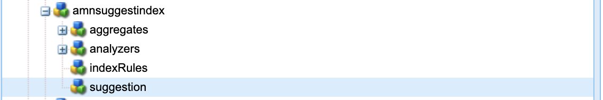

# Best practice per l’indicizzazione nell’AEM

Scopri le best practice di indicizzazione in Adobe Experience Manager (AEM). Apache [Jackrabbit Oak](https://jackrabbit.apache.org/oak/docs/query/query.html) potenzia la ricerca di contenuti in AEM e i seguenti sono punti chiave:

- Come funzione integrata, AEM fornisce vari indici per supportare le funzionalità di ricerca e query, ad esempio `damAssetLucene`, `cqPageLucene` e altro ancora.
- Tutte le definizioni degli indici sono memorizzate nell’archivio in `/oak:index` nodo.
- AEM as a Cloud Service supporta solo gli indici Oak Lucene.
- La configurazione dell’indice deve essere gestita nella base di codice del progetto AEM e distribuita utilizzando le pipeline CI/CD di Cloud Manager.
- Se per una determinata query sono disponibili più indici, il **viene utilizzato un indice con il costo stimato più basso**.
- Se non è disponibile alcun indice per una determinata query, la struttura del contenuto viene attraversata per trovare il contenuto corrispondente. Tuttavia, il limite predefinito tramite `org.apache.jackrabbit.oak.query.QueryEngineSettingsService` deve attraversare solo 10.000 nodi.
- I risultati di una query sono **filtrato all&#39;ultimo** per garantire che l&#39;utente corrente disponga dell&#39;accesso in lettura. Ciò significa che i risultati della query potrebbero essere inferiori al numero di nodi indicizzati.
- La reindicizzazione dell’archivio dopo le modifiche della definizione dell’indice richiede tempo e dipende dalle dimensioni dell’archivio.

Per disporre di una funzionalità di ricerca efficiente e corretta che non influisca sulle prestazioni dell’istanza AEM, è importante comprendere le best practice per l’indicizzazione.

## Indice personalizzato e OOTB

A volte, è necessario creare indici personalizzati per supportare i requisiti di ricerca. Tuttavia, segui le linee guida riportate di seguito prima di creare indici personalizzati:

- Comprendi i requisiti di ricerca e verifica se gli indici OOTB possono supportare i requisiti di ricerca. Utilizzare **Strumento Prestazioni query**, disponibile all’indirizzo [SDK locale](http://localhost:4502/libs/granite/operations/content/diagnosistools/queryPerformance.html) e AEMCS tramite Developer Console oppure `https://author-pXXXX-eYYYY.adobeaemcloud.com/ui#/aem/libs/granite/operations/content/diagnosistools/queryPerformance.html?appId=aemshell`.

- Definisci una query ottimale, utilizza [ottimizzazione delle query](https://experienceleague.adobe.com/docs/experience-manager-cloud-service/content/operations/query-and-indexing-best-practices.html?#optimizing-queries) diagramma di flusso e [Scheda di riferimento rapido per le query JCR](https://experienceleague.adobe.com/docs/experience-manager-65/assets/JCR_query_cheatsheet-v1.1.pdf?lang=en) per riferimento.

- Se gli indici OOTB non supportano i requisiti di ricerca, sono disponibili due opzioni. Tuttavia, è necessario rivedere [Suggerimenti per la creazione di indici efficienti](https://experienceleague.adobe.com/docs/experience-manager-65/content/implementing/deploying/practices/best-practices-for-queries-and-indexing.html?#should-i-create-an-index)
   - Personalizza l’indice OOTB: opzione preferita in quanto è facile da mantenere e aggiornare.
   - Indice completamente personalizzato: solo se l’opzione precedente non funziona.

### Personalizzare l’indice OOTB

- In entrata **AEMCS**, quando si personalizza l’utilizzo dell’indice OOTB **\&lt;ootbindexname>-\&lt;productversion>-custom-\&lt;customversion>** convenzione di denominazione. Ad esempio: `cqPageLucene-custom-1` o `damAssetLucene-8-custom-1`. Questo consente di unire la definizione dell’indice personalizzato ogni volta che l’indice OOTB viene aggiornato. Consulta [Modifiche agli indici predefiniti](https://experienceleague.adobe.com/docs/experience-manager-cloud-service/content/operations/indexing.html?#changes-to-out-of-the-box-indexes) per ulteriori dettagli.

- In entrata **AEM 6.X**, la denominazione precedente _non funziona_, tuttavia è sufficiente aggiornare l’indice OOTB con proprietà aggiuntive nella sezione `indexRules` nodo.

- Copia sempre la definizione più recente dell’indice OOTB dall’istanza AEM utilizzando CRX DE Package Manager (/crx/packmgr/), rinominala e aggiungi personalizzazioni all’interno del file XML.

- Memorizza la definizione dell’indice nel progetto AEM in `ui.apps/src/main/content/jcr_root/_oak_index` e distribuiscilo utilizzando le pipeline CI/CD di Cloud Manager. Consulta [Distribuzione di definizioni indice personalizzate](https://experienceleague.adobe.com/docs/experience-manager-cloud-service/content/operations/indexing.html?#deploying-custom-index-definitions) per ulteriori dettagli.

### Indice completamente personalizzato

La creazione di un indice completamente personalizzato deve essere l’ultima opzione disponibile e solo se quella precedente non funziona.

- Quando crei un indice completamente personalizzato, utilizza **\&lt;prefix>.\&lt;customindexname>-\&lt;version>-custom-\&lt;customversion>** convenzione di denominazione. Ad esempio: `wknd.adventures-1-custom-1`. Questo consente di evitare conflitti di denominazione. Qui, `wknd` è il prefisso `adventures` è il nome dell’indice personalizzato. Questa convenzione è applicabile sia per AEM 6.X che per AEMCS e aiuta a preparare la futura migrazione ad AEMCS.

- AEMCS supporta solo gli indici Lucene; pertanto, per prepararsi alla futura migrazione ad AEMCS, utilizza sempre gli indici Lucene. Consulta [Indici Lucene e indici proprietà](https://experienceleague.adobe.com/docs/experience-manager-65/content/implementing/deploying/practices/best-practices-for-queries-and-indexing.html?#lucene-or-property-indexes) per ulteriori dettagli.

- Evita di creare un indice personalizzato sullo stesso tipo di nodo dell’indice OOTB. Puoi invece personalizzare l’indice OOTB con proprietà aggiuntive nella sezione `indexRules` nodo. Ad esempio, non creare un indice personalizzato sul `dam:Asset` tipo di nodo, ma personalizza la `damAssetLucene` indice. _È stata una causa comune di problemi funzionali e di prestazioni_.

- Inoltre, evita di aggiungere più tipi di nodo, ad esempio `cq:Page` e `cq:Tag` nelle regole di indicizzazione (`indexRules`). È invece possibile creare indici separati per ogni tipo di nodo.

- Come menzionato nella sezione precedente, memorizza la definizione dell’indice nel progetto AEM all’indirizzo `ui.apps/src/main/content/jcr_root/_oak_index` e distribuiscilo utilizzando le pipeline CI/CD di Cloud Manager. Consulta [Distribuzione di definizioni indice personalizzate](https://experienceleague.adobe.com/docs/experience-manager-cloud-service/content/operations/indexing.html?#deploying-custom-index-definitions) per ulteriori dettagli.

- Le linee guida per la definizione dell’indice sono:
   - Tipo di nodo (`jcr:primaryType`) dovrebbe essere `oak:QueryIndexDefinition`
   - Tipo di indice (`type`) dovrebbe essere `lucene`
   - Proprietà asincrona (`async`) dovrebbe essere `async,nrt`
   - Utilizzare `includedPaths` ed evitare `excludedPaths` proprietà. Sempre impostato `queryPaths` allo stesso valore di `includedPaths` valore.
   - Per applicare la restrizione del percorso, utilizzare `evaluatePathRestrictions` e impostarla su `true`.
   - Utilizzare `tags` proprietà per assegnare tag all&#39;indice e durante la query specificare il valore dei tag per utilizzare l&#39;indice. La sintassi generale della query è `<query> option(index tag <tagName>)`.

  ```xml
  /oak:index/wknd.adventures-1-custom-1
      - jcr:primaryType = "oak:QueryIndexDefinition"
      - type = "lucene"
      - compatVersion = 2
      - async = ["async", "nrt"]
      - includedPaths = ["/content/wknd"]
      - queryPaths = ["/content/wknd"]
      - evaluatePathRestrictions = true
      - tags = ["customAdvSearch"]
  ...
  ```

### Esempi

Per comprendere le best practice, esaminiamo alcuni esempi.

#### Utilizzo non corretto della proprietà tags

L’immagine seguente mostra la definizione dell’indice personalizzata e incorporata, evidenziando `tags` , entrambi gli indici utilizzano lo stesso `visualSimilaritySearch` valore.


##### Analisi

Si tratta di un utilizzo improprio del `tags` nell&#39;indice personalizzato. Il motore di query Oak seleziona l’indice personalizzato rispetto alla causa dell’indice OOTB con il costo stimato più basso.

Il modo corretto è personalizzare l’indice OOTB e aggiungere proprietà aggiuntive nel `indexRules` nodo. Consulta [Personalizzazione dell’indice OOTB](#customize-the-ootb-index) per ulteriori dettagli.

#### Indice sul `dam:Asset` tipo di nodo

L’immagine seguente mostra l’indice personalizzato per `dam:Asset` tipo di nodo con `includedPaths` impostata su un percorso specifico.


##### Analisi

Se esegui una ricerca omnisearch su Assets, restituisce risultati non corretti in quanto l’indice personalizzato presenta un costo stimato inferiore.

Non creare un indice personalizzato sul `dam:Asset` tipo di nodo, ma personalizza la `damAssetLucene` con proprietà aggiuntive nel `indexRules` nodo.

#### Più tipi di nodo nelle regole di indicizzazione

L’immagine seguente mostra l’indice personalizzato con più tipi di nodo sotto il `indexRules` nodo.


##### Analisi

Non è consigliabile aggiungere più tipi di nodo in un singolo indice, tuttavia, è consigliabile indicizzare i tipi di nodo nello stesso indice se i tipi di nodo sono strettamente correlati, ad esempio `cq:Page` e `cq:PageContent`.

Una soluzione valida è quella di personalizzare la `cqPageLucene` e `damAssetLucene` , aggiungi ulteriori proprietà sotto il `indexRules` nodo.

#### Assenza di `queryPaths` proprietà

L’immagine seguente mostra l’indice personalizzato (non seguendo anche la convenzione di denominazione) senza `queryPaths` proprietà.


##### Analisi

Sempre impostato `queryPaths` allo stesso valore di `includedPaths` valore. Inoltre, per applicare la restrizione del percorso, impostare `evaluatePathRestrictions` proprietà a `true`.

#### Query con tag di indice

L’immagine seguente mostra l’indice personalizzato con `tags` e come utilizzarla durante la query.


```
/jcr:root/content/dam//element(*,dam:Asset)[(jcr:content/@contentFragment = 'true' and jcr:contains(., '/content/sitebuilder/test/mysite/live/ja-jp/mypage'))]order by @jcr:created descending option (index tag assetPrefixNodeNameSearch)
```

##### Analisi

Dimostra come impostare in modo corretto e non in conflitto `tags` valore della proprietà nell&#39;indice e utilizzarlo durante la query. La sintassi generale della query è `<query> option(index tag <tagName>)`. Vedi anche [Tag indice opzione query](https://jackrabbit.apache.org/oak/docs/query/query-engine.html#query-option-index-tag)

#### Indice personalizzato

L’immagine seguente mostra l’indice personalizzato con `suggestion` per ottenere la funzionalità di ricerca avanzata.



##### Analisi

È un caso d’uso valido creare un indice personalizzato per [ricerca avanzata](https://jackrabbit.apache.org/oak/docs/query/lucene.html#advanced-search-features) funzionalità. Tuttavia, il nome dell’indice deve seguire il **\&lt;prefix>.\&lt;customindexname>-\&lt;version>-custom-\&lt;customversion>** convenzione di denominazione.


## Strumenti utili

Esaminiamo alcuni strumenti che possono aiutarti a definire, analizzare e ottimizzare gli indici.

### Strumento di creazione dell’indice

Il [Generatore definizione indice Oak](https://oakutils.appspot.com/generate/index) aiuto dello strumento **per generare la definizione dell’indice** in base alle query di input. È un buon punto di partenza per creare un indice personalizzato.

### Strumento Analizza indice

Il [Analisi definizione indice](https://oakutils.appspot.com/analyze/index) aiuto dello strumento **analizzare la definizione dell’indice** e fornisce consigli per migliorare la definizione dell’indice.

### Strumento Prestazioni query

La soluzione _Strumento Prestazioni query_ disponibile all&#39;indirizzo [SDK locale](http://localhost:4502/libs/granite/operations/content/diagnosistools/queryPerformance.html) e AEMCS tramite Developer Console oppure `https://author-pXXXX-eYYYY.adobeaemcloud.com/ui#/aem/libs/granite/operations/content/diagnosistools/queryPerformance.html?appId=aemshell` aiuta **per analizzare le prestazioni della query** e [Scheda di riferimento rapido per le query JCR](https://experienceleague.adobe.com/docs/experience-manager-65/assets/JCR_query_cheatsheet-v1.1.pdf?lang=en) per definire la query ottimale.

### Strumenti e suggerimenti per la risoluzione dei problemi

La maggior parte dei seguenti sono applicabili per AEM 6.X e per la risoluzione dei problemi locali.

- Gestore indice disponibile all’indirizzo `http://host:port/libs/granite/operations/content/diagnosistools/indexManager.html` per ottenere informazioni sull’indice come tipo, ultimo aggiornamento, dimensione.

- Registrazione dettagliata della query Oak e pacchetti Java™ relativi all’indicizzazione come `org.apache.jackrabbit.oak.plugins.index`, `org.apache.jackrabbit.oak.query`, e `com.day.cq.search` tramite `http://host:port/system/console/slinglog` per la risoluzione dei problemi.

- MBean JMX di _IndexStats_ Tipo disponibile all&#39;indirizzo `http://host:port/system/console/jmx` per ottenere informazioni sull’indice come stato, avanzamento o statistiche relative all’indicizzazione asincrona. Fornisce inoltre _FailingIndexStats_, se non ci sono risultati qui, significa che nessun indice è danneggiato. AsyncIndexerService contrassegna qualsiasi indice che non viene aggiornato per 30 minuti (configurabile) come danneggiato e interrompe l’indicizzazione. Se una query non fornisce i risultati previsti, è utile che gli sviluppatori la verifichino prima di procedere con la reindicizzazione, in quanto è computazionalmente costosa e richiede tempo.

- MBean JMX di _LuceneIndex_ Tipo disponibile all&#39;indirizzo `http://host:port/system/console/jmx` per le statistiche dell&#39;indice di Lucene come dimensione, numero di documenti per definizione dell&#39;indice.

- MBean JMX di _QueryStat_ Tipo disponibile all&#39;indirizzo `http://host:port/system/console/jmx` per le statistiche delle query Oak, comprese le query lente e popolari con dettagli quali query, tempo di esecuzione.

## Risorse aggiuntive

Per ulteriori informazioni, consulta la seguente documentazione:

- [Query e indicizzazione Oak](https://experienceleague.adobe.com/docs/experience-manager-65/content/implementing/deploying/deploying/queries-and-indexing.html)
- [Best practice per query e indicizzazione](https://experienceleague.adobe.com/docs/experience-manager-cloud-service/content/operations/query-and-indexing-best-practices.html)
- [Best practice per query e indicizzazione](https://experienceleague.adobe.com/docs/experience-manager-65/content/implementing/deploying/practices/best-practices-for-queries-and-indexing.html)
