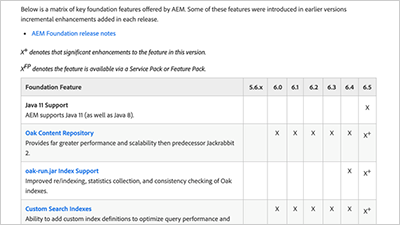

# Video ed esercitazioni di AEM Foundation {#overview}

Adobe Experience Manager fornisce un set comune di funzionalità disponibili per gli utenti di AEM Sites, Assets e Forms.

## Novità

* **[Utilizza AEM flusso di lavoro (video)](./workflow/use-workflow.md)**

   *Il flusso di lavoro dell’AEM consente di collaborare, gestire ed elaborare i contenuti all’interno dell’AEM.*

* **[Comprendere Cloud Manager per AEM (video)](./cloud-manager/understand-cloud-manager-for-aem.md)**\
   *Cloud Manager per AEM consente di gestire, ispezionare e gestire in modo autonomo gli ambienti AEM.*

* **[Utilizzare la pipeline CI/CD di Cloud Manager (video)](./cloud-manager/use-the-cicd-pipeline-in-cloud-manager-for-aem.md)**\
   *Scopri come utilizzare la pipeline CI/CD di Cloud Manager per garantire distribuzioni sicure e coerenti.*

## Scelte del personale

<table>
<tr>
  <td>
    
    

     <a href="./cloud-manager/understand-cloud-manager-for-aem.md">
    <strong>Comprendere Cloud Manager per AEM</strong>
    </a>
    

    

    <em>Cloud Manager per AEM fornisce una soluzione semplice ma solida che consente di gestire, ispezionare e gestire in modo autonomo gli ambienti AEM.</em>
    

  </td>
   <td>
    
     

     <a href="./development/set-up-sling-dynamic-include.md">
    <strong>Configurazione di Sling Dynamic Include (SDI)</strong>
    </a>
    

    

    <em>Scopri come impostare Sling Dynamic Include (SDI) e consentire ai componenti AEM dinamici di distribuire sempre contenuti freschi.</em>
    

  </td>
  <td>
    
    

    <a href="./administration/understand-reasons-to-upgrade.md">
    <strong>Perché aggiornare l’AEM</strong>
    </a>
    

    

    <em>Una suddivisione ad alto livello delle funzioni chiave da comprendere, quando si prende in considerazione l’aggiornamento alla versione più recente dell’AEM.</em>
    

  </td>
</tr>
</table>

## Risorse aggiuntive

* [Tutorial su AEM as a Cloud Service](/help/cloud-service/overview.md)
* [Video e tutorial su AEM Sites](/help/sites/overview.md)
* [Video e tutorial su AEM Assets](/help/assets/overview.md)
* [Video e tutorial su AEM Forms](/help/forms/overview.md)
