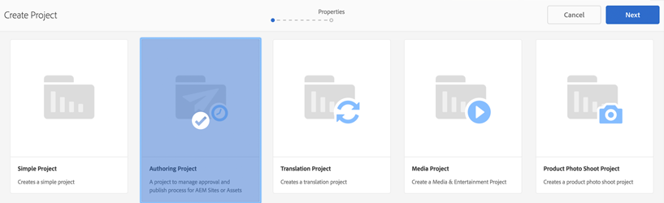

# Sviluppare progetti in AEM

Questo tutorial di sviluppo illustra come sviluppare per [!DNL AEM Projects]. In questo tutorial verrà creato un modello di progetto personalizzato che può essere utilizzato per creare progetti in AEM per gestire flussi di lavoro e attività di authoring dei contenuti.

>[!VIDEO](https://video.tv.adobe.com/v/16904?quality=12&learn=on)

*Questo video offre una breve dimostrazione del flusso di lavoro completato creato nell’esercitazione seguente.*

## Introduzione {#introduction}

[[!DNL AEM Projects]](https://docs.adobe.com/content/help/en/experience-manager-65/authoring/projects/projects.html) è una funzione dell’AEM progettata per semplificare la gestione e il raggruppamento di tutti i flussi di lavoro e le attività associati alla creazione di contenuti come parte di un’implementazione di AEM Sites o Assets.

Progetti AEM viene fornito con diversi [Modelli di progetto preconfigurati](https://docs.adobe.com/content/help/en/experience-manager-65/authoring/projects/projects.html). Durante la creazione di un progetto, gli autori possono scegliere tra questi modelli disponibili. Le implementazioni di grandi dimensioni dell’AEM con requisiti di business univoci richiedono la creazione di modelli di progetto personalizzati, personalizzati in base alle esigenze. Creando un modello di progetto personalizzato, gli sviluppatori possono configurare il dashboard del progetto, connettersi ai flussi di lavoro personalizzati e creare ruoli di business aggiuntivi per un progetto. Esamineremo la struttura di un modello di progetto e ne creeremo uno di esempio.


## Configurazione

Questo tutorial illustra il codice necessario per creare un modello di progetto personalizzato. È possibile scaricare e installare [pacchetto allegato](./assets/develop-aem-projects/projects-tasks-guide.ui.apps-0.0.1-SNAPSHOT.zip) in un ambiente locale da seguire insieme all’esercitazione. Puoi anche accedere all’intero progetto Maven in hosting su [GitHub](https://github.com/Adobe-Marketing-Cloud/aem-guides/tree/feature/projects-tasks-guide).

* [Pacchetto tutorial completato](./assets/develop-aem-projects/projects-tasks-guide.ui.apps-0.0.1-SNAPSHOT.zip)
* [Archivio completo del codice su GitHub](https://github.com/Adobe-Marketing-Cloud/aem-guides/tree/feature/projects-tasks-guide)

Questo tutorial presuppone una conoscenza di base di [Pratiche di sviluppo dell&#39;AEM](https://docs.adobe.com/content/help/en/experience-manager-65/developing/introduction/the-basics.html) e una certa familiarità con [Configurazione del progetto AEM Maven](https://docs.adobe.com/content/help/en/experience-manager-65/developing/devtools/ht-projects-maven.html). Tutto il codice menzionato è destinato a essere utilizzato come riferimento e deve essere distribuito solo a un [sviluppo locale istanza AEM](https://docs.adobe.com/content/help/en/experience-manager-65/deploying/deploying/deploy.html).

## Struttura di un modello di progetto

I modelli di progetto devono essere inseriti nel controllo del codice sorgente e trovarsi nella cartella dell’applicazione in /apps. Idealmente dovrebbero essere posizionate in una sottocartella con la convenzione di denominazione di **&#42;/projects/templates/**&lt;my-template>. Utilizzando questa convenzione per i nomi, eventuali nuovi modelli personalizzati diventano automaticamente disponibili per gli autori durante la creazione di un progetto. La configurazione dei modelli di progetto disponibili è impostata su: **/content/projects/jcr:content** nodo in base al **cq:allowedTemplates** proprietà. Per impostazione predefinita, questa è un’espressione regolare: **/(apps|libs)/.&#42;/projects/templates/.&#42;**

Il nodo principale di un modello di progetto avrà **jcr:primaryType** di **cq:Template**. Sotto il nodo principale di sono presenti tre nodi: **gadget**, **ruoli**, e **workflow**. Questi nodi sono tutti **nt:unstructured**. Sotto il nodo principale può trovarsi anche un file thumbnail.png che viene visualizzato quando si seleziona il modello nella procedura guidata Crea progetto.

Struttura completa dei nodi:

```shell
/apps/<my-app>
    + projects (nt:folder)
         + templates (nt:folder)
              + <project-template-root> (cq:Template)
                   + gadgets (nt:unstructured)
                   + roles (nt:unstructured)
                   + workflows (nt:unstructured)
```

### Directory principale modello di progetto

Il nodo principale del modello di progetto è di tipo **cq:Template**. In questo nodo puoi configurare le proprietà **jcr:title** e **jcr:descrizione** visualizzato nella Creazione guidata progetto. Esiste anche una proprietà denominata **procedura guidata** che punta a un modulo che popolerà le Proprietà del progetto. Il valore predefinito di: **/libs/cq/core/content/projects/wizard/steps/defaultproject.html** funziona correttamente per la maggior parte dei casi, in quanto consente all’utente di popolare le proprietà di progetto di base e aggiungere membri al gruppo.

*&#42;Nota: la Creazione guidata progetto non utilizza il servlet Sling POST. Invece, i valori vengono inviati a un servlet personalizzato:**com.adobe.cq.projects.impl.servlet.ProjectServlet**. Da tenere in considerazione quando si aggiungono campi personalizzati.*

Un esempio di procedura guidata personalizzata è disponibile per il modello di progetto di traduzione: **/libs/cq/core/content/projects/wizard/translationproject/defaultproject**.

### Gadget {#gadgets}

Su questo nodo non sono presenti proprietà aggiuntive, ma i figli del nodo gadget controllano quali tessere di progetto popolano il dashboard del progetto quando viene creato un nuovo progetto. [Riquadri progetto](https://docs.adobe.com/content/help/en/experience-manager-65/authoring/projects/projects.html) (noti anche come gadget o pod) sono schede semplici che popolano l’area di lavoro di un progetto. Un elenco completo delle tessere ootb è disponibile in: **/libs/cq/gui/components/projects/admin/pod. **I proprietari dei progetti possono sempre aggiungere/rimuovere tessere dopo la creazione di un progetto.

### Ruoli {#roles}

Sono tre [Ruoli predefiniti](https://docs.adobe.com/content/help/en/experience-manager-65/authoring/projects/projects.html) per ogni progetto: **Osservatori**, **Editor**, e **Proprietari**. Aggiungendo nodi secondari sotto il nodo dei ruoli, puoi aggiungere ulteriori Ruoli di progetto specifici per l’azienda per il modello. Puoi quindi collegare questi ruoli a flussi di lavoro specifici associati al progetto.

### Flussi di lavoro {#workflows}

Uno dei motivi più interessanti per la creazione di un modello di progetto personalizzato è la possibilità di configurare i flussi di lavoro disponibili per l’utilizzo con il progetto. che possono generare flussi di lavoro integrati o personalizzati. Sotto **workflow** nodo deve essere un **modelli** nodo (anche `nt:unstructured`) e nodi secondari sotto specificano i modelli di flusso di lavoro disponibili. La proprietà **modelId **punta al modello di flusso di lavoro in /etc/workflow e alla proprietà **procedura guidata** punta alla finestra di dialogo utilizzata all’avvio del flusso di lavoro. Un vantaggio significativo di Projects è la possibilità di aggiungere una finestra di dialogo personalizzata (procedura guidata) per acquisire metadati specifici dell’azienda all’inizio del flusso di lavoro, che può stimolare ulteriori azioni all’interno del flusso di lavoro.

```shell
<projects-template-root> (cq:Template)
    + workflows (nt:unstructured)
         + models (nt:unstructured)
              + <workflow-model> (nt:unstructured)
                   - modelId = points to the workflow model
                   - wizard = dialog used to start the workflow
```

## Creazione di un modello di progetto {#creating-project-template}

Poiché stiamo principalmente copiando/configurando nodi, utilizzeremo CRXDE Liti. Nell’istanza AEM locale, apri [CRXDE Liti](http://localhost:4502/crx/de/index.jsp).

1. Per iniziare, crea una cartella sotto `/apps/&lt;your-app-folder&gt;` denominato `projects`. Crea un’altra cartella sotto a quella denominata `templates`.

   ```shell
   /apps/aem-guides/projects-tasks/
                       + projects (nt:folder)
                                + templates (nt:folder)
   ```

1. Per semplificare le operazioni, il modello personalizzato verrà avviato dal modello di progetto semplice esistente.

   1. Copiare e incollare il nodo **/libs/cq/core/content/projects/templates/default** sotto *modelli* cartella creata al passaggio 1.

   ```shell
   /apps/aem-guides/projects-tasks/
                + templates (nt:folder)
                     + default (cq:Template)
   ```

1. Ora dovresti avere un percorso come **/apps/aem-guides/projects-tasks/projects/templates/authoring-project**.

   1. Modifica il **jcr:title** e **jcr:descrizione** proprietà del nodo autore-progetto per personalizzare i valori del titolo e della descrizione.

      1. Lascia **procedura guidata** proprietà che punta alle proprietà predefinite di Project.

   ```shell
   /apps/aem-guides/projects-tasks/projects/
            + templates (nt:folder)
                 + authoring-project (cq:Template)
                      - jcr:title = "Authoring Project"
                      - jcr:description = "A project to manage approval and publish process for AEM Sites or Assets"
                      - wizard = "/libs/cq/core/content/projects/wizard/steps/defaultproject.html"
   ```

1. Per questo modello di progetto vogliamo utilizzare le Attività.
   1. Aggiungi un nuovo **nt:unstructured** nodo sotto authoring-project/gadgets denominato **attività**.
   1. Aggiungi proprietà stringa al nodo attività per **cardWeight** = &quot;100&quot; **jcr:title**=&quot;Tasks&quot;, e **sling:resourceType**=&quot;cq/gui/components/projects/admin/pod/taskpod&quot;.

   Ora il [Riquadro Attività](https://experienceleague.adobe.com/docs/#Tasks) viene visualizzato per impostazione predefinita quando viene creato un nuovo progetto.

   ```shell
   ../projects/templates/authoring-project
       + gadgets (nt:unstructured)
            + team (nt:unstructured)
            + asset (nt:unstructured)
            + work (nt:unstructured)
            + experiences (nt:unstructured)
            + projectinfo (nt:unstructured)
            ..
            + tasks (nt:unstructured)
                 - cardWeight = "100"
                 - jcr:title = "Tasks"
                 - sling:resourceType = "cq/gui/components/projects/admin/pod/taskpod"
   ```

1. Al modello di progetto verrà aggiunto un Ruolo Approvatore personalizzato.

   1. Sotto il nodo del modello di progetto (authoring-project) aggiungi un nuovo **nt:unstructured** con etichetta di nodo **ruoli**.
   1. Aggiungi un altro **nt:unstructured** nodo etichettato approvatori come figlio del nodo ruoli.
   1. Aggiungi proprietà stringa **jcr:title** = &quot;**Approvatori**&quot;, **rotocalco** =&quot;**proprietario**&quot;, **roleid**=&quot;**approvatori**&quot;.
      1. Il nome del nodo approvatori, nonché jcr:title e roleid possono essere qualsiasi valore stringa (purché roleid sia univoco).
      1. **rotocalco** disciplina le autorizzazioni applicate per quel ruolo in base al [tre ruoli preconfigurati](https://docs.adobe.com/content/docs/en/aem/6-3/author/projects.html): **proprietario**, **editor**, e **osservatore**.
      1. In generale, se il ruolo personalizzato è più di un ruolo manageriale, allora la classe a rulli può essere **proprietario;** se si tratta di un ruolo di authoring più specifico come Fotografo o Designer **editor** la lente a rotelle dovrebbe bastare. La grande differenza tra **proprietario** e **editor** I proprietari del progetto possono aggiornare le proprietà del progetto e aggiungere nuovi utenti al progetto.

   ```shell
   ../projects/templates/authoring-project
       + gadgets (nt:unstructured)
       + roles (nt:unstructured)
           + approvers (nt:unstructured)
                - jcr:title = "Approvers"
                - roleclass = "owner"
                - roleid = "approver"
   ```

1. Copiando il modello Progetto semplice, otterrai quattro flussi di lavoro integrati configurati. Ogni nodo sotto i flussi di lavoro/modelli punta a un flusso di lavoro specifico e a una procedura guidata di dialogo iniziale per tale flusso di lavoro. Più avanti in questo tutorial verrà creato un flusso di lavoro personalizzato per questo progetto. Per il momento, elimina i nodi sotto il flusso di lavoro o i modelli:

   ```shell
   ../projects/templates/authoring-project
       + gadgets (nt:unstructured)
       + roles (nt:unstructured)
       + workflows (nt:unstructured)
            + models (nt:unstructured)
               - (remove ootb models)
   ```

1. Per facilitare agli autori di contenuti l’identificazione del modello di progetto, puoi aggiungere una miniatura personalizzata. La dimensione consigliata è di 319x319 pixel.
   1. In CRXDE Liti crea un file come elemento di pari livello di gadget, ruoli e nodi di workflow denominati **thumbnail.png**.
   1. Salva e quindi accedi al `jcr:content` e fare doppio clic su `jcr:data` (evitare di fare clic su &#39;visualizza&#39;).
      1. Dovresti ricevere una modifica `jcr:data` e puoi caricare una miniatura personalizzata.

   ```shell
   ../projects/templates/authoring-project
       + gadgets (nt:unstructured)
       + roles (nt:unstructured)
       + workflows (nt:unstructured)
       + thumbnail.png (nt:file)
   ```

Rappresentazione XML completata del modello di progetto:

```xml
<?xml version="1.0" encoding="UTF-8"?>
<jcr:root xmlns:sling="http://sling.apache.org/jcr/sling/1.0" xmlns:cq="http://www.day.com/jcr/cq/1.0" xmlns:jcr="http://www.jcp.org/jcr/1.0" xmlns:nt="http://www.jcp.org/jcr/nt/1.0"
    jcr:description="A project to manage approval and publish process for AEM Sites or Assets"
    jcr:primaryType="cq:Template"
    jcr:title="Authoring Project"
    ranking="{Long}1"
    wizard="/libs/cq/core/content/projects/wizard/steps/defaultproject.html">
    <jcr:content
        jcr:primaryType="nt:unstructured"
        detailsHref="/projects/details.html"/>
    <gadgets jcr:primaryType="nt:unstructured">
        <team
            jcr:primaryType="nt:unstructured"
            jcr:title="Team"
            sling:resourceType="cq/gui/components/projects/admin/pod/teampod"
            cardWeight="60"/>
        <tasks
            jcr:primaryType="nt:unstructured"
            jcr:title="Tasks"
            sling:resourceType="cq/gui/components/projects/admin/pod/taskpod"
            cardWeight="100"/>
        <work
            jcr:primaryType="nt:unstructured"
            jcr:title="Workflows"
            sling:resourceType="cq/gui/components/projects/admin/pod/workpod"
            cardWeight="80"/>
        <experiences
            jcr:primaryType="nt:unstructured"
            jcr:title="Experiences"
            sling:resourceType="cq/gui/components/projects/admin/pod/channelpod"
            cardWeight="90"/>
        <projectinfo
            jcr:primaryType="nt:unstructured"
            jcr:title="Project Info"
            sling:resourceType="cq/gui/components/projects/admin/pod/projectinfopod"
            cardWeight="100"/>
    </gadgets>
    <roles jcr:primaryType="nt:unstructured">
        <approvers
            jcr:primaryType="nt:unstructured"
            jcr:title="Approvers"
            roleclass="owner"
            roleid="approvers"/>
    </roles>
    <workflows
        jcr:primaryType="nt:unstructured"
        tags="[]">
        <models jcr:primaryType="nt:unstructured">
        </models>
    </workflows>
</jcr:root>
```

## Verifica del modello di progetto personalizzato

Ora possiamo testare il nostro modello di progetto creando un progetto.

1. Il modello personalizzato dovrebbe essere visualizzato come una delle opzioni per la creazione del progetto.

   

1. Dopo aver selezionato il modello personalizzato, fai clic su &quot;Successivo&quot; e osserva che quando si popolano i membri del progetto, è possibile aggiungerli come ruolo di Approvatore.

   

1. Fai clic su Crea per completare la creazione del progetto basato sul modello personalizzato. Noterai nella dashboard del progetto che la sezione Attività e le altre tessere configurate in gadget vengono visualizzate automaticamente.

   


## Perché Workflow?

In genere, i flussi di lavoro AEM incentrati su un processo di approvazione utilizzano i passaggi del flusso di lavoro Partecipante. La Casella in entrata AEM include dettagli su Attività e Flusso di lavoro e una migliore integrazione con i progetti AEM. Queste funzioni rendono più interessante l&#39;utilizzo delle fasi del processo di creazione dei progetti.

### Perché le Attività?

L’utilizzo di un passaggio di creazione attività rispetto ai passaggi partecipanti tradizionali offre un paio di vantaggi:

* **Data di inizio e di scadenza** - consente agli autori di gestire facilmente il proprio orario, la nuova funzione Calendario sfrutta queste date.
* **Priorità** : le priorità predefinite di Bassa, Normale e Alta consentono agli autori di assegnare la priorità all’opera
* **Commenti concatenati** - gli autori possono lasciare commenti, aumentando la collaborazione
* **Visibilità** - Le sezioni dei task e le viste con Progetti consentono ai responsabili di visualizzare il modo in cui il tempo viene trascorso
* **Integrazione dei progetti** - Le attività sono già integrate con i ruoli e le dashboard di Project

Analogamente ai passaggi Partecipante, le attività possono essere assegnate e instradate in modo dinamico. I metadati delle attività come Titolo, Priorità possono anche essere impostati in modo dinamico in base alle azioni precedenti, come vedremo con la seguente esercitazione.

Anche se le attività hanno alcuni vantaggi rispetto ai passaggi dei partecipanti, hanno un sovraccarico aggiuntivo e non sono così utili al di fuori di un progetto. Inoltre, tutti i comportamenti dinamici delle attività devono essere codificati utilizzando script ecma con proprie limitazioni.

## Requisiti di esempio per i casi d’uso {#goals-tutorial}


Il diagramma precedente illustra i requisiti di alto livello per il flusso di lavoro di approvazione del nostro esempio.

Il primo passaggio consiste nel creare un&#39;attività per completare la modifica di un contenuto. L’iniziatore del flusso di lavoro potrà scegliere l’assegnatario di questa prima attività.

Una volta completata la prima attività, l’assegnatario disporrà di tre opzioni per l’instradamento del flusso di lavoro:

**Normale **: il ciclo normale crea un&#39;attività assegnata al gruppo Approvatore del progetto da esaminare e approvare. La priorità dell&#39;attività è Normale e la data di scadenza è di cinque giorni dalla data di creazione.

**Affrettati** - L&#39;instradamento rapido crea anche un&#39;attività assegnata al gruppo Approvatore del progetto. La priorità dell&#39;attività è Alta e la data di scadenza è di un solo giorno.

**Ignora** - in questo flusso di lavoro di esempio il partecipante iniziale ha la possibilità di ignorare il gruppo di approvazione. (sì, questo potrebbe vanificare lo scopo di un flusso di lavoro di approvazione, ma ci permette di illustrare ulteriori funzionalità di indirizzamento)

Il gruppo di approvatori può approvare il contenuto o inviarlo nuovamente all&#39;assegnatario iniziale per la rielaborazione. Se viene rimandata per, viene creata una nuova attività con l’etichetta appropriata &quot;Rielaborata inviata&quot;.

L’ultimo passaggio del flusso di lavoro utilizza il passaggio del processo di attivazione pagina/risorsa e replica il payload.

## Creare il modello di flusso di lavoro

1. Dal menu Start dell’AEM, passa a Strumenti -> Flusso di lavoro -> Modelli. Fai clic su Crea nell’angolo in alto a destra per creare un modello di flusso di lavoro.

   Assegna al nuovo modello un titolo: &quot;Flusso di lavoro di approvazione del contenuto&quot; e un nome URL: &quot;content-approval-workflow&quot;.

   

   [Per ulteriori informazioni sulla creazione di flussi di lavoro, consulta questo articolo](https://docs.adobe.com/content/help/en/experience-manager-65/developing/extending-aem/extending-workflows/workflows-models.html).

1. Come best practice, i flussi di lavoro personalizzati devono essere raggruppati in una cartella separata sotto /etc/workflow/models. In CRXDE Liti, crea un’ **&#39;nt:folder&#39;** sotto /etc/workflow/models denominato **&quot;aem-guides&quot;**. L’aggiunta di una sottocartella assicura che i flussi di lavoro personalizzati non vengano accidentalmente sovrascritti durante gli aggiornamenti o le installazioni di Service Pack.

   &#42;Tieni presente che è importante non posizionare mai la cartella o i flussi di lavoro personalizzati sotto le sottocartelle iniziali come /etc/workflow/models/dam o /etc/workflow/models/projects, in quanto anche l’intera sottocartella potrebbe essere sovrascritta da aggiornamenti o service pack.

   

   Posizione del modello di flusso di lavoro in 6.3

   >[!NOTE]
   >
   >Se utilizzi AEM 6.4+ la posizione del flusso di lavoro è cambiata. Consulta [qui per ulteriori dettagli.](https://docs.adobe.com/content/help/en/experience-manager-65/developing/extending-aem/extending-workflows/workflows-best-practices.html)

   Se utilizzi AEM 6.4+, il modello di flusso di lavoro viene creato in `/conf/global/settings/workflow/models`. Ripeti i passaggi precedenti con la directory /conf e aggiungi una sottocartella denominata `aem-guides` e spostare il `content-approval-workflow` sotto di esso.

   
Posizione del modello di flusso di lavoro in 6.4+

1. Introdotta in AEM 6.3 è la possibilità di aggiungere Fasi del flusso di lavoro a un determinato flusso di lavoro. Le fasi vengono visualizzate dall&#39;utente nella casella Posta in arrivo della scheda Informazioni flusso di lavoro. Mostrerà all’utente la fase corrente del flusso di lavoro e le fasi precedenti e successive.

   Per configurare le fasi, apri la finestra di dialogo Proprietà pagina dal Sidekick. La quarta scheda è etichettata &quot;Stadi&quot;. Aggiungi i seguenti valori per configurare le tre fasi di questo flusso di lavoro:

   1. Modifica contenuto
   1. Approvazione
   1. Pubblicazione

   

   Configura gli Stadi del Flusso di lavoro dalla finestra di dialogo Proprietà pagina.

   

   Barra di avanzamento del flusso di lavoro visualizzata dalla casella in entrata AEM.

   Facoltativamente, puoi caricare un **Immagine** alle Proprietà pagina utilizzate come miniatura del flusso di lavoro quando viene selezionata dagli utenti. Le dimensioni dell’immagine devono essere di 319x319 pixel. Aggiunta di un **Descrizione** Le proprietà della pagina vengono visualizzate anche quando un utente va a selezionare il flusso di lavoro.

1. Il processo di flusso di lavoro Crea attività progetto è progettato per creare un’attività come passaggio nel flusso di lavoro. Solo dopo aver completato l’attività il flusso di lavoro proseguirà. Un aspetto importante del passaggio Crea attività progetto è che può leggere i valori dei metadati del flusso di lavoro e utilizzarli per creare l’attività in modo dinamico.

   Elimina innanzitutto il Passaggio partecipante creato per impostazione predefinita. Dal Sidekick nel menu dei componenti, espandi il **&quot;Progetti&quot;** sottotitolo e trascina il **&quot;Crea attività progetto&quot;** sul modello.

   Fai doppio clic sul passaggio &quot;Crea attività progetto&quot; per aprire la finestra di dialogo del flusso di lavoro. Configura le seguenti proprietà:

   Questa scheda è comune a tutti i passaggi del processo del flusso di lavoro e verranno impostati Titolo e Descrizione (non visibili all’utente finale). La proprietà importante che verrà impostata è Workflow Stage (Fase del flusso di lavoro) **&quot;Modifica contenuto&quot;** dal menu a discesa.

   ```shell
   Common Tab
   -----------------
       Title = "Start Task Creation"
       Description = "This the first task in the Workflow"
       Workflow Stage = "Edit Content"
   ```

   Il processo di flusso di lavoro Crea attività progetto è progettato per creare un’attività come passaggio nel flusso di lavoro. La scheda Attività consente di impostare tutti i valori dell&#39;attività. Nel nostro caso, vogliamo che l’assegnatario sia dinamico, quindi lasceremo il campo vuoto. I restanti valori della proprietà:

   ```shell
   Task Tab
   -----------------
       Name* = "Edit Content"
       Task Priority = "Medium"
       Description = "Edit the content and finalize for approval. Once finished submit for approval."
       Due In - Days = "2"
   ```

   La scheda di instradamento è una finestra di dialogo facoltativa che può specificare le azioni disponibili per l&#39;utente che completa l&#39;operazione. Queste azioni sono solo valori stringa e vengono salvate nei metadati del flusso di lavoro. Questi valori possono essere letti da script e/o passaggi di processo più avanti nel flusso di lavoro per &quot;indirizzare&quot; dinamicamente il flusso di lavoro. In base agli obiettivi del flusso di lavoro, aggiungi tre azioni a questa scheda:

   ```shell
   Routing Tab
   -----------------
       Actions =
           "Normal Approval"
           "Rush Approval"
           "Bypass Approval"
   ```

   Questa scheda consente di configurare uno script pre-creazione attività in cui è possibile decidere in modo programmatico vari valori dell&#39;attività prima che venga creata. Abbiamo la possibilità di puntare lo script a un file esterno o di incorporare uno script breve direttamente nella finestra di dialogo. Nel nostro caso, lo script pre-creazione attività verrà indirizzato a un file esterno. Nel passaggio 5 creeremo tale script.

   ```shell
   Advanced Settings Tab
   -----------------
      Pre-Create Task Script = "/apps/aem-guides/projects/scripts/start-task-config.ecma"
   ```

1. Nel passaggio precedente si faceva riferimento a uno script di pre-creazione attività. Ora creeremo quello script in cui imposteremo l’assegnatario dell’attività in base al valore di un valore di metadati del flusso di lavoro &quot;**assegnatario**&quot;. Il **&quot;assegnatario&quot;** Il valore viene impostato quando il flusso di lavoro viene avviato. Leggeremo anche i metadati del flusso di lavoro per scegliere dinamicamente la priorità dell’attività leggendo il file &quot;**taskPriority&quot;** valore dei metadati del flusso di lavoro e ** &quot;taskDueDate&quot; **da impostare in modo dinamico alla scadenza della prima attività.

   Per motivi organizzativi, abbiamo creato una cartella sotto la cartella dell’app contenente tutti gli script relativi al progetto: **/apps/aem-guides/projects-tasks/projects/scripts**. Crea un file sotto questa cartella denominato **&quot;start-task-config.ecma&quot;**. &#42;Si noti che il percorso del file start-task-config.ecma corrisponde al percorso impostato nella scheda Impostazioni avanzate al passaggio 4.

   Aggiungi quanto segue come contenuto del file:

   ```
   // start-task-config.ecma
   // Populate the task using values stored as workflow metadata originally posted by the start workflow wizard
   
   // set the assignee based on start workflow wizard
   var assignee = workflowData.getMetaDataMap().get("assignee", Packages.java.lang.String);
   task.setCurrentAssignee(assignee);
   
   //Set the due date for the initial task based on start workflow wizard
   var dueDate = workflowData.getMetaDataMap().get("taskDueDate", Packages.java.util.Date);
   if (dueDate != null) {
       task.setProperty("taskDueDate", dueDate);
   }
   
   //Set the priority based on start workflow wizard
   var taskPriority = workflowData.getMetaDataMap().get("taskPriority", "Medium");
   task.setProperty("taskPriority", taskPriority);
   ```

1. Torna al flusso di lavoro di approvazione dei contenuti. Trascina la selezione **Suddivisione O** componente (che si trova nel Sidekick sotto la categoria &quot;Flusso di lavoro&quot;) sotto **Avvia attività** Passaggio. Nella finestra di dialogo Comune, seleziona il pulsante di opzione per 3 rami. La suddivisione O leggerà il valore dei metadati del flusso di lavoro **&quot;lastTaskAction&quot;** per determinare il percorso del flusso di lavoro. Il **&quot;lastTaskAction&quot;** è impostata su uno dei valori della scheda Indirizzamento configurata nel passaggio 4. Per ciascuna scheda Ramo, compila **Script** area di testo con i seguenti valori:

   ```
   function check() {
   var lastAction = workflowData.getMetaDataMap().get("lastTaskAction","");
   
   if(lastAction == "Normal Approval") {
       return true;
   }
   
   return false;
   }
   ```

   ```
   function check() {
   var lastAction = workflowData.getMetaDataMap().get("lastTaskAction","");
   
   if(lastAction == "Rush Approval") {
       return true;
   }
   
   return false;
   }
   ```

   ```
   function check() {
   var lastAction = workflowData.getMetaDataMap().get("lastTaskAction","");
   
   if(lastAction == "Bypass Approval") {
       return true;
   }
   
   return false;
   }
   ```

   &#42;Si noti che viene eseguita una corrispondenza Stringa diretta per determinare la route, pertanto è importante che i valori impostati negli script Branch corrispondano ai valori di Route impostati nel passaggio 4.

1. Trascina un altro elemento &quot;**Crea attività progetto**&quot; posiziona il cursore sul modello all’estrema sinistra (Ramo 1) sotto la divisione OR. Compila la finestra di dialogo con le seguenti proprietà:

   ```
   Common Tab
   -----------------
       Title = "Approval Task Creation"
       Description = "Create a an approval task for Project Approvers. Priority is Medium."
       Workflow Stage = "Approval"
   
   Task Tab
   ------------
       Name* = "Approve Content for Publish"
       Task Priority = "Medium"
       Description = "Approve this content for publication."
       Days = "5"
   
   Routing Tab - Actions
   ----------------------------
       "Approve and Publish"
       "Send Back for Revision"
   ```

   Poiché questo è il percorso di approvazione normale, la priorità dell&#39;attività è impostata su Medio. Inoltre, al gruppo Approvatori vengono concessi 5 giorni per completare l&#39;Attività. L’assegnatario viene lasciato vuoto nella scheda Attività poiché questo viene assegnato in modo dinamico nella scheda Impostazioni avanzate. Al completamento di questa attività, al gruppo approvatori vengono assegnati due percorsi possibili: **&quot;Approva e pubblica&quot;** se approvano il contenuto e può essere pubblicato e **&quot;Invia di nuovo per revisione&quot;** in caso di problemi che l’editor originale deve risolvere. L’approvatore può lasciare commenti che l’editor originale visualizzerà se il flusso di lavoro gli viene restituito.

Nelle sezioni precedenti di questo tutorial è stato creato un modello di progetto con un ruolo Approvatori. Ogni volta che viene creato un nuovo progetto da questo modello, viene creato un gruppo specifico per il progetto per il ruolo Approvatori. Proprio come un Passaggio Partecipante, un&#39;attività può essere assegnata solo a un Utente o a un Gruppo. Questa attività deve essere assegnata al gruppo di progetti che corrisponde al gruppo di approvatori. Tutti i flussi di lavoro avviati all’interno di un progetto avranno metadati che mappano i Ruoli del progetto al gruppo specifico del progetto.

Copia e incolla il seguente codice nel **Script** area di testo della scheda **Impostazioni avanzate **. Questo codice legge i metadati del flusso di lavoro e assegna l’attività al gruppo Approvatori del progetto. Se non è possibile trovare il valore del gruppo approvatori, verrà eseguito il fallback assegnando l&#39;attività al gruppo Administrators.

```
var projectApproverGrp = workflowData.getMetaDataMap().get("project.group.approvers","administrators");

task.setCurrentAssignee(projectApproverGrp);
```

1. Trascina un altro elemento &quot;**Crea attività progetto**&quot; posiziona il modello nel ramo centrale (Ramo 2) sotto la divisione OR. Compila la finestra di dialogo con le seguenti proprietà:

   ```
   Common Tab
   -----------------
       Title = "Rush Approval Task Creation"
       Description = "Create a an approval task for Project Approvers. Priority is High."
       Workflow Stage = "Approval"
   
   Task Tab
   ------------
       Name* = "Rush Approve Content for Publish"
       Task Priority = "High"
       Description = "Rush approve this content for publication."
       Days = "1"
   
   Routing Tab - Actions
   ----------------------------
       "Approve and Publish"
       "Send Back for Revision"
   ```

   Poiché questo è il percorso di approvazione rapida, la priorità dell&#39;attività è impostata su Alta. Inoltre, al gruppo Approvatori viene assegnato un solo giorno per completare l&#39;attività. L’assegnatario viene lasciato vuoto nella scheda Attività poiché questo viene assegnato in modo dinamico nella scheda Impostazioni avanzate.

   Possiamo riutilizzare lo stesso frammento di script del passaggio 7 per popolare **Script** area di testo nella scheda** Impostazioni avanzate **. Copia e incolla il codice seguente:

   ```
   var projectApproverGrp = workflowData.getMetaDataMap().get("project.group.approvers","administrators");
   
   task.setCurrentAssignee(projectApproverGrp);
   ```

1. Trascina + rilascia un componente** nessuna operazione** all’estrema destra del ramo (Ramo 3). Il componente Nessuna operazione non esegue alcuna azione e avanza immediatamente, rappresentando il desiderio dell’editor originale di ignorare il passaggio di approvazione. Tecnicamente potremmo lasciare questo ramo senza alcun passaggio del flusso di lavoro, ma come best practice aggiungeremo un passaggio Nessuna operazione. Questo chiarisce agli altri sviluppatori qual è lo scopo del ramo 3.

   Fai doppio clic sul passaggio del flusso di lavoro e configura il Titolo e la Descrizione:

   ```
   Common Tab
   -----------------
       Title = "Bypass Approval"
       Description = "Placeholder step to indicate that the original editor decided to bypass the approver group."
   ```

   

   Il modello di flusso di lavoro deve essere simile a questo dopo la configurazione di tutti e tre i rami nella suddivisione O.

1. Poiché il gruppo Approvatori ha la possibilità di inviare nuovamente il flusso di lavoro all’editor originale per ulteriori revisioni, ci baseremo su **Vai a** passaggio per leggere l’ultima azione eseguita e instradare il flusso di lavoro all’inizio o lasciarlo continuare.

   Trascina + rilascia il componente Passaggio a (che si trova nel Sidekick sotto Flusso di lavoro) sotto la divisione O dove si unisce di nuovo. Fai doppio clic su e configura le seguenti proprietà nella finestra di dialogo:

   ```
   Common Tab
   ----------------
       Title = "Goto Step"
       Description = "Based on the Approver groups action route the workflow to the beginning or continue and publish the payload."
   
   Process Tab
   ---------------
       The step to go to. = "Start Task Creation"
   ```

   L’ultimo elemento che configureremo è lo script come parte del passaggio del processo Vai a. Il valore Script può essere incorporato tramite la finestra di dialogo o configurato per puntare a un file esterno. Lo script Vai a deve contenere **function check()** e restituisce true se il flusso di lavoro deve andare al passaggio specificato. Se si restituiscono risultati falsi, il flusso di lavoro continua.

   Se il gruppo di approvatori sceglie **&quot;Invia di nuovo per revisione&quot;** (configurato nei passaggi 7 e 8), il flusso di lavoro deve essere restituito al **&quot;Avvia creazione attività&quot;** passaggio.

   Nella scheda Processo aggiungere il frammento seguente all&#39;area di testo Script:

   ```
   function check() {
   var lastAction = workflowData.getMetaDataMap().get("lastTaskAction","");
   
   if(lastAction == "Send Back for Revision") {
       return true;
   }
   
   return false;
   }
   ```

1. Per pubblicare il payload utilizzeremo l’ootb **Attiva pagina/risorsa** Passaggio del processo. Questo passaggio del processo richiede una configurazione ridotta e aggiungerà il payload del flusso di lavoro alla coda di replica per l’attivazione. Il passaggio successivo al passaggio Vai a verrà aggiunto e potrà essere raggiunto solo se il gruppo di approvatori ha approvato il contenuto per la pubblicazione o se l’editor originale ha scelto il percorso Ignora approvazione.

   Trascina la selezione **Attiva pagina/risorsa** Passaggio del processo (presente nel Sidekick in Flusso di lavoro WCM) sotto il Passaggio vai a nel modello.

   

   Descrizione dell’aspetto del modello di flusso di lavoro dopo l’aggiunta del passaggio Vai a e il passaggio Attiva pagina/risorsa.

1. Se il gruppo di approvatori invia nuovamente il contenuto per la revisione, lo comunicheremo all’editor originale. Possiamo farlo modificando dinamicamente le proprietà di creazione dell’Attività. Verrà disattivato il valore della proprietà lastActionTaken di **&quot;Invia di nuovo per revisione&quot;**. Se tale valore è presente, verranno modificati il titolo e la descrizione per indicare che questa attività è il risultato del rinvio del contenuto per la revisione. Aggiorneremo inoltre la priorità a **&quot;Alta&quot;** in modo che sia il primo elemento su cui lavora l’editor. Infine, verrà impostata una data di scadenza dell’attività a un giorno dal momento in cui il flusso di lavoro è stato rimandato per la revisione.

   Sostituisci l’inizio `start-task-config.ecma` script (creato nel passaggio 5) con quanto segue:

   ```
   // start-task-config.ecma
   // Populate the task using values stored as workflow metadata originally posted by the start workflow wizard
   
   // set the assignee based on start workflow wizard
   var assignee = workflowData.getMetaDataMap().get("assignee", Packages.java.lang.String);
   task.setCurrentAssignee(assignee);
   
   //Set the due date for the initial task based on start workflow wizard
   var dueDate = workflowData.getMetaDataMap().get("taskDueDate", Packages.java.util.Date);
   if (dueDate != null) {
       task.setProperty("taskDueDate", dueDate);
   }
   
   //Set the priority based on start workflow wizard
   var taskPriority = workflowData.getMetaDataMap().get("taskPriority", "Medium");
   task.setProperty("taskPriority", taskPriority);
   
   var lastAction = workflowData.getMetaDataMap().get("lastTaskAction","");
   
   //change the title and priority if the approver group sent back the content
   if(lastAction == "Send Back for Revision") {
     var taskName = "Review and Revise Content";
   
     //since the content was rejected we will set the priority to High for the revison task
     task.setProperty("taskPriority", "High"); 
   
     //set the Task name (displayed as the task title in the Inbox) 
     task.setProperty("name", taskName);
     task.setProperty("nameHierarchy", taskName);
   
     //set the due date of this task 1 day from current date
     var calDueDate = Packages.java.util.Calendar.getInstance();
     calDueDate.add(Packages.java.util.Calendar.DATE, 1);
     task.setProperty("taskDueDate", calDueDate.getTime());
   
   }
   ```

## Creare la procedura guidata &quot;Avvia flusso di lavoro&quot; {#start-workflow-wizard}

Quando si avvia un flusso di lavoro da un progetto, è necessario specificare una procedura guidata per avviare il flusso di lavoro. Procedura guidata predefinita: `/libs/cq/core/content/projects/workflowwizards/default_workflow` consente all’utente di immettere un Titolo flusso di lavoro, un commento di inizio e un percorso di payload per il flusso di lavoro da eseguire. Ci sono anche diversi altri esempi trovati in: `/libs/cq/core/content/projects/workflowwizards`.

La creazione di una procedura guidata personalizzata può essere molto utile in quanto consente di raccogliere informazioni critiche prima dell’avvio del flusso di lavoro. I dati vengono memorizzati come parte dei metadati del flusso di lavoro e i processi del flusso di lavoro possono leggerli e cambiare dinamicamente il comportamento in base ai valori immessi. Verrà creata una procedura guidata personalizzata per assegnare dinamicamente la prima attività nel flusso di lavoro in base a un valore della procedura guidata iniziale.

1. In CRXDE-Lite creeremo una sottocartella sotto a `/apps/aem-guides/projects-tasks/projects` cartella denominata &quot;procedure guidate&quot;. Copia la procedura guidata predefinita da: `/libs/cq/core/content/projects/workflowwizards/default_workflow` sotto la cartella delle procedure guidate appena creata e rinominala in **content-approval-start**. Ora il percorso completo dovrebbe essere: `/apps/aem-guides/projects-tasks/projects/wizards/content-approval-start`.

   La procedura guidata predefinita è una procedura guidata a due colonne la cui prima colonna mostra Titolo, Descrizione e Miniatura del modello di flusso di lavoro selezionato. La seconda colonna include campi per Titolo flusso di lavoro, Commento iniziale e Percorso payload. La procedura guidata è un modulo interfaccia utente touch standard e utilizza [Componenti modulo interfaccia utente Granite](https://experienceleague.adobe.com/docs/) per compilare i campi.

   

1. Verrà aggiunto un campo aggiuntivo alla procedura guidata utilizzato per impostare l’assegnatario della prima attività nel flusso di lavoro (vedi [Creare il modello di flusso di lavoro](#create-workflow-model): passaggio 5).

   Sotto `../content-approval-start/jcr:content/items/column2/items` crea un nuovo nodo di tipo `nt:unstructured` denominato **&quot;assegna&quot;**. Verrà utilizzato il componente Selettore utente Progetti (basato su [Componente Selettore utente Granite](https://experienceleague.adobe.com/docs/)). Questo campo modulo consente di limitare facilmente la selezione di utenti e gruppi solo a quelli appartenenti al progetto corrente.

   Di seguito è riportata la rappresentazione XML del **assegna** nodo:

   ```xml
   <assign
       granite:class="js-cq-project-user-picker"
       jcr:primaryType="nt:unstructured"
       sling:resourceType="cq/gui/components/projects/admin/userpicker"
       fieldLabel="Assign To"
       hideServiceUsers="{Boolean}true"
       impersonatesOnly="{Boolean}true"
       showOnlyProjectMembers="{Boolean}true"
       name="assignee"
       projectPath="${param.project}"
       required="{Boolean}true"/>
   ```

1. Verrà inoltre aggiunto un campo di selezione della priorità che determinerà la priorità della prima attività nel flusso di lavoro (vedere [Creare il modello di flusso di lavoro](#create-workflow-model): passaggio 5).

   Sotto `/content-approval-start/jcr:content/items/column2/items` crea un nuovo nodo di tipo `nt:unstructured` denominato **priorità**. Utilizzeremo [Componente Seleziona interfaccia utente Granite](https://experienceleague.adobe.com/docs/experience-manager-release-information/aem-release-updates/previous-updates/aem-previous-versions.html?lang=it) per compilare il campo modulo.

   Sotto **priorità** verrà aggiunto un nodo **elementi** nodo di **nt:unstructured**. Sotto **elementi** nodo aggiungi altri 3 nodi per popolare le opzioni di selezione Alta, Media e Bassa. Ogni nodo è di tipo **nt:unstructured** e deve avere **text** e **valore** proprietà. Sia il testo che il valore devono avere lo stesso valore:

   1. Alta
   1. Media
   1. Bassa

   Per il nodo Medio aggiungi un’ulteriore proprietà booleana denominata &quot;**selected&quot;** con un valore impostato su **true**. In questo modo il valore predefinito nel campo di selezione sarà Medio.

   Di seguito è riportata una rappresentazione XML della struttura e delle proprietà del nodo:

   ```xml
   <priority
       jcr:primaryType="nt:unstructured"
       sling:resourceType="granite/ui/components/coral/foundation/form/select"
       fieldLabel="Task Priority"
       name="taskPriority">
           <items jcr:primaryType="nt:unstructured">
               <high
                   jcr:primaryType="nt:unstructured"
                   text="High"
                   value="High"/>
               <medium
                   jcr:primaryType="nt:unstructured"
                   selected="{Boolean}true"
                   text="Medium"
                   value="Medium"/>
               <low
                   jcr:primaryType="nt:unstructured"
                   text="Low"
                   value="Low"/>
               </items>
   </priority>
   ```

1. Consentiremo all’iniziatore del flusso di lavoro di impostare la scadenza dell’attività iniziale. Utilizzeremo [Selezione data interfaccia utente Granite](https://experienceleague.adobe.com/docs/) per acquisire questo input. Verrà inoltre aggiunto un campo nascosto con [TypeHint](https://sling.apache.org/documentation/bundles/manipulating-content-the-slingpostservlet-servlets-post.html#typehint) per garantire che l’input venga memorizzato come proprietà di tipo Data nel JCR.

   Aggiungi due **nt:unstructured** nodi con le seguenti proprietà rappresentate in XML:

   ```xml
   <duedate
       granite:rel="project-duedate"
       jcr:primaryType="nt:unstructured"
       sling:resourceType="granite/ui/components/coral/foundation/form/datepicker"
       displayedFormat="YYYY-MM-DD HH:mm"
       fieldLabel="Due Date"
       minDate="today"
       name="taskDueDate"
       type="datetime"/>
   <duedatetypehint
       jcr:primaryType="nt:unstructured"
       sling:resourceType="granite/ui/components/coral/foundation/form/hidden"
       name="taskDueDate@TypeHint"
       type="datetime"
       value="Calendar"/>
   ```

1. È possibile visualizzare il codice completo della finestra di dialogo di avvio della procedura guidata [qui](https://github.com/Adobe-Marketing-Cloud/aem-guides/blob/master/projects-tasks-guide/ui.apps/src/main/content/jcr_root/apps/aem-guides/projects-tasks/projects/wizards/content-approval-start/.content.xml).

## Collegamento del flusso di lavoro e del modello di progetto {#connecting-workflow-project}

L’ultima cosa da fare è assicurarci che il modello di flusso di lavoro sia disponibile per essere avviato dall’interno di uno dei progetti. A tal fine, è necessario rivedere il Modello di progetto creato nella parte 1 di questa serie.

La configurazione del flusso di lavoro è un&#39;area di un modello di progetto che specifica i flussi di lavoro disponibili da utilizzare con quel progetto. La configurazione è anche responsabile della specifica dell’Avvio guidato flusso di lavoro durante l’avvio del flusso di lavoro (creato nel [passaggi precedenti)](#start-workflow-wizard). La configurazione del flusso di lavoro di un modello di progetto è &quot;live&quot;, il che significa che l’aggiornamento della configurazione del flusso di lavoro avrà effetto sui nuovi progetti creati e sui progetti esistenti che utilizzano il modello.

1. In CRXDE-Lite passa al modello di progetto di authoring creato in precedenza alle `/apps/aem-guides/projects-tasks/projects/templates/authoring-project/workflows/models`.

   Sotto il nodo dei modelli aggiungi un nuovo nodo denominato **contentapproval** con un tipo di nodo **nt:unstructured**. Aggiungi le seguenti proprietà al nodo:

   ```xml
   <contentapproval
       jcr:primaryType="nt:unstructured"
       modelId="/etc/workflow/models/aem-guides/content-approval-workflow/jcr:content/model"
       wizard="/apps/aem-guides/projects-tasks/projects/wizards/content-approval-start.html"
   />
   ```

   >[!NOTE]
   >
   >Se utilizzi AEM 6.4, la posizione del flusso di lavoro è cambiata. Puntare il `modelId` alla posizione del modello di flusso di lavoro di runtime in `/var/workflow/models/aem-guides/content-approval-workflow`
   >
   >
   >Consulta [qui per ulteriori dettagli sulla modifica della posizione del flusso di lavoro.](https://docs.adobe.com/content/help/en/experience-manager-65/developing/extending-aem/extending-workflows/workflows-best-practices.html)

   ```xml
   <contentapproval
       jcr:primaryType="nt:unstructured"
       modelId="/var/workflow/models/aem-guides/content-approval-workflow"
       wizard="/apps/aem-guides/projects-tasks/projects/wizards/content-approval-start.html"
   />
   ```

1. Una volta che il flusso di lavoro di approvazione del contenuto è stato aggiunto al modello di progetto, dovrebbe essere disponibile per l’avvio dalla sezione Flusso di lavoro del progetto. Lanciate e giocate con i vari percorsi che abbiamo creato.

## Materiali di supporto

* [Scarica pacchetto di esercitazione completato](./assets/develop-aem-projects/projects-tasks-guide.ui.apps-0.0.1-SNAPSHOT.zip)
* [Archivio completo del codice su GitHub](https://github.com/Adobe-Marketing-Cloud/aem-guides/tree/feature/projects-tasks-guide)
* [Documentazione sui progetti AEM](https://docs.adobe.com/content/help/en/experience-manager-65/authoring/projects/projects.html)
