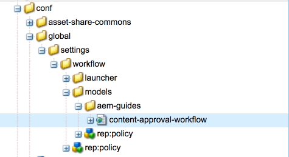

# Sviluppa progetti in AEM

Questa è un’esercitazione sullo sviluppo che illustra come sviluppare per [!DNL AEM Projects].  In questa esercitazione verrà creato un modello di progetto personalizzato che può essere utilizzato per creare nuovi progetti all’interno di AEM per gestire flussi di lavoro e attività di creazione dei contenuti.

>[!VIDEO](https://video.tv.adobe.com/v/16904?quality=12&learn=on)

*Questo video offre una breve dimostrazione del flusso di lavoro completato creato nell’esercitazione seguente.*

## Introduzione {#introduction}

[[!DNL AEM Projects]](https://helpx.adobe.com/experience-manager/6-5/sites/authoring/using/projects.html) è una funzione di AEM progettata per facilitare la gestione e il raggruppamento di tutti i flussi di lavoro e le attività associate alla creazione di contenuti come parte di un’implementazione di AEM Sites o Assets.

AEM progetti vengono forniti con diversi [Modelli di progetto OTB](https://helpx.adobe.com/experience-manager/6-5/sites/authoring/using/projects.html#ProjectTemplates). Durante la creazione di un nuovo progetto, gli autori possono scegliere tra questi modelli disponibili. Le implementazioni AEM di grandi dimensioni con requisiti aziendali unici dovranno creare modelli di progetto personalizzati, personalizzati e adattati alle loro esigenze. Creando un modello di progetto personalizzato, gli sviluppatori possono configurare il dashboard del progetto, collegarsi ai flussi di lavoro personalizzati e creare ruoli di business aggiuntivi per un progetto. Esamineremo la struttura di un modello di progetto e creeremo un modello di progetto di esempio.


## Configurazione

Questa esercitazione passerà attraverso il codice necessario per creare un modello di progetto personalizzato. È possibile scaricare e installare la [pacchetto allegato](./assets/develop-aem-projects/projects-tasks-guide.ui.apps-0.0.1-SNAPSHOT.zip) a un ambiente locale per seguire l’esercitazione. Puoi anche accedere all’intero progetto Maven ospitato su [GitHub](https://github.com/Adobe-Marketing-Cloud/aem-guides/tree/feature/projects-tasks-guide).

* [Pacchetto tutorial completato](./assets/develop-aem-projects/projects-tasks-guide.ui.apps-0.0.1-SNAPSHOT.zip)
* [Archivio completo del codice su GitHub](https://github.com/Adobe-Marketing-Cloud/aem-guides/tree/feature/projects-tasks-guide)

Questa esercitazione presuppone alcune conoscenze di base su [Pratiche di sviluppo AEM](https://helpx.adobe.com/it/experience-manager/6-5/sites/developing/using/the-basics.html) e una certa familiarità con [Configurazione AEM progetto Maven](https://helpx.adobe.com/it/experience-manager/6-5/sites/developing/using/ht-projects-maven.html). Tutti i codici menzionati sono destinati ad essere utilizzati come riferimento e devono essere distribuiti solo in un [AEM di sviluppo locale](https://helpx.adobe.com/experience-manager/6-5/sites/deploying/using/deploy.html#GettingStarted).

## Struttura di un modello di progetto

I modelli di progetto devono essere posti sotto il controllo del codice sorgente e devono trovarsi sotto la cartella dell&#39;applicazione in /apps. Idealmente dovrebbero essere posizionati in una sottocartella con la convenzione di denominazione di **&#42;/projects/templates/**&lt;my-template>. Inserendo seguendo questa convenzione di denominazione, tutti i nuovi modelli personalizzati saranno automaticamente disponibili per gli autori durante la creazione di un progetto. La configurazione dei modelli di progetto disponibili è impostata in: **/content/projects/jcr:content** nodo per **cq:allowedTemplates** proprietà. Per impostazione predefinita, si tratta di un’espressione regolare: **/(apps|libs)/.&#42;/projects/templates/.&#42;**

Il nodo principale di un modello di progetto avrà una **jcr:primaryType** di **cq:Template**. Sotto il nodo principale di ci sono 3 nodi: **gadget**, **ruoli** e **workflow**. Questi nodi sono tutti **nt:unstructured**. Sotto il nodo principale può anche essere un file thumbnail.png che viene visualizzato quando si seleziona il modello nella procedura guidata Crea progetto.

La struttura a nodo intero:

```shell
/apps/<my-app>
    + projects (nt:folder)
         + templates (nt:folder)
              + <project-template-root> (cq:Template)
                   + gadgets (nt:unstructured)
                   + roles (nt:unstructured)
                   + workflows (nt:unstructured)
```

### Directory principale dei modelli di progetto

Il nodo principale del modello di progetto è di tipo **cq:Template**. Su questo nodo è possibile configurare le proprietà **jcr:title** e **jcr:description** visualizzato nella Creazione guidata progetto. Esiste anche una proprietà denominata **procedura guidata** che fa riferimento a un modulo che popolerà le proprietà del progetto. Il valore predefinito di: **/libs/cq/core/content/projects/wizard/steps/defaultproject.html** dovrebbe funzionare bene per la maggior parte dei casi, in quanto consente all&#39;utente di compilare le proprietà di base del progetto e aggiungere membri del gruppo.

*&#42;La Creazione guidata progetto non utilizza il servlet Sling POST. Vengono invece inviati valori a un servlet personalizzato:**com.adobe.cq.projects.impl.servlet.ProjectServlet**. È necessario tenerne conto quando si aggiungono campi personalizzati.*

Un esempio di procedura guidata personalizzata può essere trovato per il modello di progetto di traduzione: **/libs/cq/core/content/projects/Wizard/translationproject/defaultproject**.

### Gadget {#gadgets}

In questo nodo non sono presenti proprietà aggiuntive, ma gli elementi secondari del controllo nodo gadget, che consentono di comporre il dashboard del progetto quando viene creato un nuovo progetto. [Porzioni del progetto](https://helpx.adobe.com/experience-manager/6-5/sites/authoring/using/projects.html#ProjectTiles) (noti anche come gadget o pod) sono schede semplici che popolano la posizione di lavoro di un progetto. Un elenco completo delle tessere di ootb si trova in: **/libs/cq/gui/components/projects/admin/pod. **I proprietari dei progetti possono sempre aggiungere/rimuovere riquadri dopo la creazione di un progetto.

### Ruoli {#roles}

Ce ne sono 3 [Ruoli predefiniti](https://helpx.adobe.com/experience-manager/6-5/sites/authoring/using/projects.html#UserRolesinaProject) per ogni progetto: **Osservatori**, **Editori** e **Proprietari**. Aggiungendo nodi figlio sotto il nodo dei ruoli è possibile aggiungere ulteriori ruoli di progetto specifici per il business per il modello. Puoi quindi collegare questi ruoli a flussi di lavoro specifici associati al progetto.

### Flussi di lavoro {#workflows}

Uno dei motivi più attraenti per la creazione di un modello di progetto personalizzato è la possibilità di configurare i flussi di lavoro disponibili per l’utilizzo con il progetto. Possono utilizzare flussi di lavoro OOTB o flussi di lavoro personalizzati. Sotto **workflow** un nodo deve essere **modelli** nodo (anche `nt:unstructured`) e i nodi secondari sotto specificano i modelli di flusso di lavoro disponibili. La proprietà **modelId **punta al modello di flusso di lavoro in /etc/workflow e alla proprietà **procedura guidata** fa riferimento alla finestra di dialogo utilizzata all’avvio del flusso di lavoro. Un grande vantaggio di Progetti è la possibilità di aggiungere una finestra di dialogo personalizzata (procedura guidata) per acquisire metadati specifici aziendali all’inizio del flusso di lavoro, che può stimolare ulteriori azioni all’interno del flusso di lavoro.

```shell
<projects-template-root> (cq:Template)
    + workflows (nt:unstructured)
         + models (nt:unstructured)
              + <workflow-model> (nt:unstructured)
                   - modelId = points to the workflow model
                   - wizard = dialog used to start the workflow
```

## Creazione di un modello di progetto {#creating-project-template}

Poiché i nodi vengono copiati/configurati principalmente, utilizzeremo CRXDE Lite. Nell&#39;istanza AEM locale apri [CRXDE Lite](http://localhost:4502/crx/de/index.jsp).

1. Inizia creando una nuova cartella sotto di essa `/apps/&lt;your-app-folder&gt;` denominato `projects`. Crea un&#39;altra cartella sotto quella denominata `templates`.

   ```shell
   /apps/aem-guides/projects-tasks/
                       + projects (nt:folder)
                                + templates (nt:folder)
   ```

1. Per semplificare le operazioni, inizieremo il modello personalizzato dal modello Progetto semplice esistente.

   1. Copia e incolla il nodo **/libs/cq/core/content/projects/templates/default** sotto il *modelli* cartella creata nel passaggio 1.

   ```shell
   /apps/aem-guides/projects-tasks/
                + templates (nt:folder)
                     + default (cq:Template)
   ```

1. Ora dovresti avere un percorso come **/apps/aem-guides/projects-task/projects/templates/authoring-project**.

   1. Modifica le **jcr:title** e **jcr:description** proprietà del nodo author-project su valori di titolo e descrizione personalizzati.

      1. Lascia la **procedura guidata** proprietà che punta alle proprietà predefinite di Project.

   ```shell
   /apps/aem-guides/projects-tasks/projects/
            + templates (nt:folder)
                 + authoring-project (cq:Template)
                      - jcr:title = "Authoring Project"
                      - jcr:description = "A project to manage approval and publish process for AEM Sites or Assets"
                      - wizard = "/libs/cq/core/content/projects/wizard/steps/defaultproject.html"
   ```

1. Per questo modello di progetto si desidera utilizzare Attività.
   1. Aggiungi un nuovo **nt:unstructured** nodo sotto authoring-project/gadget chiamato **attività**.
   1. Aggiungi proprietà stringa al nodo attività per **cardWeight** = &quot;100&quot;, **jcr:title**= &quot;Attività&quot;, e **sling:resourceType**=&quot;cq/gui/components/projects/admin/pod/taskpod&quot;.

   Ora il [Riquadro attività](https://experienceleague.adobe.com/docs/#Tasks) viene visualizzato per impostazione predefinita quando viene creato un nuovo progetto.

   ```shell
   ../projects/templates/authoring-project
       + gadgets (nt:unstructured)
            + team (nt:unstructured)
            + asset (nt:unstructured)
            + work (nt:unstructured)
            + experiences (nt:unstructured)
            + projectinfo (nt:unstructured)
            ..
            + tasks (nt:unstructured)
                 - cardWeight = "100"
                 - jcr:title = "Tasks"
                 - sling:resourceType = "cq/gui/components/projects/admin/pod/taskpod"
   ```

1. Aggiungeremo un Ruolo Approvatore personalizzato al nostro modello di progetto.

   1. Sotto il nodo del modello di progetto (authoring-project) aggiungi un nuovo **nt:unstructured** nodo etichettato **ruoli**.
   1. Aggiungi un altro **nt:unstructured** nodo di approvatori etichettati come figlio del nodo ruoli.
   1. Aggiungi proprietà stringa **jcr:title** = &quot;**Approvatori**&quot;, **roleclasse** =&quot;**proprietario**&quot;, **roleide**=&quot;**approvatori**&quot;.
      1. Il nome del nodo approvatori, nonché jcr:title e roleid possono essere qualsiasi valore di stringa (purché roleid sia univoco).
      1. **roleclasse** governa le autorizzazioni applicate per quel ruolo in base al [3 Ruoli OOTB](https://docs.adobe.com/docs/en/aem/6-3/author/projects.html#User Ruoli in un progetto): **proprietario**, **editor** e **osservatore**.
      1. In generale, se il ruolo personalizzato è più di un ruolo manageriale, il ruolo può essere **proprietario;** se si tratta di un ruolo di authoring più specifico, come Fotografo o o Designer, allora **editor** il roleclass dovrebbe bastare. La grande differenza tra **proprietario** e **editor** i proprietari del progetto possono aggiornare le proprietà del progetto e aggiungere nuovi utenti al progetto.

   ```shell
   ../projects/templates/authoring-project
       + gadgets (nt:unstructured)
       + roles (nt:unstructured)
           + approvers (nt:unstructured)
                - jcr:title = "Approvers"
                - roleclass = "owner"
                - roleid = "approver"
   ```

1. Copiando il modello Progetto semplice si otterranno 4 flussi di lavoro OOTB configurati. Ogni nodo sotto i flussi di lavoro/modelli punta a un flusso di lavoro specifico e a una finestra di dialogo di avvio guidata per quel flusso di lavoro. Successivamente in questa esercitazione verrà creato un flusso di lavoro personalizzato per il progetto. Per il momento elimina i nodi sotto i flussi di lavoro/modelli:

   ```shell
   ../projects/templates/authoring-project
       + gadgets (nt:unstructured)
       + roles (nt:unstructured)
       + workflows (nt:unstructured)
            + models (nt:unstructured)
               - (remove ootb models)
   ```

1. Per facilitare l’identificazione del modello di progetto da parte degli autori di contenuti, puoi aggiungere una miniatura personalizzata. La dimensione consigliata è 319x319 pixel.
   1. In CRXDE Lite crea un nuovo file di pari livello con i nodi di gadget, ruoli e flussi di lavoro denominati **thumbnail.png**.
   1. Salva e quindi passa alla `jcr:content` e fai doppio clic sul `jcr:data` (evitare di fare clic su &quot;visualizza&quot;).
      1. Questo dovrebbe richiedere una modifica `jcr:data` e puoi caricare una miniatura personalizzata.

   ```shell
   ../projects/templates/authoring-project
       + gadgets (nt:unstructured)
       + roles (nt:unstructured)
       + workflows (nt:unstructured)
       + thumbnail.png (nt:file)
   ```

Rappresentazione XML del modello di progetto completata:

```xml
<?xml version="1.0" encoding="UTF-8"?>
<jcr:root xmlns:sling="http://sling.apache.org/jcr/sling/1.0" xmlns:cq="http://www.day.com/jcr/cq/1.0" xmlns:jcr="http://www.jcp.org/jcr/1.0" xmlns:nt="http://www.jcp.org/jcr/nt/1.0"
    jcr:description="A project to manage approval and publish process for AEM Sites or Assets"
    jcr:primaryType="cq:Template"
    jcr:title="Authoring Project"
    ranking="{Long}1"
    wizard="/libs/cq/core/content/projects/wizard/steps/defaultproject.html">
    <jcr:content
        jcr:primaryType="nt:unstructured"
        detailsHref="/projects/details.html"/>
    <gadgets jcr:primaryType="nt:unstructured">
        <team
            jcr:primaryType="nt:unstructured"
            jcr:title="Team"
            sling:resourceType="cq/gui/components/projects/admin/pod/teampod"
            cardWeight="60"/>
        <tasks
            jcr:primaryType="nt:unstructured"
            jcr:title="Tasks"
            sling:resourceType="cq/gui/components/projects/admin/pod/taskpod"
            cardWeight="100"/>
        <work
            jcr:primaryType="nt:unstructured"
            jcr:title="Workflows"
            sling:resourceType="cq/gui/components/projects/admin/pod/workpod"
            cardWeight="80"/>
        <experiences
            jcr:primaryType="nt:unstructured"
            jcr:title="Experiences"
            sling:resourceType="cq/gui/components/projects/admin/pod/channelpod"
            cardWeight="90"/>
        <projectinfo
            jcr:primaryType="nt:unstructured"
            jcr:title="Project Info"
            sling:resourceType="cq/gui/components/projects/admin/pod/projectinfopod"
            cardWeight="100"/>
    </gadgets>
    <roles jcr:primaryType="nt:unstructured">
        <approvers
            jcr:primaryType="nt:unstructured"
            jcr:title="Approvers"
            roleclass="owner"
            roleid="approvers"/>
    </roles>
    <workflows
        jcr:primaryType="nt:unstructured"
        tags="[]">
        <models jcr:primaryType="nt:unstructured">
        </models>
    </workflows>
</jcr:root>
```

## Verifica del modello di progetto personalizzato

Ora possiamo testare il nostro modello di progetto creando un nuovo progetto.

1. Dovresti visualizzare il modello personalizzato come una delle opzioni per la creazione del progetto.

   

1. Dopo aver selezionato il modello personalizzato, fai clic su &quot;Successivo&quot; e osserva che durante la compilazione dei membri del progetto puoi aggiungerli come ruolo di Approvatore.

   

1. Fai clic su &quot;Crea&quot; per completare la creazione del progetto in base al modello personalizzato. Noterai sul Dashboard di progetto che il Riquadro attività e gli altri riquadri configurati sotto i gadget vengono visualizzati automaticamente.

   


## Perché Workflow?

Tradizionalmente, AEM flussi di lavoro che si basano su un processo di approvazione hanno utilizzato i passaggi del flusso di lavoro Partecipante. La casella in entrata AEM include informazioni dettagliate sulle attività e sul flusso di lavoro e sull’integrazione con i progetti AEM. Queste funzioni rendono più attraente l’utilizzo dei passaggi del processo Crea attività di progetti .

### Perché eseguire le attività?

L&#39;utilizzo di un passaggio di creazione attività sui passaggi Partecipante tradizionali offre un paio di vantaggi:

* **Data di inizio e di scadenza** - semplifica la gestione del tempo da parte degli autori, la nuova funzione Calendario utilizza queste date.
* **Priorità** - priorità integrate Bassa, Normale e Alta consentono agli autori di dare priorità al lavoro
* **Commenti filettati** - poiché gli autori lavorano su un compito hanno la possibilità di lasciare i commenti aumentando la collaborazione
* **Visibilità** - I riquadri attività e le visualizzazioni con Progetti consentono ai responsabili di visualizzare il tempo trascorso
* **Integrazione del progetto** - Attività già integrate con ruoli e dashboard di Project

Come per i passaggi Partecipante, le Attività possono essere assegnate e indirizzate in modo dinamico. I metadati dell’attività, come Titolo, Priorità possono essere impostati in modo dinamico in base alle azioni precedenti, come verrà illustrato nell’esercitazione seguente.

Anche se le attività presentano alcuni vantaggi rispetto ai passaggi partecipanti, comportano un sovraccarico aggiuntivo e non sono utili al di fuori di un progetto. Inoltre, tutti i comportamenti dinamici delle Attività devono essere codificati utilizzando script ecma che hanno le proprie limitazioni.

## Requisiti del caso d’uso di esempio {#goals-tutorial}


Il diagramma precedente illustra i requisiti di alto livello per il flusso di lavoro di approvazione del campione.

Il primo passaggio consiste nel creare un&#39;attività per completare la modifica di un contenuto. L’iniziatore del flusso di lavoro potrà scegliere l’assegnatario di questa prima attività.

Una volta completata la prima attività, l’assegnatario avrà tre opzioni per indirizzare il flusso di lavoro:

**Normale **- il ciclo normale crea un&#39;attività assegnata al gruppo di approvatori del progetto per la revisione e l&#39;approvazione. La priorità dell’attività è Normale e la data di scadenza è di 5 giorni dalla creazione.

**Rotta** - il routing rapido crea anche un&#39;attività assegnata al gruppo Approvatore del progetto. La priorità dell’attività è Alta e la data di scadenza è solo 1 giorno.

**Ignora** - in questo flusso di lavoro di esempio, il partecipante iniziale ha la possibilità di ignorare il gruppo di approvazione. (sì, questo potrebbe vanificare lo scopo di un flusso di lavoro &quot;Approvazione&quot;, ma ci consente di illustrare funzionalità di routing aggiuntive)

Il gruppo di approvatori può approvare il contenuto o inviarlo nuovamente all’assegnatario iniziale per la rielaborazione. Nel caso in cui venga rimandato per la rielaborazione, viene creata una nuova attività con l’etichetta appropriata &quot;Inviato indietro per la rielaborazione&quot;.

L’ultimo passaggio del flusso di lavoro utilizza la fase del processo ootb Attiva pagina/Risorsa e replica il payload.

## Creare il modello di flusso di lavoro

1. Dal menu di avvio AEM passare a Strumenti -> Flusso di lavoro -> Modelli. Fai clic su &quot;Crea&quot; nell’angolo in alto a destra per creare un nuovo modello di flusso di lavoro.

   Assegna un titolo al nuovo modello: &quot;Flusso di lavoro di approvazione del contenuto&quot; e un nome url: &quot;content-authorization-workflow&quot;.

   

   Per ulteriori informazioni relative a [creazione di flussi di lavoro qui](https://helpx.adobe.com/experience-manager/6-5/sites/developing/using/workflows-models.html).

1. Come best practice, i flussi di lavoro personalizzati devono essere raggruppati nella propria cartella sotto /etc/workflow/models. In CRXDE Lite crea una nuova **&#39;nt:folder&#39;** sotto /etc/workflow/models denominati **&quot;aem-guides&quot;**. L’aggiunta di una sottocartella assicura che i flussi di lavoro personalizzati non vengano accidentalmente sovrascritti durante gli aggiornamenti o le installazioni del Service Pack.

   &#42;Nota che è importante non inserire mai la cartella o i flussi di lavoro personalizzati sotto le sottocartelle ootb come /etc/workflow/models/dam o /etc/workflow/models/projects, in quanto l&#39;intera sottocartella può anche essere sovrascritta da aggiornamenti o service pack.

   

   Posizione del modello di flusso di lavoro in 6.3

   >[!NOTE]
   >
   >Se utilizzi AEM 6.4+, la posizione del Flusso di lavoro è cambiata. Vedi [qui per maggiori dettagli.](https://helpx.adobe.com/experience-manager/6-5/sites/developing/using/workflows-best-practices.html#LocationsWorkflowModels)

   Se utilizzi AEM 6.4+, il modello di flusso di lavoro viene creato in `/conf/global/settings/workflow/models`. Ripeti i passaggi precedenti con la directory /conf e aggiungi una sottocartella denominata `aem-guides` e sposta `content-approval-workflow` sotto.

   
Posizione del modello di flusso di lavoro in 6.4+

1. Introdotto in AEM 6.3 è la possibilità di aggiungere fasi del flusso di lavoro a un determinato flusso di lavoro. Le fasi vengono visualizzate all’utente dalla casella in entrata nella scheda Informazioni flusso di lavoro. Mostra all’utente la fase corrente del flusso di lavoro e le fasi che lo precedono e seguono.

   Per configurare le aree di visualizzazione, apri la finestra di dialogo Proprietà pagina dal pulsante SideKick. La quarta scheda è etichettata &quot;Stadi&quot;. Aggiungi i seguenti valori per configurare le tre fasi di questo flusso di lavoro:

   1. Modifica contenuto
   1. Approvazione
   1. Pubblicazione

   

   Configura le fasi del flusso di lavoro dalla finestra di dialogo Proprietà pagina .

   

   La barra di avanzamento del flusso di lavoro visualizzata dalla casella in entrata AEM.

   Facoltativamente, puoi caricare un **Immagine** nelle Proprietà pagina utilizzate come miniatura del flusso di lavoro quando gli utenti la selezionano. Le dimensioni dell&#39;immagine devono essere 319x319 pixel. Aggiunta di un **Descrizione** In Proprietà pagina viene visualizzato anche quando un utente accede per selezionare il flusso di lavoro.

1. Il processo del flusso di lavoro Crea attività progetto è progettato per creare un’attività come passaggio nel flusso di lavoro. Solo una volta completata l’attività, il flusso di lavoro procederà. Un aspetto importante del passaggio Crea attività progetto è che può leggere i valori dei metadati del flusso di lavoro e usarli per creare in modo dinamico l&#39;attività.

   Elimina innanzitutto il Passaggio partecipante che viene creato per impostazione predefinita. Dalla barra laterale nel menu dei componenti , espandi la **&quot;Progetti&quot;** sottotitolo e trascina e rilascia la **&quot;Crea attività progetto&quot;** sul modello.

   Fai doppio clic sul passaggio &quot;Crea attività progetto&quot; per aprire la finestra di dialogo del flusso di lavoro. Configura le seguenti proprietà:

   Questa scheda è comune per tutti i passaggi del processo del flusso di lavoro e imposteremo il Titolo e la Descrizione (che non saranno visibili all’utente finale). La proprietà importante che imposteremo è Workflow Stage su **&quot;Modifica contenuto&quot;** dal menu a discesa.

   ```shell
   Common Tab
   -----------------
       Title = "Start Task Creation"
       Description = "This the first task in the Workflow"
       Workflow Stage = "Edit Content"
   ```

   Il processo del flusso di lavoro Crea attività progetto è progettato per creare un’attività come passaggio nel flusso di lavoro. La scheda Attività consente di impostare tutti i valori dell’attività. Nel nostro caso vogliamo che l&#39;Assegnatario sia dinamico in modo da lasciarlo vuoto. Il resto dei valori della proprietà:

   ```shell
   Task Tab
   -----------------
       Name* = "Edit Content"
       Task Priority = "Medium"
       Description = "Edit the content and finalize for approval. Once finished submit for approval."
       Due In - Days = "2"
   ```

   La scheda di routing è una finestra di dialogo facoltativa che può specificare le azioni disponibili per l’utente che completa l’attività. Queste azioni sono solo valori stringa e vengono salvate nei metadati del flusso di lavoro. Questi valori possono essere letti da script e/o fasi di processo successive nel flusso di lavoro per &quot;indirizzare&quot; in modo dinamico il flusso di lavoro. In base ai [obiettivi del flusso di lavoro](#goals-tutorial) verranno aggiunte tre azioni a questa scheda:

   ```shell
   Routing Tab
   -----------------
       Actions =
           "Normal Approval"
           "Rush Approval"
           "Bypass Approval"
   ```

   Questa scheda ci consente di configurare uno script di attività pre-creazione in cui possiamo decidere programmaticamente vari valori dell’attività prima che venga creata. È possibile puntare lo script su un file esterno o incorporare uno script breve direttamente nella finestra di dialogo. Nel nostro caso, punteremo lo Script di attività pre-creazione su un file esterno. Nel passaggio 5 creeremo lo script.

   ```shell
   Advanced Settings Tab
   -----------------
      Pre-Create Task Script = "/apps/aem-guides/projects/scripts/start-task-config.ecma"
   ```

1. Nel passaggio precedente abbiamo fatto riferimento a uno script di attività pre-creazione. Ora creeremo lo script in cui imposteremo l’assegnatario dell’attività in base al valore di un valore di metadati del flusso di lavoro &quot;**assegnatario**&quot;. La **&quot;assegnatario&quot;** viene impostato quando il flusso di lavoro viene avviato. Leggeremo anche i metadati del flusso di lavoro per scegliere dinamicamente la priorità dell&#39;attività leggendo il &quot;**taskPriority&quot;** valore dei metadati del flusso di lavoro e **&quot;taskDueDate&quot; **impostato in modo dinamico alla scadenza della prima attività.

   A scopo organizzativo abbiamo creato una cartella sotto la cartella dell’app in cui sono contenuti tutti gli script relativi al progetto: **/apps/aem-guides/projects-task/projects/scripts**. Crea un nuovo file sotto questa cartella denominato **&quot;start-task-config.ecma&quot;**. &#42;Assicurati che il percorso del file start-task-config.ecma corrisponda al percorso impostato nella scheda Impostazioni avanzate del passaggio 4.

   Aggiungi quanto segue come contenuto del file :

   ```
   // start-task-config.ecma
   // Populate the task using values stored as workflow metadata originally posted by the start workflow wizard
   
   // set the assignee based on start workflow wizard
   var assignee = workflowData.getMetaDataMap().get("assignee", Packages.java.lang.String);
   task.setCurrentAssignee(assignee);
   
   //Set the due date for the initial task based on start workflow wizard
   var dueDate = workflowData.getMetaDataMap().get("taskDueDate", Packages.java.util.Date);
   if (dueDate != null) {
       task.setProperty("taskDueDate", dueDate);
   }
   
   //Set the priority based on start workflow wizard
   var taskPriority = workflowData.getMetaDataMap().get("taskPriority", "Medium");
   task.setProperty("taskPriority", taskPriority);
   ```

1. Torna al flusso di lavoro di approvazione dei contenuti . Trascina e rilascia **Divisione OR** (nella barra laterale sotto la categoria &quot;Flusso di lavoro&quot;) sotto la **Avvia attività** Passo. Nella finestra di dialogo comune selezionare il pulsante di scelta per 3 rami. La divisione OR leggerà il valore dei metadati del flusso di lavoro **&quot;lastTaskAction&quot;** per determinare il percorso del flusso di lavoro. La **&quot;lastTaskAction&quot;** viene impostata su uno dei valori della scheda Indirizzamento configurata nel passaggio 4. Per ciascuna delle schede Ramo compilare il **Script** area di testo con i seguenti valori:

   ```
   function check() {
   var lastAction = workflowData.getMetaDataMap().get("lastTaskAction","");
   
   if(lastAction == "Normal Approval") {
       return true;
   }
   
   return false;
   }
   ```

   ```
   function check() {
   var lastAction = workflowData.getMetaDataMap().get("lastTaskAction","");
   
   if(lastAction == "Rush Approval") {
       return true;
   }
   
   return false;
   }
   ```

   ```
   function check() {
   var lastAction = workflowData.getMetaDataMap().get("lastTaskAction","");
   
   if(lastAction == "Bypass Approval") {
       return true;
   }
   
   return false;
   }
   ```

   &#42;Si sta effettuando una corrispondenza diretta di stringa per determinare il percorso, quindi è importante che i valori impostati negli script di ramo corrispondano ai valori di route impostati nel passaggio 4.

1. Trascina e rilascia un altro &quot;**Crea attività progetto**&quot; passare al modello all&#39;estrema sinistra (Ramo 1) sotto la divisione OR. Compila la finestra di dialogo con le seguenti proprietà:

   ```
   Common Tab
   -----------------
       Title = "Approval Task Creation"
       Description = "Create a an approval task for Project Approvers. Priority is Medium."
       Workflow Stage = "Approval"
   
   Task Tab
   ------------
       Name* = "Approve Content for Publish"
       Task Priority = "Medium"
       Description = "Approve this content for publication."
       Days = "5"
   
   Routing Tab - Actions
   ----------------------------
       "Approve and Publish"
       "Send Back for Revision"
   ```

   Poiché si tratta del percorso di approvazione normale, la priorità dell&#39;attività è impostata su Media. Inoltre, assegniamo al gruppo di approvatori 5 giorni per completare l’attività. Assegnatario viene lasciato vuoto nella scheda Attività in quanto lo assegneremo in modo dinamico nella scheda Impostazioni avanzate. Al completamento di questa attività, assegniamo al gruppo di approvatori due percorsi possibili: **&quot;Approva e pubblica&quot;** se approvano il contenuto e possono essere pubblicati e **&quot;Porta indietro per la revisione&quot;** in caso di problemi che l’editor originale deve correggere. L’approvatore può lasciare dei commenti che l’editor originale vedrà se il flusso di lavoro gli viene restituito.

In precedenza, in questa esercitazione abbiamo creato un modello di progetto che includeva un ruolo approvatori. Ogni volta che viene creato un nuovo progetto da questo modello viene creato un gruppo specifico per il progetto per il ruolo Approvatori. Come un Passaggio partecipante, un&#39;attività può essere assegnata solo a un Utente o Gruppo. Desideriamo assegnare questa attività al gruppo di progetto corrispondente al gruppo di approvatori. Tutti i flussi di lavoro avviati da un progetto avranno metadati che mappano i ruoli del progetto al gruppo specifico del progetto.

Copia e incolla il seguente codice nel **Script** area di testo della scheda **Impostazioni avanzate **2. Questo codice legge i metadati del flusso di lavoro e assegna l&#39;attività al gruppo Approvatori del progetto. Se non è in grado di trovare il valore del gruppo di approvatori, tornerà ad assegnare l&#39;attività al gruppo Amministratori.

```
var projectApproverGrp = workflowData.getMetaDataMap().get("project.group.approvers","administrators");

task.setCurrentAssignee(projectApproverGrp);
```

1. Trascina e rilascia un altro &quot;**Crea attività progetto**&quot; passare al modello al ramo centrale (ramo 2) sotto la divisione OR. Compila la finestra di dialogo con le seguenti proprietà:

   ```
   Common Tab
   -----------------
       Title = "Rush Approval Task Creation"
       Description = "Create a an approval task for Project Approvers. Priority is High."
       Workflow Stage = "Approval"
   
   Task Tab
   ------------
       Name* = "Rush Approve Content for Publish"
       Task Priority = "High"
       Description = "Rush approve this content for publication."
       Days = "1"
   
   Routing Tab - Actions
   ----------------------------
       "Approve and Publish"
       "Send Back for Revision"
   ```

   Poiché si tratta del percorso di approvazione di Rush, la priorità dell&#39;attività è impostata su Alta. Inoltre, assegniamo al gruppo di approvatori un solo giorno per completare l&#39;attività. Assegnatario viene lasciato vuoto nella scheda Attività in quanto lo assegneremo in modo dinamico nella scheda Impostazioni avanzate.

   È possibile riutilizzare lo stesso frammento di script del passaggio 7 per compilare il **Script** area di testo nella scheda** Impostazioni avanzate **. Copia+Incolla il codice seguente:

   ```
   var projectApproverGrp = workflowData.getMetaDataMap().get("project.group.approvers","administrators");
   
   task.setCurrentAssignee(projectApproverGrp);
   ```

1. Trascinare un componente** No Operation** sul ramo a destra (ramo 3). Il componente Nessuna operazione non esegue alcuna azione e viene anticipato immediatamente, rappresentando il desiderio dell&#39;editor originale di ignorare il passaggio di approvazione. Tecnicamente potremmo uscire da questo ramo senza alcuna fase del flusso di lavoro, ma come best practice aggiungeremo un passaggio Nessuna operazione. Questo rende chiaro agli altri sviluppatori qual è lo scopo della Ramo 3.

   Fai doppio clic sul passaggio del flusso di lavoro e configura il Titolo e la Descrizione:

   ```
   Common Tab
   -----------------
       Title = "Bypass Approval"
       Description = "Placeholder step to indicate that the original editor decided to bypass the approver group."
   ```

   

   Il modello di flusso di lavoro dovrebbe essere simile a questo dopo che tutti e tre i rami nella suddivisione OR sono stati configurati.

1. Poiché il gruppo dei approvatori ha la possibilità di inviare il flusso di lavoro all&#39;editor originale per ulteriori revisioni, ci affideremo al **Goto** per leggere l’ultima azione intrapresa e indirizzare il flusso di lavoro all’inizio o lasciarlo continuare.

   Trascina+Rilascia il componente Passaggio a (disponibile nella barra laterale in Flusso di lavoro) sotto la divisione OR (O) in cui si unisce nuovamente. Fai doppio clic su e configura le seguenti proprietà nella finestra di dialogo:

   ```
   Common Tab
   ----------------
       Title = "Goto Step"
       Description = "Based on the Approver groups action route the workflow to the beginning or continue and publish the payload."
   
   Process Tab
   ---------------
       The step to go to. = "Start Task Creation"
   ```

   L’ultimo elemento che configureremo è lo Script come parte del passaggio del processo Passaggio . Il valore Script può essere incorporato tramite la finestra di dialogo o configurato per puntare a un file esterno. Lo script GoScript deve contenere un **function check()** e restituisce true se il flusso di lavoro deve passare al passaggio specificato. Un ritorno di false restituisce risultati nel flusso di lavoro in avanzamento.

   Se il gruppo approvatore sceglie il **&quot;Porta indietro per la revisione&quot;** action (configurata nei passaggi 7 e 8), quindi vogliamo restituire il flusso di lavoro al **&quot;Avvia creazione attività&quot;** passo.

   Nella scheda Processo aggiungere lo snippet seguente all’area di testo Script:

   ```
   function check() {
   var lastAction = workflowData.getMetaDataMap().get("lastTaskAction","");
   
   if(lastAction == "Send Back for Revision") {
       return true;
   }
   
   return false;
   }
   ```

1. Per pubblicare il payload utilizzeremo l’ootb **Attiva pagina/risorsa** Passaggio del processo. Questo passaggio del processo richiede poca configurazione e aggiunge il payload del flusso di lavoro alla coda di replica per l’attivazione. Aggiungeremo il passaggio sotto il passaggio Goto e in questo modo sarà possibile raggiungerlo solo se il gruppo Approvatore ha approvato il contenuto per la pubblicazione o se l’editor originale ha scelto il percorso Bypass Approvazione.

   Trascina e rilascia **Attiva pagina/risorsa** Passaggio del processo (che si trova nella barra laterale in Flusso di lavoro WCM) sotto Passaggio a nel modello.

   

   Aspetto del modello di flusso di lavoro dopo l’aggiunta del passaggio Passaggio e Attiva pagina/risorsa .

1. Se il gruppo Approvatore invia nuovamente il contenuto per la revisione, desideriamo informarlo l’editor originale. A tal fine, possiamo modificare dinamicamente le proprietà di creazione dell’attività. Verrà impostato il valore della proprietà lastActionTaken di **&quot;Porta indietro per la revisione&quot;**. Se tale valore è presente, modificheremo il titolo e la descrizione per indicare che l’attività è il risultato del ritrasferimento del contenuto per la revisione. Inoltre, aggiorneremo la priorità **&quot;Alta&quot;** in modo che sia il primo elemento su cui lavora l&#39;editor. Infine, imposteremo la data di scadenza dell’attività a un giorno dal momento in cui il flusso di lavoro è stato rimandato per la revisione.

   Sostituire l&#39;inizio `start-task-config.ecma` script (creato nel passaggio 5) con quanto segue:

   ```
   // start-task-config.ecma
   // Populate the task using values stored as workflow metadata originally posted by the start workflow wizard
   
   // set the assignee based on start workflow wizard
   var assignee = workflowData.getMetaDataMap().get("assignee", Packages.java.lang.String);
   task.setCurrentAssignee(assignee);
   
   //Set the due date for the initial task based on start workflow wizard
   var dueDate = workflowData.getMetaDataMap().get("taskDueDate", Packages.java.util.Date);
   if (dueDate != null) {
       task.setProperty("taskDueDate", dueDate);
   }
   
   //Set the priority based on start workflow wizard
   var taskPriority = workflowData.getMetaDataMap().get("taskPriority", "Medium");
   task.setProperty("taskPriority", taskPriority);
   
   var lastAction = workflowData.getMetaDataMap().get("lastTaskAction","");
   
   //change the title and priority if the approver group sent back the content
   if(lastAction == "Send Back for Revision") {
     var taskName = "Review and Revise Content";
   
     //since the content was rejected we will set the priority to High for the revison task
     task.setProperty("taskPriority", "High"); 
   
     //set the Task name (displayed as the task title in the Inbox) 
     task.setProperty("name", taskName);
     task.setProperty("nameHierarchy", taskName);
   
     //set the due date of this task 1 day from current date
     var calDueDate = Packages.java.util.Calendar.getInstance();
     calDueDate.add(Packages.java.util.Calendar.DATE, 1);
     task.setProperty("taskDueDate", calDueDate.getTime());
   
   }
   ```

## Crea la procedura guidata di avvio del flusso di lavoro {#start-workflow-wizard}

Quando scegli un flusso di lavoro dall’interno di un progetto, devi specificare una procedura guidata per avviare il flusso di lavoro. Procedura guidata predefinita: `/libs/cq/core/content/projects/workflowwizards/default_workflow` consente all’utente di inserire un titolo del flusso di lavoro, un commento iniziale e un percorso di payload per l’esecuzione del flusso di lavoro. Sono inoltre disponibili diversi altri esempi in: `/libs/cq/core/content/projects/workflowwizards`.

La creazione di una procedura guidata personalizzata può essere molto efficace in quanto puoi raccogliere informazioni critiche prima dell’avvio del flusso di lavoro. I dati vengono memorizzati come parte dei metadati del flusso di lavoro e i processi del flusso di lavoro possono leggerli e cambiare dinamicamente il comportamento in base ai valori inseriti. Verrà creata una procedura guidata personalizzata per assegnare dinamicamente la prima attività nel flusso di lavoro in base a un valore di avvio guidato.

1. In CRXDE-Lite creeremo una sottocartella sotto `/apps/aem-guides/projects-tasks/projects` cartella denominata &quot;procedure guidate&quot;. Copia la procedura guidata predefinita da: `/libs/cq/core/content/projects/workflowwizards/default_workflow` sotto la cartella delle procedure guidate appena creata e rinominarla in **inizio approvazione contenuto**. Il percorso completo dovrebbe ora essere: `/apps/aem-guides/projects-tasks/projects/wizards/content-approval-start`.

   La procedura guidata predefinita è una procedura guidata a 2 colonne con la prima colonna che mostra Titolo, Descrizione e Miniatura del modello di flusso di lavoro selezionato. La seconda colonna include i campi Titolo flusso di lavoro, Commento iniziale e Percorso payload. La procedura guidata è un modulo standard per l’interfaccia utente touch e utilizza lo standard [Componenti modulo per l’interfaccia utente Granite](https://experienceleague.adobe.com/docs/) per compilare i campi.

   

1. Verrà aggiunto un campo aggiuntivo alla procedura guidata utilizzato per impostare l’assegnatario della prima attività nel flusso di lavoro (vedi [Creare il modello di flusso di lavoro](#create-workflow-model): Passaggio 5).

   Sotto `../content-approval-start/jcr:content/items/column2/items` crea un nuovo nodo di tipo `nt:unstructured` denominato **&quot;assegna&quot;**. Verrà utilizzato il componente Selettore utente per progetti (basato su [Componente Selettore utenti Granite](https://experienceleague.adobe.com/docs/)). Questo campo modulo consente di limitare facilmente la selezione di utenti e gruppi solo a quelli appartenenti al progetto corrente.

   Di seguito è riportata la rappresentazione XML del **assegnare** nodo:

   ```xml
   <assign
       granite:class="js-cq-project-user-picker"
       jcr:primaryType="nt:unstructured"
       sling:resourceType="cq/gui/components/projects/admin/userpicker"
       fieldLabel="Assign To"
       hideServiceUsers="{Boolean}true"
       impersonatesOnly="{Boolean}true"
       showOnlyProjectMembers="{Boolean}true"
       name="assignee"
       projectPath="${param.project}"
       required="{Boolean}true"/>
   ```

1. Verrà inoltre aggiunto un campo di selezione della priorità che determinerà la priorità della prima attività nel flusso di lavoro (vedi [Creare il modello di flusso di lavoro](#create-workflow-model): Passaggio 5).

   Sotto `/content-approval-start/jcr:content/items/column2/items` crea un nuovo nodo di tipo `nt:unstructured` denominato **priorità**. Useremo il [Componente Seleziona interfaccia Granite](https://experienceleague.adobe.com/docs/experience-manager-release-information/aem-release-updates/previous-updates/aem-previous-versions.html?lang=it) per compilare il campo modulo.

   Sotto **priorità** nodo verrà aggiunto un **items** nodo **nt:unstructured**. Sotto **items** aggiungere altri 3 nodi per popolare le opzioni di selezione per Alta, Media e Bassa. Ogni nodo è di tipo **nt:unstructured** e dovrebbe avere **text** e **value** proprietà. Sia il testo che il valore devono essere dello stesso valore:

   1. Alta
   1. Media
   1. Bassa

   Per il nodo Medium aggiungere una proprietà booleana aggiuntiva denominata &quot;**selezionato&quot;** con un valore impostato su **true**. In questo modo il valore predefinito nel campo di selezione sarà Medio.

   Di seguito è riportata una rappresentazione XML della struttura del nodo e delle proprietà:

   ```xml
   <priority
       jcr:primaryType="nt:unstructured"
       sling:resourceType="granite/ui/components/coral/foundation/form/select"
       fieldLabel="Task Priority"
       name="taskPriority">
           <items jcr:primaryType="nt:unstructured">
               <high
                   jcr:primaryType="nt:unstructured"
                   text="High"
                   value="High"/>
               <medium
                   jcr:primaryType="nt:unstructured"
                   selected="{Boolean}true"
                   text="Medium"
                   value="Medium"/>
               <low
                   jcr:primaryType="nt:unstructured"
                   text="Low"
                   value="Low"/>
               </items>
   </priority>
   ```

1. L’iniziatore del flusso di lavoro potrà impostare la data di scadenza dell’attività iniziale. Useremo il [Selettore data dell’interfaccia Granite](https://experienceleague.adobe.com/docs/) campo modulo per acquisire questo input. Verrà inoltre aggiunto un campo nascosto con un [TypeHint](https://sling.apache.org/documentation/bundles/manipulating-content-the-slingpostservlet-servlets-post.html#typehint) per garantire che l&#39;input sia memorizzato come proprietà del tipo Date nel JCR.

   Aggiungi due **nt:unstructured** nodi con le seguenti proprietà rappresentate in XML:

   ```xml
   <duedate
       granite:rel="project-duedate"
       jcr:primaryType="nt:unstructured"
       sling:resourceType="granite/ui/components/coral/foundation/form/datepicker"
       displayedFormat="YYYY-MM-DD HH:mm"
       fieldLabel="Due Date"
       minDate="today"
       name="taskDueDate"
       type="datetime"/>
   <duedatetypehint
       jcr:primaryType="nt:unstructured"
       sling:resourceType="granite/ui/components/coral/foundation/form/hidden"
       name="taskDueDate@TypeHint"
       type="datetime"
       value="Calendar"/>
   ```

1. Puoi visualizzare il codice completo della finestra di dialogo di avvio della procedura guidata [qui](https://github.com/Adobe-Marketing-Cloud/aem-guides/blob/master/projects-tasks-guide/ui.apps/src/main/content/jcr_root/apps/aem-guides/projects-tasks/projects/wizards/content-approval-start/.content.xml).

## Collegamento del flusso di lavoro e del modello di progetto {#connecting-workflow-project}

L’ultima cosa che dobbiamo fare è garantire che il modello di flusso di lavoro sia disponibile per essere avviato da uno dei progetti. A questo scopo, è necessario visitare nuovamente il Modello di progetto creato nella parte 1 di questa serie.

La configurazione del flusso di lavoro è un’area di un modello di progetto che specifica i flussi di lavoro disponibili da utilizzare con tale progetto. La configurazione è anche responsabile di specificare la procedura guidata Avvia flusso di lavoro quando si attiva il flusso di lavoro (creato in [passaggi precedenti)](#start-workflow-wizard). La configurazione del flusso di lavoro di un modello di progetto è &quot;live&quot;, il che significa che l’aggiornamento della configurazione del flusso di lavoro avrà effetto sui nuovi progetti creati e sui progetti esistenti che utilizzano il modello.

1. In CRXDE-Lite passa al modello di progetto di authoring creato in precedenza in `/apps/aem-guides/projects-tasks/projects/templates/authoring-project/workflows/models`.

   Sotto il nodo dei modelli aggiungi un nuovo nodo denominato **approvazione del contenuto** con un tipo di nodo **nt:unstructured**. Aggiungi le seguenti proprietà al nodo :

   ```xml
   <contentapproval
       jcr:primaryType="nt:unstructured"
       modelId="/etc/workflow/models/aem-guides/content-approval-workflow/jcr:content/model"
       wizard="/apps/aem-guides/projects-tasks/projects/wizards/content-approval-start.html"
   />
   ```

   >[!NOTE]
   >
   >Se utilizzi AEM 6.4, la posizione del Flusso di lavoro è cambiata. Punto `modelId` alla posizione del modello di flusso di lavoro runtime in `/var/workflow/models/aem-guides/content-approval-workflow`
   >
   >
   >Vedi [qui per ulteriori dettagli sul cambiamento nella posizione del flusso di lavoro.](https://helpx.adobe.com/experience-manager/6-5/sites/developing/using/workflows-best-practices.html#LocationsWorkflowModels)

   ```xml
   <contentapproval
       jcr:primaryType="nt:unstructured"
       modelId="/var/workflow/models/aem-guides/content-approval-workflow"
       wizard="/apps/aem-guides/projects-tasks/projects/wizards/content-approval-start.html"
   />
   ```

1. Una volta aggiunto il flusso di lavoro Approvazione del contenuto al modello di progetto, dovrebbe essere disponibile per avviare il flusso di lavoro dal riquadro del progetto. Procedi e lancia e gioca con i vari cicli che abbiamo creato.

## Materiali di supporto

* [Download del pacchetto tutorial completato](./assets/develop-aem-projects/projects-tasks-guide.ui.apps-0.0.1-SNAPSHOT.zip)
* [Archivio completo del codice su GitHub](https://github.com/Adobe-Marketing-Cloud/aem-guides/tree/feature/projects-tasks-guide)
* [Documentazione sui progetti AEM](https://helpx.adobe.com/experience-manager/6-5/sites/authoring/using/projects.html)
