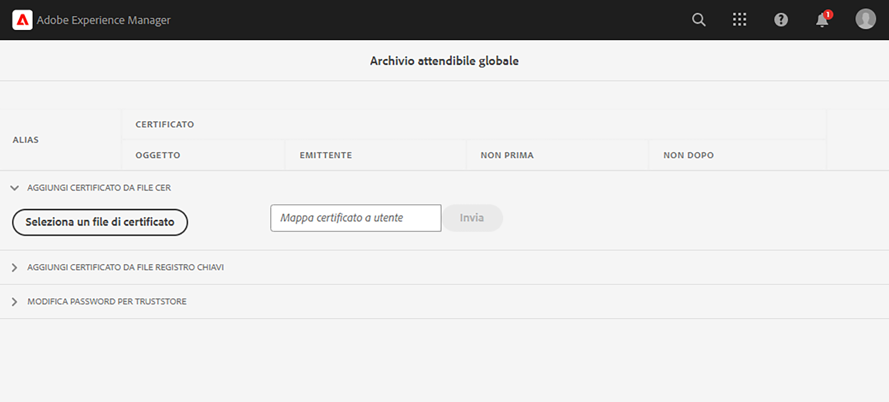

# Chiamare API interne con certificati privati

Scopri come effettuare chiamate HTTPS da AEM alle API web con certificati privati o autofirmati.

>[!VIDEO](https://video.tv.adobe.com/v/3424853?quality=12&learn=on)

Per impostazione predefinita, quando si tenta di stabilire una connessione HTTPS a un’API web che utilizza un certificato autofirmato, la connessione non riesce e viene mostrato il seguente messaggio di errore:

```
PKIX path building failed: sun.security.provider.certpath.SunCertPathBuilderException: unable to find valid certification path to requested target
```

Questo problema si verifica in genere quando il **certificato SSL dell’API non è rilasciato da un’autorità di certificazione (CA) riconosciuta** e l’applicazione Java™ non è in grado di convalidare il certificato SSL/TLS.

Scopri come chiamare correttamente le API con certificati privati o autofirmati utilizzando [Apache HttpClient](https://hc.apache.org/httpcomponents-client-4.5.x/index.html) e l’**Archivio fonti attendibili globale di AEM**.


## Prototipo di codice di chiamata API con HttpClient

Il codice seguente effettua una connessione HTTPS a un’API web:

```java
...
String API_ENDPOINT = "https://example.com";

// Create HttpClientBuilder
HttpClientBuilder httpClientBuilder = HttpClientBuilder.create();

// Create HttpClient
CloseableHttpClient httpClient = httpClientBuilder.build();

// Invoke API
CloseableHttpResponse closeableHttpResponse = httpClient.execute(new HttpGet(API_ENDPOINT));

// Code that reads response code and body from the 'closeableHttpResponse' object
...
```

Il codice utilizza le classi di libreria [HttpClient](https://hc.apache.org/httpcomponents-client-4.5.x/index.html) di [Apache HttpComponent](https://hc.apache.org/) e i relativi metodi.


## HttpClient e caricare il materiale dall’Archivio fonti attendibili di AEM

Per chiamare un endpoint API con _certificato privato o autofirmato_, `SSLContextBuilder` di [HttpClient](https://hc.apache.org/httpcomponents-client-4.5.x/index.html) deve essere caricato con l’Archivio fonti attendibili di AEM e utilizzato per facilitare la connessione.

Segui i passaggi seguenti:

1. Accedi a **AEM Author** come **amministratore**.
1. Passa a **AEM Author > Strumenti > Sicurezza > Archivio fonti attendibili** e apri l’**Archivio attendibile globale**. Se è il primo accesso, imposta una password per l’archivio attendibile globale.

   

1. Per importare un certificato privato, fai clic sul pulsante **Seleziona un file di certificato** e seleziona il file di certificato desiderato con estensione `.cer`. Per importare, fai clic sul pulsante **Invia**.

1. Aggiorna il codice Java™ come segue. Tieni presente che per utilizzare `@Reference` per ottenere `KeyStoreService` di AEM, il codice di chiamata deve essere un componente o servizio OSGi oppure un modello Sling (in cui è utilizzato `@OsgiService`).

   ```java
   ...
   
   // Get AEM's KeyStoreService reference
   @Reference
   private com.adobe.granite.keystore.KeyStoreService keyStoreService;
   
   ...
   
   // Get AEM TrustStore using KeyStoreService
   KeyStore aemTrustStore = getAEMTrustStore(keyStoreService, resourceResolver);
   
   if (aemTrustStore != null) {
   
       // Create SSL Context
       SSLContextBuilder sslbuilder = new SSLContextBuilder();
   
       // Load AEM TrustStore material into above SSL Context
       sslbuilder.loadTrustMaterial(aemTrustStore, null);
   
       // Create SSL Connection Socket using above SSL Context
       SSLConnectionSocketFactory sslsf = new SSLConnectionSocketFactory(
               sslbuilder.build(), NoopHostnameVerifier.INSTANCE);
   
       // Create HttpClientBuilder
       HttpClientBuilder httpClientBuilder = HttpClientBuilder.create();
       httpClientBuilder.setSSLSocketFactory(sslsf);
   
       // Create HttpClient
       CloseableHttpClient httpClient = httpClientBuilder.build();
   
       // Invoke API
       closeableHttpResponse = httpClient.execute(new HttpGet(API_ENDPOINT));
   
       // Code that reads response code and body from the 'closeableHttpResponse' object
       ...
   } 
   
   /**
    * 
    * Returns the global AEM TrustStore
    * 
    * @param keyStoreService OOTB OSGi service that makes AEM based KeyStore
    *                         operations easy.
    * @param resourceResolver
    * @return
    */
   private KeyStore getAEMTrustStore(KeyStoreService keyStoreService, ResourceResolver resourceResolver) {
   
       // get AEM TrustStore from the KeyStoreService and ResourceResolver
       KeyStore aemTrustStore = keyStoreService.getTrustStore(resourceResolver);
   
       return aemTrustStore;
   }
   
   ...
   ```

   * Inserisci nel tuo componente OSGi il servizio OSGi `com.adobe.granite.keystore.KeyStoreService` integrato.
   * Ottieni l’Archivio attendibile globale di AEM utilizzando `KeyStoreService` e `ResourceResolver`. Questa operazione viene eseguita dal metodo `getAEMTrustStore(...)`.
   * Crea un oggetto `SSLContextBuilder`; consulta i [dettagli API](https://javadoc.io/static/org.apache.httpcomponents/httpcore/4.4.8/index.html?org/apache/http/ssl/SSLContextBuilder.html) di Java™.
   * Carica l’Archivio attendibile globale di AEM in `SSLContextBuilder` utilizzando il metodo `loadTrustMaterial(KeyStore truststore,TrustStrategy trustStrategy)`.
   * In questo metodo, passa `null` per `TrustStrategy`, affinché l’esecuzione dell’API risulti riuscita solo per i certificati attendibili di AEM.


>[!CAUTION]
>
>Se vengono eseguite utilizzando questo approccio, le chiamate API con certificati validi emessi da CA non avranno esito positivo. Quando si segue questo metodo, avranno esito positivo solo le chiamate API con certificati attendibili di AEM.
>
>Per eseguire le chiamate API di certificati validi emessi da CA, utilizza l’[approccio standard](#prototypical-api-invocation-code-using-httpclient). Il metodo indicato in precedenza deve essere utilizzato solo per le API associate a certificati privati.

## Evitare modifiche al registro chiavi JVM

Un approccio convenzionale per richiamare in modo efficace le API interne con certificati privati comporta la modifica del registro chiavi JVM. A tal fine, si importano i certificati privati mediante il comando [keytool](https://docs.oracle.com/en/java/javase/11/tools/keytool.html#GUID-5990A2E4-78E3-47B7-AE75-6D1826259549) di Java™.

Tuttavia, questo metodo non è allineato alle best practice di sicurezza e AEM offre un’opzione superiore tramite l’utilizzo dell’**Archivio attendibile globale** e del [KeyStoreService](https://javadoc.io/doc/com.adobe.aem/aem-sdk-api/latest/com/adobe/granite/keystore/KeyStoreService.html).


## Pacchetto di soluzioni

Il progetto Node.js di esempio illustrato nel video può essere scaricato da [qui](assets/internal-api-call/REST-APIs.zip).

Il codice servlet di AEM è disponibile nel ramo `tutorial/web-api-invocation` del progetto WKND Sites, disponibile [qui](https://github.com/adobe/aem-guides-wknd/tree/tutorial/web-api-invocation/core/src/main/java/com/adobe/aem/guides/wknd/core/servlets).
