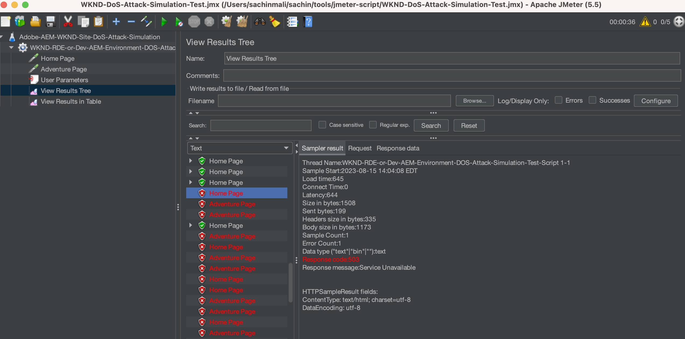

# Utilizzare ModSecurity per proteggere il sito AEM dagli attacchi DoS

Scopri come abilitare ModSecurity per proteggere il tuo sito dagli attacchi Denial of Service (DoS) utilizzando **Set di regole di base di OWASP ModSecurity (CRS)** su Adobe Experience Manager (AEM) Publish Dispatcher.


>[!VIDEO](https://video.tv.adobe.com/v/3422976?quality=12&learn=on)

## Panoramica

Il [Apri progetto di protezione applicazione Web® (OWASP)](https://owasp.org/) Foundation fornisce [**OWASP Top 10**](https://owasp.org/www-project-top-ten/) delineando i dieci problemi di sicurezza più critici per le applicazioni web.

ModSecurity è una soluzione open-source e multipiattaforma che fornisce protezione da una serie di attacchi contro le applicazioni web. Consente inoltre il monitoraggio del traffico HTTP, la registrazione e l’analisi in tempo reale.

OWSAP® fornisce inoltre [OWASP® ModSecurity Core Rule Set (CRS)](https://github.com/coreruleset/coreruleset). Il CRS è un insieme di **rilevamento di attacchi** regole da utilizzare con ModSecurity. In questo modo CRS mira a proteggere le applicazioni web da un&#39;ampia gamma di attacchi, tra cui i primi dieci OWASP, con un minimo di falsi allarmi.

Questa esercitazione illustra come abilitare e configurare **PROTEZIONE DOS** Regola CRS per proteggere il sito da un potenziale attacco DoS.

>[!TIP]
>
>È importante notare che l&#39;as a Cloud Service dell&#39;AEM [CDN gestito](https://experienceleague.adobe.com/docs/experience-manager-cloud-service/content/implementing/content-delivery/cdn.html) soddisfa i requisiti di prestazioni e sicurezza della maggior parte dei clienti. Tuttavia, ModSecurity fornisce un ulteriore livello di sicurezza e consente regole e configurazioni specifiche per il cliente.

## Aggiungere CRS al modulo di progetto di Dispatcher

1. Scarica ed estrai il file [ultimo set di regole di base OWASP ModSecurity](https://github.com/coreruleset/coreruleset/releases).

   ```shell
   # Replace the X.Y.Z with relevent version numbers.
   $ wget https://github.com/coreruleset/coreruleset/archive/refs/tags/vX.Y.Z.tar.gz
   
   # For version v3.3.5 when this tutorial is published
   $ wget https://github.com/coreruleset/coreruleset/archive/refs/tags/v3.3.5.tar.gz
   
   # Extract the downloaded file
   $ tar -xvzf coreruleset-3.3.5.tar.gz
   ```

1. Creare `modsec/crs` cartelle in `dispatcher/src/conf.d/` nel codice del progetto AEM. Ad esempio, nella copia locale di [Progetto AEM WKND Sites](https://github.com/adobe/aem-guides-wknd).

   {width="200" zoomable="yes"}

1. Copia il `coreruleset-X.Y.Z/rules` dal pacchetto di rilascio CRS scaricato in `dispatcher/src/conf.d/modsec/crs` cartella.
1. Copia il `coreruleset-X.Y.Z/crs-setup.conf.example` dal pacchetto di rilascio CRS scaricato in `dispatcher/src/conf.d/modsec/crs` cartella e rinominarla in `crs-setup.conf`.
1. Disattiva tutte le regole CRS copiate da `dispatcher/src/conf.d/modsec/crs/rules` rinominandoli come `XXXX-XXX-XXX.conf.disabled`. È possibile utilizzare i comandi riportati di seguito per rinominare tutti i file contemporaneamente.

   ```shell
   # Go inside the newly created rules directory within the dispathcher module
   $ cd dispatcher/src/conf.d/modsec/crs/rules
   
   # Rename all '.conf' extension files to '.conf.disabled'
   $ for i in *.conf; do mv -- "$i" "$i.disabled"; done
   ```

   Vedi regole CRS e file di configurazione rinominati nel codice del progetto WKND.

   {width="200" zoomable="yes"}

## Abilitare e configurare la regola di protezione Denial of Service (DoS)

Per abilitare e configurare la regola di protezione Denial of Service (DoS), effettuare le operazioni riportate di seguito.

1. Abilitare la regola di protezione DoS rinominando `REQUEST-912-DOS-PROTECTION.conf.disabled` a `REQUEST-912-DOS-PROTECTION.conf` (o rimuovere il `.disabled` dall&#39;estensione rulename) all&#39;interno del `dispatcher/src/conf.d/modsec/crs/rules` cartella.
1. Configurare la regola definendo  **DOS_COUNTER_THRESHOLD, DOS_BURST_TIME_SLICE, DOS_BLOCK_TIMEOUT** variabili.
   1. Creare un `crs-setup.custom.conf` file all&#39;interno di `dispatcher/src/conf.d/modsec/crs` cartella.
   1. Aggiungi lo snippet di regola seguente al file appena creato.

   ```
   # The Denial of Service (DoS) protection against clients making requests too quickly.
   # When a client is making more than 25 requests (excluding static files) within
   # 60 seconds, this is considered a 'burst'. After two bursts, the client is
   # blocked for 600 seconds.
   SecAction \
       "id:900700,\
       phase:1,\
       nolog,\
       pass,\
       t:none,\
       setvar:'tx.dos_burst_time_slice=60',\
       setvar:'tx.dos_counter_threshold=25',\
       setvar:'tx.dos_block_timeout=600'"    
   ```

In questa configurazione di regola di esempio, **DOS_COUNTER_THRESHOLD** è 25, **DOS_BURST_TIME_SLICE** è di 60 secondi, e **DOS_BLOCK_TIMEOUT** timeout di 600 secondi. Questa configurazione identifica più di due occorrenze di 25 richieste, esclusi i file statici, entro 60 secondi sono qualificati come attacchi DoS, causando il blocco del client richiedente per 600 secondi (o 10 minuti).

>[!WARNING]
>
>Per definire i valori appropriati per le proprie esigenze, collaborare con il team di sicurezza Web.

## Inizializzare CRS

Per inizializzare il CRS, rimuovere i falsi positivi comuni e aggiungere eccezioni locali per il sito, effettua le seguenti operazioni:

1. Per inizializzare il CRS, rimuovi `.disabled` dal **REQUEST-901-INITIALIZATION** file. In altre parole, rinomina il `REQUEST-901-INITIALIZATION.conf.disabled` file in `REQUEST-901-INITIALIZATION.conf`.
1. Per rimuovere i falsi positivi comuni come il ping IP locale (127.0.0.1), rimuovi `.disabled` dal **REQUEST-905-COMMON-EXCEPTIONS** file.
1. Per aggiungere eccezioni locali come la piattaforma AEM o i percorsi specifici del sito, rinomina il `REQUEST-900-EXCLUSION-RULES-BEFORE-CRS.conf.example` a `REQUEST-900-EXCLUSION-RULES-BEFORE-CRS.conf`
   1. Aggiungi eccezioni di percorso specifiche per la piattaforma AEM al file appena rinominato.

   ```
   ########################################################
   # AEM as a Cloud Service exclusions                    #
   ########################################################
   # Ignoring AEM-CS Specific internal and reserved paths
   
   SecRule REQUEST_URI "@beginsWith /systemready" \
       "id:1010,\
       phase:1,\
       pass,\
       nolog,\
       ctl:ruleEngine=Off"    
   
   SecRule REQUEST_URI "@beginsWith /system/probes" \
       "id:1011,\
       phase:1,\
       pass,\
       nolog,\
       ctl:ruleEngine=Off"
   
   SecRule REQUEST_URI "@beginsWith /gitinit-status" \
       "id:1012,\
       phase:1,\
       pass,\
       nolog,\
       ctl:ruleEngine=Off"
   
   ########################################################
   # ADD YOUR SITE related exclusions                     #
   ########################################################
   ...
   ```

1. Inoltre, rimuovere il `.disabled` da **REQUEST-910-IP-REPUTATION.conf.disabled** per controllo blocco reputazione IP e `REQUEST-949-BLOCKING-EVALUATION.conf.disabled` per il controllo del punteggio delle anomalie.

>[!TIP]
>
>Durante la configurazione su AEM 6.5, assicurati di sostituire i percorsi precedenti con i rispettivi percorsi AMS o locali che verificano lo stato dell’AEM (percorsi heartbeat).

## Aggiungi configurazione Apache ModSecurity

Per abilitare ModSecurity (alias `mod_security` Apache), effettua le seguenti operazioni:

1. Crea `modsecurity.conf` a `dispatcher/src/conf.d/modsec/modsecurity.conf` con le seguenti configurazioni di tasti.

   ```
   # Include the baseline crs setup
   Include conf.d/modsec/crs/crs-setup.conf
   
   # Include your customizations to crs setup if exist
   IncludeOptional conf.d/modsec/crs/crs-setup.custom.conf
   
   # Select all available CRS rules:
   #Include conf.d/modsec/crs/rules/*.conf
   
   # Or alternatively list only specific ones you want to enable e.g.
   Include conf.d/modsec/crs/rules/REQUEST-900-EXCLUSION-RULES-BEFORE-CRS.conf
   Include conf.d/modsec/crs/rules/REQUEST-901-INITIALIZATION.conf
   Include conf.d/modsec/crs/rules/REQUEST-905-COMMON-EXCEPTIONS.conf
   Include conf.d/modsec/crs/rules/REQUEST-910-IP-REPUTATION.conf
   Include conf.d/modsec/crs/rules/REQUEST-912-DOS-PROTECTION.conf
   Include conf.d/modsec/crs/rules/REQUEST-949-BLOCKING-EVALUATION.conf
   
   # Start initially with engine off, then switch to detection and observe, and when sure enable engine actions
   #SecRuleEngine Off
   #SecRuleEngine DetectionOnly
   SecRuleEngine On
   
   # Remember to use relative path for logs:
   SecDebugLog logs/httpd_mod_security_debug.log
   
   # Start with low debug level
   SecDebugLogLevel 0
   #SecDebugLogLevel 1
   
   # Start without auditing
   SecAuditEngine Off
   #SecAuditEngine RelevantOnly
   #SecAuditEngine On
   
   # Tune audit accordingly:
   SecAuditLogRelevantStatus "^(?:5|4(?!04))"
   SecAuditLogParts ABIJDEFHZ
   SecAuditLogType Serial
   
   # Remember to use relative path for logs:
   SecAuditLog logs/httpd_mod_security_audit.log
   
   # You might still use /tmp for temporary/work files:
   SecTmpDir /tmp
   SecDataDir /tmp
   ```

1. Seleziona il `.vhost` dal modulo Dispatcher del progetto AEM `dispatcher/src/conf.d/available_vhosts`ad esempio: `wknd.vhost`, aggiungi la voce seguente all’esterno del `<VirtualHost>` blocco.

   ```
   # Enable the ModSecurity and OWASP CRS
   <IfModule mod_security2.c>
       Include conf.d/modsec/modsecurity.conf
   </IfModule>
   
   ...
   
   <VirtualHost *:80>
       ServerName    "publish"
       ...
   </VirtualHost>
   ```

Tutti i precedenti _CRS ModSecurity_ e _PROTEZIONE DOS_ Le configurazioni sono disponibili sul sito WKND del progetto WKND dell’AEM [tutorial/enable-modsecurity-crs-dos-protection](https://github.com/adobe/aem-guides-wknd/tree/tutorial/enable-modsecurity-crs-dos-protection) per la tua recensione.

### Convalidare la configurazione di Dispatcher

Quando si lavora con AEM as a Cloud Service, prima di implementare _Configurazione del Dispatcher_ modifiche, si consiglia di convalidarle localmente utilizzando `validate` script del [Strumenti di Dispatcher dell’SDK per AEM](https://experienceleague.adobe.com/docs/experience-manager-learn/cloud-service/local-development-environment-set-up/dispatcher-tools.html?lang=it).

```
# Go inside Dispatcher SDK 'bin' directory
$ cd <YOUR-AEM-SDK-DIR>/<DISPATCHER-SDK-DIR>/bin

# Validate the updated Dispatcher configurations
$ ./validate.sh <YOUR-AEM-PROJECT-CODE-DIR>/dispatcher/src
```

## Distribuzione

Distribuire le configurazioni del Dispatcher convalidate localmente utilizzando Cloud Manager [Livello web](https://experienceleague.adobe.com/docs/experience-manager-cloud-service/content/implementing/using-cloud-manager/cicd-pipelines/configuring-production-pipelines.html?#web-tier-config) o [Full stack](https://experienceleague.adobe.com/docs/experience-manager-cloud-service/content/implementing/using-cloud-manager/cicd-pipelines/configuring-production-pipelines.html?#full-stack-code) pipeline. È inoltre possibile utilizzare [Ambiente di sviluppo rapido](https://experienceleague.adobe.com/docs/experience-manager-learn/cloud-service/developing/rde/overview.html) per tempi di risposta più rapidi.

## Verifica

Per verificare la protezione DoS, in questo esempio inviamo più di 50 richieste (25 soglie di richiesta per due occorrenze) entro un intervallo di 60 secondi. Tuttavia, queste richieste dovrebbero passare attraverso l&#39;AEM as a Cloud Service [incorporato](https://experienceleague.adobe.com/docs/experience-manager-cloud-service/content/implementing/content-delivery/cdn.html) o qualsiasi [altro CDN](https://experienceleague.adobe.com/docs/experience-manager-cloud-service/content/implementing/content-delivery/cdn.html?#point-to-point-CDN) eseguire il fronting del sito web.

Una tecnica per ottenere il pass-through CDN consiste nell’aggiungere un parametro di query con un **nuovo valore casuale in ogni richiesta di pagina del sito**.

Per attivare un numero maggiore di richieste (50 o più) in un breve periodo (come 60 secondi), l’Apache [JMeter](https://jmeter.apache.org/) o [Benchmark o strumento ab](https://httpd.apache.org/docs/2.4/programs/ab.html) possono essere utilizzati.

### Simulare un attacco DoS utilizzando lo script JMeter

Per simulare un attacco DoS utilizzando JMeter, procedere come segue:

1. [Scarica Apache JMeter](https://jmeter.apache.org/download_jmeter.cgi) e [installare](https://jmeter.apache.org/usermanual/get-started.html#install) localmente
1. [Esegui](https://jmeter.apache.org/usermanual/get-started.html#running) localmente utilizzando `jmeter` script da `<JMETER-INSTALL-DIR>/bin` directory.
1. Apri l’esempio [WKND-DoS-Attack-Simulation-Test](assets/modsecurity-crs/WKND-DoS-Attack-Simulation-Test.jmx) Script JMX in JMeter utilizzando **Apri** menu degli strumenti.

   

1. Aggiornare il **Nome server o IP** valore del campo in _Home page_ e _Pagina avventura_ Il campionatore di richieste HTTP corrisponde all’URL dell’ambiente AEM di prova. Rivedi altri dettagli dello script JMeter di esempio.

   

1. Eseguire lo script premendo il tasto **Inizio** dal menu degli strumenti. Lo script invia 50 richieste HTTP (5 utenti e 10 conteggi di loop) rispetto al sito WKND _Home page_ e _Pagina avventura_. Pertanto, per un totale di 100 richieste a file non statici, qualifica l’attacco DoS per **PROTEZIONE DOS** Configurazione personalizzata della regola CRS.

   

1. Il **Visualizza risultati in tabella** Mostra listener JMeter **Non riuscito** stato di risposta per il numero di richiesta ~ 53 e versioni successive.

   

1. Il **Codice di risposta HTTP 503** per le richieste non riuscite, è possibile visualizzare i dettagli utilizzando **Visualizza struttura risultati** Listener JMeter.

   

### Registri di revisione

La configurazione del logger ModSecurity registra i dettagli dell’incidente di attacco DoS. Per visualizzare i dettagli, effettua le seguenti operazioni:

1. Scarica e apri la `httpderror` file di registro di **Pubblica Dispatcher**.
1. Cerca parola `burst` nel file di registro, per visualizzare **errore** righe

   ```
   Tue Aug 15 15:19:40.229262 2023 [security2:error] [pid 308:tid 140200050567992] [cm-p46652-e1167810-aem-publish-85df5d9954-bzvbs] [client 192.150.10.209] ModSecurity: Warning. Operator GE matched 2 at IP:dos_burst_counter. [file "/etc/httpd/conf.d/modsec/crs/rules/REQUEST-912-DOS-PROTECTION.conf"] [line "265"] [id "912170"] [msg "Potential Denial of Service (DoS) Attack from 192.150.10.209 - # of Request Bursts: 2"] [ver "OWASP_CRS/3.3.5"] [tag "application-multi"] [tag "language-multi"] [tag "platform-multi"] [tag "paranoia-level/1"] [tag "attack-dos"] [tag "OWASP_CRS"] [tag "capec/1000/210/227/469"] [hostname "publish-p46652-e1167810.adobeaemcloud.com"] [uri "/content/wknd/us/en/adventures.html"] [unique_id "ZNuXi9ft_9sa85dovgTN5gAAANI"]
   
   ...
   
   Tue Aug 15 15:19:40.515237 2023 [security2:error] [pid 309:tid 140200051428152] [cm-p46652-e1167810-aem-publish-85df5d9954-bzvbs] [client 192.150.10.209] ModSecurity: Access denied with connection close (phase 1). Operator EQ matched 0 at IP. [file "/etc/httpd/conf.d/modsec/crs/rules/REQUEST-912-DOS-PROTECTION.conf"] [line "120"] [id "912120"] [msg "Denial of Service (DoS) attack identified from 192.150.10.209 (1 hits since last alert)"] [ver "OWASP_CRS/3.3.5"] [tag "application-multi"] [tag "language-multi"] [tag "platform-multi"] [tag "paranoia-level/1"] [tag "attack-dos"] [tag "OWASP_CRS"] [tag "capec/1000/210/227/469"] [hostname "publish-p46652-e1167810.adobeaemcloud.com"] [uri "/us/en.html"] [unique_id "ZNuXjAN7ZtmIYHGpDEkmmwAAAQw"]
   ```

1. Rivedi i dettagli come _indirizzo IP client_, azione, messaggio di errore e dettagli della richiesta.

## Impatto sulle prestazioni di ModSecurity

L’abilitazione di ModSecurity e delle regole associate ha alcune implicazioni in termini di prestazioni, quindi è importante considerare quali regole sono necessarie, ridondanti e saltate. Collabora con i tuoi esperti di sicurezza web per abilitare e personalizzare le regole CRS.

### Regole aggiuntive

Questo tutorial abilita e personalizza solo **PROTEZIONE DOS** Regola CRS a scopo dimostrativo. Si consiglia di collaborare con esperti di sicurezza web per comprendere, esaminare e configurare le regole appropriate.
