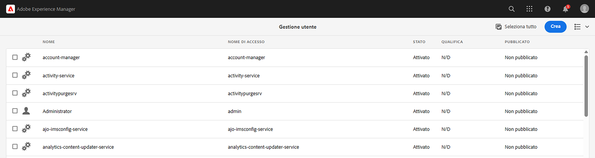
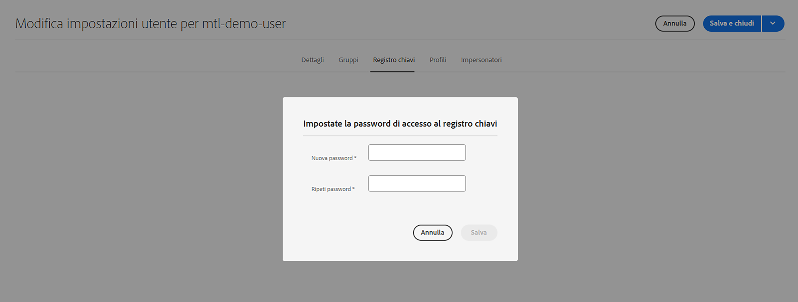
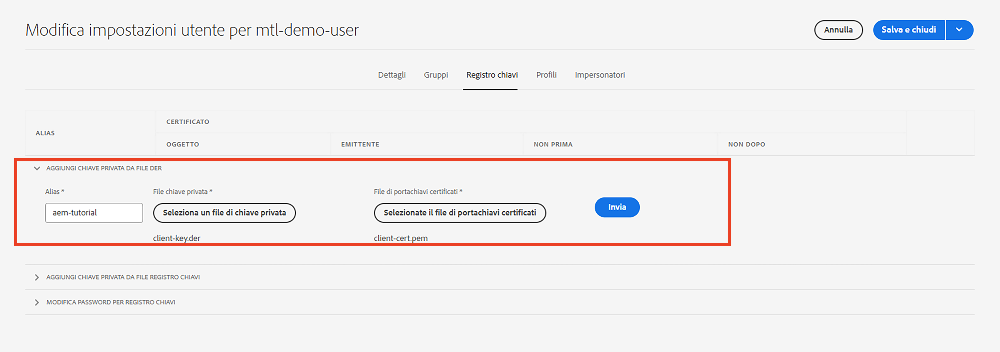
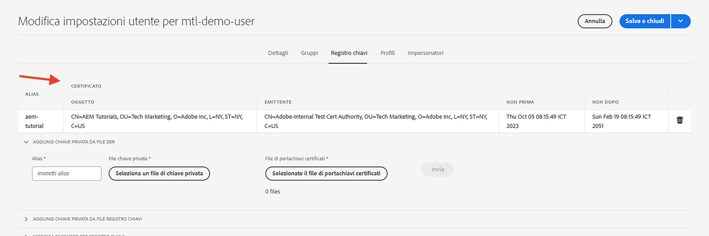

# Autenticazione Mutual Transport Layer Security (mTLS) dall’AEM

Scopri come effettuare chiamate HTTPS da AEM alle API web che richiedono l’autenticazione Mutual Transport Layer Security (mTLS).

>[!VIDEO](https://video.tv.adobe.com/v/3424855?quality=12&learn=on)

L’autenticazione mTLS o TLS bidirezionale migliora la sicurezza del protocollo TLS richiedendo **sia il client che il server per l&#39;autenticazione reciproca**. Questa autenticazione viene eseguita utilizzando certificati digitali. Viene comunemente utilizzato in scenari in cui la sicurezza e la verifica dell’identità sono fondamentali.

Per impostazione predefinita, quando si tenta di stabilire una connessione HTTPS a un’API web che richiede l’autenticazione mTLS, la connessione non riesce e viene visualizzato il messaggio di errore:

```
javax.net.ssl.SSLHandshakeException: Received fatal alert: certificate_required
```

Questo problema si verifica quando il client non presenta un certificato per l’autenticazione.

Scopri come chiamare correttamente le API che richiedono l’autenticazione mTLS utilizzando [Apache HttpClient](https://hc.apache.org/httpcomponents-client-4.5.x/index.html) e **KeyStore e TrustStore AEM**.


## HttpClient e caricamento del materiale KeyStore dell’AEM

Ad alto livello, per richiamare un’API protetta da mTLS dall’AEM sono necessari i seguenti passaggi.

### Generazione di certificati AEM

Richiedi il certificato AEM collaborando con il team di sicurezza della tua organizzazione. Il team di sicurezza fornisce o richiede i dettagli relativi al certificato come chiave, richiesta di firma del certificato (CSR, Certificate Signing Request) e utilizzando CSR il certificato viene rilasciato.

A scopo dimostrativo, genera i dettagli relativi al certificato come chiave, richiesta di firma del certificato (CSR, Certificate Signing Request). Nell’esempio seguente, per rilasciare il certificato viene utilizzata una CA autofirmata.

- Innanzitutto, genera il certificato dell’Autorità di certificazione (CA) interna.

  ```shell
  # Create an internal Certification Authority (CA) certificate
  openssl req -new -x509 -days 9999 -keyout internal-ca-key.pem -out internal-ca-cert.pem
  ```

- Genera il certificato AEM.

  ```shell
  # Generate Key
  openssl genrsa -out client-key.pem
  
  # Generate CSR
  openssl req -new -key client-key.pem -out client-csr.pem
  
  # Generate certificate and sign with internal Certification Authority (CA)
  openssl x509 -req -days 9999 -in client-csr.pem -CA internal-ca-cert.pem -CAkey internal-ca-key.pem -CAcreateserial -out client-cert.pem
  
  # Verify certificate
  openssl verify -CAfile internal-ca-cert.pem client-cert.pem
  ```

- Converti la chiave privata AEM in formato DER, AEM KeyStore richiede la chiave privata in formato DER.

  ```shell
  openssl pkcs8 -topk8 -inform PEM -outform DER -in client-key.pem -out client-key.der -nocrypt
  ```

>[!TIP]
>
>I certificati CA autofirmati vengono utilizzati solo a scopo di sviluppo. Per la produzione, utilizza un’autorità di certificazione (CA) attendibile per rilasciare il certificato.


### Scambio di certificati

Se per il certificato AEM utilizzi una CA autofirmata, come indicato sopra, invia il certificato o il certificato dell’Autorità di certificazione (CA) interna al provider API.

Inoltre, se il provider API utilizza un certificato CA autofirmato, riceverà il certificato o il certificato dell&#39;Autorità di certificazione (CA) interna dal provider API.

### Importazione certificati

Per importare un certificato AEM, effettua le seguenti operazioni:

1. Accedi a **Autore AEM** come **amministratore**.

1. Accedi a **AEM Author > Tools > Security > Users > Create or Select a existing user (Creazione o selezione di un utente esistente)**.

   

   A scopo dimostrativo, un nuovo utente denominato `mtl-demo-user` viene creato.

1. Per aprire **Proprietà utente**, fare clic sul nome utente.

1. Clic **Registro chiavi** e quindi fare clic su **Crea registro chiavi** pulsante. Quindi nel **Imposta password di accesso al registro chiavi** , impostare una password per il keystore di questo utente e fare clic su Salva.

   

1. Nella nuova schermata, sotto **AGGIUNGI CHIAVE PRIVATA DA FILE DER** nella sezione, effettua le seguenti operazioni:

   1. Immetti alias

   1. Importa la chiave privata AEM in formato DER, generata in precedenza.

   1. Importa i file della catena di certificati generati in precedenza.

   1. Fai clic su Invia

      

1. Verifica che il certificato sia stato importato correttamente.

   

Se il provider API utilizza un certificato CA autofirmato, importa il certificato ricevuto in AEM TrustStore e segui i passaggi descritti in [qui](https://experienceleague.adobe.com/docs/experience-manager-learn/foundation/security/call-internal-apis-having-private-certificate.html#httpclient-and-load-aem-truststore-material).

Allo stesso modo, se l’AEM utilizza un certificato CA autofirmato, richiedi al provider API di importarlo.

### Codice di chiamata API mTLS prototipo utilizzando HttpClient

Aggiorna il codice Java™ come segue. Da utilizzare `@Reference` annotazione per ottenere AEM `KeyStoreService` servizio il codice chiamante deve essere un componente/servizio OSGi o un modello Sling (e `@OsgiService` viene utilizzato).


```java
...

// Get AEM's KeyStoreService reference
@Reference
private com.adobe.granite.keystore.KeyStoreService keyStoreService;

...

// Get AEM KeyStore using KeyStoreService
KeyStore aemKeyStore = getAEMKeyStore(keyStoreService, resourceResolver);

if (aemKeyStore != null) {

    // Create SSL Context
    SSLContextBuilder sslbuilder = new SSLContextBuilder();

    // Load AEM KeyStore material into above SSL Context with keystore password
    // Ideally password should be encrypted and stored in OSGi config
    sslbuilder.loadKeyMaterial(aemKeyStore, "admin".toCharArray());

    // If API provider cert is self-signed, load AEM TrustStore material into above SSL Context
    // Get AEM TrustStore
    KeyStore aemTrustStore = getAEMTrustStore(keyStoreService, resourceResolver);
    sslbuilder.loadTrustMaterial(aemTrustStore, null);

    // Create SSL Connection Socket using above SSL Context
    SSLConnectionSocketFactory sslsf = new SSLConnectionSocketFactory(
            sslbuilder.build(), NoopHostnameVerifier.INSTANCE);

    // Create HttpClientBuilder
    HttpClientBuilder httpClientBuilder = HttpClientBuilder.create();
    httpClientBuilder.setSSLSocketFactory(sslsf);

    // Create HttpClient
    CloseableHttpClient httpClient = httpClientBuilder.build();

    // Invoke API
    closeableHttpResponse = httpClient.execute(new HttpGet(MTLS_API_ENDPOINT));

    // Code that reads response code and body from the 'closeableHttpResponse' object
    ...
} 

/**
 * Returns the AEM KeyStore of a user. In this example we are using the
 * 'mtl-demo-user' user.
 * 
 * @param keyStoreService
 * @param resourceResolver
 * @return AEM KeyStore
 */
private KeyStore getAEMKeyStore(KeyStoreService keyStoreService, ResourceResolver resourceResolver) {

    // get AEM KeyStore of 'mtl-demo-user' user, you can create a user or use an existing one. 
    // Then create keystore and upload key, certificate files.
    KeyStore aemKeyStore = keyStoreService.getKeyStore(resourceResolver, "mtl-demo-user");

    return aemKeyStore;
}

/**
 * 
 * Returns the global AEM TrustStore
 * 
 * @param keyStoreService OOTB OSGi service that makes AEM based KeyStore
 *                         operations easy.
 * @param resourceResolver
 * @return
 */
private KeyStore getAEMTrustStore(KeyStoreService keyStoreService, ResourceResolver resourceResolver) {

    // get AEM TrustStore from the KeyStoreService and ResourceResolver
    KeyStore aemTrustStore = keyStoreService.getTrustStore(resourceResolver);

    return aemTrustStore;
}

...
```

- Iniettare la soluzione iniettabile `com.adobe.granite.keystore.KeyStoreService` Il servizio OSGi nel componente OSGi.
- Ottieni il registro chiavi AEM dell’utente tramite `KeyStoreService` e `ResourceResolver`, il `getAEMKeyStore(...)` il metodo lo fa.
- Se il provider API utilizza un certificato CA autofirmato, ottenere il TrustStore AEM globale, il `getAEMTrustStore(...)` il metodo lo fa.
- Crea un oggetto di `SSLContextBuilder`, consulta Java™ [Dettagli API](https://javadoc.io/static/org.apache.httpcomponents/httpcore/4.4.8/index.html?org/apache/http/ssl/SSLContextBuilder.html).
- Carica il registro chiavi AEM dell’utente in `SSLContextBuilder` utilizzo `loadKeyMaterial(final KeyStore keystore,final char[] keyPassword)` metodo.
- La password del keystore è la password impostata durante la creazione del keystore, deve essere memorizzata nella configurazione OSGi, vedi [Valori di configurazione segreti](https://experienceleague.adobe.com/docs/experience-manager-cloud-service/content/implementing/deploying/configuring-osgi.html#secret-configuration-values).

## Evita le modifiche al keystore JVM

Un approccio convenzionale per richiamare in modo efficace le API mTLS con certificati privati comporta la modifica del keystore JVM. Ciò si ottiene importando i certificati privati utilizzando Java™ [keytool](https://docs.oracle.com/en/java/javase/11/tools/keytool.html#GUID-5990A2E4-78E3-47B7-AE75-6D1826259549) comando.

Tuttavia, questo metodo non è allineato con le best practice di sicurezza e l’AEM offre un’opzione superiore tramite l’utilizzo di **KeyStore specifici dell&#39;utente e TrustStore globale** e [ServizioArchivioChiavi](https://javadoc.io/doc/com.adobe.aem/aem-sdk-api/latest/com/adobe/granite/keystore/KeyStoreService.html).

## Pacchetto soluzione

Il progetto Node.js di esempio illustrato nel video può essere scaricato da [qui](assets/internal-api-call/REST-APIs.zip).

Il codice servlet dell’AEM è disponibile nel documento WKND Sites Project `tutorial/web-api-invocation` filiale, [vedi](https://github.com/adobe/aem-guides-wknd/tree/tutorial/web-api-invocation/core/src/main/java/com/adobe/aem/guides/wknd/core/servlets).
