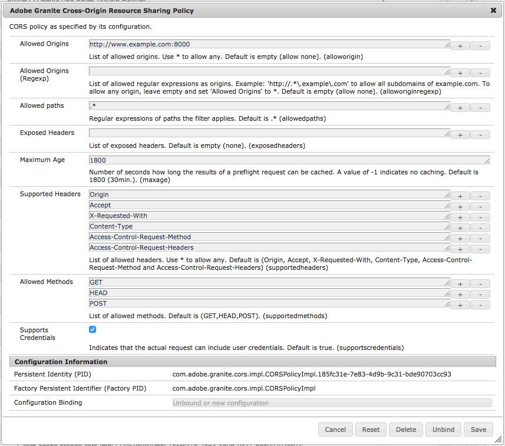

# Comprendere la condivisione delle risorse tra le origini ([!DNL CORS])

La condivisione delle risorse tra le origini di Adobe Experience Manager ([!DNL CORS]) facilita le proprietà web non AEM a effettuare chiamate lato client ad AEM, autenticate e non autenticate, per recuperare contenuto o interagire direttamente con AEM.

La configurazione OSGI descritta in questo documento è sufficiente per:

1. Condivisione di risorse a origine singola in AEM Publish
2. Accesso CORS ad AEM Author

Se è richiesto l&#39;accesso CORS per più origini in AEM Publish, consulta [questa documentazione](https://experienceleague.adobe.com/docs/experience-manager-learn/getting-started-with-aem-headless/deployments/configurations/cors.html?lang=it#dispatcher-configuration).

## Configurazione OSGi dei criteri di condivisione delle risorse tra diverse origini di Adobe Granite

Le configurazioni CORS sono gestite come factory di configurazione OSGi in AEM, dove ogni criterio è rappresentato come un’istanza della factory.

* `http://<host>:<port>/system/console/configMgr > Adobe Granite Cross Origin Resource Sharing Policy`



[!DNL Adobe Granite Cross-Origin Resource Sharing Policy] (`com.adobe.granite.cors.impl.CORSPolicyImpl`)

### Selezione criteri

Per selezionare un criterio, confronta il

* `Allowed Origin` con intestazione di richiesta `Origin`
* e `Allowed Paths` con il percorso della richiesta.

Vengono utilizzati i primi criteri che corrispondono a questi valori. Se non viene trovata alcuna richiesta, qualsiasi richiesta [!DNL CORS] verrà negata.

Se non è configurato alcun criterio, non verrà fornita risposta neanche alle richieste [!DNL CORS] perché il gestore è disabilitato e quindi negato in modo effettivo, purché nessun altro modulo del server risponda a [!DNL CORS].

### Proprietà dei criteri

#### [!UICONTROL Origini consentite]

* `"alloworigin" <origin> | *`
* Elenco di `origin` parametri che specificano gli URI che possono accedere alla risorsa. Per le richieste senza credenziali, il server può specificare &#42; come carattere jolly, consentendo in tal modo a qualsiasi origine di accedere alla risorsa. *Non è assolutamente consigliabile utilizzare `Allow-Origin: *` in produzione in quanto consente a ogni sito Web esterno (ad esempio, un utente non autorizzato) di effettuare richieste che senza CORS sono severamente vietate dai browser.*

#### [!UICONTROL Origini consentite (Regexp)]

* `"alloworiginregexp" <regexp>`
* Elenco di `regexp` espressioni regolari che specificano gli URI che possono accedere alla risorsa. *Le espressioni regolari possono causare corrispondenze non desiderate se non vengono create con attenzione, consentendo a un utente non autorizzato di utilizzare un nome di dominio personalizzato che corrisponda anche al criterio.* In genere si consiglia di disporre di criteri separati per ogni nome host di origine specifico, utilizzando `alloworigin`, anche se ciò significa la configurazione ripetuta delle altre proprietà dei criteri. Origini diverse tendono ad avere cicli di vita e requisiti diversi, beneficiando così di una netta separazione.

#### [!UICONTROL Percorsi consentiti]

* `"allowedpaths" <regexp>`
* Elenco di `regexp` espressioni regolari che specificano i percorsi delle risorse a cui si applica il criterio.

#### [!UICONTROL Intestazioni esposte]

* `"exposedheaders" <header>`
* Elenco di parametri di intestazione che indicano le intestazioni di risposta a cui i browser possono accedere. Per le richieste CORS (non pre-flight), se non vuote, questi valori vengono copiati nell&#39;intestazione di risposta `Access-Control-Expose-Headers`. I valori nell’elenco (nomi delle intestazioni) vengono quindi resi accessibili al browser; senza di esso, tali intestazioni non sono leggibili dal browser.

#### [!UICONTROL Età massima]

* `"maxage" <seconds>`
* Un parametro `seconds` che indica per quanto tempo è possibile memorizzare nella cache i risultati di una richiesta di pre-volo.

#### [!UICONTROL Intestazioni supportate]

* `"supportedheaders" <header>`
* Elenco di `header` parametri che indicano quali intestazioni di richiesta HTTP possono essere utilizzate quando si effettua la richiesta effettiva.

#### [!UICONTROL Metodi consentiti]

* `"supportedmethods"`
* Elenco dei parametri di metodo che indicano quali metodi HTTP possono essere utilizzati quando si effettua la richiesta effettiva.

#### [!UICONTROL Supporta Le Credenziali]

* `"supportscredentials" <boolean>`
* Un `boolean` che indica se la risposta alla richiesta può essere esposta o meno al browser. Se utilizzata come parte di una risposta a una richiesta di pre-volo, indica se la richiesta effettiva può essere effettuata o meno utilizzando le credenziali.

### Esempi di configurazioni

Il sito 1 è uno scenario di base, anonimamente accessibile e di sola lettura in cui il contenuto viene utilizzato tramite [!DNL GET] richieste:

```json
{
  "supportscredentials":false,
  "exposedheaders":[
    ""
  ],
  "supportedmethods":[
    "GET",
    "HEAD"
  ],
  "alloworigin":[
    "http://127.0.0.1:3000",
    "https://site1.com"
    
  ],
  "maxage:Integer": 1800,
  "alloworiginregexp":[
    "http://localhost:.*"
    "https://.*\.site1\.com"
  ],
  "allowedpaths":[
    "/content/_cq_graphql/site1/endpoint.json",
    "/graphql/execute.json.*",
    "/content/site1/.*"
  ],
  "supportedheaders":[
    "Origin",
    "Accept",
    "X-Requested-With",
    "Content-Type",
    "Access-Control-Request-Method",
    "Access-Control-Request-Headers"
  ]
}
```

Il sito 2 è più complesso e richiede richieste autorizzate e mutanti (POST, PUT, DELETE):

```json
{
  "supportscredentials":true,
  "exposedheaders":[
    ""
  ],
  "supportedmethods":[
    "GET",
    "HEAD"
    "POST",
    "DELETE",
    "PUT"
  ],
  "alloworigin":[
    "http://127.0.0.1:3000",
    "https://site2.com"
    
  ],
  "maxage:Integer": 1800,
  "alloworiginregexp":[
    "http://localhost:.*"
    "https://.*\.site2\.com"
  ],
  "allowedpaths":[
    "/content/site2/.*",
    "/libs/granite/csrf/token.json",
  ],
  "supportedheaders":[
    "Origin",
    "Accept",
    "X-Requested-With",
    "Content-Type",
    "Access-Control-Request-Method",
    "Access-Control-Request-Headers",
    "Authorization",
    "CSRF-Token"
  ]
}
```

## Problemi e configurazione relativi alla memorizzazione nella cache di Dispatcher {#dispatcher-caching-concerns-and-configuration}

A partire da Dispatcher 4.1.1+, le intestazioni di risposta possono essere memorizzate nella cache. In questo modo è possibile memorizzare nella cache [!DNL CORS] intestazioni insieme alle risorse richieste da [!DNL CORS], purché la richiesta sia anonima.

In generale, le stesse considerazioni per la memorizzazione in cache del contenuto in Dispatcher possono essere applicate alla memorizzazione in cache delle intestazioni di risposta CORS in Dispatcher. La tabella seguente definisce quando è possibile memorizzare in cache [!DNL CORS] intestazioni (e quindi [!DNL CORS] richieste).

| Memorizzabile in cache | Ambiente | Stato di autenticazione | Spiegazione |
|-----------|-------------|-----------------------|-------------|
| No | AEM Publish | Autenticato | La memorizzazione nella cache di Dispatcher in AEM Author è limitata alle risorse statiche non create. Questo rende difficile e poco pratico memorizzare in cache la maggior parte delle risorse su AEM Author, incluse le intestazioni di risposta HTTP. |
| No | AEM Publish | Autenticato | Evita di memorizzare nella cache le intestazioni CORS nelle richieste autenticate. Questo si allinea alla linea guida comune di non memorizzare in cache le richieste autenticate, in quanto è difficile determinare in che modo lo stato di autenticazione/autorizzazione dell’utente richiedente influirà sulla risorsa consegnata. |
| Sì | AEM Publish | Anonimo | Le intestazioni di risposta delle richieste anonime memorizzabili nella cache di Dispatcher possono essere memorizzate anche nella cache, in modo che le richieste CORS future possano accedere al contenuto memorizzato nella cache. Qualsiasi modifica alla configurazione CORS nella pubblicazione AEM **deve** essere seguita da un&#39;invalidazione delle risorse memorizzate nella cache interessate. Le best practice impongono distribuzioni di codice o configurazione per cui la cache del dispatcher viene eliminata, in quanto è difficile determinare quale contenuto memorizzato in cache può essere influenzato. |

### Consentire le intestazioni di richiesta CORS

Per consentire alle intestazioni di richiesta HTTP [di passare ad AEM per l&#39;elaborazione](https://experienceleague.adobe.com/docs/experience-manager-dispatcher/using/configuring/dispatcher-configuration.html?lang=it#specifying-the-http-headers-to-pass-through-clientheaders), devono essere consentite nella configurazione di Dispatcher `/clientheaders`.

```
/clientheaders {
   ...
   "Origin"
   "Access-Control-Request-Method"
   "Access-Control-Request-Headers"
}
```

### Memorizzazione nella cache delle intestazioni di risposta CORS

Per consentire il caching e il serving delle intestazioni CORS sul contenuto memorizzato nella cache, aggiungi la seguente configurazione [/cache /headers](https://experienceleague.adobe.com/docs/experience-manager-dispatcher/using/configuring/dispatcher-configuration.html?lang=it#caching-http-response-headers) al file `dispatcher.any` di pubblicazione di AEM.

```
/publishfarm {
    ...
    /cache {
        ...
        # CORS HTTP response headers
        # https://developer.mozilla.org/en-US/docs/Web/HTTP/CORS#the_http_response_headers
        /headers {
            ...
            "Access-Control-Allow-Origin"
            "Access-Control-Expose-Headers"
            "Access-Control-Max-Age"
            "Access-Control-Allow-Credentials"
            "Access-Control-Allow-Methods"
            "Access-Control-Allow-Headers"
        }
    ...
    }
...
}
```

Ricordarsi di **riavviare l&#39;applicazione server Web** dopo aver apportato modifiche al file `dispatcher.any`.

È probabile che la cancellazione completa della cache sia necessaria per garantire che le intestazioni siano memorizzate nella cache in modo appropriato alla successiva richiesta dopo un aggiornamento della configurazione di `/cache/headers`.

## Risoluzione dei problemi CORS

Registrazione disponibile in `com.adobe.granite.cors`:

* abilita `DEBUG` per visualizzare i dettagli sul motivo per cui una richiesta [!DNL CORS] è stata negata
* abilita `TRACE` per visualizzare i dettagli di tutte le richieste effettuate tramite il gestore CORS

### Suggerimenti:

* Ricreare manualmente le richieste XHR utilizzando CURL, ma assicurati di copiare tutte le intestazioni e i dettagli, in quanto ciascuno può fare la differenza; alcune console del browser consentono di copiare il comando CURL
* Verifica se la richiesta è stata negata dal gestore CORS e non dall’autenticazione, dal filtro token CSRF, dai filtri del dispatcher o da altri livelli di sicurezza
   * Se il gestore CORS risponde con 200, ma l&#39;intestazione `Access-Control-Allow-Origin` è assente nella risposta, esaminare i registri per le negazioni in [!DNL DEBUG] in `com.adobe.granite.cors`
* Se la memorizzazione nella cache del dispatcher di [!DNL CORS] richieste è abilitata
   * Verificare che la configurazione `/cache/headers` sia applicata a `dispatcher.any` e che il server Web sia stato riavviato correttamente
   * Assicurati che la cache sia stata cancellata correttamente dopo qualsiasi modifica alla configurazione OSGi o dispatcher.any.
* se necessario, controlla la presenza delle credenziali di autenticazione nella richiesta.

## Materiali di supporto

* [AEM OSGi Configuration Factory per i criteri di condivisione risorse tra diverse origini](http://localhost:4502/system/console/configMgr/com.adobe.granite.cors.impl.CORSPolicyImpl)
* [Condivisione risorse tra le origini (W3C)](https://www.w3.org/TR/cors/)
* [Controllo accesso HTTP (Mozilla MDN)](https://developer.mozilla.org/en-US/docs/Web/HTTP/Access_control_CORS)
