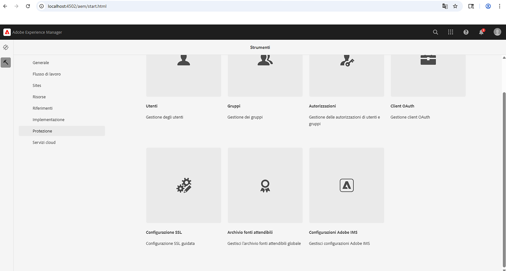
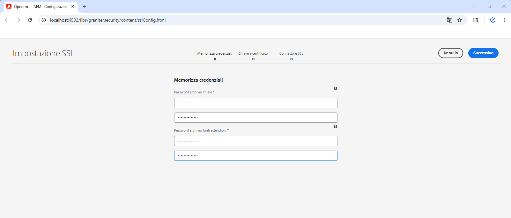
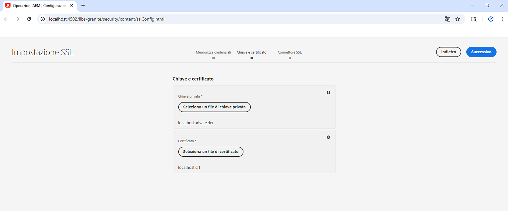
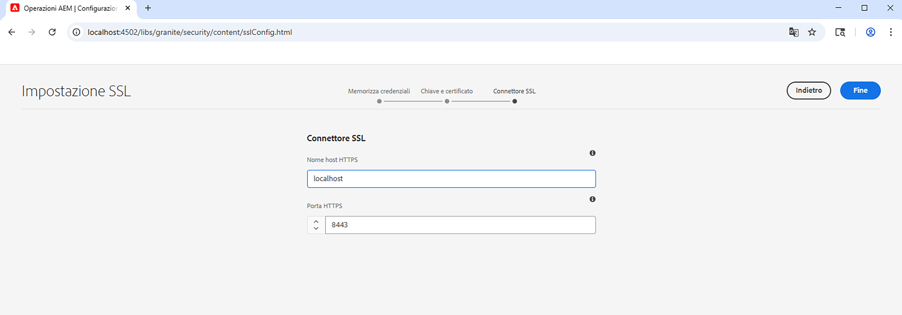
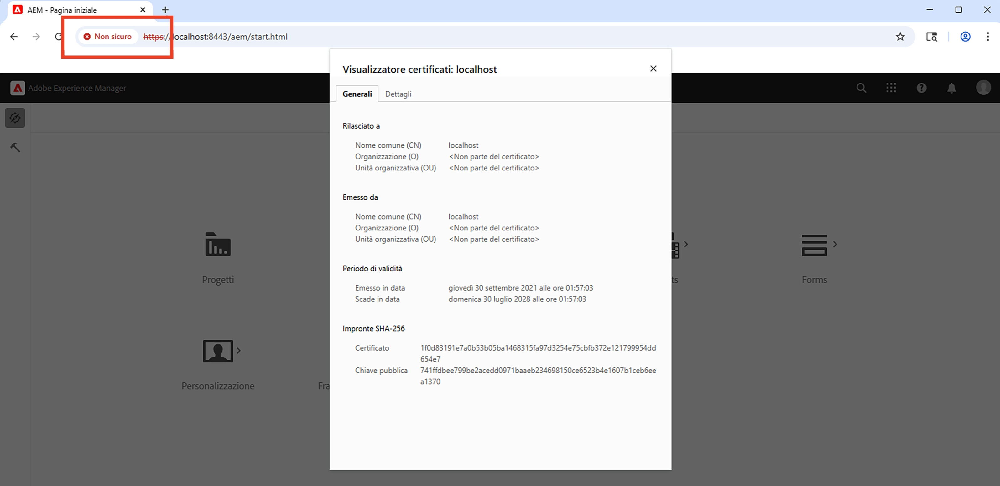

# Utilizzare la procedura guidata SSL in AEM

Scopri come configurare SSL in Adobe Experience Manager per eseguirlo su HTTPS utilizzando la procedura guidata SSL integrata.

>[!VIDEO](https://video.tv.adobe.com/v/326688?quality=12&learn=on&captions=ita)


>[!NOTE]
>
>Per gli ambienti gestiti, è consigliabile che il reparto IT fornisca certificati e chiavi attendibili da una CA.
>
>I certificati con firma autonoma devono essere utilizzati solo a scopo di sviluppo.

## Utilizzo della procedura guidata per la configurazione SSL

Passa a __Authoring AEM > Strumenti > Sicurezza > Configurazione SSL__ e apri la __Procedura guidata per la configurazione SSL__.



### Creare le credenziali dell’archivio

Per creare un _archivio chiavi_ associato all’utente di sistema `ssl-service` e un _archivio attendibile_ globale, utilizza il passaggio della procedura guidata __Credenziali dell’archivio__.

1. Immetti la password per l’__archivio chiavi__ associata all’utente di sistema `ssl-service` e confermala.
1. Immetti la password per l’__archivio attendibile__ globale e confermala. Ricorda che l’archivio attendibile funziona a livello di sistema e, se è già stato creato, la password immessa viene ignorata.

   

### Caricare la chiave privata e il certificato

Per caricare la _chiave privata_ e il _certificato SSL_, utilizza il passaggio della procedura guidata __Chiave e certificato__.

In genere, il reparto IT fornisce il certificato e la chiave attendibili da una CA, tuttavia è possibile utilizzare il certificato con firma autonoma per scopi di __sviluppo__ e __test__.

Per creare o scaricare il certificato con firma autonoma, consulta [Chiave privata e certificato con firma autonoma](#self-signed-private-key-and-certificate).

1. Carica la __Chiave privata__ nel formato DER (Regole di codifica distinte). A differenza del formato PEM, i file con codifica DER non contengono istruzioni di testo normale come `-----BEGIN CERTIFICATE-----`
1. Carica il __certificato SSL__ associato nel formato `.crt`.

   

### Aggiornare i dettagli del connettore SSL

Per aggiornare il _nome host_ e la _porta_, utilizza il passaggio della procedura guidata __Connettore SSL__.

1. Aggiorna o verifica il valore del __Nome host HTTPS__, che deve corrispondere al `Common Name (CN)` del certificato.
1. Aggiorna o verifica il valore della __porta HTTPS__.

   

### Verificare la configurazione SSL

1. Per verificare l’SSL, fai clic sul pulsante __Vai all’URL HTTPS__.
1. Se utilizzi un certificato con firma autonoma, viene visualizzato l’errore `Your connection is not private`.

   

## Chiave privata e certificato con firma autonoma

Il seguente file ZIP contiene i file [!DNL DER] e [!DNL CRT] necessari per la configurazione locale dell’SSL di AEM e destinati esclusivamente allo sviluppo locale.

I file [!DNL DER] e [!DNL CERT] vengono forniti per comodità e generati utilizzando i passaggi descritti nella sezione Generare la chiave privata e il certificato con firma autonoma seguente.

Se necessario, la passphrase del certificato è **admin**.

Questo è l’host locale - private key and self-signed certificate.zip (scade a luglio 2028)

[Scaricare il file del certificato](assets/use-the-ssl-wizard/certificate.zip)

### Generazione di chiavi private e certificati con firma autonoma

Il video precedente illustra la configurazione e l’impostazione SSL in un’istanza di authoring di AEM utilizzando certificati con firma autonoma. I seguenti comandi che utilizzano [[!DNL OpenSSL]](https://www.openssl.org/) possono generare una chiave privata e un certificato da utilizzare nel passaggio 2 della procedura guidata.

```shell
### Create Private Key
$ openssl genrsa -aes256 -out localhostprivate.key 4096

### Generate Certificate Signing Request using private key
$ openssl req -sha256 -new -key localhostprivate.key -out localhost.csr -subj '/CN=localhost'

### Generate the SSL certificate and sign with the private key, will expire one year from now
$ openssl x509 -req -extfile <(printf "subjectAltName=DNS:localhost") -days 365 -in localhost.csr -signkey localhostprivate.key -out localhost.crt

### Convert Private Key to DER format - SSL wizard requires key to be in DER format
$ openssl pkcs8 -topk8 -inform PEM -outform DER -in localhostprivate.key -out localhostprivate.der -nocrypt
```
