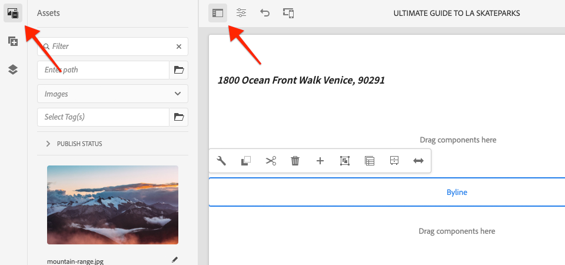
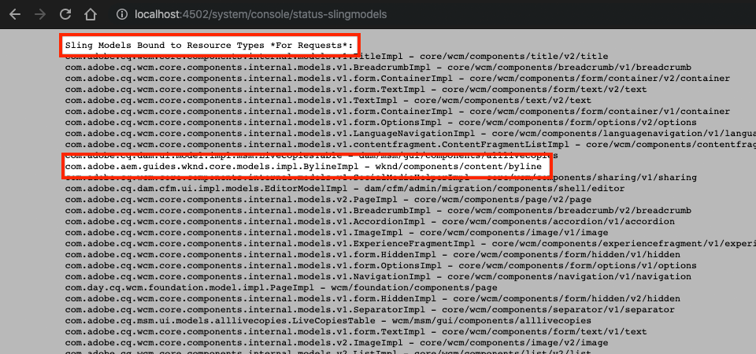
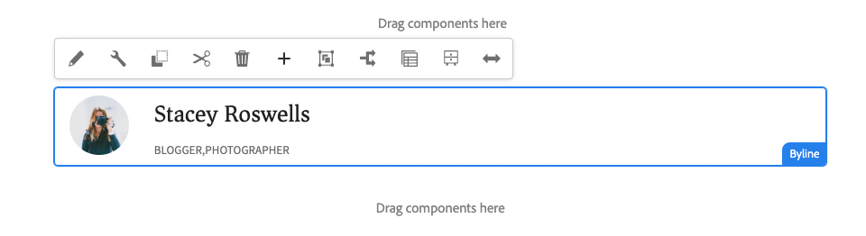

# Componente personalizzato {#custom-component}

Questa esercitazione descrive la creazione end-to-end di un componente personalizzato AEM Byline che visualizza il contenuto creato in una finestra di dialogo ed esplora lo sviluppo di un modello Sling per racchiudere logica aziendale che popola l’HTL del componente.

## Prerequisiti {#prerequisites}

Esaminare le istruzioni e gli strumenti necessari per configurare un ambiente [di sviluppo](overview.md#local-dev-environment)locale.

### Progetto iniziale

>[!NOTE]
>
> Se avete seguito le istruzioni nelle parti precedenti dell&#39;esercitazione, noterete che il progetto iniziale per questo capitolo accelera l&#39;implementazione. Include alcuni altri modelli e molto altro contenuto. Inoltre, è possibile esplorare liberamente i nuovi contenuti e altre aree dell&#39;implementazione, al di fuori dello sviluppo di componenti personalizzati.

Controlla il codice della riga di base su cui si basa l&#39;esercitazione:

1. Duplicate l&#39;archivio [github.com/adobe/aem-guides-wknd](https://github.com/adobe/aem-guides-wknd) .
1. Estrarre il `custom-component/start` ramo

   ```shell
   $ git clone git@github.com:adobe/aem-guides-wknd.git ~/code/aem-guides-wknd
   $ cd ~/code/aem-guides-wknd
   $ git checkout custom-component/start
   ```

1. Distribuisci la base di codice in un&#39;istanza AEM locale utilizzando le tue competenze Paradiso:

   ```shell
   $ cd ~/code/aem-guides-wknd
   $ mvn clean install -PautoInstallSinglePackage
   ```

È sempre possibile visualizzare il codice finito su [GitHub](https://github.com/adobe/aem-guides-wknd/tree/custom-component/solution) o estrarre il codice localmente passando al ramo `custom-component/solution`.

## Obiettivo

1. Come creare un componente AEM personalizzato
1. Scopri come incorporare la logica di business con Sling Models
1. Come utilizzare un modello Sling da uno script HTL

## Cosa verrà creato {#byline-component}

>[!VIDEO](https://video.tv.adobe.com/v/30181/?quality=12&learn=on)

In questa parte dell&#39;esercitazione WKND, viene creato un componente autore che verrà utilizzato per visualizzare le informazioni create sul collaboratore di un articolo.


*Byline component video design fornito dal team di progettazione WKND*

L&#39;implementazione del componente Byline include una finestra di dialogo che raccoglie il contenuto del byline e un modello Sling personalizzato che recupera i valori del byline:

* Nome
* Immagine
* Occupazioni

per la visualizzazione da parte di uno script HTL, che esegue il rendering dell&#39;HTML visualizzato dal browser alla fine.


*Scomposizione componente autore*

## Crea componente per autore {#create-byline-component}

Innanzitutto, creare la struttura del nodo del componente autore e definire una finestra di dialogo. Rappresenta il componente in AEM e definisce implicitamente il tipo di risorsa del componente in base alla sua posizione nel JCR.

La finestra di dialogo presenta l’interfaccia con la quale gli autori dei contenuti possono fornire informazioni. Per questa implementazione, il componente **Immagine** del componente core WCM AEM verrà sfruttato per gestire l’authoring e il rendering dell’immagine del componente principale, in modo che venga impostato come componente `sling:resourceSuperType`.

### Crea nodo componente {#create-component-node}

1. Nel modulo **ui.apps** , andate a `/apps/wknd/components/content` e create un nuovo nodo denominato **byline** di tipo `cq:Component`.

   

1. Aggiungere le seguenti proprietà al `cq:Component` nodo del componente Byline.

   ```plain
   jcr:title = Byline
   jcr:description = Displays a contributor's byline.
   componentGroup = WKND.Content
   sling:resourceSuperType =  core/wcm/components/image/v2/image
   ```

   

   Questo `.content.xml` XML restituisce:

   ```xml
   <?xml version="1.0" encoding="UTF-8"?>
   <jcr:root
       xmlns:sling="https://sling.apache.org/jcr/sling/1.0" xmlns:jcr="https://www.jcp.org/jcr/1.0"
       jcr:primaryType="cq:Component"
       jcr:title="Byline"
       jcr:description="Displays a contributor's byline."
       componentGroup="WKND.Content"
       sling:resourceSuperType="core/wcm/components/image/v2/image"/>
   ```

### Creare lo script HTL {#create-the-htl-script}

1. Sotto il `byline` nodo, aggiungete un nuovo file `byline.html`, responsabile della presentazione HTML del componente. È importante denominare il file come `cq:Component` nodo, in quanto diventa lo script predefinito che Sling utilizzerà per eseguire il rendering di questo tipo di risorsa.

1. Aggiungi il seguente codice al `byline.html`.

   ```xml
   <!--/* byline.html */-->
   <div data-sly-use.placeholderTemplate="core/wcm/components/commons/v1/templates.html">
   </div>
   <sly data-sly-call="${placeholderTemplate.placeholder @ isEmpty=true}"></sly>
   ```

`byline.html` viene [rivisitata in seguito](#byline-htl), una volta creato il modello Sling. Lo stato corrente del file HTL consente al componente di essere visualizzato in uno stato vuoto, nell’Editor pagina di AEM Sites, quando viene trascinato e rilasciato sulla pagina.

### Creare la definizione della finestra di dialogo {#create-the-dialog-definition}

Quindi, definire una finestra di dialogo per il componente Autore con i campi seguenti:

* **Nome**: un campo di testo con il nome del collaboratore.
* **Immagine**: un riferimento alla biografia del collaboratore.
* **Occupazioni**: un elenco di occupazioni attribuite al collaboratore. Le occupazioni devono essere ordinate in ordine alfabetico in ordine crescente (da a a z).

1. Sotto il nodo del `byline` componente create un nuovo nodo denominato `cq:dialog` of type `nt:unstructured`.
1. Update the `cq:dialog` with the following XML. È più semplice aprire il file XML `.content.xml` e copiarlo o incollarlo al suo interno.

   ```xml
   <?xml version="1.0" encoding="UTF-8"?>
   <jcr:root xmlns:sling="http://sling.apache.org/jcr/sling/1.0" xmlns:jcr="http://www.jcp.org/jcr/1.0"
           xmlns:nt="http://www.jcp.org/jcr/nt/1.0"
           jcr:primaryType="nt:unstructured"
           jcr:title="Byline"
           sling:resourceType="cq/gui/components/authoring/dialog">
       <content
               jcr:primaryType="nt:unstructured"
               sling:resourceType="granite/ui/components/coral/foundation/container">
           <items jcr:primaryType="nt:unstructured">
               <tabs
                       jcr:primaryType="nt:unstructured"
                       sling:resourceType="granite/ui/components/coral/foundation/tabs"
                       maximized="{Boolean}false">
                   <items jcr:primaryType="nt:unstructured">
                       <asset
                               jcr:primaryType="nt:unstructured"
                               sling:hideResource="{Boolean}false"/>
                       <metadata
                               jcr:primaryType="nt:unstructured"
                               sling:hideResource="{Boolean}true"/>
                       <properties
                               jcr:primaryType="nt:unstructured"
                               jcr:title="Properties"
                               sling:resourceType="granite/ui/components/coral/foundation/container"
                               margin="{Boolean}true">
                           <items jcr:primaryType="nt:unstructured">
                               <columns
                                       jcr:primaryType="nt:unstructured"
                                       sling:resourceType="granite/ui/components/coral/foundation/fixedcolumns"
                                       margin="{Boolean}true">
                                   <items jcr:primaryType="nt:unstructured">
                                       <column
                                               jcr:primaryType="nt:unstructured"
                                               sling:resourceType="granite/ui/components/coral/foundation/container">
                                           <items jcr:primaryType="nt:unstructured">
                                               <name
                                                       jcr:primaryType="nt:unstructured"
                                                       sling:resourceType="granite/ui/components/coral/foundation/form/textfield"
                                                       emptyText="Enter the contributor's name to display."
                                                       fieldDescription="The contributor's name to display."
                                                       fieldLabel="Name"
                                                       name="./name"
                                                       required="{Boolean}true"/>
                                               <occupations
                                                       jcr:primaryType="nt:unstructured"
                                                       sling:resourceType="granite/ui/components/coral/foundation/form/multifield"
                                                       fieldDescription="A list of the contributor's occupations."
                                                       fieldLabel="Occupations"
                                                       required="{Boolean}false">
                                                   <field
                                                           jcr:primaryType="nt:unstructured"
                                                           sling:resourceType="granite/ui/components/coral/foundation/form/textfield"
                                                           emptyText="Enter an occupation"
                                                           name="./occupations"/>
                                               </occupations>
                                           </items>
                                       </column>
                                   </items>
                               </columns>
                           </items>
                       </properties>
                   </items>
               </tabs>
           </items>
       </content>
   </jcr:root>
   ```

   Queste definizioni di nodo utilizzano [Sling Resource Merger](https://sling.apache.org/documentation/bundles/resource-merger.html) per controllare quali schede di dialogo vengono ereditate dal `sling:resourceSuperType` componente, in questo caso il componente **Immagine dei componenti** core.

   

### Creare la finestra di dialogo Criterio {#create-the-policy-dialog}

Seguendo lo stesso approccio utilizzato per la creazione della finestra di dialogo, creare una finestra di dialogo Criteri (precedentemente nota come finestra di dialogo Progettazione) per nascondere i campi indesiderati nella configurazione Criteri ereditata dal componente Immagine dei componenti core.

1. Sotto il `byline``cq:Component` nodo, create un nuovo nodo denominato `cq:design_dialog` of type `nt:unstructured`.
1. Update the `cq:design_dialog` with the following XML. È più semplice aprire il file XML `.content.xml` e copiarlo o incollarlo al suo interno.

   ```xml
   <?xml version="1.0" encoding="UTF-8"?>
   <jcr:root xmlns:sling="http://sling.apache.org/jcr/sling/1.0" xmlns:granite="http://www.adobe.com/jcr/granite/1.0" xmlns:cq="http://www.day.com/jcr/cq/1.0" xmlns:jcr="http://www.jcp.org/jcr/1.0" xmlns:nt="http://www.jcp.org/jcr/nt/1.0"
       jcr:primaryType="nt:unstructured"
       jcr:title="Byline"
       sling:resourceType="cq/gui/components/authoring/dialog">
       <content
               jcr:primaryType="nt:unstructured">
           <items jcr:primaryType="nt:unstructured">
               <tabs
                       jcr:primaryType="nt:unstructured">
                   <items jcr:primaryType="nt:unstructured">
                       <properties
                               jcr:primaryType="nt:unstructured">
                           <items jcr:primaryType="nt:unstructured">
                               <content
                                       jcr:primaryType="nt:unstructured">
                                   <items jcr:primaryType="nt:unstructured">
                                       <decorative
                                               jcr:primaryType="nt:unstructured"
                                               sling:hideResource="{Boolean}true"/>
                                       <altValueFromDAM
                                               jcr:primaryType="nt:unstructured"
                                               sling:hideResource="{Boolean}true"/>
                                       <titleValueFromDAM
                                               jcr:primaryType="nt:unstructured"
                                               sling:hideResource="{Boolean}true"/>
                                       <displayCaptionPopup
                                               jcr:primaryType="nt:unstructured"
                                               sling:hideResource="{Boolean}true"/>
                                       <disableUuidTracking
                                               jcr:primaryType="nt:unstructured"
                                               sling:hideResource="{Boolean}true"/>
                                   </items>
                               </content>
                           </items>
                       </properties>
                       <features
                               jcr:primaryType="nt:unstructured">
                           <items jcr:primaryType="nt:unstructured">
                               <content
                                       jcr:primaryType="nt:unstructured">
                                   <items jcr:primaryType="nt:unstructured">
                                       <accordion
                                               jcr:primaryType="nt:unstructured">
                                           <items jcr:primaryType="nt:unstructured">
                                               <orientation
                                                       jcr:primaryType="nt:unstructured"
                                                       sling:hideResource="{Boolean}true"/>
                                               <crop
                                                       jcr:primaryType="nt:unstructured"
                                                       sling:hideResource="{Boolean}true"/>
                                           </items>
                                       </accordion>
                                   </items>
                               </content>
                           </items>
                       </features>
                   </items>
               </tabs>
           </items>
       </content>
   </jcr:root>
   ```

   Il codice XML della finestra di dialogo **** Criteri precedente è stato ottenuto dal componente [Immagine componenti](https://github.com/adobe/aem-core-wcm-components/blob/master/content/src/content/jcr_root/apps/core/wcm/components/image/v2/image/_cq_design_dialog/.content.xml)principali.

   Come nella configurazione della finestra di dialogo, [Sling Resource Merger](https://sling.apache.org/documentation/bundles/resource-merger.html) viene utilizzato per nascondere i campi irrilevanti che vengono altrimenti ereditati dalla finestra di dialogo, come mostrato dalle definizioni dei nodi con `sling:resourceSuperType``sling:hideResource="{Boolean}true"` proprietà.

### Distribuzione del codice {#deploy-the-code}

1. Distribuisci la base di codice aggiornata in un&#39;istanza AEM locale utilizzando le tue competenze Paradiso:

   ```shell
   $ cd ~/code/aem-guides-wknd
   $ mvn clean install -PautoInstallPackage
   ```

### Add the component to a page {#add-the-component-to-a-page}

Per semplificare e concentrarsi sullo sviluppo AEM componente, il componente Autore aggiunto allo stato corrente a una pagina Articolo per verificare che la definizione del `cq:Component` nodo sia distribuita e corretta, AEM riconosce la nuova definizione del componente e la finestra di dialogo del componente funziona per l’authoring.

Poiché abbiamo [aggiunto il componente Byline al gruppo **di componenti** WKND.Content](#create-component-node)tramite la `/apps/wknd/components/content/byline@componentGroup=WKND.Content` proprietà, questo è automaticamente disponibile per qualsiasi Contenitore **di** layout il cui **criterio** consente il gruppo di componenti **** WKND.Content, che è il Contenitore di layout della pagina dell&#39;articolo.

#### Drag and drop the component onto the page {#drag-and-drop-the-component-onto-the-page}

1. **Modificate** la pagina dell&#39;articolo in **AEM > Siti > WKND Site > Language Master > English > Magazine > Ultimate Guide to LA Skateparks**.
1. Dalla barra laterale sinistra, trascinate e rilasciate un componente **** Byline nella **parte inferiore** del Contenitore di layout della pagina dell&#39;articolo aperta.

   

#### Creazione del componente {#author-the-component}

AEM autori configurano e creano i componenti tramite le finestre di dialogo. A questo punto nello sviluppo del componente Byline le finestre di dialogo sono incluse per la raccolta dei dati, tuttavia la logica per il rendering del contenuto creato non è ancora stata aggiunta.

1. Verificate che la barra laterale **sinistra sia aperta** e visibile e che sia selezionato **Asset Finder** .

   

1. Selezionate il segnaposto **del componente** Byline, che a sua volta mostra la barra delle azioni e toccate l&#39;icona della **chiave inglese** per aprire la finestra di dialogo.

   

1. Con la finestra di dialogo aperta e la prima scheda (Risorsa) attiva, aprite la barra laterale sinistra, quindi trascinate un’immagine nella zona di rilascio Immagine da Content Finder. Cercate &quot;stack&quot; per trovare Stacey Roswells bio picture fornito nel pacchetto ui.content WKND.

   **[stacey-roswells.jpg](assets/custom-component/stacey-roswells.jpg)**

   

1. Dopo aver aggiunto un’immagine, fate clic sulla scheda **Proprietà** per immettere il **nome** e le **occupazioni**.

   Quando immettete le occupazioni, immettetele in ordine alfabetico **** inverso in modo che la logica di business dell&#39;ordine alfabetico che implementeremo nel modello Sling sia facilmente visibile.

   Toccate il pulsante **Fine** in basso a destra per salvare le modifiche.

   

1. Dopo aver salvato la finestra di dialogo, andate al [CRXDE Lite](http://localhost:4502/crx/de/index.jsp#/content/wknd/language-masters/en/magazine/guide-la-skateparks/jcr:content/root/responsivegrid/responsivegrid/byline) e controllate in che modo il contenuto del componente viene memorizzato nel nodo del contenuto del componente dell’autore, sotto la pagina AEM.

   Individua il nodo del contenuto del componente Autore sotto il `jcr:content/root/responsivegrid/responsivegrid` nodo, ad es. `/content/wknd/language-masters/en/magazine/guide-la-skateparks/jcr:content/root/responsivegrid/responsivegrid/byline`.

   Osservate i nomi delle proprietà `name`, `occupations`e `fileReference` sono memorizzati nel nodo **** byline.

   Inoltre, si noti che `sling:resourceType` il nodo è impostato su `wknd/components/content/byline` quale è il legame tra questo nodo di contenuto e l’implementazione del componente Byline.

   

   */content/wknd/language-masters/it/magazine/guide-la-skateparks/jcr:content/root/responsivegrid/responsivegrid/byline*

## Crea modello Sling autore {#create-sling-model}

Verrà quindi creato un modello Sling che fungerà da modello di dati e da struttura logica di business per il componente Byline.

I modelli Sling sono modelli Java &quot;POJO&quot; basati su annotazioni (Plain Old Java Objects) che semplificano la mappatura dei dati dalle variabili JCR a Java e forniscono una serie di altre caratteristiche quando si sviluppano nel contesto di AEM.

### Rivedi dipendenze Paradiso {#maven-dependency}

Il modello Byline Sling si basa su diverse API Java fornite da AEM. Queste API sono rese disponibili tramite l&#39; `dependencies` elenco nel file POM del `core` modulo.

1. Aprite il `pom.xml` file sottostante `<src>/aem-guides-wknd/core/pom.xml`.
1. Trovare la dipendenza per il file `uber-jar` nella sezione delle dipendenze del file pom:

   ```xml
   ...
       <dependency>
           <groupId>com.adobe.aem</groupId>
           <artifactId>uber-jar</artifactId>
           <classifier>apis</classifier>
       </dependency>
   ...
   ```

   L&#39; [uber-jar](https://docs.adobe.com/content/help/en/experience-manager-65/developing/devtools/ht-projects-maven.html#experience-manager-api-dependencies) contiene tutte le API Java pubbliche esposte da AEM. Notate che nel `core/pom.xml` file non è specificata una versione. La versione viene invece mantenuta nel contenitore del reattore principale, situato alla radice del progetto `aem-guides-wknd/pom.xml`.

1. Trova la dipendenza per `core.wcm.components.core`:

   ```xml
    <!-- Core Component Dependency -->
       <dependency>
           <groupId>com.adobe.cq</groupId>
           <artifactId>core.wcm.components.core</artifactId>
       </dependency>
   ```

   Si tratta di tutte le API Java pubbliche esposte da AEM componenti core. AEM Componenti di base è un progetto mantenuto al di fuori di AEM e ha quindi un ciclo di rilascio separato. Per questo motivo si tratta di una dipendenza che deve essere inclusa separatamente e **non** inclusa con l&#39;uber-jar.

   Come l&#39;uber-jar, la versione di questa dipendenza viene mantenuta nel file pom del reattore principale che si trova in `aem-guides-wknd/pom.xml`.

   Più avanti in questa esercitazione utilizzeremo la classe Immagine componente principale per visualizzare l’immagine nel componente Autore. È necessario avere la dipendenza del componente core per creare e compilare il nostro modello Sling.

### Interfaccia autore {#byline-interface}

Create un&#39;interfaccia Java pubblica per il nome autore. `Byline.java` definisce i metodi pubblici necessari per eseguire lo script `byline.html` HTL.

1. Nel `aem-guides-wknd.core` modulo sottostante `src/main/java,` create una nuova interfaccia Java denominata `Byline.java` facendo clic con il pulsante destro del mouse sul `com.adobe.aem.guides.wknd.core.models` pacchetto > Nuovo > Interfaccia ****. Immettere **Nome autore** come nome dell&#39;interfaccia e fare clic su Fine.

   

1. Update `Byline.java` with the following methods:

   ```java
   package com.adobe.aem.guides.wknd.core.models;
   
   import java.util.List;
   
   /**
   * Represents the Byline AEM Component for the WKND Site project.
   **/
   public interface Byline {
       /***
       * @return a string to display as the name.
       */
       String getName();
   
       /***
       * Occupations are to be sorted alphabetically in a descending order.
       *
       * @return a list of occupations.
       */
       List<String> getOccupations();
   
       /***
       * @return a boolean if the component has enough content to display.
       */
       boolean isEmpty();
   }
   ```

   I primi due metodi espongono i valori per il **nome** e le **occupazioni** per il componente Byline.

   Il `isEmpty()` metodo consente di determinare se il componente ha del contenuto da sottoporre a rendering o se è in attesa di essere configurato.

   Notate che non esiste un metodo per l’immagine; [daremo un&#39;occhiata al perché in seguito](#tackling-the-image-problem).

### Implementazione autore {#byline-implementation}

`BylineImpl.java` è l&#39;implementazione del modello Sling che implementa l&#39; `Byline.java` interfaccia definita in precedenza. Il codice completo per `BylineImpl.java` è disponibile nella parte inferiore di questa sezione.

1. Nel `core` modulo sottostante `src/main/java`, create un nuovo file di classe denominato **BylineImpl.java** facendo clic con il pulsante destro del mouse sul `com.adobe.aem.guides.wknd.core.models.impl` pacchetto e selezionando **Nuovo > Classe**.

   Per il nome, immettere **BylineImpl**. Aggiungete l&#39;interfaccia **Byline** come interfaccia di implementazione.

   

1. Apri `BylineImpl.java`. Viene compilata automaticamente con tutti i metodi definiti nell&#39;interfaccia `Byline.java`. Aggiungete le annotazioni del modello Sling aggiornandole `BylineImpl.java` con le seguenti annotazioni a livello di classe. Questa `@Model(..)`annotazione è ciò che trasforma la classe in un modello Sling.

   ```java
   import org.apache.sling.api.SlingHttpServletRequest;
   import org.apache.sling.models.annotations.Model;
   import org.apache.sling.models.annotations.DefaultInjectionStrategy;
   ...
   @Model(
           adaptables = {SlingHttpServletRequest.class},
           adapters = {Byline.class},
           resourceType = {BylineImpl.RESOURCE_TYPE},
           defaultInjectionStrategy = DefaultInjectionStrategy.OPTIONAL
   )
   public class BylineImpl implements Byline {
       protected static final String RESOURCE_TYPE = "wknd/components/content/byline";
       ...
   }
   ```

   Esaminiamo questa annotazione e i relativi parametri:

   * L&#39; `@Model` annotazione registra BylineImpl come modello Sling quando viene distribuita per AEM.
   * Il `adaptables` parametro specifica che questo modello può essere adattato dalla richiesta.
   * Il `adapters` parametro consente di registrare la classe di implementazione nell&#39;interfaccia Byline. Questo consente allo script HTL di chiamare il modello Sling tramite l&#39;interfaccia (invece dell&#39;impl direttamente). [Maggiori dettagli sulle schede di rete sono disponibili qui](https://sling.apache.org/documentation/bundles/models.html#specifying-an-alternate-adapter-class-since-110).
   * Indica `resourceType` il tipo di risorsa del componente Byline (creato in precedenza) e aiuta a risolvere il modello corretto in presenza di più implementazioni. [Ulteriori dettagli sull&#39;associazione di una classe modello a un tipo di risorsa sono disponibili qui](https://sling.apache.org/documentation/bundles/models.html#associating-a-model-class-with-a-resource-type-since-130).

### Implementazione dei metodi del modello Sling {#implementing-the-sling-model-methods}

#### getName() {#implementing-get-name}

Il primo metodo che utilizzeremo è `getName()` che restituisce semplicemente il valore memorizzato nel nodo di contenuto JCR del byline sotto la proprietà `name`.

A questo scopo, l&#39;annotazione Modello `@ValueMapValue` Sling viene utilizzata per inserire il valore in un campo Java utilizzando la ValueMap della risorsa della richiesta.

```java
...
import org.apache.sling.models.annotations.injectorspecific.ValueMapValue;
...
public class BylineImpl implements Byline {
    ...

    @ValueMapValue
    private String name;

    ...
    @Override
    public String getName() {
        return name;
    }
    ...
}
```

Poiché la proprietà JCR condivide lo stesso nome del campo Java (entrambi sono &quot;name&quot;), risolve `@ValueMapValue` automaticamente l&#39;associazione e inserisce il valore della proprietà nel campo Java.

#### getOccupations() {#implementing-get-occupations}

Il prossimo metodo da implementare è `getOccupations()`. Questo metodo raccoglie tutte le occupazioni memorizzate nella proprietà JCR `occupations` e restituisce un insieme ordinato (in ordine alfabetico).

Utilizzando la stessa tecnica esplorata nel valore `getName()` della proprietà è possibile inserire nel campo Modello Sling.

Una volta che i valori delle proprietà JCR sono disponibili nel modello Sling tramite il campo Java iniettato `occupations`, la logica aziendale di ordinamento può essere applicata nel `getOccupations()` metodo.

```java
import java.util.ArrayList;
import java.util.Collections;
...

public class BylineImpl implements Byline {
    ...
    @ValueMapValue
    private List<String> occupations;
    ...
    public List<String> getOccupations() {
        if (occupations != null) {
            Collections.sort(occupations);
            return new ArrayList<String>(occupations);
        } else {
            return Collections.emptyList();
        }
    }
    ...
}
...
```

#### isEmpty() {#implementing-is-empty}

L’ultimo metodo pubblico è `isEmpty()` che determina quando il componente deve considerarsi &quot;sufficientemente creato&quot; per il rendering.

Per questo componente, i requisiti aziendali prevedono che tutti e tre i campi, nome, immagine e occupazioni debbano essere compilati *prima* che sia possibile eseguire il rendering del componente.

```java
import org.apache.commons.lang3.StringUtils;
...
public class BylineImpl implements Byline {
    ...
    @Override
    public boolean isEmpty() {
        if (StringUtils.isBlank(name)) {
            // Name is missing, but required
            return true;
        } else if (occupations == null || occupations.isEmpty()) {
            // At least one occupation is required
            return true;
        } else if (/* image is not null, logic to be determined */) {
            // A valid image is required
            return true;
        } else {
            // Everything is populated, so this component is not considered empty
            return false;
        }
    }
    ...
}
```

#### Come affrontare il &quot;problema immagine&quot; {#tackling-the-image-problem}

Controllare il nome e le condizioni di occupazione sono banali (e l&#39;Apache Commons Lang3 fornisce la sempre pratica classe [StringUtils](https://commons.apache.org/proper/commons-lang/apidocs/org/apache/commons/lang3/StringUtils.html) ), tuttavia, non è chiaro come sia possibile convalidare la **presenza dell&#39;immagine** , dal momento che il componente Immagine componenti core è utilizzato per la superficie dell&#39;immagine.

Esistono due modi per affrontare il problema:

1. Verificate se la proprietà `fileReference` JCR è risolta in una risorsa.
1. Converti questa risorsa in un modello Sling immagine componente core e assicurati che il `getSrc()` metodo non sia vuoto.

   Noi opteremo per il **secondo** approccio. Il primo approccio è probabilmente sufficiente, ma in questa esercitazione quest&#39;ultimo sarà utilizzato per consentirci di esplorare altre caratteristiche di Sling Models.

1. Create un metodo privato per ottenere l’immagine. Questo metodo viene lasciato privato perché non è necessario esporre l’oggetto Immagine nello stesso HTL e il suo solo utilizzo per l’unità `isEmpty().`

   Il seguente metodo privato per `getImage()`:

   ```java
   import com.adobe.cq.wcm.core.components.models.Image;
   ...
   private Image getImage() {
       Image image = null;
       // Figure out how to populate the image variable!
       return image;
   }
   ```

   Come già detto, esistono altri due approcci per ottenere il modello **Sling** immagine:

   Il primo utilizza l&#39; `@Self` annotazione per adattare automaticamente la richiesta corrente al componente core `Image.class`

   ```java
   @Self
   private Image image;
   ```

   Il secondo utilizza il servizio [Apache Sling ModelFactory](https://sling.apache.org/apidocs/sling10/org/apache/sling/models/factory/ModelFactory.html) OSGi, che è un servizio molto pratico, e ci aiuta a creare Sling Models di altri tipi nel codice Java.

   Sceglieremo il secondo approccio.

   >[!NOTE]
   >
   >In un&#39;implementazione realistica, l&#39;approccio &quot;One&quot; `@Self` è preferibile, in quanto è la soluzione più semplice ed elegante. In questa esercitazione utilizzeremo il secondo approccio, in quanto ci richiede di esplorare più sfaccettature di Sling Models che sono estremamente utili è componenti più complessi!

   Poiché i modelli Sling sono Java POJO, e non OSGi Services, le note di iniezione OSGi usuali `@Reference` non **possono essere utilizzate, al contrario Sling Models fornisce una speciale annotazione** @OSGiService **[](https://sling.apache.org/documentation/bundles/models.html#injector-specific-annotations)** che fornisce funzionalità simili.

1. Aggiornate `BylineImpl.java` per includere l’ `OSGiService` annotazione per inserire `ModelFactory`:

   ```java
   import org.apache.sling.models.factory.ModelFactory;
   import org.apache.sling.models.annotations.injectorspecific.OSGiService;
   ...
   public class BylineImpl implements Byline {
       ...
       @OSGiService
       private ModelFactory modelFactory;
   }
   ```

   Con `ModelFactory` le opzioni disponibili, è possibile creare un modello Sling per immagini con componenti core utilizzando:

   ```java
   modelFactory.getModelFromWrappedRequest(SlingHttpServletRequest request, Resource resource, java.lang.Class<T> targetClass)
   ```

   Tuttavia, questo metodo richiede sia una richiesta che una risorsa, non ancora disponibili nel modello Sling. Per ottenerli, vengono utilizzate più annotazioni modello Sling!

   Per ottenere la richiesta corrente, l&#39;annotazione **[@Self](https://sling.apache.org/documentation/bundles/models.html#injector-specific-annotations)** può essere utilizzata per inserire l&#39; `adaptable` (definito in `@Model(..)` as `SlingHttpServletRequest.class`, in un campo di classe Java).

1. Aggiungete l&#39;annotazione **@Self** per ottenere la richiesta **** SlingHttpServletRequest:

   ```java
   import org.apache.sling.models.annotations.injectorspecific.Self;
   ...
   @Self
   private SlingHttpServletRequest request;
   ```

   Ricordate che l&#39;utilizzo `@Self Image image` per iniettare il modello Sling per immagini del componente principale era un&#39;opzione sopra - l&#39; `@Self` annotazione tenta di inserire l&#39;oggetto adattabile (nel nostro caso SlingHttpServletRequest) e di adattarsi al tipo di campo di annotazione. Poiché il modello Sling per immagini del componente principale è adattabile dagli oggetti SlingHttpServletRequest, questo avrebbe funzionato ed è meno codice rispetto al nostro approccio più esplorativo.

   Ora abbiamo inserito le variabili necessarie per creare un&#39;istanza del nostro modello Immagine tramite l&#39;API ModelFactory. L&#39;annotazione **[@PostConstruct](https://sling.apache.org/documentation/bundles/models.html#postconstruct-methods)** di Sling Model verrà utilizzata per ottenere questo oggetto dopo la creazione dell&#39;istanza Sling Model.

   `@PostConstruct` è incredibilmente utile e agisce in una capacità simile come costruttore, tuttavia, viene richiamato dopo che la classe è stata creata e tutti i campi Java annotati vengono inseriti. Mentre altre annotazioni del modello Sling annotano i campi della classe Java (variabili), `@PostConstruct` annotano un metodo di parametro void, zero, in genere denominato `init()` (ma può essere denominato qualsiasi cosa).

1. Metodo Add **@PostConstruct** :

   ```java
   import javax.annotation.PostConstruct;
   ...
   public class BylineImpl implements Byline {
       ...
       private Image image;
   
       @PostConstruct
       private void init() {
           image = modelFactory.getModelFromWrappedRequest(request,
                                                           request.getResource(),
                                                           Image.class);
       }
       ...
   }
   ```

   Ricorda che i modelli Sling **NON** OSGi Services, quindi è sicuro mantenere lo stato di classe. Spesso `@PostConstruct` deriva e imposta lo stato della classe Sling Model per un uso successivo, simile a quello di un costruttore normale.

   Si noti che se il `@PostConstruct` metodo genera un&#39;eccezione, l&#39;istanza del modello Sling non viene creata (sarà null).

1. **getImage()** può ora essere aggiornato per restituire semplicemente l&#39;oggetto immagine.

   ```java
   /**
       * @return the Image Sling Model of this resource, or null if the resource cannot create a valid Image Sling Model.
   */
   private Image getImage() {
       return image;
   }
   ```

1. Ritorniamo all&#39;implementazione `isEmpty()` e completiamo l&#39;implementazione:

   ```java
   @Override
   public boolean isEmpty() {
       ...
       } else if (getImage() == null || StringUtils.isBlank(getImage().getSrc())) {
           // A valid image is required
           return true;
       } else {
       ...
   }
   ```

   Notare che più chiamate a `getImage()` non sono problematiche in quanto restituisce la variabile di `image` classe inizializzata e non richiama `modelFactory.getModelFromWrappedRequest(...)` che non è un costo eccessivo, ma vale la pena evitare chiamate inutilmente.

1. Il risultato finale `BylineImpl.java` dovrebbe essere:

   ```java
   package com.adobe.aem.guides.wknd.core.models.impl;
   
   import java.util.ArrayList;
   import java.util.Collections;
   import java.util.List;
   
   import javax.annotation.PostConstruct;
   
   import org.apache.commons.lang3.StringUtils;
   import org.apache.sling.api.SlingHttpServletRequest;
   import org.apache.sling.models.annotations.DefaultInjectionStrategy;
   import org.apache.sling.models.annotations.Model;
   import org.apache.sling.models.annotations.injectorspecific.OSGiService;
   import org.apache.sling.models.annotations.injectorspecific.Self;
   import org.apache.sling.models.annotations.injectorspecific.ValueMapValue;
   import org.apache.sling.models.factory.ModelFactory;
   
   import com.adobe.aem.guides.wknd.core.models.Byline;
   import com.adobe.cq.wcm.core.components.models.Image;
   
   @Model(
           adaptables = {SlingHttpServletRequest.class},
           adapters = {Byline.class},
           resourceType = {BylineImpl.RESOURCE_TYPE},
           defaultInjectionStrategy = DefaultInjectionStrategy.OPTIONAL
   )
   public class BylineImpl implements Byline {
       protected static final String RESOURCE_TYPE = "wknd/components/content/byline";
   
       @Self
       private SlingHttpServletRequest request;
   
       @OSGiService
       private ModelFactory modelFactory;
   
       @ValueMapValue
       private String name;
   
       @ValueMapValue
       private List<String> occupations;
   
       private Image image;
   
       @PostConstruct
       private void init() {
           image = modelFactory.getModelFromWrappedRequest(request, request.getResource(), Image.class);
       }
   
       @Override
       public String getName() {
           return name;
       }
   
       @Override
       public List<String> getOccupations() {
           if (occupations != null) {
               Collections.sort(occupations);
               return new ArrayList<String>(occupations);
           } else {
               return Collections.emptyList();
           }
       }
   
       @Override
       public boolean isEmpty() {
           final Image image = getImage();
   
           if (StringUtils.isBlank(name)) {
               // Name is missing, but required
               return true;
           } else if (occupations == null || occupations.isEmpty()) {
               // At least one occupation is required
               return true;
           } else if (image == null || StringUtils.isBlank(image.getSrc())) {
               // A valid image is required
               return true;
           } else {
               // Everything is populated, so this component is not considered empty
               return false;
           }
       }
   
       /**
       * @return the Image Sling Model of this resource, or null if the resource cannot create a valid Image Sling Model.
       */
       private Image getImage() {
           return image;
       }
   }
   ```

## Byline HTL {#byline-htl}

Nel `ui.apps` modulo, aprite `/apps/wknd/components/content/byline/byline.html` la configurazione precedente del componente AEM.

```html
<div data-sly-use.placeholderTemplate="core/wcm/components/commons/v1/templates.html">
</div>
<sly data-sly-call="${placeholderTemplate.placeholder @ isEmpty=false}"></sly>
```

Vediamo cosa fa finora questo script HTL:

* Indica `placeholderTemplate` il segnaposto dei componenti core, visualizzato quando il componente non è completamente configurato. Viene visualizzato in  AEM Sites Page Editor come una casella con il titolo del componente, come definito sopra nella `cq:Component`proprietà `jcr:title` .

* Viene `data-sly-call="${placeholderTemplate.placeholder @ isEmpty=false}` caricato il valore `placeholderTemplate` definito sopra e nel modello segnaposto viene passato un valore booleano (attualmente codificato `false`). Quando `isEmpty` è true, il modello del segnaposto riproduce la casella grigia, altrimenti non esegue il rendering.

### Aggiorna HTL autore

1. Aggiorna **byline.html** con la seguente struttura HTML scheletrica:

   ```xml
   <div data-sly-use.placeholderTemplate="core/wcm/components/commons/v1/templates.html"
       class="cmp-byline">
           <div class="cmp-byline__image">
               <!-- Include the Core Components Image Component -->
           </div>
           <h2 class="cmp-byline__name"><!-- Include the name --></h2>
           <p class="cmp-byline__occupations"><!-- Include the occupations --></p>
   </div>
   <sly data-sly-call="${placeholderTemplate.placeholder @ isEmpty=true}"></sly>
   ```

   Tenete presente che le classi CSS seguono la convenzione [di denominazione di](https://getbem.com/naming/)BEM. Anche se l&#39;uso delle convenzioni BEM non è obbligatorio, BEM è consigliato in quanto è utilizzato nelle classi CSS dei componenti core e generalmente produce regole CSS pulite e leggibili.

#### Creazione di un&#39;istanza di oggetti modello Sling in HTL {#instantiating-sling-model-objects-in-htl}

L&#39;istruzione [](https://github.com/adobe/htl-spec/blob/master/SPECIFICATION.md#221-use) Use block viene utilizzata per creare un&#39;istanza degli oggetti Sling Model nello script HTL e per assegnarla a una variabile HTL.

`data-sly-use.byline="com.adobe.aem.guides.wknd.models.Byline"` utilizza l’interfaccia Byline (com.adobe.aem.guide.wknd.models.Byline) implementata da BylineImpl e adatta l’attuale SlingHttpServletRequest e il risultato viene memorizzato in una variabile HTL name by line ( `data-sly-use.<variable-name>`).

1. Aggiornare l&#39;esterno `div` per fare riferimento al modello **Barrato** Sling dall&#39;interfaccia pubblica:

   ```xml
   <div data-sly-use.byline="com.adobe.aem.guides.wknd.core.models.Byline"
       data-sly-use.placeholderTemplate="core/wcm/components/commons/v1/templates.html"
       class="cmp-byline">
       ...
   </div>
   ```

#### Accesso ai metodi del modello Sling {#accessing-sling-model-methods}

HTL prende in prestito da JSTL e utilizza lo stesso accorciamento dei nomi dei metodi getter Java.

Ad esempio, richiamando il `getName()` metodo del modello di sling autore è possibile ridurre la lunghezza a `byline.name`, in modo simile anziché `byline.isEmpty`, `byline.empty`. Anche l&#39;utilizzo di nomi di metodo completi `byline.getName` o `byline.isEmpty`, funziona. Si noti che non `()` vengono mai utilizzati per richiamare metodi in HTL (simile a JSTL).

I metodi Java che richiedono un parametro **non** possono essere utilizzati in HTL. Questo è per progettazione per mantenere la logica in HTL semplice.

1. Il nome dell’autore può essere aggiunto al componente richiamando il `getName()` metodo nel modello Sling per autore o in HTL: `${byline.name}`.

   Aggiorna il `h2` tag:

   ```xml
   <h2 class="cmp-byline__name">${byline.name}</h2>
   ```

#### Utilizzo delle opzioni di espressione HTL {#using-htl-expression-options}

[Le opzioni](https://github.com/adobe/htl-spec/blob/master/SPECIFICATION.md#12-available-expression-options) delle espressioni HTL agiscono da modificatori sul contenuto in HTL e variano dalla formattazione delle date alla traduzione i18n. Le espressioni possono essere utilizzate anche per unire elenchi o array di valori, che è ciò che è necessario per visualizzare le occupazioni in un formato delimitato da virgole.

Le espressioni vengono aggiunte tramite l&#39; `@` operatore nell&#39;espressione HTL.

1. Per unire l’elenco di occupazioni con &quot;, &quot;, viene utilizzato il seguente codice:

   ```html
   <p class="cmp-byline__occupations">${byline.occupations @ join=', '}</p>
   ```

#### Visualizzazione condizionale del segnaposto {#conditionally-displaying-the-placeholder}

La maggior parte degli script HTL per AEM componenti utilizza il paradigma **segnaposto** per fornire un segnale visivo agli autori che **indicano che un componente è stato creato in modo non corretto e non verrà visualizzato in AEM Publish**. La convenzione per guidare questa decisione è di implementare un metodo sul modello Sling di supporto del componente, nel nostro caso: `Byline.isEmpty()`.

`isEmpty()` viene richiamato sul modello Sling autore e il risultato (o meglio il suo negativo, tramite l&#39; `!` operatore) viene salvato in una variabile HTL denominata `hasContent`:

1. Aggiornate l’esterno `div` per salvare una variabile HTL denominata `hasContent`:

   ```html
    <div data-sly-use.byline="com.adobe.aem.guides.wknd.core.models.Byline"
         data-sly-use.placeholderTemplate="core/wcm/components/commons/v1/templates.html"
         data-sly-test.hasContent="${!byline.empty}"
         class="cmp-byline">
         ...
   </div>
   ```

   Notate l&#39;utilizzo di `data-sly-test`, il `test` blocco HTL è interessante in quanto entrambi imposta una variabile HTL AND renderizza/non esegue il rendering dell&#39;elemento HTML su cui si trova, in base a se il risultato dell&#39;espressione HTL è vero o no. Se &quot;true&quot;, l&#39;elemento HTML viene riprodotto, altrimenti non viene eseguito il rendering.

   Questa variabile HTL `hasContent` può ora essere riutilizzata per mostrare o nascondere il segnaposto in modo condizionale.

1. Aggiorna la chiamata condizionale alla `placeholderTemplate` parte inferiore del file con la seguente sintassi:

   ```html
   <sly data-sly-call="${placeholderTemplate.placeholder @ isEmpty=!hasContent}"></sly>
   ```

#### Visualizzare l’immagine utilizzando i componenti core {#using-the-core-components-image}

Lo script HTL per `byline.html` è quasi completo e manca solo l&#39;immagine.

```html
<!--/* current progress of byline.html */-->
<div data-sly-use.byline="com.adobe.aem.guides.wknd.core.models.Byline"
     data-sly-use.placeholderTemplate="core/wcm/components/commons/v1/templates.html"
     data-sly-test.hasContent="${!byline.empty}"
     class="cmp-byline">
    <div class="cmp-byline__image">
        <!-- Include the Core Components Image component -->
    </div>
    <h2 class="cmp-byline__name">${byline.name}</h2>
    <p class="cmp-byline__occupations">${byline.occupations @ join=', '}</p>
</div>
<sly data-sly-call="${placeholderTemplate.placeholder @ isEmpty=!hasContent}"></sly>
```

Poiché `sling:resourceSuperType` il componente Immagine componenti core fornisce la creazione dell’immagine, possiamo anche usare il componente Immagine componente principale per eseguire il rendering dell’immagine!

A tal fine, è necessario includere la risorsa corrente per riga, ma forzare il tipo di risorsa del componente Immagine componenti core, utilizzando il tipo di risorsa `core/wcm/components/image/v2/image`. Si tratta di un pattern potente per il riutilizzo dei componenti. Per questo, viene utilizzato il `data-sly-resource` blocco HTL.

1. Sostituire l&#39; `div` con una classe di `cmp-byline__image` con quanto segue:

   ```html
   <div class="cmp-byline__image"
       data-sly-resource="${ '.' @ resourceType = 'core/wcm/components/image/v2/image' }"></div>
   ```

   Questo `data-sly-resource`, che include la risorsa corrente tramite il percorso relativo `'.'`, forza l&#39;inclusione della risorsa corrente (o della risorsa contenuto del nome) con il tipo di risorsa `core/wcm/components/image/v2/image`.

   Il tipo di risorsa del componente di base viene utilizzato direttamente e non tramite un proxy, perché è un utilizzo in-script e non è mai persistente nel nostro contenuto.

2. Completato `byline.html` di seguito:

   ```html
   <div data-sly-use.byline="com.adobe.aem.guides.wknd.core.models.Byline"
       data-sly-use.placeholderTemplate="core/wcm/components/commons/v1/templates.html"
       data-sly-test.hasContent="${!byline.empty}"
       class="cmp-byline">
       <div class="cmp-byline__image"
            data-sly-resource="${ '.' @ resourceType = 'core/wcm/components/image/v2/image' }">
       </div>
           <h2 class="cmp-byline__name">${byline.name}</h2>
           <p class="cmp-byline__occupations">${byline.occupations @ join=','}</p>
   </div>
   <sly data-sly-call="${placeholderTemplate.placeholder @ isEmpty=!hasContent}"></sly>
   ```

3. Distribuire la base di codice in un&#39;istanza AEM locale. Poiché sono state apportate modifiche importanti ai file POM, eseguire una build Maven completa dalla directory principale del progetto.

   >[!WARNING]
   >
   > Il progetto WKND è configurato in modo da `ui.content` sovrascrivere eventuali modifiche nel JCR. Pertanto, desideriamo fare in modo che venga distribuito solo il `ui.apps` progetto per evitare di cancellare il componente Byline aggiunto alla pagina dell&#39;articolo in precedenza.

   ```shell
   $ cd ~/code/aem-guides-wknd/ui.apps
   $ mvn -PautoInstallPackage clean install
   ...
   Package imported.
   Package installed in 338ms.
   [INFO] ------------------------------------------------------------------------
   [INFO] BUILD SUCCESS
   [INFO] ------------------------------------------------------------------------
   ```

#### Revisione del componente Byline senza stile {#reviewing-the-unstyled-byline-component}

1. Dopo aver distribuito l&#39;aggiornamento, andate alla pagina [Ultimate Guide to LA Skateparks ](http://localhost:4502/editor.html/content/wknd/language-masters/en/magazine/guide-la-skateparks.html) (Guida finale a LA Skateparks) o ovunque avete aggiunto il componente Byline prima nel capitolo.

1. L’ **immagine**, il **nome** e **le occupazioni** ora vengono visualizzati e il componente Byline non è formattato ma funziona.

   

#### Revisione della registrazione del modello Sling {#reviewing-the-sling-model-registration}

La visualizzazione [Stato Modelli Sling della console](http://localhost:4502/system/console/status-slingmodels) AEM Web visualizza tutti i modelli Sling registrati in AEM. Il modello Byline Sling può essere convalidato come installato e riconosciuto revisionando questo elenco.

Se **BylineImpl** non viene visualizzato in questo elenco, è probabile che si sia verificato un problema con le annotazioni del modello Sling oppure che il modello Sling non sia stato aggiunto al pacchetto Sling Models registrato (com.adobe.aem.guide.wknd.core.models) nel progetto principale.



*http://localhost:4502/system/console/status-slingmodels*

## Stili di autore {#byline-styles}

Il componente Byline deve essere formattato in modo da essere allineato al design creativo per il componente Byline. Ciò sarà ottenuto utilizzando SCSS, che AEM il supporto per il sotto-progetto **ui.frontend** Maven.

Dopo lo stile, il componente Byline deve adottare la seguente estetica.


*Progettazione di componenti per autore come definito dal team creativo WKND*

### Aggiungere uno stile predefinito

Aggiungere stili predefiniti per il componente Autore. Nel progetto **ui.frontend** in `/src/main/webpack/components/content`:

1. Create una nuova cartella denominata `byline`.
1. Create una nuova cartella sotto la `byline` cartella denominata `scss`.
1. Create un nuovo file sotto la `byline/scss` cartella denominata `byline.scss`.
1. Create una nuova cartella sotto la `byline/scss` cartella denominata `styles`.
1. Create un nuovo file sotto la `byline/scss/styles` cartella denominata `default.scss`.

   

1. Comincia compilando **byline.scss** per includere lo stile predefinito:

   ```scss
    /* WKND Byline styles */
   @import 'styles/default';
   ```

1. Aggiungete i CSS per le implementazioni di tipo Byline (scritto come SCSS) in `default.scss`:

   ```scss
   .cmp-byline {
       $imageSize: 60px;
   
       .cmp-byline__image {
           float: left;
   
       /* This class targets a Core Component Image CSS class */
       .cmp-image__image {
           width: $imageSize;
           height: $imageSize;
           border-radius: $imageSize / 2;
           object-fit: cover;
           }
       }
   
       .cmp-byline__name {
           font-size: $font-size-large;
           font-family: $font-family-serif;
           padding-top: 0.5rem;
           margin-left: $imageSize + 25px;
           margin-bottom: .25rem;
           margin-top:0rem;
       }
   
       .cmp-byline__occupations {
           margin-left: $imageSize + 25px;
           color: $gray;
           font-size: $font-size-xsmall;
           text-transform: uppercase;
       }
   }
   ```

1. Aprite il file `main.scss` nel progetto **ui.frontend** in `/src/main/webpack/site` e aggiungete la seguente riga nella `/* Components */` sezione:

   ```scss
   @import '../components/content/byline/scss/byline.scss';
   ```

1. Creare e compilare il `ui.frontend` modulo utilizzando NPM:

   ```shell
    $ cd ~/code/aem-guides-wknd/ui.frontend
    $ npm run dev
   ```

1. Crea e distribuisci il `ui.apps` progetto, che includerà transitivamente il `ui.frontend` progetto, in un&#39;istanza AEM locale utilizzando Maven:

   ```shell
    $ cd ~/code/aem-guides-wknd/ui.apps
    $ mvn clean install -PautoInstallPackage
   ```

   >[!TIP]
   >
   >Potrebbe essere necessario cancellare la cache del browser per evitare che venga distribuito CSS obsoleto, e aggiornare la pagina con il componente Byline per ottenere lo stile completo.

## Mettere insieme {#putting-it-together}

Di seguito è riportato l’aspetto del componente autore e del componente Byline completamente formattato sulla pagina AEM.



Guardate il video qui sotto per una rapida panoramica di ciò che è stato creato in questa esercitazione.

>[!VIDEO](https://video.tv.adobe.com/v/30174/?quality=12&learn=on)

## Congratulazioni! {#congratulations}

Congratulazioni, hai appena creato un componente personalizzato da zero utilizzando Adobe Experience Manager!

### Passaggi successivi {#next-steps}

Continua a conoscere AEM sviluppo di componenti esplorando come scrivere test JUnit per il codice Java Byline per garantire che tutto sia sviluppato correttamente, e implementato business logic è corretto e completo.

* [Creazione di test di unità o componenti AEM](unit-testing.md)

Visualizzate il codice finito su [GitHub](https://github.com/adobe/aem-guides-wknd) oppure rivedete e distribuite il codice localmente in Git brach `custom-component/solution`.

1. Duplicate l&#39;archivio [github.com/adobe/aem-guides-wknd](https://github.com/adobe/aem-guides-wknd) .
1. Estrarre il `custom-component/solution` ramo

## Risoluzione dei problemi {#troubleshooting}

### Cartelle sorgente mancanti

Se non visualizzate la cartella `src/main/java` sorgente in Eclipse potete aggiungere le cartelle facendo clic con il pulsante destro del mouse su src e aggiungendo le cartelle per principale e Java. Dopo aver aggiunto le cartelle, viene visualizzato il `src/main/java` pacchetto.

### Pacchetti non risolti


>[!NOTE]
>
> Se avete importazioni di pacchetti non risolte per alcune delle nuove dipendenze aggiunte al progetto principale, provate ad aggiornare il progetto aem-guide-wknd maven, che a sua volta aggiornerà tutti i sottoprogetti. A tale scopo, fate clic con il pulsante destro del mouse su **aem-guide-wknd > Maven > Update Project (Crea progetto** di aggiornamento).
