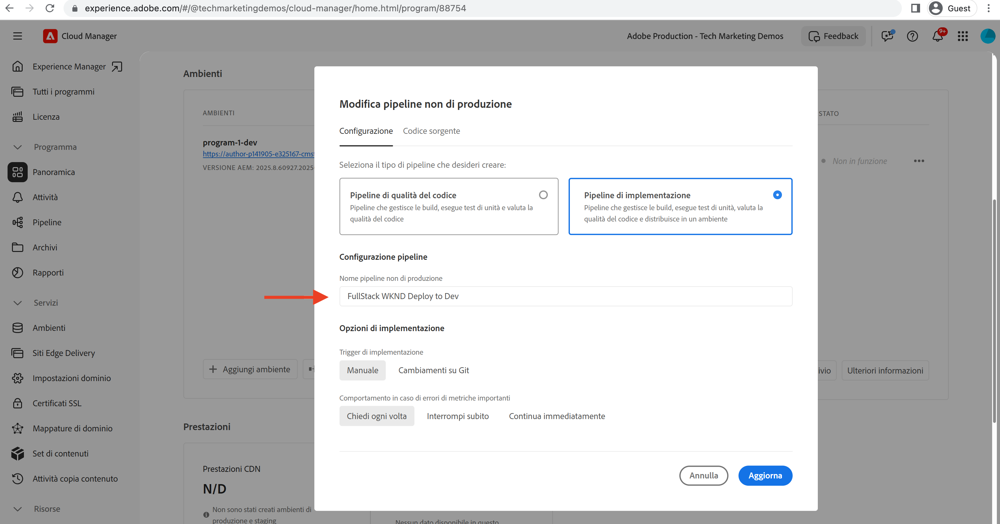
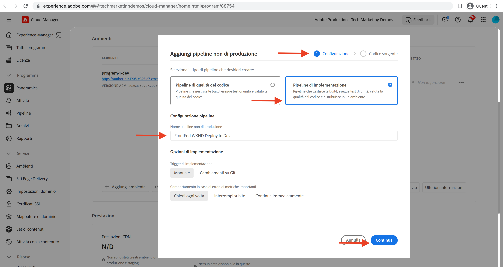
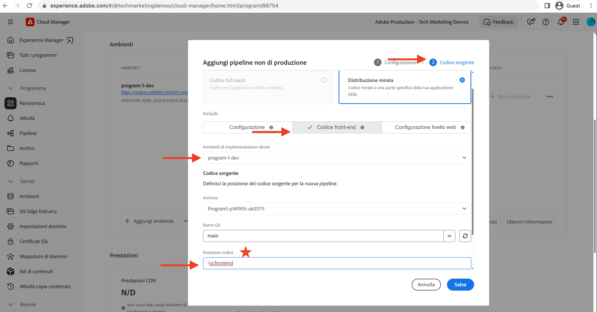

# Distribuire utilizzando la pipeline front-end

In questo capitolo viene creata ed eseguita una pipeline front-end in Adobe Cloud Manager. Crea solo i file da `ui.frontend` e li distribuisce nella rete CDN integrata in AEM as a Cloud Service. In questo modo ci si allontana dalla  `/etc.clientlibs` distribuzione di risorse front-end basata su.

## Obiettivi {#objectives}

* Crea ed esegui una pipeline front-end.
* Verificare che le risorse front-end NON vengano consegnate da `/etc.clientlibs` ma da un nuovo nome host che inizia con `https://static-`

## Utilizzo della pipeline front-end

>[!VIDEO](https://video.tv.adobe.com/v/3409420?quality=12&learn=on)

## Prerequisiti {#prerequisites}

Si tratta di un tutorial in più parti in cui si presume che i passaggi descritti in [Aggiorna progetto AEM standard](./update-project.md) sono state completate.

Assicurati di avere [privilegi per creare e distribuire pipeline in Cloud Manager](https://experienceleague.adobe.com/docs/experience-manager-cloud-manager/content/requirements/users-and-roles.html?lang=en#role-definitions) e [accesso a un ambiente as a Cloud Service AEM](https://experienceleague.adobe.com/docs/experience-manager-cloud-service/content/implementing/using-cloud-manager/manage-environments.html).

## Rinomina pipeline esistente

Rinomina la pipeline esistente da __Implementa in Dev__ a  __Distribuzione FullStack WKND in Dev__ passando al __Configurazione__ della scheda __Nome pipeline non di produzione__ campo. Questo per rendere esplicito se una pipeline è full stack o front-end semplicemente osservandone il nome.

Anche nel __Codice sorgente__ , accertati che i valori dei campi Repository e Ramo Git siano corretti e che il ramo presenti le modifiche al contratto della pipeline front-end.

## Creare una pipeline front-end

A __SOLO__ generare e distribuire le risorse front-end da `ui.frontend` eseguire i passaggi seguenti:

1. Nell’interfaccia utente di Cloud Manager, da __Pipeline__ , fare clic su __Aggiungi__ , quindi seleziona __Aggiungi pipeline non di produzione__ (o __Aggiungi pipeline di produzione__) in base all’ambiente as a Cloud Service AEM in cui desideri eseguire l’implementazione.

1. In __Aggiungi pipeline non di produzione__ , come parte del __Configurazione__ passaggi, seleziona la __Pipeline di implementazione__ opzione, denominala come __Distribuzione WKND FrontEnd in Dev__ e fai clic su __Continua__

1. Nell&#39;ambito del __Codice sorgente__ passaggi, seleziona la __Codice front-end__ e scegliere l&#39;ambiente da __Ambienti di implementazione idonei__. In __Codice sorgente__ sezione verificare che i valori dei campi Archivio e Ramo Git siano corretti e che il ramo presenti modifiche al contratto della pipeline front-end.
E __più importante__ per __Posizione codice__ campo il valore è `/ui.frontend` e infine, fai clic su __Salva__.

## Sequenza di distribuzione

* Esegui prima la nuova versione rinominata __Distribuzione FullStack WKND in Dev__ per rimuovere i file clientlib WKND dall’archivio AEM. E soprattutto preparare l’AEM per il contratto di pipeline front-end aggiungendo __Configurazione Sling__ file (`SiteConfig`, `HtmlPageItemsConfig`).

>[!WARNING]
>
>Dopo, il __Distribuzione FullStack WKND in Dev__ completamento della pipeline avrai un’ __non formattato__ Sito WKND, che potrebbe apparire danneggiato. Pianifica un’interruzione o esegui la distribuzione nelle ore dispari; si tratta di un’interruzione una tantum da pianificare durante il passaggio iniziale dall’utilizzo di una singola pipeline full stack alla pipeline front-end.

* Infine, esegui il __Distribuzione WKND FrontEnd in Dev__ pipeline da compilare `ui.frontend` e distribuire le risorse front-end direttamente nella rete CDN.

>[!IMPORTANT]
>
>Noterai che il __non formattato__ Il sito WKND è tornato alla normalità e questa volta __FrontEnd__ l’esecuzione della pipeline era molto più veloce della pipeline full stack.

## Verificare le modifiche di stile e il nuovo paradigma di consegna

* Apri il sito WKND qualsiasi pagina e potrai vedere il colore del testo. __Rosso Adobe__ e i file delle risorse front-end (CSS, JS) vengono consegnati dalla CDN. Il nome host della richiesta di risorsa inizia con `https://static-pXX-eYY.p123-e456.adobeaemcloud.com/$HASH_VALUE$/theme/site.css` e allo stesso modo il site.js o qualsiasi altra risorsa statica a cui si fa riferimento nel `HtmlPageItemsConfig` file.

>[!TIP]
>
>Il `$HASH_VALUE$` qui è uguale a quello che si vede nel __Distribuzione WKND FrontEnd in Dev__  della pipeline __HASH CONTENUTO__ campo. L’AEM riceve una notifica dell’URL CDN della risorsa front-end, il valore viene memorizzato in `/conf/wknd/sling:configs/com.adobe.cq.wcm.core.components.config.HtmlPageItemsConfig/jcr:content` in __prefixPath__ proprietà.

## Congratulazioni.  {#congratulations}

Congratulazioni, hai creato, eseguito e verificato la pipeline front-end che crea e distribuisce solo il modulo &#39;ui.frontend&#39; del progetto WKND Sites. Ora il team front-end può eseguire rapidamente l’iterazione sulla progettazione e sul comportamento front-end del sito, al di fuori dell’intero ciclo di vita del progetto AEM.

## Passaggi successivi {#next-steps}

Nel prossimo capitolo, [Considerazioni](considerations.md), rivedrai l’impatto sul processo di sviluppo front-end e back-end.
