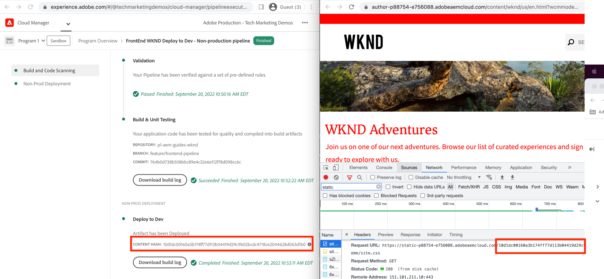

# Distribuire utilizzando la pipeline front-end

In questo capitolo viene creata ed eseguita una pipeline front-end in Adobe Cloud Manager. Crea i file solo dal modulo `ui.frontend` e li distribuisce nel CDN incorporato in AEM as a Cloud Service. In questo modo si esce dalla consegna delle risorse front-end basata su `/etc.clientlibs`.

## Obiettivi {#objectives}

* Crea ed esegui una pipeline front-end.
* Verificare che le risorse front-end NON vengano recapitate da `/etc.clientlibs` ma da un nuovo nome host che inizia con `https://static-`

## Utilizzo della pipeline front-end

>[!VIDEO](https://video.tv.adobe.com/v/3409420?quality=12&learn=on)

## Prerequisiti {#prerequisites}

Questo è un tutorial in più parti e si presume che i passaggi descritti in [Aggiorna progetto AEM standard](./update-project.md) siano stati completati.

Assicurati di disporre di [privilegi per la creazione e la distribuzione di pipeline in Cloud Manager](https://experienceleague.adobe.com/docs/experience-manager-cloud-manager/content/requirements/users-and-roles.html?lang=it#role-definitions) e di [accesso a un ambiente AEM as a Cloud Service](https://experienceleague.adobe.com/docs/experience-manager-cloud-service/content/implementing/using-cloud-manager/manage-environments.html?lang=it).

## Rinomina pipeline esistente

Rinomina la pipeline esistente da __Distribuisci in Dev__ a __Distribuzione WKND fullStack in Dev__ andando al campo __Nome pipeline non di produzione__ della scheda __Configurazione__. Questo per rendere esplicito se una pipeline è full stack o front-end semplicemente osservandone il nome.

Inoltre, nella scheda __Codice Source__, accertati che i valori dei campi Archivio e Ramo Git siano corretti e che il ramo presenti le modifiche al contratto della pipeline front-end.

## Creare una pipeline front-end

Per __ONLY__ generare e distribuire le risorse front-end dal modulo `ui.frontend`, effettuare le seguenti operazioni:

1. Nell&#39;interfaccia utente di Cloud Manager, dalla sezione __Pipeline__, fai clic sul pulsante __Aggiungi__, quindi seleziona __Aggiungi pipeline non di produzione__ (o __Aggiungi pipeline di produzione__) in base all&#39;ambiente AEM as a Cloud Service in cui desideri eseguire la distribuzione.

1. Nella finestra di dialogo __Aggiungi pipeline non di produzione__, come parte dei passaggi __Configurazione__, seleziona l&#39;opzione __Pipeline di distribuzione__, assegna a essa il nome __Distribuzione WKND FrontEnd a Dev__, quindi fai clic su __Continua__

1. Come parte dei passaggi per __Codice Source__, seleziona l&#39;opzione __Codice front-end__ e scegli l&#39;ambiente da __Ambienti di distribuzione idonei__. Nella sezione __Codice Source__ verifica che i valori dei campi Archivio e Ramo Git siano corretti e che il ramo presenti le modifiche al contratto della pipeline front-end.
E __soprattutto__ per il campo __Posizione codice__ il valore è `/ui.frontend`. Infine, fai clic su __Salva__.

## Sequenza di distribuzione

* Eseguire prima la pipeline __FullStack WKND Deploy in Dev__ rinominata per rimuovere i file clientlib WKND dall&#39;archivio AEM. E soprattutto preparare AEM per il contratto della pipeline front-end aggiungendo __file di configurazione Sling__ (`SiteConfig`, `HtmlPageItemsConfig`).

>[!WARNING]
>
>Dopo il completamento della pipeline __FullStack WKND Distribuisci su Dev__, si avrà un sito WKND __non formattato__, che potrebbe apparire danneggiato. Pianifica un’interruzione o esegui la distribuzione nelle ore dispari; si tratta di un’interruzione una tantum da pianificare durante il passaggio iniziale dall’utilizzo di una singola pipeline full stack alla pipeline front-end.

* Infine, esegui la pipeline __Distribuzione WKND FrontEnd su Dev__ per compilare solo il modulo `ui.frontend` e distribuire le risorse front-end direttamente nella rete CDN.

>[!IMPORTANT]
>
>Il sito WKND __unstyled__ è tornato alla normalità e questa volta l&#39;esecuzione della pipeline __FrontEnd__ è stata molto più veloce della pipeline full stack.

## Verificare le modifiche di stile e il nuovo paradigma di consegna

* Apri la pagina qualsiasi del sito WKND e potrai vedere il colore del testo __Adobe Red__ e i file delle risorse front-end (CSS, JS) vengono consegnati dalla rete CDN. Il nome host della richiesta di risorsa inizia con `https://static-pXX-eYY.p123-e456.adobeaemcloud.com/$HASH_VALUE$/theme/site.css` e allo stesso modo il sito.js o qualsiasi altra risorsa statica a cui si fa riferimento nel file `HtmlPageItemsConfig`.

>[!TIP]
>
>Il `$HASH_VALUE$` qui è lo stesso visualizzato nel campo __HASH CONTENUTO__ della pipeline __Distribuzione WKND FrontEnd per sviluppo__. AEM riceve una notifica dell&#39;URL CDN della risorsa front-end. Il valore viene archiviato in `/conf/wknd/sling:configs/com.adobe.cq.wcm.core.components.config.HtmlPageItemsConfig/jcr:content` nella proprietà __prefixPath__.

## Congratulazioni. {#congratulations}

Congratulazioni, hai creato, eseguito e verificato la pipeline front-end che crea e distribuisce solo il modulo &#39;ui.frontend&#39; del progetto WKND Sites. Ora il team front-end può eseguire rapidamente l’iterazione sulla progettazione e sul comportamento front-end del sito, al di fuori dell’intero ciclo di vita del progetto AEM.

## Passaggi successivi {#next-steps}

Nel prossimo capitolo, [Considerazioni](considerations.md), verrà esaminato l&#39;impatto sul processo di sviluppo front-end e back-end.
