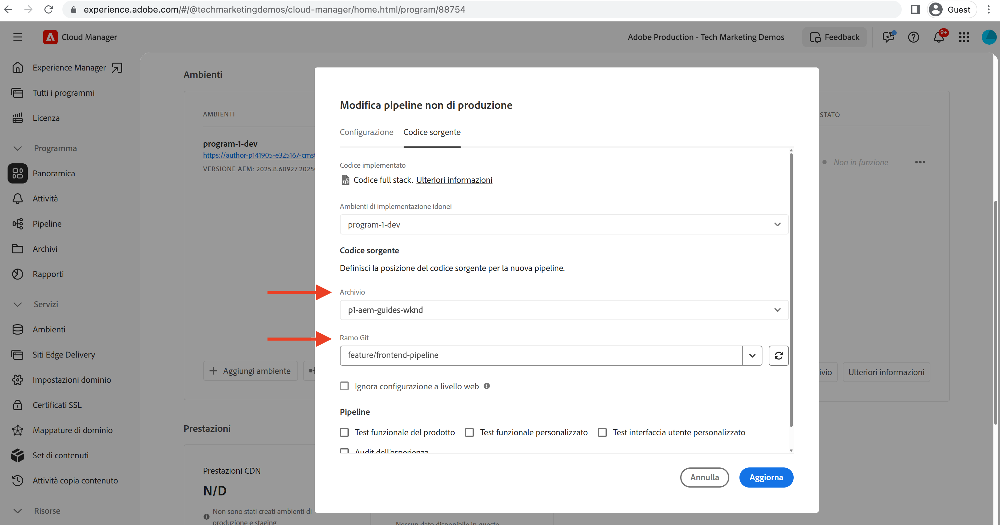

# Distribuzione tramite la pipeline front-end

In questo capitolo, creiamo ed eseguiamo una pipeline front-end in Adobe Cloud Manager. Crea solo i file da `ui.frontend` e li distribuisce nel CDN integrato in AEM as a Cloud Service. Così allontanandosi dalla  `/etc.clientlibs` consegna di risorse front-end basate su .

## Obiettivi {#objectives}

* Crea ed esegui una pipeline front-end.
* Verifica che le risorse front-end NON siano consegnate da `/etc.clientlibs` ma da un nuovo nome host che inizia con `https://static-`

## Utilizzo della pipeline front-end

>[!VIDEO](https://video.tv.adobe.com/v/3409420/)

## Prerequisiti {#prerequisites}

Si tratta di un tutorial in più parti e si presume che i passaggi descritti in [Aggiorna progetto AEM standard](./update-project.md) sono state completate.

Assicurati di avere [privilegi per creare e distribuire pipeline in Cloud Manager](https://experienceleague.adobe.com/docs/experience-manager-cloud-manager/content/requirements/users-and-roles.html?lang=en#role-definitions) e [accesso a un ambiente as a Cloud Service AEM](https://experienceleague.adobe.com/docs/experience-manager-cloud-service/content/implementing/using-cloud-manager/manage-environments.html).

## Rinomina pipeline esistente

Rinomina la pipeline esistente da __Distribuisci in Dev__ a  __Distribuzione WKND FullStack nello sviluppo__ andando al __Configurazione__ della scheda __Nome della pipeline non di produzione__ campo . In questo modo è possibile chiarire se una pipeline è piena o front-end semplicemente guardando il suo nome.

Anche nel __Codice sorgente__ , accertati che i valori dei campi Archivio e Ramo Git siano corretti e che il ramo abbia le modifiche del contratto della pipeline front-end.

## Creare una pipeline front-end

A __SOLO__ crea e distribuisci le risorse front-end da `ui.frontend` , esegui i seguenti passaggi:

1. Nell’interfaccia utente di Cloud Manager, dal __Tubi__ sezione, fai clic su __Aggiungi__ quindi seleziona __Aggiungi pipeline non di produzione__ o __Aggiungi pipeline di produzione__) in base all’ambiente as a Cloud Service AEM in cui desideri distribuire.

1. In __Aggiungi pipeline non di produzione__ , come parte del __Configurazione__ passaggi, seleziona __Pipeline di distribuzione__ opzione, denominala come __Distribuzione WKND di FrontEnd nello sviluppo__ e fai clic su __Continua__

1. Come parte del __Codice sorgente__ passaggi, seleziona __Codice front-end__ e seleziona l’ambiente da __Ambienti di distribuzione idonei__. In __Codice sorgente__ Assicurati che i valori dei campi Archivio e Ramo Git siano corretti e che il ramo abbia le modifiche del contratto della pipeline front-end.
E __cosa più importante__ per __Posizione codice__ campo il valore è `/ui.frontend` e infine, fai clic su __Salva__.

## Sequenza di distribuzione

* Esegui per la prima volta il nuovo nome rinominato __Distribuzione WKND FullStack nello sviluppo__ pipeline per rimuovere i file clientlib WKND dall’archivio AEM. E soprattutto preparare il AEM per il contratto di pipeline front-end aggiungendo __Configurazione Sling__ file (`SiteConfig`, `HtmlPageItemsConfig`).

>[!WARNING]
>
>Dopo, la __Distribuzione WKND FullStack nello sviluppo__ completamento della pipeline avrai una __senza stile__ Sito WKND, che potrebbe apparire danneggiato. Pianifica un’interruzione o distribuisci durante ore dispari, si tratta di un’interruzione una tantum da pianificare durante il passaggio iniziale dall’utilizzo di una singola pipeline a stack completo alla pipeline front-end.

* Infine, esegui __Distribuzione WKND di FrontEnd nello sviluppo__ pipeline da generare solo `ui.frontend` e implementa le risorse front-end direttamente nella rete CDN.

>[!IMPORTANT]
>
>Noterai che __senza stile__ Il sito WKND torna alla normalità e questa volta __FrontEnd__ l’esecuzione della pipeline era molto più veloce della pipeline a stack intero.

## Verificare le modifiche allo stile e il nuovo paradigma di consegna

* Apri la pagina del sito WKND e puoi vedere il colore del testo __Adobe rosso__ e i file delle risorse front-end (CSS, JS) vengono consegnati dalla rete CDN. Il nome host della richiesta di risorse inizia con `https://static-pXX-eYY.p123-e456.adobeaemcloud.com/$HASH_VALUE$/theme/site.css` e allo stesso modo site.js o qualsiasi altra risorsa statica a cui si fa riferimento nel `HtmlPageItemsConfig` file.

>[!TIP]
>
>La `$HASH_VALUE$` qui è lo stesso di quello che vedi nel __Distribuzione WKND di FrontEnd nello sviluppo__  oleodotto __HASH CONTENUTO__ campo . AEM viene notificato l’URL CDN della risorsa front-end, il valore viene memorizzato in `/conf/wknd/sling:configs/com.adobe.cq.wcm.core.components.config.HtmlPageItemsConfig/jcr:content` sotto __prefixPath__ proprietà.

## Congratulazioni! {#congratulations}

Congratulazioni, hai creato, eseguito e verificato la pipeline Front-End che crea e distribuisce solo il modulo &#39;ui.frontend&#39; del progetto WKND Sites. Ora il team front-end può eseguire rapidamente iterazioni sul design e sul comportamento front-end del sito, al di fuori del ciclo di vita completo del progetto AEM.

## Passaggi successivi {#next-steps}

Nel capitolo successivo, [Considerazioni](considerations.md), analizzerai l’impatto sul processo di sviluppo front-end e back-end.
