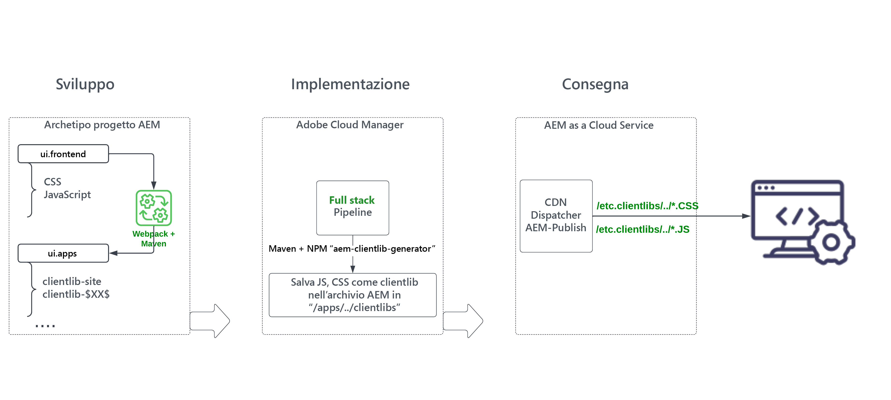

# Rivedi il modulo &#39;ui.frontend&#39; del progetto di AEM dello stack completo {#aem-full-stack-ui-frontent}

In questo capitolo esaminiamo lo sviluppo, la distribuzione e la distribuzione degli artefatti front-end di un progetto di AEM full-stack, concentrandoci sul modulo &#39;ui.frontend&#39; del __Progetto WKND Sites__.


## Obiettivi {#objective}

* Comprendere il flusso di creazione e distribuzione degli artefatti front-end in un progetto AEM full-stack
* Esamina il progetto AEM full-stack `ui.frontend` del modulo [webpack](https://webpack.js.org/) configurare
* AEM processo di generazione della libreria client (noto anche come clientlibs)

## Flusso di distribuzione front-end per progetti di creazione siti rapida e full-stack AEM

>[!IMPORTANT]
>
>Questo video illustra e illustra il flusso front-end per **Creazione completa e rapida di siti** progetti per delineare la sottile differenza nel modello di creazione, distribuzione e consegna delle risorse front-end.

>[!VIDEO](https://video.tv.adobe.com/v/3409344/)

## Prerequisiti {#prerequisites}


* Clona il [AEM progetto WKND Sites](https://github.com/adobe/aem-guides-wknd)
* È stato generato e implementato il progetto clonato AEM WKND Sites in AEM as a Cloud Service.

Vedi il progetto del sito WKND AEM [README.md](https://github.com/adobe/aem-guides-wknd/blob/main/README.md) per ulteriori dettagli.

## Flusso degli artefatti front-end AEM progetto full-stack {#flow-of-frontend-artifacts}

Di seguito è riportata una rappresentazione di alto livello del __sviluppo, distribuzione e distribuzione__ flusso degli artefatti front-end in un progetto AEM full-stack.




Durante la fase di sviluppo, le modifiche front-end come lo stile e il rebranding vengono eseguite aggiornando i file CSS e JS dal `ui.frontend/src/main/webpack` cartella. Quindi, durante il tempo di compilazione, il [webpack](https://webpack.js.org/) module-bundler e plugin maven trasformano questi file in clientlibs ottimizzati AEM sotto `ui.apps` modulo .

Le modifiche front-end vengono distribuite in AEM ambiente as a Cloud Service durante l&#39;esecuzione del [__Stack completo__ pipeline in Cloud Manager](https://experienceleague.adobe.com/docs/experience-manager-cloud-service/content/implementing/using-cloud-manager/cicd-pipelines/introduction-ci-cd-pipelines.html).

Le risorse front-end vengono distribuite ai browser web tramite percorsi URI che iniziano con `/etc.clientlibs/`, e sono in genere memorizzati nella cache su AEM Dispatcher e CDN.


>[!NOTE]
>
> Analogamente, nella __AEM Percorso di creazione di siti rapidi__, [modifiche front-end](https://experienceleague.adobe.com/docs/experience-manager-cloud-service/content/sites/administering/site-creation/quick-site/customize-theme.html) vengono distribuiti in AEM ambiente as a Cloud Service eseguendo il comando __Front-end__ pipeline, vedi [Imposta la pipeline](https://experienceleague.adobe.com/docs/experience-manager-cloud-service/content/sites/administering/site-creation/quick-site/pipeline-setup.html)

### Esamina le configurazioni del webpack nel progetto WKND Sites {#development-frontend-webpack-clientlib}

* Ce ne sono tre __webpack__ file di configurazione utilizzati per il bundle delle risorse front-end dei siti WKND.

   1. `webpack.common` - Contiene __comune__ configurazione per istruire il bundling e l’ottimizzazione delle risorse WKND. La __output__ La proprietà indica dove emettere i file consolidati (noti anche come bundle JavaScript, ma da non confondere con AEM bundle OSGi) che crea. Il nome predefinito è impostato su `clientlib-site/js/[name].bundle.js`.

   ```javascript
       ...
       output: {
               filename: 'clientlib-site/js/[name].bundle.js',
               path: path.resolve(__dirname, 'dist')
           }
       ...    
   ```

   1. `webpack.dev.js` contiene __sviluppo__ configurazione del webpack-dev-serve e punta al modello di HTML da utilizzare. Contiene anche una configurazione proxy a un’istanza di AEM in esecuzione su `localhost:4502`.

   ```javascript
       ...
       devServer: {
           proxy: [{
               context: ['/content', '/etc.clientlibs', '/libs'],
               target: 'http://localhost:4502',
           }],
       ...    
   ```

   1. `webpack.prod.js` contiene __produzione__ e utilizza i plug-in per trasformare i file di sviluppo in bundle ottimizzati.

   ```javascript
       ...
       module.exports = merge(common, {
           mode: 'production',
           optimization: {
               minimize: true,
               minimizer: [
                   new TerserPlugin(),
                   new CssMinimizerPlugin({ ...})
           }
       ...    
   ```


* Le risorse raggruppate vengono spostate nel `ui.apps` modulo che utilizza [aem-clientlib-generator](https://www.npmjs.com/package/aem-clientlib-generator) plug-in, utilizzando la configurazione gestita nel `clientlib.config.js` file.

```javascript
    ...
    const BUILD_DIR = path.join(__dirname, 'dist');
    const CLIENTLIB_DIR = path.join(
    __dirname,
    '..',
    'ui.apps',
    'src',
    'main',
    'content',
    'jcr_root',
    'apps',
    'wknd',
    'clientlibs'
    );
    ...
```

* La __frontend-maven-plugin__ da `ui.frontend/pom.xml` orchestra il bundling del webpack e la generazione di clientlib durante la generazione AEM progetto.

`$ mvn clean install -PautoInstallSinglePackage`

### Distribuzione a AEM as a Cloud Service {#deployment-frontend-aemaacs}

La [__Stack completo__ conduttura](https://experienceleague.adobe.com/docs/experience-manager-cloud-service/content/implementing/using-cloud-manager/cicd-pipelines/introduction-ci-cd-pipelines.html?#full-stack-pipeline) distribuisce queste modifiche in un ambiente as a Cloud Service AEM.


### Consegna da AEM as a Cloud Service {#delivery-frontend-aemaacs}

Le risorse front-end implementate tramite la pipeline a stack completo vengono distribuite dal sito AEM ai browser web come `/etc.clientlibs` file. Puoi verificarlo visitando la pagina [sito WKND ospitato pubblicamente](https://wknd.site/content/wknd/us/en.html) visualizzazione dell&#39;origine della pagina Web.

```html
    ....
    <link rel="stylesheet" href="/etc.clientlibs/wknd/clientlibs/clientlib-site.lc-181cd4102f7f49aa30eea548a7715c31-lc.min.css" type="text/css">

    ...

    <script async src="/etc.clientlibs/wknd/clientlibs/clientlib-site.lc-d4e7c03fe5c6a405a23b3ca1cc3dcd3d-lc.min.js"></script>
    ....
```

## Congratulazioni! {#congratulations}

Congratulazioni, hai rivisto il modulo ui.frontend del progetto con stack completo

## Passaggi successivi {#next-steps}

Nel capitolo successivo, [Aggiorna progetto per utilizzare la pipeline front-end](update-project.md), aggiornerai il progetto WKND Sites AEM per abilitarlo per il contratto di pipeline front-end.
