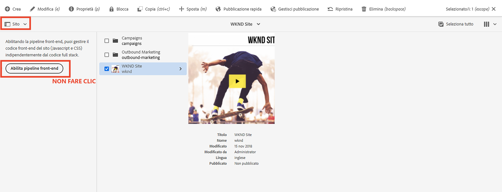

# Aggiorna il progetto AEM full-stack per utilizzare la pipeline front-end {#update-project-enable-frontend-pipeline}

In questo capitolo vengono apportate modifiche di configurazione al __progetto WKND Sites__ per utilizzare la pipeline front-end per distribuire JavaScript e CSS, anziché richiedere un’esecuzione completa della pipeline full-stack. Questo separa lo sviluppo e il ciclo di vita di implementazione degli artefatti front-end e back-end, consentendo un processo di sviluppo complessivo più rapido e iterativo.

## Obiettivi {#objectives}

* Aggiornare il progetto full-stack per utilizzare la pipeline front-end

## Panoramica delle modifiche alla configurazione nel progetto full-stack di AEM

>[!VIDEO](https://video.tv.adobe.com/v/3409419?quality=12&learn=on)

## Prerequisiti {#prerequisites}

Questo è un’esercitazione in più parti e si presume che tu abbia rivisto il [modulo “ui.frontend”](./review-uifrontend-module.md).


## Modifiche al progetto full-stack di AEM

Sono disponibili tre modifiche di configurazione relative al progetto e una modifica di stile da distribuire per l’esecuzione di un test, quindi in totale quattro modifiche specifiche nel progetto WKND, necessarie per abilitarlo al contratto della pipeline front-end.

1. Rimuovi il modulo `ui.frontend` dal ciclo di creazione full-stack

   * Nella radice del progetto WKND Sites `pom.xml` commenta la voce del sottomodulo `<module>ui.frontend</module>`.

   ```xml
       ...
       <modules>
       <module>all</module>
       <module>core</module>
       <!--
       <module>ui.frontend</module>
       -->                
       <module>ui.apps</module>
       ...
   ```

   * E commenta la dipendenza correlata da `ui.apps/pom.xml`

   ```xml
       ...
       <!-- ====================================================================== -->
       <!-- D E P E N D E N C I E S                                                -->
       <!-- ====================================================================== -->
           ...
       <!--
           <dependency>
               <groupId>com.adobe.aem.guides</groupId>
               <artifactId>aem-guides-wknd.ui.frontend</artifactId>
               <version>${project.version}</version>
               <type>zip</type>
           </dependency>
       -->    
       ...
   ```

1. Prepara il modulo `ui.frontend` per il contratto della pipeline front-end aggiungendo due nuovi file di configurazione webpack.

   * Copia `webpack.common.js` esistente come `webpack.theme.common.js` e modifica la proprietà `output` e i parametri di configurazione del plug-in `MiniCssExtractPlugin`, `CopyWebpackPlugin` come indicato di seguito:

   ```javascript
   ...
   output: {
           filename: 'theme/js/[name].js', 
           path: path.resolve(__dirname, 'dist')
       }
   ...
   
   ...
       new MiniCssExtractPlugin({
               filename: 'theme/[name].css'
           }),
       new CopyWebpackPlugin({
           patterns: [
               { from: path.resolve(__dirname, SOURCE_ROOT + '/resources'), to: './theme' }
           ]
       })
   ...
   ```

   * Copia `webpack.prod.js` esistente come `webpack.theme.prod.js` e modifica la posizione della variabile `common` nel file precedente come

   ```javascript
   ...
       const common = require('./webpack.theme.common.js');
   ...
   ```

   >[!NOTE]
   >
   >Le due modifiche alla configurazione “webpack” precedenti devono avere nomi di file di output e cartelle differenti, in modo da poter facilmente distinguere tra gli artefatti front-end della pipeline clientlib (full-stack) e quella generata dal tema (front-end).
   >
   >Come avrai intuito, le modifiche precedenti possono essere ignorate per utilizzare anche le configurazioni webpack esistenti, ma le modifiche indicate di seguito sono necessarie.
   >
   >Sta a te decidere come denominarle o organizzarle.


   * Nel file `package.json`, assicurati che il valore della proprietà `name` sia uguale al nome del sito del nodo `/conf`. E che sotto la proprietà `scripts`, uno script `build` indichi come generare i file front-end da questo modulo.

   ```javascript
       {
       "name": "wknd",
       "version": "1.0.0",
       ...
   
       "scripts": {
           "build": "webpack --config ./webpack.theme.prod.js"
       }
   
       ...
       }
   ```

1. Prepara il modulo `ui.content` per la pipeline front-end aggiungendo due configurazioni Sling.

   * Crea un file in `com.adobe.cq.wcm.core.components.config.HtmlPageItemsConfig`: questo include tutti i file front-end generati dal modulo `ui.frontend` nella cartella `dist` tramite il processo di generazione webpack.

   ```xml
   ...
       <css
       jcr:primaryType="nt:unstructured"
       element="link"
       location="header">
       <attributes
           jcr:primaryType="nt:unstructured">
           <as
               jcr:primaryType="nt:unstructured"
               name="as"
               value="style"/>
           <href
               jcr:primaryType="nt:unstructured"
               name="href"
               value="/theme/site.css"/>
   ...
   ```

   >[!TIP]
   >
   >    Consulta [HtmlPageItemsConfig](https://github.com/adobe/aem-guides-wknd/blob/feature/frontend-pipeline/ui.content/src/main/content/jcr_root/conf/wknd/_sling_configs/com.adobe.cq.wcm.core.components.config.HtmlPageItemsConfig/.content.xml) completo nel __progetto AEM WKND Sites__.


   * In secondo luogo, `com.adobe.aem.wcm.site.manager.config.SiteConfig` con il valore `themePackageName` uguale al valore della proprietà `package.json` e `name` e `siteTemplatePath` che punta a un valore del percorso stub `/libs/wcm/core/site-templates/aem-site-template-stub-2.0.0`.

   ```xml
   ...
       <?xml version="1.0" encoding="UTF-8"?>
       <jcr:root xmlns:sling="http://sling.apache.org/jcr/sling/1.0" xmlns:jcr="http://www.jcp.org/jcr/1.0" xmlns:nt="http://www.jcp.org/jcr/nt/1.0"
               jcr:primaryType="nt:unstructured"
               siteTemplatePath="/libs/wcm/core/site-templates/aem-site-template-stub-2.0.0"
               themePackageName="wknd">
       </jcr:root>
   ...
   ```

   >[!TIP]
   >
   >    Consulta [SiteConfig](https://github.com/adobe/aem-guides-wknd/blob/feature/frontend-pipeline/ui.content/src/main/content/jcr_root/conf/wknd/_sling_configs/com.adobe.aem.wcm.site.manager.config.SiteConfig/.content.xml) completo nel __progetto AEM WKND Sites__.

1. Modifica del tema o degli stili da distribuire tramite la pipeline front-end per l’esecuzione di un test. Stiamo cambiando `text-color` in rosso Adobe (oppure puoi scegliere un colore a tuo piacimento) aggiornando `ui.frontend/src/main/webpack/base/sass/_variables.scss`.

   ```css
       $black:     #a40606;
       ...
   ```

Infine, invia queste modifiche all’archivio git di Adobe del programma.


>[!AVAILABILITY]
>
> Queste modifiche sono disponibili su GitHub all’interno del ramo [__pipeline front-end__](https://github.com/adobe/aem-guides-wknd/tree/feature/frontend-pipeline) del __progetto AEM WKND Sites__.


## Attenzione: pulsante _Abilita pipeline front-end_

L’opzione [Sito](https://experienceleague.adobe.com/docs/experience-manager-cloud-service/content/sites/authoring/getting-started/basic-handling.html?lang=it) del [selettore della barra](https://experienceleague.adobe.com/docs/experience-manager-cloud-service/content/sites/authoring/getting-started/basic-handling.html?lang=it) mostra il pulsante **Abilita pipeline front-end** quando selezioni la directory principale del sito o la pagina del sito. Facendo clic sul pulsante **Abilita pipeline front-end**, verranno sostituite le **configurazioni Sling** precedenti. Assicurati di **non fare clic** su questo pulsante dopo aver distribuito le modifiche precedenti tramite l’esecuzione della pipeline di Cloud Manager.



Se fai clic su di esso per errore, devi eseguire nuovamente le pipeline per assicurarti che vengano ripristinati il contratto e le modifiche della pipeline front-end.

## Congratulazioni. {#congratulations}

Congratulazioni, hai aggiornato il progetto WKND Sites per abilitarlo per il contratto della pipeline front-end.

## Passaggi successivi {#next-steps}

Nel prossimo capitolo, [Distribuire utilizzando la pipeline front-end](create-frontend-pipeline.md), creerai ed eseguirai una pipeline front-end e verificherai come __ci siamo allontanati__ dalla distribuzione di risorse front-end basata su “/etc.clientlibs”.
