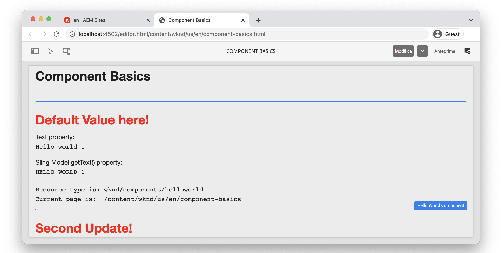

# Nozioni di base sui componenti {#component-basics}

In questo capitolo, esaminiamo la tecnologia di base di un componente Adobe Experience Manager (AEM) Sites tramite un semplice `HelloWorld` esempio. Sono state apportate piccole modifiche a un componente esistente, che include argomenti come authoring, HTL, modelli Sling, librerie lato client.

## Prerequisiti {#prerequisites}

Rivedere gli strumenti e le istruzioni necessari per la configurazione di un [ambiente di sviluppo locale](./overview.md#local-dev-environment).

L’IDE utilizzata nei video è [Codice di Visual Studio](https://code.visualstudio.com/) e [Sincronizzazione AEM VSCode](https://marketplace.visualstudio.com/items?itemName=yamato-ltd.vscode-aem-sync) plugin.

## Obiettivo {#objective}

1. Scopri il ruolo dei modelli HTL e dei modelli Sling per eseguire il rendering dinamico di HTML.
1. Scopri come le finestre di dialogo vengono utilizzate per facilitare l’authoring dei contenuti.
1. Scopri le nozioni di base delle librerie lato client per includere CSS e JavaScript per supportare un componente.

## Cosa verrà creato {#what-build}

In questo capitolo vengono apportate diverse modifiche a un semplice `HelloWorld` componente. Durante l&#39;aggiornamento della `HelloWorld` componente , vengono fornite informazioni sulle aree chiave di sviluppo AEM componente.

## Progetto iniziale capitolo {#starter-project}

Questo capitolo si basa su un progetto generico generato dal [Archetipo di progetto AEM](https://github.com/adobe/aem-project-archetype). Guarda il video seguente e rivedi il [prerequisiti](#prerequisites) per iniziare!

>[!NOTE]
>
> Se il capitolo precedente è stato completato correttamente, puoi riutilizzare il progetto e saltare i passaggi per il check-out del progetto iniziale.

>[!VIDEO](https://video.tv.adobe.com/v/330985?quality=12&learn=on)

Aprire un nuovo terminale a riga di comando ed eseguire le operazioni seguenti.

1. In una directory vuota, duplica il [aem-guides-wknd](https://github.com/adobe/aem-guides-wknd) archivio:

   ```shell
   $ git clone git@github.com:adobe/aem-guides-wknd.git --branch tutorial/component-basics-start --single-branch
   ```

   >[!NOTE]
   >
   > Facoltativamente, puoi continuare a utilizzare il progetto generato nel capitolo precedente, [Configurazione del progetto](./project-setup.md).

1. Passa a  `aem-guides-wknd` cartella.

   ```shell
   $ cd aem-guides-wknd
   ```

1. Crea e distribuisci il progetto in un’istanza locale di AEM con il seguente comando:

   ```shell
   $ mvn clean install -PautoInstallSinglePackage
   ```

   >[!NOTE]
   >
   > Se utilizzi AEM 6.5 o 6.4, aggiungi la variabile `classic` su qualsiasi comando Maven.

   ```shell
   $ mvn clean install -PautoInstallSinglePackage -Pclassic
   ```

1. Importa il progetto nell’IDE preferito seguendo le istruzioni per impostare un [ambiente di sviluppo locale](overview.md#local-dev-environment).

## Authoring di componenti {#component-authoring}

I componenti possono essere considerati come piccoli blocchi modulari di una pagina web. Per riutilizzare i componenti, questi devono essere configurabili. Questa operazione viene eseguita tramite la finestra di dialogo di authoring. Ora creiamo un componente semplice ed esaminiamo come i valori della finestra di dialogo vengono mantenuti in AEM.

>[!VIDEO](https://video.tv.adobe.com/v/330986?quality=12&learn=on)

Di seguito sono riportati i passaggi di alto livello eseguiti nel video precedente.

1. Creare una pagina denominata **Nozioni di base sui componenti** sotto **Sito WKND** `>` **US** `>` **en**.
1. Aggiungi il **Componente &quot;Hello World&quot;** alla pagina appena creata.
1. Apri la finestra di dialogo del componente e immetti del testo. Salva le modifiche per visualizzare il messaggio sulla pagina.
1. Passa alla modalità sviluppatore e visualizza il percorso del contenuto in CRXDE-Lite ed esamina le proprietà dell&#39;istanza del componente.
1. Utilizza CRXDE-Lite per visualizzare il `cq:dialog` e `helloworld.html` script da `/apps/wknd/components/content/helloworld`.

## HTL (HTML Template Language) e finestre di dialogo {#htl-dialogs}

HTML Template Language o **[HTL](https://experienceleague.adobe.com/docs/experience-manager-htl/content/getting-started.html)** è un linguaggio di template lato server leggero utilizzato dai componenti AEM per il rendering del contenuto.

**Finestre di dialogo** definiscono le configurazioni disponibili che possono essere rese per un componente.

Quindi aggiorniamo il `HelloWorld` Script HTL per visualizzare un saluto aggiuntivo prima del messaggio di testo.

>[!VIDEO](https://video.tv.adobe.com/v/330987?quality=12&learn=on)

Di seguito sono riportati i passaggi di alto livello eseguiti nel video precedente.

1. Passa all’IDE e apri il progetto nel `ui.apps` modulo .
1. Apri `helloworld.html` e aggiornare HTML Markup.
1. Utilizza gli strumenti IDE come [Sincronizzazione AEM VSCode](https://marketplace.visualstudio.com/items?itemName=yamato-ltd.vscode-aem-sync) per sincronizzare la modifica del file con l’istanza AEM locale.
1. Torna al browser e osserva che il rendering del componente è cambiato.
1. Apri `.content.xml` file che definisce la finestra di dialogo per `HelloWorld` in:

   ```plain
   <code>/aem-guides-wknd/ui.apps/src/main/content/jcr_root/apps/wknd/components/helloworld/_cq_dialog/.content.xml
   ```

1. Aggiorna la finestra di dialogo per aggiungere un campo di testo aggiuntivo denominato **Titolo** con il nome `./title`:

   ```xml
   <?xml version="1.0" encoding="UTF-8"?>
   <jcr:root xmlns:sling="http://sling.apache.org/jcr/sling/1.0" xmlns:cq="http://www.day.com/jcr/cq/1.0" xmlns:jcr="http://www.jcp.org/jcr/1.0" xmlns:nt="http://www.jcp.org/jcr/nt/1.0"
       jcr:primaryType="nt:unstructured"
       jcr:title="Properties"
       sling:resourceType="cq/gui/components/authoring/dialog">
       <content
           jcr:primaryType="nt:unstructured"
           sling:resourceType="granite/ui/components/coral/foundation/fixedcolumns">
           <items jcr:primaryType="nt:unstructured">
               <column
                   jcr:primaryType="nt:unstructured"
                   sling:resourceType="granite/ui/components/coral/foundation/container">
                   <items jcr:primaryType="nt:unstructured">
                       <title
                           jcr:primaryType="nt:unstructured"
                           sling:resourceType="granite/ui/components/coral/foundation/form/textfield"
                           fieldLabel="Title"
                           name="./title"/>
                       <text
                           jcr:primaryType="nt:unstructured"
                           sling:resourceType="granite/ui/components/coral/foundation/form/textfield"
                           fieldLabel="Text"
                           name="./text"/>
                   </items>
               </column>
           </items>
       </content>
   </jcr:root>
   ```

1. Riaprire il file `helloworld.html`, che rappresenta il principale script HTL responsabile del rendering del `HelloWorld` componente dal percorso sottostante:

   ```plain
       <code>/aem-guides-wknd.ui.apps/src/main/content/jcr_root/apps/wknd/components/helloworld/helloworld.html
   ```

1. Aggiorna `helloworld.html` per eseguire il rendering del valore **Saluto** campo di testo come parte di un `H1` tag:

   ```html
   <div class="cmp-helloworld" data-cmp-is="helloworld">
       <h1 class="cmp-helloworld__title">${properties.title}</h1>
       ...
   </div>
   ```

1. Distribuisci le modifiche in un’istanza locale di AEM utilizzando il plug-in per sviluppatori o le tue competenze Maven.

## Modelli Sling {#sling-models}

I modelli Sling sono &quot;POJO&quot; Java™ basati su annotazioni (Plain Old Java™ Objects) che facilitano la mappatura dei dati dalle variabili JCR alle variabili Java™. Forniscono anche diverse altre cose quando si sviluppano nel contesto di AEM.

Ora, effettuiamo alcuni aggiornamenti al `HelloWorldModel` Modello Sling per applicare una qualche logica di business ai valori memorizzati nel JCR prima di inviarli alla pagina.

>[!VIDEO](https://video.tv.adobe.com/v/330988?quality=12&learn=on)

1. Apri il file . `HelloWorldModel.java`, che è il modello Sling utilizzato con il `HelloWorld` componente.

   ```plain
   <code>/aem-guides-wknd.core/src/main/java/com/adobe/aem/guides/wknd/core/models/HelloWorldModel.java
   ```

1. Aggiungi le seguenti istruzioni di importazione:

   ```java
   import org.apache.commons.lang3.StringUtils;
   import org.apache.sling.models.annotations.DefaultInjectionStrategy;
   ```

1. Aggiorna `@Model` per utilizzare un&#39;annotazione `DefaultInjectionStrategy`:

   ```java
   @Model(adaptables = Resource.class,
      defaultInjectionStrategy = DefaultInjectionStrategy.OPTIONAL)
      public class HelloWorldModel {
      ...
   ```

1. Aggiungi le seguenti righe al `HelloWorldModel` per mappare i valori delle proprietà JCR del componente `title` e `text` alle variabili Java™:

   ```java
   ...
   @Model(adaptables = Resource.class,
   defaultInjectionStrategy = DefaultInjectionStrategy.OPTIONAL)
   public class HelloWorldModel {
   
       ...
   
       @ValueMapValue
       private String title;
   
       @ValueMapValue
       private String text;
   
       @PostConstruct
       protected void init() {
           ...
   ```

1. Aggiungi il seguente metodo `getTitle()` al `HelloWorldModel` che restituisce il valore della proprietà denominata `title`. Questo metodo aggiunge la logica aggiuntiva per restituire un valore String di &quot;Valore predefinito qui!&quot; se la proprietà `title` è nullo o vuoto:

   ```java
   /***
   *
   * @return the value of title, if null or blank returns "Default Value here!"
   */
   public String getTitle() {
       return StringUtils.isNotBlank(title) ? title : "Default Value here!";
   }
   ```

1. Aggiungi il seguente metodo `getText()` al `HelloWorldModel` che restituisce il valore della proprietà denominata `text`. Questo metodo trasforma la stringa in tutti i caratteri maiuscoli.

   ```java
       /***
       *
       * @return All caps variation of the text value
       */
   public String getText() {
       return StringUtils.isNotBlank(this.text) ? this.text.toUpperCase() : null;
   }
   ```

1. Crea e distribuisci il bundle dal `core` modulo:

   ```shell
   $ cd core
   $ mvn clean install -PautoInstallBundle
   ```

   >[!NOTE]
   >
   > Per uso AEM 6.4/6.5 `mvn clean install -PautoInstallBundle -Pclassic`

1. Aggiornare il file `helloworld.html` a `aem-guides-wknd.ui.apps/src/main/content/jcr_root/apps/wknd/components/content/helloworld/helloworld.html` per utilizzare i nuovi metodi di `HelloWorld` modello:

   ```html
   <div class="cmp-helloworld" data-cmp-is="helloworld"
   data-sly-use.model="com.adobe.aem.guides.wknd.core.models.HelloWorldModel">
       <h1 class="cmp-helloworld__title">${model.title}</h1>
       <div class="cmp-helloworld__item" data-sly-test="${properties.text}">
           <p class="cmp-helloworld__item-label">Text property:</p>
           <pre class="cmp-helloworld__item-output" data-cmp-hook-helloworld="property">${properties.text}</pre>
       </div>
       <div class="cmp-helloworld__item" data-sly-test="${model.text}">
           <p class="cmp-helloworld__item-label">Sling Model getText() property:</p>
           <pre class="cmp-helloworld__item-output" data-cmp-hook-helloworld="property">${model.text}</pre>
       </div>
       <div class="cmp-helloworld__item"  data-sly-test="${model.message}">
           <p class="cmp-helloworld__item-label">Model message:</p>
           <pre class="cmp-helloworld__item-output"data-cmp-hook-helloworld="model">${model.message}</pre>
       </div>
   </div>
   ```

1. Distribuisci le modifiche in un&#39;istanza locale di AEM utilizzando il plugin Eclipse Developer o utilizzando le tue competenze Maven.

## Librerie lato client {#client-side-libraries}

Librerie lato client, `clientlibs` in breve, fornisce un meccanismo per organizzare e gestire i file CSS e JavaScript necessari per un’implementazione AEM Sites. Le librerie lato client sono il metodo standard per includere CSS e JavaScript in una pagina in AEM.

La [ui.frontend](https://experienceleague.adobe.com/docs/experience-manager-core-components/using/developing/archetype/uifrontend.html) modulo disaccoppiato [webpack](https://webpack.js.org/) progetto integrato nel processo di creazione. Questo consente l’utilizzo di librerie front-end popolari come Sass, LESS e TypeScript. La `ui.frontend` il modulo viene esplorato più approfonditamente nella sezione [Capitolo Librerie lato client](/help/getting-started-wknd-tutorial-develop/project-archetype/client-side-libraries.md).

Quindi, aggiorna gli stili CSS per `HelloWorld` componente.

>[!VIDEO](https://video.tv.adobe.com/v/340750?quality=12&learn=on)

Di seguito sono riportati i passaggi di alto livello eseguiti nel video precedente.

1. Apri una finestra terminale e naviga nella `ui.frontend` directory

1. Essere `ui.frontend` eseguire la directory `npm install npm-run-all --save-dev` per installare il comando [npm-run-all](https://www.npmjs.com/package/npm-run-all) modulo nodo. Questo passaggio è **richiesto per il progetto AEM generato da Archetype 39**, nella prossima versione di Archetype questo non è necessario.

1. Quindi, esegui `npm run watch` comando:

   ```shell
   $ npm run watch
   ```

1. Passa all’IDE e apri il progetto nel `ui.frontend` modulo .
1. Apri il file . `ui.frontend/src/main/webpack/components/_helloworld.scss`.
1. Aggiorna il file per visualizzare un titolo rosso:

   ```scss
   .cmp-helloworld {}
   .cmp-helloworld__title {
       color: red;
   }
   ```

1. Nel terminale, dovresti vedere un’attività che indica che la `ui.frontend` il modulo sta compilando e sincronizzando le modifiche con l&#39;istanza locale di AEM.

   ```shell
   Entrypoint site 214 KiB = clientlib-site/site.css 8.45 KiB clientlib-site/site.js 206 KiB
   2022-02-22 17:28:51: webpack 5.69.1 compiled successfully in 119 ms
   change:dist/index.html
   + jcr_root/apps/wknd/clientlibs/clientlib-site/css/site.css
   + jcr_root/apps/wknd/clientlibs/clientlib-site/css
   + jcr_root/apps/wknd/clientlibs/clientlib-site/js/site.js
   + jcr_root/apps/wknd/clientlibs/clientlib-site/js
   + jcr_root/apps/wknd/clientlibs/clientlib-site
   + jcr_root/apps/wknd/clientlibs/clientlib-dependencies/css.txt
   + jcr_root/apps/wknd/clientlibs/clientlib-dependencies/js.txt
   + jcr_root/apps/wknd/clientlibs/clientlib-dependencies
   ```

1. Torna al browser e osserva che il colore del titolo è cambiato.

   

## Congratulazioni.  {#congratulations}

Congratulazioni, hai imparato le basi dello sviluppo di componenti in Adobe Experience Manager!

### Passaggi successivi {#next-steps}

Acquisisci familiarità con le pagine e i modelli di Adobe Experience Manager nel capitolo successivo [Pagine e modelli](pages-templates.md). Scopri in che modo i componenti core vengono associati al progetto e apprendi configurazioni di policy avanzate di modelli modificabili per creare un modello Pagina articoli ben strutturato.

Visualizza il codice finito su [GitHub](https://github.com/adobe/aem-guides-wknd) o rivedi e distribuisci il codice localmente nel ramo Git `tutorial/component-basics-solution`.
