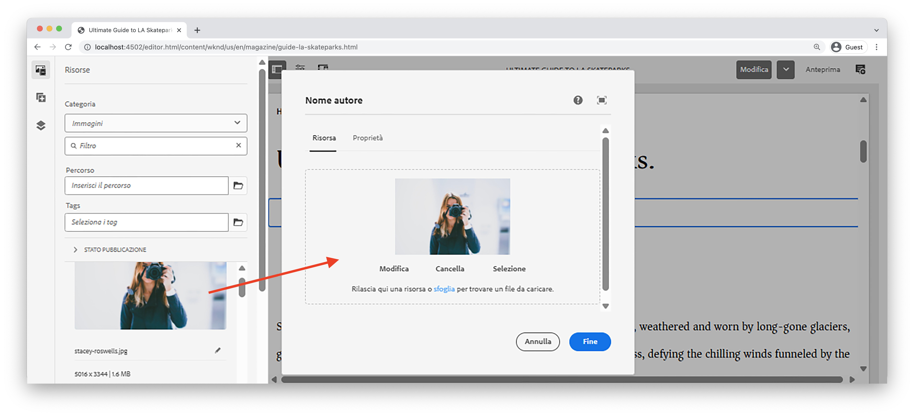

# Componente personalizzato {#custom-component}

Questa esercitazione descrive la creazione end-to-end di un componente `Byline` personalizzato di AEM che visualizza il contenuto creato in una finestra di dialogo ed esplora lo sviluppo di un modello Sling per incapsulare la logica di business che compila l’HTL del componente.

## Prerequisiti {#prerequisites}

Rivedi gli strumenti e le istruzioni necessari per configurare un [ambiente di sviluppo locale](overview.md#local-dev-environment).

### Progetto iniziale

>[!NOTE]
>
> Se hai completato correttamente il capitolo precedente, puoi riutilizzare il progetto e saltare i passaggi per controllare il progetto iniziale.

Controlla il codice della riga di base su cui si fonda l’esercitazione:

1. Controlla il ramo `tutorial/custom-component-start` da [GitHub](https://github.com/adobe/aem-guides-wknd)

   ```shell
   $ cd aem-guides-wknd
   $ git checkout tutorial/custom-component-start
   ```

1. Distribuisci la base di codice in un’istanza AEM locale utilizzando le abilità Maven:

   ```shell
   $ mvn clean install -PautoInstallSinglePackage
   ```

   >[!NOTE]
   >
   > Se utilizzi AEM 6.5 o 6.4, aggiungi il profilo `classic` a qualsiasi comando Maven.

   ```shell
   $ mvn clean install -PautoInstallSinglePackage -Pclassic
   ```

Puoi sempre visualizzare il codice finito su [GitHub](https://github.com/adobe/aem-guides-wknd/tree/tutorial/custom-component-solution) o estrarlo localmente passando al ramo `tutorial/custom-component-solution`.

## Obiettivo

1. Come creare un componente AEM personalizzato
1. Scopri come incapsulare la logica di business con i modelli Sling
1. Come utilizzare un modello Sling da uno script HTL

## Cosa stai per creare {#what-build}

In questa parte dell’esercitazione WKND, viene creato un componente nome autore che viene utilizzato per visualizzare le informazioni create sul collaboratore di un articolo.


*Componente nome autore*

L’implementazione del componente Byline include una finestra di dialogo che raccoglie il contenuto del nome e un modello Sling personalizzato che recupera i dettagli come:

* Nome
* Immagine
* Occupazioni

## Creare un componente Byline {#create-byline-component}

Per prima cosa, crea la struttura del nodo del componente Nome autore e definisci una finestra di dialogo. Questa rappresenta il componente in AEM e definisce implicitamente il tipo di risorsa del componente in base alla relativa posizione nel JCR.

La finestra di dialogo espone l’interfaccia che gli autori di contenuti possono fornire. Per questa implementazione, il componente **Immagine** del componente core WCM di AEM viene utilizzato per gestire l’authoring e il rendering dell’immagine Byline, pertanto deve essere impostato come `sling:resourceSuperType` di questo componente.

### Creare una definizione di componente {#create-component-definition}

1. Nel modulo **ui.apps**, passa a `/apps/wknd/components` e crea una cartella denominata `byline`.
1. Nella cartella `byline`, crea un file denominato `.content.xml`.

   

1. Popola il file `.content.xml` includendo quanto segue:

   ```xml
   <?xml version="1.0" encoding="UTF-8"?>
       <jcr:root xmlns:sling="http://sling.apache.org/jcr/sling/1.0" xmlns:cq="http://www.day.com/jcr/cq/1.0" xmlns:jcr="http://www.jcp.org/jcr/1.0"
       jcr:primaryType="cq:Component"
       jcr:title="Byline"
       jcr:description="Displays a contributor's byline."
       componentGroup="WKND Sites Project - Content"
       sling:resourceSuperType="core/wcm/components/image/v2/image"/>
   ```

   Il file XML riportato sopra fornisce la definizione del componente, inclusi il titolo, la descrizione e il gruppo. `sling:resourceSuperType` punta a `core/wcm/components/image/v2/image`, che è il [Componente immagine core](https://experienceleague.adobe.com/docs/experience-manager-core-components/using/wcm-components/image.html?lang=it).

### Creare lo script HTL {#create-the-htl-script}

1. All&#39;interno della cartella `byline`, aggiungi un file `byline.html`, responsabile della presentazione HTML del componente. È importante assegnare al file lo stesso nome della cartella, in quanto diventa lo script predefinito utilizzato da Sling per il rendering di questo tipo di risorsa.

1. Aggiungi al file il codice seguente `byline.html`.

   ```html
   <!--/* byline.html */-->
   <div data-sly-use.placeholderTemplate="core/wcm/components/commons/v1/templates.html">
   </div>
   <sly data-sly-call="${placeholderTemplate.placeholder @ isEmpty=true}"></sly>
   ```

`byline.html` è [rivisitato più tardi](#byline-htl), una volta creato il modello Sling. Lo stato corrente del file HTL consente al componente di visualizzare lo stato vuoto nell’Editor pagina di AEM Sites quando viene trascinato e rilasciato sulla pagina.

### Creare la definizione della finestra di dialogo {#create-the-dialog-definition}

A questo punto, definisci una finestra di dialogo per il componente Nome autore con i campi seguenti:

* **Nome**: un campo di testo che indica il nome del collaboratore.
* **Immagine**: un riferimento alla biografia del collaboratore.
* **Occupazioni**: l’elenco delle occupazioni attribuite al collaboratore. Le occupazioni devono essere ordinate alfabeticamente in ordine crescente (dalla a alla z).

1. Nella cartella `byline`, crea una cartella denominata `_cq_dialog`.
1. All&#39;interno di `byline/_cq_dialog`, aggiungi un file denominato `.content.xml`. È la definizione XML per la finestra di dialogo. Aggiungi il seguente XML:

   ```xml
   <?xml version="1.0" encoding="UTF-8"?>
   <jcr:root xmlns:sling="http://sling.apache.org/jcr/sling/1.0" xmlns:cq="http://www.day.com/jcr/cq/1.0" xmlns:jcr="http://www.jcp.org/jcr/1.0" xmlns:nt="http://www.jcp.org/jcr/nt/1.0"
           jcr:primaryType="nt:unstructured"
           jcr:title="Byline"
           sling:resourceType="cq/gui/components/authoring/dialog">
       <content
               jcr:primaryType="nt:unstructured"
               sling:resourceType="granite/ui/components/coral/foundation/container">
           <items jcr:primaryType="nt:unstructured">
               <tabs
                       jcr:primaryType="nt:unstructured"
                       sling:resourceType="granite/ui/components/coral/foundation/tabs"
                       maximized="{Boolean}false">
                   <items jcr:primaryType="nt:unstructured">
                       <asset
                               jcr:primaryType="nt:unstructured"
                               sling:hideResource="{Boolean}false"/>
                       <metadata
                               jcr:primaryType="nt:unstructured"
                               sling:hideResource="{Boolean}true"/>
                       <properties
                               jcr:primaryType="nt:unstructured"
                               jcr:title="Properties"
                               sling:resourceType="granite/ui/components/coral/foundation/container"
                               margin="{Boolean}true">
                           <items jcr:primaryType="nt:unstructured">
                               <columns
                                       jcr:primaryType="nt:unstructured"
                                       sling:resourceType="granite/ui/components/coral/foundation/fixedcolumns"
                                       margin="{Boolean}true">
                                   <items jcr:primaryType="nt:unstructured">
                                       <column
                                               jcr:primaryType="nt:unstructured"
                                               sling:resourceType="granite/ui/components/coral/foundation/container">
                                           <items jcr:primaryType="nt:unstructured">
                                               <name
                                                       jcr:primaryType="nt:unstructured"
                                                       sling:resourceType="granite/ui/components/coral/foundation/form/textfield"
                                                       emptyText="Enter the contributor's name to display."
                                                       fieldDescription="The contributor's name to display."
                                                       fieldLabel="Name"
                                                       name="./name"
                                                       required="{Boolean}true"/>
                                               <occupations
                                                       jcr:primaryType="nt:unstructured"
                                                       sling:resourceType="granite/ui/components/coral/foundation/form/multifield"
                                                       fieldDescription="A list of the contributor's occupations."
                                                       fieldLabel="Occupations"
                                                       required="{Boolean}false">
                                                   <field
                                                           jcr:primaryType="nt:unstructured"
                                                           sling:resourceType="granite/ui/components/coral/foundation/form/textfield"
                                                           emptyText="Enter an occupation"
                                                           name="./occupations"/>
                                               </occupations>
                                           </items>
                                       </column>
                                   </items>
                               </columns>
                           </items>
                       </properties>
                   </items>
               </tabs>
           </items>
       </content>
   </jcr:root>
   ```

   Queste definizioni dei nodi di dialogo utilizzano [Sling Resource Merger](https://sling.apache.org/documentation/bundles/resource-merger.html) per controllare quali schede di dialogo sono ereditate dal componente `sling:resourceSuperType`, in questo caso il componente immagine **Componenti core**.

   

### Creare la finestra di dialogi Criterio {#create-the-policy-dialog}

Seguendo lo stesso approccio utilizzato per la creazione della finestra di dialogo, crea una finestra di dialogo Criterio (precedentemente nota come finestra di dialogo Progettazione) per nascondere i campi indesiderati nella configurazione dei criteri ereditati dal componente Immagine dei Componenti core.

1. Nella cartella `byline`, crea una cartella denominata `_cq_design_dialog`.
1. Nella cartella `byline/_cq_design_dialog`, crea un file denominato `.content.xml`. Aggiorna il file con il seguente XML. È più semplice aprire `.content.xml` e copiare/incollare l&#39;XML sottostante.

   ```xml
   <?xml version="1.0" encoding="UTF-8"?>
   <jcr:root xmlns:sling="http://sling.apache.org/jcr/sling/1.0" xmlns:granite="http://www.adobe.com/jcr/granite/1.0" xmlns:cq="http://www.day.com/jcr/cq/1.0" xmlns:jcr="http://www.jcp.org/jcr/1.0" xmlns:nt="http://www.jcp.org/jcr/nt/1.0"
       jcr:primaryType="nt:unstructured"
       jcr:title="Byline"
       sling:resourceType="cq/gui/components/authoring/dialog">
       <content
               jcr:primaryType="nt:unstructured">
           <items jcr:primaryType="nt:unstructured">
               <tabs
                       jcr:primaryType="nt:unstructured">
                   <items jcr:primaryType="nt:unstructured">
                       <properties
                               jcr:primaryType="nt:unstructured">
                           <items jcr:primaryType="nt:unstructured">
                               <content
                                       jcr:primaryType="nt:unstructured">
                                   <items jcr:primaryType="nt:unstructured">
                                       <decorative
                                               jcr:primaryType="nt:unstructured"
                                               sling:hideResource="{Boolean}true"/>
                                       <altValueFromDAM
                                               jcr:primaryType="nt:unstructured"
                                               sling:hideResource="{Boolean}true"/>
                                       <titleValueFromDAM
                                               jcr:primaryType="nt:unstructured"
                                               sling:hideResource="{Boolean}true"/>
                                       <displayCaptionPopup
                                               jcr:primaryType="nt:unstructured"
                                               sling:hideResource="{Boolean}true"/>
                                       <disableUuidTracking
                                               jcr:primaryType="nt:unstructured"
                                               sling:hideResource="{Boolean}true"/>
                                   </items>
                               </content>
                           </items>
                       </properties>
                       <features
                               jcr:primaryType="nt:unstructured">
                           <items jcr:primaryType="nt:unstructured">
                               <content
                                       jcr:primaryType="nt:unstructured">
                                   <items jcr:primaryType="nt:unstructured">
                                       <accordion
                                               jcr:primaryType="nt:unstructured">
                                           <items jcr:primaryType="nt:unstructured">
                                               <orientation
                                                       jcr:primaryType="nt:unstructured"
                                                       sling:hideResource="{Boolean}true"/>
                                               <crop
                                                       jcr:primaryType="nt:unstructured"
                                                       sling:hideResource="{Boolean}true"/>
                                           </items>
                                       </accordion>
                                   </items>
                               </content>
                           </items>
                       </features>
                   </items>
               </tabs>
           </items>
       </content>
   </jcr:root>
   ```

   La base per la **finestra di dialogo Criterio** XML precedente è stata ottenuta dal [componente dell&#39;Immagine dei Componenti core](https://github.com/adobe/aem-core-wcm-components/blob/main/content/src/content/jcr_root/apps/core/wcm/components/image/v2/image/_cq_design_dialog/.content.xml).

   Come nella configurazione della finestra di dialogo, [Sling Resource Merger](https://sling.apache.org/documentation/bundles/resource-merger.html) viene utilizzato per nascondere campi irrilevanti che vengono altrimenti ereditati da `sling:resourceSuperType`, come mostrato dalle definizioni del nodo con la proprietà `sling:hideResource="{Boolean}true"`.

### Implementare il codice {#deploy-the-code}

1. Sincronizza le modifiche in `ui.apps` con l&#39;IDE o utilizzando le abilità Maven.

   

## Aggiungere il componente a una pagina {#add-the-component-to-a-page}

Per mantenere la semplicità e l&#39;attenzione sullo sviluppo dei componenti AEM, aggiungiamo il componente Nome autore nello stato corrente a una pagina dell&#39;articolo per verificare che la definizione del nodo `cq:Component` sia corretta. Inoltre, verificare che AEM riconosca la definizione del nuovo componente e che la relativa finestra di dialogo funzioni per l’authoring.

### Aggiungere un’immagine alle risorse AEM

Per prima cosa, carica un&#39;immagine iniziale di esempio nelle risorse di AEM da utilizzare per popolare l&#39;immagine nel componente Nome autore.

1. Passa alla cartella LA Skateparks in AEM Assets: [http://localhost:4502/assets.html/content/dam/wknd/it/magazine/la-skateparks](http://localhost:4502/assets.html/content/dam/wknd/it/magazine/la-skateparks).

1. Carica l’immagine **[stacey-roswells.jpg](assets/custom-component/stacey-roswells.jpg)** nella cartella.

   

### Creare il componente {#author-the-component}

Quindi, aggiungi il componente nome autore a una pagina in AEM. Poiché il componente nome autore viene aggiunto al gruppo di componenti **Progetto WKND Sites: contenuto** tramite la definizione `ui.apps/src/main/content/jcr_root/apps/wknd/components/byline/.content.xml`, è automaticamente disponibile per qualsiasi **contenitore** il cui **criterio** consente il gruppo di componenti **Progetto WKND Sites: contenuto**. È quindi disponibile nel contenitore di layout della pagina dell’articolo.

1. Passa all’articolo La Skatepark in: [http://localhost:4502/editor.html/content/wknd/it/it/magazine/guide-la-skateparks.html](http://localhost:4502/editor.html/content/wknd/it/it/magazine/guide-la-skateparks.html)

1. Dalla barra laterale a sinistra, trascina e rilascia un **componente nome autore** nella **parte inferiore** del contenitore di layout della pagina di articolo aperta.

   

1. Assicurati che la barra laterale a sinistra sia aperta **e visibile e che sia selezionato** Ricerca risorse**.

1. Seleziona il **segnaposto del componente nome autore**, che a sua volta visualizza la barra delle azioni e tocca l’icona a forma di **chiave inglese** per aprire la finestra di dialogo.

1. Con la finestra di dialogo aperta e la prima scheda (Risorsa) attiva, apri la barra laterale a sinistra e, da Ricerca risorse, trascina un’immagine nella zona di rilascio dell’immagine. Cerca “stacey” per trovare la foto biografica di Stacey Roswells fornita nel pacchetto di WKND ui.content

   

1. Dopo aver aggiunto un’immagine, fai clic sulla scheda **Proprietà** per immettere il **Nome** e la **Professione**.

   Quando inserisci la professione inserisci in ordine **alfabetico inverso** in modo da verificare che la logica di business alfabetizzata sia implementata nel modello Sling.

   Tocca il pulsante **Fine** in basso a destra per salvare le modifiche.

   

   Gli autori di AEM configurano e creano i componenti tramite le finestre di dialogo. A questo punto, nello sviluppo del componente nome autore sono incluse le finestre di dialogo per la raccolta dei dati, tuttavia non è stata ancora aggiunta la logica per il rendering del contenuto creato. Pertanto, viene visualizzato solo il segnaposto.

1. Dopo aver salvato la finestra di dialogo, passa a [CRXDE Lite](http://localhost:4502/crx/de/index.jsp#/content/wknd/it/it/magazine/guide-la-skateparks/jcr%3Acontent/root/container/container/byline) e rivedi come il contenuto del componente viene memorizzato nel nodo del contenuto del componente nome autore nella pagina AEM.

   Trova il nodo di contenuto del componente nome autore sotto la pagina LA Skate Parks, ovvero `/content/wknd/us/en/magazine/guide-la-skateparks/jcr:content/root/container/container/byline`.

   Nota che i nomi delle proprietà `name`, `occupations` e `fileReference` sono archiviati nel **nodo nome autore**.

   Inoltre, nota che `sling:resourceType` del nodo è impostato su `wknd/components/content/byline`, che è ciò che associa questo nodo del contenuto all’implementazione del componente nome autore.

   

## Creare un modello Sling per il componente nome autore {#create-sling-model}

Quindi, creiamo un modello Sling che funga da modello dati e racchiuda la logica di business per il componente nome autore.

I modelli Sling sono POJO di Java™ basati su annotazioni (Plain Old Java™ Objects) che semplificano la mappatura dei dati dalle variabili JCR a Java™ e forniscono efficienza durante lo sviluppo nel contesto AEM.

### Rivedere le dipendenze Maven {#maven-dependency}

Il modello Sling per il componente nome autore si basa su diverse API Java™ fornite da AEM. Queste API sono rese disponibili tramite le `dependencies` elencate nel file POM del modulo `core`. Il progetto utilizzato per questo tutorial è stato creato per AEM as a Cloud Service. Tuttavia, è univoco in quanto è compatibile con le versioni precedenti di AEM 6.5/6.4. Pertanto, sono incluse entrambe le dipendenze per Cloud Service e AEM 6.x.

1. Apri il file `pom.xml` sotto `<src>/aem-guides-wknd/core/pom.xml`.
1. Trovare la dipendenza per `aem-sdk-api`: **solo AEM as a Cloud Service**

   ```xml
   <dependency>
       <groupId>com.adobe.aem</groupId>
       <artifactId>aem-sdk-api</artifactId>
   </dependency>
   ```

   [aem-sdk-api](https://experienceleague.adobe.com/docs/experience-manager-cloud-service/content/implementing/developing/aem-as-a-cloud-service-sdk.html?lang=it) contiene tutte le API Java™ pubbliche esposte da AEM. `aem-sdk-api` viene utilizzato per impostazione predefinita durante la creazione di questo progetto. La versione viene mantenuta nel pom del reattore principale dalla radice del progetto in `aem-guides-wknd/pom.xml`.

1. Trovare la dipendenza per `uber-jar`: **solo AEM 6.5/6.4**

   ```xml
   ...
       <dependency>
           <groupId>com.adobe.aem</groupId>
           <artifactId>uber-jar</artifactId>
           <classifier>apis</classifier>
       </dependency>
   ...
   ```

   `uber-jar` è incluso solo quando viene richiamato il profilo `classic`, ovvero `mvn clean install -PautoInstallSinglePackage -Pclassic`. Anche in questo caso, questo è univoco per questo progetto. In un progetto reale, generato dall’archetipo del progetto AEM, `uber-jar` è l&#39;impostazione predefinita se la versione di AEM specificata è 6.5 o 6.4.

   [uber-jar](https://experienceleague.adobe.com/docs/experience-manager-65/developing/devtools/ht-projects-maven.html?lang=it#experience-manager-api-dependencies) contiene tutte le API Java™ pubbliche esposte da AEM 6.x. La versione viene mantenuta nel pom del reattore padre dalla radice del progetto `aem-guides-wknd/pom.xml`.

1. Trova la dipendenza per `core.wcm.components.core`:

   ```xml
    <!-- Core Component Dependency -->
       <dependency>
           <groupId>com.adobe.cq</groupId>
           <artifactId>core.wcm.components.core</artifactId>
       </dependency>
   ```

   Si tratta delle API Java™ pubbliche complete esposte dai componenti core di AEM. I componenti core di AEM sono un progetto gestito al di fuori di AEM e hanno quindi un ciclo di rilascio separato. Per questo motivo, è una dipendenza che deve essere inclusa separatamente e **non** è inclusa con `uber-jar` o `aem-sdk-api`.

   Come uber-jar, la versione di questa dipendenza viene mantenuta nel file pom del reattore principale da `aem-guides-wknd/pom.xml`

   Più avanti in questo tutorial, la classe Immagine del componente core verrà utilizzata per visualizzare l’immagine nel componente Byline. È necessario disporre della dipendenza del componente core per generare e compilare il modello Sling.

### Interfaccia Byline {#byline-interface}

Creare un’interfaccia Java™ pubblica per Byline. `Byline.java` definisce i metodi pubblici necessari per eseguire lo script HTL `byline.html`.

1. All’interno, il modulo `core` nella cartella `core/src/main/java/com/adobe/aem/guides/wknd/core/models` crea un file denominato `Byline.java`

   

1. Aggiorna `Byline.java` con i metodi seguenti:

   ```java
   package com.adobe.aem.guides.wknd.core.models;
   
   import java.util.List;
   
   /**
   * Represents the Byline AEM Component for the WKND Site project.
   **/
   public interface Byline {
       /***
       * @return a string to display as the name.
       */
       String getName();
   
       /***
       * Occupations are to be sorted alphabetically in a descending order.
       *
       * @return a list of occupations.
       */
       List<String> getOccupations();
   
       /***
       * @return a boolean if the component has enough content to display.
       */
       boolean isEmpty();
   }
   ```

   I primi due metodi espongono i valori per **nome** e **occupazioni** per il componente Byline.

   Il metodo `isEmpty()` viene utilizzato per determinare se il componente dispone di contenuto di cui eseguire il rendering o se è in attesa di essere configurato.

   Nota che non esiste un metodo per l’immagine; [questo verrà esaminato più avanti](#tackling-the-image-problem).

1. I pacchetti Java™ che contengono classi Java™ pubbliche, in questo caso un modello Sling, devono essere sottoposti a controllo delle versioni utilizzando il file `package-info.java` del pacchetto.

   Poiché il pacchetto Java™ `com.adobe.aem.guides.wknd.core.models` dell’origine WKND dichiara la versione di `1.0.0` e vengono aggiunti un’interfaccia pubblica e metodi non distruttivi, è necessario aggiornare la versione a `1.1.0`. Apri il file in `core/src/main/java/com/adobe/aem/guides/wknd/core/models/package-info.java` e aggiorna `@Version("1.0.0")` in `@Version("2.1.0")`.

   ```
   @Version("2.1.0")
   package com.adobe.aem.guides.wknd.core.models;
   
   import org.osgi.annotation.versioning.Version;
   ```

Ogni volta che si apportano modifiche ai file di questo pacchetto, è necessario regolare semanticamente la versione del pacchetto [](https://semver.org/). In caso contrario, [bnd-baseline-maven-plugin](https://github.com/bndtools/bnd) del progetto Maven rileva una versione del pacchetto non valida e interrompe la generazione. Fortunatamente, in caso di errore, il plug-in Maven segnala la versione del pacchetto Java™ non valida e la versione corretta. Aggiorna la dichiarazione `@Version("...")` in violazione del pacchetto Java™ `package-info.java` alla versione consigliata dal plug-in per la correzione.

### Implementazione Byline {#byline-implementation}

`BylineImpl.java` rappresenta l’implementazione del modello Sling che implementa l’&#39;interfaccia `Byline.java` definita in precedenza. Il codice completo per `BylineImpl.java` è disponibile alla fine di a questa sezione.

1. Crea una cartella denominata `impl` sotto a `core/src/main/java/com/adobe/aem/guides/core/models`.
1. Nella cartella `impl`, crea un file `BylineImpl.java`.

   

1. Apri `BylineImpl.java`. Specifica che implementa l’interfaccia `Byline`. Utilizza le funzionalità di completamento automatico dell’IDE o aggiorna manualmente il file per includere i metodi necessari per implementare l&#39;interfaccia `Byline`:

   ```java
   package com.adobe.aem.guides.wknd.core.models.impl;
   import java.util.List;
   import com.adobe.aem.guides.wknd.core.models.Byline;
   
   public class BylineImpl implements Byline {
   
       @Override
       public String getName() {
           // TODO Auto-generated method stub
           return null;
       }
   
       @Override
       public List<String> getOccupations() {
           // TODO Auto-generated method stub
           return null;
       }
   
       @Override
       public boolean isEmpty() {
           // TODO Auto-generated method stub
           return false;
       }
   }
   ```

1. Aggiungi le annotazioni del modello Sling aggiornando `BylineImpl.java` con le seguenti annotazioni a livello di classe. Questa annotazione `@Model(..)` è ciò che trasforma la classe in un modello Sling.

   ```java
   import org.apache.sling.api.SlingHttpServletRequest;
   import org.apache.sling.models.annotations.Model;
   import org.apache.sling.models.annotations.DefaultInjectionStrategy;
   ...
   @Model(
           adaptables = {SlingHttpServletRequest.class},
           adapters = {Byline.class},
           resourceType = {BylineImpl.RESOURCE_TYPE},
           defaultInjectionStrategy = DefaultInjectionStrategy.OPTIONAL
   )
   public class BylineImpl implements Byline {
       protected static final String RESOURCE_TYPE = "wknd/components/byline";
       ...
   }
   ```

   Ora esaminiamo questa annotazione e i relativi parametri:

   * L’annotazione `@Model` registra BylineImpl come modello Sling quando viene distribuita in AEM.
   * Il parametro `adaptables` specifica che questo modello può essere adattato dalla richiesta.
   * Il parametro `adapters` consente la registrazione della classe di implementazione nell’interfaccia Byline. Questo consente allo script HTL di chiamare il modello Sling tramite l’interfaccia (anziché direttamente l’implementazione). [Maggiori dettagli sugli adattatori sono disponibili qui](https://sling.apache.org/documentation/bundles/models.html#specifying-an-alternate-adapter-class-since-110).
   * `resourceType` punta al tipo di risorsa del componente Byline (creato in precedenza) e aiuta a risolvere il modello corretto in presenza di più implementazioni. [Ulteriori dettagli sull’associazione di una classe modello a un tipo di risorsa sono disponibili qui](https://sling.apache.org/documentation/bundles/models.html#associating-a-model-class-with-a-resource-type-since-130).

### Implementazione dei metodi del modello Sling {#implementing-the-sling-model-methods}

#### getName() {#implementing-get-name}

Il primo metodo implementato è `getName()`. Restituisce semplicemente il valore memorizzato nel nodo di contenuto JCR di Byline sotto la proprietà `name`.

Per questo motivo, l’annotazione del modello Sling `@ValueMapValue` viene utilizzata per inserire il valore in un campo Java™ utilizzando ValueMap della risorsa della richiesta.


```java
import org.apache.sling.models.annotations.injectorspecific.ValueMapValue;

public class BylineImpl implements Byline {
    ...
    @ValueMapValue
    private String name;

    ...
    @Override
    public String getName() {
        return name;
    }
    ...
}
```

Poiché la proprietà JCR condivide il nome come campo Java™ (entrambi sono &quot;name&quot;), `@ValueMapValue` risolve automaticamente questa associazione e inserisce il valore della proprietà nel campo Java™.

#### getOccupations() {#implementing-get-occupations}

Il metodo successivo da implementare è `getOccupations()`. Questo metodo carica le occupazioni memorizzate nella proprietà JCR `occupations` e restituisce una raccolta ordinata (alfabeticamente) di tali occupazioni.

Utilizzando la stessa tecnica illustrata in `getName()`, il valore della proprietà può essere inserito nel campo del modello Sling.

Una volta che i valori delle proprietà JCR sono disponibili nel modello Sling tramite il campo Java™ inserito `occupations`, è possibile applicare la logica di business di ordinamento nel metodo `getOccupations()`.


```java
import java.util.ArrayList;
import java.util.Collections;
  ...

public class BylineImpl implements Byline {
    ...
    @ValueMapValue
    private List<String> occupations;
    ...
    @Override
    public List<String> getOccupations() {
        if (occupations != null) {
            Collections.sort(occupations);
            return new ArrayList<String>(occupations);
        } else {
            return Collections.emptyList();
        }
    }
    ...
}
  ...
```


#### isEmpty() {#implementing-is-empty}

L’ultimo metodo pubblico è `isEmpty()` che determina quando il componente deve considerarsi &quot;creato sufficientemente&quot; per eseguire il rendering.

Per questo componente, il requisito aziendale è costituito da tutti e tre i campi, `name, image and occupations` deve essere compilato *prima* che sia possibile eseguire il rendering del componente.


```java
import org.apache.commons.lang3.StringUtils;
  ...
public class BylineImpl implements Byline {
    ...
    @Override
    public boolean isEmpty() {
        if (StringUtils.isBlank(name)) {
            // Name is missing, but required
            return true;
        } else if (occupations == null || occupations.isEmpty()) {
            // At least one occupation is required
            return true;
        } else if (/* image is not null, logic to be determined */) {
            // A valid image is required
            return true;
        } else {
            // Everything is populated, so this component is not considered empty
            return false;
        }
    }
    ...
}
```


#### Affrontare il &quot;problema dell&#39;immagine&quot; {#tackling-the-image-problem}

La verifica del nome e delle condizioni di occupazione è banale e Apache Commons Lang3 fornisce la classe [StringUtils](https://commons.apache.org/proper/commons-lang/apidocs/org/apache/commons/lang3/StringUtils.html?lang=it). Tuttavia, non è chiaro come la **presenza dell&#39;immagine** possa essere convalidata poiché il componente immagine del componente core viene utilizzato per far emergere l&#39;immagine.

Esistono due modi per evitare questo problema:

Verifica se la proprietà JCR `fileReference` viene risolta in una risorsa. *OPPURE* Converti questa risorsa in un modello Sling di immagine del componente core e assicurati che il metodo `getSrc()` non sia vuoto.

Usiamo il **secondo** approccio. Il primo approccio è probabilmente sufficiente, ma in questo tutorial viene utilizzato per consentire di esplorare altre funzioni dei modelli Sling.

1. Crea un metodo privato per ottenere l&#39;immagine. Questo metodo è lasciato privato perché non è necessario esporre l&#39;oggetto immagine nell&#39;HTL stesso ed è utilizzato solo per guidare `isEmpty().`

   Aggiungi il seguente metodo privato per `getImage()`:

   ```java
   import com.adobe.cq.wcm.core.components.models.Image;
   ...
   private Image getImage() {
       Image image = null;
       // Figure out how to populate the image variable!
       return image;
   }
   ```

   Come indicato in precedenza, esistono altri due approcci per ottenere il **Modello Sling immagine**:

   Il primo utilizza l&#39;annotazione `@Self`, per adattare automaticamente la richiesta corrente al `Image.class` del Componente core

   Il secondo utilizza il servizio OSGi di [Apache Sling ModelFactory](https://sling.apache.org/apidocs/sling10/org/apache/sling/models/factory/ModelFactory.html?lang=it), un servizio utile che aiuta a creare modelli Sling di altri tipi nel codice Java™.

   Usiamo il secondo approccio.

   >[!NOTE]
   >
   >In un&#39;implementazione reale, l&#39;approccio &quot;Uno&quot;, che utilizza `@Self`, è da preferirsi in quanto è la soluzione più semplice ed elegante. In questo tutorial viene utilizzato il secondo approccio, in quanto richiede di esplorare più facet di modelli Sling che sono utili in componenti più complessi!

   Poiché i modelli Sling sono POJO di Java™ e non OSGi Services, **non è possibile** utilizzare le consuete annotazioni di iniezione OSGi `@Reference`, ma i modelli Sling forniscono un&#39;annotazione speciale **[@OSGiService](https://sling.apache.org/documentation/bundles/models.html?lang=it#injector-specific-annotations)** che offre funzionalità simili.

1. Aggiorna `BylineImpl.java` per includere l&#39;annotazione `OSGiService` per inserire `ModelFactory`:

   ```java
   import org.apache.sling.models.factory.ModelFactory;
   import org.apache.sling.models.annotations.injectorspecific.OSGiService;
   ...
   public class BylineImpl implements Byline {
       ...
       @OSGiService
       private ModelFactory modelFactory;
   }
   ```

   Con `ModelFactory` disponibile, è possibile creare un modello Sling immagine del componente core utilizzando:

   ```java
   modelFactory.getModelFromWrappedRequest(SlingHttpServletRequest request, Resource resource, java.lang.Class<T> targetClass)
   ```

   Tuttavia, questo metodo richiede sia una richiesta che una risorsa, non ancora disponibili nel modello Sling. Per ottenere questi risultati, vengono utilizzate più annotazioni del modello Sling!

   Per ottenere la richiesta corrente è possibile utilizzare l&#39;annotazione **[@Self](https://sling.apache.org/documentation/bundles/models.html?lang=it#injector-specific-annotations)** per inserire `adaptable` (definito in `@Model(..)` come `SlingHttpServletRequest.class`, in un campo di classe Java™.

1. Aggiungi l&#39;annotazione **@Self** per ottenere la richiesta **SlingHttpServletRequest**:

   ```java
   import org.apache.sling.models.annotations.injectorspecific.Self;
   ...
   @Self
   private SlingHttpServletRequest request;
   ```

   Ricorda che l’utilizzo di `@Self Image image` per inserire il modello Sling dell’immagine del componente core era un’opzione di cui sopra: l’annotazione `@Self` tenta di inserire l’oggetto adattabile (in questo caso SlingHttpServletRequest) e di adattarsi al tipo di campo dell’annotazione. Poiché il modello Sling dell’immagine del componente core è adattabile dagli oggetti SlingHttpServletRequest, avrebbe funzionato e richiede meno codice rispetto all’approccio `modelFactory` più esplorativo.

   A questo punto vengono inserite le variabili necessarie per creare un’istanza del modello Immagine tramite l’API ModelFactory. Utilizziamo l&#39;annotazione **[@PostConstruct](https://sling.apache.org/documentation/bundles/models.html?lang=it#postconstruct-methods)** del modello Sling per ottenere questo oggetto dopo le istanze del modello Sling.

   `@PostConstruct` è incredibilmente utile e agisce in una capacità simile come costruttore, tuttavia, viene richiamato dopo la creazione dell&#39;istanza della classe e l&#39;inserimento di tutti i campi Java™ con annotazioni. Mentre altre annotazioni del modello Sling annotano campi di classe Java™ (variabili), `@PostConstruct` annota un metodo con parametro void, zero, in genere denominato `init()` (ma può essere denominato in altri modi).

1. Aggiungi il metodo **@PostConstruct**:

   ```java
   import javax.annotation.PostConstruct;
   ...
   public class BylineImpl implements Byline {
       ...
       private Image image;
   
       @PostConstruct
       private void init() {
           image = modelFactory.getModelFromWrappedRequest(request,
                                                           request.getResource(),
                                                           Image.class);
       }
       ...
   }
   ```

   Ricorda che i modelli Sling **NON** sono servizi OSGi, pertanto è sicuro mantenere lo stato della classe. Spesso `@PostConstruct` deriva e imposta lo stato della classe del modello Sling per un utilizzo successivo, in modo simile a quello di un costruttore semplice.

   Se il metodo `@PostConstruct` genera un&#39;eccezione, il modello Sling non viene creato come istanza ed è nullo.

1. È ora possibile aggiornare **getImage()** per restituire semplicemente l&#39;oggetto immagine.

   ```java
   /**
       * @return the Image Sling Model of this resource, or null if the resource cannot create a valid Image Sling Model.
   */
   private Image getImage() {
       return image;
   }
   ```

1. Torniamo a `isEmpty()` e terminiamo l&#39;implementazione:

   ```java
   @Override
   public boolean isEmpty() {
      final Image componentImage = getImage();
   
       if (StringUtils.isBlank(name)) {
           // Name is missing, but required
           return true;
       } else if (occupations == null || occupations.isEmpty()) {
           // At least one occupation is required
           return true;
       } else if (componentImage == null || StringUtils.isBlank(componentImage.getSrc())) {
           // A valid image is required
           return true;
       } else {
           // Everything is populated, so this component is not considered empty
           return false;
       }
   }
   ```

   Tieni presente che più chiamate a `getImage()` non sono problematiche in quanto restituisce la variabile di classe `image` inizializzata e non richiama `modelFactory.getModelFromWrappedRequest(...)`, il che non è eccessivamente costoso, ma vale la pena evitare di eseguire inutilmente le chiamate.

1. L&#39;aspetto finale di `BylineImpl.java` dovrebbe essere il seguente:


   ```java
   package com.adobe.aem.guides.wknd.core.models.impl;
   
   import java.util.ArrayList;
   import java.util.Collections;
   import java.util.List;
   import javax.annotation.PostConstruct;
   import org.apache.commons.lang3.StringUtils;
   import org.apache.sling.api.SlingHttpServletRequest;
   import org.apache.sling.models.annotations.DefaultInjectionStrategy;
   import org.apache.sling.models.annotations.Model;
   import org.apache.sling.models.annotations.injectorspecific.OSGiService;
   import org.apache.sling.models.annotations.injectorspecific.Self;
   import org.apache.sling.models.annotations.injectorspecific.ValueMapValue;
   import org.apache.sling.models.factory.ModelFactory;
   import com.adobe.aem.guides.wknd.core.models.Byline;
   import com.adobe.cq.wcm.core.components.models.Image;
   
   @Model(
           adaptables = {SlingHttpServletRequest.class},
           adapters = {Byline.class},
           resourceType = {BylineImpl.RESOURCE_TYPE},
           defaultInjectionStrategy = DefaultInjectionStrategy.OPTIONAL
   )
   public class BylineImpl implements Byline {
       protected static final String RESOURCE_TYPE = "wknd/components/byline";
   
       @Self
       private SlingHttpServletRequest request;
   
       @OSGiService
       private ModelFactory modelFactory;
   
       @ValueMapValue
       private String name;
   
       @ValueMapValue
       private List<String> occupations;
   
       private Image image;
   
       /**
       * @PostConstruct is immediately called after the class has been initialized
       * but BEFORE any of the other public methods. 
       * It is a good method to initialize variables that is used by methods in the rest of the model
       *
       */
       @PostConstruct
       private void init() {
           // set the image object
           image = modelFactory.getModelFromWrappedRequest(request, request.getResource(), Image.class);
       }
   
       @Override
       public String getName() {
           return name;
       }
   
       @Override
       public List<String> getOccupations() {
           if (occupations != null) {
               Collections.sort(occupations);
               return new ArrayList<String>(occupations);
           } else {
               return Collections.emptyList();
           }
       }
   
       @Override
       public boolean isEmpty() {
           final Image componentImage = getImage();
   
           if (StringUtils.isBlank(name)) {
               // Name is missing, but required
               return true;
           } else if (occupations == null || occupations.isEmpty()) {
               // At least one occupation is required
               return true;
           } else if (componentImage == null || StringUtils.isBlank(componentImage.getSrc())) {
               // A valid image is required
               return true;
           } else {
               // Everything is populated, so this component is not considered empty
               return false;
           }
       }
   
       /**
       * @return the Image Sling Model of this resource, or null if the resource cannot create a valid Image Sling Model.
       */
       private Image getImage() {
           return image;
       }
   }
   ```


## Nome autore HTL {#byline-htl}

Nel modulo `ui.apps`, apri `/apps/wknd/components/byline/byline.html` creato nella configurazione precedente del componente AEM.

```html
<div data-sly-use.placeholderTemplate="core/wcm/components/commons/v1/templates.html">
</div>
<sly data-sly-call="${placeholderTemplate.placeholder @ isEmpty=false}"></sly>
```

Esaminiamo come si comporta finora questo script HTL:

* `placeholderTemplate` punta al segnaposto dei Componenti core, che viene visualizzato quando il componente non è completamente configurato. Viene eseguito il rendering nell&#39;Editor pagina di AEM Sites come una casella con il titolo del componente, come definito in precedenza nella proprietà `jcr:title` di `cq:Component`.

* `data-sly-call="${placeholderTemplate.placeholder @ isEmpty=false}` carica `placeholderTemplate` definito in precedenza e passa un valore booleano (attualmente hardcoded in `false`) nel modello segnaposto. Quando `isEmpty` è true, il modello segnaposto esegue il rendering della casella grigia, altrimenti non esegue il rendering.

### Aggiornare il Nome autore HTL

1. Aggiorna **byline.html** con la seguente struttura scheletrica di HTML:

   ```html
   <div data-sly-use.placeholderTemplate="core/wcm/components/commons/v1/templates.html"
       class="cmp-byline">
           <div class="cmp-byline__image">
               <!--/* Include the Core Components Image Component */-->
           </div>
           <h2 class="cmp-byline__name"><!--/* Include the name */--></h2>
           <p class="cmp-byline__occupations"><!--/* Include the occupations */--></p>
   </div>
   <sly data-sly-call="${placeholderTemplate.placeholder @ isEmpty=true}"></sly>
   ```

   Le classi CSS seguono la convenzione di denominazione [BEM](https://getbem.com/naming/). Anche se l’utilizzo delle convenzioni BEM non è obbligatorio, BEM è consigliato in quanto viene utilizzato nelle classi CSS dei Componenti core e in genere si traduce in regole CSS chiare e leggibili.

### Creazione di oggetti del modello Sling in HTL {#instantiating-sling-model-objects-in-htl}

L&#39;istruzione [Usa blocco](https://github.com/adobe/htl-spec/blob/master/SPECIFICATION.md#221-use) viene utilizzata per creare istanze di oggetti modello Sling nello script HTL e assegnarle a una variabile HTL.

`data-sly-use.byline="com.adobe.aem.guides.wknd.models.Byline"` utilizza l&#39;interfaccia Nome autore (com.adobe.aem.guides.wknd.models.Byline) implementata da BylineImpl e adatta ad essa la SlingHttpServletRequest corrente. Il risultato viene memorizzato in un nome autore della variabile HTL ( `data-sly-use.<variable-name>`).

1. Aggiorna `div` esterno in modo che faccia riferimento al modello Sling del componente **nome autore** tramite la relativa interfaccia pubblica:

   ```xml
   <div data-sly-use.byline="com.adobe.aem.guides.wknd.core.models.Byline"
       data-sly-use.placeholderTemplate="core/wcm/components/commons/v1/templates.html"
       class="cmp-byline">
       ...
   </div>
   ```

### Accesso ai metodi del modello Sling {#accessing-sling-model-methods}

HTL prende in prestito da JSTL e utilizza lo stesso accorciamento dei nomi dei metodi getter Java™.

Ad esempio, il richiamo del metodo `getName()` del modello Sling del componente nome autore può essere ridotto a `byline.name`, analogamente invece di `byline.isEmpty`, può essere ridotto a `byline.empty`. Anche l&#39;utilizzo dei nomi di metodo completi, `byline.getName` o `byline.isEmpty`, funziona. Tieni presente che `()` non vengono mai utilizzati per richiamare metodi in HTL (simile a JSTL).

I metodi Java™ che richiedono un parametro **non possono** essere utilizzati in HTL. Questo perché è progettato per mantenere la logica in HTL semplice.

1. È possibile aggiungere il nome autore al componente richiamando il metodo `getName()` nel modello Sling del componente nome autore oppure in HTL: `${byline.name}`.

   Aggiorna il tag `h2`:

   ```xml
   <h2 class="cmp-byline__name">${byline.name}</h2>
   ```

### Utilizzo delle opzioni delle espressioni HTL {#using-htl-expression-options}

[Opzioni espressioni HTL](https://github.com/adobe/htl-spec/blob/master/SPECIFICATION.md#12-available-expression-options) fungono da modificatori del contenuto in HTL e vanno dalla formattazione della data alla traduzione i18n. Le espressioni possono essere utilizzate anche per unire elenchi o array di valori, necessari per visualizzare le occupazioni in un formato delimitato da virgole.

Le espressioni vengono aggiunte tramite l’operatore `@` nell’espressione HTL.

1. Per unire l’elenco delle occupazioni con &quot;, &quot;, viene utilizzato il seguente codice:

   ```html
   <p class="cmp-byline__occupations">${byline.occupations @ join=', '}</p>
   ```

### Visualizzazione condizionale del segnaposto {#conditionally-displaying-the-placeholder}

La maggior parte degli script HTL per i componenti AEM utilizza il **paradigma segnaposto** per fornire un segnale visivo agli autori **che indica che un componente è stato creato in modo errato e non viene visualizzato in AEM Publish**. La convenzione per guidare questa decisione consiste nell&#39;implementare un metodo sul modello Sling di supporto del componente, in questo caso: `Byline.isEmpty()`.

Il metodo `isEmpty()` viene richiamato nel modello Sling per il componente nome autore e il risultato (o piuttosto negativo, tramite l&#39;operatore `!`) viene salvato in una variabile HTL denominata `hasContent`:

1. Aggiorna `div` esterno per salvare una variabile HTL denominata `hasContent`:

   ```html
    <div data-sly-use.byline="com.adobe.aem.guides.wknd.core.models.Byline"
         data-sly-use.placeholderTemplate="core/wcm/components/commons/v1/templates.html"
         data-sly-test.hasContent="${!byline.empty}"
         class="cmp-byline">
         ...
   </div>
   ```

   Tieni presente che nell&#39;utilizzo di `data-sly-test`, il blocco HTL `test` è chiave, imposta una variabile HTL ed esegue il rendering/non esegue il rendering dell&#39;elemento HTML su cui si trova. Si basa sul risultato della valutazione dell’espressione HTL. Se &quot;true&quot;, viene eseguito il rendering dell’elemento HTML, altrimenti non viene eseguito il rendering.

   È ora possibile riutilizzare questa variabile HTL `hasContent` per mostrare/nascondere il segnaposto in modo condizionale.

1. Aggiorna la chiamata condizionale a `placeholderTemplate` nella parte inferiore del file con quanto segue:

   ```html
   <sly data-sly-call="${placeholderTemplate.placeholder @ isEmpty=!hasContent}"></sly>
   ```

### Visualizzare l’immagine utilizzando i componenti core {#using-the-core-components-image}

Lo script HTL per `byline.html` è quasi completato e manca solo l&#39;immagine.

Poiché `sling:resourceSuperType` punta al componente Immagine del componente core per creare l&#39;immagine, è possibile utilizzare il componente Immagine del componente core per eseguire il rendering dell&#39;immagine.

A questo scopo, includiamo la risorsa nome autore corrente, ma forziamo il tipo di risorsa del componente immagine del Componente core, utilizzando il tipo di risorsa `core/wcm/components/image/v2/image`. Si tratta di un modello potente per il riutilizzo di componenti. Per questo, viene utilizzato il blocco `data-sly-resource` di HTL.

1. Sostituisci `div` con una classe di `cmp-byline__image` con quanto segue:

   ```html
   <div class="cmp-byline__image"
       data-sly-resource="${ '.' @ resourceType = 'core/wcm/components/image/v2/image' }"></div>
   ```

   `data-sly-resource`, include la risorsa corrente tramite il percorso relativo `'.'` e forza l&#39;inclusione della risorsa corrente (o della risorsa di contenuto nome autore) con il tipo di risorsa `core/wcm/components/image/v2/image`.

   Il tipo di risorsa Componente core viene utilizzato direttamente e non tramite un proxy, perché si tratta di un utilizzo in-script e non viene mai mantenuto nel contenuto.

2. Completato `byline.html` di seguito:

   ```html
   <!--/* byline.html */-->
   <div data-sly-use.byline="com.adobe.aem.guides.wknd.core.models.Byline" 
       data-sly-use.placeholderTemplate="core/wcm/components/commons/v1/templates.html"
       data-sly-test.hasContent="${!byline.empty}"
       class="cmp-byline">
       <div class="cmp-byline__image"
           data-sly-resource="${ '.' @ resourceType = 'core/wcm/components/image/v2/image' }">
       </div>
       <h2 class="cmp-byline__name">${byline.name}</h2>
       <p class="cmp-byline__occupations">${byline.occupations @ join=', '}</p>
   </div>
   <sly data-sly-call="${placeholderTemplate.placeholder @ isEmpty=!hasContent}"></sly>
   ```

3. Implementa la base di codice nell’istanza locale di AEM. Poiché sono state apportate modifiche a `core` e `ui.apps`, è necessario distribuire entrambi i moduli.

   ```shell
   $ cd aem-guides-wknd/ui.apps
   $ mvn clean install -PautoInstallPackage
   ```

   ```shell
   $ cd ../core
   $ mvn clean install -PautoInstallBundle
   ```

   Per distribuire su AEM 6.5/6.4, richiamare il profilo `classic`:

   ```shell
   $ cd ../core
   $ mvn clean install -PautoInstallBundle -Pclassic
   ```

   >[!CAUTION]
   >
   > È inoltre possibile generare l&#39;intero progetto dalla directory principale utilizzando il profilo Maven `autoInstallSinglePackage`, ma questo potrebbe sovrascrivere le modifiche al contenuto nella pagina. Questo perché `ui.content/src/main/content/META-INF/vault/filter.xml` è stato modificato per consentire al codice di avvio del tutorial di sovrascrivere in modo chiaro il contenuto AEM esistente. In uno scenario reale, questo non è un problema.

### Revisione del componente nome autore non formattato {#reviewing-the-unstyled-byline-component}

1. Dopo aver distribuito l&#39;aggiornamento, passa alla pagina [Ultimate Guide to LA Skateparks](http://localhost:4502/editor.html/content/wknd/it/it/magazine/guide-la-skateparks.html) o a qualsiasi altro componente nome autore aggiunto in precedenza nel capitolo.

1. Le **immagini**, **nomi** e **occupazioni** sono ora visualizzate e non dispongono di uno stile, ma è presente un componente nome autore funzionante.

   

### Revisione della registrazione del modello Sling {#reviewing-the-sling-model-registration}

Nella [visualizzazione Stato modelli Sling della console Web di AEM](http://localhost:4502/system/console/status-slingmodels) sono visualizzati tutti i modelli Sling registrati in AEM. Esaminando questo elenco è possibile convalidare e riconoscere il modello Sling del componente nome autore come installato.

Se **BylineImpl** non è visualizzato in questo elenco, è probabile che si sia verificato un problema con le annotazioni del modello Sling o che il modello non sia stato aggiunto al pacchetto corretto (`com.adobe.aem.guides.wknd.core.models`) nel progetto principale.


*<http://localhost:4502/system/console/status-slingmodels>*

## Stili del componente nome autore {#byline-styles}

Per allineare il componente nome autore ala progettazione creativa fornita, applichiamo uno stile. Ciò si ottiene utilizzando il file SCSS e aggiornando il file nel modulo **ui.frontend**.

### Aggiungere uno stile predefinito

Aggiungi stili predefiniti per il componente nome autore.

1. Torna all’IDE e al progetto **ui.frontend** sotto `/src/main/webpack/components`:
1. Creare un file denominato `_byline.scss`.

   

1. Aggiungere le implementazioni CSS del componente nome autore (scritte come SCSS) in `_byline.scss`:

   ```scss
   .cmp-byline {
       $imageSize: 60px;
   
       .cmp-byline__image {
           float: left;
   
       /* This class targets a Core Component Image CSS class */
       .cmp-image__image {
           width: $imageSize;
           height: $imageSize;
           border-radius: $imageSize / 2;
           object-fit: cover;
           }
       }
   
       .cmp-byline__name {
           font-size: $font-size-medium;
           font-family: $font-family-serif;
           padding-top: 0.5rem;
           margin-left: $imageSize + 25px;
           margin-bottom: .25rem;
           margin-top:0rem;
       }
   
       .cmp-byline__occupations {
           margin-left: $imageSize + 25px;
           color: $gray;
           font-size: $font-size-xsmall;
           text-transform: uppercase;
       }
   }
   ```

1. Aprire un terminale e passare al modulo `ui.frontend`.
1. Avviare il processo `watch` con il seguente comando npm:

   ```shell
   $ cd ui.frontend/
   $ npm run watch
   ```

1. Torna al browser e passa all’articolo [LA SkateParks](http://localhost:4502/editor.html/content/wknd/it/it/magazine/guide-la-skateparks.html). Dovresti visualizzare gli stili del componente aggiornati.

   

   >[!TIP]
   >
   > Potrebbe essere necessario cancellare la cache del browser per garantire che non vengano forniti CSS non aggiornati e aggiornare la pagina con il componente nome autore per ottenere lo stile completo.

## Congratulazioni. {#congratulations}

Congratulazioni, hai creato un componente personalizzato partendo da zero utilizzando Adobe Experience Manager.

### Passaggi successivi {#next-steps}

Continua a scoprire lo sviluppo dei componenti AEM esplorando come scrivere test JUnit per il codice Java™ per il componente nome autore, così da garantire che tutto sia sviluppato correttamente e che la logica di business implementata sia corretta e completa.

* [Scrittura di test Unit o componenti AEM](unit-testing.md)

Visualizza il codice finito in [GitHub](https://github.com/adobe/aem-guides-wknd) oppure rivedi e distribuisci il codice localmente nel ramo Git `tutorial/custom-component-solution`.

1. Clona l’archivio [github.com/adobe/aem-guides-wknd](https://github.com/adobe/aem-guides-wknd).
1. Controlla il ramo `tutorial/custom-component-solution`
