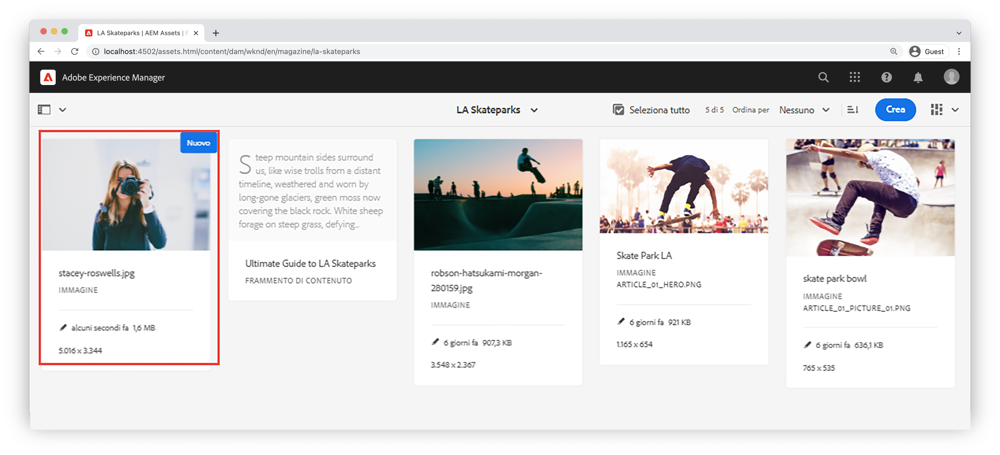

# Componente personalizzato {#custom-component}

Questo tutorial descrive la creazione end-to-end di un `Byline` Componente AEM che visualizza il contenuto creato in una finestra di dialogo ed esplora lo sviluppo di un modello Sling per incapsulare la logica di business che popola l’HTL del componente.

## Prerequisiti {#prerequisites}

Esaminare gli strumenti e le istruzioni necessari per l&#39;impostazione di un [ambiente di sviluppo locale](overview.md#local-dev-environment).

### Progetto iniziale

>[!NOTE]
>
> Se hai completato correttamente il capitolo precedente, puoi riutilizzare il progetto e saltare i passaggi per estrarre il progetto iniziale.

Consulta il codice della riga di base su cui si basa l’esercitazione:

1. Consulta la sezione `tutorial/custom-component-start` ramo da [GitHub](https://github.com/adobe/aem-guides-wknd)

   ```shell
   $ cd aem-guides-wknd
   $ git checkout tutorial/custom-component-start
   ```

1. Implementa la base di codice in un’istanza AEM locale utilizzando le tue competenze Maven:

   ```shell
   $ mvn clean install -PautoInstallSinglePackage
   ```

   >[!NOTE]
   >
   > Se si utilizza AEM 6.5 o 6.4, aggiungere `classic` profilo a qualsiasi comando Maven.

   ```shell
   $ mvn clean install -PautoInstallSinglePackage -Pclassic
   ```

Puoi sempre visualizzare il codice finito su [GitHub](https://github.com/adobe/aem-guides-wknd/tree/tutorial/custom-component-solution) oppure estrarre il codice localmente passando al ramo `tutorial/custom-component-solution`.

## Obiettivo

1. Come creare un componente AEM personalizzato
1. Scopri come incapsulare la logica di business con i modelli Sling
1. Come utilizzare un modello Sling da uno script HTL

## Cosa intendi creare {#what-build}

In questa parte dell’esercitazione WKND, viene creato un componente Byline che viene utilizzato per visualizzare informazioni scritte sul collaboratore di un articolo.


*Componente Byline*

L’implementazione del componente Byline include una finestra di dialogo che raccoglie il contenuto del nome e un modello Sling personalizzato che recupera i dettagli come:

* Nome
* Immagine
* Occupazioni

## Crea componente Byline {#create-byline-component}

Innanzitutto, crea la struttura del nodo del componente Byline e definisci una finestra di dialogo. Rappresenta il componente nell’AEM e definisce implicitamente il tipo di risorsa del componente in base alla sua posizione nel JCR.

La finestra di dialogo espone l’interfaccia che gli autori di contenuti possono fornire. Per questa implementazione, i componenti core WCM dell’AEM **Immagine** Il componente viene utilizzato per gestire l’authoring e il rendering dell’immagine del byte, pertanto deve essere impostato come `sling:resourceSuperType`.

### Creare una definizione di componente {#create-component-definition}

1. In **ui.apps** , passa a `/apps/wknd/components` e crea una cartella denominata `byline`.
1. All&#39;interno del `byline` cartella, aggiungi un file denominato `.content.xml`

   

1. Popolare il `.content.xml` file con quanto segue:

   ```xml
   <?xml version="1.0" encoding="UTF-8"?>
       <jcr:root xmlns:sling="http://sling.apache.org/jcr/sling/1.0" xmlns:cq="http://www.day.com/jcr/cq/1.0" xmlns:jcr="http://www.jcp.org/jcr/1.0"
       jcr:primaryType="cq:Component"
       jcr:title="Byline"
       jcr:description="Displays a contributor's byline."
       componentGroup="WKND Sites Project - Content"
       sling:resourceSuperType="core/wcm/components/image/v2/image"/>
   ```

   Il file XML riportato sopra fornisce la definizione del componente, inclusi il titolo, la descrizione e il gruppo. Il `sling:resourceSuperType` punta a `core/wcm/components/image/v2/image`, che è il [Componente immagine core](https://experienceleague.adobe.com/docs/experience-manager-core-components/using/wcm-components/image.html?lang=it).

### Creare lo script HTL {#create-the-htl-script}

1. All&#39;interno del `byline` cartella, aggiungi un file `byline.html`, responsabile della presentazione HTML del componente. È importante assegnare al file lo stesso nome della cartella, in quanto diventa lo script predefinito utilizzato da Sling per il rendering di questo tipo di risorsa.

1. Aggiungi il seguente codice al `byline.html`.

   ```html
   <!--/* byline.html */-->
   <div data-sly-use.placeholderTemplate="core/wcm/components/commons/v1/templates.html">
   </div>
   <sly data-sly-call="${placeholderTemplate.placeholder @ isEmpty=true}"></sly>
   ```

Il `byline.html` è [rivisto successivamente](#byline-htl), una volta creato il modello Sling. Lo stato corrente del file HTL consente al componente di visualizzare lo stato vuoto nell’Editor pagina di AEM Sites quando viene trascinato e rilasciato sulla pagina.

### Creare la definizione della finestra di dialogo {#create-the-dialog-definition}

Quindi, definisci una finestra di dialogo per il componente Byline con i campi seguenti:

* **Nome**: un campo di testo con il nome del collaboratore.
* **Immagine**: riferimento alla biografia del collaboratore.
* **Occupazioni**: elenco delle occupazioni attribuite al collaboratore. Le occupazioni devono essere ordinate alfabeticamente in ordine crescente (dalla a alla z).

1. All&#39;interno del `byline` cartella, crea una cartella denominata `_cq_dialog`.
1. All&#39;interno del `byline/_cq_dialog`, aggiungi un file denominato `.content.xml`. Definizione XML per la finestra di dialogo. Aggiungi il seguente XML:

   ```xml
   <?xml version="1.0" encoding="UTF-8"?>
   <jcr:root xmlns:sling="http://sling.apache.org/jcr/sling/1.0" xmlns:cq="http://www.day.com/jcr/cq/1.0" xmlns:jcr="http://www.jcp.org/jcr/1.0" xmlns:nt="http://www.jcp.org/jcr/nt/1.0"
           jcr:primaryType="nt:unstructured"
           jcr:title="Byline"
           sling:resourceType="cq/gui/components/authoring/dialog">
       <content
               jcr:primaryType="nt:unstructured"
               sling:resourceType="granite/ui/components/coral/foundation/container">
           <items jcr:primaryType="nt:unstructured">
               <tabs
                       jcr:primaryType="nt:unstructured"
                       sling:resourceType="granite/ui/components/coral/foundation/tabs"
                       maximized="{Boolean}false">
                   <items jcr:primaryType="nt:unstructured">
                       <asset
                               jcr:primaryType="nt:unstructured"
                               sling:hideResource="{Boolean}false"/>
                       <metadata
                               jcr:primaryType="nt:unstructured"
                               sling:hideResource="{Boolean}true"/>
                       <properties
                               jcr:primaryType="nt:unstructured"
                               jcr:title="Properties"
                               sling:resourceType="granite/ui/components/coral/foundation/container"
                               margin="{Boolean}true">
                           <items jcr:primaryType="nt:unstructured">
                               <columns
                                       jcr:primaryType="nt:unstructured"
                                       sling:resourceType="granite/ui/components/coral/foundation/fixedcolumns"
                                       margin="{Boolean}true">
                                   <items jcr:primaryType="nt:unstructured">
                                       <column
                                               jcr:primaryType="nt:unstructured"
                                               sling:resourceType="granite/ui/components/coral/foundation/container">
                                           <items jcr:primaryType="nt:unstructured">
                                               <name
                                                       jcr:primaryType="nt:unstructured"
                                                       sling:resourceType="granite/ui/components/coral/foundation/form/textfield"
                                                       emptyText="Enter the contributor's name to display."
                                                       fieldDescription="The contributor's name to display."
                                                       fieldLabel="Name"
                                                       name="./name"
                                                       required="{Boolean}true"/>
                                               <occupations
                                                       jcr:primaryType="nt:unstructured"
                                                       sling:resourceType="granite/ui/components/coral/foundation/form/multifield"
                                                       fieldDescription="A list of the contributor's occupations."
                                                       fieldLabel="Occupations"
                                                       required="{Boolean}false">
                                                   <field
                                                           jcr:primaryType="nt:unstructured"
                                                           sling:resourceType="granite/ui/components/coral/foundation/form/textfield"
                                                           emptyText="Enter an occupation"
                                                           name="./occupations"/>
                                               </occupations>
                                           </items>
                                       </column>
                                   </items>
                               </columns>
                           </items>
                       </properties>
                   </items>
               </tabs>
           </items>
       </content>
   </jcr:root>
   ```

   Queste definizioni dei nodi di dialogo utilizzano [Sling Resource Merger](https://sling.apache.org/documentation/bundles/resource-merger.html) per controllare quali schede di dialogo vengono ereditate da `sling:resourceSuperType` componente, in questo caso il **Componente immagine dei Componenti core**.

   

### Creare la finestra di dialogo dei criteri {#create-the-policy-dialog}

Seguendo lo stesso approccio utilizzato per la creazione della finestra di dialogo, crea una finestra di dialogo Criterio (precedentemente nota come finestra di dialogo per progettazione) per nascondere i campi indesiderati nella configurazione Criterio ereditati dal componente Immagine dei Componenti core.

1. All&#39;interno del `byline` cartella, crea una cartella denominata `_cq_design_dialog`.
1. All&#39;interno del `byline/_cq_design_dialog`, crea un file denominato `.content.xml`. Aggiorna il file con il seguente XML. È più semplice aprire `.content.xml` e copia/incolla l&#39;XML sottostante.

   ```xml
   <?xml version="1.0" encoding="UTF-8"?>
   <jcr:root xmlns:sling="http://sling.apache.org/jcr/sling/1.0" xmlns:granite="http://www.adobe.com/jcr/granite/1.0" xmlns:cq="http://www.day.com/jcr/cq/1.0" xmlns:jcr="http://www.jcp.org/jcr/1.0" xmlns:nt="http://www.jcp.org/jcr/nt/1.0"
       jcr:primaryType="nt:unstructured"
       jcr:title="Byline"
       sling:resourceType="cq/gui/components/authoring/dialog">
       <content
               jcr:primaryType="nt:unstructured">
           <items jcr:primaryType="nt:unstructured">
               <tabs
                       jcr:primaryType="nt:unstructured">
                   <items jcr:primaryType="nt:unstructured">
                       <properties
                               jcr:primaryType="nt:unstructured">
                           <items jcr:primaryType="nt:unstructured">
                               <content
                                       jcr:primaryType="nt:unstructured">
                                   <items jcr:primaryType="nt:unstructured">
                                       <decorative
                                               jcr:primaryType="nt:unstructured"
                                               sling:hideResource="{Boolean}true"/>
                                       <altValueFromDAM
                                               jcr:primaryType="nt:unstructured"
                                               sling:hideResource="{Boolean}true"/>
                                       <titleValueFromDAM
                                               jcr:primaryType="nt:unstructured"
                                               sling:hideResource="{Boolean}true"/>
                                       <displayCaptionPopup
                                               jcr:primaryType="nt:unstructured"
                                               sling:hideResource="{Boolean}true"/>
                                       <disableUuidTracking
                                               jcr:primaryType="nt:unstructured"
                                               sling:hideResource="{Boolean}true"/>
                                   </items>
                               </content>
                           </items>
                       </properties>
                       <features
                               jcr:primaryType="nt:unstructured">
                           <items jcr:primaryType="nt:unstructured">
                               <content
                                       jcr:primaryType="nt:unstructured">
                                   <items jcr:primaryType="nt:unstructured">
                                       <accordion
                                               jcr:primaryType="nt:unstructured">
                                           <items jcr:primaryType="nt:unstructured">
                                               <orientation
                                                       jcr:primaryType="nt:unstructured"
                                                       sling:hideResource="{Boolean}true"/>
                                               <crop
                                                       jcr:primaryType="nt:unstructured"
                                                       sling:hideResource="{Boolean}true"/>
                                           </items>
                                       </accordion>
                                   </items>
                               </content>
                           </items>
                       </features>
                   </items>
               </tabs>
           </items>
       </content>
   </jcr:root>
   ```

   La base del precedente **Finestra di dialogo dei criteri** XML ottenuto da [Componente immagine dei Componenti core](https://github.com/adobe/aem-core-wcm-components/blob/main/content/src/content/jcr_root/apps/core/wcm/components/image/v2/image/_cq_design_dialog/.content.xml).

   Come nella configurazione della finestra di dialogo, [Sling Resource Merger](https://sling.apache.org/documentation/bundles/resource-merger.html) viene utilizzato per nascondere campi irrilevanti che vengono altrimenti ereditati dal `sling:resourceSuperType`, come visto dalle definizioni dei nodi con `sling:hideResource="{Boolean}true"` proprietà.

### Distribuire il codice {#deploy-the-code}

1. Sincronizzare le modifiche in `ui.apps` con l’IDE o utilizzando le abilità Maven.

   

## Aggiungere il componente a una pagina {#add-the-component-to-a-page}

Per mantenere la struttura semplice e focalizzata sullo sviluppo dei componenti AEM, aggiungiamo il componente Byline nello stato corrente a una pagina di articolo per verificare `cq:Component` la definizione del nodo è corretta. Inoltre, per verificare che l’AEM riconosca la definizione del nuovo componente e che la finestra di dialogo del componente funzioni per l’authoring.

### Aggiungere un’immagine all’AEM Assets

Innanzitutto, carica un&#39;immagine iniziale di esempio in AEM Assets da utilizzare per popolare l&#39;immagine nel componente Byline.

1. Passa alla cartella Skateparks di LA in AEM Assets: [http://localhost:4502/assets.html/content/dam/wknd/en/magazine/la-skateparks](http://localhost:4502/assets.html/content/dam/wknd/en/magazine/la-skateparks).

1. Carica il colpo alla testa per  **[stacey-roswells.jpg](assets/custom-component/stacey-roswells.jpg)** nella cartella.

   

### Creare il componente {#author-the-component}

Quindi, aggiungi il componente Byline a una pagina in AEM. Perché il componente Byline viene aggiunto al **Progetto WKND Sites - Contenuto** Gruppo di componenti, tramite `ui.apps/src/main/content/jcr_root/apps/wknd/components/byline/.content.xml` è automaticamente disponibile per qualsiasi **Contenitore** il cui **Policy** consente **Progetto WKND Sites - Contenuto** gruppo di componenti. È quindi disponibile nel Contenitore di layout della pagina dell’articolo .

1. Accedi all’articolo LA Skatepark all’indirizzo: [http://localhost:4502/editor.html/content/wknd/us/en/magazine/guide-la-skateparks.html](http://localhost:4502/editor.html/content/wknd/us/en/magazine/guide-la-skateparks.html)

1. Dalla barra laterale sinistra, trascina e rilascia una **Componente Byline** su a **bottom** del Contenitore di layout della pagina di articolo aperta.

   

1. Assicurati che la barra laterale a sinistra sia aperta **e visibile, e** Asset Finder** è selezionato.

1. Seleziona la **Segnaposto componente Byline**, che a sua volta visualizza la barra delle azioni e tocca il **chiave inglese** per aprire la finestra di dialogo.

1. Con la finestra di dialogo aperta e la prima scheda (Risorsa) attiva, apri la barra laterale a sinistra e, dal Finder risorse, trascina un’immagine nella zona di rilascio Immagine. Cerca &quot;stacey&quot; per trovare la bio-immagine Stacey Roswells fornita nel pacchetto WKND ui.content.

   

1. Dopo aver aggiunto un’immagine, fai clic su **Proprietà** scheda per inserire il **Nome** e **Occupazioni**.

   Quando si inseriscono le professioni, immetterle in **inverso alfabetico** In questo modo viene verificata la logica di business alfabetizzata implementata nel modello Sling.

   Tocca il **Fine** per salvare le modifiche.

   

   Gli autori AEM configurano e creano i componenti tramite le finestre di dialogo. A questo punto, nello sviluppo del componente Byline sono incluse le finestre di dialogo per la raccolta dei dati, tuttavia non è stata ancora aggiunta la logica per il rendering del contenuto creato. Pertanto, viene visualizzato solo il segnaposto.

1. Dopo aver salvato la finestra di dialogo, passa a [CRXDE Liti](http://localhost:4502/crx/de/index.jsp#/content/wknd/us/en/magazine/guide-la-skateparks/jcr%3Acontent/root/container/container/byline) e controlla in che modo il contenuto del componente viene memorizzato sul nodo del contenuto del componente byline, nella pagina AEM.

   Trova il nodo di contenuto del componente Byline sotto la pagina Skate Parks di LA, ad esempio `/content/wknd/us/en/magazine/guide-la-skateparks/jcr:content/root/container/container/byline`.

   Osserva i nomi delle proprietà `name`, `occupations`, e `fileReference` sono archiviati in **nodo byline**.

   Inoltre, si noti che `sling:resourceType` del nodo è impostato su `wknd/components/content/byline` che è ciò che lega questo nodo di contenuto all’implementazione del componente Byline.

   

## Crea modello Sling Byline {#create-sling-model}

Quindi, creiamo un modello Sling che funga da modello dati e racchiuda la logica di business per il componente Byline.

I modelli Sling sono POJO Java™ basati su annotazioni (Plain Old Java™ Objects) che semplificano la mappatura dei dati dalle variabili JCR a Java™ e forniscono efficienza durante lo sviluppo nel contesto AEM.

### Esamina dipendenze Maven {#maven-dependency}

Il modello Sling Byline si basa su diverse API Java™ fornite dall’AEM. Queste API sono rese disponibili tramite `dependencies` elencati in `core` file POM del modulo. Il progetto utilizzato per questa esercitazione è stato creato per AEM as a Cloud Service. Tuttavia, è unico in quanto è compatibile con le versioni precedenti di AEM 6.5/6.4. Pertanto sono incluse entrambe le dipendenze per Cloud Service e AEM 6.x.

1. Apri `pom.xml` file sotto `<src>/aem-guides-wknd/core/pom.xml`.
1. Trova la dipendenza per `aem-sdk-api` - **Solo AEM as a Cloud Service**

   ```xml
   <dependency>
       <groupId>com.adobe.aem</groupId>
       <artifactId>aem-sdk-api</artifactId>
   </dependency>
   ```

   Il [aem-sdk-api](https://experienceleague.adobe.com/docs/experience-manager-cloud-service/content/implementing/developing/aem-as-a-cloud-service-sdk.html?lang=en) contiene tutte le API Java™ pubbliche esposte dall’AEM. Il `aem-sdk-api` viene utilizzato per impostazione predefinita durante la creazione di questo progetto. La versione viene mantenuta nel POM del reattore principale dalla radice del progetto in `aem-guides-wknd/pom.xml`.

1. Trovare la dipendenza per `uber-jar` - **Solo AEM 6.5/6.4**

   ```xml
   ...
       <dependency>
           <groupId>com.adobe.aem</groupId>
           <artifactId>uber-jar</artifactId>
           <classifier>apis</classifier>
       </dependency>
   ...
   ```

   Il `uber-jar` è incluso solo quando `classic` viene richiamato il profilo, ovvero `mvn clean install -PautoInstallSinglePackage -Pclassic`. Anche in questo caso, questo è specifico per questo progetto. In un progetto nel mondo reale, generato dall’archetipo del progetto AEM il `uber-jar` è il valore predefinito se la versione dell’AEM specificata è 6.5 o 6.4.

   Il [uber-jar](https://experienceleague.adobe.com/docs/experience-manager-65/developing/devtools/ht-projects-maven.html#experience-manager-api-dependencies) contiene tutte le API Java™ pubbliche esposte da AEM 6.x. La versione viene mantenuta nel POM del reattore principale dalla directory principale del progetto `aem-guides-wknd/pom.xml`.

1. Trova la dipendenza per `core.wcm.components.core`:

   ```xml
    <!-- Core Component Dependency -->
       <dependency>
           <groupId>com.adobe.cq</groupId>
           <artifactId>core.wcm.components.core</artifactId>
       </dependency>
   ```

   Si tratta delle API Java™ pubbliche complete esposte dai Componenti core AEM. I Componenti core AEM sono un progetto gestito al di fuori dell’AEM e hanno quindi un ciclo di rilascio separato. Per questo motivo, si tratta di una dipendenza che deve essere inclusa separatamente ed è **non** in dotazione con `uber-jar` o `aem-sdk-api`.

   Come uber-jar, la versione di questa dipendenza viene mantenuta nel file POM del reattore padre da `aem-guides-wknd/pom.xml`.

   Più avanti in questa esercitazione, la classe Immagine del componente core viene utilizzata per visualizzare l’immagine nel componente Byline. È necessario disporre della dipendenza dei Componenti core per generare e compilare il modello Sling.

### Interfaccia Byline {#byline-interface}

Creare un&#39;interfaccia Java™ pubblica per il nome del destinatario. Il `Byline.java` definisce i metodi pubblici necessari per gestire `byline.html` Script HTL.

1. All&#39;interno, il `core` modulo all&#39;interno di `core/src/main/java/com/adobe/aem/guides/wknd/core/models` cartella creare un file denominato `Byline.java`

   

1. Aggiorna `Byline.java` con i seguenti metodi:

   ```java
   package com.adobe.aem.guides.wknd.core.models;
   
   import java.util.List;
   
   /**
   * Represents the Byline AEM Component for the WKND Site project.
   **/
   public interface Byline {
       /***
       * @return a string to display as the name.
       */
       String getName();
   
       /***
       * Occupations are to be sorted alphabetically in a descending order.
       *
       * @return a list of occupations.
       */
       List<String> getOccupations();
   
       /***
       * @return a boolean if the component has enough content to display.
       */
       boolean isEmpty();
   }
   ```

   I primi due metodi espongono i valori per **nome** e **professioni** per il componente Byline.

   Il `isEmpty()` viene utilizzato per determinare se il componente ha contenuto da riprodurre o se è in attesa di essere configurato.

   Nota che non esiste un metodo per l&#39;immagine; [questo verrà rivisto in seguito](#tackling-the-image-problem).

1. I pacchetti Java™ che contengono classi Java™ pubbliche, in questo caso un modello Sling, devono avere una versione utilizzando  `package-info.java` file.

   Dal pacchetto Java™ dell’origine WKND `com.adobe.aem.guides.wknd.core.models` dichiara la versione di `1.0.0`, e vengono aggiunti un’interfaccia pubblica e dei metodi unificatori, la versione deve essere aumentata a `1.1.0`. Apri il file in `core/src/main/java/com/adobe/aem/guides/wknd/core/models/package-info.java` e aggiorna `@Version("1.0.0")` a `@Version("2.1.0")`.

   ```
   @Version("2.1.0")
   package com.adobe.aem.guides.wknd.core.models;
   
   import org.osgi.annotation.versioning.Version;
   ```

Ogni volta che viene apportata una modifica ai file di questo pacchetto, il [la versione del pacchetto deve essere regolata semanticamente](https://semver.org/). In caso contrario, il [bnd-baseline-maven-plugin](https://github.com/bndtools/bnd) rileva una versione del pacchetto non valida e interrompe la generazione. Fortunatamente, in caso di errore, il plug-in Maven segnala la versione del pacchetto Java™ non valida e la versione corretta. Aggiornare il `@Version("...")` dichiarazione nel pacchetto Java™ che viola `package-info.java` alla versione consigliata dal plug-in per la correzione.

### Implementazione in linea {#byline-implementation}

Il `BylineImpl.java` è l’implementazione del modello Sling che implementa `Byline.java` precedente. Il codice completo per `BylineImpl.java` In fondo a questa sezione.

1. Crea una cartella denominata `impl` sotto `core/src/main/java/com/adobe/aem/guides/core/models`.
1. In `impl` cartella, crea un file `BylineImpl.java`.

   

1. Apri `BylineImpl.java`. Specifica che implementa `Byline` di rete. Utilizza le funzioni di completamento automatico dell&#39;IDE o aggiorna manualmente il file per includere i metodi necessari per implementare `Byline` Interfaccia:

   ```java
   package com.adobe.aem.guides.wknd.core.models.impl;
   import java.util.List;
   import com.adobe.aem.guides.wknd.core.models.Byline;
   
   public class BylineImpl implements Byline {
   
       @Override
       public String getName() {
           // TODO Auto-generated method stub
           return null;
       }
   
       @Override
       public List<String> getOccupations() {
           // TODO Auto-generated method stub
           return null;
       }
   
       @Override
       public boolean isEmpty() {
           // TODO Auto-generated method stub
           return false;
       }
   }
   ```

1. Aggiungere le annotazioni del modello Sling aggiornando `BylineImpl.java` con le seguenti annotazioni a livello di classe. Questo `@Model(..)`L’annotazione è ciò che trasforma la classe in un modello Sling.

   ```java
   import org.apache.sling.api.SlingHttpServletRequest;
   import org.apache.sling.models.annotations.Model;
   import org.apache.sling.models.annotations.DefaultInjectionStrategy;
   ...
   @Model(
           adaptables = {SlingHttpServletRequest.class},
           adapters = {Byline.class},
           resourceType = {BylineImpl.RESOURCE_TYPE},
           defaultInjectionStrategy = DefaultInjectionStrategy.OPTIONAL
   )
   public class BylineImpl implements Byline {
       protected static final String RESOURCE_TYPE = "wknd/components/byline";
       ...
   }
   ```

   Esaminiamo questa annotazione e i relativi parametri:

   * Il `@Model` L’annotazione registra BylineImpl come modello Sling quando viene distribuito all’AEM.
   * Il `adaptables` Questo parametro specifica che il modello può essere adattato dalla richiesta.
   * Il `adapters` Il parametro consente di registrare la classe di implementazione nell’interfaccia Byline. Questo consente allo script HTL di chiamare il modello Sling tramite l’interfaccia (anziché direttamente l’implementazione). [Ulteriori dettagli sulle schede di rete sono disponibili qui](https://sling.apache.org/documentation/bundles/models.html#specifying-an-alternate-adapter-class-since-110).
   * Il `resourceType` punta al tipo di risorsa del componente Byline (creato in precedenza) e aiuta a risolvere il modello corretto in presenza di più implementazioni. [Ulteriori dettagli sull’associazione di una classe modello a un tipo di risorsa sono disponibili qui](https://sling.apache.org/documentation/bundles/models.html#associating-a-model-class-with-a-resource-type-since-130).

### Implementazione dei metodi del modello Sling {#implementing-the-sling-model-methods}

#### getName() {#implementing-get-name}

Il primo metodo implementato è `getName()`, restituisce semplicemente il valore memorizzato nel nodo di contenuto JCR della riga di comando sotto la proprietà `name`.

Per questo, la `@ValueMapValue` L’annotazione del modello Sling viene utilizzata per inserire il valore in un campo Java™ utilizzando la ValueMap della risorsa della richiesta.


```java
import org.apache.sling.models.annotations.injectorspecific.ValueMapValue;

public class BylineImpl implements Byline {
    ...
    @ValueMapValue
    private String name;

    ...
    @Override
    public String getName() {
        return name;
    }
    ...
}
```

Poiché la proprietà JCR condivide il nome come campo Java™ (entrambi sono &quot;name&quot;), `@ValueMapValue` risolve automaticamente questa associazione e inserisce il valore della proprietà nel campo Java™.

#### getOccupations() {#implementing-get-occupations}

Il metodo successivo per implementare è `getOccupations()`. Questo metodo carica le occupazioni memorizzate nella proprietà JCR `occupations` e restituiscono una raccolta ordinata (alfabeticamente) di tali dati.

Utilizzando la stessa tecnica descritta in `getName()` il valore della proprietà può essere inserito nel campo del modello Sling.

Quando i valori delle proprietà JCR sono disponibili nel modello Sling tramite il campo Java inserito™ `occupations`, la logica di business dell’ordinamento può essere applicata nel `getOccupations()` metodo.


```java
import java.util.ArrayList;
import java.util.Collections;
  ...

public class BylineImpl implements Byline {
    ...
    @ValueMapValue
    private List<String> occupations;
    ...
    @Override
    public List<String> getOccupations() {
        if (occupations != null) {
            Collections.sort(occupations);
            return new ArrayList<String>(occupations);
        } else {
            return Collections.emptyList();
        }
    }
    ...
}
  ...
```


#### isEmpty() {#implementing-is-empty}

L’ultimo metodo pubblico è `isEmpty()` che determina quando il componente deve considerarsi &quot;sufficientemente creato&quot; per il rendering.

Per questo componente, il requisito aziendale è costituito da tutti e tre i campi, `name, image and occupations` deve essere compilato *prima di* è possibile eseguire il rendering del componente.


```java
import org.apache.commons.lang3.StringUtils;
  ...
public class BylineImpl implements Byline {
    ...
    @Override
    public boolean isEmpty() {
        if (StringUtils.isBlank(name)) {
            // Name is missing, but required
            return true;
        } else if (occupations == null || occupations.isEmpty()) {
            // At least one occupation is required
            return true;
        } else if (/* image is not null, logic to be determined */) {
            // A valid image is required
            return true;
        } else {
            // Everything is populated, so this component is not considered empty
            return false;
        }
    }
    ...
}
```


#### Affrontare il &quot;problema dell&#39;immagine&quot; {#tackling-the-image-problem}

Controllare il nome e le condizioni di occupazione sono banali e l&#39;Apache Commons Lang3 fornisce il pratico [StringUtils](https://commons.apache.org/proper/commons-lang/apidocs/org/apache/commons/lang3/StringUtils.html) classe. Tuttavia, non è chiaro come **presenza dell&#39;immagine** può essere convalidato poiché il componente core Immagine viene utilizzato per far emergere l’immagine.

Esistono due modi per affrontare questo problema:

Controlla se `fileReference` La proprietà JCR viene risolta in una risorsa. *OPPURE* Converti questa risorsa in un modello Sling di immagine del componente core e assicurati che `getSrc()` il metodo non è vuoto.

Utilizziamo **secondo** approccio. Il primo approccio è probabilmente sufficiente, ma in questo tutorial viene utilizzato per consentirci di esplorare altre funzioni dei modelli Sling.

1. Crea un metodo privato per ottenere l&#39;immagine. Questo metodo viene lasciato privato perché non è necessario esporre l’oggetto Image nell’HTL stesso e viene utilizzato solo per guidare `isEmpty().`

   Aggiungi il seguente metodo privato per `getImage()`:

   ```java
   import com.adobe.cq.wcm.core.components.models.Image;
   ...
   private Image getImage() {
       Image image = null;
       // Figure out how to populate the image variable!
       return image;
   }
   ```

   Come indicato sopra, esistono altri due approcci per ottenere **Modello Sling per immagini**:

   Il primo utilizza `@Self` per adattare automaticamente la richiesta corrente al `Image.class`

   Il secondo utilizza [Apache Sling ModelFactory](https://sling.apache.org/apidocs/sling10/org/apache/sling/models/factory/ModelFactory.html) Il servizio OSGi è un servizio utile e ci aiuta a creare modelli Sling di altri tipi nel codice Java™.

   Usiamo il secondo approccio.

   >[!NOTE]
   >
   >In un&#39;implementazione reale, approccio &quot;Uno&quot;, utilizzando `@Self` è preferibile in quanto è la soluzione più semplice ed elegante. In questo tutorial viene utilizzato il secondo approccio, in quanto richiede di esplorare più facet di modelli Sling che sono utili è componenti più complessi!

   Poiché i modelli Sling sono Java™ POJO e non OSGi Services, le solite annotazioni OSGi per iniezione `@Reference` **non può** essere utilizzati, invece i modelli Sling forniscono un **[@OSGiService](https://sling.apache.org/documentation/bundles/models.html#injector-specific-annotations)** che offre funzionalità simili.

1. Aggiorna `BylineImpl.java` per includere `OSGiService` annotazione per inserire `ModelFactory`:

   ```java
   import org.apache.sling.models.factory.ModelFactory;
   import org.apache.sling.models.annotations.injectorspecific.OSGiService;
   ...
   public class BylineImpl implements Byline {
       ...
       @OSGiService
       private ModelFactory modelFactory;
   }
   ```

   Con il `ModelFactory` disponibile, è possibile creare un modello Sling di immagine del componente core utilizzando:

   ```java
   modelFactory.getModelFromWrappedRequest(SlingHttpServletRequest request, Resource resource, java.lang.Class<T> targetClass)
   ```

   Tuttavia, questo metodo richiede sia una richiesta che una risorsa, non ancora disponibili nel modello Sling. Per ottenere questi risultati, vengono utilizzate più annotazioni del modello Sling.

   Per ottenere la richiesta corrente, **[@Self](https://sling.apache.org/documentation/bundles/models.html#injector-specific-annotations)** può essere utilizzata per inserire `adaptable` (definito nella sezione `@Model(..)` as `SlingHttpServletRequest.class`, in un campo di classe Java™.

1. Aggiungi il **@Self** per ottenere il **Richiesta SlingHttpServletRequest**:

   ```java
   import org.apache.sling.models.annotations.injectorspecific.Self;
   ...
   @Self
   private SlingHttpServletRequest request;
   ```

   Ricorda, utilizzo `@Self Image image` per inserire il modello Sling di immagine del componente core era disponibile un’opzione precedente: `@Self` L’annotazione tenta di inserire l’oggetto adattabile (in questo caso SlingHttpServletRequest) e di adattarsi al tipo di campo dell’annotazione. Poiché il modello Sling dell’immagine del componente core è adattabile dagli oggetti SlingHttpServletRequest, questo avrebbe funzionato ed è meno codice rispetto a più esplorativo `modelFactory` approccio.

   Ora vengono inserite le variabili necessarie per creare un’istanza del modello Immagine tramite l’API ModelFactory. Usiamo il modello Sling **[@PostConstruct](https://sling.apache.org/documentation/bundles/models.html#postconstruct-methods)** per ottenere questo oggetto dopo le istanze del modello Sling.

   `@PostConstruct` è incredibilmente utile e agisce in una capacità simile come costruttore, tuttavia, viene richiamato dopo che la classe viene creata in un’istanza e tutti i campi Java™ annotati vengono inseriti. mentre altre annotazioni del modello Sling annotano campi di classe Java™ (variabili), `@PostConstruct` annota un metodo void, zero parameter, in genere denominato `init()` (ma può essere chiamato qualsiasi cosa).

1. Aggiungi **@PostConstruct** metodo:

   ```java
   import javax.annotation.PostConstruct;
   ...
   public class BylineImpl implements Byline {
       ...
       private Image image;
   
       @PostConstruct
       private void init() {
           image = modelFactory.getModelFromWrappedRequest(request,
                                                           request.getResource(),
                                                           Image.class);
       }
       ...
   }
   ```

   Ricorda che i modelli Sling sono **NOT** Servizi OSGi, quindi è sicuro mantenere lo stato della classe. Spesso `@PostConstruct` deriva e imposta lo stato della classe del modello Sling per un uso successivo, in modo simile a quanto fa un costruttore semplice.

   Se il `@PostConstruct` Il metodo genera un’eccezione, il modello Sling non viene creato come istanza ed è nullo.

1. **getImage()** ora può essere aggiornato per restituire semplicemente l’oggetto immagine.

   ```java
   /**
       * @return the Image Sling Model of this resource, or null if the resource cannot create a valid Image Sling Model.
   */
   private Image getImage() {
       return image;
   }
   ```

1. Ritorniamo a `isEmpty()` e completare l&#39;implementazione:

   ```java
   @Override
   public boolean isEmpty() {
      final Image componentImage = getImage();
   
       if (StringUtils.isBlank(name)) {
           // Name is missing, but required
           return true;
       } else if (occupations == null || occupations.isEmpty()) {
           // At least one occupation is required
           return true;
       } else if (componentImage == null || StringUtils.isBlank(componentImage.getSrc())) {
           // A valid image is required
           return true;
       } else {
           // Everything is populated, so this component is not considered empty
           return false;
       }
   }
   ```

   Nota più chiamate a `getImage()` non è problematico in quanto restituisce il valore inizializzato `image` variabile di classe e non richiama `modelFactory.getModelFromWrappedRequest(...)` che non è troppo costoso, ma vale la pena evitare di chiamare inutilmente.

1. La versione finale `BylineImpl.java` dovrebbe essere simile a:


   ```java
   package com.adobe.aem.guides.wknd.core.models.impl;
   
   import java.util.ArrayList;
   import java.util.Collections;
   import java.util.List;
   import javax.annotation.PostConstruct;
   import org.apache.commons.lang3.StringUtils;
   import org.apache.sling.api.SlingHttpServletRequest;
   import org.apache.sling.models.annotations.DefaultInjectionStrategy;
   import org.apache.sling.models.annotations.Model;
   import org.apache.sling.models.annotations.injectorspecific.OSGiService;
   import org.apache.sling.models.annotations.injectorspecific.Self;
   import org.apache.sling.models.annotations.injectorspecific.ValueMapValue;
   import org.apache.sling.models.factory.ModelFactory;
   import com.adobe.aem.guides.wknd.core.models.Byline;
   import com.adobe.cq.wcm.core.components.models.Image;
   
   @Model(
           adaptables = {SlingHttpServletRequest.class},
           adapters = {Byline.class},
           resourceType = {BylineImpl.RESOURCE_TYPE},
           defaultInjectionStrategy = DefaultInjectionStrategy.OPTIONAL
   )
   public class BylineImpl implements Byline {
       protected static final String RESOURCE_TYPE = "wknd/components/byline";
   
       @Self
       private SlingHttpServletRequest request;
   
       @OSGiService
       private ModelFactory modelFactory;
   
       @ValueMapValue
       private String name;
   
       @ValueMapValue
       private List<String> occupations;
   
       private Image image;
   
       /**
       * @PostConstruct is immediately called after the class has been initialized
       * but BEFORE any of the other public methods. 
       * It is a good method to initialize variables that is used by methods in the rest of the model
       *
       */
       @PostConstruct
       private void init() {
           // set the image object
           image = modelFactory.getModelFromWrappedRequest(request, request.getResource(), Image.class);
       }
   
       @Override
       public String getName() {
           return name;
       }
   
       @Override
       public List<String> getOccupations() {
           if (occupations != null) {
               Collections.sort(occupations);
               return new ArrayList<String>(occupations);
           } else {
               return Collections.emptyList();
           }
       }
   
       @Override
       public boolean isEmpty() {
           final Image componentImage = getImage();
   
           if (StringUtils.isBlank(name)) {
               // Name is missing, but required
               return true;
           } else if (occupations == null || occupations.isEmpty()) {
               // At least one occupation is required
               return true;
           } else if (componentImage == null || StringUtils.isBlank(componentImage.getSrc())) {
               // A valid image is required
               return true;
           } else {
               // Everything is populated, so this component is not considered empty
               return false;
           }
       }
   
       /**
       * @return the Image Sling Model of this resource, or null if the resource cannot create a valid Image Sling Model.
       */
       private Image getImage() {
           return image;
       }
   }
   ```


## Byline HTL {#byline-htl}

In `ui.apps` modulo, aperto `/apps/wknd/components/byline/byline.html` creato nella configurazione precedente del componente AEM.

```html
<div data-sly-use.placeholderTemplate="core/wcm/components/commons/v1/templates.html">
</div>
<sly data-sly-call="${placeholderTemplate.placeholder @ isEmpty=false}"></sly>
```

Esaminiamo cosa fa finora questo script HTL:

* Il `placeholderTemplate` punta al segnaposto dei Componenti core, che viene visualizzato quando il componente non è completamente configurato. Viene eseguito il rendering nell’Editor pagina di AEM Sites come una casella con il titolo del componente, come definito in precedenza nel `cq:Component`di  `jcr:title` proprietà.

* Il `data-sly-call="${placeholderTemplate.placeholder @ isEmpty=false}` carica `placeholderTemplate` definito in precedenza e trasmette un valore booleano (attualmente hardcoded in `false`) nel modello segnaposto. Quando `isEmpty` è true, il modello segnaposto esegue il rendering della casella grigia, altrimenti non esegue il rendering.

### Aggiorna il codice HTL della riga di comando

1. Aggiorna **byline.html** con la seguente struttura scheletrica di HTML:

   ```html
   <div data-sly-use.placeholderTemplate="core/wcm/components/commons/v1/templates.html"
       class="cmp-byline">
           <div class="cmp-byline__image">
               <!--/* Include the Core Components Image Component */-->
           </div>
           <h2 class="cmp-byline__name"><!--/* Include the name */--></h2>
           <p class="cmp-byline__occupations"><!--/* Include the occupations */--></p>
   </div>
   <sly data-sly-call="${placeholderTemplate.placeholder @ isEmpty=true}"></sly>
   ```

   Le classi CSS seguono le [Convenzione di denominazione BEM](https://getbem.com/naming/). Anche se l’utilizzo delle convenzioni BEM non è obbligatorio, BEM è consigliato in quanto viene utilizzato nelle classi CSS dei Componenti core e in genere si traduce in regole CSS chiare e leggibili.

### Creazione di istanze di oggetti del modello Sling in HTL {#instantiating-sling-model-objects-in-htl}

Il [Usa istruzione di blocco](https://github.com/adobe/htl-spec/blob/master/SPECIFICATION.md#221-use) viene utilizzato per creare un’istanza degli oggetti del modello Sling nello script HTL e assegnarlo a una variabile HTL.

Il `data-sly-use.byline="com.adobe.aem.guides.wknd.models.Byline"` utilizza l’interfaccia Byline (com.adobe.aem.guides.wknd.models.Byline) implementata da BylineImpl, vi adatta la richiesta SlingHttpServletRequest corrente e il risultato viene memorizzato in un nome di variabile HTL ( `data-sly-use.<variable-name>`).

1. Aggiornare l’esterno `div` per fare riferimento a **Nome autore** Sling Model tramite la sua interfaccia pubblica:

   ```xml
   <div data-sly-use.byline="com.adobe.aem.guides.wknd.core.models.Byline"
       data-sly-use.placeholderTemplate="core/wcm/components/commons/v1/templates.html"
       class="cmp-byline">
       ...
   </div>
   ```

### Accesso ai metodi del modello Sling {#accessing-sling-model-methods}

HTL prende in prestito da JSTL e utilizza lo stesso accorciamento dei nomi dei metodi getter Java™.

Ad esempio, richiamando il modello Sling Byline `getName()` può essere abbreviato in `byline.name`, in modo simile invece di `byline.isEmpty`, può essere abbreviato in `byline.empty`. Utilizzando i nomi completi dei metodi, `byline.getName` o `byline.isEmpty`, funziona anche. Osserva `()` non vengono mai utilizzati per richiamare metodi in HTL (simile a JSTL).

Metodi Java™ che richiedono un parametro **non può** essere utilizzato in HTL. Questo è progettato per mantenere la logica in HTL semplice.

1. Il nome della riga di comando può essere aggiunto al componente richiamando `getName()` metodo sul modello Sling Byline o in HTL: `${byline.name}`.

   Aggiornare il `h2` tag:

   ```xml
   <h2 class="cmp-byline__name">${byline.name}</h2>
   ```

### Utilizzo delle opzioni delle espressioni HTL {#using-htl-expression-options}

[Opzioni delle espressioni HTL](https://github.com/adobe/htl-spec/blob/master/SPECIFICATION.md#12-available-expression-options) agisce come modificatore del contenuto in HTL e va dalla formattazione della data alla traduzione i18n. Le espressioni possono essere utilizzate anche per unire elenchi o array di valori, necessari per visualizzare le occupazioni in un formato delimitato da virgole.

Le espressioni vengono aggiunte tramite `@` nell’espressione HTL.

1. Per unire l’elenco delle occupazioni con &quot;, &quot;, viene utilizzato il seguente codice:

   ```html
   <p class="cmp-byline__occupations">${byline.occupations @ join=', '}</p>
   ```

### Visualizzazione condizionale del segnaposto {#conditionally-displaying-the-placeholder}

La maggior parte degli script HTL per i componenti AEM utilizza **paradigma segnaposto** per fornire un segnale visivo agli autori **indica che un componente non è creato correttamente e non viene visualizzato nella pubblicazione AEM**. Per convenzione, questa decisione è basata sull’implementazione di un metodo sul modello Sling di supporto del componente, in questo caso: `Byline.isEmpty()`.

Il `isEmpty()` Il metodo viene richiamato sul modello Sling Byline e il risultato (o meglio è negativo, tramite il `!` è stato salvato in una variabile HTL denominata `hasContent`:

1. Aggiornare l’esterno `div` per salvare una variabile HTL denominata `hasContent`:

   ```html
    <div data-sly-use.byline="com.adobe.aem.guides.wknd.core.models.Byline"
         data-sly-use.placeholderTemplate="core/wcm/components/commons/v1/templates.html"
         data-sly-test.hasContent="${!byline.empty}"
         class="cmp-byline">
         ...
   </div>
   ```

   Tieni presente l’utilizzo di `data-sly-test`, HTL `test` block è fondamentale, imposta una variabile HTL ed esegue/non esegue il rendering dell’elemento HTML su cui si trova. Si basa sul risultato della valutazione dell’espressione HTL. Se &quot;true&quot;, viene eseguito il rendering dell’elemento HTML, altrimenti non viene eseguito il rendering.

   Questa variabile HTL `hasContent` ora può essere riutilizzato per mostrare/nascondere in modo condizionale il segnaposto.

1. Aggiornare la chiamata condizionale al `placeholderTemplate` nella parte inferiore del file con quanto segue:

   ```html
   <sly data-sly-call="${placeholderTemplate.placeholder @ isEmpty=!hasContent}"></sly>
   ```

### Visualizzare l’immagine utilizzando i componenti core {#using-the-core-components-image}

Lo script HTL per `byline.html` è quasi completato e manca solo l’immagine.

Come `sling:resourceSuperType` punta al componente Immagine del Componente core per creare l’immagine, e il componente Immagine del Componente core può essere utilizzato per eseguire il rendering dell’immagine.

A questo scopo, includiamo la risorsa byline corrente, ma forziamo il tipo di risorsa del componente Immagine del Componente core, utilizzando il tipo di risorsa `core/wcm/components/image/v2/image`. Si tratta di un modello potente per il riutilizzo di componenti. Per questo, gli `data-sly-resource` viene utilizzato il blocco.

1. Sostituisci il `div` con una classe di `cmp-byline__image` con le seguenti caratteristiche:

   ```html
   <div class="cmp-byline__image"
       data-sly-resource="${ '.' @ resourceType = 'core/wcm/components/image/v2/image' }"></div>
   ```

   Questo `data-sly-resource`, include la risorsa corrente tramite il percorso relativo `'.'`, e forza l’inclusione della risorsa corrente (o della risorsa di contenuto byline) con il tipo di risorsa `core/wcm/components/image/v2/image`.

   Il tipo di risorsa Componente core viene utilizzato direttamente e non tramite un proxy, perché si tratta di un utilizzo in-script e non viene mai mantenuto nel contenuto.

2. Completato `byline.html` di seguito:

   ```html
   <!--/* byline.html */-->
   <div data-sly-use.byline="com.adobe.aem.guides.wknd.core.models.Byline" 
       data-sly-use.placeholderTemplate="core/wcm/components/commons/v1/templates.html"
       data-sly-test.hasContent="${!byline.empty}"
       class="cmp-byline">
       <div class="cmp-byline__image"
           data-sly-resource="${ '.' @ resourceType = 'core/wcm/components/image/v2/image' }">
       </div>
       <h2 class="cmp-byline__name">${byline.name}</h2>
       <p class="cmp-byline__occupations">${byline.occupations @ join=', '}</p>
   </div>
   <sly data-sly-call="${placeholderTemplate.placeholder @ isEmpty=!hasContent}"></sly>
   ```

3. Distribuire la base di codice in un&#39;istanza AEM locale. Poiché sono state apportate modifiche a `core` e `ui.apps` entrambi i moduli devono essere distribuiti.

   ```shell
   $ cd aem-guides-wknd/ui.apps
   $ mvn clean install -PautoInstallPackage
   ```

   ```shell
   $ cd ../core
   $ mvn clean install -PautoInstallBundle
   ```

   Per implementare AEM 6.5/6.4, richiamare `classic` profilo:

   ```shell
   $ cd ../core
   $ mvn clean install -PautoInstallBundle -Pclassic
   ```

   >[!CAUTION]
   >
   > Puoi anche creare l’intero progetto dalla directory principale utilizzando il profilo Maven `autoInstallSinglePackage` ma questo potrebbe sovrascrivere le modifiche al contenuto della pagina. Questo perché il `ui.content/src/main/content/META-INF/vault/filter.xml` è stato modificato per il codice iniziale del tutorial in modo da sovrascrivere chiaramente il contenuto AEM esistente. In uno scenario reale, questo non è un problema.

### Revisione del componente Byline non formattato {#reviewing-the-unstyled-byline-component}

1. Dopo aver distribuito l’aggiornamento, accedi al [Guida definitiva agli Skatepark di LA](http://localhost:4502/editor.html/content/wknd/us/en/magazine/guide-la-skateparks.html) o ovunque sia stato aggiunto il componente Byline in precedenza nel capitolo.

1. Il **immagine**, **nome**, e **professioni** ora viene visualizzato e uno stile non formattato, ma è presente il componente Byline funzionante.

   

### Revisione della registrazione del modello Sling {#reviewing-the-sling-model-registration}

Il [Visualizzazione dello stato dei modelli Sling della console web AEM](http://localhost:4502/system/console/status-slingmodels) visualizza tutti i modelli Sling registrati in AEM. Esaminando questo elenco è possibile convalidare e riconoscere il modello Sling Byline come installato.

Se il **BylineImpl** non viene visualizzato in questo elenco, è probabile che si sia verificato un problema con le annotazioni del modello Sling o che il modello non sia stato aggiunto al pacchetto corretto (`com.adobe.aem.guides.wknd.core.models`) nel progetto di base.


*<http://localhost:4502/system/console/status-slingmodels>*

## Stili linea di base {#byline-styles}

Per allineare il componente Byline con il design creativo fornito, aggiungiamo uno stile. Ciò si ottiene utilizzando il file SCSS e aggiornando il file in **ui.frontend** modulo.

### Aggiungi uno stile predefinito

Aggiungi gli stili predefiniti per il componente Byline.

1. Torna all’IDE e alla **ui.frontend** progetto in `/src/main/webpack/components`:
1. Crea un file denominato `_byline.scss`.

   

1. Aggiungere le implementazioni Byline CSS (scritte come SCSS) nella `_byline.scss`:

   ```scss
   .cmp-byline {
       $imageSize: 60px;
   
       .cmp-byline__image {
           float: left;
   
       /* This class targets a Core Component Image CSS class */
       .cmp-image__image {
           width: $imageSize;
           height: $imageSize;
           border-radius: $imageSize / 2;
           object-fit: cover;
           }
       }
   
       .cmp-byline__name {
           font-size: $font-size-medium;
           font-family: $font-family-serif;
           padding-top: 0.5rem;
           margin-left: $imageSize + 25px;
           margin-bottom: .25rem;
           margin-top:0rem;
       }
   
       .cmp-byline__occupations {
           margin-left: $imageSize + 25px;
           color: $gray;
           font-size: $font-size-xsmall;
           text-transform: uppercase;
       }
   }
   ```

1. Apri un terminale e accedi al `ui.frontend` modulo.
1. Avvia il `watch` elabora con il seguente comando npm:

   ```shell
   $ cd ui.frontend/
   $ npm run watch
   ```

1. Torna al browser e passa a [Articolo su LA SkateParks](http://localhost:4502/editor.html/content/wknd/us/en/magazine/guide-la-skateparks.html). Dovresti visualizzare gli stili aggiornati del componente.

   

   >[!TIP]
   >
   > Potrebbe essere necessario cancellare la cache del browser per garantire che non vengano forniti CSS non aggiornati e aggiornare la pagina con il componente Byline per ottenere lo stile completo.

## Congratulazioni. {#congratulations}

Congratulazioni, hai creato un componente personalizzato partendo da zero utilizzando Adobe Experience Manager.

### Passaggi successivi {#next-steps}

Continua a scoprire lo sviluppo dei componenti AEM esplorando come scrivere test JUnit per il codice Java™ Byline per garantire che tutto sia sviluppato correttamente e che la logica di business implementata sia corretta e completa.

* [Scrittura di unit test o componenti AEM](unit-testing.md)

Visualizza il codice finito il [GitHub](https://github.com/adobe/aem-guides-wknd) oppure controlla e distribuisci il codice localmente in sul ramo Git `tutorial/custom-component-solution`.

1. Clona il [github.com/adobe/aem-guides-wknd](https://github.com/adobe/aem-guides-wknd) archivio.
1. Consulta la sezione `tutorial/custom-component-solution` filiale
