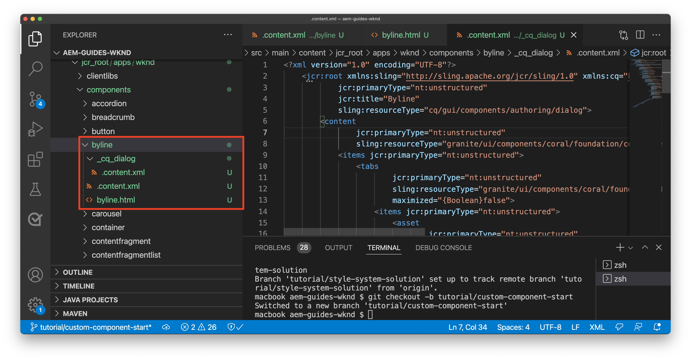

# Componente personalizzato {#custom-component}

Questa esercitazione descrive la creazione end-to-end di un componente Byline AEM personalizzato che visualizza i contenuti creati in una finestra di dialogo ed esplora lo sviluppo di un modello Sling per incapsulare la logica di business che popola l’HTL del componente.

## Prerequisiti {#prerequisites}

Rivedi gli strumenti e le istruzioni necessari per configurare un [ambiente di sviluppo locale](overview.md#local-dev-environment).

### Progetto iniziale

>[!NOTE]
>
> Se hai completato con successo il capitolo precedente, puoi riutilizzare il progetto e saltare i passaggi per il check-out del progetto iniziale.

Controlla il codice della riga di base su cui si basa l&#39;esercitazione:

1. Estrai il ramo `tutorial/custom-component-start` da [GitHub](https://github.com/adobe/aem-guides-wknd)

   ```shell
   $ cd aem-guides-wknd
   $ git checkout tutorial/custom-component-start
   ```

1. Distribuisci la base di codice in un&#39;istanza AEM locale utilizzando le tue competenze Maven:

   ```shell
   $ mvn clean install -PautoInstallSinglePackage
   ```

   >[!NOTE]
   >
   > Se utilizzi AEM 6.5 o 6.4, aggiungi il profilo `classic` a qualsiasi comando Maven.

   ```shell
   $ mvn clean install -PautoInstallSinglePackage -Pclassic
   ```

Puoi sempre visualizzare il codice finito su [GitHub](https://github.com/adobe/aem-guides-wknd/tree/tutorial/custom-component-solution) o estrarre il codice localmente passando al ramo `tutorial/custom-component-solution`.

## Obiettivo

1. Come creare un componente AEM personalizzato
1. Scopri come incapsulare la logica di business con i modelli Sling
1. Come utilizzare un modello Sling all’interno di uno script HTL

## Cosa verrà creato {#byline-component}

In questa parte dell’esercitazione WKND, viene creato un componente Byline che verrà utilizzato per visualizzare le informazioni create sul collaboratore di un articolo.


*Componente Byline*

L’implementazione del componente Byline include una finestra di dialogo che raccoglie il contenuto del byline e un modello Sling personalizzato che recupera il contenuto del byline:

* Nome
* Immagine
* Occupazioni

## Crea componente Byline {#create-byline-component}

Innanzitutto, crea la struttura del nodo del componente Byline e definisci una finestra di dialogo. Rappresenta il componente in AEM e definisce implicitamente il tipo di risorsa del componente in base alla sua posizione nel JCR.

La finestra di dialogo espone l’interfaccia con cui gli autori possono fornire i contenuti. Per questa implementazione, il componente **Immagine** del componente core WCM AEM verrà utilizzato per gestire la creazione e il rendering dell&#39;immagine del componente Byline, in modo che venga impostato come `sling:resourceSuperType` del nostro componente.

### Crea definizione componente {#create-component-definition}

1. Nel modulo **ui.apps** , passa a `/apps/wknd/components` e crea una nuova cartella denominata `byline`.
1. Sotto la cartella `byline` aggiungi un nuovo file denominato `.content.xml`

   

1. Compilare il file `.content.xml` con quanto segue:

   ```xml
   <?xml version="1.0" encoding="UTF-8"?>
       <jcr:root xmlns:sling="http://sling.apache.org/jcr/sling/1.0" xmlns:cq="http://www.day.com/jcr/cq/1.0" xmlns:jcr="http://www.jcp.org/jcr/1.0"
       jcr:primaryType="cq:Component"
       jcr:title="Byline"
       jcr:description="Displays a contributor's byline."
       componentGroup="WKND Sites Project - Content"
       sling:resourceSuperType="core/wcm/components/image/v2/image"/>
   ```

   Il file XML di cui sopra fornisce la definizione del componente, inclusi il titolo, la descrizione e il gruppo. Il `sling:resourceSuperType` punta a `core/wcm/components/image/v2/image`, che è il [componente immagine di base](https://experienceleague.adobe.com/docs/experience-manager-core-components/using/components/image.html).

### Creare lo script HTL {#create-the-htl-script}

1. Sotto la cartella `byline` , aggiungi un nuovo file `byline.html`, responsabile della presentazione HTML del componente. È importante denominare il file come cartella, poiché diventa lo script predefinito che Sling utilizzerà per eseguire il rendering di questo tipo di risorsa.

1. Aggiungi il codice seguente al `byline.html`.

   ```html
   <!--/* byline.html */-->
   <div data-sly-use.placeholderTemplate="core/wcm/components/commons/v1/templates.html">
   </div>
   <sly data-sly-call="${placeholderTemplate.placeholder @ isEmpty=true}"></sly>
   ```

`byline.html` viene  [rivisitato in seguito](#byline-htl), una volta creato il modello Sling. Lo stato corrente del file HTL consente al componente di essere visualizzato in uno stato vuoto, nell’Editor pagina di AEM Sites quando viene trascinato e rilasciato sulla pagina.

### Creare la definizione della finestra di dialogo {#create-the-dialog-definition}

Quindi, definisci una finestra di dialogo per il componente Byline con i campi seguenti:

* **Nome**: un campo di testo con il nome del collaboratore.
* **Immagine**: un riferimento alla foto biografica del collaboratore.
* **Occupazione**: un elenco delle professioni attribuite al collaboratore. Le professioni devono essere ordinate alfabeticamente in ordine crescente (da a a z).

1. Sotto la cartella `byline` , crea una nuova cartella denominata `_cq_dialog`.
1. Sotto `byline/_cq_dialog` aggiungi un nuovo file denominato `.content.xml`. Definizione XML per la finestra di dialogo. Aggiungi il seguente XML:

   ```xml
   <?xml version="1.0" encoding="UTF-8"?>
   <jcr:root xmlns:sling="http://sling.apache.org/jcr/sling/1.0" xmlns:cq="http://www.day.com/jcr/cq/1.0" xmlns:jcr="http://www.jcp.org/jcr/1.0" xmlns:nt="http://www.jcp.org/jcr/nt/1.0"
           jcr:primaryType="nt:unstructured"
           jcr:title="Byline"
           sling:resourceType="cq/gui/components/authoring/dialog">
       <content
               jcr:primaryType="nt:unstructured"
               sling:resourceType="granite/ui/components/coral/foundation/container">
           <items jcr:primaryType="nt:unstructured">
               <tabs
                       jcr:primaryType="nt:unstructured"
                       sling:resourceType="granite/ui/components/coral/foundation/tabs"
                       maximized="{Boolean}false">
                   <items jcr:primaryType="nt:unstructured">
                       <asset
                               jcr:primaryType="nt:unstructured"
                               sling:hideResource="{Boolean}false"/>
                       <metadata
                               jcr:primaryType="nt:unstructured"
                               sling:hideResource="{Boolean}true"/>
                       <properties
                               jcr:primaryType="nt:unstructured"
                               jcr:title="Properties"
                               sling:resourceType="granite/ui/components/coral/foundation/container"
                               margin="{Boolean}true">
                           <items jcr:primaryType="nt:unstructured">
                               <columns
                                       jcr:primaryType="nt:unstructured"
                                       sling:resourceType="granite/ui/components/coral/foundation/fixedcolumns"
                                       margin="{Boolean}true">
                                   <items jcr:primaryType="nt:unstructured">
                                       <column
                                               jcr:primaryType="nt:unstructured"
                                               sling:resourceType="granite/ui/components/coral/foundation/container">
                                           <items jcr:primaryType="nt:unstructured">
                                               <name
                                                       jcr:primaryType="nt:unstructured"
                                                       sling:resourceType="granite/ui/components/coral/foundation/form/textfield"
                                                       emptyText="Enter the contributor's name to display."
                                                       fieldDescription="The contributor's name to display."
                                                       fieldLabel="Name"
                                                       name="./name"
                                                       required="{Boolean}true"/>
                                               <occupations
                                                       jcr:primaryType="nt:unstructured"
                                                       sling:resourceType="granite/ui/components/coral/foundation/form/multifield"
                                                       fieldDescription="A list of the contributor's occupations."
                                                       fieldLabel="Occupations"
                                                       required="{Boolean}false">
                                                   <field
                                                           jcr:primaryType="nt:unstructured"
                                                           sling:resourceType="granite/ui/components/coral/foundation/form/textfield"
                                                           emptyText="Enter an occupation"
                                                           name="./occupations"/>
                                               </occupations>
                                           </items>
                                       </column>
                                   </items>
                               </columns>
                           </items>
                       </properties>
                   </items>
               </tabs>
           </items>
       </content>
   </jcr:root>
   ```

   Queste definizioni dei nodi di dialogo utilizzano il [Sling Resource Merger](https://sling.apache.org/documentation/bundles/resource-merger.html) per controllare quali schede di dialogo vengono ereditate dal componente `sling:resourceSuperType`, in questo caso il componente immagine **Componenti core**.

   

### Finestra di dialogo Crea criterio {#create-the-policy-dialog}

Seguendo lo stesso approccio della creazione della finestra di dialogo, crea una finestra di dialogo Criteri (precedentemente nota come finestra di dialogo di progettazione) per nascondere i campi indesiderati nella configurazione dei criteri ereditati dal componente Immagine dei componenti core.

1. Sotto la cartella `byline` , crea una nuova cartella denominata `_cq_design_dialog`.
1. Sotto `byline/_cq_design_dialog` crea un nuovo file denominato `.content.xml`. Aggiorna il file con quanto segue: con il seguente XML. È più semplice aprire il `.content.xml` e copiare/incollare il codice XML sottostante.

   ```xml
   <?xml version="1.0" encoding="UTF-8"?>
   <jcr:root xmlns:sling="http://sling.apache.org/jcr/sling/1.0" xmlns:granite="http://www.adobe.com/jcr/granite/1.0" xmlns:cq="http://www.day.com/jcr/cq/1.0" xmlns:jcr="http://www.jcp.org/jcr/1.0" xmlns:nt="http://www.jcp.org/jcr/nt/1.0"
       jcr:primaryType="nt:unstructured"
       jcr:title="Byline"
       sling:resourceType="cq/gui/components/authoring/dialog">
       <content
               jcr:primaryType="nt:unstructured">
           <items jcr:primaryType="nt:unstructured">
               <tabs
                       jcr:primaryType="nt:unstructured">
                   <items jcr:primaryType="nt:unstructured">
                       <properties
                               jcr:primaryType="nt:unstructured">
                           <items jcr:primaryType="nt:unstructured">
                               <content
                                       jcr:primaryType="nt:unstructured">
                                   <items jcr:primaryType="nt:unstructured">
                                       <decorative
                                               jcr:primaryType="nt:unstructured"
                                               sling:hideResource="{Boolean}true"/>
                                       <altValueFromDAM
                                               jcr:primaryType="nt:unstructured"
                                               sling:hideResource="{Boolean}true"/>
                                       <titleValueFromDAM
                                               jcr:primaryType="nt:unstructured"
                                               sling:hideResource="{Boolean}true"/>
                                       <displayCaptionPopup
                                               jcr:primaryType="nt:unstructured"
                                               sling:hideResource="{Boolean}true"/>
                                       <disableUuidTracking
                                               jcr:primaryType="nt:unstructured"
                                               sling:hideResource="{Boolean}true"/>
                                   </items>
                               </content>
                           </items>
                       </properties>
                       <features
                               jcr:primaryType="nt:unstructured">
                           <items jcr:primaryType="nt:unstructured">
                               <content
                                       jcr:primaryType="nt:unstructured">
                                   <items jcr:primaryType="nt:unstructured">
                                       <accordion
                                               jcr:primaryType="nt:unstructured">
                                           <items jcr:primaryType="nt:unstructured">
                                               <orientation
                                                       jcr:primaryType="nt:unstructured"
                                                       sling:hideResource="{Boolean}true"/>
                                               <crop
                                                       jcr:primaryType="nt:unstructured"
                                                       sling:hideResource="{Boolean}true"/>
                                           </items>
                                       </accordion>
                                   </items>
                               </content>
                           </items>
                       </features>
                   </items>
               </tabs>
           </items>
       </content>
   </jcr:root>
   ```

   La base per la precedente finestra di dialogo **Criteri** XML è stata ottenuta dal componente [Immagine dei componenti core](https://github.com/adobe/aem-core-wcm-components/blob/master/content/src/content/jcr_root/apps/core/wcm/components/image/v2/image/_cq_design_dialog/.content.xml).

   Come nella configurazione della finestra di dialogo, [Sling Resource Merger](https://sling.apache.org/documentation/bundles/resource-merger.html) viene utilizzato per nascondere i campi irrilevanti che sono altrimenti ereditati da `sling:resourceSuperType`, come indicato dalle definizioni dei nodi con la proprietà `sling:hideResource="{Boolean}true"` .

### Distribuire il codice {#deploy-the-code}

1. Distribuisci la base di codice aggiornata in un&#39;istanza AEM locale utilizzando le tue competenze Maven:

   ```shell
   $ cd aem-guides-wknd
   $ mvn clean install -PautoInstallSinglePackage
   ```

## Aggiungere il componente a una pagina {#add-the-component-to-a-page}

Per semplificare e concentrarsi sullo sviluppo AEM componente, aggiungiamo il componente Byline nel suo stato corrente a una pagina Articolo per verificare che la definizione del nodo `cq:Component` sia distribuita e corretta, AEM riconosce la nuova definizione del componente e la finestra di dialogo del componente funziona per l’authoring.

### Aggiungere un’immagine ad AEM Assets

Innanzitutto, carica un campione di head shot in AEM Assets da usare per popolare l&#39;immagine nel componente Byline.

1. Passa alla cartella LA Skateparks in AEM Assets: [http://localhost:4502/assets.html/content/dam/wknd/en/magazine/la-skateparks](http://localhost:4502/assets.html/content/dam/wknd/en/magazine/la-skateparks).

1. Carica la foto della testa per **[stacey-roswells.jpg](assets/custom-component/stacey-roswells.jpg)** nella cartella.

   

### Creare il componente {#author-the-component}

Quindi, aggiungi il componente Byline a una pagina in AEM. Poiché il componente Byline è stato aggiunto al gruppo di componenti **WKND Sites Project - Content** tramite la definizione `ui.apps/src/main/content/jcr_root/apps/wknd/components/byline/.content.xml`, è automaticamente disponibile per qualsiasi gruppo di componenti **Container** il cui **Policy** consente il gruppo di componenti **WKND Sites Project - Content**, che il contenitore di layout della pagina dell’articolo .

1. Passa all&#39;articolo LO Skatepark all&#39;indirizzo: [http://localhost:4502/editor.html/content/wknd/us/en/magazine/guide-la-skateparks.html](http://localhost:4502/editor.html/content/wknd/us/en/magazine/guide-la-skateparks.html)

1. Dalla barra laterale sinistra, trascina un **componente Byline** su **bottom** del Contenitore di layout della pagina dell’articolo aperta.

   

1. Assicurati che la **barra laterale sinistra sia aperta** e visibile e che sia selezionato **Asset Finder**.

   

1. Seleziona il segnaposto del componente **Byline**, che a sua volta visualizza la barra delle azioni, quindi tocca l&#39;icona **chiave inglese** per aprire la finestra di dialogo.

   

1. Con la finestra di dialogo aperta e la prima scheda (Risorsa) attiva, apri la barra laterale sinistra e, da Asset Finder, trascina un’immagine nella zona di rilascio Immagine. Cerca &quot;stacey&quot; per trovare Stacey Roswells bio picture fornito nel pacchetto WKND ui.content.

   

1. Dopo aver aggiunto un&#39;immagine, fai clic sulla scheda **Proprietà** per immettere il **Nome** e **Occupazioni**.

   Quando si immettono occupazioni, inserirle nell&#39;ordine **alfabetico inverso** in modo che la logica di business dell&#39;alfabeto che verrà implementata nel modello Sling sia facilmente evidente.

   Toccare il pulsante **Fine** in basso a destra per salvare le modifiche.

   

   AEM gli autori configurano e creano i componenti tramite le finestre di dialogo. A questo punto nello sviluppo del componente Byline le finestre di dialogo sono incluse per la raccolta dei dati, tuttavia la logica per il rendering del contenuto creato non è ancora stata aggiunta. Viene quindi visualizzato solo il segnaposto.

1. Dopo aver salvato la finestra di dialogo, passa a [CRXDE Lite](http://localhost:4502/crx/de/index.jsp#/content/wknd/us/en/magazine/guide-la-skateparks/jcr%3Acontent/root/container/container/byline) e controlla come il contenuto del componente viene memorizzato sul nodo del contenuto del componente di tipo non lineare nella pagina di AEM.

   Trova il nodo del contenuto del componente Byline sotto la pagina Skate Parks di LA, cioè `/content/wknd/us/en/magazine/guide-la-skateparks/jcr:content/root/container/container/byline`.

   Osserva che i nomi delle proprietà `name`, `occupations` e `fileReference` sono memorizzati sul nodo **byline**.

   Inoltre, nota che il `sling:resourceType` del nodo è impostato su `wknd/components/content/byline` che è ciò che lega questo nodo di contenuto all’implementazione del componente Byline.

   

## Crea modello Sling per riga {#create-sling-model}

Ora creeremo un modello Sling per fungere da modello dati e ospitare la logica di business per il componente Byline.

I modelli Sling sono Java &quot;POJO&quot; (Plain Old Java Objects) basati su annotazioni che facilitano la mappatura dei dati da JCR alle variabili Java e forniscono una serie di altri concetti quando si sviluppano nel contesto di AEM.

### Rivedi dipendenze Maven {#maven-dependency}

Il modello Sling Byline si basa su diverse API Java fornite da AEM. Queste API sono rese disponibili tramite l’ `dependencies` elencato nel file POM del modulo `core`. Il progetto utilizzato per questa esercitazione è stato creato per AEM come Cloud Service. Tuttavia è unico in quanto è retrocompatibile con AEM 6.5/6.4. Pertanto sono incluse entrambe le dipendenze per Cloud Service e AEM 6.x.

1. Apri il file `pom.xml` sotto `<src>/aem-guides-wknd/core/pom.xml`.
1. Trova la dipendenza per `aem-sdk-api` - **AEM solo come Cloud Service**

   ```xml
   <dependency>
       <groupId>com.adobe.aem</groupId>
       <artifactId>aem-sdk-api</artifactId>
   </dependency>
   ```

   Il [aem-sdk-api](https://experienceleague.adobe.com/docs/experience-manager-cloud-service/implementing/developing/aem-as-a-cloud-service-sdk.html?lang=en#building-for-the-sdk) contiene tutte le API Java pubbliche esposte da AEM. Il `aem-sdk-api` viene utilizzato per impostazione predefinita durante la creazione del progetto. La versione viene mantenuta nel riquadro del reattore principale situato nella directory principale del progetto in `aem-guides-wknd/pom.xml`.

1. Trova la dipendenza per `uber-jar` - **AEM solo 6.5/6.4**

   ```xml
   ...
       <dependency>
           <groupId>com.adobe.aem</groupId>
           <artifactId>uber-jar</artifactId>
           <classifier>apis</classifier>
       </dependency>
   ...
   ```

   Il `uber-jar` è incluso solo quando viene richiamato il profilo `classic` , ovvero `mvn clean install -PautoInstallSinglePackage -Pclassic`. Anche in questo caso, questo è unico per questo progetto. In un progetto reale, generato dall’Archetipo di progetto AEM, il valore predefinito è `uber-jar` se la versione del AEM specificata è 6.5 o 6.4.

   Il [uber-jar](https://experienceleague.adobe.com/docs/experience-manager-65/developing/devtools/ht-projects-maven.html#experience-manager-api-dependencies) contiene tutte le API Java pubbliche esposte da AEM 6.x. La versione viene mantenuta nel riquadro del reattore principale situato nella directory principale del progetto `aem-guides-wknd/pom.xml`.

1. Trova la dipendenza per `core.wcm.components.core`:

   ```xml
    <!-- Core Component Dependency -->
       <dependency>
           <groupId>com.adobe.cq</groupId>
           <artifactId>core.wcm.components.core</artifactId>
       </dependency>
   ```

   Tutte le API Java pubbliche esposte dai componenti core AEM. AEM componenti core è un progetto gestito al di fuori di AEM e dispone quindi di un ciclo di rilascio separato. Per questo motivo si tratta di una dipendenza che deve essere inclusa separatamente e che è **non** inclusa con `uber-jar` o `aem-sdk-api`.

   Come il file uber-jar, la versione per questa dipendenza viene mantenuta nel file pom del reattore principale che si trova in `aem-guides-wknd/pom.xml`.

   Più avanti in questa esercitazione utilizzeremo la classe immagine del componente core per visualizzare l’immagine nel componente Byline. È necessario avere la dipendenza del componente core per generare e compilare il nostro modello Sling.

### Interfaccia ibrida {#byline-interface}

Crea un&#39;interfaccia Java pubblica per il comando Byline. `Byline.java` definisce i metodi pubblici necessari per eseguire lo script  `byline.html` HTL.

1. All&#39;interno del modulo `aem-guides-wknd.core` sotto `core/src/main/java/com/adobe/aem/guides/wknd/core/models` crea un nuovo file denominato `Byline.java`

   

1. Aggiorna `Byline.java` con i seguenti metodi:

   ```java
   package com.adobe.aem.guides.wknd.core.models;
   
   import java.util.List;
   
   /**
   * Represents the Byline AEM Component for the WKND Site project.
   **/
   public interface Byline {
       /***
       * @return a string to display as the name.
       */
       String getName();
   
       /***
       * Occupations are to be sorted alphabetically in a descending order.
       *
       * @return a list of occupations.
       */
       List<String> getOccupations();
   
       /***
       * @return a boolean if the component has enough content to display.
       */
       boolean isEmpty();
   }
   ```

   I primi due metodi espongono i valori per **name** e **occupazioni** per il componente Byline.

   Il metodo `isEmpty()` viene utilizzato per determinare se il componente ha del contenuto da riprodurre o se è in attesa di configurazione.

   Nota che non esiste un metodo per l&#39;immagine; [verrà spiegato perché più tardi](#tackling-the-image-problem).

1. I pacchetti Java che contengono classi Java pubbliche, in questo caso un modello Sling, devono essere sottoposti a una versione utilizzando il file `package-info.java` del pacchetto.

Poiché il pacchetto Java della sorgente WKND `com.adobe.aem.guides.wknd.core.models` dichiara che è una versione di `2.0.0` e stiamo aggiungendo un’interfaccia e metodi pubblici non unificanti, la versione deve essere aumentata a `2.1.0`. Apri il file in `core/src/main/java/com/adobe/aem/guides/wknd/core/models/package-info.java` e aggiorna `@Version("2.0.0")` in `@Version("2.1.0")`.

    &quot;
    @Version(&quot;2.1.0&quot;)
    pacchetto com.adobe.aem.guides.wknd.core.models;
    
    importa org.osgi.annotation.versioning.Version;
    &quot;

Ogni volta che viene apportata una modifica ai file di questo pacchetto, la versione del pacchetto [deve essere regolata semanticamente](https://semver.org/). In caso contrario, il progetto Maven [bnd-baseline-maven-plugin](https://github.com/bndtools/bnd/tree/master/maven/bnd-baseline-maven-plugin) rileverà una versione del pacchetto non valida e interromperà la build. Fortunatamente, in caso di errore, il plug-in Maven segnala la versione non valida del pacchetto Java e la versione che dovrebbe essere. È stato appena aggiornato la dichiarazione `@Version("...")` del pacchetto Java che viola `package-info.java` alla versione consigliata dal plug-in per la correzione.

### Implementazione byline {#byline-implementation}

`BylineImpl.java` è l’implementazione del modello Sling che implementa l’ `Byline.java` interfaccia definita in precedenza. Il codice completo di `BylineImpl.java` si trova nella parte inferiore di questa sezione.

1. Crea una nuova cartella denominata `impl` sotto `core/src/main/java/com/adobe/aem/guides/core/models`.
1. Nella cartella `impl` crea un nuovo file `BylineImpl.java`.

   

1. Apri `BylineImpl.java`. Specifica che implementa l&#39;interfaccia `Byline` . Utilizza le funzioni di completamento automatico dell&#39;IDE o aggiorna manualmente il file per includere i metodi necessari per implementare l&#39;interfaccia `Byline`:

   ```java
   package com.adobe.aem.guides.wknd.core.models.impl;
   import java.util.List;
   import com.adobe.aem.guides.wknd.core.models.Byline;
   
   public class BylineImpl implements Byline {
   
       @Override
       public String getName() {
           // TODO Auto-generated method stub
           return null;
       }
   
       @Override
       public List<String> getOccupations() {
           // TODO Auto-generated method stub
           return null;
       }
   
       @Override
       public boolean isEmpty() {
           // TODO Auto-generated method stub
           return false;
       }
   }
   ```

1. Aggiungi le annotazioni del modello Sling aggiornando `BylineImpl.java` con le seguenti annotazioni a livello di classe. Questa `@Model(..)`annotazione è ciò che trasforma la classe in un modello Sling.

   ```java
   import org.apache.sling.api.SlingHttpServletRequest;
   import org.apache.sling.models.annotations.Model;
   import org.apache.sling.models.annotations.DefaultInjectionStrategy;
   ...
   @Model(
           adaptables = {SlingHttpServletRequest.class},
           adapters = {Byline.class},
           resourceType = {BylineImpl.RESOURCE_TYPE},
           defaultInjectionStrategy = DefaultInjectionStrategy.OPTIONAL
   )
   public class BylineImpl implements Byline {
       protected static final String RESOURCE_TYPE = "wknd/components/content/byline";
       ...
   }
   ```

   Esaminiamo questa annotazione e i relativi parametri:

   * L’annotazione `@Model` registra BylineImpl come modello Sling quando viene distribuita in AEM.
   * Il parametro `adaptables` specifica che questo modello può essere adattato dalla richiesta.
   * Il parametro `adapters` consente di registrare la classe di implementazione sotto l&#39;interfaccia Byline. Questo consente allo script HTL di chiamare il modello Sling tramite l’interfaccia (invece dell’impl direttamente). [Ulteriori dettagli sugli adattatori sono disponibili qui](https://sling.apache.org/documentation/bundles/models.html#specifying-an-alternate-adapter-class-since-110).
   * Il `resourceType` punta al tipo di risorsa del componente Byline (creato in precedenza) e aiuta a risolvere il modello corretto in presenza di più implementazioni. [Ulteriori dettagli sull&#39;associazione di una classe di modello a un tipo di risorsa sono disponibili qui](https://sling.apache.org/documentation/bundles/models.html#associating-a-model-class-with-a-resource-type-since-130).

### Implementazione dei metodi del modello Sling {#implementing-the-sling-model-methods}

#### getName() {#implementing-get-name}

Il primo metodo che affronteremo è `getName()` che restituisce semplicemente il valore memorizzato nel nodo di contenuto JCR del byline sotto la proprietà `name`.

A questo scopo, l’annotazione `@ValueMapValue` Modello Sling viene utilizzata per inserire il valore in un campo Java utilizzando ValueMap della risorsa Request.


```java
import org.apache.sling.models.annotations.injectorspecific.ValueMapValue;

public class BylineImpl implements Byline {
    ...
    @ValueMapValue
    private String name;

    ...
    @Override
    public String getName() {
        return name;
    }
    ...
}
```

Poiché la proprietà JCR condivide lo stesso nome del campo Java (entrambi sono &quot;name&quot;), `@ValueMapValue` risolve automaticamente questa associazione e inserisce il valore della proprietà nel campo Java.

#### getOccupations() {#implementing-get-occupations}

Il metodo successivo da implementare è `getOccupations()`. Questo metodo raccoglie tutte le occupazioni memorizzate nella proprietà JCR `occupations` e restituisce un insieme ordinato (in ordine alfabetico) di esse.

Utilizzando la stessa tecnica esplorata in `getName()` il valore della proprietà può essere inserito nel campo del modello Sling.

Una volta che i valori delle proprietà JCR sono disponibili nel modello Sling tramite il campo Java inserito `occupations`, la logica di business di ordinamento può essere applicata nel metodo `getOccupations()`.


```java
import java.util.ArrayList;
import java.util.Collections;
  ...

public class BylineImpl implements Byline {
    ...
    @ValueMapValue
    private List<String> occupations;
    ...
    @Override
    public List<String> getOccupations() {
        if (occupations != null) {
            Collections.sort(occupations);
            return new ArrayList<String>(occupations);
        } else {
            return Collections.emptyList();
        }
    }
    ...
}
  ...
```


#### isEmpty() {#implementing-is-empty}

L’ultimo metodo pubblico è `isEmpty()` che determina quando il componente deve considerare se stesso &quot;sufficientemente creato&quot; per il rendering.

Per questo componente, abbiamo requisiti aziendali che indicano che tutti e tre i campi, il nome, l’immagine e le occupazioni devono essere compilati *prima di eseguire il rendering del componente.*


```java
import org.apache.commons.lang3.StringUtils;
  ...
public class BylineImpl implements Byline {
    ...
    @Override
    public boolean isEmpty() {
        if (StringUtils.isBlank(name)) {
            // Name is missing, but required
            return true;
        } else if (occupations == null || occupations.isEmpty()) {
            // At least one occupation is required
            return true;
        } else if (/* image is not null, logic to be determined */) {
            // A valid image is required
            return true;
        } else {
            // Everything is populated, so this component is not considered empty
            return false;
        }
    }
    ...
}
```


#### Affrontare il &quot;problema dell&#39;immagine&quot; {#tackling-the-image-problem}

Controllare il nome e le condizioni di occupazione sono banali (e la classe Apache Commons Lang3 fornisce la classe [StringUtils](https://commons.apache.org/proper/commons-lang/apidocs/org/apache/commons/lang3/StringUtils.html) sempre pratica), tuttavia, non è chiaro come la **presenza dell&#39;immagine** possa essere convalidata poiché il componente Immagine dei componenti core viene utilizzato per la superficie dell&#39;immagine.

Ci sono due modi per affrontare questo problema:

Controlla se la proprietà `fileReference` JCR viene risolta in una risorsa. ** ORConverti questa risorsa in un modello Sling immagine componente core e assicurati che il  `getSrc()` metodo non sia vuoto.

Sceglieremo il **secondo approccio**. Il primo approccio è probabilmente sufficiente, ma in questa esercitazione quest’ultima ci permetterà di esplorare altre funzionalità di Sling Models.

1. Crea un metodo privato per ottenere l&#39;immagine. Questo metodo viene lasciato privato perché non è necessario esporre l&#39;oggetto Immagine nell&#39;HTL stesso e il suo solo utilizzo per l&#39;unità `isEmpty().`

   Il seguente metodo privato per `getImage()`:

   ```java
   import com.adobe.cq.wcm.core.components.models.Image;
   ...
   private Image getImage() {
       Image image = null;
       // Figure out how to populate the image variable!
       return image;
   }
   ```

   Come indicato in precedenza, ci sono altri due approcci per ottenere il **modello Sling immagine**:

   La prima utilizza l’ `@Self` annotazione, per adattare automaticamente la richiesta corrente alla `Image.class` del componente core

   ```java
   @Self
   private Image image;
   ```

   Il secondo utilizza il servizio [Apache Sling ModelFactory](https://sling.apache.org/apidocs/sling10/org/apache/sling/models/factory/ModelFactory.html) OSGi, un servizio molto utile, e ci aiuta a creare modelli Sling di altri tipi nel codice Java.

   Sceglieremo il secondo approccio.

   >[!NOTE]
   >
   >In un’implementazione reale, è preferibile adottare l’approccio &quot;Uno&quot;, utilizzando `@Self`, in quanto si tratta della soluzione più semplice ed elegante. In questa esercitazione utilizzeremo il secondo approccio, in quanto ci richiede di esplorare più facet di modelli Sling che sono estremamente utili sono componenti più complessi!

   Poiché i modelli Sling sono Java POJO e non OSGi Services, le consuete annotazioni di iniezione OSGi `@Reference` **non possono essere utilizzate**, invece i modelli Sling forniscono una speciale annotazione **[@OSGiService](https://sling.apache.org/documentation/bundles/models.html#injector-specific-annotations)** che fornisce funzionalità simili.

1. Aggiorna `BylineImpl.java` per includere l&#39;annotazione `OSGiService` per inserire il tag `ModelFactory`:

   ```java
   import org.apache.sling.models.factory.ModelFactory;
   import org.apache.sling.models.annotations.injectorspecific.OSGiService;
   ...
   public class BylineImpl implements Byline {
       ...
       @OSGiService
       private ModelFactory modelFactory;
   }
   ```

   Con `ModelFactory` disponibile, è possibile creare un modello Sling per immagini di un componente core utilizzando:

   ```java
   modelFactory.getModelFromWrappedRequest(SlingHttpServletRequest request, Resource resource, java.lang.Class<T> targetClass)
   ```

   Tuttavia, questo metodo richiede sia una richiesta che una risorsa, non ancora disponibili nel modello Sling. Per ottenere questi risultati, vengono utilizzate più annotazioni modello Sling!

   Per ottenere la richiesta corrente è possibile utilizzare l&#39;annotazione **[@Self](https://sling.apache.org/documentation/bundles/models.html#injector-specific-annotations)** per inserire il `adaptable` (definito in `@Model(..)` come `SlingHttpServletRequest.class` in un campo classe Java.

1. Aggiungi l&#39;annotazione **@Self** per ottenere la richiesta **SlingHttpServletRequest**:

   ```java
   import org.apache.sling.models.annotations.injectorspecific.Self;
   ...
   @Self
   private SlingHttpServletRequest request;
   ```

   Ricorda che l’utilizzo di `@Self Image image` per inserire il modello Sling per immagini del componente core era un’opzione precedente: l’ `@Self` annotazione cerca di inserire l’oggetto adattabile (nel nostro caso un SlingHttpServletRequest) e di adattarsi al tipo di campo di annotazione. Poiché il modello Sling per immagini del componente core è adattabile dagli oggetti SlingHttpServletRequest, questo avrebbe funzionato ed è meno codice del nostro approccio più esplorativo.

   Ora abbiamo inserito le variabili necessarie per creare un&#39;istanza del nostro modello Immagine tramite l&#39;API ModelFactory. Useremo l&#39;annotazione **[@PostConstruct](https://sling.apache.org/documentation/bundles/models.html#postconstruct-methods)** di Sling Model per ottenere questo oggetto dopo la creazione dell&#39;istanza di Sling Model.

   `@PostConstruct` è incredibilmente utile e agisce in una capacità simile a quella di un costruttore, tuttavia viene richiamato dopo che la classe è stata creata un&#39;istanza e tutti i campi Java annotati vengono inseriti. Mentre altre annotazioni del modello Sling annotano campi della classe Java (variabili), `@PostConstruct` annota un metodo del parametro void, zero, in genere denominato `init()` (ma può essere denominato qualsiasi cosa).

1. Aggiungi il metodo **@PostConstruct** :

   ```java
   import javax.annotation.PostConstruct;
   ...
   public class BylineImpl implements Byline {
       ...
       private Image image;
   
       @PostConstruct
       private void init() {
           image = modelFactory.getModelFromWrappedRequest(request,
                                                           request.getResource(),
                                                           Image.class);
       }
       ...
   }
   ```

   Ricorda che i modelli Sling sono **NOT** OSGi Services, quindi è sicuro mantenere lo stato della classe. Spesso `@PostConstruct` deriva e imposta lo stato della classe del modello Sling per un uso successivo, simile a quello di un costruttore normale.

   Nota che se il metodo `@PostConstruct` genera un&#39;eccezione, il modello Sling non creerà un&#39;istanza (sarà null).

1. **getImage()** può ora essere aggiornato per restituire semplicemente l&#39;oggetto immagine.

   ```java
   /**
       * @return the Image Sling Model of this resource, or null if the resource cannot create a valid Image Sling Model.
   */
   private Image getImage() {
       return image;
   }
   ```

1. Torniamo a `isEmpty()` e terminiamo l&#39;implementazione:

   ```java
   @Override
   public boolean isEmpty() {
      final Image componentImage = getImage();
   
       if (StringUtils.isBlank(name)) {
           // Name is missing, but required
           return true;
       } else if (occupations == null || occupations.isEmpty()) {
           // At least one occupation is required
           return true;
       } else if (componentImage == null || StringUtils.isBlank(componentImage.getSrc())) {
           // A valid image is required
           return true;
       } else {
           // Everything is populated, so this component is not considered empty
           return false;
       }
   }
   ```

   Nota che più chiamate a `getImage()` non sono problematiche in quanto restituisce la variabile di classe `image` inizializzata e non richiama `modelFactory.getModelFromWrappedRequest(...)` che non è eccessivamente costosa, ma vale la pena evitare di chiamare inutilmente.

1. L&#39;aspetto finale `BylineImpl.java` deve essere il seguente:


   ```java
   package com.adobe.aem.guides.wknd.core.models.impl;
   
   import java.util.ArrayList;
   import java.util.Collections;
   import java.util.List;
   import javax.annotation.PostConstruct;
   import org.apache.commons.lang3.StringUtils;
   import org.apache.sling.api.SlingHttpServletRequest;
   import org.apache.sling.models.annotations.DefaultInjectionStrategy;
   import org.apache.sling.models.annotations.Model;
   import org.apache.sling.models.annotations.injectorspecific.OSGiService;
   import org.apache.sling.models.annotations.injectorspecific.Self;
   import org.apache.sling.models.annotations.injectorspecific.ValueMapValue;
   import org.apache.sling.models.factory.ModelFactory;
   import com.adobe.aem.guides.wknd.core.models.Byline;
   import com.adobe.cq.wcm.core.components.models.Image;
   
   @Model(
           adaptables = {SlingHttpServletRequest.class},
           adapters = {Byline.class},
           resourceType = {BylineImpl.RESOURCE_TYPE},
           defaultInjectionStrategy = DefaultInjectionStrategy.OPTIONAL
   )
   public class BylineImpl implements Byline {
       protected static final String RESOURCE_TYPE = "wknd/components/content/byline";
   
       @Self
       private SlingHttpServletRequest request;
   
       @OSGiService
       private ModelFactory modelFactory;
   
       @ValueMapValue
       private String name;
   
       @ValueMapValue
       private List<String> occupations;
   
       private Image image;
   
       @PostConstruct
       private void init() {
           image = modelFactory.getModelFromWrappedRequest(request, request.getResource(), Image.class);
       }
   
       @Override
       public String getName() {
           return name;
       }
   
       @Override
       public List<String> getOccupations() {
           if (occupations != null) {
               Collections.sort(occupations);
               return new ArrayList<String>(occupations);
           } else {
               return Collections.emptyList();
           }
       }
   
       @Override
       public boolean isEmpty() {
           final Image componentImage = getImage();
   
           if (StringUtils.isBlank(name)) {
               // Name is missing, but required
               return true;
           } else if (occupations == null || occupations.isEmpty()) {
               // At least one occupation is required
               return true;
           } else if (componentImage == null || StringUtils.isBlank(componentImage.getSrc())) {
               // A valid image is required
               return true;
           } else {
               // Everything is populated, so this component is not considered empty
               return false;
           }
       }
   
       /**
       * @return the Image Sling Model of this resource, or null if the resource cannot create a valid Image Sling Model.
       */
       private Image getImage() {
           return image;
       }
   }
   ```


## Byline HTL {#byline-htl}

Nel modulo `ui.apps` , apri `/apps/wknd/components/byline/byline.html` creato nella configurazione precedente del componente AEM.

```html
<div data-sly-use.placeholderTemplate="core/wcm/components/commons/v1/templates.html">
</div>
<sly data-sly-call="${placeholderTemplate.placeholder @ isEmpty=false}"></sly>
```

Rivediamo cosa fa finora questo script HTL:

* Il `placeholderTemplate` punta al segnaposto dei componenti core, visualizzato quando il componente non è completamente configurato. Viene eseguito il rendering in AEM Sites Page Editor come una casella con il titolo del componente, come definito in precedenza nella proprietà `cq:Component` di `jcr:title` .

* Il `data-sly-call="${placeholderTemplate.placeholder @ isEmpty=false}` carica il `placeholderTemplate` definito sopra e passa un valore booleano (attualmente codificato in `false`) nel modello del segnaposto. Quando `isEmpty` è true, il modello di segnaposto esegue il rendering della casella grigia, altrimenti non esegue il rendering.

### Aggiorna HTL byline

1. Aggiorna **byline.html** con la seguente struttura scheletrica HTML:

   ```html
   <div data-sly-use.placeholderTemplate="core/wcm/components/commons/v1/templates.html"
       class="cmp-byline">
           <div class="cmp-byline__image">
               <!--/* Include the Core Components Image Component */-->
           </div>
           <h2 class="cmp-byline__name"><!--/* Include the name */--></h2>
           <p class="cmp-byline__occupations"><!--/* Include the occupations */--></p>
   </div>
   <sly data-sly-call="${placeholderTemplate.placeholder @ isEmpty=true}"></sly>
   ```

   Le classi CSS seguono la [convenzione di denominazione BEM](https://getbem.com/naming/). Anche se l’utilizzo delle convenzioni BEM non è obbligatorio, BEM è consigliato in quanto è utilizzato nelle classi CSS dei componenti core e generalmente genera regole CSS pulite e leggibili.

### Creazione di un’istanza di oggetti modello Sling in HTL {#instantiating-sling-model-objects-in-htl}

L’ [Usa istruzione blocco](https://github.com/adobe/htl-spec/blob/master/SPECIFICATION.md#221-use) viene utilizzata per creare un’istanza degli oggetti modello Sling nello script HTL e assegnarla a una variabile HTL.

`data-sly-use.byline="com.adobe.aem.guides.wknd.models.Byline"` utilizza l’interfaccia Byline (com.adobe.aem.guides.wknd.models.Byline) implementata da BylineImpl e adatta l’attuale SlingHttpServletRequest e il risultato viene memorizzato in un nome di variabile HTL per riga (  `data-sly-use.<variable-name>`).

1. Aggiorna il modello Sling esterno `div` per fare riferimento al modello **Byline** dalla relativa interfaccia pubblica:

   ```xml
   <div data-sly-use.byline="com.adobe.aem.guides.wknd.core.models.Byline"
       data-sly-use.placeholderTemplate="core/wcm/components/commons/v1/templates.html"
       class="cmp-byline">
       ...
   </div>
   ```

### Accesso ai metodi del modello Sling {#accessing-sling-model-methods}

HTL prende in prestito da JSTL e utilizza lo stesso accorciamento dei nomi dei metodi getter Java.

Ad esempio, l’invocazione del metodo `getName()` del modello Byline Sling può essere ridotta a `byline.name`, in modo simile invece di `byline.isEmpty`, può essere ridotta a `byline.empty`. Anche l&#39;utilizzo di nomi di metodo completi, `byline.getName` o `byline.isEmpty` funziona. Nota che le `()` non vengono mai utilizzate per richiamare metodi in HTL (simili a JSTL).

I metodi Java che richiedono un parametro **non possono** essere utilizzati in HTL. Questo è di progettazione per mantenere la logica in HTL semplice.

1. Il nome della riga può essere aggiunto al componente richiamando il metodo `getName()` sul modello Sling per riga o in HTL: `${byline.name}`.

   Aggiorna il tag `h2` :

   ```xml
   <h2 class="cmp-byline__name">${byline.name}</h2>
   ```

### Utilizzo delle opzioni di espressione HTL {#using-htl-expression-options}

[Espressioni HTL ](https://github.com/adobe/htl-spec/blob/master/SPECIFICATION.md#12-available-expression-options) Optionsact come modificatori di contenuto in HTL e variano dalla formattazione della data alla traduzione i18n. Le espressioni possono anche essere utilizzate per unire elenchi o array di valori, che è ciò che è necessario per visualizzare le occupazioni in un formato delimitato da virgole.

Le espressioni vengono aggiunte tramite l’operatore `@` nell’espressione HTL.

1. Per unire l’elenco delle occupazioni con &quot;, &quot;, viene utilizzato il seguente codice:

   ```html
   <p class="cmp-byline__occupations">${byline.occupations @ join=', '}</p>
   ```

### Visualizzazione condizionale del segnaposto {#conditionally-displaying-the-placeholder}

La maggior parte degli script HTL per i componenti AEM utilizza il paradigma **segnaposto** per fornire un segnale visivo agli autori **indicando che un componente non è stato creato correttamente e non verrà visualizzato in AEM Publish**. La convenzione per guidare questa decisione è quella di implementare un metodo sul modello Sling di supporto del componente, nel nostro caso: `Byline.isEmpty()`.

`isEmpty()` viene richiamato sul modello Sling Byline e il risultato (o meglio il suo negativo, tramite l’ `!` operatore ) viene salvato in una variabile HTL denominata  `hasContent`:

1. Aggiorna la variabile esterna `div` per salvare una variabile HTL denominata `hasContent`:

   ```html
    <div data-sly-use.byline="com.adobe.aem.guides.wknd.core.models.Byline"
         data-sly-use.placeholderTemplate="core/wcm/components/commons/v1/templates.html"
         data-sly-test.hasContent="${!byline.empty}"
         class="cmp-byline">
         ...
   </div>
   ```

   Nota l’utilizzo di `data-sly-test`, il blocco HTL `test` è interessante in quanto entrambi imposta una variabile HTL E esegue il rendering/non esegue il rendering dell’elemento HTML su cui si trova, in base se il risultato dell’espressione HTL è veritiero o meno. Se &quot;truthy&quot;, viene eseguito il rendering dell’elemento HTML, altrimenti non viene eseguito il rendering.

   È ora possibile riutilizzare questa variabile HTL `hasContent` per mostrare/nascondere il segnaposto in modo condizionale.

1. Aggiorna la chiamata condizionale a `placeholderTemplate` in fondo al file con quanto segue:

   ```html
   <sly data-sly-call="${placeholderTemplate.placeholder @ isEmpty=!hasContent}"></sly>
   ```

### Visualizzare l’immagine utilizzando i componenti core {#using-the-core-components-image}

Lo script HTL per `byline.html` è quasi completo e manca solo l’immagine.

Poiché utilizziamo `sling:resourceSuperType` il componente Immagine dei componenti core per creare l’immagine, possiamo anche utilizzare il componente Immagine del componente core per eseguire il rendering dell’immagine.

A questo scopo, è necessario includere la risorsa per riga corrente, ma forzare il tipo di risorsa del componente Immagine dei componenti core, utilizzando il tipo di risorsa `core/wcm/components/image/v2/image`. Questo è un modello potente per il riutilizzo dei componenti. A questo scopo, viene utilizzato il blocco HTL `data-sly-resource` .

1. Sostituisci il `div` con una classe di `cmp-byline__image` con quanto segue:

   ```html
   <div class="cmp-byline__image"
       data-sly-resource="${ '.' @ resourceType = 'core/wcm/components/image/v2/image' }"></div>
   ```

   Questo `data-sly-resource` include la risorsa corrente tramite il percorso relativo `'.'` e forza l’inclusione della risorsa corrente (o della risorsa contenuto del nome) con il tipo di risorsa `core/wcm/components/image/v2/image`.

   Il tipo di risorsa del componente core viene utilizzato direttamente e non tramite un proxy, perché si tratta di un utilizzo in-script e non viene mai persistito nel contenuto.

2. Completato `byline.html` di seguito:

   ```html
   <!--/* byline.html */-->
   <div data-sly-use.byline="com.adobe.aem.guides.wknd.core.models.Byline" 
       data-sly-use.placeholderTemplate="core/wcm/components/commons/v1/templates.html"
       data-sly-test.hasContent="${!byline.empty}"
       class="cmp-byline">
       <div class="cmp-byline__image"
           data-sly-resource="${ '.' @ resourceType = 'core/wcm/components/image/v2/image' }">
       </div>
       <h2 class="cmp-byline__name">${byline.name}</h2>
       <p class="cmp-byline__occupations">${byline.occupations @ join=', '}</p>
   </div>
   <sly data-sly-call="${placeholderTemplate.placeholder @ isEmpty=!hasContent}"></sly>
   ```

3. Distribuisci la base di codice in un&#39;istanza AEM locale. Poiché sono state apportate modifiche importanti ai file POM, esegui una build Maven completa dalla directory principale del progetto.

   ```shell
   $ cd aem-guides-wknd/
   $ mvn clean install -PautoInstallSinglePackage
   ```

   Se distribuisci a AEM 6.5/6.4, richiama il profilo `classic` :

   ```shell
   $ mvn clean install -PautoInstallSinglePackage -Pclassic
   ```

### Revisione del componente Byline senza stile {#reviewing-the-unstyled-byline-component}

1. Dopo aver distribuito l&#39;aggiornamento, passa alla pagina [Ultimate Guide to LA Skatepark ](http://localhost:4502/editor.html/content/wknd/us/en/magazine/guide-la-skateparks.html) o ovunque sia stato aggiunto il componente Byline prima nel capitolo.

1. Ora vengono visualizzate le **occupazioni**, **nome** e **occupazioni** e abbiamo un componente Byline non formattato ma funzionante.

   

### Verifica della registrazione del modello Sling {#reviewing-the-sling-model-registration}

La [AEM visualizzazione stato modelli Sling della console Web](http://localhost:4502/system/console/status-slingmodels) visualizza tutti i modelli Sling registrati in AEM. Il modello Byline Sling può essere convalidato come installato e riconosciuto esaminando questo elenco.

Se il **BylineImpl** non è visualizzato in questo elenco, allora c&#39;era probabilmente un problema con le annotazioni del modello Sling o il modello Sling non è stato aggiunto al pacchetto Sling Models registrato (com.adobe.aem.guides.wknd.core.models) nel progetto principale.


*http://localhost:4502/system/console/status-slingmodels*

## Stili di battitura {#byline-styles}

Il componente Byline deve essere formattato per essere allineato al design creativo del componente Byline. A tal fine, utilizza SCSS, che AEM il supporto per tramite il sottoprogetto Maven **ui.frontend** .

### Aggiungi uno stile predefinito

Aggiungi gli stili predefiniti per il componente Byline. Nel progetto **ui.frontend** in `/src/main/webpack/components`:

1. Crea un nuovo file denominato `_byline.scss`.

   

1. Aggiungi il CSS delle implementazioni Byline (scritto come SCSS) nel `default.scss`:

   ```scss
   .cmp-byline {
       $imageSize: 60px;
   
       .cmp-byline__image {
           float: left;
   
       /* This class targets a Core Component Image CSS class */
       .cmp-image__image {
           width: $imageSize;
           height: $imageSize;
           border-radius: $imageSize / 2;
           object-fit: cover;
           }
       }
   
       .cmp-byline__name {
           font-size: $font-size-medium;
           font-family: $font-family-serif;
           padding-top: 0.5rem;
           margin-left: $imageSize + 25px;
           margin-bottom: .25rem;
           margin-top:0rem;
       }
   
       .cmp-byline__occupations {
           margin-left: $imageSize + 25px;
           color: $gray;
           font-size: $font-size-xsmall;
           text-transform: uppercase;
       }
   }
   ```

1. Rivedi `main.scss` all&#39;indirizzo `ui.frontend/src/main/webpack/site/main.scss`:

   ```scss
   @import 'variables';
   @import 'wkndicons';
   @import 'base';
   @import '../components/**/*.scss';
   @import './styles/*.scss';
   ```

   `main.scss` è il punto di ingresso principale per gli stili inclusi nel  `ui.frontend` modulo. L&#39;espressione regolare `'../components/**/*.scss'` includerà tutti i file sotto la cartella `components/`.

1. Crea e distribuisci l’intero progetto per AEM:

   ```shell
   $ cd aem-guides-wknd/
   $ mvn clean install -PautoInstallSinglePackage
   ```

   Se utilizzi AEM 6.4/6.5 aggiungi il profilo `-Pclassic` .

   >[!TIP]
   >
   >Potrebbe essere necessario cancellare la cache del browser per garantire che non venga servito CSS obsoleti e aggiornare la pagina con il componente Byline per ottenere lo stile completo.

## Riunione {#putting-it-together}

Di seguito è riportato l’aspetto del componente Byline completamente creato e formattato nella pagina AEM.


## Congratulazioni! {#congratulations}

Congratulazioni, hai appena creato un componente personalizzato da zero utilizzando Adobe Experience Manager!

### Passaggi successivi {#next-steps}

Continua a scoprire AEM sviluppo di componenti esplorando come scrivere test JUnit per il codice Java Byline per garantire che tutto sia sviluppato correttamente e che la logica di business implementata sia corretta e completa.

* [Test di unità di scrittura o componenti AEM](unit-testing.md)

Visualizza il codice finito su [GitHub](https://github.com/adobe/aem-guides-wknd) oppure rivedi e distribuisci il codice localmente in sulla barra Git `tutorial/custom-component-solution`.

1. Clona il repository [github.com/adobe/aem-guides-wknd](https://github.com/adobe/aem-guides-wknd).
1. Estrai il ramo `tutorial/custom-component-solution`
