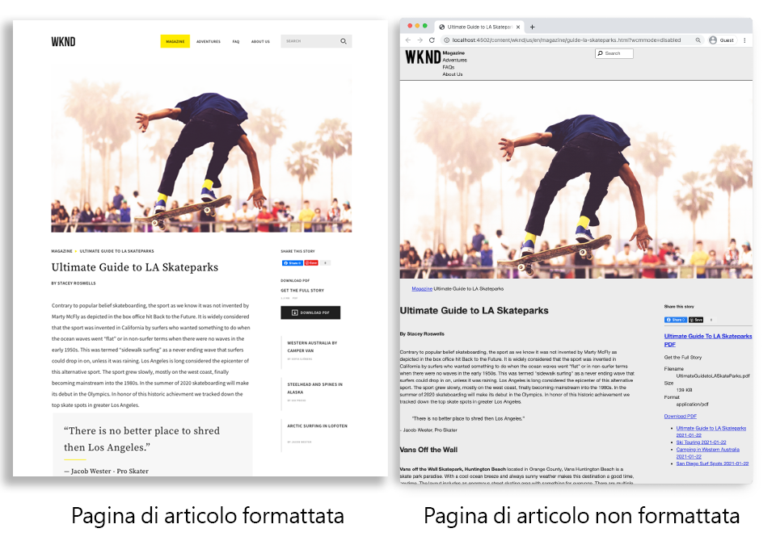
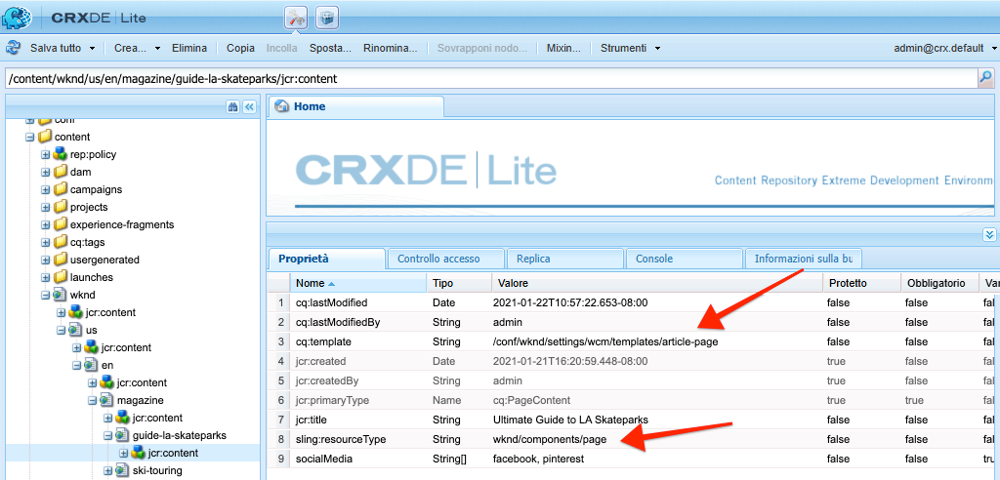
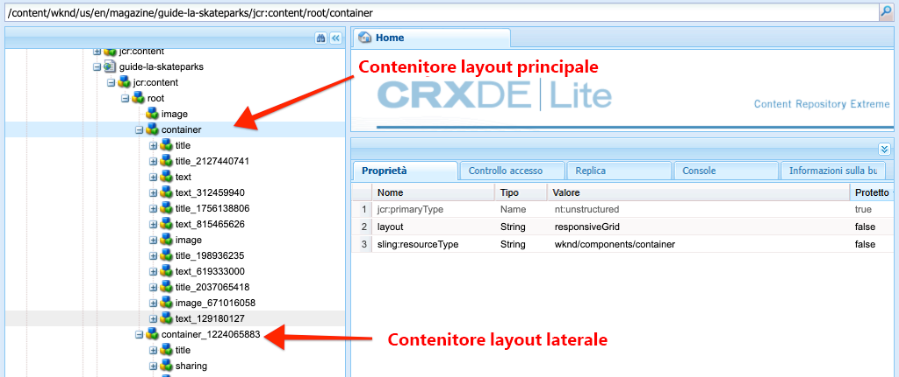
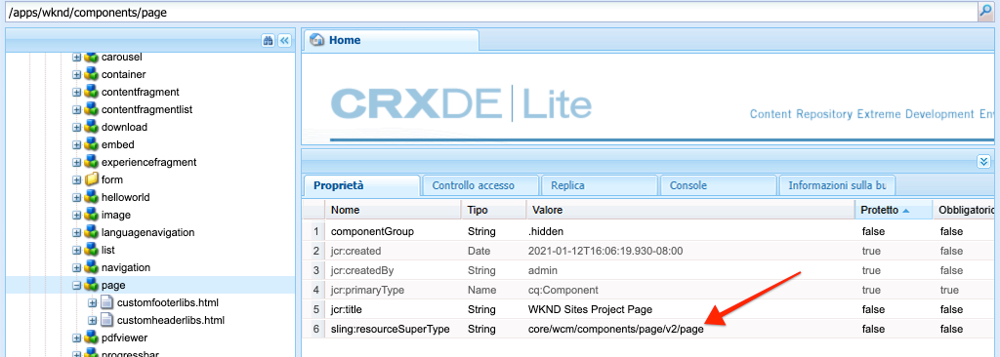
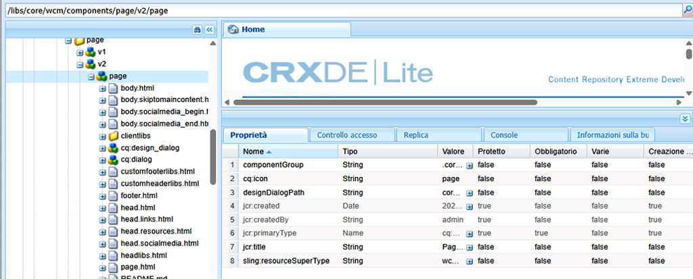

# Pagine e modelli {#pages-and-template}

In questo capitolo verrà esplorata la relazione tra un componente della pagina di base e modelli modificabili. Verrà creato un modello di articolo non formattato basato su alcuni modelli di [AdobeXD](https://www.adobe.com/products/xd.html). Durante il processo di creazione del modello, sono trattati i componenti core e le configurazioni avanzate dei modelli modificabili .

## Prerequisiti {#prerequisites}

Rivedi gli strumenti e le istruzioni necessari per configurare un [ambiente di sviluppo locale](overview.md#local-dev-environment).

### Progetto iniziale

>[!NOTE]
>
> Se hai completato con successo il capitolo precedente, puoi riutilizzare il progetto e saltare i passaggi per il check-out del progetto iniziale.

Controlla il codice della riga di base su cui si basa l&#39;esercitazione:

1. Estrai il ramo `tutorial/pages-templates-start` da [GitHub](https://github.com/adobe/aem-guides-wknd)

   ```shell
   $ cd ~/code/aem-guides-wknd
   $ git checkout tutorial/pages-templates-start
   ```

1. Distribuisci la base di codice in un&#39;istanza AEM locale utilizzando le tue competenze Maven:

   ```shell
   $ mvn clean install -PautoInstallSinglePackage
   ```

   >[!NOTE]
   >
   > Se utilizzi AEM 6.5 o 6.4, aggiungi il profilo `classic` a qualsiasi comando Maven.

   ```shell
   $ mvn clean install -PautoInstallSinglePackage -Pclassic
   ```

Puoi sempre visualizzare il codice finito su [GitHub](https://github.com/adobe/aem-guides-wknd/tree/tutorial/pages-templates-solution) o estrarre il codice localmente passando al ramo `tutorial/pages-templates-solution`.

## Obiettivo

1. Inspect è una progettazione di pagina creata in Adobe XD e la associa a Componenti core.
1. Comprendi i dettagli dei modelli modificabili e come possono essere utilizzati i criteri per applicare il controllo granulare del contenuto della pagina.
1. Scopri come i modelli e le pagine sono collegati

## Cosa verrà creato {#what-you-will-build}

In questa parte dell’esercitazione verrà creato un nuovo modello Pagina articolo che può essere utilizzato per creare nuove pagine di articoli e allinearsi a una struttura comune. Il modello Pagina articolo sarà basato sulle progettazioni e su un kit di interfaccia utente prodotto in AdobeXD. Questo capitolo si concentra solo sulla costruzione della struttura o dello scheletro del modello. Non verrà implementato alcun stile, ma il modello e le pagine funzioneranno.



## Pianificazione dell’interfaccia utente con Adobe XD {#adobexd}

Nella maggior parte dei casi, la pianificazione di un nuovo sito web inizia con modelli e progetti statici. [Adobe ](https://www.adobe.com/products/xd.html) XDè uno strumento di progettazione che crea esperienze utente. Ora esamineremo un kit di interfaccia utente e i modelli per pianificare la struttura del modello di pagina dell’articolo.

>[!VIDEO](https://video.tv.adobe.com/v/30214/?quality=12&learn=on)

**Scarica il file di progettazione dell’articolo  [WKND](https://github.com/adobe/aem-guides-wknd/releases/download/aem-guides-wknd-0.0.2/AEM_UI-kit-WKND-article-design.xd)**.

>[!NOTE]
>
> È disponibile anche un [AEM kit interfaccia utente per componenti core ](https://experienceleague.adobe.com/docs/experience-manager-learn/assets/AEM-CoreComponents-UI-Kit.xd) generico come punto di partenza per i progetti personalizzati.

## Creare il modello di pagina dell’articolo

Quando si crea una pagina, è necessario selezionare un modello da utilizzare come base per la creazione della nuova pagina. Il modello definisce la struttura della pagina risultante, il contenuto iniziale e i componenti consentiti.

Ci sono 3 aree principali di [Modelli modificabili](https://experienceleague.adobe.com/docs/experience-manager-65/developing/platform/templates/page-templates-editable.html):

1. **Struttura** : definisce i componenti che fanno parte del modello. Gli autori dei contenuti non potranno modificarli.
1. **Contenuto iniziale** : definisce i componenti con cui inizierà il modello, che possono essere modificati e/o eliminati dagli autori di contenuti
1. **Criteri** : definisce le configurazioni in base al comportamento dei componenti e alle opzioni disponibili per gli autori.

Quindi, crea un nuovo modello in AEM che corrisponda alla struttura dei modelli. Questo si verificherà in un&#39;istanza locale di AEM. Segui i passaggi del video seguente:

>[!VIDEO](https://video.tv.adobe.com/v/330991/?quality=12&learn=on)

Passaggi di alto livello per il video seguente:

### Configurazioni struttura

1. Crea un nuovo modello utilizzando il **Tipo di modello di pagina**, denominato **Pagina articolo**.
1. Passa alla modalità **Struttura** .
1. Aggiungi un componente **Frammento esperienza** per agire come **Intestazione** nella parte superiore del modello.
   * Configura il componente in modo che punti a `/content/experience-fragments/wknd/us/en/site/header/master`.
   * Imposta il criterio su **Intestazione pagina** e assicurati che l&#39; **Elemento predefinito** sia impostato su `header`. L’elemento `header`sarà oggetto di targeting con CSS nel capitolo successivo.
1. Aggiungi un componente **Frammento esperienza** per agire come **Piè di pagina** nella parte inferiore del modello.
   * Configura il componente in modo che punti a `/content/experience-fragments/wknd/us/en/site/footer/master`.
   * Imposta il criterio su **Piè di pagina** e assicurati che l&#39; **Elemento predefinito** sia impostato su `footer`. L’elemento `footer` sarà oggetto di targeting con CSS nel capitolo successivo.
1. Blocca il contenitore **principale** incluso quando il modello è stato creato inizialmente.
   * Imposta il criterio su **Pagina principale** e assicurati che l&#39; **Elemento predefinito** sia impostato su `main`. L’elemento `main` sarà oggetto di targeting con CSS nel capitolo successivo.
1. Aggiungi un componente **Immagine** al contenitore **principale** .
   * Sblocca il componente **Immagine**.
1. Aggiungi un componente **Breadcrumb** sotto il componente **Immagine** nel contenitore principale.
   * Crea un nuovo criterio per il componente **Breadcrumb** denominato **Pagina articolo - Breadcrumb**. Impostare il **Livello iniziale di navigazione** su **4**.
1. Aggiungi un componente **Container** sotto il componente **Breadcrumb** e all’interno del contenitore **principale** . Fungerà da **Contenitore di contenuto** per il modello.
   * Sblocca il contenitore **Contenuto**.
   * Imposta il criterio su **Contenuto pagina**.
1. Aggiungi un altro componente **Contenitore** sotto il **Contenitore di contenuto**. Fungerà da contenitore **Barra laterale** per il modello.
   * Sblocca il contenitore **Barra laterale** .
   * Crea un nuovo criterio denominato **Pagina articolo - Barra laterale**.
   * Configura i **Componenti consentiti** in **Progetto siti WKND - Contenuto** per includere: **Pulsante**, **Download**, **Immagine**, **Elenco**, **Separatore**, **Condivisione social media**, **Testo** e **Titolo**.
1. Aggiorna il criterio del contenitore Directory principale pagina. Questo è il contenitore più esterno del modello. Imposta il criterio su **Directory principale pagina**.
   * In **Impostazioni contenitore**, imposta **Layout** su **Griglia reattiva**.
1. Attiva la modalità di layout per il **contenitore Contenuto**. Trascinare la maniglia da destra a sinistra e ridurre il contenitore in modo che sia largo 8 colonne.
1. Attiva la modalità di layout per il **contenitore Barra laterale**. Trascinare la maniglia da destra a sinistra e ridurre il contenitore in modo che sia largo 4 colonne. Quindi trascina la maniglia sinistra da sinistra a destra 1 colonna per rendere il contenitore largo 3 colonne e lascia uno spazio vuoto di 1 colonna tra il **Contenitore di contenuto**.
1. Apri l’emulatore mobile e passa a un punto di interruzione mobile. Attiva nuovamente la modalità di layout e imposta il **contenitore Contenuto** e il **contenitore Barra laterale** all&#39;intera larghezza della pagina. I contenitori verranno sovrapposti verticalmente nel punto di interruzione mobile.
1. Aggiorna i criteri del componente **Testo** nel contenitore **Contenuto**.
   * Imposta il criterio su **Testo contenuto**.
   * In **Plugins** > **Stili di paragrafo**, controlla **Abilita stili di paragrafo** e assicurati che il **Blocco di preventivo** sia abilitato.

### Configurazioni del contenuto iniziale

1. Passa alla modalità **Contenuto iniziale** .
1. Aggiungi un componente **Titolo** al contenitore **Contenuto**. Questo fungerà da titolo dell&#39;articolo. Quando viene lasciato vuoto, viene visualizzato automaticamente il Titolo della pagina corrente.
1. Aggiungi un secondo componente **Titolo** sotto il primo componente Titolo.
   * Configura il componente con il testo: &quot;Per autore&quot;. Segnaposto per il testo.
   * Imposta il tipo su `H4`.
1. Aggiungi un componente **Testo** sotto il componente **Per autore** Titolo .
1. Aggiungi un componente **Titolo** al **Contenitore della barra laterale**.
   * Configura il componente con il testo: &quot;Condividi questa storia&quot;.
   * Imposta il tipo su `H5`.
1. Aggiungi un componente **Condivisione social media** sotto il componente **Condividi questa storia** Titolo .
1. Aggiungi un componente **Separatore** sotto il componente **Condivisione social media** .
1. Aggiungi un componente **Download** sotto il componente **Separatore**.
1. Aggiungi un componente **Elenco** sotto il componente **Download** .
1. Aggiorna le **Proprietà pagina iniziale** per il modello.
   * Sotto **Social Media** > **Condivisione social media**, controlla **Facebook** e **Pinterest**

### Abilita il modello e aggiungi una miniatura

1. Per visualizzare il modello nella console Modelli , passa a [http://localhost:4502/libs/wcm/core/content/sites/templates.html/conf/wknd](http://localhost:4502/libs/wcm/core/content/sites/templates.html/conf/wknd)
1. **** Attiva il modello Pagina articolo .
1. Modifica le proprietà del modello Pagina articolo e carica la seguente miniatura per identificare rapidamente le pagine create utilizzando il modello Pagina articolo :

   

## Aggiornare intestazione e piè di pagina con frammenti esperienza {#experience-fragments}

Una pratica comune durante la creazione di contenuto globale, ad esempio intestazione o piè di pagina, consiste nell’utilizzare un [Frammento esperienza](https://experienceleague.adobe.com/docs/experience-manager-learn/sites/experience-fragments/experience-fragments-feature-video-use.html). Frammenti esperienza consente agli utenti di combinare più componenti per creare un singolo componente utilizzabile come riferimento. I frammenti esperienza hanno il vantaggio di supportare la gestione multisito e la [localizzazione](https://experienceleague.adobe.com/docs/experience-manager-core-components/using/components/experience-fragment.html?lang=en#localized-site-structure).

L’Archetipo di progetto AEM ha generato un’intestazione e un piè di pagina. Quindi, aggiorna i frammenti esperienza in modo che corrispondano ai pattern. Segui i passaggi del video seguente:

>[!VIDEO](https://video.tv.adobe.com/v/330992/?quality=12&learn=on)

Passaggi di alto livello per il video seguente:

1. Scarica il pacchetto di contenuti di esempio **[WKND-PagesTemplates-Content-Assets.zip](assets/pages-templates/WKND-PagesTemplates-Content-Assets.zip)**.
1. Carica e installa il pacchetto di contenuti utilizzando Gestione pacchetti all&#39;indirizzo [http://localhost:4502/crx/packmgr/index.jsp](http://localhost:4502/crx/packmgr/index.jsp)
1. Aggiorna il modello Variazione web , che è il modello utilizzato per Frammenti esperienza in [http://localhost:4502/editor.html/conf/wknd/settings/wcm/templates/xf-web-variation/structure.html](http://localhost:4502/editor.html/conf/wknd/settings/wcm/templates/xf-web-variation/structure.html)
   * Aggiorna il criterio il componente **Container** sul modello.
   * Imposta il criterio su **XF Root**.
   * In **Componenti consentiti** seleziona il gruppo di componenti **Progetto siti WKND - Struttura** per includere i componenti **Navigazione lingua**, **Navigazione** e **Ricerca rapida**.

### Aggiorna frammento esperienza intestazione

1. Apri il frammento esperienza che esegue il rendering dell&#39;intestazione in [http://localhost:4502/editor.html/content/experience-fragments/wknd/us/en/site/header/master.html](http://localhost:4502/editor.html/content/experience-fragments/wknd/us/en/site/header/master.html)
1. Configura la directory principale **Container** del frammento. Questa è la più esterna **Contenitore**.
   * Imposta **Layout** su **Griglia reattiva**
1. Aggiungi il **Logo WKND Dark** come immagine nella parte superiore del **Contenitore**. Il logo è stato incluso nel pacchetto installato in un passaggio precedente.
   * Modifica il layout del logo **WKND Dark** in modo che sia largo **2**. Trascinare le maniglie da destra a sinistra.
   * Configura il logo con **Testo alternativo** di &quot;WKND Logo&quot;.
   * Configura il logo su **Collega** a `/content/wknd/us/en` la home page.
1. Configura il componente **Navigazione** già inserito nella pagina.
   * Imposta **Escludi livelli radice** su **1**.
   * Impostare **Profondità struttura di navigazione** su **1**.
   * Modifica il layout del componente **Navigazione** in modo che sia largo **8**. Trascinare le maniglie da destra a sinistra.
1. Rimuovi il componente **Navigazione lingua** .
1. Modifica il layout del componente **Ricerca** in modo che sia largo **2**. Trascinare le maniglie da destra a sinistra. Ora tutti i componenti devono essere allineati orizzontalmente su una singola riga.

### Aggiorna frammento esperienza piè di pagina

1. Apri il frammento esperienza che esegue il rendering del piè di pagina in [http://localhost:4502/editor.html/content/experience-fragments/wknd/us/en/site/footer/master.html](http://localhost:4502/editor.html/content/experience-fragments/wknd/us/en/site/footer/master.html)
1. Configura la directory principale **Container** del frammento. Questa è la più esterna **Contenitore**.
   * Imposta **Layout** su **Griglia reattiva**
1. Aggiungi il **Logo WKND Light** come immagine nella parte superiore del **Contenitore**. Il logo è stato incluso nel pacchetto installato in un passaggio precedente.
   * Modificare il layout del logo **WKND Light** in modo che sia largo **2**. Trascinare le maniglie da destra a sinistra.
   * Configura il logo con **Testo alternativo** di &quot;WKND Logo Light&quot;.
   * Configura il logo su **Collega** a `/content/wknd/us/en` la home page.
1. Aggiungi un componente **Navigazione** sotto il logo. Configura il componente **Navigazione** :
   * Imposta **Escludi livelli radice** su **1**.
   * Deseleziona **Raccogli tutte le pagine figlie**.
   * Impostare **Profondità struttura di navigazione** su **1**.
   * Modifica il layout del componente **Navigazione** in modo che sia largo **8**. Trascinare le maniglie da destra a sinistra.

## Creare una pagina di articolo

Quindi, crea una nuova pagina utilizzando il modello Pagina articolo . Crea il contenuto della pagina in modo che corrisponda ai modelli di sito. Segui i passaggi del video seguente:

>[!VIDEO](https://video.tv.adobe.com/v/330993/?quality=12&learn=on)

Passaggi di alto livello per il video seguente:

1. Passa alla console Sites all’indirizzo [http://localhost:4502/sites.html/content/wknd/us/en/magazine](http://localhost:4502/sites.html/content/wknd/us/en/magazine).
1. Crea una nuova pagina sotto **WKND** > **US** > **EN** > **Magazine**.
   * Scegli il modello **Pagina articolo** .
   * Alla voce **Proprietà** impostare **Titolo** su &quot;Guida definitiva agli Skatepark LA&quot;
   * Imposta **Nome** su &quot;guide-la-skatepark&quot;
1. Sostituisci **Da autore** Titolo con il testo &quot;By Stacey Roswells&quot;.
1. Aggiorna il componente **Testo** per includere un paragrafo per compilare l&#39;articolo. È possibile utilizzare il seguente file di testo come copia: [la-skate-parks-copy.txt](assets/pages-templates/la-skateparks-copy.txt).
1. Aggiungi un altro componente **Testo** .
   * Aggiorna il componente per includere il preventivo: &quot;Non c&#39;è posto migliore per distruggere allora Los Angeles.&quot;
   * Modifica l’editor Rich Text in modalità a schermo intero e modifica le virgolette di cui sopra per utilizzare l’elemento **Quote Block** .
1. Continua a popolare il corpo dell’articolo per adattarlo ai modelli.
1. Configura il componente **Download** per utilizzare una versione PDF dell&#39;articolo.
   * In **Scarica** > **Proprietà**, fai clic sulla casella di controllo per **Ottenere il titolo dalla risorsa DAM**.
   * Imposta **Descrizione** su: &quot;Ottieni la storia completa&quot;.
   * Imposta **Testo azione** su: &quot;Scarica PDF&quot;.
1. Configura il componente **Elenco** .
   * In **Impostazioni elenco** > **Genera elenco utilizzando**, selezionare **Pagine figlie**.
   * Imposta **Pagina padre** su `/content/wknd/us/en/magazine`.
   * In **Impostazioni elemento** controlla **Collega elementi** e controlla **Mostra data**.

## Inspect la struttura del nodo {#node-structure}

A questo punto la pagina dell&#39;articolo è chiaramente senza stile. Tuttavia, la struttura di base è in atto. Quindi, controlla la struttura del nodo della pagina dell’articolo per acquisire una migliore comprensione del ruolo del modello, della pagina e dei componenti.

Utilizza lo strumento CRXDE-Lite su un&#39;istanza AEM locale per visualizzare la struttura del nodo sottostante.

1. Apri [CRXDE-Lite](http://localhost:4502/crx/de/index.jsp#/content/wknd/us/en/magazine/guide-la-skateparks/jcr%3Acontent) e utilizza la navigazione ad albero per passare a `/content/wknd/us/en/magazine/guide-la-skateparks`.

1. Fai clic sul nodo `jcr:content` sotto la pagina `la-skateparks` e visualizza le proprietà:

   

   Osserva il valore per `cq:template`, che punta a `/conf/wknd/settings/wcm/templates/article-page`, il Modello pagina articolo creato in precedenza.

   Osserva anche il valore di `sling:resourceType`, che punta a `wknd/components/page`. Si tratta del componente pagina creato dall’archetipo di progetto AEM ed è responsabile del rendering della pagina in base al modello.

1. Espandi il nodo `jcr:content` sotto `/content/wknd/us/en/magazine/guide-la-skateparks/jcr:content` e visualizza la gerarchia dei nodi:

   

   Dovresti essere in grado di mappare liberamente ciascuno dei nodi ai componenti creati. Controlla se puoi identificare i diversi Contenitori di layout utilizzati ispezionando i nodi con prefisso `container`.

1. Successivamente, controlla il componente della pagina in `/apps/wknd/components/page`. Visualizza le proprietà del componente in CRXDE Lite:

   

   Al di sotto del componente pagina sono presenti solo 2 script HTL, `customfooterlibs.html` e `customheaderlibs.html`. *Quindi, in che modo questo componente esegue il rendering della pagina?*

   La proprietà `sling:resourceSuperType` punta a `core/wcm/components/page/v2/page`. Questa proprietà consente al componente pagina del WKND di ereditare **all** della funzionalità del componente pagina del componente core. Questo è il primo esempio di un elemento chiamato [Pattern componente proxy](https://experienceleague.adobe.com/docs/experience-manager-core-components/using/developing/guidelines.html#ProxyComponentPattern). Ulteriori informazioni sono disponibili [qui.](https://experienceleague.adobe.com/docs/experience-manager-core-components/using/developing/guidelines.html).

1. Inspect è un altro componente all’interno dei componenti WKND, il componente `Breadcrumb` che si trova in: `/apps/wknd/components/breadcrumb`. La stessa proprietà `sling:resourceSuperType` può essere trovata, ma questa volta punta a `core/wcm/components/breadcrumb/v2/breadcrumb`. Questo è un altro esempio di utilizzo del pattern del componente Proxy per includere un componente core. Infatti, tutti i componenti della base di codice WKND sono proxy dei componenti core AEM (ad eccezione del nostro famoso componente HelloWorld). È consigliabile provare a riutilizzare tutte le funzionalità dei componenti core il più possibile *prima* di scrivere codice personalizzato.

1. Quindi controlla la pagina dei componenti core in `/libs/core/wcm/components/page/v2/page` utilizzando CRXDE Lite:

   >[!NOTE]
   >
   > In AEM 6.5/6.4, i componenti core si trovano in `/apps/core/wcm/components`. In AEM come Cloud Service, i componenti core si trovano in `/libs` e vengono aggiornati automaticamente.

   

   Molti altri script sono inclusi in questa pagina. La pagina dei componenti core contiene molte funzionalità. Questa funzionalità è suddivisa in più script per facilitarne la manutenzione e la leggibilità. Puoi tracciare l’inclusione degli script HTL aprendo `page.html` e cercando `data-sly-include`:

   ```html
   <!--/* /libs/core/wcm/components/page/v2/page/page.html */-->
   <!DOCTYPE HTML>
   <html data-sly-use.page="com.adobe.cq.wcm.core.components.models.Page" lang="${page.language}"
       data-sly-use.head="head.html"
       data-sly-use.footer="footer.html"
       data-sly-use.redirect="redirect.html">
       <head data-sly-call="${head.head @ page = page}"></head>
       <body class="${page.cssClassNames}"
           id="${page.id}"
           data-cmp-data-layer-enabled="${page.data ? true : false}">
           <script data-sly-test.dataLayerEnabled="${page.data}">
           window.adobeDataLayer = window.adobeDataLayer || [];
           adobeDataLayer.push({
               page: JSON.parse("${page.data.json @ context='scriptString'}"),
               event:'cmp:show',
               eventInfo: {
                   path: 'page.${page.id @ context="scriptString"}'
               }
           });
           </script>
           <sly data-sly-test.isRedirectPage="${page.redirectTarget && (wcmmode.edit || wcmmode.preview)}"
               data-sly-call="${redirect.redirect @ redirectTarget = page.redirectTarget}"></sly>
           <sly data-sly-test="${!isRedirectPage}">
               <sly data-sly-include="body.skiptomaincontent.html"></sly>
               <sly data-sly-include="body.socialmedia_begin.html"></sly>
               <sly data-sly-include="body.html"></sly>
               <sly data-sly-call="${footer.footer @ page = page}"></sly>
               <sly data-sly-include="body.socialmedia_end.html"></sly>
           </sly>
       </body>
   </html>
   ```

   L’altro motivo per suddividere l’HTL in più script è consentire ai componenti proxy di sostituire i singoli script per implementare una logica di business personalizzata. Gli script HTL `customfooterlibs.html` e `customheaderlibs.html` vengono creati affinché lo scopo esplicito sia sostituito dall’implementazione dei progetti.

   Per ulteriori informazioni sui fattori del modello modificabile nel rendering della pagina di [contenuto, leggi questo articolo](https://experienceleague.adobe.com/docs/experience-manager-65/developing/platform/templates/page-templates-editable.html).

1. Inspect è l’altro componente core, come Breadcrumb in `/libs/core/wcm/components/breadcrumb/v2/breadcrumb`. Visualizzare lo script `breadcrumb.html` per comprendere in che modo viene generato il markup per il componente Breadcrumb.

## Salvataggio delle configurazioni nel controllo del codice sorgente {#configuration-persistence}

In molti casi, specialmente all’inizio di un progetto AEM, è utile mantenere le configurazioni, come i modelli e i relativi criteri dei contenuti, al controllo del codice sorgente. In questo modo tutti gli sviluppatori lavorano con lo stesso set di contenuti e configurazioni e possono garantire un’ulteriore coerenza tra gli ambienti. Quando un progetto raggiunge un certo livello di maturità, la gestione dei modelli può essere affidata a un gruppo speciale di utenti.

Per il momento i modelli verranno trattati come altri pezzi di codice e sincronizzeremo il **Modello pagina articolo** verso il basso come parte del progetto. Finora abbiamo **inviato** il codice dal nostro progetto AEM a un&#39;istanza locale di AEM. Il **Modello pagina articolo** è stato creato direttamente su un&#39;istanza locale di AEM, quindi dobbiamo **importare** il modello nel nostro progetto AEM. Il modulo **ui.content** è incluso nel progetto AEM per questo scopo specifico.

I passaggi successivi si svolgeranno utilizzando l’IDE VSCode utilizzando il plug-in [VSCode AEM Sync](https://marketplace.visualstudio.com/items?itemName=yamato-ltd.vscode-aem-sync&amp;ssr=false#overview) ma potrebbe essere in esecuzione utilizzando qualsiasi IDE configurato per **importare** o importare contenuto da un’istanza locale di AEM.

1. In VSCode apri il progetto `aem-guides-wknd` .

1. Espandi il modulo **ui.content** in Project explorer. Espandi la cartella `src` e passa a `/conf/wknd/settings/wcm/templates`.

1. [!UICONTROL Fai clic con ] il pulsante destro del mouse sulla  `templates` cartella e seleziona  **Importa da AEM server**:

   

   È necessario importare i modelli `article-page` e aggiornare anche i modelli `page-content` e `xf-web-variation` .

   

1. Ripeti i passaggi per importare il contenuto, ma seleziona la cartella **policy** che si trova in `/conf/wknd/settings/wcm/policies`.

   

1. Inspect il file `filter.xml` che si trova in `ui.content/src/main/content/META-INF/vault/filter.xml`.

   ```xml
   <!--ui.content filter.xml-->
   <?xml version="1.0" encoding="UTF-8"?>
   <workspaceFilter version="1.0">
       <filter root="/conf/wknd" mode="merge"/>
       <filter root="/content/wknd" mode="merge"/>
       <filter root="/content/dam/wknd" mode="merge"/>
       <filter root="/content/experience-fragments/wknd" mode="merge"/>
   </workspaceFilter>
   ```

   Il file `filter.xml` è responsabile dell&#39;identificazione dei percorsi dei nodi che verranno installati con il pacchetto. Osserva `mode="merge"` su ciascuno dei filtri che indica che il contenuto esistente non verrà modificato, ma che viene aggiunto solo un nuovo contenuto. Poiché gli autori di contenuti possono aggiornare questi percorsi, è importante che una distribuzione di codice sovrascriva il contenuto **non**. Per ulteriori informazioni sull&#39;utilizzo degli elementi filtro, consulta la [documentazione FileVault](https://jackrabbit.apache.org/filevault/filter.html) .

   Confronta `ui.content/src/main/content/META-INF/vault/filter.xml` e `ui.apps/src/main/content/META-INF/vault/filter.xml` per comprendere i diversi nodi gestiti da ciascun modulo.

   >[!WARNING]
   >
   > Per garantire distribuzioni coerenti per il sito WKND Reference, alcuni rami del progetto sono configurati in modo che `ui.content` sovrascriva eventuali modifiche nel JCR. Questo è di progettazione, ovvero per i rami della soluzione, in quanto il codice/gli stili saranno scritti per criteri specifici.

## Congratulazioni! {#congratulations}

Congratulazioni, hai appena creato un nuovo modello e una nuova pagina con Adobe Experience Manager Sites.

### Passaggi successivi {#next-steps}

A questo punto la pagina dell&#39;articolo è chiaramente senza stile. Segui l’ esercitazione [Librerie lato client e Flusso di lavoro front-end](client-side-libraries.md) per scoprire le best practice per includere CSS e JavaScript per applicare stili globali al sito e integrare una build front-end dedicata.

Visualizza il codice finito su [GitHub](https://github.com/adobe/aem-guides-wknd) oppure rivedi e distribuisci il codice localmente in sulla barra Git `tutorial/pages-templates-solution`.

1. Clona il repository [github.com/adobe/aem-wknd-guides](https://github.com/adobe/aem-guides-wknd).
1. Estrai il ramo `tutorial/pages-templates-solution`.
