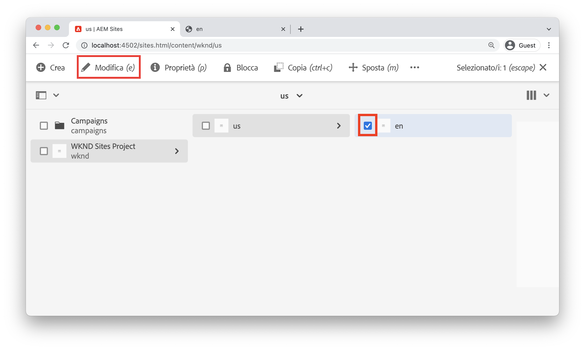
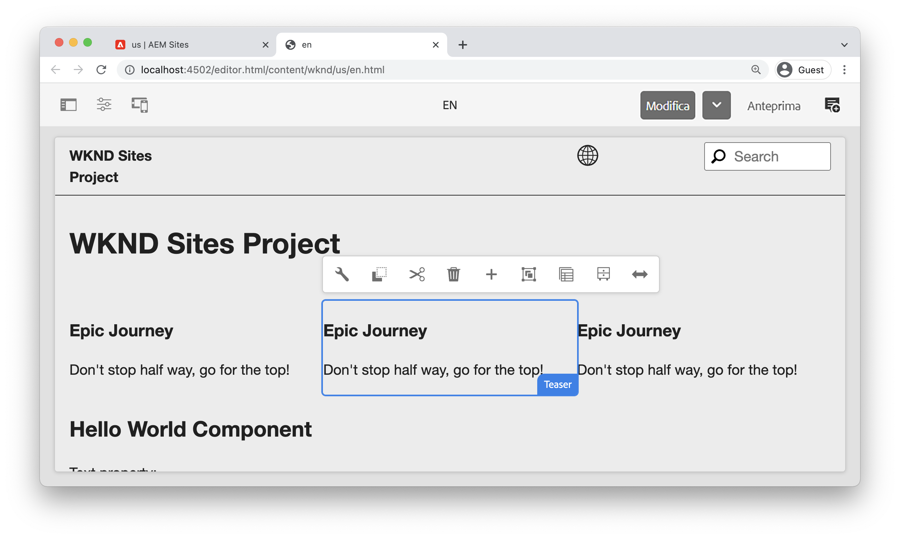
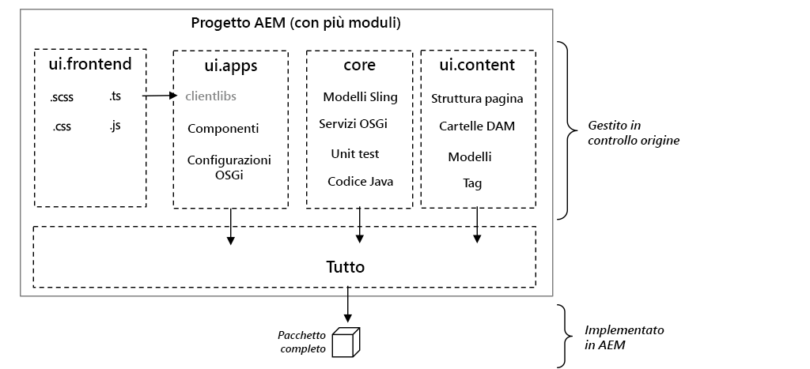
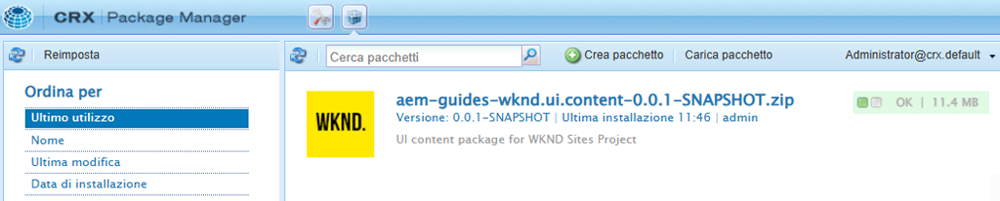

# Configurazione del progetto {#project-setup}

Questa esercitazione tratta la creazione di un progetto Maven con più moduli per gestire il codice e le configurazioni di un sito Adobe Experience Manager.

## Prerequisiti {#prerequisites}

Esaminare gli strumenti e le istruzioni necessari per l&#39;impostazione di un [ambiente di sviluppo locale](./overview.md#local-dev-environment). Assicurati di disporre di una nuova istanza di Adobe Experience Manager disponibile localmente e di non aver installato altri pacchetti campione/demo (diversi dai Service Pack richiesti).

## Obiettivo {#objective}

1. Scopri come generare un nuovo progetto AEM utilizzando un archetipo Maven.
1. Comprendi i diversi moduli generati dall’Archetipo di progetto AEM e come funzionano insieme.
1. Scopri in che modo i Componenti core AEM vengono inclusi in un progetto AEM.

## Cosa intendi creare {#what-build}

>[!VIDEO](https://video.tv.adobe.com/v/30152?quality=12&learn=on)

In questo capitolo, puoi generare un nuovo progetto Adobe Experience Manager utilizzando [Archetipo progetto AEM](https://github.com/adobe/aem-project-archetype). Il progetto AEM contiene il codice completo, il contenuto e le configurazioni utilizzati per un’implementazione di Sites. Il progetto generato in questo capitolo funge da base per un’implementazione del sito WKND e viene sviluppato nei capitoli futuri.

**Cos’è un progetto Maven?** - [Apache Maven](https://maven.apache.org/) è uno strumento di gestione del software per la creazione di progetti. *Tutti i Adobe Experience Manager* Le implementazioni di utilizzano i progetti Maven per generare, gestire e distribuire codice personalizzato oltre all’AEM.

**Che cos’è un archetipo Maven?** - A [Archetipo Maven](https://maven.apache.org/archetype/index.html) è un modello o un modello per la generazione di nuovi progetti. L’archetipo del progetto AEM consente di generare un nuovo progetto con uno spazio dei nomi personalizzato e include una struttura di progetto che segue le best practice, accelerando notevolmente lo sviluppo del progetto.

## Creare il progetto {#create}

Sono disponibili due opzioni per la creazione di un progetto Maven Multi-module per l’AEM. Questa esercitazione utilizza [Archetipo progetto AEM Maven **35**](https://github.com/adobe/aem-project-archetype). Anche Cloud Manager [fornisce una procedura guidata dell’interfaccia utente](https://experienceleague.adobe.com/docs/experience-manager-cloud-manager/content/getting-started/project-creation/using-the-wizard.html) avviare la creazione di un progetto di candidatura AEM. Il progetto sottostante generato dall’interfaccia utente di Cloud Manager ha la stessa struttura di quello che si ottiene utilizzando direttamente l’archetipo.

>[!NOTE]
>
>Questa esercitazione utilizza la versione **35** dell’archetipo. È sempre consigliabile utilizzare **più recente** versione dell’archetipo per generare un nuovo progetto.

La serie successiva di passaggi si svolgerà utilizzando un terminale della riga di comando basato su UNIX®, ma dovrebbe essere simile se si utilizza un terminale Windows.

1. Aprire un terminale della riga di comando. Verifica che Maven sia installato:

   ```shell
   $ mvn --version
   Apache Maven 3.6.2
   Maven home: /Library/apache-maven-3.6.2
   Java version: 11.0.4, vendor: Oracle Corporation, runtime: /Library/Java/JavaVirtualMachines/jdk-11.0.4.jdk/Contents/Home
   ```

1. Passa a una directory in cui desideri generare il progetto AEM. Può trattarsi di qualsiasi directory in cui desideri mantenere il codice sorgente del progetto. Ad esempio, una directory denominata `code` sotto la home directory dell’utente:

   ```shell
   $ cd ~/code
   ```

1. Incolla quanto segue nella riga di comando per [genera il progetto in modalità batch](https://maven.apache.org/archetype/maven-archetype-plugin/examples/generate-batch.html):

   ```shell
   mvn -B org.apache.maven.plugins:maven-archetype-plugin:3.2.1:generate \
       -D archetypeGroupId=com.adobe.aem \
       -D archetypeArtifactId=aem-project-archetype \
       -D archetypeVersion=39 \
       -D appTitle="WKND Sites Project" \
       -D appId="wknd" \
       -D groupId="com.adobe.aem.guides" \
       -D artifactId="aem-guides-wknd" \
       -D package="com.adobe.aem.guides.wknd" \
       -D version="0.0.1-SNAPSHOT" \
       -D aemVersion="cloud"
   ```

   >[!NOTE]
   >
   > Sostituire AEM 6.5.14+ `aemVersion="cloud"` con `aemVersion="6.5.14"`.
   >
   > Inoltre, utilizza sempre il più recente `archetypeVersion` facendo riferimento al [AEM Project Archetype > Utilizzo](https://github.com/adobe/aem-project-archetype#usage)

   Elenco completo delle proprietà disponibili per la configurazione di un progetto [si trova qui](https://github.com/adobe/aem-project-archetype#available-properties).

1. La seguente struttura di file e cartelle è generata dall’archetipo Maven sul file system locale:

   ```plain
    ~/code/
       |--- aem-guides-wknd/
           |--- all/
           |--- core/
           |--- ui.apps/
           |--- ui.apps.structure/
           |--- ui.config/
           |--- ui.content/
           |--- ui.frontend/
           |--- ui.tests /
           |--- it.tests/
           |--- dispatcher/
           |--- pom.xml
           |--- README.md
           |--- .gitignore
   ```

## Distribuire e generare il progetto {#build}

Genera e implementa il codice del progetto in un’istanza locale dell’AEM.

1. Verificare che un&#39;istanza di authoring dell&#39;AEM sia in esecuzione localmente sulla porta **4502**.
1. Dalla riga di comando, accedi a `aem-guides-wknd` directory del progetto.

   ```shell
   $ cd aem-guides-wknd
   ```

1. Esegui il comando seguente per generare e distribuire l’intero progetto a AEM:

   ```shell
   $ mvn clean install -PautoInstallSinglePackage
   ```

   La build dura circa un minuto e deve terminare con il seguente messaggio:

   ```
   ...
   [INFO] ------------------------------------------------------------------------
   [INFO] Reactor Summary for WKND Sites Project 0.0.1-SNAPSHOT:
   [INFO] 
   [INFO] WKND Sites Project ................................. SUCCESS [  0.113 s]
   [INFO] WKND Sites Project - Core .......................... SUCCESS [  3.136 s]
   [INFO] WKND Sites Project - UI Frontend ................... SUCCESS [  4.461 s]
   [INFO] WKND Sites Project - Repository Structure Package .. SUCCESS [  0.359 s]
   [INFO] WKND Sites Project - UI apps ....................... SUCCESS [  1.732 s]
   [INFO] WKND Sites Project - UI content .................... SUCCESS [  0.956 s]
   [INFO] WKND Sites Project - UI config ..................... SUCCESS [  0.064 s]
   [INFO] WKND Sites Project - All ........................... SUCCESS [  8.229 s]
   [INFO] WKND Sites Project - Integration Tests ............. SUCCESS [  3.329 s]
   [INFO] WKND Sites Project - Dispatcher .................... SUCCESS [  0.027 s]
   [INFO] WKND Sites Project - UI Tests ...................... SUCCESS [  0.032 s]
   [INFO] ------------------------------------------------------------------------
   [INFO] BUILD SUCCESS
   [INFO] ------------------------------------------------------------------------
   [INFO] Total time:  23.189 s
   [INFO] Finished at: 2023-01-10T11:12:23-05:00
   [INFO] ------------------------------------------------------------------------    
   ```

   Profilo Maven `autoInstallSinglePackage` compila i singoli moduli del progetto e distribuisce un singolo pacchetto all’istanza AEM. Per impostazione predefinita, questo pacchetto viene distribuito a un’istanza AEM in esecuzione localmente sulla porta **4502** e con le credenziali di `admin:admin`.

1. Passa a Gestione pacchetti nell’istanza AEM locale: [http://localhost:4502/crx/packmgr/index.jsp](http://localhost:4502/crx/packmgr/index.jsp). Dovresti visualizzare i pacchetti per `aem-guides-wknd.ui.apps`, `aem-guides-wknd.ui.config`, `aem-guides-wknd.ui.content`, e `aem-guides-wknd.all`.

1. Passa alla console Sites: [http://localhost:4502/sites.html/content](http://localhost:4502/sites.html/content). Il sito WKND è uno dei siti. Include una struttura del sito con una gerarchia Masters per Stati Uniti e Lingua. Questa gerarchia di siti si basa sui valori per `language_country` e `isSingleCountryWebsite` durante la generazione del progetto utilizzando l’archetipo.

1. Apri **STATI UNITI** `>` **Inglese** selezionando la pagina e facendo clic sul pulsante **Modifica** nella barra dei menu:

   

1. Il contenuto iniziale è già stato creato e sono disponibili diversi componenti da aggiungere a una pagina. Sperimenta questi componenti per un’idea delle funzionalità. Scopri le nozioni di base di un componente nel prossimo capitolo.

   

   *Contenuto di esempio generato dall’archetipo*

## Inspect il progetto {#project-structure}

Il progetto AEM generato è costituito da singoli moduli Maven, ciascuno con un ruolo diverso. Questo tutorial e la maggior parte degli sviluppi si concentrano su questi moduli:

* [core](https://experienceleague.adobe.com/docs/experience-manager-core-components/using/developing/archetype/core.html) - Codice Java, principalmente per sviluppatori back-end.
* [ui.frontend](https://experienceleague.adobe.com/docs/experience-manager-core-components/using/developing/archetype/uifrontend.html) : contiene il codice sorgente per CSS, JavaScript, Sass, TypeScript, principalmente per sviluppatori front-end.
* [ui.apps](https://experienceleague.adobe.com/docs/experience-manager-core-components/using/developing/archetype/uiapps.html) : contiene le definizioni di componenti e finestre di dialogo, incorpora CSS e JavaScript compilati come librerie client.
* [ui.content](https://experienceleague.adobe.com/docs/experience-manager-core-components/using/developing/archetype/uicontent.html) : contiene contenuti e configurazioni strutturali come modelli modificabili, schemi di metadati (/content, /conf).

* **tutto** : si tratta di un modulo Maven vuoto che combina i moduli di cui sopra in un singolo pacchetto che può essere distribuito in un ambiente AEM.



Consulta la [Documentazione di Archetipo progetto AEM](https://experienceleague.adobe.com/docs/experience-manager-core-components/using/developing/archetype/overview.html?lang=it) per ulteriori informazioni su **tutto** i moduli Maven.

### Inclusione di componenti core {#core-components}

[Componenti core AEM](https://experienceleague.adobe.com/docs/experience-manager-core-components/using/introduction.html?lang=it) sono un set di componenti WCM (Web Content Management) standardizzati per l’AEM. Questi componenti forniscono un set di base di una funzionalità e sono formattati, personalizzati ed estesi per singoli progetti.

L’ambiente AEM as a Cloud Service include la versione più recente di [Componenti core AEM](https://experienceleague.adobe.com/docs/experience-manager-core-components/using/introduction.html?lang=it). Pertanto i progetti generati per AEM as a Cloud Service fanno **non** includi un incorporamento dei Componenti core AEM.

Per i progetti generati da AEM 6.5/6.4, l’archetipo si incorpora automaticamente [Componenti core AEM](https://experienceleague.adobe.com/docs/experience-manager-core-components/using/introduction.html?lang=it) nel progetto. Per l’AEM 6.5/6.4 è consigliabile incorporare i componenti core AEM per garantire che venga distribuita con il progetto l’ultima versione. Ulteriori informazioni sulla modalità di utilizzo dei componenti core [incluso nel progetto, si trova qui](https://experienceleague.adobe.com/docs/experience-manager-core-components/using/developing/archetype/using.html#core-components).

## Gestione del controllo del codice sorgente {#source-control}

È sempre consigliabile utilizzare una forma di controllo del codice sorgente per gestire il codice nell&#39;applicazione. Questa esercitazione utilizza Git e GitHub. Esistono diversi file generati da Maven e/o dall’IDE di scelta che devono essere ignorati da SCM.

Maven crea una cartella di destinazione ogni volta che generi e installi il pacchetto di codice. La cartella e il contenuto di destinazione devono essere esclusi da SCM.

Alla voce, il `ui.apps` modulo osservano che molti `.content.xml` vengono creati file. Questi file XML associano i tipi di nodo e le proprietà del contenuto installato nel JCR. Questi file sono fondamentali e **non può** essere ignorato.

L’archetipo del progetto AEM genera un campione `.gitignore` file che può essere utilizzato come punto di partenza per il quale i file possono essere tranquillamente ignorati. Il file viene generato in `<src>/aem-guides-wknd/.gitignore`.

## Congratulazioni. {#congratulations}

Congratulazioni, hai creato il tuo primo progetto AEM!

### Passaggi successivi {#next-steps}

Comprendere la tecnologia di base di un componente Sites di Adobe Experience Manager (AEM) tramite una semplice `HelloWorld` esempio con [Nozioni di base sui componenti](component-basics.md) esercitazione.

## Comandi Maven avanzati (bonus) {#advanced-maven-commands}

Durante lo sviluppo, potresti lavorare con uno solo dei moduli e voler evitare di creare l’intero progetto per risparmiare tempo. È inoltre possibile distribuire direttamente a un&#39;istanza di pubblicazione AEM o a un&#39;istanza di AEM non in esecuzione sulla porta 4502.

Esaminiamo ora alcuni profili e comandi Maven aggiuntivi che puoi utilizzare per una maggiore flessibilità durante lo sviluppo.

### Modulo core {#core-module}

Il **[core](https://experienceleague.adobe.com/docs/experience-manager-core-components/using/developing/archetype/core.html)** Il modulo contiene tutto il codice Java™ associato al progetto. La build di **core** Il modulo distribuisce un bundle OSGi all’AEM. Per creare solo questo modulo:

1. Accedi a `core` cartella (sotto `aem-guides-wknd`):

   ```shell
   $ cd core/
   ```

1. Esegui il comando seguente:

   ```shell
   $ mvn clean install -PautoInstallBundle
   ...
   [INFO] --- sling-maven-plugin:2.4.0:install (install-bundle) @ aem-guides-wknd.core ---
   [INFO] Installing Bundle aem-guides-wknd.core(~/code/aem-guides-wknd/core/target/aem-guides-wknd.core-0.0.1-SNAPSHOT.jar) to http://localhost:4502/system/console via WebConsole
   [INFO] Bundle installed
   [INFO] ------------------------------------------------------------------------
   [INFO] BUILD SUCCESS
   [INFO] ------------------------------------------------------------------------
   [INFO] Total time:  8.558 s
   ```

1. Accedi a [http://localhost:4502/system/console/bundles](http://localhost:4502/system/console/bundles). Questa è la console web OSGi e contiene informazioni su tutti i bundle installati nell’istanza AEM.

1. Attiva/disattiva **ID** in base alla quale dovrebbe essere installato e attivo il bundle WKND.

   

1. Puoi vedere la posizione &quot;fisica&quot; del file jar in [CRXDE-Lite](http://localhost:4502/crx/de/index.jsp#/apps/wknd-packages/application/install/aem-guides-wknd.core-1.0.0-SNAPSHOT.jar):

   

### Moduli Ui.apps e Ui.content {#apps-content-module}

Il **[ui.apps](https://experienceleague.adobe.com/docs/experience-manager-core-components/using/developing/archetype/uiapps.html)** il modulo maven contiene tutto il codice di rendering necessario per il sito sotto `/apps`. Ciò include i file CSS/JS memorizzati in un formato AEM denominato [clientlibs](https://experienceleague.adobe.com/docs/experience-manager-65/developing/introduction/clientlibs.html?lang=it). Ciò include anche [HTL](https://experienceleague.adobe.com/docs/experience-manager-htl/content/overview.html?lang=it) script per il rendering di dynamic HTML. Puoi pensare al **ui.apps** modulo come mappa della struttura nel JCR, ma in un formato che può essere memorizzato in un file system e impegnato nel controllo del codice sorgente. Il **ui.apps** il modulo contiene solo codice.

Per creare solo questo modulo:

1. Dalla riga di comando. Accedi a `ui.apps` cartella (sotto `aem-guides-wknd`):

   ```shell
   $ cd ../ui.apps
   ```

1. Esegui il comando seguente:

   ```shell
   $ mvn clean install -PautoInstallPackage
   ...
   Package installed in 70ms.
   [INFO] ------------------------------------------------------------------------
   [INFO] BUILD SUCCESS
   [INFO] ------------------------------------------------------------------------
   [INFO] Total time:  2.987 s
   [INFO] Finished at: 2023-01-10T11:35:28-05:00
   [INFO] ------------------------------------------------------------------------
   ```

1. Accedi a [http://localhost:4502/crx/packmgr/index.jsp](http://localhost:4502/crx/packmgr/index.jsp). Dovresti visualizzare `ui.apps` come primo pacchetto installato e deve avere una marca temporale più recente di qualsiasi altro pacchetto.

   

1. Torna alla riga di comando ed esegui il comando seguente (all&#39;interno del `ui.apps` cartella ):

   ```shell
   $ mvn -PautoInstallPackagePublish clean install
   ...
   [INFO] --- content-package-maven-plugin:1.0.2:install (install-package-publish) @ aem-guides-wknd.ui.apps ---
   [INFO] Installing aem-guides-wknd.ui.apps (/Users/sachinmali/Desktop/code/wknd-tutorial/aem-guides-wknd/ui.apps/target/aem-guides-wknd.ui.apps-0.0.1-SNAPSHOT.zip) to http://localhost:4503/crx/packmgr/service.jsp
   [INFO] I/O exception (java.net.ConnectException) caught when processing request: Connection refused (Connection refused)
   [INFO] Retrying request
   [INFO] I/O exception (java.net.ConnectException) caught when processing request: Connection refused (Connection refused)
   [INFO] Retrying request
   [INFO] I/O exception (java.net.ConnectException) caught when processing request: Connection refused (Connection refused)
   [INFO] Retrying request
   [INFO] ------------------------------------------------------------------------
   [INFO] BUILD FAILURE
   [INFO] ------------------------------------------------------------------------
   [INFO] Total time:  2.812 s
   [INFO] Finished at: 2023-01-10T11:37:28-05:00
   [INFO] ------------------------------------------------------------------------
   [ERROR] Failed to execute goal com.day.jcr.vault:content-package-maven-plugin:1.0.2:install (install-package-publish) on project aem-guides-wknd.ui.apps: Connection refused (Connection refused) -> [Help 1]
   ```

   Il profilo `autoInstallPackagePublish` deve distribuire il pacchetto in un ambiente di pubblicazione in esecuzione sulla porta **4503**. L’errore precedente è previsto se non è possibile trovare un’istanza AEM in esecuzione su http://localhost:4503.

1. Infine, esegui il seguente comando per distribuire `ui.apps` pacchetto sulla porta **4504**:

   ```shell
   $ mvn -PautoInstallPackage clean install -Daem.port=4504
   ...
   [INFO] --- content-package-maven-plugin:1.0.2:install (install-package) @ aem-guides-wknd.ui.apps ---
   [INFO] Installing aem-guides-wknd.ui.apps (/Users/dgordon/code/aem-guides-wknd/ui.apps/target/aem-guides-wknd.ui.apps-0.0.1-SNAPSHOT.zip) to http://localhost:4504/crx/packmgr/service.jsp
   [INFO] I/O exception (java.net.ConnectException) caught when processing request: Connection refused (Connection refused)
   [INFO] Retrying request
   [INFO] I/O exception (java.net.ConnectException) caught when processing request: Connection refused (Connection refused)
   [INFO] Retrying request
   [INFO] I/O exception (java.net.ConnectException) caught when processing request: Connection refused (Connection refused)
   [INFO] Retrying request
   [INFO] ------------------------------------------------------------------------
   [INFO] BUILD FAILURE
   [INFO] --------------------------------------------------------------------
   ```

   Anche in questo caso, se sulla porta non è in esecuzione alcuna istanza AEM, è previsto un errore di compilazione **4504** è disponibile. Il parametro `aem.port` è definito nel file POM in `aem-guides-wknd/pom.xml`.

Il **[ui.content](https://experienceleague.adobe.com/docs/experience-manager-core-components/using/developing/archetype/uicontent.html)** è strutturato nello stesso modo del modulo **ui.apps** modulo. L&#39;unica differenza è che **ui.content** il modulo contiene il cosiddetto **mutabile** contenuto. **Mutabile** il contenuto si riferisce essenzialmente a configurazioni non di codice come Modelli, Criteri o strutture di cartelle memorizzate nel controllo del codice sorgente **ma** può essere modificato direttamente su un’istanza AEM. Questo argomento è trattato più dettagliatamente nel capitolo Pagine e modelli.

Gli stessi comandi Maven utilizzati per generare il **ui.apps** può essere utilizzato per generare il **ui.content** modulo. Puoi ripetere i passaggi precedenti dall’interno di **ui.content** cartella.

## Risoluzione dei problemi

In caso di problemi durante la generazione del progetto utilizzando l’archetipo di progetto AEM, consulta l’elenco di [problemi noti](https://github.com/adobe/aem-project-archetype#known-issues) e l’elenco dei messaggi aperti [problemi](https://github.com/adobe/aem-project-archetype/issues).

## Congratulazioni di nuovo! {#congratulations-bonus}

Congratulazioni, per aver passato attraverso il materiale bonus.

### Passaggi successivi {#next-steps-bonus}

Comprendere la tecnologia di base di un componente Sites di Adobe Experience Manager (AEM) tramite una semplice `HelloWorld` esempio con [Nozioni di base sui componenti](component-basics.md) esercitazione.
