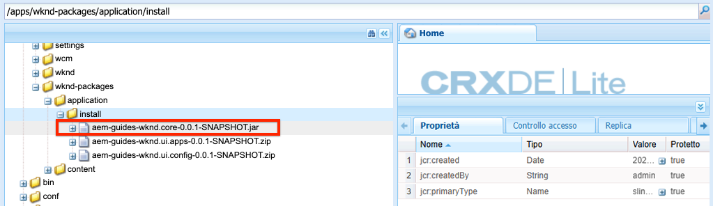

# Configurazione del progetto {#project-setup}

Questa esercitazione descrive la creazione di un progetto Maven Multi Module per gestire il codice e le configurazioni per un sito Adobe Experience Manager.

## Prerequisiti {#prerequisites}

Rivedere gli strumenti e le istruzioni necessari per la configurazione di un [ambiente di sviluppo locale](./overview.md#local-dev-environment). Assicurati di disporre di una nuova istanza di Adobe Experience Manager disponibile localmente e che non siano stati installati pacchetti di esempio/demo aggiuntivi (diversi dai Service Pack richiesti).

## Obiettivo {#objective}

1. Scopri come generare un nuovo progetto AEM utilizzando un archetipo Maven.
1. Scopri i diversi moduli generati dall’Archetipo di progetto AEM e come funzionano insieme.
1. Scopri come AEM componenti core sono inclusi in un progetto AEM.

## Cosa verrà creato {#what-build}

>[!VIDEO](https://video.tv.adobe.com/v/30152/?quality=12&learn=on)

In questo capitolo, puoi generare un nuovo progetto Adobe Experience Manager utilizzando [Archetipo di progetto AEM](https://github.com/adobe/aem-project-archetype). Il progetto AEM contiene codice completo, contenuti e configurazioni utilizzati per l’implementazione di Sites. Il progetto generato in questo capitolo funge da base per l’implementazione del sito WKND e si basa su capitoli futuri.

**Cos&#39;è un progetto Maven?** - [Apache Maven](https://maven.apache.org/) è uno strumento di gestione software per la creazione di progetti. *Tutte le Adobe Experience Manager* le implementazioni utilizzano i progetti Maven per generare, gestire e distribuire codice personalizzato in cima alle AEM.

**Cos&#39;è un archetipo Maven?** - A [Archetipo Maven](https://maven.apache.org/archetype/index.html) è un modello o un pattern per la generazione di nuovi progetti. L’archetipo AEM progetto consente di generare un nuovo progetto con uno spazio dei nomi personalizzato e di includere una struttura di progetto che segue le best practice, accelerando notevolmente lo sviluppo del progetto.

## Crea il progetto {#create}

Sono disponibili due opzioni per la creazione di un progetto Maven Multi-Module per AEM. Questa esercitazione utilizza la funzione [Archetipo AEM progetto Maven **35**](https://github.com/adobe/aem-project-archetype). Anche Cloud Manager [fornisce una procedura guidata di interfaccia utente](https://experienceleague.adobe.com/docs/experience-manager-cloud-manager/content/getting-started/project-creation/using-the-wizard.html) avviare la creazione di un progetto di applicazione AEM. Il progetto sottostante generato dall’interfaccia utente di Cloud Manager si traduce nella stessa struttura dell’utilizzo diretto dell’archetipo.

>[!NOTE]
>
>Questa esercitazione utilizza la versione **35** dell&#39;archetipo. È sempre consigliabile utilizzare le **più recente** versione dell’archetipo per generare un nuovo progetto.

La serie successiva di passaggi verrà eseguita utilizzando un terminale a riga di comando basato su UNIX®, ma dovrebbe essere simile se si utilizza un terminale Windows.

1. Aprire un terminale a riga di comando. Verifica che Maven sia installato:

   ```shell
   $ mvn --version
   Apache Maven 3.6.2
   Maven home: /Library/apache-maven-3.6.2
   Java version: 11.0.4, vendor: Oracle Corporation, runtime: /Library/Java/JavaVirtualMachines/jdk-11.0.4.jdk/Contents/Home
   ```

1. Passa a una directory in cui desideri generare il progetto AEM. Può trattarsi di qualsiasi directory in cui si desidera mantenere il codice sorgente del progetto. Ad esempio, una directory denominata `code` sotto la home directory dell&#39;utente:

   ```shell
   $ cd ~/code
   ```

1. Incolla quanto segue nella riga di comando in [genera il progetto in modalità batch](https://maven.apache.org/archetype/maven-archetype-plugin/examples/generate-batch.html):

   ```shell
   mvn -B org.apache.maven.plugins:maven-archetype-plugin:3.2.1:generate \
       -D archetypeGroupId=com.adobe.aem \
       -D archetypeArtifactId=aem-project-archetype \
       -D archetypeVersion=39 \
       -D appTitle="WKND Sites Project" \
       -D appId="wknd" \
       -D groupId="com.adobe.aem.guides" \
       -D artifactId="aem-guides-wknd" \
       -D package="com.adobe.aem.guides.wknd" \
       -D version="0.0.1-SNAPSHOT" \
       -D aemVersion="cloud"
   ```

   >[!NOTE]
   >
   > Per eseguire il targeting AEM 6.5.14+ sostituire `aemVersion="cloud"` con `aemVersion="6.5.14"`.

   Elenco completo delle proprietà disponibili per la configurazione di un progetto [si trova qui](https://github.com/adobe/aem-project-archetype#available-properties).

1. La seguente struttura di file e cartelle viene generata dall&#39;archetipo Maven sul file system locale:

   ```plain
    ~/code/
       |--- aem-guides-wknd/
           |--- all/
           |--- core/
           |--- ui.apps/
           |--- ui.apps.structure/
           |--- ui.config/
           |--- ui.content/
           |--- ui.frontend/
           |--- ui.tests /
           |--- it.tests/
           |--- dispatcher/
           |--- pom.xml
           |--- README.md
           |--- .gitignore
   ```

## Distribuzione e creazione del progetto {#build}

Crea e distribuisci il codice del progetto in un&#39;istanza locale di AEM.

1. Assicurati di avere un&#39;istanza dell&#39;autore AEM in esecuzione localmente sulla porta **4502**.
1. Dalla riga di comando, passa alla `aem-guides-wknd` directory di progetto.

   ```shell
   $ cd aem-guides-wknd
   ```

1. Esegui il comando seguente per generare e distribuire l’intero progetto in AEM:

   ```shell
   $ mvn clean install -PautoInstallSinglePackage
   ```

   La build richiede circa un minuto e deve terminare con il seguente messaggio:

   ```
   ...
   [INFO] ------------------------------------------------------------------------
   [INFO] Reactor Summary for WKND Sites Project 0.0.1-SNAPSHOT:
   [INFO] 
   [INFO] WKND Sites Project ................................. SUCCESS [  0.113 s]
   [INFO] WKND Sites Project - Core .......................... SUCCESS [  3.136 s]
   [INFO] WKND Sites Project - UI Frontend ................... SUCCESS [  4.461 s]
   [INFO] WKND Sites Project - Repository Structure Package .. SUCCESS [  0.359 s]
   [INFO] WKND Sites Project - UI apps ....................... SUCCESS [  1.732 s]
   [INFO] WKND Sites Project - UI content .................... SUCCESS [  0.956 s]
   [INFO] WKND Sites Project - UI config ..................... SUCCESS [  0.064 s]
   [INFO] WKND Sites Project - All ........................... SUCCESS [  8.229 s]
   [INFO] WKND Sites Project - Integration Tests ............. SUCCESS [  3.329 s]
   [INFO] WKND Sites Project - Dispatcher .................... SUCCESS [  0.027 s]
   [INFO] WKND Sites Project - UI Tests ...................... SUCCESS [  0.032 s]
   [INFO] ------------------------------------------------------------------------
   [INFO] BUILD SUCCESS
   [INFO] ------------------------------------------------------------------------
   [INFO] Total time:  23.189 s
   [INFO] Finished at: 2023-01-10T11:12:23-05:00
   [INFO] ------------------------------------------------------------------------    
   ```

   Il profilo Maven `autoInstallSinglePackage` compila i singoli moduli del progetto e distribuisce un singolo pacchetto all’istanza AEM. Per impostazione predefinita questo pacchetto viene distribuito a un&#39;istanza AEM in esecuzione localmente sulla porta **4502** e con le credenziali di `admin:admin`.

1. Passa a Gestione pacchetti nell&#39;istanza AEM locale: [http://localhost:4502/crx/packmgr/index.jsp](http://localhost:4502/crx/packmgr/index.jsp). Dovresti visualizzare i pacchetti per `aem-guides-wknd.ui.apps`, `aem-guides-wknd.ui.config`, `aem-guides-wknd.ui.content`e `aem-guides-wknd.all`.

1. Passa alla console Sites : [http://localhost:4502/sites.html/content](http://localhost:4502/sites.html/content). Il sito WKND è uno dei siti. Include una struttura del sito con una gerarchia di master lingua e Stati Uniti. Questa gerarchia del sito è basata sui valori per `language_country` e `isSingleCountryWebsite` durante la generazione del progetto utilizzando l’archetipo .

1. Apri **US** `>` **Inglese** selezionando la pagina e facendo clic sul pulsante **Modifica** nella barra dei menu:

   

1. Il contenuto iniziale è già stato creato e diversi componenti possono essere aggiunti a una pagina. Sperimenta con questi componenti per avere un&#39;idea della funzionalità. Scoprirai le nozioni di base di un componente nel capitolo successivo.

   

   *Contenuto di esempio generato dall’Archetype*

## Inspect il progetto {#project-structure}

Il progetto AEM generato è costituito da singoli moduli Maven, ciascuno con un ruolo diverso. Questa esercitazione e la maggior parte dello sviluppo si concentrano su questi moduli:

* [nucleo centrale](https://experienceleague.adobe.com/docs/experience-manager-core-components/using/developing/archetype/core.html) - Java Code, principalmente sviluppatori back-end.
* [ui.frontend](https://experienceleague.adobe.com/docs/experience-manager-core-components/using/developing/archetype/uifrontend.html) - Contiene il codice sorgente per CSS, JavaScript, Sass, TypeScript, principalmente per sviluppatori front-end.
* [ui.apps](https://experienceleague.adobe.com/docs/experience-manager-core-components/using/developing/archetype/uiapps.html) - Contiene le definizioni dei componenti e delle finestre di dialogo, incorpora CSS e JavaScript compilati come librerie client.
* [ui.content](https://experienceleague.adobe.com/docs/experience-manager-core-components/using/developing/archetype/uicontent.html) - contiene contenuti strutturali e configurazioni come modelli modificabili, schemi di metadati (/content, /conf).

* **tutto** - modulo Maven vuoto che combina i moduli di cui sopra in un unico pacchetto che può essere distribuito in un ambiente AEM.


Consulta la sezione [Documentazione AEM Project Archetype](https://experienceleague.adobe.com/docs/experience-manager-core-components/using/developing/archetype/overview.html?lang=it) per ulteriori informazioni su **tutto** i moduli Maven.

### Inclusione dei componenti core {#core-components}

[Componenti core AEM](https://experienceleague.adobe.com/docs/experience-manager-core-components/using/introduction.html?lang=it) sono un set di componenti WCM (Web Content Management) standardizzati per AEM. Questi componenti forniscono un set di riferimento di una funzionalità e sono formattati, personalizzati ed estesi per singoli progetti.

AEM ambiente as a Cloud Service include la versione più recente di [Componenti core AEM](https://experienceleague.adobe.com/docs/experience-manager-core-components/using/introduction.html?lang=it). Pertanto, i progetti generati per AEM as a Cloud Service **not** includi un incorporamento AEM componenti core.

Per i progetti generati AEM 6.5/6.4, l’archetipo si incorpora automaticamente [Componenti core AEM](https://experienceleague.adobe.com/docs/experience-manager-core-components/using/introduction.html?lang=it) nel progetto. È consigliabile incorporare AEM 6.5/6.4 AEM componenti core per garantire che la versione più recente venga distribuita con il progetto. Ulteriori informazioni sul modo in cui i componenti core sono [incluso nel progetto si trova qui](https://experienceleague.adobe.com/docs/experience-manager-core-components/using/developing/archetype/using.html#core-components).

## Gestione del controllo del codice sorgente {#source-control}

È sempre consigliabile utilizzare una qualche forma di controllo del codice sorgente per gestire il codice nell’applicazione. Questa esercitazione utilizza Git e GitHub. Ci sono diversi file che vengono generati da Maven e/o dall’IDE che sceglie e che devono essere ignorati da SCM.

Maven crea una cartella di destinazione ogni volta che crei e installi il pacchetto di codice. La cartella e il contenuto di destinazione devono essere esclusi da SCM.

Sotto, il `ui.apps` modulo osservare che molti `.content.xml` i file vengono creati. Questi file XML mappano i tipi di nodo e le proprietà del contenuto installato nel JCR. Questi file sono critici e **impossibile** da ignorare.

L’archetipo del progetto AEM genera un campione `.gitignore` file che può essere utilizzato come punto di partenza per cui i file possono essere tranquillamente ignorati. Il file viene generato in `<src>/aem-guides-wknd/.gitignore`.

## Congratulazioni.  {#congratulations}

Congratulazioni, hai creato il tuo primo progetto AEM!

### Passaggi successivi {#next-steps}

Comprendere la tecnologia di base di un componente Adobe Experience Manager (AEM) Sites tramite un semplice `HelloWorld` esempio con [Nozioni di base sui componenti](component-basics.md) esercitazione.

## Comandi Maven avanzati (Bonus) {#advanced-maven-commands}

Durante lo sviluppo, potresti lavorare con uno solo dei moduli e voler evitare di costruire l&#39;intero progetto per risparmiare tempo. Puoi anche implementare direttamente in un’istanza di AEM Publish o forse in un’istanza di AEM non in esecuzione sulla porta 4502.

Ora esaminiamo alcuni profili e comandi Maven aggiuntivi che puoi utilizzare per una maggiore flessibilità durante lo sviluppo.

### Modulo core {#core-module}

La **[nucleo centrale](https://experienceleague.adobe.com/docs/experience-manager-core-components/using/developing/archetype/core.html)** Il modulo contiene tutto il codice Java™ associato al progetto. La costruzione di **nucleo centrale** Il modulo distribuisce un bundle OSGi a AEM. Per creare solo questo modulo:

1. Passa a `core` cartella (sotto `aem-guides-wknd`):

   ```shell
   $ cd core/
   ```

1. Esegui il comando seguente:

   ```shell
   $ mvn clean install -PautoInstallBundle
   ...
   [INFO] --- sling-maven-plugin:2.4.0:install (install-bundle) @ aem-guides-wknd.core ---
   [INFO] Installing Bundle aem-guides-wknd.core(~/code/aem-guides-wknd/core/target/aem-guides-wknd.core-0.0.1-SNAPSHOT.jar) to http://localhost:4502/system/console via WebConsole
   [INFO] Bundle installed
   [INFO] ------------------------------------------------------------------------
   [INFO] BUILD SUCCESS
   [INFO] ------------------------------------------------------------------------
   [INFO] Total time:  8.558 s
   ```

1. Passa a [http://localhost:4502/system/console/bundles](http://localhost:4502/system/console/bundles). Questa è la console Web OSGi e contiene informazioni su tutti i bundle installati nell&#39;istanza AEM.

1. Attiva/disattiva la **Id** ordina la colonna e dovresti vedere il bundle WKND installato e attivo.

   

1. Puoi vedere la posizione &#39;fisica&#39; del vaso in [CRXDE-Lite](http://localhost:4502/crx/de/index.jsp#/apps/wknd-packages/application/install/aem-guides-wknd.core-1.0.0-SNAPSHOT.jar):

   

### Moduli Ui.apps e Ui.content {#apps-content-module}

La **[ui.apps](https://experienceleague.adobe.com/docs/experience-manager-core-components/using/developing/archetype/uiapps.html)** Il modulo maven contiene tutto il codice di rendering necessario per il sito sottostante `/apps`. Ciò include CSS/JS memorizzati in un formato AEM denominato [clientlibs](https://experienceleague.adobe.com/docs/experience-manager-65/developing/introduction/clientlibs.html?lang=it). Ciò include anche [HTL](https://experienceleague.adobe.com/docs/experience-manager-htl/content/overview.html) script per il rendering di HTML dinamici. Potete pensare al **ui.apps** modulo come mappa della struttura nel JCR ma in un formato che può essere memorizzato in un file system e impegnato nel controllo del codice sorgente. La **ui.apps** Il modulo contiene solo codice.

Per creare solo questo modulo:

1. Dalla riga di comando. Passa a `ui.apps` cartella (sotto `aem-guides-wknd`):

   ```shell
   $ cd ../ui.apps
   ```

1. Esegui il comando seguente:

   ```shell
   $ mvn clean install -PautoInstallPackage
   ...
   Package installed in 70ms.
   [INFO] ------------------------------------------------------------------------
   [INFO] BUILD SUCCESS
   [INFO] ------------------------------------------------------------------------
   [INFO] Total time:  2.987 s
   [INFO] Finished at: 2023-01-10T11:35:28-05:00
   [INFO] ------------------------------------------------------------------------
   ```

1. Passa a [http://localhost:4502/crx/packmgr/index.jsp](http://localhost:4502/crx/packmgr/index.jsp). Dovresti vedere la `ui.apps` come primo pacchetto installato e dovrebbe avere una marca temporale più recente di qualsiasi altro pacchetto.

   

1. Torna alla riga di comando ed esegui il seguente comando (all&#39;interno del `ui.apps` cartella):

   ```shell
   $ mvn -PautoInstallPackagePublish clean install
   ...
   [INFO] --- content-package-maven-plugin:1.0.2:install (install-package-publish) @ aem-guides-wknd.ui.apps ---
   [INFO] Installing aem-guides-wknd.ui.apps (/Users/sachinmali/Desktop/code/wknd-tutorial/aem-guides-wknd/ui.apps/target/aem-guides-wknd.ui.apps-0.0.1-SNAPSHOT.zip) to http://localhost:4503/crx/packmgr/service.jsp
   [INFO] I/O exception (java.net.ConnectException) caught when processing request: Connection refused (Connection refused)
   [INFO] Retrying request
   [INFO] I/O exception (java.net.ConnectException) caught when processing request: Connection refused (Connection refused)
   [INFO] Retrying request
   [INFO] I/O exception (java.net.ConnectException) caught when processing request: Connection refused (Connection refused)
   [INFO] Retrying request
   [INFO] ------------------------------------------------------------------------
   [INFO] BUILD FAILURE
   [INFO] ------------------------------------------------------------------------
   [INFO] Total time:  2.812 s
   [INFO] Finished at: 2023-01-10T11:37:28-05:00
   [INFO] ------------------------------------------------------------------------
   [ERROR] Failed to execute goal com.day.jcr.vault:content-package-maven-plugin:1.0.2:install (install-package-publish) on project aem-guides-wknd.ui.apps: Connection refused (Connection refused) -> [Help 1]
   ```

   Il profilo `autoInstallPackagePublish` è destinato a distribuire il pacchetto in un ambiente Publish in esecuzione sulla porta **4503**. L&#39;errore precedente è previsto se non è possibile trovare un&#39;istanza AEM in esecuzione su http://localhost:4503.

1. Esegui infine il seguente comando per distribuire il `ui.apps` pacchetto sulla porta **4504**:

   ```shell
   $ mvn -PautoInstallPackage clean install -Daem.port=4504
   ...
   [INFO] --- content-package-maven-plugin:1.0.2:install (install-package) @ aem-guides-wknd.ui.apps ---
   [INFO] Installing aem-guides-wknd.ui.apps (/Users/dgordon/code/aem-guides-wknd/ui.apps/target/aem-guides-wknd.ui.apps-0.0.1-SNAPSHOT.zip) to http://localhost:4504/crx/packmgr/service.jsp
   [INFO] I/O exception (java.net.ConnectException) caught when processing request: Connection refused (Connection refused)
   [INFO] Retrying request
   [INFO] I/O exception (java.net.ConnectException) caught when processing request: Connection refused (Connection refused)
   [INFO] Retrying request
   [INFO] I/O exception (java.net.ConnectException) caught when processing request: Connection refused (Connection refused)
   [INFO] Retrying request
   [INFO] ------------------------------------------------------------------------
   [INFO] BUILD FAILURE
   [INFO] --------------------------------------------------------------------
   ```

   Si prevede nuovamente un errore di compilazione se non è in esecuzione un&#39;istanza AEM sulla porta **4504** è disponibile. Il parametro `aem.port` è definito nel file POM in `aem-guides-wknd/pom.xml`.

La **[ui.content](https://experienceleague.adobe.com/docs/experience-manager-core-components/using/developing/archetype/uicontent.html)** il modulo è strutturato come il **ui.apps** modulo . L&#39;unica differenza è che la **ui.content** il modulo contiene ciò che viene chiamato **mutabile** contenuto. **Variabile** il contenuto si riferisce essenzialmente a configurazioni non di codice come Modelli, Criteri o strutture di cartelle memorizzate nel controllo del codice sorgente **ma** potrebbero essere modificati direttamente in un’istanza AEM. Questo argomento viene descritto più dettagliatamente nel capitolo Pagine e Modelli .

Gli stessi comandi Maven utilizzati per generare il **ui.apps** il modulo può essere utilizzato per creare **ui.content** modulo . Sentiti libero di ripetere i passaggi precedenti dall&#39;interno **ui.content** cartella.

## Risoluzione dei problemi

Se si verifica un problema durante la generazione del progetto utilizzando AEM Project Archetype, consulta l’elenco di [problemi noti](https://github.com/adobe/aem-project-archetype#known-issues) e l&#39;elenco dei [questioni](https://github.com/adobe/aem-project-archetype/issues).

## Congratulazioni ancora! {#congratulations-bonus}

Congratulazioni, per aver passato il materiale bonus.

### Passaggi successivi {#next-steps-bonus}

Comprendere la tecnologia di base di un componente Adobe Experience Manager (AEM) Sites tramite un semplice `HelloWorld` esempio con [Nozioni di base sui componenti](component-basics.md) esercitazione.
