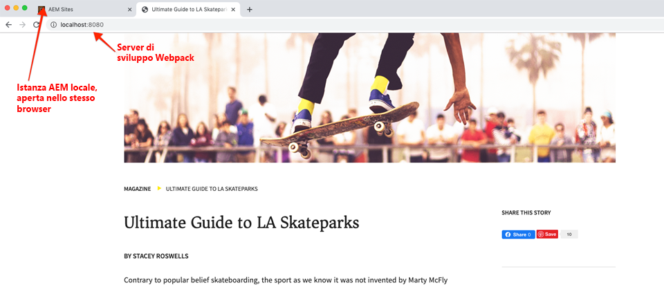
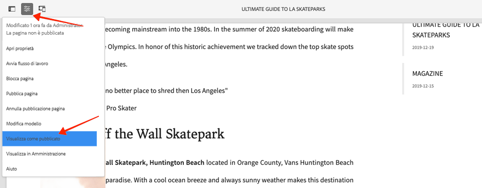

# Sviluppo con il sistema di stili {#developing-with-the-style-system}

Scopri come implementare singoli stili e riutilizzare i componenti core utilizzando il sistema di stili di Experience Manager. Questa esercitazione illustra lo sviluppo per il sistema di stili per estendere i componenti core con CSS specifici per il brand e configurazioni avanzate di criteri nell’Editor modelli.

## Prerequisiti {#prerequisites}

Rivedi gli strumenti e le istruzioni necessari per configurare un [ambiente di sviluppo locale](overview.md#local-dev-environment).

Si consiglia inoltre di rivedere l&#39;esercitazione [Librerie lato client e Flusso di lavoro front-end](client-side-libraries.md) per comprendere i fondamenti delle librerie lato client e i vari strumenti front-end incorporati nel progetto AEM.

### Progetto iniziale

>[!NOTE]
>
> Se hai completato con successo il capitolo precedente, puoi riutilizzare il progetto e saltare i passaggi per il check-out del progetto iniziale.

Controlla il codice della riga di base su cui si basa l&#39;esercitazione:

1. Estrai il ramo `tutorial/style-system-start` da [GitHub](https://github.com/adobe/aem-guides-wknd)

   ```shell
   $ cd aem-guides-wknd
   $ git checkout tutorial/style-system-start
   ```

1. Distribuisci la base di codice in un&#39;istanza AEM locale utilizzando le tue competenze Maven:

   ```shell
   $ mvn clean install -PautoInstallSinglePackage
   ```

   >[!NOTE]
   >
   > Se utilizzi AEM 6.5 o 6.4, aggiungi il profilo `classic` a qualsiasi comando Maven.

   ```shell
   $ mvn clean install -PautoInstallSinglePackage -Pclassic
   ```

Puoi sempre visualizzare il codice finito su [GitHub](https://github.com/adobe/aem-guides-wknd/tree/tutorial/style-system-solution) o estrarre il codice localmente passando al ramo `tutorial/style-system-solution`.

## Obiettivo

1. Scopri come utilizzare il sistema di stili per applicare CSS specifici per il brand a AEM componenti core.
1. Scopri la notazione BEM e come utilizzarla per definire con attenzione gli stili.
1. Applicare configurazioni di criteri avanzate con Modelli modificabili.

## Cosa verrà creato {#what-you-will-build}

In questo capitolo utilizzeremo la funzione [Sistema di stili](https://experienceleague.adobe.com/docs/experience-manager-learn/sites/page-authoring/style-system-feature-video-use.html) per creare varianti dei componenti **Titolo** e **Testo** utilizzati nella pagina Articolo.


*Stile sottolineatura disponibile per il componente Titolo*

## Sfondo {#background}

Il [Sistema di stili](https://experienceleague.adobe.com/docs/experience-manager-65/authoring/siteandpage/style-system.html) consente agli sviluppatori e agli editor di modelli di creare più varianti visive di un componente. Gli autori possono quindi a loro volta decidere quale stile utilizzare per la composizione di una pagina. Nel resto dell’esercitazione, sfrutteremo il sistema di stili per ottenere diversi stili univoci, sfruttando al contempo i componenti core in un approccio a basso codice.

L’idea generale del sistema di stili è che gli autori possono scegliere vari stili per l’aspetto di un componente. Gli &quot;stili&quot; sono supportati da classi CSS aggiuntive inserite nel div esterno di un componente. Nelle librerie client le regole CSS vengono aggiunte in base a queste classi di stile in modo che il componente cambi aspetto.

È possibile trovare la [documentazione dettagliata per Sistema di stili qui](https://experienceleague.adobe.com/docs/experience-manager-cloud-service/sites/authoring/features/style-system.html). C&#39;è anche un ottimo video tecnico [per comprendere il sistema di stili](https://experienceleague.adobe.com/docs/experience-manager-learn/sites/developing/style-system-technical-video-understand.html).

## Stile sottolineatura - Titolo {#underline-style}

Il [Componente titolo](https://experienceleague.adobe.com/docs/experience-manager-core-components/using/components/title.html) è stato aggiunto come proxy al progetto in `/apps/wknd/components/title` come parte del modulo **ui.apps** . Gli stili predefiniti degli elementi Intestazione (`H1`, `H2`, `H3`...) sono già stati implementati nel modulo **ui.frontend** .

Le [progettazioni di articoli WKND](assets/pages-templates/wknd-article-design.xd) contengono uno stile univoco per il componente Titolo con una sottolineatura. Invece di creare due componenti o modificare la finestra di dialogo del componente, il sistema di stili può essere utilizzato per consentire agli autori di aggiungere uno stile sottolineato.


### Marcatura titolo Inspect

In qualità di sviluppatore front-end, il primo passo per definire lo stile di un componente core consiste nel comprendere il markup generato dal componente.

1. Apri un nuovo browser e visualizza il componente Titolo sul sito della libreria dei componenti core AEM : [https://www.aemcomponents.dev/content/core-components-examples/library/page-authoring/title.html](https://www.aemcomponents.dev/content/core-components-examples/library/page-authoring/title.html)

1. Di seguito è riportata la marcatura per il componente Titolo:

   ```html
   <div class="cmp-title">
       <h1 class="cmp-title__text">Lorem Ipsum</h1>
   </div>
   ```

   Notazione BEM del componente Titolo:

   ```plain
   BLOCK cmp-title
       ELEMENT cmp-title__text
   ```

1. Il sistema di stili aggiunge una classe CSS al div esterno che circonda il componente. Pertanto, il markup a cui destineremo avrà un aspetto simile al seguente:

   ```html
   <div class="STYLE-SYSTEM-CLASS-HERE"> <!-- Custom CSS class - implementation gets to define this -->
       <div class="cmp-title">
           <h1 class="cmp-title__text">Lorem Ipsum</h1>
       </div>
   </div>
   ```

### Implementa lo stile di sottolineatura - ui.frontend

Quindi, implementa lo stile Sottolineato utilizzando il modulo **ui.frontend** del nostro progetto. Useremo il server di sviluppo del webpack fornito in bundle con il modulo **ui.frontend** per visualizzare in anteprima gli stili *prima* della distribuzione in un&#39;istanza locale di AEM.

1. Avviare il server di sviluppo del webpack eseguendo il seguente comando dall&#39;interno del modulo **ui.frontend** :

   ```shell
   $ cd ~/code/aem-guides-wknd/ui.frontend/
   $ npm start
   
   > aem-maven-archetype@1.0.0 start code/aem-guides-wknd/ui.frontend
   > webpack-dev-server --open --config ./webpack.dev.js
   ```

   Questo dovrebbe aprire un browser all&#39;indirizzo [http://localhost:8080](Http://localhost:8080).

   >[!NOTE]
   >
   > Se le immagini appaiono interrotte, assicurati che il progetto iniziale sia stato distribuito a un&#39;istanza locale di AEM (in esecuzione sulla porta 4502) e che il browser utilizzato abbia effettuato l&#39;accesso anche all&#39;istanza AEM locale.

   

1. Nell’IDE apri il file `index.html` che si trova in: `ui.frontend/src/main/webpack/static/index.html`. Si tratta del markup statico utilizzato dal server di sviluppo del webpack.
1. In `index.html` trovare un&#39;istanza del componente Titolo a cui aggiungere lo stile sottolineato ricercando nel documento *cmp-title*. Scegli il componente Titolo con il testo *&quot;Vans off the Wall Skatepark&quot;* (riga 218). Aggiungi la classe `cmp-title--underline` al div circostante:

   ```diff
   - <div class="title aem-GridColumn--phone--12 aem-GridColumn aem-GridColumn--default--8">
   + <div class="cmp-title--underline title aem-GridColumn--phone--12 aem-GridColumn aem-GridColumn--default--8">
        <div data-cmp-data-layer="{&#34;title-8bea562fa0&#34;:{&#34;@type&#34;:&#34;wknd/components/title&#34;,&#34;repo:modifyDate&#34;:&#34;2021-01-22T18:54:20Z&#34;,&#34;dc:title&#34;:&#34;Vans Off the Wall&#34;}}" id="title-8bea562fa0" class="cmp-title">
            <h2 class="cmp-title__text">Vans Off the Wall</h2>
        </div>
    </div>
   ```

1. Torna al browser e verifica che la classe extra sia riflessa nel markup.
1. Torna al modulo **ui.frontend** e aggiorna il file `title.scss` che si trova in: `ui.frontend/src/main/webpack/components/_title.scss`:

   ```css
   /* Add Title Underline Style */
   .cmp-title--underline {
       .cmp-title__text {
           &:after {
           display: block;
               width: 84px;
               padding-top: 8px;
               content: '';
               border-bottom: 2px solid $brand-primary;
           }
       }
   }
   ```

   >[!NOTE]
   >
   >È consigliabile estendere sempre gli stili al componente di destinazione. In questo modo gli stili aggiuntivi non influiscono sulle altre aree della pagina.
   >
   >Tutti i componenti core aderiscono alla **[notazione BEM](https://github.com/adobe/aem-core-wcm-components/wiki/css-coding-conventions)**. È consigliabile eseguire il targeting della classe CSS esterna durante la creazione di uno stile predefinito per un componente. Un’altra best practice consiste nell’eseguire il targeting dei nomi di classe specificati dalla notazione BEM del componente core anziché dagli elementi HTML.

1. Torna al browser ancora una volta e dovresti visualizzare lo stile Sottolineato aggiunto:

   

1. Arrestare il server di sviluppo del webpack.

### Aggiungere un criterio per i titoli

Ora è necessario aggiungere un nuovo criterio per i componenti Titolo per consentire agli autori di contenuti di scegliere lo stile Sottolineato da applicare a componenti specifici. Questa operazione viene eseguita utilizzando l’Editor modelli in AEM.

1. Distribuisci la base di codice in un&#39;istanza AEM locale utilizzando le tue competenze Maven:

   ```shell
   $ cd ~/code/aem-guides-wknd
   $ mvn clean install -PautoInstallSinglePackage
   ```

1. Passa al modello **Pagina articolo** che si trova in: [http://localhost:4502/editor.html/conf/wknd/settings/wcm/templates/article-page/structure.html](http://localhost:4502/editor.html/conf/wknd/settings/wcm/templates/article-page/structure.html)

1. In modalità **Struttura**, nella sezione **Contenitore di layout** principale, seleziona l’icona **Criterio** accanto al componente **Titolo** elencato in *Componenti consentiti*:

   

1. Crea un nuovo criterio per il componente Titolo con i seguenti valori:

   *Titolo criterio **:  **Titolo WKND**

   *Proprietà*  >  *Scheda Stili*  >  *Aggiungi un nuovo stile*

   **Sottolineato** :  `cmp-title--underline`

   

   Fai clic su **Fine** per salvare le modifiche al criterio Titolo.

   >[!NOTE]
   >
   > Il valore `cmp-title--underline` corrisponde alla classe CSS di cui abbiamo eseguito il targeting in precedenza durante lo sviluppo nel modulo **ui.frontend** .

### Applica lo stile sottolineato

Infine, in qualità di autore, possiamo scegliere di applicare lo stile sottolineato a determinati componenti titolo.

1. Passa all&#39;articolo **La Skateparks** nell&#39;editor AEM Sites all&#39;indirizzo: [http://localhost:4502/editor.html/content/wknd/us/en/magazine/guide-la-skateparks.html](http://localhost:4502/editor.html/content/wknd/us/en/magazine/guide-la-skateparks.html)
1. In modalità **Modifica**, scegli un componente Titolo. Fai clic sull&#39;icona **pennello** e seleziona lo stile **Sottolineato**:

   

   In qualità di autore, dovresti essere in grado di attivare/disattivare lo stile.

1. Fai clic sull&#39;icona **Informazioni pagina** > **Visualizza come pubblicato** per controllare la pagina all&#39;esterno dell&#39;editor AEM.

   

   Utilizza gli strumenti per sviluppatori del browser per verificare che il markup intorno al componente Titolo sia associato alla classe CSS `cmp-title--underline` applicata al div esterno.

## Stile blocco preventivo - Testo {#text-component}

Quindi, ripeti passaggi simili per applicare uno stile univoco al [componente di testo](https://experienceleague.adobe.com/docs/experience-manager-core-components/using/components/text.html). Il componente Testo è stato proxy nel progetto in `/apps/wknd/components/text` come parte del modulo **ui.apps** . Gli stili predefiniti degli elementi paragrafo sono già stati implementati in **ui.frontend**.

Le [progettazioni di articoli WKND](assets/pages-templates/wknd-article-design.xd) contengono uno stile univoco per il componente Testo con un blocco di virgolette:


### Markup componente testo Inspect

Ancora una volta esamineremo il markup del componente Testo .

1. Rivedi il markup per il componente Testo in: [https://www.aemcomponents.dev/content/core-components-examples/library/page-authoring/text.html](https://www.aemcomponents.dev/content/core-components-examples/library/page-authoring/text.html)

1. Di seguito è riportata la marcatura per il componente Testo :

   ```html
   <div class="text">
       <div class="cmp-text" data-cmp-data-layer="{&quot;text-2d9d50c5a7&quot;:{&quot;@type&quot;:&quot;core/wcm/components/text/v2/text&quot;,&quot;repo:modifyDate&quot;:&quot;2019-01-22T11:56:17Z&quot;,&quot;xdm:text&quot;:&quot;<p>Lorem ipsum dolor sit amet, consectetur adipiscing elit, sed do eiusmod tempor incididunt ut labore et dolore magna aliqua. Eu mi bibendum neque egestas congue quisque egestas. Varius morbi enim nunc faucibus a pellentesque. Scelerisque eleifend donec pretium vulputate sapien nec sagittis.</p>\n&quot;}}" id="text-2d9d50c5a7">
           <p>Lorem ipsum dolor sit amet, consectetur adipiscing elit, sed do eiusmod tempor incididunt ut labore et dolore magna aliqua. Eu mi bibendum neque egestas congue quisque egestas. Varius morbi enim nunc faucibus a pellentesque. Scelerisque eleifend donec pretium vulputate sapien nec sagittis.</p>
       </div>
   </div>
   ```

   Notazione BEM del componente di testo:

   ```plain
   BLOCK cmp-text
       ELEMENT
   ```

1. Il sistema di stili aggiunge una classe CSS al div esterno che circonda il componente. Pertanto, il markup a cui destineremo avrà un aspetto simile al seguente:

   ```html
   <div class="text STYLE-SYSTEM-CLASS-HERE"> <!-- Custom CSS class - implementation gets to define this -->
       <div class="cmp-text" data-cmp-data-layer="{&quot;text-2d9d50c5a7&quot;:{&quot;@type&quot;:&quot;core/wcm/components/text/v2/text&quot;,&quot;repo:modifyDate&quot;:&quot;2019-01-22T11:56:17Z&quot;,&quot;xdm:text&quot;:&quot;<p>Lorem ipsum dolor sit amet, consectetur adipiscing elit, sed do eiusmod tempor incididunt ut labore et dolore magna aliqua. Eu mi bibendum neque egestas congue quisque egestas. Varius morbi enim nunc faucibus a pellentesque. Scelerisque eleifend donec pretium vulputate sapien nec sagittis.</p>\n&quot;}}" id="text-2d9d50c5a7">
           <p>Lorem ipsum dolor sit amet, consectetur adipiscing elit, sed do eiusmod tempor incididunt ut labore et dolore magna aliqua. Eu mi bibendum neque egestas congue quisque egestas. Varius morbi enim nunc faucibus a pellentesque. Scelerisque eleifend donec pretium vulputate sapien nec sagittis.</p>
       </div>
   </div>
   ```

### Implementa lo stile del blocco del preventivo - ui.frontend

Ora implementeremo lo stile Blocco preventivo utilizzando il modulo **ui.frontend** del nostro progetto.

1. Avviare il server di sviluppo del webpack eseguendo il seguente comando dall&#39;interno del modulo **ui.frontend** :

   ```shell
   $ cd ~/code/aem-guides-wknd/ui.frontend/
   $ npm start
   ```

1. Nell’IDE, apri il file `index.html` che si trova in: `ui.frontend/src/main/webpack/static/index.html`.
1. In `index.html` trova un&#39;istanza del componente di testo ricercando il testo *&quot;Jacob Wester&quot;* (riga 210). Aggiungi la classe `cmp-text--quote` al div circostante:

   ```diff
   - <div class="text aem-GridColumn--phone--12 aem-GridColumn aem-GridColumn--default--8">
   + <div class="cmp-text--quote text aem-GridColumn--phone--12 aem-GridColumn aem-GridColumn--default--8">
        <div data-cmp-data-layer="{&#34;text-a15f39a83a&#34;:{&#34;@type&#34;:&#34;wknd/components/text&#34;,&#34;repo:modifyDate&#34;:&#34;2021-01-22T00:23:27Z&#34;,&#34;xdm:text&#34;:&#34;&lt;blockquote>&amp;quot;There is no better place to shred then Los Angeles.”&lt;/blockquote>\r\n&lt;p>- Jacob Wester, Pro Skater&lt;/p>\r\n&#34;}}" id="text-a15f39a83a" class="cmp-text">
            <blockquote>&quot;There is no better place to shred then Los Angeles.”</blockquote>
            <p>- Jacob Wester, Pro Skater</p>
        </div>
    </div>
   ```

1. Aggiorna il file `text.scss` che si trova in: `ui.frontend/src/main/webpack/components/_text.scss`:

   ```css
   /* WKND Text Quote style */
   .cmp-text--quote {
       .cmp-text {
           background-color: $brand-third;
           margin: 1em 0em;
           padding: 1em;
   
           blockquote {
               border: none;
               font-size: $font-size-large;
               font-family: $font-family-serif;
               padding: 14px 14px;
               margin: 0;
               margin-bottom: 0.5em;
   
               &:after {
                   border-bottom: 2px solid $brand-primary; /*yellow border */
                   content: '';
                   display: block;
                   position: relative;
                   top: 0.25em;
                   width: 80px;
               }
           }
           p {
               font-family:  $font-family-serif;
           }
       }
   }
   ```

   >[!CAUTION]
   >
   > In questo caso gli elementi HTML non elaborati sono interessati dagli stili. Questo perché il componente Testo fornisce un editor Rich Text per gli autori di contenuti. La creazione di stili direttamente rispetto ai contenuti RTE deve essere effettuata con attenzione ed è ancora più importante estendere gli stili.

1. Torna nuovamente al browser e dovresti visualizzare lo stile del blocco Preventivo aggiunto:

   

1. Arrestare il server di sviluppo del webpack.

### Aggiungere un criterio di testo

Aggiungere quindi un nuovo criterio per i componenti Testo .

1. Distribuisci la base di codice in un&#39;istanza AEM locale utilizzando le tue competenze Maven:

   ```shell
   $ cd ~/code/aem-guides-wknd
   $ mvn clean install -PautoInstallSinglePackage
   ```

1. Passa al **Modello pagina articolo** che si trova in: [http://localhost:4502/editor.html/conf/wknd/settings/wcm/templates/article-page/structure.html](http://localhost:4502/editor.html/conf/wknd/settings/wcm/templates/article-page/structure.html)).

1. In modalità **Struttura**, nella versione principale **Contenitore di layout**, seleziona l&#39;icona **Criterio** accanto al componente **Testo** elencato in *Componenti consentiti*:

   

1. Aggiorna il criterio del componente Testo con i seguenti valori:

   *Titolo criterio **:  **Testo contenuto**

   *Plug-in*  > Stili  *paragrafo*  >  *Abilita stili paragrafo*

   *Scheda Stili*  >  *Aggiungi un nuovo stile*

   **Blocco**  preventivo:  `cmp-text--quote`

   

   

   Fai clic su **Fine** per salvare le modifiche al criterio Testo.

### Applica lo stile del blocco del preventivo

1. Passa all&#39;articolo **La Skateparks** nell&#39;editor AEM Sites all&#39;indirizzo: [http://localhost:4502/editor.html/content/wknd/us/en/magazine/guide-la-skateparks.html](http://localhost:4502/editor.html/content/wknd/us/en/magazine/guide-la-skateparks.html)
1. In modalità **Modifica**, scegli un componente Testo . Modifica il componente per includere un elemento del preventivo:

   

1. Seleziona il componente testo e fai clic sull&#39;icona **pennello**, quindi seleziona lo stile **Blocco preventivo** :

   

   In qualità di autore, dovresti essere in grado di attivare/disattivare lo stile.

## Larghezza fissa - Contenitore (Bonus) {#layout-container}

I componenti contenitore sono stati utilizzati per creare la struttura di base del modello di pagina dell’articolo e forniscono agli autori dei contenuti le aree di rilascio per aggiungere contenuti a una pagina. I contenitori possono inoltre sfruttare il sistema di stili, fornendo agli autori dei contenuti ulteriori opzioni per la progettazione dei layout.

Il **Contenitore principale** del modello Pagina articolo contiene i due contenitori utilizzabili dall’autore e ha una larghezza fissa.


*Contenitore principale nel modello di pagina dell’articolo*.

Il criterio del **Contenitore principale** imposta l&#39;elemento predefinito come `main`:


Il CSS che rende fisso il **Contenitore principale** è impostato nel modulo **ui.frontend** in `ui.frontend/src/main/webpack/site/styles/container_main.scss` :

```SCSS
main.container {
    padding: .5em 1em;
    max-width: $max-content-width;
    float: unset!important;
    margin: 0 auto!important;
    clear: both!important;
}
```

Invece di eseguire il targeting dell’elemento HTML `main`, il sistema di stili può essere utilizzato per creare uno stile **a larghezza fissa** come parte del criterio Contenitore. Il sistema di stili potrebbe offrire agli utenti la possibilità di passare da un contenitore **Larghezza fissa** a uno **Larghezza fluida** e viceversa.

1. **Sfida bonus** : utilizza le lezioni tratte dagli esercizi precedenti e utilizza il sistema di stili per implementare uno stile  **a** larghezza fissa e  **fluido** per il componente Container.

## Congratulazioni! {#congratulations}

Congratulazioni, la pagina dell’articolo è quasi completamente formattata e hai acquisito un’esperienza pratica utilizzando il sistema di stili AEM.

### Passaggi successivi {#next-steps}

Scopri i passaggi end-to-end per creare un [componente AEM personalizzato](custom-component.md) che visualizza il contenuto creato in una finestra di dialogo ed esplora lo sviluppo di un modello Sling per incapsulare la logica di business che popola l’HTL del componente.

Visualizza il codice finito su [GitHub](https://github.com/adobe/aem-guides-wknd) oppure rivedi e distribuisci il codice localmente in sulla barra Git `tutorial/style-system-solution`.

1. Clona il repository [github.com/adobe/aem-wknd-guides](https://github.com/adobe/aem-guides-wknd).
1. Estrai il ramo `tutorial/style-system-solution`.
