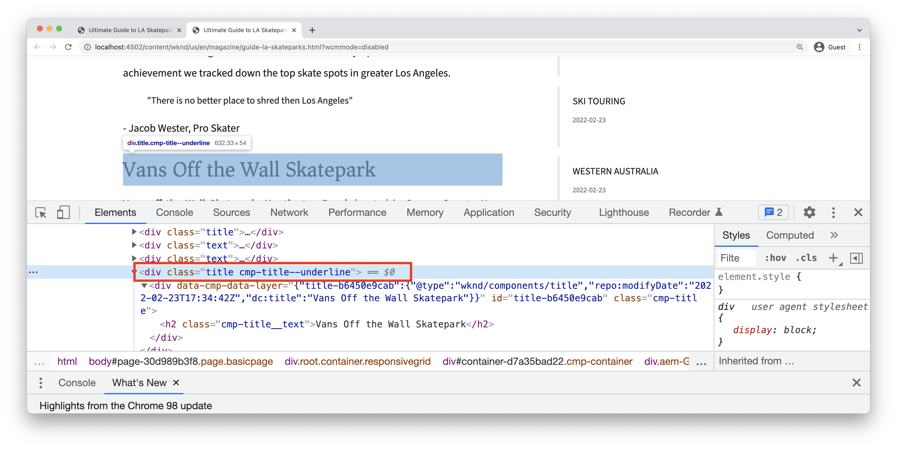

# Sviluppo con il sistema di stili {#developing-with-the-style-system}

Scopri come implementare singoli stili e riutilizzare i Componenti core utilizzando il Sistema di stili di Experience Manager. Questa esercitazione tratta lo sviluppo per il sistema di stili per estendere i componenti core con CSS specifici per il brand e configurazioni di policy avanzate dell’Editor modelli.

## Prerequisiti {#prerequisites}

Esaminare gli strumenti e le istruzioni necessari per l&#39;impostazione di un [ambiente di sviluppo locale](overview.md#local-dev-environment).

Si consiglia inoltre di rivedere [Librerie lato client e flusso di lavoro front-end](client-side-libraries.md) tutorial per comprendere le nozioni di base delle librerie lato client e i vari strumenti front-end integrati nel progetto AEM.

### Progetto iniziale

>[!NOTE]
>
> Se hai completato correttamente il capitolo precedente, puoi riutilizzare il progetto e saltare i passaggi per estrarre il progetto iniziale.

Consulta il codice della riga di base su cui si basa l’esercitazione:

1. Consulta la sezione `tutorial/style-system-start` ramo da [GitHub](https://github.com/adobe/aem-guides-wknd)

   ```shell
   $ cd aem-guides-wknd
   $ git checkout tutorial/style-system-start
   ```

1. Implementa la base di codice in un’istanza AEM locale utilizzando le tue competenze Maven:

   ```shell
   $ mvn clean install -PautoInstallSinglePackage
   ```

   >[!NOTE]
   >
   > Se si utilizza AEM 6.5 o 6.4, aggiungere `classic` profilo a qualsiasi comando Maven.

   ```shell
   $ mvn clean install -PautoInstallSinglePackage -Pclassic
   ```

Puoi sempre visualizzare il codice finito su [GitHub](https://github.com/adobe/aem-guides-wknd/tree/tutorial/style-system-solution) oppure estrarre il codice localmente passando al ramo `tutorial/style-system-solution`.

## Obiettivo

1. Scopri come utilizzare il sistema di stili per applicare CSS specifici per il brand ai componenti core AEM.
1. Scopri la notazione BEM e come utilizzarla per definire con attenzione gli stili.
1. Applicare configurazioni di criteri avanzate con modelli modificabili.

## Cosa intendi creare {#what-build}

In questo capitolo viene utilizzato [Feature del sistema di stili](https://experienceleague.adobe.com/docs/experience-manager-learn/sites/page-authoring/style-system-feature-video-use.html?lang=it) per creare varianti di **Titolo** e **Testo** componenti utilizzati nella pagina dell’articolo.


*Stile sottolineato disponibile per il componente Titolo*

## Informazioni di base {#background}

Il [Sistema di stili](https://experienceleague.adobe.com/docs/experience-manager-65/authoring/siteandpage/style-system.html) consente agli sviluppatori e agli editor di modelli di creare più varianti visive di un componente. Gli autori possono quindi decidere quale stile utilizzare durante la composizione di una pagina. Il sistema di stili viene utilizzato in tutto il resto dell’esercitazione per ottenere diversi stili univoci utilizzando i Componenti core in un approccio a basso codice.

L’idea generale del sistema di stili è che gli autori possano scegliere vari stili per definire l’aspetto di un componente. Gli &quot;stili&quot; sono supportati da classi CSS aggiuntive che vengono inserite nell’elemento div esterno di un componente. Nelle librerie client vengono aggiunte regole CSS basate su queste classi di stile in modo che il componente cambi aspetto.

Puoi trovare [la documentazione dettagliata del sistema di stili qui](https://experienceleague.adobe.com/docs/experience-manager-cloud-service/content/sites/authoring/features/style-system.html?lang=it). C&#39;è anche un grande [video tecnico per comprendere il sistema di stili](https://experienceleague.adobe.com/docs/experience-manager-learn/sites/developing/style-system-technical-video-understand.html).

## Stile sottolineatura - Titolo {#underline-style}

Il [Componente Titolo](https://experienceleague.adobe.com/docs/experience-manager-core-components/using/wcm-components/title.html) è stato aggiunto al progetto in `/apps/wknd/components/title` nell&#39;ambito del **ui.apps** modulo. Stili predefiniti degli elementi Titolo (`H1`, `H2`, `H3`...) sono già state implementate nel **ui.frontend** modulo.

Il [Progettazioni articoli WKND](assets/pages-templates/wknd-article-design.xd) contiene uno stile univoco per il componente Titolo con una sottolineatura. Invece di creare due componenti o modificare la finestra di dialogo del componente, è possibile utilizzare il sistema di stili per consentire agli autori di aggiungere uno stile sottolineato.


### Aggiungi un criterio titolo

Aggiungiamo un criterio per i componenti Titolo per consentire agli autori di contenuto di scegliere lo stile Sottolineato da applicare a componenti specifici. Questa operazione viene eseguita utilizzando l’Editor di modelli in AEM.

1. Accedi a **Pagina articolo** modello da: [http://localhost:4502/editor.html/conf/wknd/settings/wcm/templates/article-page/structure.html](http://localhost:4502/editor.html/conf/wknd/settings/wcm/templates/article-page/structure.html)

1. In entrata **Struttura** modalità, nell&#39;area principale **Contenitore di layout**, seleziona la **Policy** accanto al simbolo **Titolo** componente elencato in *Componenti consentiti*:

   

1. Crea un criterio per il componente Titolo con i seguenti valori:

   *Titolo criterio&#42;*: **Titolo WKND**

   *Proprietà* > *Scheda Stili* > *Aggiungi un nuovo stile*

   **Sottolinea** : `cmp-title--underline`

   

   Clic **Fine** per salvare le modifiche apportate al criterio Titolo.

   >[!NOTE]
   >
   > Il valore `cmp-title--underline` compila la classe CSS sull’elemento div esterno del markup HTML del componente.

### Applicare lo stile Sottolineato

In qualità di autore, applichiamo lo stile sottolineato a determinati componenti titolo.

1. Accedi a **La Skatepark** articolo nell’editor di AEM Sites all’indirizzo: [http://localhost:4502/editor.html/content/wknd/us/en/magazine/guide-la-skateparks.html](http://localhost:4502/editor.html/content/wknd/us/en/magazine/guide-la-skateparks.html)
1. In entrata **Modifica** scegli un componente Titolo. Fai clic su **pennello** e seleziona la **Sottolinea** stile:

   

   >[!NOTE]
   >
   > A questo punto, non si verifica alcuna modifica visibile come `underline` non è stato implementato. Nell’esercizio successivo, questo stile viene implementato.

1. Fai clic su **Informazioni pagina** icona > **Visualizza come pubblicato** per esaminare la pagina all’esterno dell’editor AEM.
1. Utilizza gli strumenti di sviluppo del browser per verificare che il markup intorno al componente Titolo abbia la classe CSS `cmp-title--underline` applicato al div esterno.

   

   ```html
   <div class="title cmp-title--underline">
       <div data-cmp-data-layer="{&quot;title-b6450e9cab&quot;:{&quot;@type&quot;:&quot;wknd/components/title&quot;,&quot;repo:modifyDate&quot;:&quot;2022-02-23T17:34:42Z&quot;,&quot;dc:title&quot;:&quot;Vans Off the Wall Skatepark&quot;}}" 
       id="title-b6450e9cab" class="cmp-title">
           <h2 class="cmp-title__text">Vans Off the Wall Skatepark</h2>
       </div>
   </div>
   ```

### Implementare lo stile Sottolineato - ui.frontend

Quindi, implementa lo stile Sottolineato utilizzando **ui.frontend** modulo del progetto AEM. Il server di sviluppo Webpack fornito in bundle con **ui.frontend** modulo per visualizzare in anteprima gli stili *prima di* viene utilizzata la distribuzione in un’istanza locale dell’AEM.

1. Avvia il `watch` processo dall&#39;interno del **ui.frontend** modulo:

   ```shell
   $ cd ~/code/aem-guides-wknd/ui.frontend/
   $ npm run watch
   ```

   Viene avviato un processo che monitora le modifiche apportate al `ui.frontend` e sincronizzano le modifiche all’istanza AEM.


1. Restituire l’IDE e aprire il file `_title.scss` da: `ui.frontend/src/main/webpack/components/_title.scss`.
1. Introduzione di una nuova regola destinata al `cmp-title--underline` classe:

   ```scss
   /* Default Title Styles */
   .cmp-title {}
   .cmp-title__text {}
   .cmp-title__link {}
   
   /* Add Title Underline Style */
   .cmp-title--underline {
       .cmp-title__text {
           &:after {
           display: block;
               width: 84px;
               padding-top: 8px;
               content: '';
               border-bottom: 2px solid $brand-primary;
           }
       }
   }
   ```

   >[!NOTE]
   >
   >È consigliabile definire sempre con precisione l’ambito degli stili del componente di destinazione. In questo modo gli stili aggiuntivi non influiranno su altre aree della pagina.
   >
   >Tutti i Componenti core aderiscono a **[Notazione BEM](https://github.com/adobe/aem-core-wcm-components/wiki/css-coding-conventions)**. È consigliabile eseguire il targeting della classe CSS esterna durante la creazione di uno stile predefinito per un componente. Un’altra best practice è quella di eseguire il targeting dei nomi di classe specificati dalla notazione BEM del componente core, anziché degli elementi HTML.

1. Torna al browser e alla pagina AEM. Dovresti notare che è stato aggiunto lo stile Sottolineato:

   

1. Nell’editor AEM, ora dovresti essere in grado di attivare e disattivare la **Sottolinea** e osserva che le modifiche si riflettono visivamente.

## Stile blocco preventivo - Testo {#text-component}

Quindi, ripeti passaggi simili per applicare uno stile univoco al [Componente Testo](https://experienceleague.adobe.com/docs/experience-manager-core-components/using/wcm-components/text.html). Il componente Testo è stato aggiunto come proxy al progetto in `/apps/wknd/components/text` nell&#39;ambito del **ui.apps** modulo. Gli stili predefiniti degli elementi paragrafo sono già stati implementati in **ui.frontend**.

Il [Progettazioni articoli WKND](assets/pages-templates/wknd-article-design.xd) contiene uno stile univoco per il componente Testo con virgolette:


### Aggiungi un criterio di testo

Quindi aggiungi un criterio per i componenti Testo.

1. Accedi a **Modello pagina articolo** da: [http://localhost:4502/editor.html/conf/wknd/settings/wcm/templates/article-page/structure.html](http://localhost:4502/editor.html/conf/wknd/settings/wcm/templates/article-page/structure.html).

1. In entrata **Struttura** modalità, nell&#39;area principale **Contenitore di layout**, seleziona la **Policy** accanto al simbolo **Testo** componente elencato in *Componenti consentiti*:

   

1. Aggiorna il criterio del componente Testo con i seguenti valori:

   *Titolo criterio&#42;*: **Testo contenuto**

   *Plug-in* > *Stili paragrafo* > *Abilita stili di paragrafo*

   *Scheda Stili* > *Aggiungi un nuovo stile*

   **Blocco offerta** : `cmp-text--quote`

   

   

   Clic **Fine** per salvare le modifiche apportate al criterio Testo.

### Applicare lo stile di blocco del preventivo

1. Accedi a **La Skatepark** articolo nell’editor di AEM Sites all’indirizzo: [http://localhost:4502/editor.html/content/wknd/us/en/magazine/guide-la-skateparks.html](http://localhost:4502/editor.html/content/wknd/us/en/magazine/guide-la-skateparks.html)
1. In entrata **Modifica** scegliere un componente Testo. Modifica il componente per includere un elemento preventivo:

   

1. Seleziona il componente testo e fai clic su **pennello** e seleziona la **Blocco offerta** stile:

   

1. Utilizza gli strumenti per sviluppatori del browser per controllare il markup. Dovresti visualizzare il nome della classe `cmp-text--quote` è stato aggiunto all’elemento div esterno del componente:

   ```html
   <!-- Quote Block style class added -->
   <div class="text cmp-text--quote">
       <div data-cmp-data-layer="{&quot;text-60910f4b8d&quot;:{&quot;@type&quot;:&quot;wknd/components/text&quot;,&quot;repo:modifyDate&quot;:&quot;2022-02-24T00:55:26Z&quot;,&quot;xdm:text&quot;:&quot;<blockquote>&amp;nbsp; &amp;nbsp; &amp;nbsp;&amp;quot;There is no better place to shred then Los Angeles&amp;quot;</blockquote>\r\n<p>- Jacob Wester, Pro Skater</p>\r\n&quot;}}" id="text-60910f4b8d" class="cmp-text">
           <blockquote>&nbsp; &nbsp; &nbsp;"There is no better place to shred then Los Angeles"</blockquote>
           <p>- Jacob Wester, Pro Skater</p>
       </div>
   </div>
   ```

### Implementare lo stile di blocco del preventivo - ui.frontend

Ora implementiamo lo stile Blocco preventivo utilizzando **ui.frontend** modulo del progetto AEM.

1. Se non è già in esecuzione, avviare `watch` processo dall&#39;interno del **ui.frontend** modulo:

   ```shell
   $ npm run watch
   ```

1. Aggiornare il file `text.scss` da: `ui.frontend/src/main/webpack/components/_text.scss`:

   ```css
   /* Default text style */
   .cmp-text {}
   .cmp-text__paragraph {}
   
   /* WKND Text Quote style */
   .cmp-text--quote {
       .cmp-text {
           background-color: $brand-third;
           margin: 1em 0em;
           padding: 1em;
   
           blockquote {
               border: none;
               font-size: $font-size-large;
               font-family: $font-family-serif;
               padding: 14px 14px;
               margin: 0;
               margin-bottom: 0.5em;
   
               &:after {
                   border-bottom: 2px solid $brand-primary; /*yellow border */
                   content: '';
                   display: block;
                   position: relative;
                   top: 0.25em;
                   width: 80px;
               }
           }
           p {
               font-family:  $font-family-serif;
           }
       }
   }
   ```

   >[!CAUTION]
   >
   > In questo caso, gli elementi HTML non elaborati sono interessati dagli stili. Questo perché il componente Testo fornisce un editor Rich Text per gli autori di contenuto. La creazione di stili direttamente rispetto al contenuto dell’editor Rich Text deve essere eseguita con attenzione ed è ancora più importante definire in modo preciso gli stili.

1. Torna nuovamente al browser e osserva che è stato aggiunto lo stile di blocco Preventivo:

   

1. Arresta il server di sviluppo Webpack.

## Larghezza fissa - Contenitore (bonus) {#layout-container}

I componenti Contenitore sono stati utilizzati per creare la struttura di base del modello per pagina articolo e fornire le zone di rilascio per consentire agli autori di contenuto di aggiungere contenuto a una pagina. I contenitori possono inoltre utilizzare il sistema di stili, fornendo agli autori di contenuto ulteriori opzioni per la progettazione dei layout.

Il **Contenitore principale** del modello Pagina articolo contiene i due contenitori utilizzabili dall’autore e ha una larghezza fissa.


*Contenitore principale nel modello della pagina dell’articolo*.

La politica del **Contenitore principale** imposta l&#39;elemento predefinito come `main`:


CSS che crea **Contenitore principale** fisso è impostato in **ui.frontend** modulo in `ui.frontend/src/main/webpack/site/styles/container_main.scss` :

```SCSS
main.container {
    padding: .5em 1em;
    max-width: $max-content-width;
    float: unset!important;
    margin: 0 auto!important;
    clear: both!important;
}
```

Invece di eseguire il targeting di `main` HTML, il sistema di stili può essere utilizzato per creare un **Larghezza fissa** come parte del criterio Contenitore. Il sistema di stili potrebbe offrire agli utenti la possibilità di passare da un’icona all’altra **Larghezza fissa** e **Larghezza fluido** contenitori.

1. **Sfida bonus** - utilizzare gli insegnamenti tratti dagli esercizi precedenti e utilizzare il sistema di stili per implementare un **Larghezza fissa** e **Larghezza fluido** stili per il componente Contenitore.

## Congratulazioni.  {#congratulations}

Congratulazioni, la pagina dell’articolo è quasi stilizzata e hai acquisito un’esperienza pratica utilizzando il sistema di stili dell’AEM.

### Passaggi successivi {#next-steps}

Scopri come creare una soluzione completa [Componente AEM personalizzato](custom-component.md) che visualizza il contenuto creato in una finestra di dialogo ed esplora lo sviluppo di un modello Sling per incapsulare la logica di business che popola l’HTL del componente.

Visualizza il codice finito il [GitHub](https://github.com/adobe/aem-guides-wknd) oppure controlla e distribuisci il codice localmente in sul ramo Git `tutorial/style-system-solution`.

1. Clona il [github.com/adobe/aem-wknd-guides](https://github.com/adobe/aem-guides-wknd) archivio.
1. Consulta la sezione `tutorial/style-system-solution` filiale.
