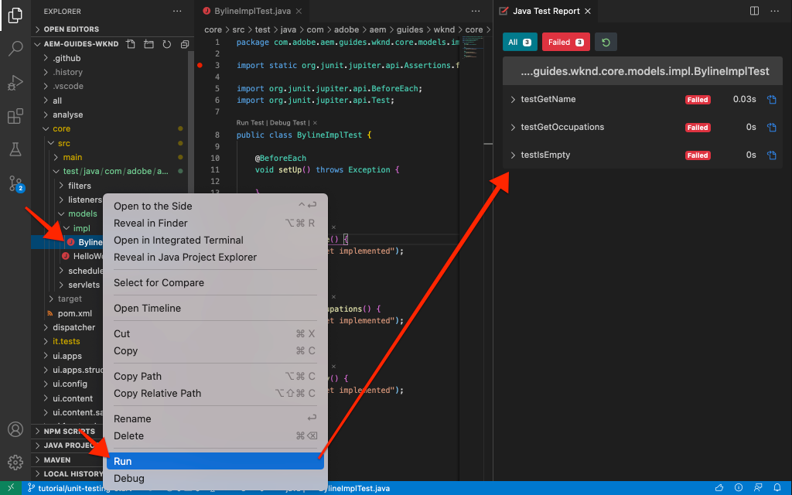

# Test di unità {#unit-testing}

Questa esercitazione descrive l&#39;implementazione di uno unit test che convalida il comportamento del modello Sling del componente Byline, creato nell&#39;esercitazione [Componente personalizzato](./custom-component.md).

## Prerequisiti {#prerequisites}

Esaminare gli strumenti e le istruzioni necessari per configurare un [ambiente di sviluppo locale](overview.md#local-dev-environment).

_Se nel sistema sono installati sia Java™ 8 che Java™ 11, l&#39;esecuzione dei test di VS Code potrebbe scegliere il runtime Java™ inferiore durante l&#39;esecuzione dei test, causando errori di test. In questo caso, disinstallare Java™ 8._

### Progetto iniziale

>[!NOTE]
>
> Se hai completato correttamente il capitolo precedente, puoi riutilizzare il progetto e saltare i passaggi per estrarre il progetto iniziale.

Consulta il codice della riga di base su cui si basa l’esercitazione:

1. Controlla il ramo `tutorial/unit-testing-start` da [GitHub](https://github.com/adobe/aem-guides-wknd)

   ```shell
   $ cd aem-guides-wknd
   $ git checkout tutorial/unit-testing-start
   ```

1. Implementa la base di codice in un’istanza AEM locale utilizzando le abilità Maven:

   ```shell
   $ mvn clean install -PautoInstallSinglePackage
   ```

   >[!NOTE]
   >
   > Se utilizzi AEM 6.5 o 6.4, aggiungi il profilo `classic` a qualsiasi comando Maven.

   ```shell
   $ mvn clean install -PautoInstallSinglePackage -Pclassic
   ```

Puoi sempre visualizzare il codice finito su [GitHub](https://github.com/adobe/aem-guides-wknd/tree/tutorial/unit-testing-start) o estrarre il codice localmente passando al ramo `tutorial/unit-testing-start`.

## Obiettivo

1. Comprendere le nozioni di base sul testing di unità.
1. Scopri i framework e gli strumenti comunemente utilizzati per testare il codice AEM.
1. Comprendi le opzioni per deridere o simulare le risorse AEM durante la scrittura di unit test.

## Informazioni di base {#unit-testing-background}

In questa esercitazione verrà illustrato come scrivere [unit test](https://en.wikipedia.org/wiki/Unit_testing) per il [modello Sling](https://sling.apache.org/documentation/bundles/models.html) del componente Byline (creato in [Creazione di un componente AEM personalizzato](custom-component.md)). Gli unit test sono test di build-time scritti in Java™ che verificano il comportamento previsto del codice Java™. Ogni unit test è in genere piccolo e convalida l&#39;output di un metodo (o unità di lavoro) in base ai risultati previsti.

Utilizziamo le best practice di AEM e utilizziamo:

* [JUnit 5](https://junit.org/junit5/)
* [Framework di test Mockito](https://site.mockito.org/)
* [wcm.io Test Framework](https://wcm.io/testing/) (che si basa su [Apache Sling Mocks](https://sling.apache.org/documentation/development/sling-mock.html))

## Test di unità e Adobe Cloud Manager {#unit-testing-and-adobe-cloud-manager}

[Adobe Cloud Manager](https://experienceleague.adobe.com/docs/experience-manager-cloud-manager/content/introduction.html?lang=it) integra l&#39;esecuzione di unit test e il [reporting sulla copertura del codice](https://experienceleague.adobe.com/docs/experience-manager-cloud-manager/content/using/code-quality-testing.html?lang=it) nella propria pipeline CI/CD per incoraggiare e promuovere la best practice per il codice AEM di unit test.

Anche se il codice di test di unità è una buona pratica per qualsiasi base di codice, quando si utilizza Cloud Manager è importante sfruttare i suoi servizi di test e reporting della qualità del codice fornendo unit test per l’esecuzione di Cloud Manager.

## Aggiornare le dipendenze Maven del test {#inspect-the-test-maven-dependencies}

Il primo passaggio consiste nell’esaminare le dipendenze Maven per supportare la scrittura e l’esecuzione dei test. Sono necessarie quattro dipendenze:

1. JUnit5
1. Framework di prova Mockito
1. Apache Sling Mocks
1. Framework di test di AEM Mocks (di io.wcm)

Le dipendenze dei test **JUnit5**, **Mockito e &#x200B;** AEM Mocks** vengono aggiunte automaticamente al progetto durante l&#39;installazione utilizzando l&#39;[archetipo AEM Maven](project-setup.md).

1. Per visualizzare queste dipendenze, apri il POM Reactor padre in **aem-guides-wknd/pom.xml**, passa a `<dependencies>..</dependencies>` e visualizza le dipendenze per JUnit, Mockito, Apache Sling Mocks e AEM Mock Test di io.wcm in `<!-- Testing -->`.
1. Verificare che `io.wcm.testing.aem-mock.junit5` sia impostato su **4.1.0**:

   ```xml
   <dependency>
       <groupId>io.wcm</groupId>
       <artifactId>io.wcm.testing.aem-mock.junit5</artifactId>
       <version>4.1.0</version>
       <scope>test</scope>
   </dependency>
   ```

   >[!CAUTION]
   >
   > Archetipo **35** genera il progetto con `io.wcm.testing.aem-mock.junit5` versione **4.1.8**. Effettua il downgrade a **4.1.0** per seguire il resto di questo capitolo.

1. Apri **aem-guides-wknd/core/pom.xml** e osserva che le dipendenze di test corrispondenti sono disponibili.

   Una cartella di origine parallela nel progetto **core** conterrà gli unit test ed eventuali file di test di supporto. Questa cartella **test** fornisce la separazione delle classi di test dal codice sorgente, ma consente ai test di agire come se si trovassero negli stessi pacchetti del codice sorgente.

## Creazione del test JUnit {#creating-the-junit-test}

Gli unit test tipicamente mappano 1-a-1 con le classi Java™. In questo capitolo verrà scritto un test JUnit per **BylineImpl.java**, che è il modello Sling che supporta il componente Byline.


*Percorso in cui sono archiviati gli unit test.*

1. Creare uno unit test per `BylineImpl.java` creando una nuova classe Java™ in `src/test/java` in una struttura di cartelle di pacchetti Java™ che rispecchia la posizione della classe Java™ da testare.

   

   Poiché stiamo testando

   * `src/main/java/com/adobe/aem/guides/wknd/core/models/impl/BylineImpl.java`

   crea una classe Java™ unit test corrispondente in

   * `src/test/java/com/adobe/aem/guides/wknd/core/models/impl/BylineImplTest.java`

   Il suffisso `Test` nel file di unit test `BylineImplTest.java` è una convenzione che consente di

   1. Identificarlo facilmente come file di test _per_ `BylineImpl.java`
   1. Ma anche differenziare il file di test _da_ la classe in fase di test, `BylineImpl.java`

## Revisione di BylineImplTest.java {#reviewing-bylineimpltest-java}

A questo punto, il file di test JUnit è una classe Java™ vuota.

1. Aggiorna il file con il seguente codice:

   ```java
   package com.adobe.aem.guides.wknd.core.models.impl;
   
   import static org.junit.jupiter.api.Assertions.*;
   
   import org.junit.jupiter.api.BeforeEach;
   import org.junit.jupiter.api.Test;
   
   public class BylineImplTest {
   
       @BeforeEach
       void setUp() throws Exception {
   
       }
   
       @Test 
       void testGetName() { 
           fail("Not yet implemented");
       }
   
       @Test 
       void testGetOccupations() { 
           fail("Not yet implemented");
       }
   
       @Test 
       void testIsEmpty() { 
           fail("Not yet implemented");
       }
   }
   ```

1. Il primo metodo `public void setUp() { .. }` è annotato con JUnit `@BeforeEach`, che indica al runner di test JUnit di eseguire questo metodo prima di eseguire ogni metodo di test in questa classe. In questo modo è possibile inizializzare lo stato di test comune richiesto da tutti i test.

1. I metodi successivi sono i metodi di test, i cui nomi sono preceduti da `test` per convenzione e contrassegnati con l&#39;annotazione `@Test`. Per impostazione predefinita, tutti i nostri test sono impostati per non riuscire, poiché non li abbiamo ancora implementati.

   Per iniziare, iniziamo con un singolo metodo di test per ogni metodo pubblico sulla classe che stiamo testando, quindi:

   | BylineImpl.java |              | BylineImplTest.java |
   | ------------------|--------------|---------------------|
   | getName() | è testato da | testGetName() |
   | getOccupations() | è testato da | testGetOccupations() |
   | isEmpty() | è testato da | testIsEmpty() |

   Questi metodi possono essere ampliati in base alle esigenze, come vedremo più avanti in questo capitolo.

   Quando viene eseguita questa classe di test JUnit (nota anche come test case JUnit), ogni metodo contrassegnato con `@Test` verrà eseguito come test che può essere superato o non superato.


*`core/src/test/java/com/adobe/aem/guides/wknd/core/models/impl/BylineImplTest.java`*

1. Eseguire il test case JUnit facendo clic con il pulsante destro del mouse sul file `BylineImplTest.java` e toccando **Esegui**.
Come previsto, tutti i test hanno esito negativo poiché non sono ancora stati implementati.

   

   *Fare clic con il pulsante destro del mouse su BylineImplTests.java > Esegui*

## Revisione di BylineImpl.java {#reviewing-bylineimpl-java}

Durante la scrittura degli unit test, esistono due approcci principali:

* [TDD o sviluppo basato su test](https://en.wikipedia.org/wiki/Test-driven_development), che prevede la scrittura degli unit test in modo incrementale, immediatamente prima dello sviluppo dell&#39;implementazione; scrivere un test, scrivere l&#39;implementazione per far sì che il test venga superato.
* Implementazione-prima Sviluppo, che comporta lo sviluppo del codice di lavoro prima e la scrittura di test che convalidano tale codice.

In questo tutorial viene utilizzato quest&#39;ultimo approccio (in quanto è già stato creato un **BylineImpl.java** funzionante in un capitolo precedente). Per questo motivo, dobbiamo rivedere e comprendere i comportamenti dei suoi metodi pubblici, ma anche alcuni dei suoi dettagli di implementazione. Questo può sembrare contrario, poiché un buon test dovrebbe preoccuparsi solo degli input e degli output, tuttavia quando si lavora in AEM, ci sono varie considerazioni di implementazione che devono essere comprese per costruire test di lavoro.

Il TDD nel contesto di AEM richiede un livello di esperienza ed è adottato al meglio da sviluppatori AEM esperti nello sviluppo AEM e nel testing di unità del codice AEM.

## Configurazione del contesto di test di AEM  {#setting-up-aem-test-context}

La maggior parte del codice scritto per AEM si basa sulle API JCR, Sling o AEM, che a loro volta richiedono la corretta esecuzione del contesto di un AEM in esecuzione.

Poiché gli unit test vengono eseguiti al momento della compilazione, al di fuori del contesto di un’istanza AEM in esecuzione, tale contesto non esiste. Per facilitare questa fase, AEM Mocks[&#128279;](https://wcm.io/testing/aem-mock/usage.html) di wcm.io crea un contesto fittizio che consente a queste API di _agire principalmente_ come se fossero in esecuzione in AEM.

1. Creare un contesto AEM utilizzando **wcm.io&#39;s** `AemContext` in **BylineImplTest.java** aggiungendolo come estensione JUnit decorata con `@ExtendWith` al file **BylineImplTest.java**. L&#39;estensione si occupa di tutte le attività di inizializzazione e pulizia necessarie. Creare una variabile di classe per `AemContext` che può essere utilizzata per tutti i metodi di test.

   ```java
   import org.junit.jupiter.api.extension.ExtendWith;
   import io.wcm.testing.mock.aem.junit5.AemContext;
   import io.wcm.testing.mock.aem.junit5.AemContextExtension;
   ...
   
   @ExtendWith(AemContextExtension.class)
   class BylineImplTest {
   
       private final AemContext ctx = new AemContext();
   ```

   Questa variabile, `ctx`, espone un contesto AEM fittizio che fornisce alcune astrazioni di AEM e Sling:

   * Il modello Sling BylineImpl è registrato in questo contesto
   * In questo contesto vengono create strutture di contenuto JCR fittizie
   * I servizi OSGi personalizzati possono essere registrati in questo contesto
   * Fornisce vari oggetti e helper fittizi richiesti, come oggetti SlingHttpServletRequest, vari servizi simil Sling e AEM OSGi come ModelFactory, PageManager, Page, Template, ComponentManager, Component, TagManager, Tag, ecc.
      * *Non tutti i metodi per questi oggetti sono implementati!*
   * E [molto di più](https://wcm.io/testing/aem-mock/usage.html)!

   L&#39;oggetto **`ctx`** fungerà da punto di ingresso per la maggior parte del contesto fittizio.

1. Nel metodo `setUp(..)`, eseguito prima di ogni metodo `@Test`, definire uno stato di test fittizio comune:

   ```java
   @BeforeEach
   public void setUp() throws Exception {
       ctx.addModelsForClasses(BylineImpl.class);
       ctx.load().json("/com/adobe/aem/guides/wknd/core/models/impl/BylineImplTest.json", "/content");
   }
   ```

   * **`addModelsForClasses`** registra il modello Sling da testare nel contesto AEM fittizio, in modo da crearne un&#39;istanza nei metodi `@Test`.
   * **`load().json`** carica le strutture delle risorse nel contesto fittizio, consentendo al codice di interagire con tali risorse come se fossero fornite da un archivio reale. Le definizioni delle risorse nel file **`BylineImplTest.json`** sono caricate nel contesto JCR fittizio in **/content**.
   * **`BylineImplTest.json`** non esiste ancora, quindi creiamolo e definiamo le strutture di risorse JCR necessarie per il test.

1. I file JSON che rappresentano le strutture di risorse fittizie sono archiviati in **core/src/test/resources** seguendo lo stesso percorso del pacchetto del file di test Java™ JUnit.

   Crea un file JSON in `core/test/resources/com/adobe/aem/guides/wknd/core/models/impl` denominato **BylineImplTest.json** con il seguente contenuto:

   ```json
   {
       "byline": {
       "jcr:primaryType": "nt:unstructured",
       "sling:resourceType": "wknd/components/content/byline"
       }
   }
   ```

   

   Questo JSON definisce una risorsa fittizia (nodo JCR) per l’unit test del componente Byline. A questo punto, il JSON ha il set minimo di proprietà necessarie per rappresentare una risorsa di contenuto del componente Byline, `jcr:primaryType` e `sling:resourceType`.

   Una regola generale quando si lavora con gli unit test consiste nel creare il set minimo di contenuti fittizi, contesto e codice necessario per soddisfare ogni test. Evita la tentazione di creare un contesto fittizio completo prima di scrivere i test, in quanto spesso genera artefatti non necessari.

   Ora con l&#39;esistenza di **BylineImplTest.json**, quando viene eseguito `ctx.json("/com/adobe/aem/guides/wknd/core/models/impl/BylineImplTest.json", "/content")`, le definizioni delle risorse fittizie vengono caricate nel contesto nel percorso **/contenuto.**

## Verifica di getName() {#testing-get-name}

Ora che abbiamo configurato un contesto fittizio di base, scriviamo il primo test per **BylineImpl&#39;s getName()**. Questo test deve garantire che il metodo **getName()** restituisca il nome creato correttamente archiviato nella proprietà &quot;**name&quot;** della risorsa.

1. Aggiornare il metodo **testGetName**() in **BylineImplTest.java** come segue:

   ```java
   import com.adobe.aem.guides.wknd.core.models.Byline;
   ...
   @Test
   public void testGetName() {
       final String expected = "Jane Doe";
   
       ctx.currentResource("/content/byline");
       Byline byline = ctx.request().adaptTo(Byline.class);
   
       String actual = byline.getName();
   
       assertEquals(expected, actual);
   }
   ```

   * **`String expected`** imposta il valore previsto. Verrà impostato su &quot;**Jane Done**&quot;.
   * **`ctx.currentResource`** imposta il contesto della risorsa fittizia su cui valutare il codice, quindi viene impostato su **/content/byline** in quanto è dove viene caricata la risorsa di contenuto fittizia.
   * **`Byline byline`** crea un&#39;istanza del modello Sling Byline adattandolo dal finto oggetto Request.
   * **`String actual`** richiama il metodo in fase di test, `getName()`, sull&#39;oggetto modello Sling Byline.
   * **`assertEquals`** asserisce che il valore previsto corrisponde al valore restituito dall&#39;oggetto modello Sling byline. Se questi valori non sono uguali, il test avrà esito negativo.

1. Esegui il test... e non riesce con `NullPointerException`.

   Il test NON ha esito negativo perché non è mai stata definita una proprietà `name` nel JSON fittizio. Il test non verrà eseguito correttamente, tuttavia l&#39;esecuzione del test non è arrivata a questo punto. Il test non riesce a causa di un `NullPointerException` nell&#39;oggetto byline stesso.

1. In `BylineImpl.java`, se `@PostConstruct init()` genera un&#39;eccezione, impedisce al modello Sling di creare un&#39;istanza e causa l&#39;impostazione dell&#39;oggetto modello Sling come null.

   ```java
   @PostConstruct
   private void init() {
       image = modelFactory.getModelFromWrappedRequest(request, request.getResource(), Image.class);
   }
   ```

   Si è verificato che mentre il servizio OSGi ModelFactory viene fornito tramite `AemContext` (tramite il contesto Sling Apache), non tutti i metodi vengono implementati, incluso `getModelFromWrappedRequest(...)` che viene chiamato nel metodo `init()` di BylineImpl. Ciò determina un [AbstractMethodError](https://docs.oracle.com/en/java/javase/11/docs/api/java.base/java/lang/AbstractMethodError.html), che nel termine causa il mancato funzionamento di `init()` e l&#39;adattamento risultante di `ctx.request().adaptTo(Byline.class)` è un oggetto null.

   Poiché gli scherzi forniti non possono contenere il nostro codice, è necessario implementare direttamente il contesto fittizio. Per questo è possibile utilizzare Mockito per creare un oggetto ModelFactory fittizio, che restituisce un oggetto Image fittizio quando `getModelFromWrappedRequest(...)` viene richiamato su di esso.

   Poiché per creare un&#39;istanza del modello Sling Byline è necessario che il contesto fittizio sia attivo, è possibile aggiungerlo al metodo `@Before setUp()`. È inoltre necessario aggiungere `MockitoExtension.class` all&#39;annotazione `@ExtendWith` sopra la classe **BylineImplTest**.

   ```java
   package com.adobe.aem.guides.wknd.core.models.impl;
   
   import org.mockito.junit.jupiter.MockitoExtension;
   import org.mockito.Mock;
   
   import com.adobe.aem.guides.wknd.core.models.Byline;
   import com.adobe.cq.wcm.core.components.models.Image;
   
   import io.wcm.testing.mock.aem.junit5.AemContext;
   import io.wcm.testing.mock.aem.junit5.AemContextExtension;
   
   import org.apache.sling.models.factory.ModelFactory;
   import org.junit.jupiter.api.BeforeEach;
   import org.junit.jupiter.api.Test;
   import org.junit.jupiter.api.extension.ExtendWith;
   
   import static org.junit.jupiter.api.Assertions.*;
   import static org.mockito.Mockito.*;
   import org.apache.sling.api.resource.Resource;
   
   @ExtendWith({ AemContextExtension.class, MockitoExtension.class })
   public class BylineImplTest {
   
       private final AemContext ctx = new AemContext();
   
       @Mock
       private Image image;
   
       @Mock
       private ModelFactory modelFactory;
   
       @BeforeEach
       public void setUp() throws Exception {
           ctx.addModelsForClasses(BylineImpl.class);
   
           ctx.load().json("/com/adobe/aem/guides/wknd/core/models/impl/BylineImplTest.json", "/content");
   
           lenient().when(modelFactory.getModelFromWrappedRequest(eq(ctx.request()), any(Resource.class), eq(Image.class)))
                   .thenReturn(image);
   
           ctx.registerService(ModelFactory.class, modelFactory, org.osgi.framework.Constants.SERVICE_RANKING,
                   Integer.MAX_VALUE);
       }
   
       @Test
       void testGetName() { ...
   }
   ```

   * **`@ExtendWith({AemContextExtension.class, MockitoExtension.class})`** contrassegna la classe Test Case da eseguire con l&#39;estensione [Mockito JUnit Jupiter](https://www.javadoc.io/static/org.mockito/mockito-junit-jupiter/4.11.0/org/mockito/junit/jupiter/MockitoExtension.html) che consente l&#39;utilizzo delle annotazioni @Mock per definire oggetti fittizi a livello di classe.
   * **`@Mock private Image`** crea un oggetto fittizio di tipo `com.adobe.cq.wcm.core.components.models.Image`. Viene definito a livello di classe in modo che, se necessario, i metodi `@Test` possano modificarne il comportamento in base alle esigenze.
   * **`@Mock private ModelFactory`** crea un oggetto fittizio di tipo ModelFactory. Questa è una pura beffa di Mockito e non ha metodi implementati su di essa. Questo viene definito a livello di classe in modo che, se necessario, `@Test` metodi possano modificarne il comportamento in base alle esigenze.
   * **`when(modelFactory.getModelFromWrappedRequest(..)`** registra il comportamento fittizio per quando `getModelFromWrappedRequest(..)` viene chiamato sull&#39;oggetto ModelFactory fittizio. Il risultato definito in `thenReturn (..)` è quello di restituire l&#39;oggetto immagine fittizio. Questo comportamento viene richiamato solo quando: il primo parametro è uguale all&#39;oggetto di richiesta di `ctx`, il secondo parametro è qualsiasi oggetto Resource e il terzo parametro deve essere la classe Immagine dei Componenti core. Accettiamo qualsiasi risorsa perché durante i test impostiamo `ctx.currentResource(...)` su varie risorse fittizie definite in **BylineImplTest.json**. Si noti che verrà aggiunta la rigidità **lenient()** perché in seguito si desidera ignorare questo comportamento di ModelFactory.
   * **`ctx.registerService(..)`.** registra l&#39;oggetto ModelFactory fittizio in AemContext, con la classificazione di servizio più elevata. Questa operazione è necessaria perché ModelFactory utilizzato in `init()` di BylineImpl viene inserito tramite il campo `@OSGiService ModelFactory model`. Affinché AemContext inserisca l&#39;oggetto fittizio **our**, che gestisce le chiamate a `getModelFromWrappedRequest(..)`, è necessario registrarlo come servizio di classificazione più elevata di quel tipo (ModelFactory).

1. Riesegui il test e di nuovo non riesce, ma questa volta il messaggio indica chiaramente il motivo dell’errore.

   

   *errore testGetName() a causa di un&#39;asserzione*

   Riceviamo un **AssertionError** che indica che la condizione di asserzione nel test non è riuscita e ci dice che il **valore previsto è &quot;Jane Doe&quot;** ma il **valore effettivo è nullo**. Ciò ha senso perché la proprietà &quot;**name&quot;** non è stata aggiunta alla definizione fittizia della risorsa **/content/byline** in **BylineImplTest.json**, quindi aggiungiamola:

1. Aggiorna **BylineImplTest.json** per definire `"name": "Jane Doe".`

   ```json
   {
       "byline": {
       "jcr:primaryType": "nt:unstructured",
       "sling:resourceType": "wknd/components/content/byline",
       "name": "Jane Doe"
       }
   }
   ```

1. Riesegui il test e **`testGetName()`** ora supera il test.

   


## Verifica di getOccupations() {#testing-get-occupations}

Ok, perfetto! Il primo test è stato superato! Passiamo al test di `getOccupations()`. Poiché l&#39;inizializzazione del contesto fittizio è stata eseguita nel metodo `@Before setUp()`, questo è disponibile per tutti i metodi `@Test` in questo test case, incluso `getOccupations()`.

Tenere presente che questo metodo deve restituire un elenco alfabetico ordinato delle occupazioni (decrescenti) memorizzate nella proprietà occupazioni.

1. Aggiorna **`testGetOccupations()`** come segue:

   ```java
   import java.util.List;
   import com.google.common.collect.ImmutableList;
   ...
   @Test
   public void testGetOccupations() {
       List<String> expected = new ImmutableList.Builder<String>()
                               .add("Blogger")
                               .add("Photographer")
                               .add("YouTuber")
                               .build();
   
       ctx.currentResource("/content/byline");
       Byline byline = ctx.request().adaptTo(Byline.class);
   
       List<String> actual = byline.getOccupations();
   
       assertEquals(expected, actual);
   }
   ```

   * **`List<String> expected`** definiscono il risultato previsto.
   * **`ctx.currentResource`** imposta la risorsa corrente per la valutazione del contesto sulla definizione di risorsa fittizia in /content/byline. In questo modo **BylineImpl.java** viene eseguito nel contesto della risorsa fittizia.
   * **`ctx.request().adaptTo(Byline.class)`** crea un&#39;istanza del modello Sling Byline adattandolo dal finto oggetto Request.
   * **`byline.getOccupations()`** richiama il metodo in fase di test, `getOccupations()`, sull&#39;oggetto modello Sling Byline.
   * **`assertEquals(expected, actual)`** asserisce che l&#39;elenco previsto è uguale all&#39;elenco effettivo.

1. Ricorda che, proprio come **`getName()`** in precedenza, **BylineImplTest.json** non definisce le occupazioni, pertanto questo test non riuscirà se viene eseguito, poiché `byline.getOccupations()` restituirà un elenco vuoto.

   Aggiorna **BylineImplTest.json** per includere un elenco di occupazioni impostate in ordine non alfabetico per garantire che i test convalidi che le occupazioni siano ordinate alfabeticamente per **`getOccupations()`**.

   ```json
   {
       "byline": {
       "jcr:primaryType": "nt:unstructured",
       "sling:resourceType": "wknd/components/content/byline",
       "name": "Jane Doe",
       "occupations": ["Photographer", "Blogger", "YouTuber"]
       }
   }
   ```

1. Esegui il test e passiamo di nuovo! Sembra che le occupazioni ordinate funzionino!

   

   *testGetOccupations() passa*

## Test isEmpty() {#testing-is-empty}

Ultimo metodo per testare **`isEmpty()`**.

Il test `isEmpty()` è interessante in quanto richiede test per varie condizioni. Esaminando il metodo `isEmpty()` di **BylineImpl.java**, è necessario verificare le seguenti condizioni:

* Restituisce true quando il nome è vuoto
* Restituisce true se le occupazioni sono nulle o vuote
* Restituisce true se l’immagine è null o non ha un URL src
* Restituisce false quando sono presenti il nome, le occupazioni e l’immagine (con un URL src)

A tale scopo, è necessario creare metodi di test, ognuno dei quali esegue il test di una condizione specifica e di nuove strutture di risorse fittizie in `BylineImplTest.json` per eseguire questi test.

Questo controllo ci ha permesso di saltare i test per quando `getName()`, `getOccupations()` e `getImage()` sono vuoti, poiché il comportamento previsto di tale stato è testato tramite `isEmpty()`.

1. Il primo test verifica la condizione di un componente nuovo, che non ha proprietà impostate.

   Aggiungi una nuova definizione di risorsa a `BylineImplTest.json`, assegnandole il nome semantico &quot;**empty**&quot;

   ```json
   {
       "byline": {
           "jcr:primaryType": "nt:unstructured",
           "sling:resourceType": "wknd/components/content/byline",
           "name": "Jane Doe",
           "occupations": ["Photographer", "Blogger", "YouTuber"]
       },
       "empty": {
           "jcr:primaryType": "nt:unstructured",
           "sling:resourceType": "wknd/components/content/byline"
       }
   }
   ```

   **`"empty": {...}`** definiscono una nuova definizione di risorsa denominata &quot;empty&quot; che ha solo `jcr:primaryType` e `sling:resourceType`.

   Ricorda che abbiamo caricato `BylineImplTest.json` in `ctx` prima dell&#39;esecuzione di ogni metodo di test in `@setUp`, quindi questa nuova definizione di risorsa è immediatamente disponibile nei test in **/content/empty.**

1. Aggiornare `testIsEmpty()` come segue, impostando la risorsa corrente sulla nuova definizione di risorsa fittizia &quot;**empty**&quot;.

   ```java
   @Test
   public void testIsEmpty() {
       ctx.currentResource("/content/empty");
       Byline byline = ctx.request().adaptTo(Byline.class);
   
       assertTrue(byline.isEmpty());
   }
   ```

   Esegui il test e assicurati che venga superato.

1. Creare quindi un set di metodi per garantire che, se uno qualsiasi dei punti di dati richiesti (nome, occupazioni o immagine) è vuoto, `isEmpty()` restituisca true.

   Per ogni test viene utilizzata una definizione di risorsa fittizia discreta. Aggiornare **BylineImplTest.json** con le definizioni di risorsa aggiuntive per **without-name** e **without-occupations**.

   ```json
   {
       "byline": {
           "jcr:primaryType": "nt:unstructured",
           "sling:resourceType": "wknd/components/content/byline",
           "name": "Jane Doe",
           "occupations": ["Photographer", "Blogger", "YouTuber"]
       },
       "empty": {
           "jcr:primaryType": "nt:unstructured",
           "sling:resourceType": "wknd/components/content/byline"
       },
       "without-name": {
           "jcr:primaryType": "nt:unstructured",
           "sling:resourceType": "wknd/components/content/byline",
           "occupations": "[Photographer, Blogger, YouTuber]"
       },
       "without-occupations": {
           "jcr:primaryType": "nt:unstructured",
           "sling:resourceType": "wknd/components/content/byline",
           "name": "Jane Doe"
       }
   }
   ```

   Crea i seguenti metodi di test per testare ciascuno di questi stati.

   ```java
   @Test
   public void testIsEmpty() {
       ctx.currentResource("/content/empty");
   
       Byline byline = ctx.request().adaptTo(Byline.class);
   
       assertTrue(byline.isEmpty());
   }
   
   @Test
   public void testIsEmpty_WithoutName() {
       ctx.currentResource("/content/without-name");
   
       Byline byline = ctx.request().adaptTo(Byline.class);
   
       assertTrue(byline.isEmpty());
   }
   
   @Test
   public void testIsEmpty_WithoutOccupations() {
       ctx.currentResource("/content/without-occupations");
   
       Byline byline = ctx.request().adaptTo(Byline.class);
   
       assertTrue(byline.isEmpty());
   }
   
   @Test
   public void testIsEmpty_WithoutImage() {
       ctx.currentResource("/content/byline");
   
       lenient().when(modelFactory.getModelFromWrappedRequest(eq(ctx.request()),
           any(Resource.class),
           eq(Image.class))).thenReturn(null);
   
       Byline byline = ctx.request().adaptTo(Byline.class);
   
       assertTrue(byline.isEmpty());
   }
   
   @Test
   public void testIsEmpty_WithoutImageSrc() {
       ctx.currentResource("/content/byline");
   
       when(image.getSrc()).thenReturn("");
   
       Byline byline = ctx.request().adaptTo(Byline.class);
   
       assertTrue(byline.isEmpty());
   }
   ```

   **`testIsEmpty()`** verifica la definizione della risorsa fittizia vuota e asserisce che `isEmpty()` è true.

   **`testIsEmpty_WithoutName()`** esegue il test in base a una definizione di risorsa fittizia con occupazioni ma senza nome.

   **`testIsEmpty_WithoutOccupations()`** esegue il test in base a una definizione di risorsa fittizia con un nome ma senza occupazioni.

   **`testIsEmpty_WithoutImage()`** esegue il test in base a una definizione di risorsa fittizia con un nome e occupazioni, ma imposta l&#39;immagine fittizia su null. Si noti che si desidera ignorare il comportamento `modelFactory.getModelFromWrappedRequest(..)` definito in `setUp()` per assicurarsi che l&#39;oggetto Image restituito da questa chiamata sia nullo. La funzione Mockito stubs è rigida e non richiede codice duplicato. Pertanto, abbiamo impostato le impostazioni del simulatore con **`lenient`** in modo che notino esplicitamente che stiamo ignorando il comportamento nel metodo `setUp()`.

   **`testIsEmpty_WithoutImageSrc()`** esegue test su una definizione di risorsa fittizia con un nome e occupazioni, ma imposta l&#39;immagine fittizia in modo che restituisca una stringa vuota quando viene richiamato `getSrc()`.

1. Infine, scrivere un test per assicurarsi che **isEmpty()** restituisca false quando il componente è configurato correttamente. Per questa condizione, è possibile riutilizzare **/content/byline** che rappresenta un componente Byline completamente configurato.

   ```java
   @Test
   public void testIsNotEmpty() {
       ctx.currentResource("/content/byline");
       when(image.getSrc()).thenReturn("/content/bio.png");
   
       Byline byline = ctx.request().adaptTo(Byline.class);
   
       assertFalse(byline.isEmpty());
   }
   ```

1. Ora esegui tutti gli unit test nel file BylineImplTest.java e controlla l’output del rapporto sui test Java™.


## Esecuzione degli unit test come parte della build {#running-unit-tests-as-part-of-the-build}

Gli unit test vengono eseguiti e sono necessari per passare come parte della build Maven. In questo modo, tutti i test vengono superati correttamente prima che un’applicazione venga distribuita. L’esecuzione degli obiettivi Maven, ad esempio pacchetto o installazione, richiama automaticamente e richiede il passaggio di tutti gli unit test nel progetto.

```shell
$ mvn package
```


```shell
$ mvn package
```

Allo stesso modo, se si modifica un metodo di test in modo che abbia esito negativo, la build avrà esito negativo e segnalerà quali test non sono riusciti e perché.


## Rivedi il codice {#review-the-code}

Visualizza il codice finito in [GitHub](https://github.com/adobe/aem-guides-wknd) oppure rivedi e distribuisci il codice localmente in nel ramo Git `tutorial/unit-testing-solution`.
