# Introduzione all’authoring e alla pubblicazione {#author-content-publish}

È importante comprendere in che modo un utente aggiorna il contenuto del sito web. In questo capitolo adotteremo la persona di un **Autore del contenuto** e apporta alcuni aggiornamenti editoriali al sito generato nel capitolo precedente. Alla fine del capitolo, pubblicheremo le modifiche per comprendere come viene aggiornato il sito live.

## Prerequisiti {#prerequisites}

Si tratta di un tutorial in più parti e si presume che i passaggi descritti in [Creare un sito](./create-site.md) capitolo completato.

## Obiettivo {#objective}

1. Comprendere i concetti di **Pagine** e **Componenti** in AEM Sites.
1. Scopri come aggiornare il contenuto del sito web.
1. Scopri come pubblicare le modifiche al sito live.

## Creare una nuova pagina {#create-page}

In genere, un sito web viene suddiviso in pagine per creare un’esperienza multipagina. AEM struttura il contenuto allo stesso modo. Quindi, crea una nuova pagina per il sito.

1. Accedi al AEM **Autore** Servizio utilizzato nel capitolo precedente.
1. Dalla schermata iniziale AEM fai clic su **Sites** > **Sito WKND** > **Inglese** > **Articolo**
1. Nell&#39;angolo in alto a destra fai clic su **Crea** > **Pagina**.

   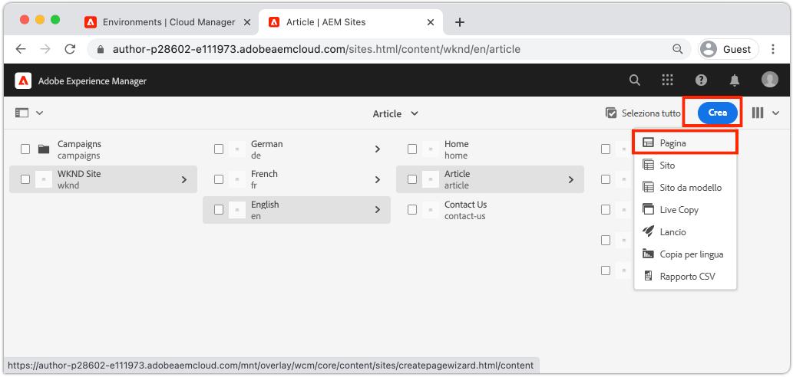

   Questo farà nascere **Crea pagina** procedura guidata.

1. Scegli la **Pagina dell’articolo** modello e fai clic su **Successivo**.

   Le pagine in AEM vengono create in base a un modello di pagina. I modelli di pagina sono descritti in dettaglio nella sezione [Modelli di pagina](page-templates.md) capitolo.

1. Sotto **Proprietà** inserire un **Titolo** di &quot;Hello World&quot;.
1. Imposta la **Nome** essere `hello-world` e fai clic su **Crea**.

   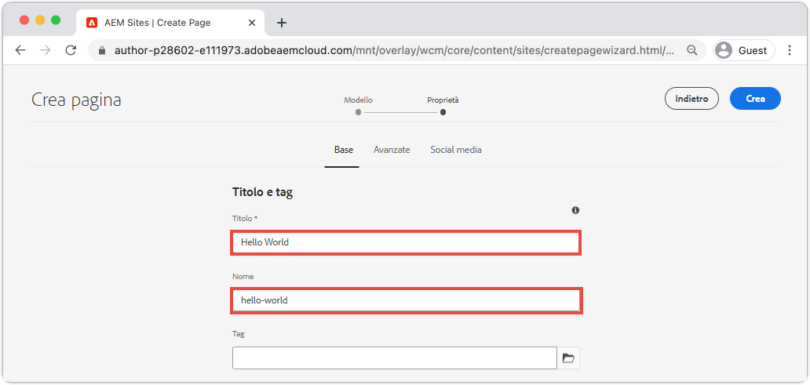

1. Nella finestra di dialogo a comparsa fai clic su **Apri** per aprire la pagina appena creata.

## Creare un componente {#author-component}

I componenti AEM possono essere considerati come piccoli blocchi modulari di una pagina web. Suddividendo l’interfaccia utente in blocchi logici o componenti, diventa molto più semplice da gestire. Per riutilizzare i componenti, questi devono essere configurabili. Questa operazione viene eseguita tramite la finestra di dialogo di authoring.

AEM fornisce un set di [Componenti core](https://experienceleague.adobe.com/docs/experience-manager-core-components/using/introduction.html?lang=it) che sono pronti per l’uso. La **Componenti core** da elementi di base come [Testo](https://experienceleague.adobe.com/docs/experience-manager-core-components/using/components/text.html) e [Immagine](https://experienceleague.adobe.com/docs/experience-manager-core-components/using/components/image.html) per elementi dell’interfaccia più complessi come [Carosello](https://experienceleague.adobe.com/docs/experience-manager-core-components/using/components/carousel.html).

Quindi, crea alcuni componenti utilizzando l’Editor pagina AEM.

1. Passa a **Hello World** pagina creata nell’esercizio precedente.
1. Verifica di essere in **Modifica** e nella barra laterale sinistra fai clic sul pulsante **Componenti** icona.

   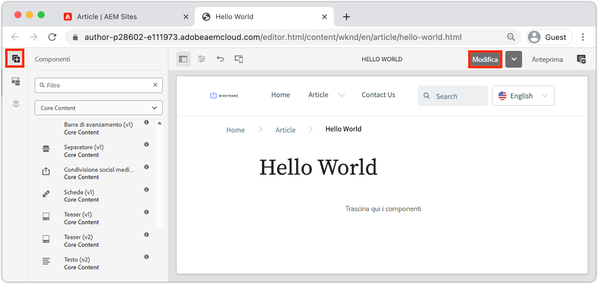

   Viene aperta la libreria Componenti ed è riportato l’elenco dei Componenti disponibili utilizzabili nella pagina.

1. Scorri verso il basso e **Trascina+Rilascia** a **Testo (v2)** viene visualizzato nell’area modificabile principale della pagina.

   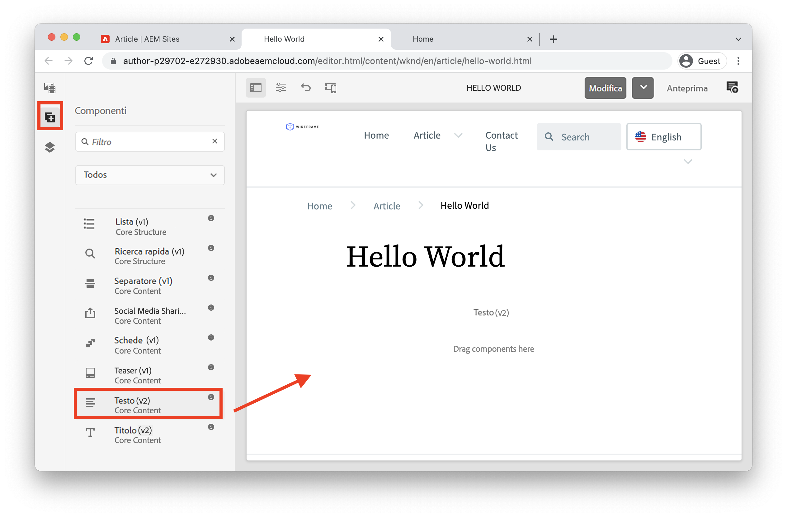

1. Fai clic sul pulsante **Testo** per evidenziare e quindi fare clic sul **chiave** icona  per aprire la finestra di dialogo del componente. Inserisci del testo e salva le modifiche apportate alla finestra di dialogo.

   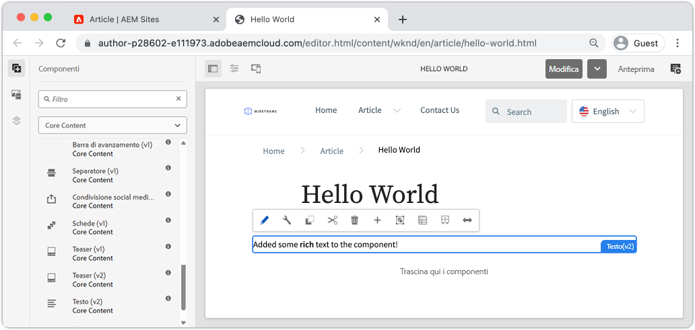

   La **Testo** A questo punto, il componente deve visualizzare il testo RTF nella pagina.

1. Ripeti i passaggi precedenti, tranne trascina un’istanza del **Immagine (v2)** nella pagina. Apri **Immagine** finestra di dialogo del componente.

1. Nella barra a sinistra, passa alla **Ricerca risorse** facendo clic sul pulsante **Risorse** icona .
1. **Trascina+Rilascia** un’immagine nella finestra di dialogo del componente e fai clic su **Fine** per salvare le modifiche.

   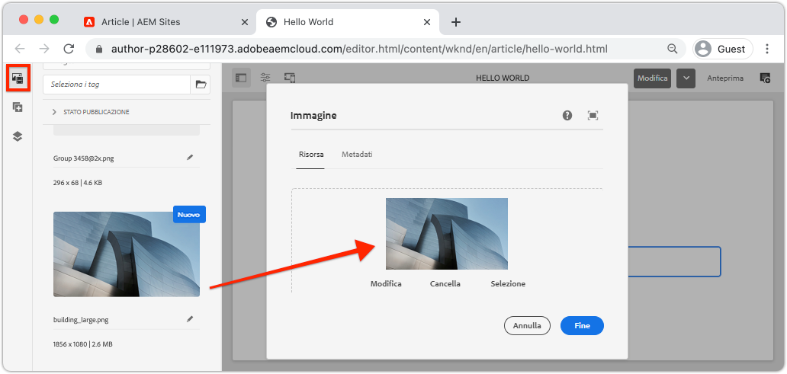

1. Osserva che nella pagina sono presenti componenti, come il **Titolo**, **Navigazione**, **Ricerca** che sono corretti. Queste aree sono configurate come parte del Modello di pagina e non possono essere modificate su una singola pagina. Questo è più esplorato nel prossimo capitolo.

Sentitevi liberi di sperimentare con alcuni degli altri componenti. Documentazione su ogni [Il componente core si trova qui](https://experienceleague.adobe.com/docs/experience-manager-core-components/using/introduction.html). Una serie video dettagliata su [L’authoring delle pagine è disponibile qui](https://experienceleague.adobe.com/docs/experience-manager-learn/sites/page-authoring/aem-sites-authoring-overview.html).

## Aggiornamenti alla pubblicazione {#publish-updates}

Gli ambienti AEM sono suddivisi tra **Servizio authoring** e **Servizio di pubblicazione**. In questo capitolo abbiamo apportato diverse modifiche al sito **Servizio authoring**. Per consentire ai visitatori del sito di visualizzare le modifiche, è necessario pubblicarle nel **Servizio di pubblicazione**.

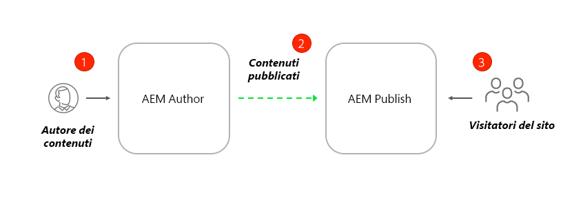

*Flusso di contenuti di alto livello da Author a Publish*

**1.** Gli autori dei contenuti apportano aggiornamenti al contenuto del sito. Gli aggiornamenti possono essere visualizzati in anteprima, rivisti e approvati per essere inviati in diretta.

**2.** Il contenuto è stato pubblicato. La pubblicazione può essere eseguita su richiesta o programmata per una data futura.

**3.** I visitatori del sito vedranno le modifiche che si rifletteranno sul servizio Publish.

### Pubblicare le modifiche

Quindi, pubblichiamo le modifiche.

1. Dalla schermata iniziale AEM passare a **Sites** e seleziona la **Sito WKND**.
1. Fai clic sul pulsante **Gestisci pubblicazione** nella barra dei menu.

   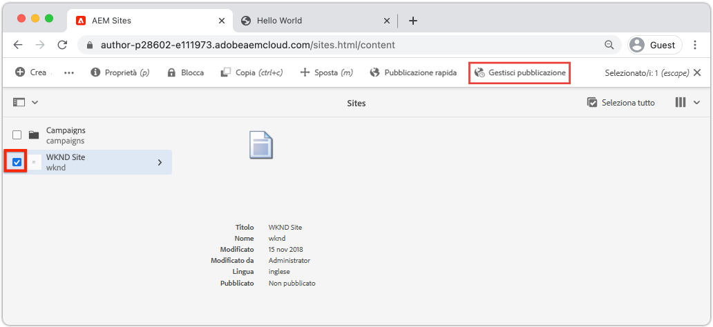

   Poiché si tratta di un nuovo sito, vogliamo pubblicare tutte le pagine e possiamo utilizzare la procedura guidata Gestisci pubblicazione per definire esattamente cosa deve essere pubblicato.

1. Sotto **Opzioni** lascia le impostazioni predefinite su **Pubblica** e la programmazione **Ora**. Fai clic su **Avanti**.
1. Sotto **Ambito**, seleziona **Sito WKND** e fai clic su **Includi impostazioni figlio**. Nella finestra di dialogo, seleziona **Includi elementi figlio**. Deseleziona le altre caselle per verificare che l’intero sito sia pubblicato.

   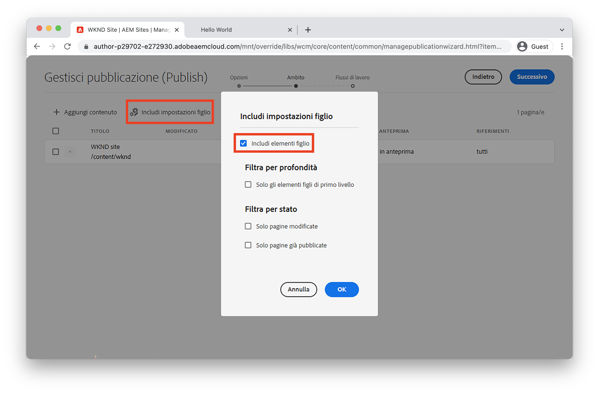

1. Fai clic sul pulsante **Riferimenti pubblicati** pulsante . Nella finestra di dialogo, verifica che tutto sia controllato. Ciò include **Modello di sito standard** e diverse configurazioni generate dal modello del sito. Fai clic su **Fine** da aggiornare.

   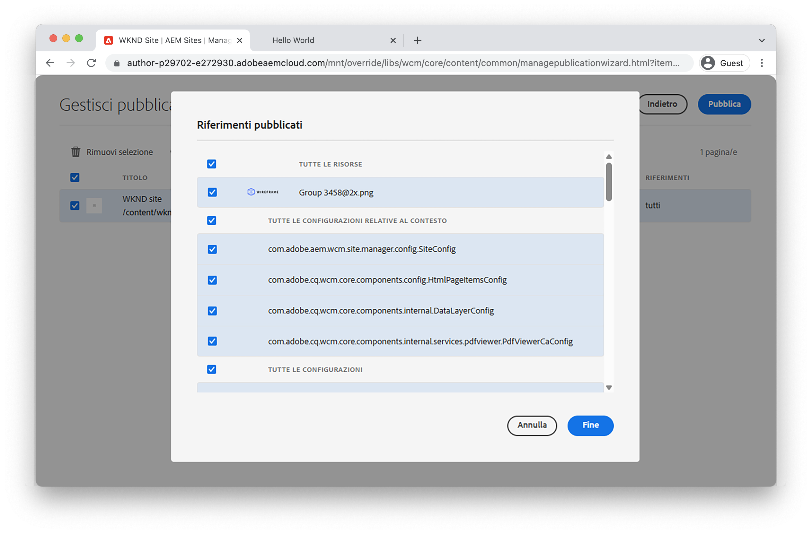

1. Infine, seleziona la casella accanto a **Sito WKND** e fai clic su **Successivo** nell&#39;angolo in alto a destra.
1. In **Flussi di lavoro** passo, immetti un **Titolo flusso di lavoro**. Può trattarsi di qualsiasi testo e può essere utile come parte di un audit trail successivo. Inserisci &quot;Pubblicazione iniziale&quot; e fai clic su **Pubblica**.

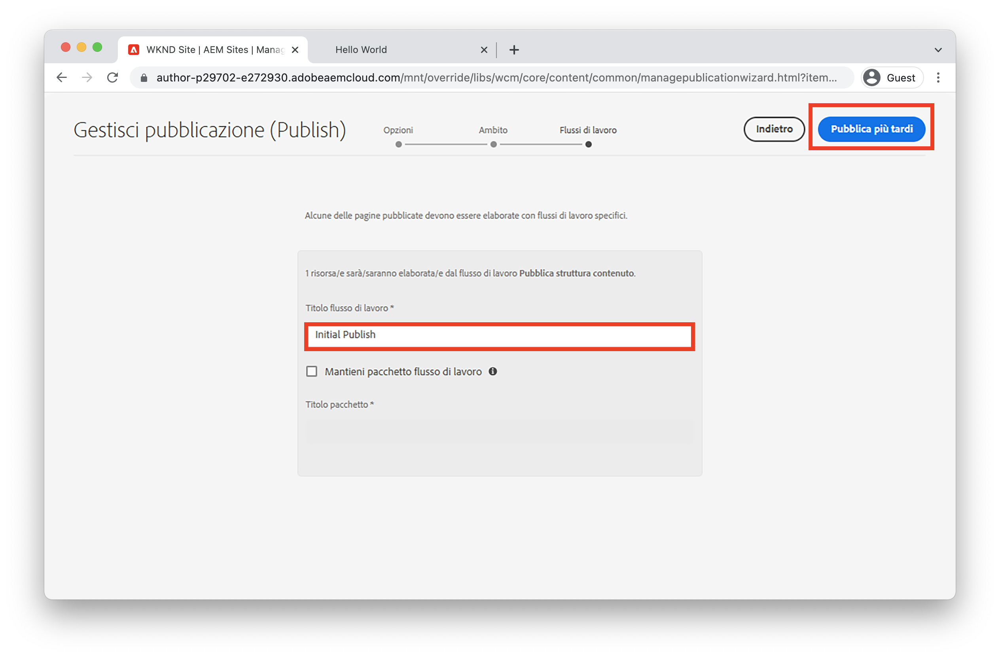

## Visualizza contenuto pubblicato {#publish}

Quindi, accedi al servizio Publish per visualizzare le modifiche.

1. Un modo semplice per ottenere l’URL del servizio di pubblicazione è quello di copiare l’URL dell’autore e sostituire il `author` parola con `publish`. Esempio:

   * **URL autore** - `https://author-pYYYY-eXXXX.adobeaemcloud.com/`
   * **URL di pubblicazione** - `https://publish-pYYYY-eXXXX.adobeaemcloud.com/`

1. Aggiungi `/content/wknd.html` all’URL di pubblicazione in modo che l’URL finale sia simile al seguente: `https://publish-pYYYY-eXXXX.adobeaemcloud.com/content/wknd.html`.

   >[!NOTE]
   >
   > Modifica `wknd.html` per corrispondere al nome del sito, se hai fornito un nome univoco durante [creazione di siti](create-site.md).

1. Passando all’URL di pubblicazione, il sito dovrebbe essere visualizzato senza alcuna funzionalità di authoring AEM.

   

1. Utilizzo della **Navigazione** clic del menu **Articolo** > **Hello World** per passare alla pagina Hello World creata in precedenza.
1. Torna a **AEM Author Service** e apporta alcune modifiche aggiuntive al contenuto nell’Editor pagina.
1. Pubblica queste modifiche direttamente dall’interno dell’editor di pagine facendo clic sul pulsante **Proprietà pagina** icona > **Pubblica pagina**

   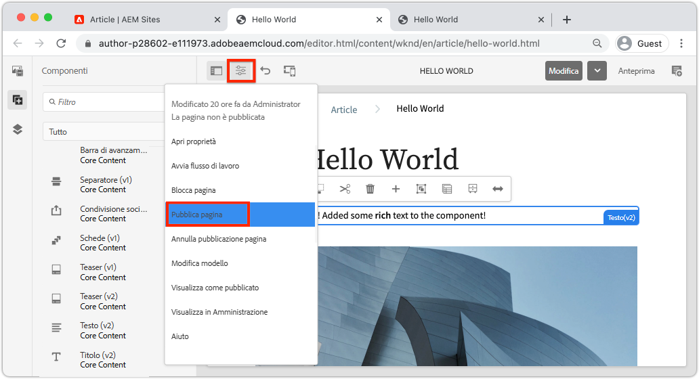

1. Torna a **Servizio di pubblicazione AEM** per visualizzare le modifiche. Molto probabilmente **not** visualizza immediatamente gli aggiornamenti. Questo perché il **Servizio di pubblicazione AEM** include [memorizzazione in cache tramite un server web Apache e CDN](https://experienceleague.adobe.com/docs/experience-manager-cloud-service/implementing/content-delivery/caching.html). Per impostazione predefinita, il contenuto di HTML viene memorizzato nella cache per circa 5 minuti.

1. Per ignorare la cache a scopo di test/debug, aggiungi semplicemente un parametro di query come `?nocache=true`. L’URL sarà simile a `https://publish-pYYYY-eXXXX.adobeaemcloud.com/content/wknd/en/article/hello-world.html?nocache=true`. Maggiori dettagli sulla strategia di caching e sulle configurazioni disponibili [si trova qui](https://experienceleague.adobe.com/docs/experience-manager-cloud-service/implementing/content-delivery/overview.html).

1. Puoi anche trovare l’URL del servizio Publish in Cloud Manager. Passa a **Programma Cloud Manager** > **Ambienti** > **Ambiente**.

   

   Sotto **Segmenti di ambiente** è possibile trovare collegamenti alla **Autore** e **Pubblica** servizi.

## Congratulazioni! {#congratulations}

Congratulazioni, hai appena creato e pubblicato le modifiche al tuo sito AEM!

### Passaggi successivi {#next-steps}

In un’implementazione reale, la pianificazione di un sito con modelli e progettazioni dell’interfaccia utente in genere precede la creazione del sito. Scopri come utilizzare i kit dell’interfaccia utente di Adobe XD per progettare e accelerare l’implementazione di Adobe Experience Manager Sites in [Pianificazione dell’interfaccia utente con Adobe XD](./ui-planning-adobe-xd.md).

Vuoi continuare a esplorare le funzionalità di AEM Sites? Sentitevi liberi di saltare direttamente nel capitolo su [Modelli di pagina](./page-templates.md) per comprendere la relazione tra un modello di pagina e una pagina.

