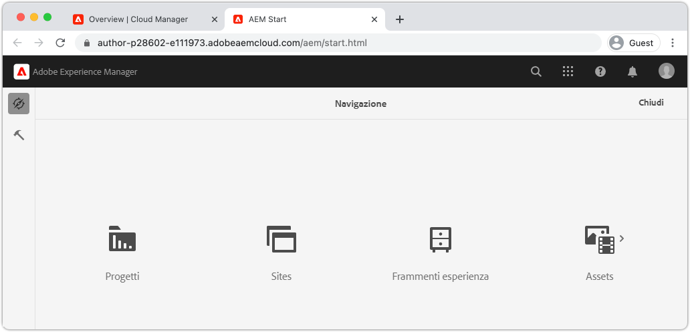
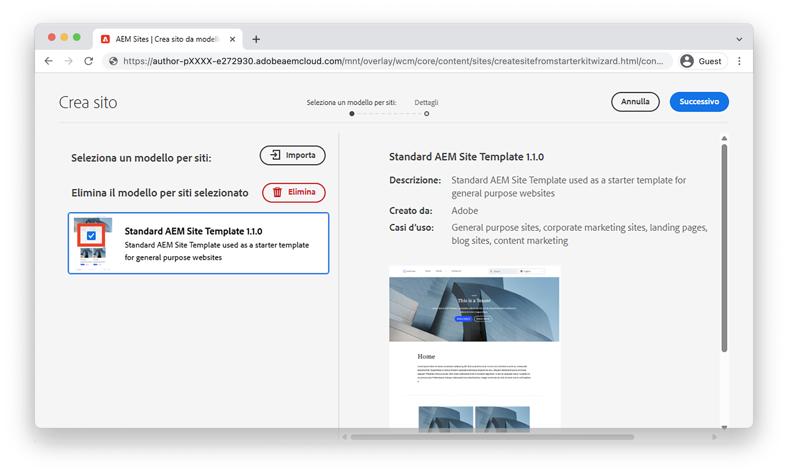
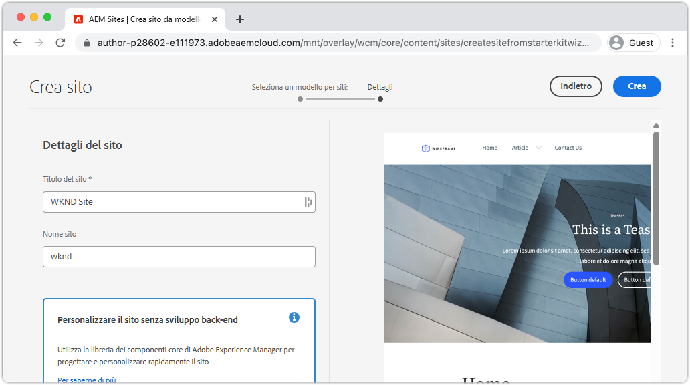
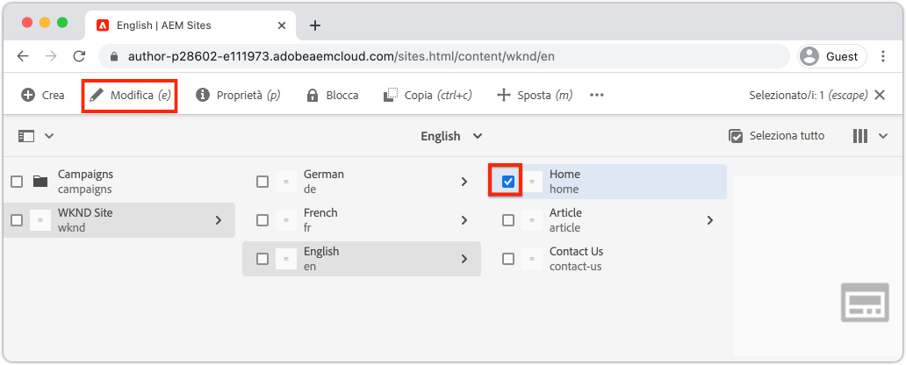
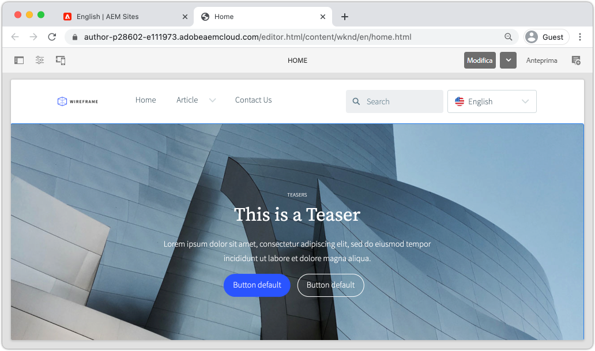

# Creare un sito {#create-site}

Come parte della Creazione Rapida dei Siti, utilizza la Creazione guidata Siti in Adobe Experience Manager, AEM, per generare un nuovo sito web. Il modello di sito standard fornito da Adobe viene utilizzato come punto di partenza per il nuovo sito.

## Prerequisiti {#prerequisites}

I passaggi descritti in questo capitolo si svolgono in un ambiente Adobe Experience Manager as a Cloud Service. Assicurati di disporre dell’accesso amministrativo all’ambiente AEM. Per completare questa esercitazione, si consiglia di utilizzare un [programma sandbox](https://experienceleague.adobe.com/docs/experience-manager-cloud-service/onboarding/getting-access/sandbox-programs/introduction-sandbox-programs.html) e un [ambiente di sviluppo](https://experienceleague.adobe.com/docs/experience-manager-cloud-service/implementing/using-cloud-manager/manage-environments.html).

Per questa esercitazione è possibile utilizzare anche gli ambienti del [programma di produzione](https://experienceleague.adobe.com/docs/experience-manager-cloud-service/content/implementing/using-cloud-manager/programs/introduction-production-programs.html); tuttavia, assicurati che le attività di questa esercitazione non influiscano sul lavoro eseguito sugli ambienti di destinazione, poiché questa esercitazione distribuisce il contenuto e il codice nell&#39;ambiente AEM di destinazione.

È possibile utilizzare [AEM SDK](https://experienceleague.adobe.com/docs/experience-manager-learn/cloud-service/local-development-environment-set-up/aem-runtime.html) per alcune parti di questa esercitazione. Aspetti di questo tutorial che si basano su servizi cloud, come [la distribuzione di temi con la pipeline front-end di Cloud Manager](https://experienceleague.adobe.com/docs/experience-manager-learn/getting-started-wknd-tutorial-develop/site-template/theming.html), non possono essere eseguiti su AEM SDK.

Per ulteriori dettagli, consulta la [documentazione sull&#39;onboarding](https://experienceleague.adobe.com/docs/experience-manager-cloud-service/onboarding/home.html).

## Obiettivo {#objective}

1. Scopri come generare un nuovo sito con la Creazione guidata.
1. Comprendere il ruolo dei modelli di sito.
1. Esplora il sito AEM generato.

## Accedi a Adobe Experience Manager Author {#author}

Come primo passo, accedi all’ambiente AEM as a Cloud Service. Gli ambienti AEM sono suddivisi tra un **Servizio di authoring** e un **Servizio di pubblicazione**.

* **Servizio di authoring** - in cui il contenuto del sito viene creato, gestito e aggiornato. In genere solo gli utenti interni hanno accesso al servizio **Author** e si trovano dietro una schermata di accesso.
* **Servizio di pubblicazione** - ospita il sito Web attivo. Si tratta del servizio che verrà visualizzato dagli utenti finali ed è generalmente disponibile al pubblico.

La maggior parte dell&#39;esercitazione si svolgerà utilizzando il servizio **Author**.

1. Passa a Adobe Experience Cloud [https://experience.adobe.com/](https://experience.adobe.com/). Accedi con il tuo account personale o aziendale/scolastico.
1. Verificare che nel menu sia selezionata l&#39;organizzazione corretta e fare clic su **Experience Manager**.

   

1. In **Cloud Manager** fare clic su **Launch**.
1. Passa il puntatore del mouse sul programma che desideri utilizzare e fai clic sull&#39;icona **Programma Cloud Manager**.

   

1. Nel menu principale fai clic su **Ambienti** per visualizzare gli ambienti per i quali è stato eseguito il provisioning.

1. Individuare l&#39;ambiente da utilizzare e fare clic sull&#39;**URL autore**.

   

   >[!NOTE]
   >
   >Per questa esercitazione si consiglia di utilizzare un ambiente **Sviluppo**.

1. È stata avviata una nuova scheda per il servizio **Author di AEM**. Fai clic su **Accedi con Adobe** e dovrai accedere automaticamente con le stesse credenziali Experience Cloud.

1. Dopo il reindirizzamento e l’autenticazione, ora viene visualizzata la schermata iniziale di AEM.

   

>[!NOTE]
>
> Problemi di accesso ad Experience Manager? Consulta la [documentazione sull&#39;onboarding](https://experienceleague.adobe.com/docs/experience-manager-cloud-service/onboarding/home.html)

## Scarica il modello di sito di base

Un modello di sito rappresenta un punto di partenza per un nuovo sito. Un modello di sito include alcuni temi di base, modelli di pagina, configurazioni e contenuti di esempio. Spetta esattamente allo sviluppatore il compito di includere nel modello di sito. Adobe fornisce un **modello di sito di base** per accelerare le nuove implementazioni.

1. Apri una nuova scheda del browser e passa al progetto Modello di sito di base su GitHub: [https://github.com/adobe/aem-site-template-standard](https://github.com/adobe/aem-site-template-standard). Il progetto è open-source ed è concesso in licenza per essere utilizzato da chiunque.
1. Fai clic su **Versioni** e passa alla [versione più recente](https://github.com/adobe/aem-site-template-standard/releases/latest).
1. Espandi il menu a discesa **Assets** e scarica il file zip del modello:

   

   Questo file zip viene utilizzato nell’esercizio successivo.

   >[!NOTE]
   >
   > Questa esercitazione è stata scritta con la versione **1.1.0** del modello di sito di base. Quando si avvia un nuovo progetto per l’utilizzo in produzione, si consiglia sempre di utilizzare la versione più recente.

## Crea un nuovo sito

Quindi, genera un nuovo sito utilizzando il Modello del sito dell&#39;esercizio precedente.

1. Torna all’ambiente AEM. Dalla schermata iniziale di AEM, passa a **Sites**.
1. Nell&#39;angolo superiore destro fare clic su **Crea** > **Sito (Modello)**. Verrà visualizzata la **Creazione guidata sito**.
1. In **Seleziona un modello di sito** fare clic sul pulsante **Importa**.

   Carica il file modello **.zip** scaricato dall&#39;esercizio precedente.

1. Seleziona il **modello di sito AEM di base** e fai clic su **Avanti**.

   

1. In **Dettagli sito** > **Titolo sito** immettere `WKND Site`.

   In un’implementazione reale, &quot;Sito WKND&quot; verrebbe sostituito dal nome del brand dell’azienda o dell’organizzazione. In questo tutorial, stiamo simulando la creazione di un sito per un brand di lifestyle fittizio &quot;WKND&quot;.

1. In **Nome sito** immettere `wknd`.

   

   >[!NOTE]
   >
   > Se utilizzi un ambiente AEM condiviso, aggiungi un identificatore univoco al **Nome sito**. Ad esempio `wknd-site-johndoe`. In questo modo più utenti possono completare la stessa esercitazione senza conflitti.

1. Fai clic su **Crea** per generare il sito. Fai clic su **Fine** nella finestra di dialogo **Operazione riuscita** al termine della creazione del sito Web da parte di AEM.

## Esplora il nuovo sito

1. Passa alla console AEM Sites, se non è già presente.
1. È stato generato un nuovo **sito WKND**. Includerà una struttura del sito con una gerarchia multilingue.
1. Apri la pagina **Inglese** > **Home** selezionando la pagina e facendo clic sul pulsante **Modifica** nella barra dei menu:

   

1. Il contenuto iniziale è già stato creato e sono disponibili diversi componenti da aggiungere a una pagina. Sperimenta questi componenti per un’idea delle funzionalità. Scopri le nozioni di base di un componente nel prossimo capitolo.

   

   *Contenuto di esempio fornito dal modello di sito*

## Congratulazioni. {#congratulations}

Congratulazioni, hai appena creato il tuo primo sito AEM.

### Passaggi successivi {#next-steps}

Utilizza l&#39;Editor pagina in Adobe Experience Manager, AEM, per aggiornare il contenuto del sito nel capitolo [Crea contenuto e pubblica](author-content-publish.md). Scopri come configurare i Componenti atomici per aggiornare il contenuto. Scopri la differenza tra gli ambienti Author e Publish di AEM e come pubblicare gli aggiornamenti sul sito live.
