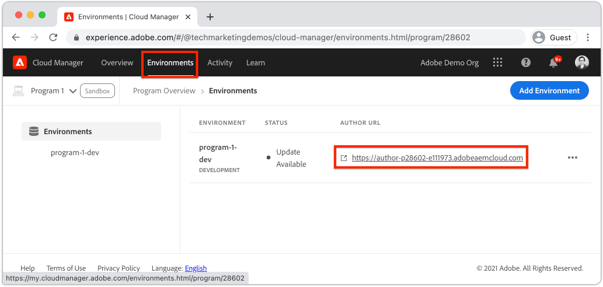

# Creare un sito {#create-site}

Come parte della Creazione rapida del sito, utilizza la Creazione guidata sito in Adobe Experience Manager, AEM, per generare un nuovo sito web. Il modello di sito standard fornito da Adobe viene utilizzato come punto di partenza per il nuovo sito.

## Prerequisiti {#prerequisites}

I passaggi descritti in questo capitolo si svolgeranno in un ambiente Adobe Experience Manager as a Cloud Service. Assicurati di disporre dell&#39;accesso amministrativo all&#39;ambiente AEM. Si consiglia di utilizzare un [Programma sandbox](https://experienceleague.adobe.com/docs/experience-manager-cloud-service/onboarding/getting-access/sandbox-programs/introduction-sandbox-programs.html) e [Ambiente di sviluppo](https://experienceleague.adobe.com/docs/experience-manager-cloud-service/implementing/using-cloud-manager/manage-environments.html) al completamento di questa esercitazione.

Consulta la sezione [documentazione di onboarding](https://experienceleague.adobe.com/docs/experience-manager-cloud-service/onboarding/home.html) per ulteriori dettagli.

## Obiettivo {#objective}

1. Scopri come utilizzare la Creazione guidata sito per generare un nuovo sito.
1. Comprendere il ruolo dei modelli di sito.
1. Esplora il sito AEM generato.

## Accedere ad Adobe Experience Manager Author {#author}

Come primo passo, accedi al tuo ambiente as a Cloud Service AEM. Gli ambienti AEM sono suddivisi tra **Servizio authoring** e **Servizio di pubblicazione**.

* **Servizio authoring** - creazione, gestione e aggiornamento del contenuto del sito. In genere solo gli utenti interni hanno accesso al **Servizio authoring** ed è dietro una schermata di accesso.
* **Servizio di pubblicazione** - ospita il sito web live. Questo è il servizio che gli utenti finali vedranno ed è generalmente disponibile al pubblico.

La maggior parte dell’esercitazione verrà effettuata utilizzando il **Servizio authoring**.

1. Passa a Adobe Experience Cloud [https://experience.adobe.com/](https://experience.adobe.com/). Accedi utilizzando il tuo account personale o un account aziendale/scuola.
1. Assicurati che nel menu sia selezionata l&#39;organizzazione corretta e fai clic su **Experience Manager**.

   

1. Sotto **Cloud Manager** click **Launch**.
1. Passa il puntatore del mouse sul programma da utilizzare e fai clic sul pulsante **Programma Cloud Manager** icona.

   

1. Nel menu principale fai clic su **Ambienti** per visualizzare gli ambienti con provisioning.

1. Trova l&#39;ambiente che desideri utilizzare e fai clic sul pulsante **URL autore**.

   

   >[!NOTE]
   >
   >Si consiglia di utilizzare un **Sviluppo** ambiente per questa esercitazione.

1. Viene avviata una nuova scheda al AEM **Servizio authoring**. Fai clic su **Accesso con Adobe** e dovresti aver effettuato l&#39;accesso automaticamente con le stesse credenziali Experience Cloud.

1. Dopo essere stato reindirizzato e autenticato, è ora possibile visualizzare la schermata iniziale AEM.

   

>[!NOTE]
>
> Hai problemi ad accedere ad Experience Manager? Consulta la sezione [documentazione di onboarding](https://experienceleague.adobe.com/docs/experience-manager-cloud-service/onboarding/home.html)

## Scarica il modello di sito di base

Un modello di sito fornisce un punto di partenza per un nuovo sito. Un modello di sito include alcuni temi di base, modelli di pagina, configurazioni e contenuti di esempio. Esattamente ciò che è incluso nel modello di sito dipende dallo sviluppatore. L&#39;Adobe fornisce un **Modello di sito di base** accelerare le nuove implementazioni.

1. Apri una nuova scheda del browser e passa al progetto Modello di sito di base su GitHub: [https://github.com/adobe/aem-site-template-standard](https://github.com/adobe/aem-site-template-standard). Il progetto è open-source e concesso in licenza per essere utilizzato da chiunque.
1. Fai clic su **Versioni** e naviga fino al [ultima versione](https://github.com/adobe/aem-site-template-standard/releases/più recente).
1. Espandi la **Risorse** e scarica il file zip modello:

   

   Questo file zip viene utilizzato nell&#39;esercizio successivo.

   >[!NOTE]
   >
   > Questa esercitazione viene scritta utilizzando la versione **1.1.0** del modello di sito di base. Quando si avvia un nuovo progetto per l’utilizzo in produzione, si consiglia sempre di utilizzare la versione più recente.

## Crea un nuovo sito

Quindi, genera un nuovo sito utilizzando il modello di sito dell&#39;esercizio precedente.

1. Torna all’ambiente AEM. Dalla schermata iniziale AEM passare a **Sites**.
1. Nell&#39;angolo in alto a destra fai clic su **Crea** > **Sito (modello)**. Questo farà nascere **Creazione guidata sito**.
1. Sotto **Selezionare un modello di sito** fai clic su **Importa** pulsante .

   Carica il **.zip** file modello scaricato dall&#39;esercizio precedente.

1. Seleziona la **Modello di sito AEM di base** e fai clic su **Successivo**.

   

1. Sotto **Dettagli sito** > **Titolo del sito** enter `WKND Site`.

   In un’implementazione reale, il termine &quot;Sito WKND&quot; viene sostituito dal nome del marchio dell’azienda o dell’organizzazione. In questa esercitazione, stiamo simulando la creazione di un sito per un brand fittizio di lifestyle &quot;WKND&quot;.

1. Sotto **Nome del sito** enter `wknd`.

   

   >[!NOTE]
   >
   > Se utilizzi un ambiente AEM condiviso, aggiungi un identificatore univoco al **Nome del sito**. Esempio `wknd-site-johndoe`. In questo modo, più utenti potranno completare la stessa esercitazione senza conflitti.

1. Fai clic su **Crea** per generare il sito. Fai clic su **Fine** in **Completato** al termine della creazione del sito Web, AEM finestra di dialogo.

## Esplora il nuovo sito

1. Se non è già presente, passa alla console AEM Sites .
1. Nuovo **Sito WKND** è stato generato. Includerà una struttura del sito con una gerarchia multilingue.
1. Apri **Inglese** > **Pagina principale** selezionando la pagina e facendo clic sul pulsante **Modifica** nella barra dei menu:

   

1. Il contenuto iniziale è già stato creato e diversi componenti possono essere aggiunti a una pagina. Sperimenta con questi componenti per avere un&#39;idea della funzionalità. Scoprirai le nozioni di base di un componente nel capitolo successivo.

   

   *Contenuto di esempio fornito dal modello di sito*

## Congratulazioni! {#congratulations}

Congratulazioni, avete appena creato il vostro primo sito AEM!

### Passaggi successivi {#next-steps}

Utilizza l’editor pagina in Adobe Experience Manager, AEM, per aggiornare il contenuto del sito nel [Creazione e pubblicazione di contenuti](author-content-publish.md) capitolo. Scopri come configurare i componenti atomici per l’aggiornamento dei contenuti. Scopri la differenza tra un ambiente di authoring e uno di pubblicazione AEM e come pubblicare gli aggiornamenti sul sito live.
