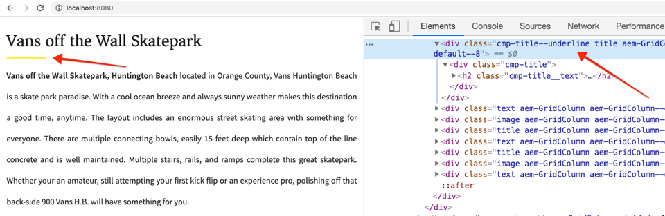
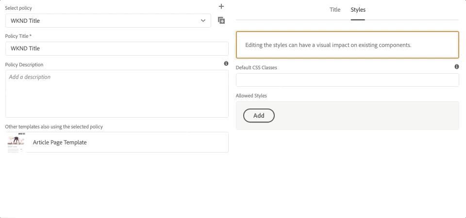
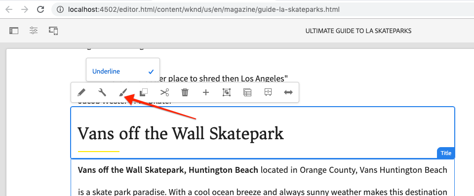
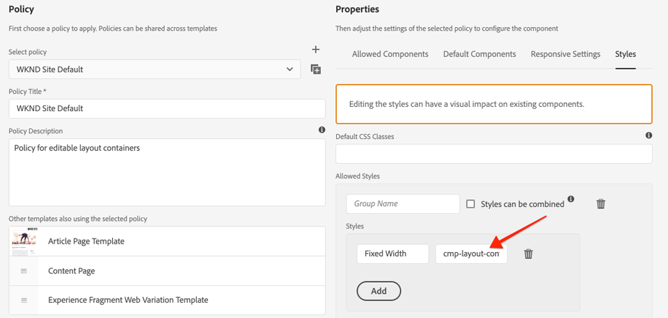

# Sviluppo con il sistema di stili {#developing-with-the-style-system}

Scopri come implementare singoli stili e riutilizzare i componenti core con  Experience Manager  Style System. Questa esercitazione illustra lo sviluppo di Style System per estendere i componenti core con CSS specifici del marchio e configurazioni di criteri avanzati dell&#39;Editor modelli.

## Prerequisiti {#prerequisites}

Esaminare le istruzioni e gli strumenti necessari per configurare un ambiente [di sviluppo](overview.md#local-dev-environment)locale.

Si consiglia inoltre di consultare le librerie lato [client e l&#39;esercitazione sul flusso di lavoro](client-side-libraries.md) front-end per comprendere le basi delle librerie lato client e i vari strumenti front-end incorporati nel progetto AEM.

### Progetto iniziale

Controlla il codice della riga di base su cui si basa l&#39;esercitazione:

1. Duplicate l&#39;archivio [github.com/adobe/aem-guides-wknd](https://github.com/adobe/aem-guides-wknd) .
1. Estrarre il `style-system/start` ramo

   ```shell
   $ git clone git@github.com:adobe/aem-guides-wknd.git ~/code/aem-guides-wknd
   $ cd ~/code/aem-guides-wknd
   $ git checkout style-system/start
   ```

1. Distribuisci la base di codice in un&#39;istanza AEM locale utilizzando le tue competenze Paradiso:

   ```shell
   $ cd ~/code/aem-guides-wknd
   $ mvn clean install -PautoInstallSinglePackage
   ```

È sempre possibile visualizzare il codice finito su [GitHub](https://github.com/adobe/aem-guides-wknd/tree/style-system/solution) o estrarre il codice localmente passando al ramo `style-system/solution`.

## Obiettivo

1. Scoprite come utilizzare il sistema di stile per applicare CSS specifico del marchio a AEM componenti core.
1. Scopri la notazione BEM e come utilizzarla per definire con attenzione gli stili di ambito.
1. Applica configurazioni di criteri avanzate con Modelli modificabili.

## Cosa verrà creato {#what-you-will-build}

In questo capitolo verrà utilizzata la funzione [Sistema di](https://docs.adobe.com/content/help/en/experience-manager-learn/sites/page-authoring/style-system-feature-video-use.html) stile per creare diverse varianti di componenti utilizzati nella pagina Articolo. Verrà inoltre utilizzato il sistema di stile per creare varianti per elementi strutturali quali il contenitore Intestazione/Piè di pagina e Layout.

>[!VIDEO](https://video.tv.adobe.com/v/30386/?quality=12&learn=on)

## Sfondo {#background}

Il [Style System](https://docs.adobe.com/content/help/it-IT/experience-manager-65/developing/components/style-system.html) consente agli sviluppatori e agli editor di modelli di creare più varianti visive di un componente. Gli autori possono quindi scegliere lo stile da usare per la composizione di una pagina. Nel resto dell&#39;esercitazione verrà utilizzato lo Style System per ottenere diversi stili univoci, sfruttando i componenti core in un approccio basato su codice basso.

L’idea generale del sistema di stile è che gli autori possono scegliere vari stili per l’aspetto di un componente. Gli &quot;stili&quot; sono supportati da ulteriori classi CSS inserite nel div esterno di un componente. Nelle librerie client le regole CSS vengono aggiunte in base a queste classi di stile in modo che il componente cambi aspetto.

È possibile trovare la documentazione [dettagliata per Style System qui](https://docs.adobe.com/content/help/it-IT/experience-manager-65/developing/components/style-system.html). C&#39;è anche un grande video [tecnico per capire il Sistema](https://docs.adobe.com/content/help/en/experience-manager-learn/sites/developing/style-system-technical-video-understand.html)Stile.

## Stile componente titolo {#title-component}

A questo punto, il componente [](https://docs.adobe.com/content/help/en/experience-manager-core-components/using/components/title.html) Titolo è stato incluso nel progetto in `/apps/wknd/components/content/title` come parte del modulo **ui.apps** . Gli stili predefiniti degli elementi Titolo (`H1`, `H2`, `H3`...) sono già stati implementati nel modulo **ui.frontend** nel `_elements.scss` file in `ui.frontend/src/main/webpack/base/sass/_elements.scss`.

### Stile sottolineatura

Le strutture [degli articoli](assets/pages-templates/wknd-article-design.xd) WKND contengono uno stile univoco per il componente Titolo con una sottolineatura. Anziché creare due componenti o modificare la finestra di dialogo dei componenti, il sistema di stile può essere utilizzato per consentire agli autori di aggiungere uno stile di sottolineatura.


###  Inspect Title Component Markup

Come sviluppatore front-end, il primo passo per definire lo stile di un componente core consiste nel comprendere il codice generato dal componente.

Come parte del progetto generato, il progetto archetype embedded **Core Component Examples (Esempi** di componenti core incorporati). Per gli sviluppatori e gli autori di contenuti, questo contiene un riferimento semplice per comprendere tutte le funzioni disponibili con i componenti core. È [disponibile](https://opensource.adobe.com/aem-core-wcm-components/library.html)anche una versione dal vivo.

1. Aprite un nuovo browser e visualizzate il componente Titolo:

   Istanza AEM locale: [http://localhost:4502/editor.html/content/core-components-examples/library/title.html](http://localhost:4502/editor.html/content/core-components-examples/library/title.html)

   Live example: [https://opensource.adobe.com/aem-core-wcm-components/library/title.html](https://opensource.adobe.com/aem-core-wcm-components/library/title.html)

1. Di seguito è riportata la marcatura per il componente Titolo:

   ```html
   <div class="cmp-title">
       <h1 class="cmp-title__text">Lorem Ipsum</h1>
   </div>
   ```

   Notazione BEM del componente Titolo:

   ```plain
   BLOCK cmp-title
       ELEMENT cmp-title__text
   ```

1. Il sistema Style aggiunge una classe CSS al div esterno che circonda il componente. Di conseguenza, il markup a cui verrà indirizzato il targeting sarà simile a quanto segue:

   ```html
   <div class="STYLE-SYSTEM-CLASS-HERE"> <!-- Custom CSS class - implementation gets to define this -->
       <div class="cmp-title">
           <h1 class="cmp-title__text">Lorem Ipsum</h1>
       </div>
   </div>
   ```

### Implementa lo stile sottolineatura - ui.frontend

Successivamente implementeremo lo stile Sottolineato utilizzando il modulo **ui.frontend** del nostro progetto. Utilizzeremo il server di sviluppo webpack fornito con il modulo **ui.frontend** per visualizzare in anteprima gli stili *prima* di distribuirli in un&#39;istanza locale di AEM.

1. Avviate il server webpack dev eseguendo il seguente comando dal modulo **ui.frontend** :

   ```shell
   $ cd ~/code/aem-guides-wknd/ui.frontend/
   $ npm start
   
   > aem-maven-archetype@1.0.0 start code/aem-guides-wknd/ui.frontend
   > webpack-dev-server --open --config ./webpack.dev.js
   ```

   Viene aperto un browser all’indirizzo [http://localhost:8080](Http://localhost:8080).

   >[!NOTE]
   >
   > Se le immagini appaiono interrotte, accertatevi che il progetto iniziale sia stato distribuito in un&#39;istanza locale di AEM (in esecuzione sulla porta 4502) e che il browser utilizzato abbia eseguito l&#39;accesso anche all&#39;istanza AEM locale.

   

1. In Eclipse o nell’IDE di vostra scelta, aprite il file `index.html` situato in: `ui.frontend/src/main/webpack/static/index.html`. Si tratta del markup statico utilizzato dal server di sviluppo webpack.
1. Per `index.html` trovare un’istanza del componente Titolo a cui aggiungere lo stile sottolineato, cercare nel documento *cmp-title*. Scegliete il componente Titolo con il testo *&quot;Vans off the Wall Skatepark&quot;* (riga 218). Aggiungete la classe `cmp-title--underline` al div circostante:

   ```html
    <!-- before -->
    <div class="title aem-GridColumn aem-GridColumn--default--8">
        <div class="cmp-title">
            <h2 class="cmp-title__text">Vans off the Wall Skatepark</h2>
        </div>
    </div>
   ```

   ```html
    <!-- After -->
    <div class="cmp-title--underline title aem-GridColumn aem-GridColumn--default--8">
        <div class="cmp-title">
            <h2 class="cmp-title__text">Vans off the Wall Skatepark</h2>
        </div>
    </div>
   ```

1. Tornate al browser e verificate che la classe supplementare sia riflessa nella marcatura.
1. Tornate al modulo **ui.frontend** e aggiornate il file `title.scss` che si trova in: `ui.frontend/src/main/webpack/components/content/title/scss/title.scss`:

   ```css
   /* Add Title Underline Style */
   .cmp-title--underline {
   
       .cmp-title {
       }
   
       .cmp-title__text {
           &:after {
           display: block;
               width: 84px;
               padding-top: 8px;
               content: '';
               border-bottom: 2px solid $brand-primary;
           }
       }
   }
   ```

   >[!NOTE]
   >
   >È consigliabile estendere sempre gli stili in modo stretto al componente di destinazione. In questo modo gli stili aggiuntivi non influiscono sulle altre aree della pagina.
   >
   >Tutti i componenti core aderiscono alla notazione **[](https://github.com/adobe/aem-core-wcm-components/wiki/css-coding-conventions)** BEM. È consigliabile eseguire il targeting della classe CSS esterna quando si crea uno stile predefinito per un componente. Un&#39;altra procedura consigliata consiste nel eseguire il targeting dei nomi delle classi specificati dalla notazione BEM dei componenti core invece che degli elementi HTML.

1. Tornate nuovamente nel browser e vedrete lo stile Sottolineato aggiunto:

   

1. Arrestate il server di sviluppo del webpack.

### Aggiunta di un criterio di titolo

Successivamente è necessario aggiungere un nuovo criterio per i componenti Titolo per consentire agli autori di contenuti di scegliere lo stile Sottolineato da applicare a componenti specifici. A tal fine, si utilizza l&#39;Editor modelli in AEM.

1. Distribuisci la base di codice in un&#39;istanza AEM locale utilizzando le tue competenze Paradiso:

   ```shell
   $ cd ~/code/aem-guides-wknd
   $ mvn clean install -PautoInstallSinglePackage
   ```

1. Passate al modello **pagina** articolo, che si trova in: [http://localhost:4502/editor.html/conf/wknd/settings/wcm/templates/article-page-template/structure.html](http://localhost:4502/editor.html/conf/wknd/settings/wcm/templates/article-page-template/structure.html).

1. In modalità **Struttura** , nel contenitore **di** layout principale, selezionate l’icona **Criterio** accanto al componente **Titolo** elencato in Componenti ** consentiti:

   

1. Crea un nuovo criterio per il componente Titolo con i seguenti valori:

   *Titolo criterio **: **Titolo WKND**

   *Proprietà* > scheda ** Stili > *Aggiungi un nuovo stile*

   **Sottolineato** : `cmp-title--underline`

   

   Fate clic su **Fine** per salvare le modifiche al criterio Titolo.

   >[!NOTE]
   >
   > Il valore `cmp-title--underline` corrisponde alla classe CSS di cui avevamo eseguito il targeting in precedenza durante lo sviluppo nel modulo **ui.frontend** .

### Applica stile sottolineatura

Infine, come autore, possiamo scegliere di applicare lo stile sottolineato ad alcuni componenti titolo.

1. Andate all&#39;articolo **La Skateparks** nell&#39;editor AEM Sites  all&#39;indirizzo: [http://localhost:4502/editor.html/content/wknd/us/en/magazine/guide-la-skateparks.html](http://localhost:4502/editor.html/content/wknd/us/en/magazine/guide-la-skateparks.html)
1. In modalità **Modifica** , scegliete un componente Titolo. Fate clic sull’icona del **pennello** e selezionate lo stile **Sottolineato** :

   

   In qualità di autore, potete attivare/disattivare lo stile.

1. Fate clic sull’icona Informazioni **** pagina > **Visualizza come pubblicato** per esaminare la pagina all’esterno dell’editor AEM.

   

   Utilizzate gli strumenti di sviluppo del browser per verificare che la marcatura intorno al componente Titolo sia applicata `cmp-title--underline` al div esterno.

## Stile componente testo {#text-component}

Quindi, si ripeteranno passaggi simili per applicare uno stile univoco al componente [](https://docs.adobe.com/content/help/en/experience-manager-core-components/using/components/text.html)Testo. Il componente Testo è stato proxy nel progetto in `/apps/wknd/components/content/text` come parte del modulo **ui.apps** . Gli stili predefiniti degli elementi di paragrafo sono già stati implementati nel modulo **ui.frontend** nel `_elements.scss` file in `ui.frontend/src/main/webpack/base/sass/_elements.scss`.

### Stile blocco preventivo

Le strutture [degli articoli](assets/pages-templates/wknd-article-design.xd) WKND contengono uno stile univoco per il componente Testo con un blocco di virgolette:


###  Inspect Text Component Markup

Anche in questo caso, verrà esaminata la marcatura del componente Testo.

1. Apri un nuovo browser e visualizza il componente Testo come parte della Libreria componenti core:
Istanza AEM locale: [http://localhost:4502/editor.html/content/core-components-examples/library/text.html](http://localhost:4502/editor.html/content/core-components-examples/library/text.html)

   Live example: [https://opensource.adobe.com/aem-core-wcm-components/library/text.html](https://opensource.adobe.com/aem-core-wcm-components/library/text.html)

1. Di seguito è riportata la marcatura per il componente Testo:

   ```html
   <div class="cmp-text">
       <p><b>Bold </b>can be used to emphasize a word or phrase, as can <u>underline</u> and <i>italics.&nbsp;</i><sup>Superscript</sup> and <sub>subscript</sub> are useful for mathematical (E = mc<sup>2</sup>) or scientific (h<sub>2</sub>O) expressions. Paragraph styles can provide alternative renderings, such as quote sections:</p>
       <blockquote>"<i>Be yourself; everyone else is already taken"</i></blockquote>
       <b>- Oscar Wilde</b>
   </div>
   ```

   Notazione BEM del componente Titolo:

   ```plain
   BLOCK cmp-text
       ELEMENT
   ```

1. Il sistema Style aggiunge una classe CSS al div esterno che circonda il componente. Di conseguenza, il markup a cui verrà indirizzato il targeting sarà simile a quanto segue:

   ```html
   <div class="STYLE-SYSTEM-CLASS-HERE"> <!-- Custom CSS class - implementation gets to define this -->
       <div class="cmp-text">
           <p><b>Bold </b>can be used to emphasize a word or phrase, as can <u>underline</u> and <i>italics.&nbsp;</i><sup>Superscript</sup> and <sub>subscript</sub> are useful for mathematical (E = mc<sup>2</sup>) or scientific (h<sub>2</sub>O) expressions. Paragraph styles can provide alternative renderings, such as quote sections:</p>
           <blockquote>"<i>Be yourself; everyone else is already taken"</i></blockquote>
           <b>- Oscar Wilde</b>
       </div>
   </div>
   ```

### Implementa lo stile del blocco di quote - ui.frontend

In seguito verrà implementato lo stile Blocco preventivo utilizzando il modulo **ui.frontend** del nostro progetto.

1. Avviate il server webpack dev eseguendo il seguente comando dal modulo **ui.frontend** :

   ```shell
   $ cd ~/code/aem-guides-wknd/ui.frontend/
   $ npm start
   
   > aem-maven-archetype@1.0.0 start code/aem-guides-wknd/ui.frontend
   > webpack-dev-server --open --config ./webpack.dev.js
   ```

1. In Eclipse o nell’IDE di vostra scelta, aprite il file `index.html` situato in: `ui.frontend/src/main/webpack/static/index.html`. Si tratta del markup statico utilizzato dal server di sviluppo webpack.
1. Per `index.html` trovare un’istanza del componente Testo, cercare il testo *&quot;Jacob Wester&quot;* (riga 210). Aggiungete la classe `cmp-text--quote` al div circostante:

   ```html
    <!-- before -->
    <div class="text aem-GridColumn aem-GridColumn--default--8">
        <div class="cmp-text">
            <blockquote>"There is no better place to shred then Los Angeles"</blockquote>
            <p>Jacob Wester - Pro Skater</p>
        </div>
    </div>
   ```

   ```html
    <!-- After -->
    <div class="cmp-text--quote text aem-GridColumn aem-GridColumn--default--8">
        <div class="cmp-text">
            <blockquote>"There is no better place to shred then Los Angeles"</blockquote>
            <p>Jacob Wester - Pro Skater</p>
        </div>
    </div>
   ```

1. Tornate al browser e verificate che la classe supplementare sia riflessa nella marcatura.
1. Tornate al modulo **ui.frontend** e aggiornate il file `text.scss` che si trova in: `ui.frontend/src/main/webpack/components/content/text/scss/text.scss`:

   ```css
   /* WKND Text Quote style */
   
   .cmp-text--quote {
   
       .cmp-text {
           background-color: $brand-third;
           margin: 1em 0em;
           padding: 1em;
   
           blockquote {
               border: none;
               font-size: $font-size-h2;
               font-family: $font-family-serif;
               padding: 14px 14px;
               margin: 0;
               margin-bottom: 0.5em;
   
               &:after {
                   border-bottom: 2px solid $brand-primary; /*yellow border */
                   content: '';
                   display: block;
                   position: relative;
                   top: 0.25em;
                   width: 80px;
               }
           }
   
           p {
               font-size:    $font-size-large;
               font-family:  $font-family-serif;
           }
       }
   }
   ```

   >[!CAUTION]
   >
   > In questo caso, gli elementi HTML non elaborati sono interessati dagli stili. Questo perché il componente Testo fornisce un editor Rich Text per gli autori di contenuti. La creazione di stili direttamente rispetto ai contenuti RTE deve essere effettuata con attenzione ed è ancora più importante definire gli stili in modo più preciso.

1. Tornate nuovamente nel browser e vedrete lo stile del blocco Quote aggiunto:

   

1. Arrestate il server di sviluppo del webpack.

### Aggiungere un criterio di testo

Aggiungere quindi un nuovo criterio per i componenti Testo.

1. Distribuisci la base di codice in un&#39;istanza AEM locale utilizzando le tue competenze Paradiso:

   ```shell
   $ cd ~/code/aem-guides-wknd
   $ mvn clean install -PautoInstallSinglePackage
   ```

1. Passate al modello **pagina** articolo, che si trova in: [http://localhost:4502/editor.html/conf/wknd/settings/wcm/templates/article-page-template/structure.html](http://localhost:4502/editor.html/conf/wknd/settings/wcm/templates/article-page-template/structure.html).

1. In modalità **Struttura** , nel contenitore **di** layout principale, selezionate l’icona **Criterio** accanto al componente **Testo** elencato in Componenti ** consentiti:

   

1. Create un nuovo criterio per il componente Testo con i seguenti valori:

   *Titolo criterio **: **Testo WKND**

   *Plug-in* > Stili *di* paragrafo > *Abilita stili di paragrafo*

   *Scheda* Stili > *Aggiungi un nuovo stile*

   **Blocco** preventivo: `cmp-text--quote`

   

   

   Fate clic su **Fine** per salvare le modifiche al criterio Testo.

### Applica stile blocco preventivo

1. Andate all&#39;articolo **La Skateparks** nell&#39;editor AEM Sites  all&#39;indirizzo: [http://localhost:4502/editor.html/content/wknd/us/en/magazine/guide-la-skateparks.html](http://localhost:4502/editor.html/content/wknd/us/en/magazine/guide-la-skateparks.html)
1. In modalità **Modifica** , scegliete un componente Testo. Modificate il componente per includere un elemento di offerta:

   

1. Selezionate il componente di testo e fate clic sull’icona del **pennello** , quindi selezionate lo stile Blocco **** preventivo:

   

   In qualità di autore, potete attivare/disattivare lo stile.

## Contenitore di layout {#layout-container}

I Contenitori di layout sono stati utilizzati per creare la struttura di base del Modello pagina articolo e fornire le zone di rilascio per consentire agli autori di contenuti di aggiungere contenuto in una pagina. I Contenitori di layout possono anche sfruttare il sistema di stile, fornendo agli autori dei contenuti ulteriori opzioni per la progettazione dei layout.

Attualmente una regola CSS viene applicata all&#39;intera pagina applicando una larghezza fissa. Al contrario, un approccio più flessibile consiste nel creare uno stile di larghezza **** fissa che gli autori dei contenuti possano attivare/disattivare.

### Implementare lo stile a larghezza fissa - ui.frontend

Inizieremo ad implementare lo stile Larghezza fissa nel modulo **ui.frontend** del nostro progetto.

1. Avviate il server webpack dev eseguendo il seguente comando dal modulo **ui.frontend** :

   ```shell
   $ cd ~/code/aem-guides-wknd/ui.frontend/
   $ npm start
   ```

1. Open the file `index.html` located at: `ui.frontend/src/main/webpack/static/index.html`.
1. Vogliamo che il corpo del nostro Modello pagina articolo abbia una larghezza fissa, lasciando l&#39;Intestazione e il Piè di pagina liberi di espandersi. Pertanto, si desidera eseguire il targeting del secondo `<div class='responsivegrid aem-GridColumn aem-GridColumn--default--12'` (Contenitore di layout) tra i due frammenti esperienza (riga 136)

   

1. Aggiungete la classe `cmp-layout-container--fixed` alla classe `div` identificata nel passaggio precedente.

   ```html
   <!-- Experience Fragment Header -->
   <div class="experiencefragment aem-GridColumn aem-GridColumn--default--12">
       ...
   </div>
   <!-- Main body Layout Container -->
   <div class="responsivegrid cmp-layout-container--fixed aem-GridColumn aem-GridColumn--default--12">
       ...
   </div>
   <!-- Experience Fragment Footer -->
   <div class="experiencefragment aem-GridColumn aem-GridColumn--default--12">
       ...
   </div>
   ```

1. Aggiorna il file `container.scss` in: `ui.frontend/src/main/webpack/components/content/container/scss/container.scss`:

   ```css
   /* WKND Layout Container - Fixed Width */
   
   .cmp-layout-container--fixed {
       @media (min-width: $screen-medium + 1) {
           display:block;
           max-width:  $max-width !important;
           float: unset !important;
           margin: 0 auto !important;
           padding: 0 $gutter-padding;
           clear: both !important;
       }
   }
   ```

1. Aggiorna il file `_elements.scss` in: `ui.frontend/src/main/webpack/base/sass/_elements.scss` e modificate la `.root` regola in modo che la nuova larghezza massima sia impostata sulla variabile `$max-body-width`.

   ```css
    /* Before */
    body {
        ...
   
        .root {
            max-width: $max-width;
            margin: 0 auto;
            padding-top: 12px;
        }
    }
   ```

   ```css
    /* After */
    body {
        ...
   
        .root {
            max-width: $max-body-width;
            margin: 0 auto;
            padding-top: 12px;
        }
    }
   ```

   >[!NOTE]
   >
   > L&#39;elenco completo delle variabili e dei valori è disponibile all&#39;indirizzo: `ui.frontend/src/main/webpack/base/sass/_variables.scss`.

1. Tornando al browser, il contenuto principale della pagina appare lo stesso ma le intestazioni e i piè di pagina si estendono molto più in là. Questo è previsto.

   

### Aggiornamento dei criteri per i contenitori di layout

Successivamente verrà aggiunto lo stile Larghezza fissa aggiornando i criteri Contenitore di layout in AEM.

1. Distribuisci la base di codice in un&#39;istanza AEM locale utilizzando le tue competenze Paradiso:

   ```shell
   $ cd ~/code/aem-guides-wknd
   $ mvn clean install -PautoInstallSinglePackage
   ```

1. Passate al modello **pagina** articolo, che si trova in: [http://localhost:4502/editor.html/conf/wknd/settings/wcm/templates/article-page-template/structure.html](http://localhost:4502/editor.html/conf/wknd/settings/wcm/templates/article-page-template/structure.html).

1. In modalità **Struttura** , selezionate il contenitore **di** layout principale (tra l&#39;intestazione del frammento esperienza e il piè di pagina), quindi selezionate l&#39;icona **Criterio** .

   

1. Aggiornate il criterio **WKND Site Default** per includere uno stile aggiuntivo per Larghezza **** fissa con un valore di `cmp-layout-container--fixed`:

   

   Salvate le modifiche e fate riferimento alla pagina Modello pagina articolo.

1. Selezionate di nuovo il contenitore **** di layout principale (tra l’intestazione del frammento esperienza e il piè di pagina). Questa volta deve comparire l&#39;icona del **pennello** ed è possibile selezionare Larghezza **** fissa dal menu a discesa dello stile.

   

   Dovrebbe essere possibile attivare/disattivare gli stili.

1. Andate all&#39;articolo **La Skateparks** nell&#39;editor AEM Sites  all&#39;indirizzo: [http://localhost:4502/editor.html/content/wknd/us/en/magazine/guide-la-skateparks.html](http://localhost:4502/editor.html/content/wknd/us/en/magazine/guide-la-skateparks.html). Dovresti vedere il contenitore a larghezza fissa in azione.

## Intestazione/Piè di pagina - Frammento esperienza {#experience-fragment}

Quindi, aggiungeremo gli stili a Intestazione e Piè di pagina per completare il Modello pagina articolo. Intestazione e piè di pagina sono stati implementati come frammento esperienza, ovvero un raggruppamento di componenti all’interno di un contenitore. Possiamo applicare una classe CSS univoca ai componenti Frammento esperienza, come altri componenti di base con il sistema di stile.

### Implementa lo stile dell&#39;intestazione - ui.frontend

I componenti all’interno del componente Intestazione sono già formattati in modo che corrispondano alle strutture [](assets/pages-templates/wknd-article-design.xd)AdobeXD. Sono necessarie solo alcune piccole modifiche al layout.

1. Avviate il server webpack dev eseguendo il seguente comando dal modulo **ui.frontend** :

   ```shell
   $ cd ~/code/aem-guides-wknd/ui.frontend/
   $ npm start
   ```

1. Open the file `index.html` located at: `ui.frontend/src/main/webpack/static/index.html`.
1. Trovate la **prima** istanza del componente Frammento esperienza cercando *class=&quot;experience fragment* (riga 48).
1. Aggiungete la classe `cmp-experiencefragment--header` alla classe `div` identificata nel passaggio precedente.

   ```html
       ...
       <div class="root responsivegrid">
           <div class="aem-Grid aem-Grid--12 aem-Grid--default--12 ">
   
           <!-- add cmp-experiencefragment--header -->
           <div class="experiencefragment cmp-experiencefragment--header aem-GridColumn aem-GridColumn--default--12">
               ...
   ```

1. Open the file `experiencefragment.scss` located at: `ui.frontend/src/main/webpack/components/content/experiencefragment/scss/experiencefragment.scss`. Aggiungete i seguenti stili al file:

   ```css
   /* Header Style */
   .cmp-experiencefragment--header {
   
       .cmp-experiencefragment {
           max-width: $max-width;
           margin: 0 auto;
       }
   
       /* Logo Image */
       .cmp-image__image {
           max-width: 8rem;
           margin-top: $gutter-padding / 2;
           margin-bottom: $gutter-padding / 2;
       }
   
       @media (max-width: $screen-medium) {
   
           .cmp-experiencefragment {
               padding-top: 1rem;
               padding-bottom: 1rem;
           }
           /* Logo Image */
           .cmp-image__image {
               max-width: 6rem;
               margin-top: .75rem;
           }
       }
   }
   ```

   >[!CAUTION]
   >
   > Stiamo prendendo un po&#39; di scorciatoia per stilare il Logo all&#39;interno dell&#39;intestazione. Il logo è solo un componente Immagine che si trova all’interno del frammento esperienza. Diciamo che in seguito abbiamo dovuto aggiungere un&#39;altra immagine all&#39;intestazione, non saremmo stati in grado di distinguere tra le due. Se necessario, al componente Immagine potrebbe sempre essere aggiunta una classe &quot;logo&quot;.

1. Tornate al browser e visualizzate il server di sviluppo webpack. Gli stili di intestazione dovrebbero essere aggiornati per essere più allineati al resto del contenuto. Quando si riduce la larghezza del browser a un tablet o dispositivo mobile, è necessario notare che il logo è stato ridimensionato in modo più appropriato.

   

### Implementare lo stile piè di pagina - ui.frontend

Il piè di pagina nelle progettazioni [](assets/pages-templates/wknd-article-design.xd) AdobeXD include uno sfondo nero con testo chiaro. Per riflettere questo aspetto, sarà necessario formattare il contenuto all’interno del piè di pagina del frammento esperienza.

1. Open the file `index.html` located at: `ui.frontend/src/main/webpack/static/index.html`.

1. Trovate la **seconda** istanza del componente Frammento esperienza cercando *class=&quot;experience fragment* (riga 385).

1. Aggiungete la classe `cmp-experiencefragment--footer` alla classe `div` identificata nel passaggio precedente.

   ```html
   <!-- add cmp-experiencefragment--footer -->
   <div class="experiencefragment cmp-experiencefragment--footer aem-GridColumn aem-GridColumn--default--12">
   ```

1. Apri di nuovo il file `experiencefragment.scss` in: `ui.frontend/src/main/webpack/components/content/experiencefragment/scss/experiencefragment.scss`. **Aggiungete** al file i seguenti stili:

   ```css
   /* Footer Style */
   .cmp-experiencefragment--footer {
   
       background-color: $black;
       color: $gray-light;
       margin-top: 5rem;
   
       p {
           font-size: $font-size-small;
       }
   
       .cmp-experiencefragment {
           max-width: $max-width;
           margin: 0 auto;
           padding-bottom: 0rem;
       }
   
       /* Separator */
       .cmp-separator {
           margin-top: 2rem;
           margin-bottom: 2rem;
       }
   
       .cmp-separator__horizontal-rule {
           border: 0;
       }
   
       /* Navigation */
       .cmp-navigation__item-link {
           color: $nav-link-inverse;
           &:hover,
           &:focus {
               background-color: unset;
               text-decoration: underline;
           }
       }
   
       .cmp-navigation__item--level-1.cmp-navigation__item--active .cmp-navigation__item-link {
           background-color: unset;
           color: $gray-lighter;
           text-decoration: underline;
       }
   
   }
   ```

   >[!CAUTION]
   >
   > Anche in questo caso stiamo prendendo una scorciatoia ignorando gli stili predefiniti del componente Navigazione dall’interno del CSS piè di pagina del frammento esperienza. È improbabile che all’interno del piè di pagina siano presenti più componenti di navigazione ed è altrettanto improbabile che un autore di contenuto desideri attivare o disattivare uno stile di navigazione. È consigliabile creare uno stile piè di pagina solo per il componente Navigazione.

1. Tornate al server di sviluppo del browser e del webpack. Gli stili dei piè di pagina dovrebbero essere aggiornati in modo che corrispondano alle strutture XD.

   

1. Arrestate il server di sviluppo del webpack.

### Aggiorna criterio frammento esperienza

Successivamente verranno aggiunti gli stili di intestazione e piè di pagina aggiornando il criterio del componente Frammento esperienza in AEM.

1. Distribuisci la base di codice in un&#39;istanza AEM locale utilizzando le tue competenze Paradiso:

   ```shell
   $ cd ~/code/aem-guides-wknd
   $ mvn clean install -PautoInstallSinglePackage
   ```

1. Passate al modello **pagina** articolo, che si trova in: [http://localhost:4502/editor.html/conf/wknd/settings/wcm/templates/article-page-template/structure.html](http://localhost:4502/editor.html/conf/wknd/settings/wcm/templates/article-page-template/structure.html).

1. In modalità **Struttura** , selezionate Frammento **** esperienza intestazione e fate clic sull&#39;icona **Criterio** .

   

1. Aggiornate il criterio Frammento esperienza sito **WKND - Intestazione** per aggiungere una classe **CSS** predefinita con un valore di `cmp-experiencefragment--header`:

   

   Salvate le modifiche e dovreste ora vedere applicati gli stili CSS di intestazione corretti.

   >[!NOTE]
   >
   > Poiché non è necessario attivare o disattivare lo stile di intestazione diverso da quello del modello, possiamo semplicemente impostarlo come stile CSS predefinito.

1. Quindi selezionate il frammento **esperienza piè di pagina** e fate clic sull&#39;icona **Criterio** per aprire la configurazione del criterio.

1. Aggiornate il criterio Frammento esperienza sito **WKND - Piè di pagina** per aggiungere una classe **CSS** predefinita con un valore di `cmp-experiencefragment--footer`:

   

   Salvate le modifiche e dovreste visualizzare gli stili CSS piè di pagina applicati.

   

1. Andate all&#39;articolo **La Skateparks** nell&#39;editor AEM Sites  all&#39;indirizzo: [http://localhost:4502/editor.html/content/wknd/us/en/magazine/guide-la-skateparks.html](http://localhost:4502/editor.html/content/wknd/us/en/magazine/guide-la-skateparks.html). Verranno applicate le intestazioni e i piè di pagina aggiornati.

## Recensione {#review}

Esaminate gli stili e le funzioni implementati come parte del capitolo.

>[!VIDEO](https://video.tv.adobe.com/v/30378/?quality=12&learn=on)

## Congratulazioni! {#congratulations}

Congratulazioni, la pagina dell&#39;articolo è quasi completamente stilizzata e avete acquisito esperienza pratica utilizzando il sistema di stile AEM.

### Passaggi successivi {#next-steps}

Scopri i passaggi end-to-end per creare un componente [AEM](custom-component.md) personalizzato che visualizza il contenuto creato in una finestra di dialogo ed esplora lo sviluppo di un modello Sling per racchiudere logica aziendale che popola l’HTL del componente.

Visualizzate il codice finito su [GitHub](https://github.com/adobe/aem-guides-wknd) oppure rivedete e distribuite il codice localmente in Git brach `style-system/solution`.

1. Duplicate l&#39;archivio [github.com/adobe/aem-wknd-guides](https://github.com/adobe/aem-guides-wknd) .
1. Controlla il `style-system/solution` ramo.
