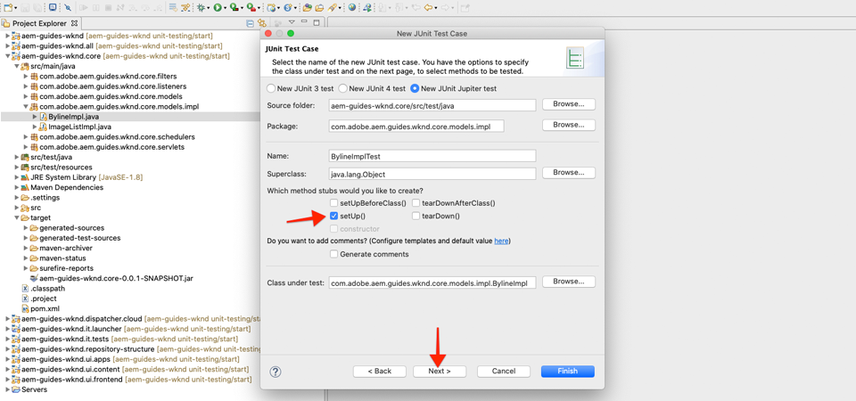
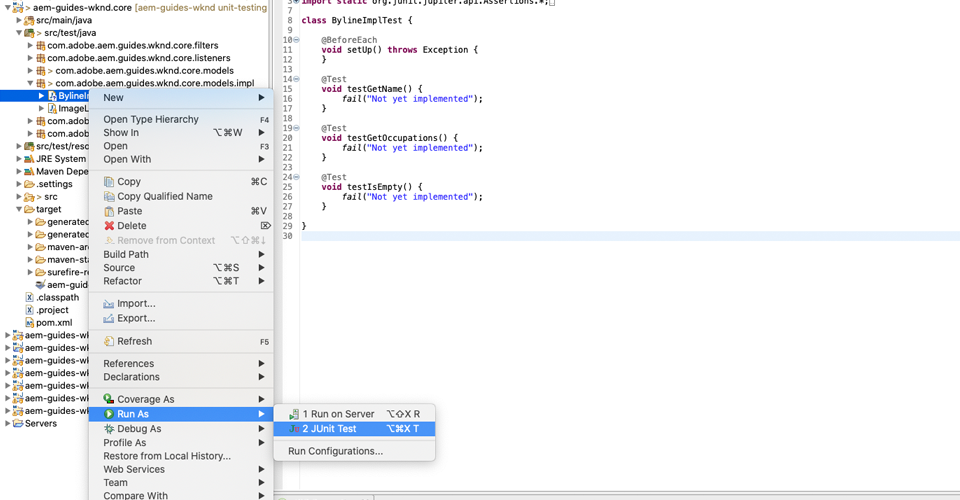

# Prova unità {#unit-testing}

Questa esercitazione illustra l&#39;implementazione di un unit test che convalida il comportamento del modello Sling del componente Byline, creato nell&#39;esercitazione [Custom Component](./custom-component.md).

## Prerequisiti {#prerequisites}

Controlla il codice della riga di base su cui si basa l&#39;esercitazione:

1. Duplicare il repository [github.com/adobe/aem-guides-wknd](https://github.com/adobe/aem-guides-wknd).
1. Estrarre il ramo `unit-testing/start`

```shell
$ git clone git@github.com:adobe/aem-guides-wknd.git ~/code/aem-guides-wknd
$ cd ~/code/aem-guides-wknd
$ git checkout unit-testing/start
```

È sempre possibile visualizzare il codice finito su [GitHub](https://github.com/adobe/aem-guides-wknd/tree/unit-testing/solution) o estrarre il codice localmente passando al ramo `unit-testing/solution`.

## Obiettivo

1. Scopri le basi del testing di unità.
1. Scopri i framework e gli strumenti comunemente utilizzati per testare AEM codice.
1. Comprendere le opzioni per schermare o simulare le risorse AEM durante la scrittura di unit test.

## Sfondo {#unit-testing-background}

Questa esercitazione spiega come creare [unit test](https://en.wikipedia.org/wiki/Unit_testing) per il [Sling Model](https://sling.apache.org/documentation/bundles/models.html) del componente Byline (creato in [Creazione di un componente AEM personalizzato](custom-component.md)). I test di unità sono test in tempo reale scritti in Java per verificare il comportamento previsto del codice Java. Ogni unit test è in genere piccolo e convalida l&#39;output di un metodo (o unità di lavoro) rispetto ai risultati previsti.

Utilizzeremo AEM best practice e utilizzeremo:

* [JUnit 5](https://junit.org/junit5/)
* [Framework test Mockito](https://site.mockito.org/)
* [wcm.io Test Framework](https://wcm.io/testing/) (basato su  [Apache Sling Mocks](https://sling.apache.org/documentation/development/sling-mock.html))

>[!VIDEO](https://video.tv.adobe.com/v/30207/?quality=12&learn=on)

## Test di unità e  Adobe Cloud Manager {#unit-testing-and-adobe-cloud-manager}

[ Adobe Cloud ](https://docs.adobe.com/content/help/it-IT/experience-manager-cloud-manager/using/introduction-to-cloud-manager.html) Manager integra l&#39;esecuzione dei test di unità e il  [rapporto sulla copertura del ](https://docs.adobe.com/content/help/en/experience-manager-cloud-manager/using/how-to-use/understand-your-test-results.html#code-quality-testing) codice nella sua pipeline CI/CD per incoraggiare e promuovere le best practice relative ai test di unità AEM codice.

Sebbene il codice di unit testing sia una buona prassi per qualsiasi base di codice, quando si utilizza Cloud Manager è importante sfruttare i test di qualità del codice e le funzionalità di reporting fornendo unit test per l&#39;esecuzione di Cloud Manager.

##  Inspect le dipendenze di test Maven {#inspect-the-test-maven-dependencies}

Il primo passo è esaminare le dipendenze del Paradiso per supportare la scrittura e l&#39;esecuzione dei test. Sono necessarie quattro dipendenze:

1. JUnit5
1. Framework test di Mockito
1. Apache Sling Mocks
1. AEM Mocks Test Framework (di io.wcm)

Le dipendenze di prova **JUnit5**, **Mockito** e **AEM Mocks** vengono automaticamente aggiunte al progetto durante la configurazione utilizzando il [AEM Maven archetype](project-setup.md).

1. Per visualizzare queste dipendenze, aprire il POM del reattore principale in **aem-guides-wknd/pom.xml**, passare alla `<dependencies>..</dependencies>` e verificare che siano definite le seguenti dipendenze:

   ```xml
   <dependencies>
       ...
       <!-- Testing -->
       <dependency>
           <groupId>org.junit</groupId>
           <artifactId>junit-bom</artifactId>
           <version>5.5.2</version>
           <type>pom</type>
           <scope>import</scope>
       </dependency>
       <dependency>
           <groupId>org.slf4j</groupId>
           <artifactId>slf4j-simple</artifactId>
           <version>1.7.25</version>
           <scope>test</scope>
       </dependency>
       <dependency>
           <groupId>org.mockito</groupId>
           <artifactId>mockito-core</artifactId>
           <version>2.25.1</version>
           <scope>test</scope>
       </dependency>
       <dependency>
           <groupId>org.mockito</groupId>
           <artifactId>mockito-junit-jupiter</artifactId>
           <version>2.25.1</version>
           <scope>test</scope>
       </dependency>
       <dependency>
           <groupId>junit-addons</groupId>
           <artifactId>junit-addons</artifactId>
           <version>1.4</version>
           <scope>test</scope>
       </dependency>
       <dependency>
           <groupId>io.wcm</groupId>
           <artifactId>io.wcm.testing.aem-mock.junit5</artifactId>
           <!-- Prefer the latest version of AEM Mock Junit5 dependency -->
           <version>2.5.2</version>
           <scope>test</scope>
       </dependency>
       ...
   </dependencies>
   ```

1. Aprite **aem-guides-wknd/core/pom.xml** e verificate che le dipendenze di test corrispondenti siano disponibili:

   ```xml
   ...
   <dependency>
       <groupId>org.junit.jupiter</groupId>
       <artifactId>junit-jupiter</artifactId>
       <scope>test</scope>
   </dependency>
   <dependency>
       <groupId>org.mockito</groupId>
       <artifactId>mockito-core</artifactId>
       <scope>test</scope>
   </dependency>
   <dependency>
       <groupId>org.mockito</groupId>
       <artifactId>mockito-junit-jupiter</artifactId>
       <scope>test</scope>
   </dependency>
   <dependency>
       <groupId>junit-addons</groupId>
       <artifactId>junit-addons</artifactId>
   </dependency>
   <dependency>
       <groupId>io.wcm</groupId>
       <artifactId>io.wcm.testing.aem-mock.junit5</artifactId>
   </dependency>
   ...
   ```

   Una cartella di origine parallela nel progetto **core** conterrà i test di unità e tutti i file di prova di supporto. Questa cartella **test** separa le classi di test dal codice sorgente, ma consente ai test di agire come se vivessero negli stessi pacchetti del codice sorgente.

## Creazione del test JUnit {#creating-the-junit-test}

I test di unità generalmente mappano 1 a 1 con classi Java. In questo capitolo, scriveremo un test JUnit per il **BylineImpl.java**, che è il modello Sling che supporta il componente Byline.


*Posizione in cui sono memorizzati i test di unità.*

1. È possibile eseguire questa operazione in Eclipse, facendo clic con il pulsante destro del mouse sulla classe Java da verificare, quindi selezionando **Nuovo > Altro > Java > JUnit > JUnit Test Case**.

   

1. Nella prima schermata della procedura guidata, convalida quanto segue:

   * Il tipo di test JUnit è **New JUnit Jupiter test**, in quanto queste sono le dipendenze JUnit Maven configurate nel nostro **pom.xml&#39;s**.
   * Il **pacchetto** è il pacchetto Java della classe in fase di test (`BylineImpl.java`)
   * La cartella Source (Origine) punta al progetto **core** (`aem-guides-wknd.core/src/test/java`) che indica a Eclipse dove sono memorizzati i file di unit test.
   * Lo stub del metodo `setUp()` verrà creato manualmente; vedremo come verrà utilizzato in seguito.
   * E la classe in fase di test è `BylineImpl.java`, perché questa è la classe Java che vogliamo testare.

   

   *Procedura guidata JUnit Test Case - passaggio 2*

1. Fare clic sul pulsante **Next** nella parte inferiore della procedura guidata.

   Questo passaggio consente di generare automaticamente i metodi di test. In genere, ogni metodo pubblico della classe Java ha almeno un metodo di test corrispondente, che ne convalida il comportamento. Spesso un test di unità dispone di più metodi di prova che testano un singolo metodo pubblico, ognuno dei quali rappresenta un insieme diverso di input o stati.

   Nella procedura guidata, selezionare tutti i metodi in `BylineImpl`, ad eccezione di `init()` che è un metodo utilizzato internamente dal modello Sling (via `@PostConstruct`). Il test di `init()` verrà eseguito in modo efficace eseguendo tutti gli altri metodi, poiché gli altri metodi dipendono dall&#39;esecuzione corretta di `init()`.

   Nuovi metodi di test possono essere aggiunti in qualsiasi momento alla classe di test JUnit. Questa pagina della procedura guidata è solo per comodità.

   

   *Procedura guidata JUnit Test Case (continua)*

1. Fate clic sul pulsante Fine nella parte inferiore della procedura guidata per generare il file di prova JUnit5.
1. Verificate che il file di prova JUnit5 sia stato creato nella struttura del pacchetto corrispondente in **aem-guide-wknd.core** > **/src/test/java** come file denominato `BylineImplTest.java`.

## Analisi di BylineImplTest.java {#reviewing-bylineimpltest-java}

Il nostro file di test ha una serie di metodi generati automaticamente. A questo punto, non c&#39;è niente di AEM specifico in questo file di test JUnit.

Il primo metodo è `public void setUp() { .. }`, annotato con `@BeforeEach`.

L&#39;annotazione `@BeforeEach` è un&#39;annotazione JUnit che indica al test JUnit in esecuzione per eseguire questo metodo prima di eseguire ogni metodo di test in questa classe.

I metodi successivi sono gli stessi metodi di prova e sono contrassegnati come tali con l&#39;annotazione `@Test`. Per impostazione predefinita, tutti i test sono impostati su fail.

Quando viene eseguita questa classe di test JUnit (nota anche come JUnit Test Case), ogni metodo contrassegnato con `@Test` viene eseguito come test che può essere superato o non superato.


*`core/src/test/java/com/adobe/aem/guides/wknd/core/models/impl/BylineImplTest.java`*

1. Eseguire il test case JUnit facendo clic con il pulsante destro del mouse sul nome della classe e scegliendo **Esegui come > JUnit Test**.

   

   *Fai clic con il pulsante destro del mouse su BylineImplTests.java > Esegui come > Test JUnit*

1. Come previsto, tutti i test hanno esito negativo.

   

   *Vista JUnit in Eclipse > Finestra > Mostra vista > Java > JUnit*

## Analisi di BylineImpl.java {#reviewing-bylineimpl-java}

Durante la scrittura di unit test, esistono due approcci principali:

* [sviluppo](https://en.wikipedia.org/wiki/Test-driven_development) TDD o basato su test, che comporta la scrittura dei test dell&#39;unità in modo incrementale, immediatamente prima dello sviluppo dell&#39;implementazione; scrivete un test, scrivete l&#39;implementazione per far passare il test.
* Implementazione-primo sviluppo, che comporta lo sviluppo di codice di lavoro prima e la scrittura di test per convalidare tale codice.

In questa esercitazione viene utilizzato l&#39;ultimo approccio (come abbiamo già creato un **BylineImpl.java** funzionante in un capitolo precedente). Per questo motivo, dobbiamo rivedere e capire i comportamenti dei suoi metodi pubblici, ma anche alcuni dettagli di implementazione. Questo può sembrare contrario, poiché un buon test dovrebbe interessare solo gli input e gli output, tuttavia, quando si lavora in AEM, ci sono una serie di considerazioni di implementazione che devono essere comprese per costruire i test in corso.

TDD nel contesto di AEM richiede un livello di esperienza ed è meglio adottato da AEM sviluppatori esperti nello sviluppo AEM e nella verifica di unità del codice AEM.

>[!VIDEO](https://video.tv.adobe.com/v/30208/?quality=12&learn=on)

## Impostazione AEM contesto di test {#setting-up-aem-test-context}

La maggior parte del codice scritto per AEM si basa sulle API JCR, Sling o AEM, che a loro volta richiedono che il contesto di un AEM in esecuzione venga eseguito correttamente.

Poiché i test di unità sono eseguiti al momento della creazione, al di fuori del contesto di un&#39;istanza AEM in esecuzione, non esiste una risorsa di questo tipo. Per facilitare questo, [wcm.io AEM Mocks](https://wcm.io/testing/aem-mock/usage.html) crea un contesto fittizio che consente a queste API di agire principalmente come se fossero in esecuzione in AEM.

1. Create un contesto AEM utilizzando **wcm.io&#39;s** `AemContext` in **BylineImplTest.java** aggiungendo l&#39;estensione JUnit decorata con `@ExtendWith` al file **BylineImplTest.java**. L’estensione si occupa di tutte le attività di inizializzazione e pulizia necessarie. Create una variabile di classe per `AemContext` che possa essere utilizzata per tutti i metodi di prova.

   ```java
   import org.junit.jupiter.api.extension.ExtendWith;
   import io.wcm.testing.mock.aem.junit5.AemContext;
   import io.wcm.testing.mock.aem.junit5.AemContextExtension;
   ...
   
   @ExtendWith(AemContextExtension.class)
   class BylineImplTest {
   
       private final AemContext ctx = new AemContext();
   ```

   Questa variabile, `ctx`, espone un contesto AEM fittizio che fornisce una serie di astrazioni AEM e Sling:

   * Il modello Sling BylineImpl verrà registrato in questo contesto
   * Le strutture di contenuto JCR Mock vengono create in questo contesto
   * I servizi OSGi personalizzati possono essere registrati in questo contesto
   * Fornisce una varietà di oggetti fittizi e assistenti comuni, come oggetti SlingHttpServletRequest, una varietà di servizi Sling e OSGi fittizi come ModelFactory, PageManager, Page, Template, ComponentManager, Component, TagManager, Tag, ecc.
      * *Si noti che non tutti i metodi per questi oggetti sono implementati.*
   * E [molto di più](https://wcm.io/testing/aem-mock/usage.html)!

   L&#39;oggetto **`ctx`** fungerà da punto di ingresso per la maggior parte del nostro contesto fittizio.

1. Nel metodo `setUp(..)`, che viene eseguito prima di ogni metodo `@Test`, definire uno stato comune di test dei modelli:

   ```java
   @BeforeEach
   public void setUp() throws Exception {
       ctx.addModelsForClasses(BylineImpl.class);
       ctx.load().json("/com/adobe/aem/guides/wknd/core/models/impl/BylineImplTest.json", "/content");
   }
   ```

   * **`addModelsForClasses`** registra il modello Sling da sottoporre a test, nel contesto AEM fittizio, in modo che possa essere istanziato nei  `@Test` metodi.
   * **`load().json`** carica le strutture delle risorse nel contesto fittizio, consentendo al codice di interagire con tali risorse come se fossero fornite da un archivio reale. Le definizioni delle risorse nel file **`BylineImplTest.json`** vengono caricate nel contesto JCR fittizio in **/content**.
   * **`BylineImplTest.json`** non esiste ancora, quindi creiamola e definiamo le strutture di risorse JCR necessarie per il test.

1. I file JSON che rappresentano le strutture delle risorse fittizie vengono memorizzati in **core/src/test/resources** seguendo lo stesso percorso del pacchetto del file di prova Java JUnit.

   Create un nuovo file JSON in **core/test/resources/com/adobe/aem/guide/wknd/core/models/impl** denominato **BylineImplTest.json** con il seguente contenuto:

   ```json
   {
       "byline": {
       "jcr:primaryType": "nt:unstructured",
       "sling:resourceType": "wknd/components/content/byline"
       }
   }
   ```

   

   Questo JSON definisce una definizione di risorsa fittizia per il test dell&#39;unità del componente Byline. A questo punto, il JSON dispone del set minimo di proprietà richiesto per rappresentare una risorsa di contenuto del componente Byline, le proprietà `jcr:primaryType` e `sling:resourceType`.

   Una regola generale di questi test quando si utilizzano unit test consiste nel creare il set minimo di contenuti fittizi, contesto e codice necessari per soddisfare ogni test. Evitare la tentazione di creare un contesto completo prima di scrivere i test, in quanto spesso si traduce in artefatti non necessari.

   Ora, con l&#39;esistenza di **BylineImplTest.json**, quando viene eseguito `ctx.json("/com/adobe/aem/guides/wknd/core/models/impl/BylineImplTest.json", "/content")`, le definizioni delle risorse fittizie vengono caricate nel contesto nel percorso **/content.**

## Verifica di getName() {#testing-get-name}

Ora che disponiamo di una configurazione di base del contesto fittizio, scriviamo il nostro primo test per **BylineImpl&#39;s getName()**. Questo test deve garantire che il metodo **getName()** restituisca il nome di authoring corretto memorizzato nella proprietà &quot;**name&quot;** della risorsa.

1. Aggiornare il metodo **testGetName**() in **BylineImplTest.java** come segue:

   ```java
   import com.adobe.aem.guides.wknd.core.components.Byline;
   import static org.junit.jupiter.api.Assertions.assertEquals;
   ...
   @Test
   public void testGetName() {
       final String expected = "Jane Doe";
   
       ctx.currentResource("/content/byline");
       Byline byline = ctx.request().adaptTo(Byline.class);
   
       String actual = byline.getName();
   
       assertEquals(expected, actual);
   }
   ```

   * **`String expected`** imposta il valore previsto. Verrà impostato su &quot;**Jane Done**&quot;.
   * **`ctx.currentResource`** imposta il contesto della risorsa fittizia per valutare il codice rispetto a, pertanto questo viene impostato su  **/content/** bylineas che è il punto in cui viene caricata la risorsa contenuto del banner.
   * **`Byline byline`** crea un&#39;istanza del modello di sling per autore adattandolo dall&#39;oggetto di richiesta fittizio.
   * **`String actual`** richiama il metodo che stiamo testando,  `getName()`sull&#39;oggetto del modello di sling autore.
   * **`assertEquals`** asserisce che il valore previsto corrisponde al valore restituito dall&#39;oggetto Sling Model byline. Se questi valori non sono uguali, il test avrà esito negativo.

1. Eseguire il test... e ha esito negativo con un `NullPointerException`.

   Notate che questo test NON ha esito negativo perché non abbiamo mai definito una proprietà `name` nel JSON di controllo, che causerà il fallimento del test, tuttavia l&#39;esecuzione del test non è arrivata a quel punto! Il test ha esito negativo a causa di un `NullPointerException` sull&#39;oggetto byline stesso.

1. Nel video di [Review BylineImpl.java](#reviewing-bylineimpl-java) sopra, si parla di come se `@PostConstruct init()` generasse un&#39;eccezione, si impedisca al modello Sling di creare un&#39;istanza, e questo è ciò che sta accadendo qui.

   ```java
   @PostConstruct
   private void init() {
       image = modelFactory.getModelFromWrappedRequest(request, request.getResource(), Image.class);
   }
   ```

   Si è scoperto che mentre il servizio ModelFactory OSGi è fornito tramite `AemContext` (tramite il contesto Sling Apache), non tutti i metodi sono implementati, incluso `getModelFromWrappedRequest(...)` che viene chiamato nel metodo BylineImpl `init()`. Ciò provoca un [AbstractMethodError](https://docs.oracle.com/javase/8/docs/api/java/lang/AbstractMethodError.html), che in termini di `init()` genera un errore, e l&#39;adattamento risultante di `ctx.request().adaptTo(Byline.class)` è un oggetto nullo.

   Dal momento che le schermate fornite non possono contenere il nostro codice, dobbiamo implementare il contesto fittizio noi stessi Per questo, possiamo utilizzare Mockito per creare un oggetto modelloFactory, che restituisce un oggetto immagine fittizio quando `getModelFromWrappedRequest(...)` viene richiamato su di esso.

   Poiché per creare un&#39;istanza del modello Sling autore, questo contesto fittizio deve essere presente, è possibile aggiungerlo al metodo `@Before setUp()`. È inoltre necessario aggiungere la `MockitoExtension.class` all&#39;annotazione `@ExtendWith` sopra la classe **BylineImplTest**.

   ```java
   package com.adobe.aem.guides.wknd.core.models.impl;
   
   import org.mockito.junit.jupiter.MockitoExtension;
   import org.mockito.Mock;
   
   import com.adobe.aem.guides.wknd.core.models.Byline;
   import com.adobe.cq.wcm.core.components.models.Image;
   
   import io.wcm.testing.mock.aem.junit5.AemContext;
   import io.wcm.testing.mock.aem.junit5.AemContextExtension;
   
   import org.apache.sling.models.factory.ModelFactory;
   import org.junit.jupiter.api.BeforeEach;
   import org.junit.jupiter.api.Test;
   import org.junit.jupiter.api.extension.ExtendWith;
   
   import static org.junit.jupiter.api.Assertions.assertEquals;
   import static org.junit.jupiter.api.Assertions.fail;
   import static org.mockito.Mockito.*;
   import org.apache.sling.api.resource.Resource;
   
   @ExtendWith({ AemContextExtension.class, MockitoExtension.class })
   public class BylineImplTest {
   
       private final AemContext ctx = new AemContext();
   
       @Mock
       private Image image;
   
       @Mock
       private ModelFactory modelFactory;
   
       @BeforeEach
       public void setUp() throws Exception {
           ctx.addModelsForClasses(BylineImpl.class);
   
           ctx.load().json("/com/adobe/aem/guides/wknd/core/models/impl/BylineImplTest.json", "/content");
   
           lenient().when(modelFactory.getModelFromWrappedRequest(eq(ctx.request()), any(Resource.class), eq(Image.class)))
                   .thenReturn(image);
   
           ctx.registerService(ModelFactory.class, modelFactory, org.osgi.framework.Constants.SERVICE_RANKING,
                   Integer.MAX_VALUE);
       }
   
       @Test
       void testGetName() { ...
   }
   ```

   * **`@ExtendWith({AemContextExtension.class, MockitoExtension.class})`** contrassegna la classe Test Case da eseguire con il  [Mockito JUnit Jupiter ](https://www.javadoc.io/page/org.mockito/mockito-junit-jupiter/latest/org/mockito/junit/jupiter/MockitoExtension.html) Extensionche consente l&#39;uso delle annotazioni @Mock per definire oggetti fittizi a livello di Classe.
   * **`@Mock private Image`** crea un oggetto fittizio di tipo  `com.adobe.cq.wcm.core.components.models.Image`. Questo viene definito a livello di classe in modo che, se necessario, i metodi `@Test` possano modificarne il comportamento in base alle esigenze.
   * **`@Mock private ModelFactory`** crea un oggetto fittizio di tipo ModelFactory. Notate che questo è un puro Mockito zoccolo e non ha metodi implementati su di esso. Questo viene definito a livello di classe in modo che, se necessario, i metodi `@Test`possano modificarne il comportamento in base alle esigenze.
   * **`when(modelFactory.getModelFromWrappedRequest(..)`** registra un comportamento fittizio per quando  `getModelFromWrappedRequest(..)` viene chiamato sull&#39;oggetto ModelFactory di controllo. Il risultato definito in `thenReturn (..)` consiste nel restituire l&#39;oggetto Immagine fittizio. Questo comportamento viene richiamato solo quando: il primo parametro è uguale all&#39;oggetto di richiesta di `ctx`, il secondo parametro è qualsiasi oggetto Resource e il terzo deve essere la classe Immagine dei componenti core. Accettiamo qualsiasi risorsa perché durante i nostri test imposteremo la `ctx.currentResource(...)` su varie risorse fittizie definite in **BylineImplTest.json**. Si noti che si aggiunge la **lenient()** severity perché in seguito si desidera ignorare questo comportamento di ModelFactory.
   * **`ctx.registerService(..)`.** registra l&#39;oggetto ModelFactory fittizio in AemContext, con la classifica di servizio più alta. Questo è necessario perché ModelFactory utilizzato in BylineImpl&#39;s `init()` viene iniettato tramite il campo `@OSGiService ModelFactory model`. Affinché AemContext possa inserire **l&#39;oggetto fittizio**, che gestisce le chiamate a `getModelFromWrappedRequest(..)`, è necessario registrarlo come servizio di classifica più alta di quel tipo (ModelFactory).

1. Eseguire di nuovo il test e di nuovo il test ha esito negativo, ma questa volta il messaggio è chiaro perché il test ha avuto esito negativo.

   

   *testGetName() non riuscito a causa di asserzione*

   Riceviamo un **AssertionError** che indica che la condizione di asserzione nel test non è riuscita e che il valore **previsto è &quot;Jane Doe&quot;**, ma il valore **effettivo è null**. Questo è utile perché la proprietà &quot;**name&quot;** non è stata aggiunta alla definizione di risorsa di tipo **/content/byline** in **BylineImplTest.json**, quindi aggiungetela:

1. Aggiornare **BylineImplTest.json** per definire `"name": "Jane Doe".`

   ```json
   {
       "byline": {
       "jcr:primaryType": "nt:unstructured",
       "sling:resourceType": "wknd/components/content/byline",
       "name": "Jane Doe"
       }
   }
   ```

1. Eseguire nuovamente il test e **`testGetName()`** ora passa!

## Test di getOccupations() {#testing-get-occupations}

Va bene! Il nostro primo test è passato! Andiamo avanti e testiamo `getOccupations()`. Poiché l&#39;inizializzazione del contesto di controllo è stata eseguita nel metodo `@Before setUp()`, questo sarà disponibile per tutti i metodi `@Test` in questo caso di test, incluso `getOccupations()`.

Ricordare che questo metodo deve restituire un elenco alfabeticamente ordinato di occupazioni (discendenti) memorizzate nella proprietà occupazioni.

1. Aggiorna **`testGetOccupations()`** come segue:

   ```java
   import java.util.List;
   import com.google.common.collect.ImmutableList;
   ...
   @Test
   public void testGetOccupations() {
       List<String> expected = new ImmutableList.Builder<String>()
                               .add("Blogger")
                               .add("Photographer")
                               .add("YouTuber")
                               .build();
   
       ctx.currentResource("/content/byline");
       Byline byline = ctx.request().adaptTo(Byline.class);
   
       List<String> actual = byline.getOccupations();
   
       assertEquals(expected, actual);
   }
   ```

   * **`List<String> expected`** definire il risultato previsto.
   * **`ctx.currentResource`** imposta la risorsa corrente per valutare il contesto rispetto alla definizione della risorsa fittizia in /content/byline. In questo modo **BylineImpl.java** viene eseguito nel contesto della risorsa fittizia.
   * **`ctx.request().adaptTo(Byline.class)`** crea un&#39;istanza del modello di sling per autore adattandolo dall&#39;oggetto di richiesta fittizio.
   * **`byline.getOccupations()`** richiama il metodo che stiamo testando,  `getOccupations()`sull&#39;oggetto del modello di sling autore.
   * **`assertEquals(expected, actual)`** l&#39;elenco previsto degli asserti è lo stesso dell&#39;elenco effettivo.

1. Ricordate, proprio come **`getName()`** sopra, il **BylineImplTest.json** non definisce le occupazioni, pertanto questo test non riuscirà se lo eseguiamo, dal momento che `byline.getOccupations()` restituirà un elenco vuoto.

   Aggiornare **BylineImplTest.json** per includere un elenco di occupazioni, che verranno impostate in modo non alfabetico per garantire che i test verifichino che le occupazioni siano ordinate per **`getOccupations()`**.

   ```json
   {
       "byline": {
       "jcr:primaryType": "nt:unstructured",
       "sling:resourceType": "wknd/components/content/byline",
       "name": "Jane Doe",
       "occupations": ["Photographer", "Blogger", "YouTuber"]
       }
   }
   ```

1. Esegui il test, e di nuovo passiamo! Sembra che le occupazioni ordinate funzionino!

   

   *testGetOccupations() pass*

## Test isEmpty() {#testing-is-empty}

L&#39;ultimo metodo di test **`isEmpty()`**.

Verificare `isEmpty()` è interessante in quanto richiede test per diverse condizioni. Esaminando il metodo **BylineImpl.java** di `isEmpty()`, è necessario verificare le seguenti condizioni:

* Restituisce true quando il nome è vuoto
* Restituisce true quando le occupazioni sono nulle o vuote
* Restituisce true se l&#39;immagine è null o non ha un URL src
* Restituisce false se sono presenti il nome, le occupazioni e l’immagine (con un URL src)

A tal fine, è necessario creare nuovi metodi di test, ogni test di una condizione specifica e nuove strutture di risorse fittizie in `BylineImplTest.json` per eseguire questi test.

Questo controllo ci ha permesso di saltare i test per i casi in cui `getName()`, `getOccupations()` e `getImage()` sono vuoti, dal momento che il comportamento previsto di tale stato viene verificato tramite `isEmpty()`.

1. Il primo test consente di verificare la condizione di un componente nuovo, che non dispone di proprietà impostate.

   Aggiungete una nuova definizione di risorsa a `BylineImplTest.json`, assegnandole il nome semantico &quot;**empty**&quot;

   ```json
   {
       "byline": {
       "jcr:primaryType": "nt:unstructured",
       "sling:resourceType": "wknd/components/content/byline",
       "name": "Jane Doe",
       "occupations": ["Photographer", "Blogger", "YouTuber"]
       },
       "empty": {
       "jcr:primaryType": "nt:unstructured",
       "sling:resourceType": "wknd/components/content/byline"
       }
   }
   ```

   **`"empty": {...}`** definire una nuova definizione di risorsa denominata &quot;empty&quot; che contenga solo un  `jcr:primaryType` e  `sling:resourceType`.

   Ricordate che `BylineImplTest.json` viene caricato in `ctx` prima dell&#39;esecuzione di ciascun metodo di test in `@setUp`, quindi questa nuova definizione di risorsa è immediatamente disponibile nei test in **/content/empty.**

1. Aggiornate `testIsEmpty()` come segue, impostando la risorsa corrente sulla nuova definizione di risorsa di tipo &quot;**empty**&quot;.

   ```java
   @Test
   public void testIsEmpty() {
       ctx.currentResource("/content/empty");
       Byline byline = ctx.request().adaptTo(Byline.class);
   
       assertTrue(byline.isEmpty());
   }
   ```

   Eseguire il test e assicurarsi che venga superato.

1. Quindi, create un set di metodi per assicurare che se uno dei punti dati richiesti (nome, occupazioni o immagine) è vuoto, `isEmpty()` restituisca true.

   Per ogni test, viene utilizzata una definizione discreta di risorsa fittizia, aggiornare **BylineImplTest.json** con le definizioni di risorse aggiuntive per **senza nome** e **senza occupazioni**.

   ```json
   {
       "byline": {
       "jcr:primaryType": "nt:unstructured",
       "sling:resourceType": "wknd/components/content/byline",
       "name": "Jane Doe",
       "occupations": ["Photographer", "Blogger", "YouTuber"]
       },
       "empty": {
       "jcr:primaryType": "nt:unstructured",
       "sling:resourceType": "wknd/components/content/byline"
       },
       "without-name": {
       "jcr:primaryType": "nt:unstructured",
       "sling:resourceType": "wknd/components/content/byline",
       "occupations": "[Photographer, Blogger, YouTuber]"
       },
       "without-occupations": {
       "jcr:primaryType": "nt:unstructured",
       "sling:resourceType": "wknd/components/content/byline",
       "name": "Jane Doe"
       }
   }
   ```

   Create i seguenti metodi di test per verificare ciascuno di questi stati.

   ```java
   @Test
   public void testIsEmpty() {
       ctx.currentResource("/content/empty");
   
       Byline byline = ctx.request().adaptTo(Byline.class);
   
       assertTrue(byline.isEmpty());
   }
   
   @Test
   public void testIsEmpty_WithoutName() {
       ctx.currentResource("/content/without-name");
   
       Byline byline = ctx.request().adaptTo(Byline.class);
   
       assertTrue(byline.isEmpty());
   }
   
   @Test
   public void testIsEmpty_WithoutOccupations() {
       ctx.currentResource("/content/without-occupations");
   
       Byline byline = ctx.request().adaptTo(Byline.class);
   
       assertTrue(byline.isEmpty());
   }
   
   @Test
   public void testIsEmpty_WithoutImage() {
       ctx.currentResource("/content/byline");
   
       lenient().when(modelFactory.getModelFromWrappedRequest(eq(ctx.request()),
           any(Resource.class),
           eq(Image.class))).thenReturn(null);
   
       Byline byline = ctx.request().adaptTo(Byline.class);
   
       assertTrue(byline.isEmpty());
   }
   
   @Test
   public void testIsEmpty_WithoutImageSrc() {
       ctx.currentResource("/content/byline");
   
       when(image.getSrc()).thenReturn("");
   
       Byline byline = ctx.request().adaptTo(Byline.class);
   
       assertTrue(byline.isEmpty());
   }
   ```

   **`testIsEmpty()`** esegue un test rispetto alla definizione di risorsa fittizia vuota e afferma che  `isEmpty()` è vero.

   **`testIsEmpty_WithoutName()`** esegue il test rispetto a una definizione di risorsa fittizia con occupazioni ma senza nome.

   **`testIsEmpty_WithoutOccupations()`** esegue il test rispetto a una definizione di risorsa fittizia con un nome ma senza occupazioni.

   **`testIsEmpty_WithoutImage()`** esegue un test rispetto alla definizione di una risorsa fittizia con nome e occupazioni, ma imposta l&#39;immagine fittizia su null. Tenere presente che si desidera ignorare il comportamento `modelFactory.getModelFromWrappedRequest(..)`definito in `setUp()` per garantire che l&#39;oggetto Immagine restituito da questa chiamata sia nullo. La funzionalità Mockito stub è rigida e non vuole codice duplicato. Di conseguenza, impostiamo il mock con le impostazioni **`lenient`** in modo da notare esplicitamente che il comportamento viene ignorato nel metodo `setUp()`.

   **`testIsEmpty_WithoutImageSrc()`** esegue un test rispetto alla definizione di una risorsa fittizia con nome e occupazioni, ma imposta l&#39;immagine fittizia per restituire una stringa vuota quando  `getSrc()` viene richiamato.

1. Infine, scrivete un test per verificare che **isEmpty()** restituisca false quando il componente è configurato correttamente. Per questa condizione, è possibile riutilizzare **/content/byline** che rappresenta un componente Byline completamente configurato.

   ```java
   @Test
   public void testIsNotEmpty() {
   ctx.currentResource("/content/byline");
   when(image.getSrc()).thenReturn("/content/bio.png");
   
   Byline byline = ctx.request().adaptTo(Byline.class);
   
   assertFalse(byline.isEmpty());
   }
   ```

## Copertura codice {#code-coverage}

Per copertura del codice si intende la quantità di codice sorgente oggetto di unit test. Gli IDE moderni forniscono strumenti che controllano automaticamente il codice sorgente eseguito durante i test dell&#39;unità. Sebbene la copertura del codice di per sé non sia un indicatore di qualità del codice, è utile comprendere se esistono aree importanti del codice sorgente non sottoposte a test di unità.

1. In Esplora progetti di Eclipse, fare clic con il pulsante destro del mouse su **BylineImplTest.java** e selezionare **Copertura come > JUnit Test**

   Assicuratevi che la vista di riepilogo Copertura sia aperta (Finestra > Mostra vista > Altro > Java > Copertura).

   Verranno eseguiti i unit test all&#39;interno del file e verrà fornito un report che indica la copertura del codice. La perforazione della classe e dei metodi fornisce indicazioni più chiare su quali parti del file vengono sottoposte a test e quali no.

   

   *Riepilogo della copertura del codice*

   Eclipse fornisce una panoramica rapida della quantità di ciascuna classe e di ciascun metodo coperti dal test di unità. Eclipse codifica anche le righe di codice:

   * **Codice** Greenis eseguito da almeno un test
   * **Il** giallo indica un ramo che non viene valutato da alcun test
   * **Codice** rosso che non viene eseguito da alcun test

1. Nel rapporto di copertura è stato identificato il ramo che viene eseguito quando il campo occupazioni è null e restituisce un elenco vuoto, non viene mai valutato. Questo è indicato dalle righe 571 e 86 colorate gialle, indicate un ramo del if/else non è eseguito, e la riga 75 in rosso indica che la riga di codice non è mai eseguita.

   

1. Per ovviare a questo problema, aggiungere un test per `getOccupations()` che indichi che viene restituito un elenco vuoto quando non è presente alcun valore di occupazione nella risorsa. Aggiungete il seguente nuovo metodo di test a **BylineImplTests.java**.

   ```java
   @Test
   public void testGetOccupations_WithoutOccupations() {
       List<String> expected = Collections.emptyList();
   
       ctx.currentResource("/content/empty");
       Byline byline = ctx.request().adaptTo(Byline.class);
   
       List<String> actual = byline.getOccupations();
   
       assertEquals(expected, actual);
   }
   ```

   **`Collections.emptyList();`** imposta il valore previsto su un elenco vuoto.

   **`ctx.currentResource("/content/empty")`** imposta la risorsa corrente su /content/empty, per la quale è noto che non è stata definita una proprietà di occupazione.

1. La nuova esecuzione della copertura con nome segnala che **BylineImpl.java** è ora a copertura del 100%, tuttavia esiste ancora un ramo che non viene valutato in isEmpty(), che ha di nuovo a che fare con le occupazioni. In questo caso, le occupazioni == null vengono valutate, ma il file occupations.isEmpty() non è presente perché non esiste una definizione di risorsa fittizia che imposti `"occupations": []`.

   

   *Copertura con testGetOccupations_WithoutOccupations()*

1. Questo può essere facilmente risolto creando un altro metodo di test che viene utilizzato una definizione di risorsa fittizia che imposta le occupazioni sulla matrice vuota.

   Aggiungete una nuova definizione di risorsa fittizia a **BylineImplTest.json** che è una copia di **&quot;senza occupazioni&quot;** e aggiungete una proprietà di occupazione impostata sulla matrice vuota, quindi denominatela **&quot;senza occupazioni-matrice vuota&quot;**.

   ```json
   "without-occupations-empty-array": {
      "jcr:primaryType": "nt:unstructured",
      "sling:resourceType": "wknd/components/content/byline",
      "name": "Jane Doe",
      "occupations": []
    }
   ```

   Create un nuovo metodo **@Test** in `BylineImplTest.java` che utilizza questa nuova risorsa fittizia, asserendo che `isEmpty()` restituisce true.

   ```java
   @Test
   public void testIsEmpty_WithEmptyArrayOfOccupations() {
       ctx.currentResource("/content/without-occupations-empty-array");
   
       Byline byline = ctx.request().adaptTo(Byline.class);
   
       assertTrue(byline.isEmpty());
   }
   ```

   

   *Copertura con testIsEmpty_WithEmptyArrayOfOccupations()*

1. Con quest&#39;ultima aggiunta, `BylineImpl.java` gode di una copertura del codice del 100%, con tutti i relativi percorsi condizionali valutati.

   I test convalidano il comportamento previsto di `BylineImpl` senza ricorrere a una serie minima di dettagli di implementazione.

## Esecuzione di unit test nell&#39;ambito della build {#running-unit-tests-as-part-of-the-build}

I test di unità sono eseguiti per passare come parte della costruzione del cielo. In questo modo tutti i test vengono superati correttamente prima della distribuzione di un&#39;applicazione. L&#39;esecuzione di obiettivi Maven come il pacchetto o l&#39;installazione richiama automaticamente e richiede il superamento di tutti i test di unità nel progetto.

```shell
$ mvn package
```


```shell
$ mvn package
```

Allo stesso modo, se cambiamo un metodo di test in modo da non riuscire, la build non riesce e i report quali test non sono riusciti e perché.


## Rivedete il codice {#review-the-code}

Visualizzate il codice finito su [GitHub](https://github.com/adobe/aem-guides-wknd) oppure rivedete e distribuite il codice localmente in corrispondenza del blocco Git `unit-testing/solution`.
