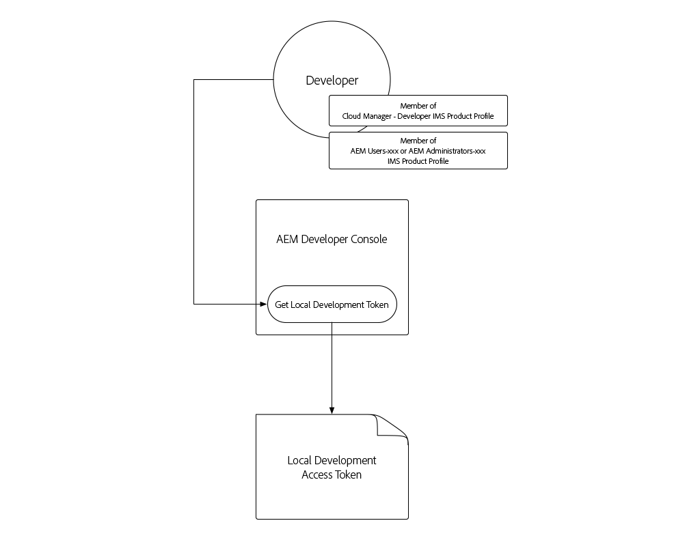
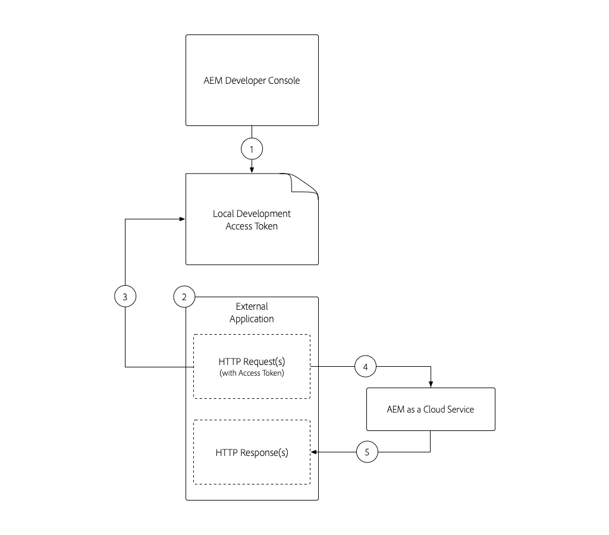
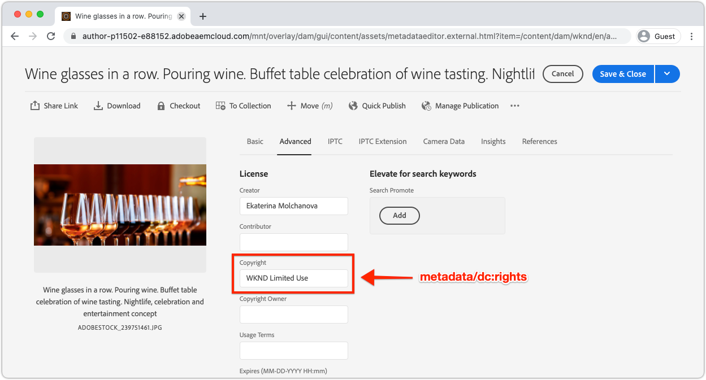

# Token di accesso per lo sviluppo locale

Gli sviluppatori che creano integrazioni che richiedono l’accesso programmatico a AEM as a Cloud Service hanno bisogno di un modo semplice e rapido per ottenere token di accesso temporaneo per AEM per facilitare le attività di sviluppo locale. Per soddisfare questa esigenza, AEM Console per sviluppatori consente agli sviluppatori di generare automaticamente token di accesso temporaneo che possono essere utilizzati per accedere a AEM a livello di programmazione.

>[!VIDEO](https://video.tv.adobe.com/v/330477/?quality=12&learn=on)

## Generare un token di accesso allo sviluppo locale



Il token di accesso allo sviluppo locale fornisce l’accesso ai servizi Author e Publish di AEM come utente che ha generato il token, insieme alle relative autorizzazioni. Sebbene si tratti di un token di sviluppo, non condividere il token o archiviare nel controllo del codice sorgente.

1. In [Adobe Admin Console](https://adminconsole.adobe.com/) assicurati, sviluppatore, di essere membro di:
   + __Cloud Manager - Sviluppatore__ Profilo di prodotto IMS (consente l’accesso a AEM Console per sviluppatori)
   + O il __Amministratori AEM__ o __Utenti AEM__ Profilo di prodotto IMS per il servizio dell’ambiente AEM con cui il token di accesso si integra
   + Sandbox AEM ambiente as a Cloud Service richiedono solo l’appartenenza a __Amministratori AEM__ o __Utenti AEM__ Profilo prodotto
1. Accedi a [Adobe Cloud Manager](https://my.cloudmanager.adobe.com)
1. Apri il programma contenente l’ambiente as a Cloud Service AEM con cui eseguire l’integrazione
1. Tocca __ellissi__ accanto all’ambiente nel __Ambienti__ e seleziona __Console per sviluppatori__
1. Tocca __Integrazioni__ scheda
1. Tocca __Token locale__ scheda
1. Tocca __Ottieni token di sviluppo locale__ pulsante
1. Tocca __pulsante di download__ nell’angolo in alto a sinistra per scaricare il file JSON contenente `accessToken` e salva il file JSON in una posizione sicura nel computer di sviluppo.
   + Questo è il token di accesso per sviluppatori per 24 ore nell’ambiente as a Cloud Service AEM.


## Utilizzato il token di accesso allo sviluppo locale{#use-local-development-access-token}



1. Scarica il token di accesso locale temporaneo da AEM Developer Console
   + Il token di accesso allo sviluppo locale scade ogni 24 ore, pertanto gli sviluppatori devono scaricare quotidianamente nuovi token di accesso
1. È in corso lo sviluppo di un&#39;applicazione esterna che interagisce in modo programmatico con AEM as a Cloud Service
1. L&#39;applicazione esterna viene letta nel token di accesso allo sviluppo locale
1. L’applicazione esterna crea le richieste HTTP a AEM as a Cloud Service, aggiungendo il Token di accesso allo sviluppo locale come token portatore all’intestazione Autorizzazione delle richieste HTTP
1. AEM as a Cloud Service riceve la richiesta HTTP, autentica la richiesta ed esegue il lavoro richiesto dalla richiesta HTTP e restituisce una risposta HTTP all&#39;applicazione esterna

### Applicazione esterna di esempio

Verrà creata una semplice applicazione JavaScript esterna per illustrare come accedere in modo programmatico AEM as a Cloud Service tramite HTTPS utilizzando il token di accesso per sviluppatori locale. Questo illustra come _qualsiasi_ l’applicazione o il sistema in esecuzione al di fuori di AEM, indipendentemente dal framework o dalla lingua, può utilizzare il token di accesso per eseguire l’autenticazione e l’accesso programmatici AEM as a Cloud Service. In [sezione successiva](./service-credentials.md), aggiorneremo questo codice dell’applicazione per supportare l’approccio per la generazione di un token per l’uso in produzione.

Questa applicazione di esempio viene eseguita dalla riga di comando e aggiorna i metadati AEM risorse utilizzando le API HTTP di AEM Assets, utilizzando il seguente flusso:

1. Legge i parametri dalla riga di comando (`getCommandLineParams()`)
1. Ottiene il token di accesso utilizzato per l&#39;autenticazione a AEM as a Cloud Service (`getAccessToken(...)`)
1. Elenca tutte le risorse in una cartella di risorse AEM specificata in un parametro della riga di comando (`listAssetsByFolder(...)`)
1. Aggiorna i metadati delle risorse elencate con i valori specificati nei parametri della riga di comando (`updateMetadata(...)`)

L’elemento chiave per l’autenticazione programmatica a AEM utilizzando il token di accesso è l’aggiunta di un’intestazione di richiesta di autorizzazione HTTP a tutte le richieste HTTP effettuate a AEM, nel seguente formato:

+ `Authorization: Bearer ACCESS_TOKEN`

## Esecuzione dell&#39;applicazione esterna

1. Assicurati che [Node.js](/help/cloud-service/local-development-environment/development-tools.md?lang=en#node-js) è installato nel computer di sviluppo locale, utilizzato per eseguire l&#39;applicazione esterna
1. Scarica e decomprimi il file [applicazione esterna di esempio](./assets/aem-guides_token-authentication-external-application.zip)
1. Dalla riga di comando, nella cartella del progetto, eseguire `npm install`
1. Copia il [scaricato il token di accesso allo sviluppo locale](#download-local-development-access-token) a un file denominato `local_development_token.json` nella directory principale del progetto
   + Ma ricorda, non impegnare mai nessuna creatività a Git!
1. Apri `index.js` e controlla il codice e i commenti dell&#39;applicazione esterna.

   ```javascript
   const fetch = require('node-fetch');
   const fs = require('fs');
   const auth = require('@adobe/jwt-auth');
   
   // The root context of the Assets HTTP API
   const ASSETS_HTTP_API = '/api/assets';
   
   // Command line parameters
   let params = { };
   
   /**
   * Application entry point function
   */
   (async () => {
       console.log('Example usage: node index.js aem=https://author-p1234-e5678.adobeaemcloud.com propertyName=metadata/dc:rights "propertyValue=WKND Limited Use" folder=/wknd-shared/en/adventures/napa-wine-tasting file=credentials-file.json' );
   
       // Parse the command line parameters
       params = getCommandLineParams();
   
       // Set the access token to be used in the HTTP requests to be local development access token
       params.accessToken = await getAccessToken(params.developerConsoleCredentials);
   
       // Get a list of all the assets in the specified assets folder
       let assets = await listAssetsByFolder(params.folder);
   
       // For each asset, update it's metadata
       await assets.forEach(asset => updateMetadata(asset, { 
           [params.propertyName]: params.propertyValue 
       }));
   })();
   
   /**
   * Returns a list of Assets HTTP API asset URLs that reference the assets in the specified folder.
   * 
   * https://experienceleague.adobe.com/docs/experience-manager-cloud-service/assets/admin/mac-api-assets.html?lang=en#retrieve-a-folder-listing
   * 
   * @param {*} folder the Assets HTTP API folder path (less the /content/dam path prefix)
   */
   async function listAssetsByFolder(folder) {
       return fetch(`${params.aem}${ASSETS_HTTP_API}${folder}.json`, {
               method: 'get',
               headers: { 
                   'Content-Type': 'application/json',
                   'Authorization': 'Bearer ' + params.accessToken // Provide the AEM access token in the Authorization header
               },
           })
           .then(res => {
               console.log(`${res.status} - ${res.statusText} @ ${params.aem}${ASSETS_HTTP_API}${folder}.json`);
   
               // If success, return the JSON listing assets, otherwise return empty results
               return res.status === 200 ? res.json() : { entities: [] };
           })
           .then(json => { 
               // Returns a list of all URIs for each non-content fragment asset in the folder
               return json.entities
                   .filter((entity) => entity['class'].indexOf('asset/asset') === -1 && !entity.properties.contentFragment)
                   .map(asset => asset.links.find(link => link.rel.find(r => r === 'self')).href);
           });
   }
   
   /**
   * Update the metadata of an asset in AEM
   * 
   * https://experienceleague.adobe.com/docs/experience-manager-cloud-service/assets/admin/mac-api-assets.html?lang=en#update-asset-metadata
   * 
   * @param {*} asset the Assets HTTP API asset URL to update
   * @param {*} metadata the metadata to update the asset with
   */
   async function updateMetadata(asset, metadata) {        
       await fetch(`${asset}`, {
               method: 'put',
               headers: { 
                   'Content-Type': 'application/json',
                   'Authorization': 'Bearer ' + params.accessToken // Provide the AEM access token in the Authorization header
               },
               body: JSON.stringify({
                   class: 'asset',
                   properties: metadata
               })
           })
           .then(res => { 
               console.log(`${res.status} - ${res.statusText} @ ${asset}`);
           });
   }
   
   /**
   * Parse and return the command line parameters. Expected params are:
   * 
   * - aem = The AEM as a Cloud Service hostname to connect to.
   *              Example: https://author-p12345-e67890.adobeaemcloud.com
   * - folder = The asset folder to update assets in. Note that the Assets HTTP API do NOT use the JCR `/content/dam` path prefix.
   *              Example: '/wknd-shared/en/adventures/napa-wine-tasting'
   * - propertyName = The asset property name to update. Note this is relative to the [dam:Asset]/jcr:content node of the asset.
   *              Example: metadata/dc:rights
   * - propertyValue = The value to update the asset property (specified by propertyName) with.
   *              Example: "WKND Free Use"
   * - file = The path to the JSON file that contains the credentials downloaded from AEM Developer Console
   *              Example: local_development_token_cm_p1234-e5678.json 
   */
   function getCommandLineParams() {
       let parameters = {};
   
       // Parse the command line params, splitting on the = delimiter
       for (let i = 2; i < process.argv.length; i++) {
           let key = process.argv[i].split('=')[0];
           let value = process.argv[i].split('=')[1];
   
           parameters[key] = value;
       };
   
       // Read in the credentials from the provided JSON file
       if (parameters.file) {
           parameters.developerConsoleCredentials = JSON.parse(fs.readFileSync(parameters.file));
       }
   
       console.log(parameters);
   
       return parameters;
   }
   
   async function getAccessToken(developerConsoleCredentials) {s
       if (developerConsoleCredentials.accessToken) {
           // This is a Local Development access token
           return developerConsoleCredentials.accessToken;
       } 
   }
   ```

   Consulta la sezione `fetch(..)` invocazioni in `listAssetsByFolder(...)` e `updateMetadata(...)`, e l&#39;avviso `headers` definire `Authorization` intestazione di richiesta HTTP con un valore di `Bearer ACCESS_TOKEN`. In questo modo la richiesta HTTP proveniente dall’applicazione esterna si autentica AEM as a Cloud Service.

   ```javascript
   ...
   return fetch(`${params.aem}${ASSETS_HTTP_API}${folder}.json`, {
               method: 'get',
               headers: { 
                   'Content-Type': 'application/json',
                   'Authorization': 'Bearer ' + params.accessToken // Provide the AEM access token in the Authorization header
               },
   })...
   ```

   Eventuali richieste HTTP a AEM as a Cloud Service devono impostare il token di accesso Bearer nell’intestazione Autorizzazione. Ricorda che ogni ambiente as a Cloud Service AEM richiede un proprio token di accesso. Il token di accesso dello sviluppo non funziona su Stage o Produzione, Stage non funziona su Sviluppo o Produzione e Production non funziona su Sviluppo o Stage!

1. Utilizzando la riga di comando, dalla radice del progetto esegui l’applicazione, passando i seguenti parametri:

   ```shell
   $ node index.js \
       aem=https://author-p1234-e5678.adobeaemcloud.com \
       folder=/wknd-shared/en/adventures/napa-wine-tasting \
       propertyName=metadata/dc:rights \
       propertyValue="WKND Limited Use" \
       file=local_development_token.json
   ```

   Vengono passati i seguenti parametri:

   + `aem`: Lo schema e il nome host dell&#39;ambiente as a Cloud Service con cui l&#39;applicazione interagisce (ad esempio, `https://author-p1234-e5678.adobeaemcloud.com`).
   + `folder`: Il percorso della cartella di risorse le cui risorse vengono aggiornate con `propertyValue`; NON aggiungere `/content/dam` prefisso (es. `/wknd-shared/en/adventures/napa-wine-tasting`)
   + `propertyName`: Nome della proprietà della risorsa da aggiornare, relativo a `[dam:Asset]/jcr:content` (ex `metadata/dc:rights`).
   + `propertyValue`: Il valore da impostare `propertyName` a; i valori con spazi devono essere incapsulati con `"` (ex `"WKND Limited Use"`)
   + `file`: Il percorso relativo del file JSON scaricato da AEM Developer Console.

   L’esecuzione corretta dell’applicazione restituisce l’output per ogni risorsa aggiornata:

   ```shell
   200 - OK @ https://author-p1234-e5678.adobeaemcloud.com/api/assets/wknd-shared/en/adventures/napa-wine-tasting.json
   200 - OK @ https://author-p1234-e5678.adobeaemcloud.com/api/assets/wknd-shared/en/adventures/napa-wine-tasting/AdobeStock_277654931.jpg.json
   200 - OK @ https://author-p1234-e5678.adobeaemcloud.com/api/assets/wknd-shared/en/adventures/napa-wine-tasting/AdobeStock_239751461.jpg.json
   200 - OK @ https://author-p1234-e5678.adobeaemcloud.com/api/assets/wknd-shared/en/adventures/napa-wine-tasting/AdobeStock_280313729.jpg.json
   200 - OK @ https://author-p1234-e5678.adobeaemcloud.com/api/assets/wknd-shared/en/adventures/napa-wine-tasting/AdobeStock_286664352.jpg.json
   ```

### Verifica l&#39;aggiornamento dei metadati in AEM

Verifica che i metadati siano stati aggiornati accedendo all’ambiente as a Cloud Service AEM (assicurati che lo stesso host sia stato passato nel `aem` si accede al parametro della riga di comando).

1. Accedi all’ambiente as a Cloud Service AEM con cui l’applicazione esterna ha interagito (utilizza lo stesso host fornito nel `aem` parametro della riga di comando)
1. Passa a __Risorse__ > __File__
1. Passa alla cartella di risorse specificata dalla `folder` parametro della riga di comando, ad esempio __WKND__ > __Inglese__ > __Avventure__ > __Degustazione di vino Napa__
1. Apri __Proprietà__ per qualsiasi risorsa (non frammento di contenuto) presente nella cartella
1. Tocca a __Avanzate__ scheda
1. Rivedi il valore della proprietà aggiornata, ad esempio __Copyright__ mappata al `metadata/dc:rights` Proprietà JCR, che riflette il valore fornito nel `propertyValue` , ad esempio __Utilizzo limitato WKND__



## Passaggi successivi

Ora che abbiamo effettuato l’accesso programmaticamente AEM as a Cloud Service utilizzando il token di sviluppo locale. Successivamente è necessario aggiornare l&#39;applicazione per gestire utilizzando le credenziali del servizio, in modo che questa applicazione possa essere utilizzata in un contesto di produzione.

+ [Come utilizzare le credenziali del servizio](./service-credentials.md)
