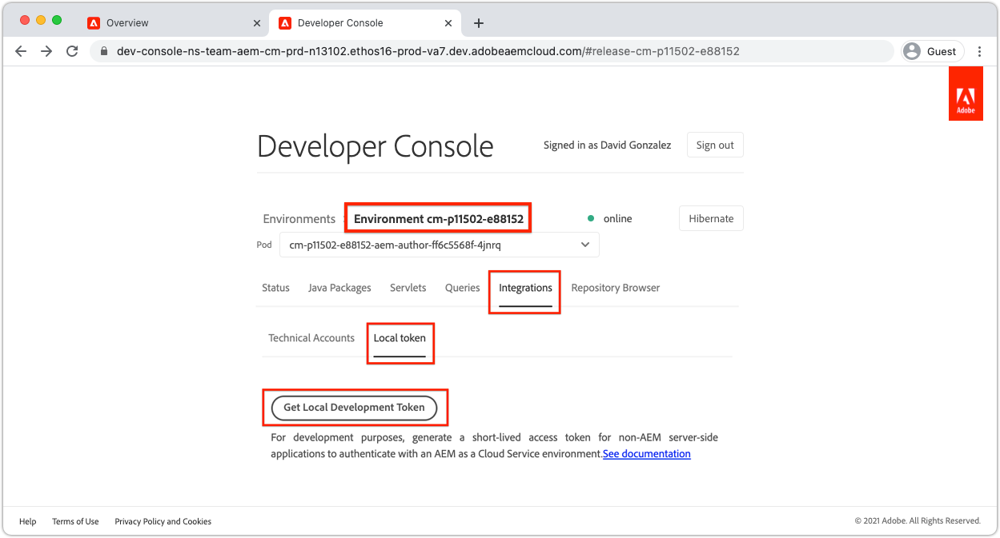

# Token di accesso per lo sviluppo locale

Gli sviluppatori che creano integrazioni che richiedono un accesso programmatico a AEM as a Cloud Service hanno bisogno di un modo semplice e rapido per ottenere token di accesso temporanei per AEM per facilitare le attività di sviluppo locale. Per soddisfare questa esigenza, la console per sviluppatori AEM consente agli sviluppatori di generare autonomamente token di accesso temporanei che possono essere utilizzati per accedere all’AEM a livello di programmazione.

>[!VIDEO](https://video.tv.adobe.com/v/330477?quality=12&learn=on)

## Generare un token di accesso per lo sviluppo locale


Il token di accesso per lo sviluppo locale consente di accedere ai servizi di authoring e pubblicazione dell’AEM come utente che ha generato il token, insieme alle relative autorizzazioni. Anche se si tratta di un token di sviluppo, non condividere questo token o archiviarlo nel controllo del codice sorgente.

1. In entrata [Adobe Admin Console](https://adminconsole.adobe.com/) assicurati che tu, sviluppatore, sia membro di:
   + __Cloud Manager - Sviluppatore__ Profilo di prodotto IMS (consente l’accesso alla Console per sviluppatori AEM)
   + Il __Amministratori AEM__ o __Utenti AEM__ Profilo di prodotto IMS per il servizio dell’ambiente AEM con cui il token di accesso si integra
   + Sandbox AEM as a Cloud Service ambiente richiedono l’iscrizione solo in __Amministratori AEM__ o __Utenti AEM__ Profilo prodotto
1. Accedi a [Adobe Cloud Manager](https://my.cloudmanager.adobe.com)
1. Apri il Programma contenente l’ambiente as a Cloud Service AEM da integrare con
1. Tocca il __puntini di sospensione__ accanto all&#39;ambiente in __Ambienti__ e seleziona __Console per sviluppatori__
1. Tocca in __Integrazioni__ scheda
1. Tocca il __Token locale__ scheda
1. Tocca __Ottieni token di sviluppo locale__ pulsante
1. Tocca il __pulsante di download__ nell’angolo in alto a sinistra per scaricare il file JSON contenente `accessToken` e salva il file JSON in una posizione sicura sul computer di sviluppo.
   + Questo è il tuo token di accesso sviluppatore 24 ore su 24 per l’ambiente as a Cloud Service AEM.



## Utilizzato il token di accesso per lo sviluppo locale{#use-local-development-access-token}


1. Scaricare il token di accesso temporaneo per lo sviluppo locale dalla console per sviluppatori AEM
   + Il token di accesso per lo sviluppo locale scade ogni 24 ore, pertanto gli sviluppatori devono scaricare i nuovi token di accesso ogni giorno
1. È in fase di sviluppo un’applicazione esterna che interagisce programmaticamente con gli as a Cloud Service AEM
1. L’applicazione esterna legge nel token di accesso per lo sviluppo locale
1. L’applicazione esterna crea le richieste HTTP per AEM as a Cloud Service, aggiungendo il token di accesso per lo sviluppo locale come token Bearer all’intestazione Autorizzazione delle richieste HTTP
1. AEM as a Cloud Service riceve la richiesta HTTP, la autentica, esegue il lavoro richiesto dalla richiesta HTTP e restituisce una risposta HTTP all’applicazione esterna.

### Applicazione esterna di esempio

Verrà creata una semplice applicazione JavaScript esterna per illustrare come accedere a livello di programmazione a AEM as a Cloud Service tramite HTTPS utilizzando il token di accesso per sviluppatori locale. Questo illustra come _qualsiasi_ l&#39;applicazione o il sistema eseguito al di fuori dell&#39;AEM, indipendentemente dal framework o dalla lingua, può utilizzare il token di accesso per l&#39;autenticazione a livello di programmazione e l&#39;accesso a AEM as a Cloud Service. In [sezione successiva](./service-credentials.md), questo codice dell’applicazione verrà aggiornato per supportare l’approccio alla generazione di un token per l’utilizzo in produzione.

Questa applicazione di esempio viene eseguita dalla riga di comando e aggiorna i metadati delle risorse AEM tramite le API HTTP di AEM Assets, utilizzando il seguente flusso:

1. Legge i parametri dalla riga di comando (`getCommandLineParams()`)
1. Ottiene il token di accesso utilizzato per l’autenticazione in AEM as a Cloud Service (`getAccessToken(...)`)
1. Elenca tutte le risorse presenti in una cartella di risorse AEM specificata nei parametri della riga di comando (`listAssetsByFolder(...)`)
1. Aggiorna i metadati delle risorse elencate con i valori specificati nei parametri della riga di comando (`updateMetadata(...)`)

L’elemento chiave per l’autenticazione a livello di programmazione in AEM tramite il token di accesso è l’aggiunta di un’intestazione di richiesta HTTP di autorizzazione a tutte le richieste HTTP effettuate all’AEM, nel formato seguente:

+ `Authorization: Bearer ACCESS_TOKEN`

## Esecuzione dell&#39;applicazione esterna

1. Assicurati che [Node.js](/help/cloud-service/local-development-environment/development-tools.md?lang=en#node-js) è installato nel computer di sviluppo locale, utilizzato per eseguire l&#39;applicazione esterna
1. Scarica e decomprimi il file [applicazione esterna di esempio](./assets/aem-guides_token-authentication-external-application.zip)
1. Dalla riga di comando, nella cartella del progetto, eseguire `npm install`
1. Copia il [ha scaricato il token di accesso per lo sviluppo locale](#download-local-development-access-token) in un file denominato `local_development_token.json` nella directory principale del progetto
   + Ma ricorda, non impegnare mai le credenziali per Git!
1. Apri `index.js` e controlla il codice e i commenti dell’applicazione esterna.

   ```javascript
   const fetch = require('node-fetch');
   const fs = require('fs');
   const auth = require('@adobe/jwt-auth');
   
   // The root context of the Assets HTTP API
   const ASSETS_HTTP_API = '/api/assets';
   
   // Command line parameters
   let params = { };
   
   /**
   * Application entry point function
   */
   (async () => {
       console.log('Example usage: node index.js aem=https://author-p1234-e5678.adobeaemcloud.com propertyName=metadata/dc:rights "propertyValue=WKND Limited Use" folder=/wknd-shared/en/adventures/napa-wine-tasting file=credentials-file.json' );
   
       // Parse the command line parameters
       params = getCommandLineParams();
   
       // Set the access token to be used in the HTTP requests to be local development access token
       params.accessToken = await getAccessToken(params.developerConsoleCredentials);
   
       // Get a list of all the assets in the specified assets folder
       let assets = await listAssetsByFolder(params.folder);
   
       // For each asset, update it's metadata
       await assets.forEach(asset => updateMetadata(asset, { 
           [params.propertyName]: params.propertyValue 
       }));
   })();
   
   /**
   * Returns a list of Assets HTTP API asset URLs that reference the assets in the specified folder.
   * 
   * https://experienceleague.adobe.com/docs/experience-manager-cloud-service/assets/admin/mac-api-assets.html?lang=en#retrieve-a-folder-listing
   * 
   * @param {*} folder the Assets HTTP API folder path (less the /content/dam path prefix)
   */
   async function listAssetsByFolder(folder) {
       return fetch(`${params.aem}${ASSETS_HTTP_API}${folder}.json`, {
               method: 'get',
               headers: { 
                   'Content-Type': 'application/json',
                   'Authorization': 'Bearer ' + params.accessToken // Provide the AEM access token in the Authorization header
               },
           })
           .then(res => {
               console.log(`${res.status} - ${res.statusText} @ ${params.aem}${ASSETS_HTTP_API}${folder}.json`);
   
               // If success, return the JSON listing assets, otherwise return empty results
               return res.status === 200 ? res.json() : { entities: [] };
           })
           .then(json => { 
               // Returns a list of all URIs for each non-content fragment asset in the folder
               return json.entities
                   .filter((entity) => entity['class'].indexOf('asset/asset') === -1 && !entity.properties.contentFragment)
                   .map(asset => asset.links.find(link => link.rel.find(r => r === 'self')).href);
           });
   }
   
   /**
   * Update the metadata of an asset in AEM
   * 
   * https://experienceleague.adobe.com/docs/experience-manager-cloud-service/assets/admin/mac-api-assets.html?lang=en#update-asset-metadata
   * 
   * @param {*} asset the Assets HTTP API asset URL to update
   * @param {*} metadata the metadata to update the asset with
   */
   async function updateMetadata(asset, metadata) {        
       await fetch(`${asset}`, {
               method: 'put',
               headers: { 
                   'Content-Type': 'application/json',
                   'Authorization': 'Bearer ' + params.accessToken // Provide the AEM access token in the Authorization header
               },
               body: JSON.stringify({
                   class: 'asset',
                   properties: metadata
               })
           })
           .then(res => { 
               console.log(`${res.status} - ${res.statusText} @ ${asset}`);
           });
   }
   
   /**
   * Parse and return the command line parameters. Expected params are:
   * 
   * - aem = The AEM as a Cloud Service hostname to connect to.
   *              Example: https://author-p12345-e67890.adobeaemcloud.com
   * - folder = The asset folder to update assets in. Note that the Assets HTTP API do NOT use the JCR `/content/dam` path prefix.
   *              Example: '/wknd-shared/en/adventures/napa-wine-tasting'
   * - propertyName = The asset property name to update. Note this is relative to the [dam:Asset]/jcr:content node of the asset.
   *              Example: metadata/dc:rights
   * - propertyValue = The value to update the asset property (specified by propertyName) with.
   *              Example: "WKND Free Use"
   * - file = The path to the JSON file that contains the credentials downloaded from AEM Developer Console
   *              Example: local_development_token_cm_p1234-e5678.json 
   */
   function getCommandLineParams() {
       let parameters = {};
   
       // Parse the command line params, splitting on the = delimiter
       for (let i = 2; i < process.argv.length; i++) {
           let key = process.argv[i].split('=')[0];
           let value = process.argv[i].split('=')[1];
   
           parameters[key] = value;
       };
   
       // Read in the credentials from the provided JSON file
       if (parameters.file) {
           parameters.developerConsoleCredentials = JSON.parse(fs.readFileSync(parameters.file));
       }
   
       console.log(parameters);
   
       return parameters;
   }
   
   async function getAccessToken(developerConsoleCredentials) {s
       if (developerConsoleCredentials.accessToken) {
           // This is a Local Development access token
           return developerConsoleCredentials.accessToken;
       } 
   }
   ```

   Rivedi `fetch(..)` chiamate in `listAssetsByFolder(...)` e `updateMetadata(...)`, e avviso `headers` definire `Authorization` Intestazione di richiesta HTTP con valore `Bearer ACCESS_TOKEN`. In questo modo la richiesta HTTP proveniente dall’applicazione esterna si autentica in AEM as a Cloud Service.

   ```javascript
   ...
   return fetch(`${params.aem}${ASSETS_HTTP_API}${folder}.json`, {
               method: 'get',
               headers: { 
                   'Content-Type': 'application/json',
                   'Authorization': 'Bearer ' + params.accessToken // Provide the AEM access token in the Authorization header
               },
   })...
   ```

   Eventuali richieste HTTP a AEM as a Cloud Service devono impostare il token di accesso Bearer nell’intestazione Autorizzazione. Ricorda che ogni ambiente AEM as a Cloud Service richiede il proprio token di accesso. Il token di accesso per lo sviluppo non funziona sullo stage o sulla produzione, quello dello stage non funziona sullo sviluppo o sulla produzione e quello della produzione non funziona sullo sviluppo o sullo stage!

1. Utilizzando la riga di comando, dalla directory principale del progetto esegui l’applicazione, trasmettendo i seguenti parametri:

   ```shell
   $ node index.js \
       aem=https://author-p1234-e5678.adobeaemcloud.com \
       folder=/wknd-shared/en/adventures/napa-wine-tasting \
       propertyName=metadata/dc:rights \
       propertyValue="WKND Limited Use" \
       file=local_development_token.json
   ```

   Vengono trasmessi i seguenti parametri:

   + `aem`: schema e nome host dell’ambiente as a Cloud Service AEM con cui l’applicazione interagisce (ad esempio `https://author-p1234-e5678.adobeaemcloud.com`).
   + `folder`: percorso della cartella di risorse le cui risorse vengono aggiornate con `propertyValue`; NON aggiungere il `/content/dam` prefisso (es. `/wknd-shared/en/adventures/napa-wine-tasting`)
   + `propertyName`: nome della proprietà della risorsa da aggiornare, relativo a `[dam:Asset]/jcr:content` (es. `metadata/dc:rights`).
   + `propertyValue`: valore per impostare `propertyName` a; i valori con spazi devono essere racchiusi con `"` (es. `"WKND Limited Use"`)
   + `file`: percorso relativo del file JSON scaricato da AEM Developer Console.

   Esecuzione corretta dell’output dei risultati dell’applicazione per ogni risorsa aggiornata:

   ```shell
   200 - OK @ https://author-p1234-e5678.adobeaemcloud.com/api/assets/wknd-shared/en/adventures/napa-wine-tasting.json
   200 - OK @ https://author-p1234-e5678.adobeaemcloud.com/api/assets/wknd-shared/en/adventures/napa-wine-tasting/AdobeStock_277654931.jpg.json
   200 - OK @ https://author-p1234-e5678.adobeaemcloud.com/api/assets/wknd-shared/en/adventures/napa-wine-tasting/AdobeStock_239751461.jpg.json
   200 - OK @ https://author-p1234-e5678.adobeaemcloud.com/api/assets/wknd-shared/en/adventures/napa-wine-tasting/AdobeStock_280313729.jpg.json
   200 - OK @ https://author-p1234-e5678.adobeaemcloud.com/api/assets/wknd-shared/en/adventures/napa-wine-tasting/AdobeStock_286664352.jpg.json
   ```

### Verifica dell’aggiornamento dei metadati in AEM

Verifica che i metadati siano stati aggiornati accedendo all’ambiente as a Cloud Service dell’AEM (assicurati che lo stesso host sia stato trasmesso al `aem` parametro della riga di comando).

1. Accedi all’ambiente as a Cloud Service dell’AEM con cui l’applicazione esterna ha interagito (utilizza lo stesso host fornito in `aem` (parametro della riga di comando)
1. Accedi a __Risorse__ > __File__
1. Spostati nella cartella delle risorse specificata da `folder` parametro della riga di comando, ad esempio __WKND__ > __Inglese__ > __Avventure__ > __Degustazione del vino Napa__
1. Apri __Proprietà__ per qualsiasi risorsa (non frammento di contenuto) nella cartella
1. Tocca per __Avanzate__ scheda
1. Rivedi il valore della proprietà aggiornata, ad esempio __Copyright__ che è mappato sul file aggiornato `metadata/dc:rights` proprietà JCR, che riflette il valore fornito nella `propertyValue` parametro, ad esempio __Utilizzo limitato WKND__


## Passaggi successivi

Ora che abbiamo effettuato l’accesso a livello di programmazione a AEM as a Cloud Service utilizzando il token di sviluppo locale. Ora è necessario aggiornare l’applicazione in modo che possa essere gestita utilizzando le credenziali del servizio, in modo che possa essere utilizzata in un contesto di produzione.

+ [Come utilizzare le credenziali del servizio](./service-credentials.md)
