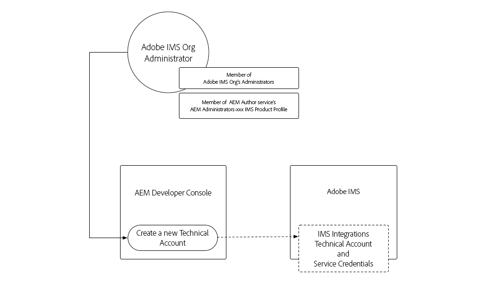

# Credenziali del servizio

Le integrazioni con Adobe Experience Manager (AEM) as a Cloud Service devono essere in grado di eseguire l’autenticazione al servizio AEM in modo sicuro. Il Developer Console di AEM consente di accedere alle credenziali del servizio, utilizzate per facilitare l’interazione programmatica tra applicazioni, sistemi e servizi esterni e AEM Author o Publish Services tramite HTTP.

AEM si integra con altri prodotti Adobe utilizzando [S2S OAuth gestito tramite Adobe Developer Console](https://experienceleague.adobe.com/en/docs/experience-manager-cloud-service/content/security/setting-up-ims-integrations-for-aem-as-a-cloud-service). Per le integrazioni personalizzate con gli account del servizio, le credenziali JWT vengono utilizzate e gestite in AEM Developer Console.

>[!VIDEO](https://video.tv.adobe.com/v/330519?quality=12&learn=on)

Le credenziali del servizio potrebbero essere simili [Token di accesso per lo sviluppo locale](./local-development-access-token.md), ma sono diverse in alcuni modi:

+ Le credenziali del servizio sono associate agli account tecnici. Per un account tecnico possono essere attive più credenziali di servizio.
+ Le credenziali del servizio sono _non_ token di accesso, ma sono credenziali utilizzate per _ottenere_ token di accesso.
+ Le credenziali del servizio sono più permanenti (il loro certificato scade ogni 365 giorni) e non cambiano se non revocate, mentre i token di accesso per lo sviluppo locale scadono ogni giorno.
+ Le credenziali di servizio per un ambiente AEM as a Cloud Service vengono mappate a un singolo utente di account tecnico AEM, mentre i token di accesso per lo sviluppo locale vengono autenticati come utente AEM che ha generato il token di accesso.
+ Un ambiente AEM as a Cloud Service può avere fino a dieci account tecnici, ciascuno con le proprie credenziali di servizio, ciascuno dei quali mappato a un utente AEM di account tecnico discreto.

Sia le credenziali del servizio che i token di accesso generati e i token di accesso per lo sviluppo locale devono essere tenuti segreti. Poiché tutti e tre possono essere utilizzati per ottenere, l’accesso al rispettivo ambiente AEM as a Cloud Service.

## Genera credenziali servizio

La generazione delle credenziali del servizio è suddivisa in due passaggi:

1. Creazione di un account tecnico una tantum da parte di un amministratore dell’organizzazione Adobe IMS
1. Download e utilizzo del codice JSON per le credenziali del servizio dell’account tecnico

### Creare un account tecnico

A differenza dei token di accesso per lo sviluppo locale, le credenziali del servizio richiedono la creazione di un account tecnico da parte di un amministratore IMS dell’organizzazione Adobe prima che sia possibile scaricarle. È necessario creare account tecnici discreti per ogni client che richiede l’accesso programmatico ad AEM.



Gli account tecnici vengono creati una volta, tuttavia le chiavi private utilizzate per gestire le credenziali del servizio associate all’account tecnico possono essere gestite nel tempo. Ad esempio, è necessario generare nuove credenziali chiave privata/servizio prima della scadenza della chiave privata corrente, per consentire a un utente di accedere ininterrottamente alle credenziali del servizio.

1. Assicurati di aver effettuato l’accesso come:
   + __Amministratore di sistema dell&#39;organizzazione Adobe IMS__
   + Membro del profilo di prodotto IMS __Amministratori AEM__ in __Autore AEM__
1. Accedi a [Adobe Cloud Manager](https://my.cloudmanager.adobe.com)
1. Apri il programma contenente l’ambiente AEM as a Cloud Service per integrare configurare le credenziali del servizio per
1. Tocca i puntini di sospensione accanto all&#39;ambiente nella sezione __Ambienti__ e seleziona __Developer Console__
1. Tocca nella scheda __Integrazioni__
1. Tocca la scheda __Account tecnici__
1. Tocca __Crea nuovo account tecnico__
1. Le credenziali di servizio dell’account tecnico vengono inizializzate e visualizzate come JSON


Una volta inizializzate le credenziali del servizio dell’ambiente AEM as Cloud Service, puoi scaricarle da altri sviluppatori AEM nella tua organizzazione Adobe IMS.

### Scarica credenziali servizio


Il download delle credenziali del servizio segue la stessa procedura dell&#39;inizializzazione.

1. Assicurati di aver effettuato l’accesso come:
   + __Amministratore organizzazione Adobe IMS__
   + Membro del profilo di prodotto IMS __Amministratori AEM__ in __Autore AEM__
1. Accedi a [Adobe Cloud Manager](https://my.cloudmanager.adobe.com)
1. Apri il programma contenente l’ambiente AEM as a Cloud Service da integrare con
1. Tocca i puntini di sospensione accanto all&#39;ambiente nella sezione __Ambienti__ e seleziona __Developer Console__
1. Tocca nella scheda __Integrazioni__
1. Tocca la scheda __Account tecnici__
1. Espandi l&#39;__account tecnico__ da utilizzare
1. Espandi la __Chiave privata__ di cui verranno scaricate le credenziali del servizio e verifica che lo stato sia __Attivo__
1. Tocca __...__ > __Visualizza__ associata alla __Chiave privata__, che visualizza il codice JSON per le credenziali del servizio
1. Tocca il pulsante Scarica nell’angolo in alto a sinistra per scaricare il file JSON contenente il valore delle credenziali del servizio e salvare il file in una posizione sicura

## Installare le credenziali del servizio

Le credenziali del servizio forniscono i dettagli necessari per generare un JWT, che viene scambiato con un token di accesso utilizzato per l’autenticazione con AEM as a Cloud Service. Le credenziali del servizio devono essere archiviate in un percorso sicuro accessibile dalle applicazioni, dai sistemi o dai servizi esterni che le utilizzano per accedere ad AEM. La modalità e la posizione di gestione delle credenziali del servizio sono univoche per cliente.

Per semplicità, questo tutorial trasmette le credenziali del servizio in tramite la riga di comando. Tuttavia, rivolgiti al tuo team di sicurezza IT per scoprire come memorizzare e accedere a queste credenziali in conformità alle linee guida di sicurezza della tua organizzazione.

1. Copia il file [JSON](#download-service-credentials) delle credenziali del servizio scaricato in un file denominato `service_token.json` nella radice del progetto
   + Ricorda, non eseguire mai il commit di _credenziali_ in Git.

## Usa credenziali servizio

Le credenziali del servizio, un oggetto JSON completo, non corrispondono al JWT né al token di accesso. Al contrario, le credenziali del servizio (che contengono una chiave privata) vengono utilizzate per generare un JWT, che viene scambiato con le API Adobe IMS per un token di accesso.


1. Scarica le credenziali del servizio da AEM Developer Console in un percorso sicuro
1. L’applicazione esterna deve interagire a livello di programmazione con l’ambiente AEM as a Cloud Service
1. L&#39;applicazione esterna legge le credenziali del servizio da un percorso sicuro
1. L’applicazione esterna utilizza le informazioni contenute nelle credenziali del servizio per creare un token JWT
1. Il token JWT viene inviato ad Adobe IMS per scambiarlo con un token di accesso
1. Adobe IMS restituisce un token di accesso che può essere utilizzato per accedere ad AEM as a Cloud Service
   + I token di accesso non possono modificare un’ora di scadenza.
1. L’applicazione esterna effettua richieste HTTP ad AEM as a Cloud Service, aggiungendo il token di accesso come token Bearer all’intestazione Autorizzazione delle richieste HTTP
1. AEM as a Cloud Service riceve la richiesta HTTP, la autentica ed esegue il lavoro richiesto dalla richiesta HTTP e restituisce una risposta HTTP all’applicazione esterna.

### Aggiornamenti dell’applicazione esterna

Per accedere ad AEM as a Cloud Service utilizzando le credenziali del servizio, è necessario aggiornare l’applicazione esterna in tre modi:

1. Leggi nelle credenziali del servizio

+ Per semplicità, le credenziali del servizio vengono lette dal file JSON scaricato. Tuttavia, in scenari di utilizzo reale, le credenziali del servizio devono essere memorizzate in modo sicuro in conformità alle linee guida sulla sicurezza della tua organizzazione

1. Generare un JWT dalle credenziali del servizio
1. Sostituire il JWT con un token di accesso

+ Se sono presenti credenziali del servizio, l’applicazione esterna utilizza questo token di accesso invece del token di accesso per lo sviluppo locale, quando accede ad AEM as a Cloud Service

In questa esercitazione, il modulo npm `@adobe/jwt-auth` di Adobe viene utilizzato per entrambi, (1) generare il JWT dalle credenziali del servizio e (2) scambiarlo per un token di accesso, in una singola chiamata di funzione. Se l’applicazione non è basata su JavaScript, puoi sviluppare un codice personalizzato nella lingua desiderata che crei il JWT dalle credenziali del servizio e lo scambia con un token di accesso Adobe IMS.

## Lettura delle credenziali del servizio

Rivedi `getCommandLineParams()` in modo da vedere come viene letto il file JSON delle credenziali del servizio utilizzando lo stesso codice utilizzato per leggere nel JSON del token di accesso per lo sviluppo locale.

```javascript
function getCommandLineParams() {
    ...

    // Read in the credentials from the provided JSON file
    // Since both the Local Development Access Token and Service Credentials files are JSON, this same approach can be re-used
    if (parameters.file) {
        parameters.developerConsoleCredentials = JSON.parse(fs.readFileSync(parameters.file));
    }

    ...
    return parameters;
}
```

## Creare un JWT e scambiarlo con un token di accesso

Una volta lette le credenziali del servizio, queste vengono utilizzate per generare un JWT che viene quindi scambiato con le API Adobe IMS per un token di accesso. Questo token di accesso può quindi essere utilizzato per accedere ad AEM as a Cloud Service.

Questa applicazione di esempio è basata su Node.js, quindi è consigliabile utilizzare il modulo [@adobe/jwt-auth](https://www.npmjs.com/package/@adobe/jwt-auth) npm per facilitare la generazione (1) di JWT e lo scambio (20 con Adobe IMS. Se l&#39;applicazione è stata sviluppata utilizzando un altro linguaggio, esaminare [gli esempi di codice appropriati](https://developer.adobe.com/developer-console/docs/guides/authentication/JWT/samples) su come creare la richiesta HTTP ad Adobe IMS utilizzando altri linguaggi di programmazione.

1. Aggiornare `getAccessToken(..)` per esaminare il contenuto del file JSON e determinare se rappresenta un token di accesso per lo sviluppo locale o credenziali del servizio. Ciò può essere facilmente ottenuto verificando l&#39;esistenza della proprietà `.accessToken`, che esiste solo per il token di accesso per lo sviluppo locale JSON.

   Se vengono fornite le credenziali del servizio, l’applicazione genera un JWT e lo scambia con Adobe IMS per ottenere un token di accesso. Utilizza la funzione [ di ](https://www.npmjs.com/package/@adobe/jwt-auth)@adobe/jwt-auth`auth(...)` che genera un JWT e lo scambia per un token di accesso in una singola chiamata di funzione. I parametri del metodo `auth(..)` sono un oggetto [JSON costituito da informazioni specifiche](https://www.npmjs.com/package/@adobe/jwt-auth#config-object) disponibili nel codice JSON delle credenziali del servizio, come descritto di seguito nel codice.

```javascript
 async function getAccessToken(developerConsoleCredentials) {

     if (developerConsoleCredentials.accessToken) {
         // This is a Local Development access token
         return developerConsoleCredentials.accessToken;
     } else {
         // This is the Service Credentials JSON object that must be exchanged with Adobe IMS for an access token
         let serviceCredentials = developerConsoleCredentials.integration;

         // Use the @adobe/jwt-auth library to pass the service credentials generated a JWT and exchange that with Adobe IMS for an access token.
         // If other programming languages are used, please see these code samples: https://www.adobe.io/authentication/auth-methods.html#!AdobeDocs/adobeio-auth/master/JWT/samples/samples.md
         let { access_token } = await auth({
             clientId: serviceCredentials.technicalAccount.clientId, // Client Id
             technicalAccountId: serviceCredentials.id,              // Technical Account Id
             orgId: serviceCredentials.org,                          // Adobe IMS Org Id
             clientSecret: serviceCredentials.technicalAccount.clientSecret, // Client Secret
             privateKey: serviceCredentials.privateKey,              // Private Key to sign the JWT
             metaScopes: serviceCredentials.metascopes.split(','),   // Meta Scopes defining level of access the access token should provide
             ims: `https://${serviceCredentials.imsEndpoint}`,       // IMS endpoint used to obtain the access token from
         });

         return access_token;
     }
 }
```

    Ora, a seconda del file JSON (JSON per il token di accesso per lo sviluppo locale o JSON per le credenziali del servizio) passato tramite il parametro della riga di comando &quot;file&quot;, l&#39;applicazione ricava un token di accesso.
    
    Ricorda che mentre le credenziali del servizio scadono ogni 365 giorni, il JWT e il token di accesso corrispondente scadono di frequente e devono essere aggiornati prima della scadenza. Questa operazione può essere eseguita utilizzando un &quot;refresh_token&quot; [fornito da Adobe IMS](https://www.adobe.io/authentication/auth-methods.html#!AdobeDocs/adobeio-auth/master/OAuth/OAuth.md#access-tokens).

1. Con queste modifiche implementate, il codice JSON per le credenziali del servizio è stato scaricato da AEM Developer Console e per semplicità è stato salvato come `service_token.json` nella stessa cartella di `index.js`. Ora eseguiamo l&#39;applicazione sostituendo il parametro della riga di comando `file` con `service_token.json` e aggiornando `propertyValue` in un nuovo valore in modo che gli effetti siano evidenti in AEM.

   ```shell
   $ node index.js \
       aem=https://author-p1234-e5678.adobeaemcloud.com \
       folder=/wknd-shared/en/adventures/napa-wine-tasting \
       propertyName=metadata/dc:rights \
       propertyValue="WKND Restricted Use" \
       file=service_token.json
   ```

   L&#39;output sul terminale è simile al seguente:

   ```shell
   200 - OK @ https://author-p1234-e5678.adobeaemcloud.com/api/assets/wknd-shared/en/adventures/napa-wine-tasting.json
   403 - Forbidden @ https://author-p1234-e5678.adobeaemcloud.com/api/assets/wknd-shared/en/adventures/napa-wine-tasting/AdobeStock_277654931.jpg.json
   403 - Forbidden @ https://author-p1234-e5678.adobeaemcloud.com/api/assets/wknd-shared/en/adventures/napa-wine-tasting/AdobeStock_239751461.jpg.json
   403 - Forbidden @ https://author-p1234-e5678.adobeaemcloud.com/api/assets/wknd-shared/en/adventures/napa-wine-tasting/AdobeStock_280313729.jpg.json
   403 - Forbidden @ https://author-p1234-e5678.adobeaemcloud.com/api/assets/wknd-shared/en/adventures/napa-wine-tasting/AdobeStock_286664352.jpg.json
   ```

   Le righe __403 - Non consentito__ indicano errori nelle chiamate API HTTP ad AEM as a Cloud Service. Questi errori 403 Forbidden si verificano quando si tenta di aggiornare i metadati delle risorse.

   Il motivo è che il token di accesso derivato dalle credenziali del servizio autentica la richiesta ad AEM utilizzando un utente AEM con account tecnico creato automaticamente che, per impostazione predefinita, dispone solo dell’accesso in lettura. Per fornire all’applicazione l’accesso in scrittura a AEM, all’utente AEM dell’account tecnico associato al token di accesso deve essere concessa l’autorizzazione in AEM.

## Configurare l’accesso in AEM

Il token di accesso derivato dalle credenziali del servizio utilizza un account tecnico AEM User con appartenenza al gruppo di utenti AEM __Contributors__.


Una volta che l’utente AEM dell’account tecnico esiste in AEM (dopo la prima richiesta HTTP con il token di accesso), le autorizzazioni di questo utente AEM possono essere gestite come quelle di altri utenti AEM.

1. Innanzitutto, individua il nome di accesso AEM dell&#39;account tecnico aprendo il file JSON delle credenziali del servizio scaricato da AEM Developer Console, quindi individua il valore `integration.email`, che dovrebbe essere simile a: `12345678-abcd-9000-efgh-0987654321c@techacct.adobe.com`.
1. Accedi al servizio Author dell’ambiente AEM corrispondente come amministratore AEM
1. Passa a __Strumenti__ > __Sicurezza__ > __Utenti__
1. Individua l&#39;utente AEM con il __Nome di accesso__ identificato nel passaggio 1 e apri le relative __Proprietà__
1. Passa alla scheda __Gruppi__ e aggiungi il gruppo __Utenti DAM__ (che dispone dell&#39;accesso in scrittura alle risorse)
   + [Consulta l&#39;elenco dei gruppi di utenti forniti da AEM](https://experienceleague.adobe.com/docs/experience-manager-65/administering/security/security.html#built-in-users-and-groups) a cui aggiungere l&#39;utente del servizio per ottenere le autorizzazioni ottimali. Se nessun gruppo di utenti fornito da AEM è sufficiente, creane uno tuo e aggiungi le autorizzazioni appropriate.
1. Tocca __Salva e chiudi__

Con l’account tecnico consentito in AEM per disporre delle autorizzazioni di scrittura per le risorse, esegui nuovamente l’applicazione:

```shell
$ node index.js \
    aem=https://author-p1234-e5678.adobeaemcloud.com \
    folder=/wknd-shared/en/adventures/napa-wine-tasting \
    propertyName=metadata/dc:rights \
    propertyValue="WKND Restricted Use" \
    file=service_token.json
```

L&#39;output sul terminale è simile al seguente:

```
200 - OK @ https://author-p1234-e5678.adobeaemcloud.com/api/assets/wknd-shared/en/adventures/napa-wine-tasting.json
200 - OK @ https://author-p1234-e5678.adobeaemcloud.com/api/assets/wknd-shared/en/adventures/napa-wine-tasting/AdobeStock_277654931.jpg.json
200 - OK @ https://author-p1234-e5678.adobeaemcloud.com/api/assets/wknd-shared/en/adventures/napa-wine-tasting/AdobeStock_286664352.jpg.json
200 - OK @ https://author-p1234-e5678.adobeaemcloud.com/api/assets/wknd-shared/en/adventures/napa-wine-tasting/AdobeStock_239751461.jpg.json
200 - OK @ https://author-p1234-e5678.adobeaemcloud.com/api/assets/wknd-shared/en/adventures/napa-wine-tasting/AdobeStock_280313729.jpg.json
```

## Verifica le modifiche

1. Accedere all&#39;ambiente AEM as a Cloud Service aggiornato (utilizzando lo stesso nome host fornito nel parametro della riga di comando `aem`)
1. Passa a __Assets__ > __File__
1. Spostati nella cartella delle risorse specificata dal parametro della riga di comando `folder`, ad esempio __WKND__ > __Inglese__ > __Avventure__ > __Degustazione del vino Napa__
1. Apri __Proprietà__ per qualsiasi risorsa nella cartella
1. Passa alla scheda __Avanzate__
1. Rivedi il valore della proprietà aggiornata, ad esempio __Copyright__ mappato alla proprietà JCR `metadata/dc:rights` aggiornata, che ora riflette il valore fornito nel parametro `propertyValue`, ad esempio __Utilizzo limitato WKND__


## Congratulazioni.

Ora che abbiamo effettuato l’accesso a livello di programmazione ad AEM as a Cloud Service utilizzando un token di accesso per lo sviluppo locale e un token di accesso per il servizio pronto per la produzione.
