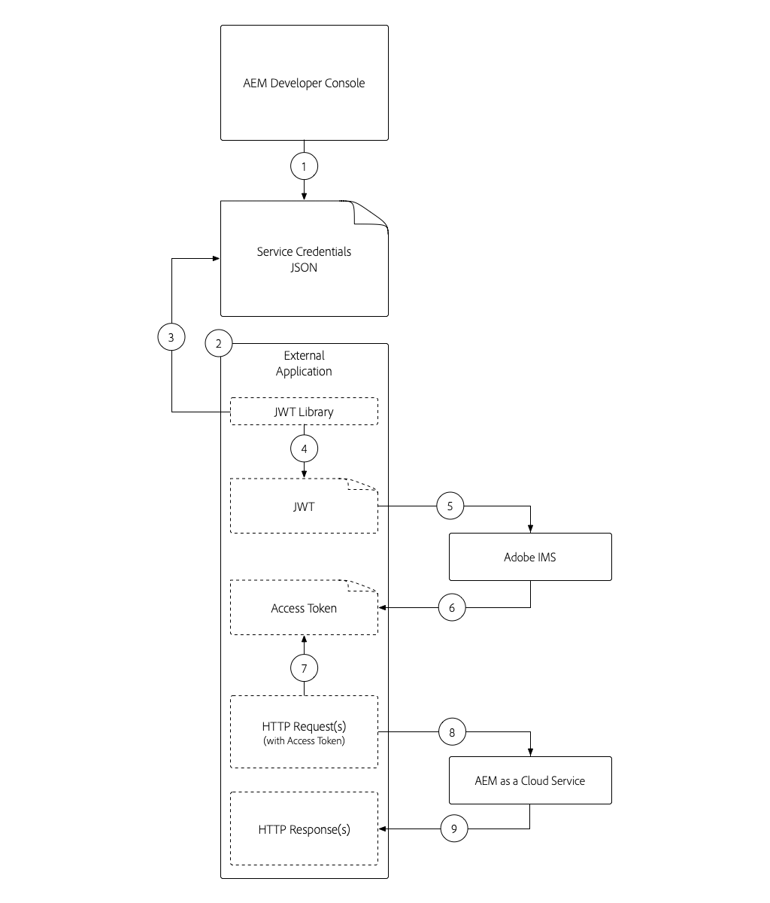

# Credenziali del servizio

Le integrazioni con Adobe Experience Manager (AEM) as a Cloud Service devono essere in grado di eseguire l’autenticazione in modo sicuro al servizio AEM. AEM Developer Console consente di accedere alle credenziali del servizio, utilizzate per facilitare l’interazione programmatica di applicazioni, sistemi e servizi esterni con i servizi di authoring o pubblicazione AEM tramite HTTP.

>[!VIDEO](https://video.tv.adobe.com/v/330519?quality=12&learn=on)

Le credenziali del servizio possono apparire simili [Token di accesso allo sviluppo locale](./local-development-access-token.md) ma sono diversi in alcuni modi chiave:

+ Le credenziali del servizio sono associate agli account tecnici. Le credenziali di servizio multiple possono essere attive per un account tecnico.
+ Le credenziali del servizio sono _not_ token di accesso, ma sono credenziali utilizzate per _ottenere_ token di accesso.
+ Le credenziali del servizio sono più permanenti (il loro certificato scade ogni 365 giorni) e non cambiano se non vengono revocate, mentre i token di accesso allo sviluppo locale scadono ogni giorno.
+ Le credenziali del servizio per un ambiente as a Cloud Service AEM vengono mappate a un singolo utente di account tecnico AEM, mentre i token di accesso allo sviluppo locale si autenticano come utente AEM che ha generato il token di accesso.
+ Un ambiente as a Cloud Service AEM può disporre di un massimo di dieci account tecnici, ciascuno con le proprie credenziali di servizio, ciascuno dei quali mappato a account tecnico discreto AEM utente.

Sia le credenziali del servizio che i token di accesso generati, nonché i token di accesso allo sviluppo locale, devono essere mantenuti segreti. Come tutti e tre possono essere utilizzati per ottenere, l&#39;accesso al rispettivo ambiente as a Cloud Service AEM.

## Genera credenziali del servizio

La generazione delle credenziali del servizio è suddivisa in due passaggi:

1. Creazione di un account tecnico una tantum da parte di un amministratore dell’organizzazione Adobe IMS
1. Download e utilizzo del JSON delle credenziali di servizio dell’account tecnico

### Creare un account tecnico

Le credenziali del servizio, a differenza dei token di accesso allo sviluppo locale, richiedono la creazione di un account tecnico da parte di un amministratore IMS dell&#39;organizzazione Adobe prima di poter essere scaricate. È necessario creare account tecnici discreti per ogni client che richiede l’accesso programmatico a AEM.


Gli account tecnici vengono creati una volta, tuttavia le chiavi private utilizzano per gestire le credenziali di servizio associate all&#39;account tecnico possono essere gestite nel tempo. Ad esempio, è necessario generare nuove credenziali di chiave privata/servizio prima della scadenza della chiave privata corrente, per consentire l’accesso ininterrotto da parte di un utente delle credenziali del servizio.

1. Verifica di aver effettuato l’accesso come:
   + __Amministratore dell’organizzazione Adobe IMS__
   + Membro __Amministratori AEM__ Profilo di prodotto IMS su __AEM Author__
1. Accedi a [Adobe Cloud Manager](https://my.cloudmanager.adobe.com)
1. Apri il programma contenente l’ambiente as a Cloud Service AEM per integrare l’impostazione delle credenziali del servizio per
1. Tocca i puntini di sospensione accanto all’ambiente nel __Ambienti__ e seleziona __Console per sviluppatori__
1. Tocca __Integrazioni__ scheda
1. Tocca __Account tecnici__ scheda
1. Tocca __Crea nuovo account tecnico__ pulsante
1. Le credenziali di servizio dell’account tecnico vengono inizializzate e visualizzate come JSON


Una volta inizializzata l’AEM come credenziali di servizio dell’ambiente di Cloud Service, altri sviluppatori AEM nella tua organizzazione Adobe IMS possono scaricarle.

### Scaricare le credenziali del servizio


Il download delle credenziali del servizio segue i passaggi simili all&#39;inizializzazione.

1. Verifica di aver effettuato l’accesso come:
   + __Amministratore dell’organizzazione Adobe IMS__
   + Membro __Amministratori AEM__ Profilo di prodotto IMS su __AEM Author__
1. Accedi a [Adobe Cloud Manager](https://my.cloudmanager.adobe.com)
1. Apri il programma contenente l’ambiente as a Cloud Service AEM con cui eseguire l’integrazione
1. Tocca i puntini di sospensione accanto all’ambiente nel __Ambienti__ e seleziona __Console per sviluppatori__
1. Tocca __Integrazioni__ scheda
1. Tocca __Account tecnici__ scheda
1. Espandi la __Account tecnico__ da utilizzare
1. Espandi la __Chiave privata__ di cui verranno scaricate le credenziali di servizio e verifica che lo stato sia __Attivo__
1. Tocca __...__ > __Visualizza__ associato a __Chiave privata__, che visualizza JSON delle credenziali del servizio
1. Tocca il pulsante di download nell’angolo in alto a sinistra per scaricare il file JSON contenente il valore delle credenziali del servizio e salvare il file in una posizione sicura

## Installare le credenziali del servizio

Le credenziali del servizio forniscono i dettagli necessari per generare un JWT, scambiato con un token di accesso utilizzato per l’autenticazione con AEM as a Cloud Service. Le credenziali del servizio devono essere archiviate in un percorso sicuro accessibile dalle applicazioni, dai sistemi o dai servizi esterni che le utilizzano per accedere alle AEM. Modalità e posizione di gestione delle credenziali del servizio univoche per cliente.

Per semplicità, questa esercitazione passa le credenziali del servizio in tramite la riga di comando. Tuttavia, collabora con il tuo team IT Security per scoprire come archiviare e accedere a queste credenziali in conformità alle linee guida sulla sicurezza della tua organizzazione.

1. Copia il [JSON delle credenziali del servizio scaricato](#download-service-credentials) a un file denominato `service_token.json` nella directory principale del progetto
   + Ricorda, non commettere mai _qualsiasi_ a Git!

## Utilizzare le credenziali del servizio

Le credenziali del servizio, un oggetto JSON completo, non sono uguali né al JWT né al token di accesso. Le credenziali del servizio (che contengono una chiave privata) vengono invece utilizzate per generare un JWT, che viene scambiato con le API Adobe IMS per un token di accesso.



1. Scaricare le credenziali del servizio da AEM Console per sviluppatori in un percorso protetto
1. L’applicazione esterna deve interagire programmaticamente con AEM ambiente as a Cloud Service
1. L&#39;applicazione esterna legge le credenziali del servizio da una posizione protetta
1. L’applicazione esterna utilizza le informazioni provenienti dalle credenziali del servizio per creare un token JWT
1. Il token JWT viene inviato ad Adobe IMS per scambiare un token di accesso
1. Adobe IMS restituisce un token di accesso che può essere utilizzato per accedere AEM as a Cloud Service
   + La scadenza dei token di accesso può essere richiesta. È consigliabile mantenere la vita breve del token di accesso e aggiornarlo quando necessario.
1. L’applicazione esterna invia richieste HTTP a AEM as a Cloud Service, aggiungendo il token di accesso come token portatore all’intestazione Autorizzazione delle richieste HTTP
1. AEM as a Cloud Service riceve la richiesta HTTP, autentica la richiesta ed esegue il lavoro richiesto dalla richiesta HTTP e restituisce una risposta HTTP all&#39;applicazione esterna

### Aggiornamenti dell’applicazione esterna

Per accedere AEM as a Cloud Service tramite le credenziali del servizio, l’applicazione esterna deve essere aggiornata in tre modi:

1. Leggi nelle credenziali del servizio

+ Per semplicità, le credenziali del servizio vengono lette dal file JSON scaricato, tuttavia in scenari di utilizzo reale, le credenziali del servizio devono essere memorizzate in modo sicuro in conformità alle linee guida per la sicurezza della tua organizzazione

1. Generare una JWT dalle credenziali del servizio
1. Scambio JWT per un token di accesso

+ Quando sono presenti credenziali di servizio, l’applicazione esterna utilizza questo token di accesso invece del token di accesso allo sviluppo locale, quando accede AEM as a Cloud Service

In questa esercitazione, Adobe `@adobe/jwt-auth` Il modulo npm viene utilizzato per entrambi, (1) generare il JWT dalle credenziali del servizio e (2) scambiarlo per un token di accesso, in una singola chiamata di funzione. Se la tua applicazione non è basata su JavaScript, controlla il [codice di esempio in altre lingue](https://developer.adobe.com/developer-console/docs/guides/authentication/JWT/samples/) per informazioni su come creare un JWT dalle credenziali del servizio e sostituirlo con un token di accesso con Adobe IMS.

## Leggi le credenziali del servizio

Consulta la sezione `getCommandLineParams()` vedi come viene letto il file JSON delle credenziali del servizio utilizzando lo stesso codice utilizzato per leggere nel JSON del token di accesso allo sviluppo locale.

```javascript
function getCommandLineParams() {
    ...

    // Read in the credentials from the provided JSON file
    // Since both the Local Development Access Token and Service Credentials files are JSON, this same approach can be re-used
    if (parameters.file) {
        parameters.developerConsoleCredentials = JSON.parse(fs.readFileSync(parameters.file));
    }

    ...
    return parameters;
}
```

## Creare un JWT e scambiare un token di accesso

Una volta lette le credenziali del servizio, vengono utilizzate per generare un JWT che viene poi scambiato con le API Adobe IMS per un token di accesso. Questo token di accesso può quindi essere utilizzato per accedere AEM as a Cloud Service.

Questa applicazione di esempio è basata su Node.js, quindi è meglio utilizzare [@adobe/jwt-auth](https://www.npmjs.com/package/@adobe/jwt-auth) modulo npm per facilitare la generazione (1) di JWT e lo scambio (20 con Adobe IMS. Se l&#39;applicazione viene sviluppata utilizzando un&#39;altra lingua, consulta [campioni di codice appropriati](https://developer.adobe.com/developer-console/docs/guides/authentication/JWT/samples/) su come creare la richiesta HTTP ad Adobe IMS utilizzando altri linguaggi di programmazione.

1. Aggiorna `getAccessToken(..)` per controllare il contenuto del file JSON e determinare se rappresenta un token di accesso allo sviluppo locale o credenziali di servizio. Ciò può essere facilmente ottenuto controllando l&#39;esistenza del `.accessToken` , che esiste solo per il token di accesso locale JSON del token.

   Se vengono fornite le credenziali di servizio, l’applicazione genera un JWT e lo scambia con Adobe IMS per un token di accesso. Utilizza la [@adobe/jwt-auth](https://www.npmjs.com/package/@adobe/jwt-auth)s `auth(...)` funzione che genera un JWT e lo scambia per un token di accesso in una singola chiamata di funzione. I parametri a `auth(..)` sono [Oggetto JSON composto da informazioni specifiche](https://www.npmjs.com/package/@adobe/jwt-auth#config-object) disponibile dal JSON delle credenziali del servizio, come descritto di seguito nel codice .

```javascript
 async function getAccessToken(developerConsoleCredentials) {

     if (developerConsoleCredentials.accessToken) {
         // This is a Local Development access token
         return developerConsoleCredentials.accessToken;
     } else {
         // This is the Service Credentials JSON object that must be exchanged with Adobe IMS for an access token
         let serviceCredentials = developerConsoleCredentials.integration;

         // Use the @adobe/jwt-auth library to pass the service credentials generated a JWT and exchange that with Adobe IMS for an access token.
         // If other programming languages are used, please see these code samples: https://www.adobe.io/authentication/auth-methods.html#!AdobeDocs/adobeio-auth/master/JWT/samples/samples.md
         let { access_token } = await auth({
             clientId: serviceCredentials.technicalAccount.clientId, // Client Id
             technicalAccountId: serviceCredentials.id,              // Technical Account Id
             orgId: serviceCredentials.org,                          // Adobe IMS Org Id
             clientSecret: serviceCredentials.technicalAccount.clientSecret, // Client Secret
             privateKey: serviceCredentials.privateKey,              // Private Key to sign the JWT
             metaScopes: serviceCredentials.metascopes.split(','),   // Meta Scopes defining level of access the access token should provide
             ims: `https://${serviceCredentials.imsEndpoint}`,       // IMS endpoint used to obtain the access token from
         });

         return access_token;
     }
 }
```

    Ora, a seconda del file JSON - il JSON del token di accesso allo sviluppo locale o il JSON delle credenziali del servizio - viene passato tramite il parametro della riga di comando `file`, l’applicazione deriva un token di accesso.
    
    Tieni presente che, mentre le credenziali del servizio scadono ogni 365 giorni, il JWT e il token di accesso corrispondente scadono frequentemente e devono essere aggiornati prima della loro scadenza. Questo può essere fatto utilizzando un `refresh_token` [fornito da Adobe IMS](https://www.adobe.io/authentication/auth-methods.html#!AdobeDocs/adobeio-auth/master/OAuth/OAuth.md#access-token).

1. Con queste modifiche, il JSON delle credenziali del servizio è stato scaricato da AEM Developer Console e per semplicità salvato come `service_token.json` nella stessa cartella `index.js`. Ora eseguiamo l’applicazione che sostituisce il parametro della riga di comando `file` con `service_token.json`e l&#39;aggiornamento `propertyValue` a un nuovo valore in modo che gli effetti siano evidenti in AEM.

   ```shell
   $ node index.js \
       aem=https://author-p1234-e5678.adobeaemcloud.com \
       folder=/wknd-shared/en/adventures/napa-wine-tasting \
       propertyName=metadata/dc:rights \
       propertyValue="WKND Restricted Use" \
       file=service_token.json
   ```

   L&#39;output sul terminale si presenta così:

   ```shell
   200 - OK @ https://author-p1234-e5678.adobeaemcloud.com/api/assets/wknd-shared/en/adventures/napa-wine-tasting.json
   403 - Forbidden @ https://author-p1234-e5678.adobeaemcloud.com/api/assets/wknd-shared/en/adventures/napa-wine-tasting/AdobeStock_277654931.jpg.json
   403 - Forbidden @ https://author-p1234-e5678.adobeaemcloud.com/api/assets/wknd-shared/en/adventures/napa-wine-tasting/AdobeStock_239751461.jpg.json
   403 - Forbidden @ https://author-p1234-e5678.adobeaemcloud.com/api/assets/wknd-shared/en/adventures/napa-wine-tasting/AdobeStock_280313729.jpg.json
   403 - Forbidden @ https://author-p1234-e5678.adobeaemcloud.com/api/assets/wknd-shared/en/adventures/napa-wine-tasting/AdobeStock_286664352.jpg.json
   ```

   La __403 - Vietato__ , indica gli errori nelle chiamate API HTTP a AEM as a Cloud Service. Questi 403 Errori proibiti si verificano quando si tenta di aggiornare i metadati delle risorse.

   Il motivo è che il token di accesso derivato da Service Credentials autentica la richiesta per AEM utilizzando un account tecnico creato automaticamente AEM utente, che per impostazione predefinita ha accesso in sola lettura. Per fornire l’accesso in scrittura all’AEM dell’applicazione, è necessario concedere l’autorizzazione all’account tecnico AEM utente associato al token di accesso in AEM.

## Configurare l’accesso in AEM

Il token di accesso derivato da Credenziali di servizio utilizza un account tecnico AEM Utente che ha l&#39;iscrizione nel __Collaboratori__ AEM gruppo di utenti.


Una volta che l&#39;account tecnico AEM utente esiste in AEM (dopo la prima richiesta HTTP con il token di accesso), le autorizzazioni di questo utente AEM possono essere gestite come gli altri utenti AEM.

1. Per prima cosa, individua il nome di accesso AEM dell’account tecnico aprendo il JSON delle credenziali del servizio scaricato da AEM Developer Console e individua il `integration.email` , che deve essere simile a: `12345678-abcd-9000-efgh-0987654321c@techacct.adobe.com`.
1. Accedi al servizio Author dell’ambiente AEM corrispondente come amministratore AEM
1. Passa a __Strumenti__ > __Sicurezza__ > __Utenti__
1. Individua l’utente AEM con il __Nome di accesso__ identificati nel passaggio 1 e aprite i relativi __Proprietà__
1. Passa a __Gruppi__ e aggiungi la __Utenti DAM__ gruppo (che come accesso in scrittura alle risorse)
1. Tocca __Salva e chiudi__

Con l’account tecnico consentito in AEM di disporre delle autorizzazioni di scrittura sulle risorse, esegui nuovamente l’applicazione:

```shell
$ node index.js \
    aem=https://author-p1234-e5678.adobeaemcloud.com \
    folder=/wknd-shared/en/adventures/napa-wine-tasting \
    propertyName=metadata/dc:rights \
    propertyValue="WKND Restricted Use" \
    file=service_token.json
```

L&#39;output sul terminale si presenta così:

```
200 - OK @ https://author-p1234-e5678.adobeaemcloud.com/api/assets/wknd-shared/en/adventures/napa-wine-tasting.json
200 - OK @ https://author-p1234-e5678.adobeaemcloud.com/api/assets/wknd-shared/en/adventures/napa-wine-tasting/AdobeStock_277654931.jpg.json
200 - OK @ https://author-p1234-e5678.adobeaemcloud.com/api/assets/wknd-shared/en/adventures/napa-wine-tasting/AdobeStock_286664352.jpg.json
200 - OK @ https://author-p1234-e5678.adobeaemcloud.com/api/assets/wknd-shared/en/adventures/napa-wine-tasting/AdobeStock_239751461.jpg.json
200 - OK @ https://author-p1234-e5678.adobeaemcloud.com/api/assets/wknd-shared/en/adventures/napa-wine-tasting/AdobeStock_280313729.jpg.json
```

## Verifica le modifiche

1. Accedi all’ambiente as a Cloud Service AEM che è stato aggiornato (utilizzando lo stesso nome host fornito nel `aem` parametro della riga di comando)
1. Passa a __Risorse__ > __File__
1. Passa alla cartella di risorse specificata dalla `folder` parametro della riga di comando, ad esempio __WKND__ > __Inglese__ > __Avventure__ > __Degustazione di vino Napa__
1. Apri __Proprietà__ per qualsiasi risorsa della cartella
1. Passa a __Avanzate__ scheda
1. Rivedi il valore della proprietà aggiornata, ad esempio __Copyright__ mappata al `metadata/dc:rights` Proprietà JCR, che ora riflette il valore fornito nel `propertyValue` , ad esempio __Uso limitato WKND__


## Congratulazioni. 

Ora che abbiamo effettuato l’accesso programmaticamente AEM as a Cloud Service utilizzando un token di accesso allo sviluppo locale e un token di accesso da servizio a servizio pronto per la produzione!
