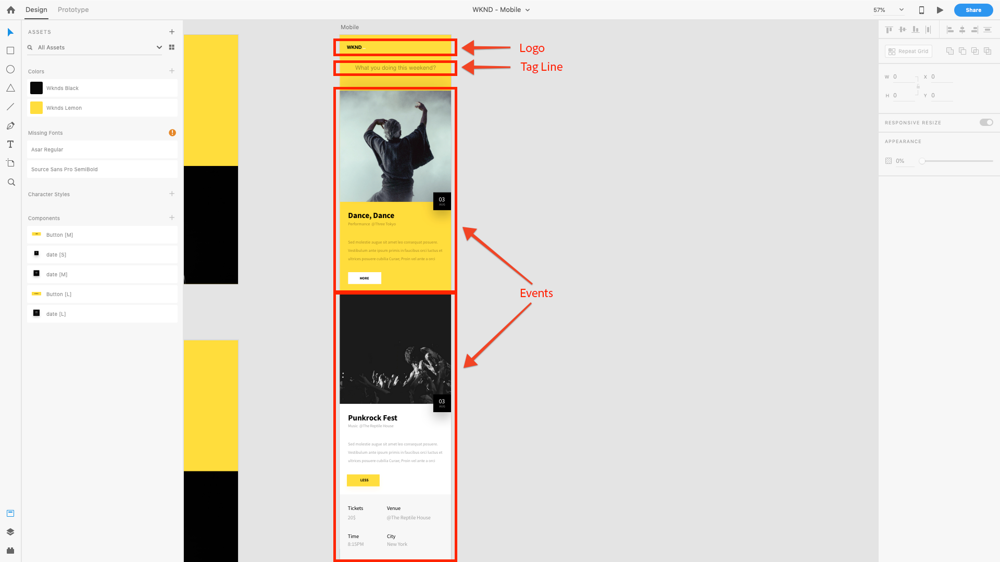

# Capitolo 4 - Definizione dei modelli di Content Services

Il capitolo 4 del tutorial AEM Headless tratta il ruolo dei modelli AEM modificabili nel contesto di AEM Content Services. I modelli modificabili vengono utilizzati per definire la struttura del contenuto JSON che AEM Content Services espone ai clienti tramite la composizione dei componenti AEM abilitati per Content Services.

## Informazioni sul ruolo dei modelli in AEM Content Services

I modelli modificabili dell’AEM vengono utilizzati per definire gli endpoint HTTP a cui si accede per esporre il contenuto dell’evento come JSON.

In genere i modelli modificabili dell’AEM vengono utilizzati per definire le pagine web, ma questo utilizzo è semplicemente una convenzione. I modelli modificabili possono essere utilizzati per comporre **qualsiasi** set di contenuti; la modalità di accesso a tali contenuti: come HTML in un browser, come JSON utilizzato da JavaScript (AEM SPA Editor) o da un&#39;app mobile è una funzione del modo in cui viene richiesta la pagina.

In AEM Content Services, i modelli modificabili vengono utilizzati per definire la modalità di esposizione dei dati JSON.

Per l&#39;app [!DNL WKND Mobile] verrà creato un unico modello modificabile utilizzato per gestire un singolo endpoint API. Anche se questo esempio è semplice per illustrare i concetti di headless AEM, puoi creare più pagine (o endpoint) ciascuna delle quali esporre diversi set di contenuti per creare un’API più complessa e meglio organizzata.

## Informazioni sull’endpoint API

Per capire come comporre il nostro endpoint API e capire quali contenuti dovrebbero essere esposti alla nostra app [!DNL WKND Mobile], rivediamo la progettazione.

Come possiamo vedere, abbiamo tre set logici di contenuti da fornire all’app mobile.

1. Il **Logo**
2. **Linea tag**
3. Elenco di **eventi**

A tal fine, possiamo mappare questi requisiti sui Componenti AEM (e, nel nostro caso, sui Componenti core WCM dell’AEM) per esporre il contenuto richiesto come JSON.

1. Il **Logo** viene visualizzato tramite un **componente immagine**
2. La **linea tag** è stata rilevata tramite un **componente testo**
3. L&#39;elenco di **Eventi** viene visualizzato tramite un **componente Elenco frammenti di contenuto** che a sua volta fa riferimento a un set di frammenti di contenuto evento.

>[!NOTE]
>
>Per supportare l&#39;esportazione JSON di pagine e componenti da parte del servizio di contenuti AEM, le pagine e i componenti devono **derivare dai componenti core WCM dell&#39;AEM**.
>
>[I componenti core WCM dell&#39;AEM](https://github.com/Adobe-Marketing-Cloud/aem-core-wcm-components) dispongono di funzionalità incorporate per supportare uno schema JSON normalizzato di pagine e componenti esportati. Tutti i componenti mobili WKND utilizzati in questa esercitazione (Pagina, Immagine, Testo e Elenco frammenti di contenuto) sono derivati dai componenti core WCM dell’AEM.

## Definizione del modello API per gli eventi

1. Passa a **[!UICONTROL Strumenti] > [!UICONTROL Generale] > [!UICONTROL Modelli] >[!DNL WKND Mobile]**.

1. Crea il modello **[!DNL Events API]**:

   1. Tocca **[!UICONTROL Crea]** nella barra delle azioni superiore
   1. Seleziona il modello **[!DNL WKND Mobile - Empty Page]**
   1. Tocca **[!UICONTROL Avanti]** nella barra delle azioni superiore
   1. Immetti **[!DNL Events API]** nel campo [!UICONTROL Titolo modello]
   1. Tocca **[!UICONTROL Crea]** nella barra delle azioni superiore
   1. Tocca **[!UICONTROL Apri]** per aprire il nuovo modello da modificare

1. Innanzitutto, consentiamo ai tre componenti AEM identificati di modellare il contenuto modificando il [!UICONTROL criterio] del [!UICONTROL contenitore layout] principale. Verificare che la modalità **[!UICONTROL Struttura]** sia attiva, selezionare **[!DNL Layout Container \[Root\]]** e toccare il pulsante **[!UICONTROL Criteri]**.
1. In **[!UICONTROL Proprietà] > [!UICONTROL Componenti consentiti]** cercare **[!DNL WKND Mobile]**. Consentire ai seguenti componenti del gruppo di componenti [!DNL WKND Mobile] di utilizzarli nella pagina API [!DNL Events].

   * **[!DNL WKND Mobile > Image]**

      * Logo per l’app

   * **[!DNL WKND Mobile > Text]**

      * Testo introduttivo dell’app

   * **[!DNL WKND Mobile > Content Fragment List]**

      * Elenco delle categorie di eventi disponibili per la visualizzazione nell’app

1. Al termine, tocca il segno di spunta **[!UICONTROL Fine]** nell&#39;angolo superiore destro.
1. **Aggiorna** la finestra del browser per visualizzare il nuovo elenco di [!UICONTROL Componenti consentiti] nella barra a sinistra.
1. Dal Finder Componenti nella barra a sinistra, trascina i seguenti Componenti AEM:
   1. **[!DNL Image]** per il logo
   2. **[!DNL Text]** per la linea di tag
   3. **[!DNL Content Fragment List]** per gli eventi
1. **Per ciascuno dei componenti precedenti**, selezionarli e premere il pulsante **sblocca**.
1. Verificare tuttavia che il contenitore **layout** sia **bloccato** per impedire l&#39;aggiunta di altri componenti o la rimozione di questi tre componenti.
1. Tocca **[!UICONTROL Informazioni pagina] > [!UICONTROL Visualizza in Amministratore]** per tornare all&#39;elenco dei modelli [!DNL WKND Mobile]. Seleziona il modello **[!DNL Events API]** appena creato e tocca **[!UICONTROL Abilita]** nella barra delle azioni superiore.

>[!VIDEO](https://video.tv.adobe.com/v/28342?quality=12&learn=on)

>[!NOTE]
>
> I componenti utilizzati per far emergere il contenuto vengono aggiunti al modello e bloccati. Questo consente agli autori di modificare i componenti predefiniti, ma non di aggiungere o rimuovere arbitrariamente i componenti, in quanto la modifica dell’API stessa potrebbe interrompere i presupposti sulla struttura JSON e interrompere il consumo delle app. Tutte le API devono essere stabili.

## Passaggi successivi

Se necessario, installa il pacchetto di contenuti [com.adobe.aem.guides.wknd-mobile.content.chapter-4.zip](https://github.com/adobe/aem-guides-wknd-mobile/releases/latest) su AEM Author tramite [Gestione pacchetti AEM](http://localhost:4502/crx/packmgr/index.jsp). Questo pacchetto contiene le configurazioni e il contenuto descritti in questo e nei capitoli precedenti dell’esercitazione.

* [Capitolo 5 - Authoring delle pagine di Content Services](./chapter-5.md)
