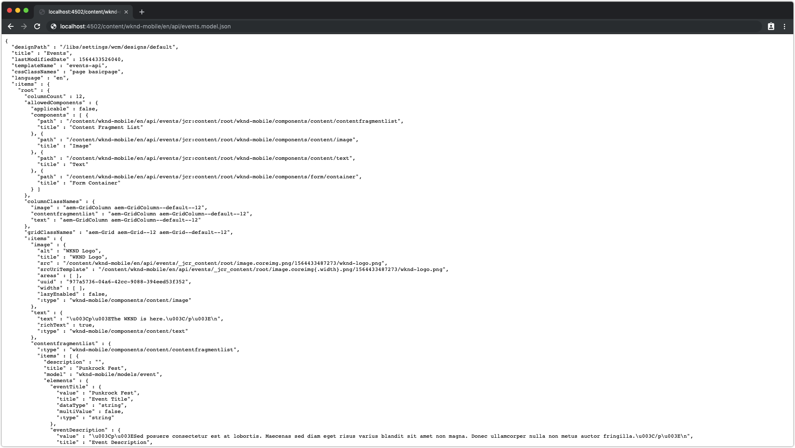

# Capitolo 5 - Authoring delle pagine di Content Services

Il capitolo 5 del tutorial AEM headless tratta la creazione della pagina dai modelli definiti nel capitolo 4. La pagina creata in questo capitolo fungerà da endpoint HTTP JSON per l’app mobile.

>[!NOTE]
>
> Architettura del contenuto della pagina di `/content/wknd-mobile/en/api` è stato precompilato. Le pagine di base di `en` e `api` hanno uno scopo architettonico e organizzativo, ma non sono strettamente richiesti. Se il contenuto API può essere localizzato, è consigliabile seguire le usuali best practice di organizzazione delle pagine Copia in lingua e Gestore multisito, in quanto la pagina API può essere localizzata come qualsiasi pagina di AEM Sites.

## Creazione della pagina API dell’evento

1. Accedi a **[!UICONTROL AEM] > [!UICONTROL Sites] > [!DNL WKND Mobile] > [!DNL English] >[!DNL API]**.
1. **Toccare l’etichetta della pagina API**, quindi tocca il **Crea** nella barra delle azioni superiore e crea una nuova pagina Eventi API sotto la pagina API.
   1. Tocca **Crea** nella barra delle azioni superiore
   1. Seleziona **API Eventi** modello
   1. In **Nome** immissione campo **Eventi**
   1. In **Titolo** immissione campo **API Eventi**
   1. Tocca **Crea** nella barra delle azioni superiore per creare la pagina
   1. Tocca **Fine** per tornare all’amministratore di AEM Sites

>[!VIDEO](https://video.tv.adobe.com/v/28340?quality=12&learn=on)

## Creazione della pagina API degli eventi

>[!NOTE]
>
> Il progetto fornisce CSS per fornire alcuni stili di base per l’esperienza di authoring.

1. Modifica il **API Eventi** pagina passando a **AEM > Sites > WKND Mobile > Inglese > API**, selezionando la **API Eventi** pagina e toccare **Modifica** nella barra delle azioni superiore.
1. Aggiungi un **immagine logo** per visualizzare nell’app trascinandola dal Finder risorse al segnaposto del componente Immagine.
   * Utilizza il logo fornito, reperibile in `/content/dam/wknd-mobile/images/wknd-logo.png`.

1. Aggiungi **linea di tag** per visualizzare sopra gli eventi.
   1. Modifica il **Testo** componente
   1. Immettere il testo:
      * `The WKND is here.`

1. Seleziona la **Eventi** per visualizzare:
   1. Imposta la seguente configurazione su **Proprietà** scheda:
      * Modello: **Evento**
      * Percorso principale: **/content/dam/wknd-mobile/en/events**
      * Tag: **&lt;leave blank=&quot;&quot;>**
   1. Imposta la seguente configurazione su **Elementi** scheda:
      * Rimuovi eventuali elementi elencati per garantire che SIANO ESPOSTI TUTTI gli elementi dei Frammenti di contenuto dell’evento.

>[!VIDEO](https://video.tv.adobe.com/v/28339?quality=12&learn=on)

## Rivedi l’output JSON della pagina API

L’output JSON e il relativo formato possono essere rivisti richiedendo alla pagina di `.model.json` selettore.

Questa struttura JSON (o schema) deve essere ben compresa dai consumatori di questa API. È fondamentale che i consumatori di API comprendano quali aspetti della struttura siano fissi (ossia. il logo (immagine) e il tag live (testo) dell’API degli eventi e che sono fluidi (ad esempio gli eventi elencati in Componente Elenco frammenti di contenuto).

L’interruzione di questo contratto su un’API pubblicata può causare un comportamento errato nell’utilizzo delle app.

1. Nelle nuove schede del browser, richiedi le pagine API degli Eventi utilizzando `.model.json` selettore che richiama l’esportatore JSON di AEM Content Services e serializza la pagina e i componenti in una struttura JSON normalizzata e ben definita.

   La struttura JSON prodotta da queste pagine è quella a cui le app che utilizzano la struttura devono allinearsi.

1. Richiedi **API Eventi** pagina come **JSON**.

   * [http://localhost:4502/content/wknd-mobile/en/api/events.model.json](http://localhost:4502/content/wknd-mobile/en/api/events.model.tidy.json)

   Il risultato dovrebbe essere simile al seguente:

>[!NOTE]
>
> Questo JSON può essere emesso in un **ordinato** (formattato) modalità per la leggibilità mediante l&#39;utilizzo di `.tidy` selettore:
> * [http://localhost:4502/content/wknd-mobile/en/api/events.model.tidy.json](http://localhost:4502/content/wknd-mobile/en/api/events.model.tidy.json)

## Passaggio successivo

Se necessario, installa [com.adobe.aem.guides.wknd-mobile.content.chapter-5.zip](https://github.com/adobe/aem-guides-wknd-mobile/releases/latest) pacchetto di contenuti su AEM Author tramite [Gestione pacchetti AEM](http://localhost:4502/crx/packmgr/index.jsp). Questo pacchetto contiene le configurazioni e il contenuto descritti in questo e nei capitoli precedenti dell’esercitazione.

* [Capitolo 6 - Pubblicazione dei contenuti come JSON per la pubblicazione AEM](./chapter-6.md)
