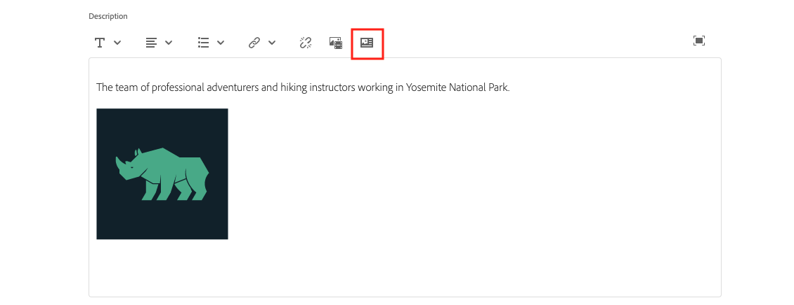

# Frammenti di contenuto dell’autore

In [capitolo precedente](/help/headless-tutorial/graphql/advanced-graphql/create-content-fragment-models.md), hai creato cinque modelli di frammenti di contenuto: Persona, team, posizione, indirizzo e informazioni di contatto. Questo capitolo illustra i passaggi necessari per creare frammenti di contenuto basati su tali modelli. Esplora inoltre come creare criteri per le cartelle per limitare i modelli di frammenti di contenuto che possono essere utilizzati nella cartella.

## Prerequisiti {#prerequisites}

Questo documento fa parte di un tutorial in più parti. Assicurarsi che i capitoli precedenti siano stati completati prima di procedere con questo capitolo.

## Obiettivi {#objectives}

In questo capitolo, scopri come:

* Creazione di cartelle e impostazione di limiti tramite i criteri delle cartelle
* Creare riferimenti a frammenti direttamente dall’editor Frammenti di contenuto
* Utilizzare i tipi di dati Tab, Date e Oggetto JSON
* Inserire contenuti e riferimenti a frammenti nell’editor di testo su più righe
* Aggiungere riferimenti a più frammenti
* Nidifica frammenti di contenuto

## Installare il contenuto di esempio {#sample-content}

Installa un pacchetto di AEM che contiene diverse cartelle e immagini di esempio utilizzate per accelerare l&#39;esercitazione.

1. Scarica [Advanced-GraphQL-Tutorial-Starter-Package-1.0.zip](/help/headless-tutorial/graphql/advanced-graphql/assets/tutorial-files/Advanced-GraphQL-Tutorial-Starter-Package-1.0.zip)
1. In AEM, passa a **Strumenti** > **Distribuzione** > **Pacchetti** accesso **Gestione pacchetti**.
1. Carica e installa il pacchetto (file zip) scaricato nel passaggio precedente.

   

## Creazione di cartelle e impostazione di limiti tramite i criteri delle cartelle

Nella home page di AEM, seleziona **Risorse** > **File** > **Sito WKND** > **Inglese**. Qui puoi vedere le varie categorie di frammenti di contenuto, compresi Avventure e collaboratori esplorati nelle precedenti [esercitazione GraphQL a più passaggi](../multi-step/overview.md).

### Creare cartelle {#create-folders}

Passa a **Avventure** cartella. Puoi vedere che le cartelle per Team e Posizioni sono già state create per memorizzare i Frammenti di contenuto di Team e Posizioni.

Crea una cartella per i frammenti di contenuto di istruttori basati sul modello di frammento di contenuto personale.

1. Dalla pagina Avventure, seleziona **Crea** > **Cartella** nell&#39;angolo in alto a destra.

   

1. Nella finestra modale Crea cartella visualizzata, immetti &quot;Istruttori&quot; nel **Titolo** campo . Osserva i &#39;s&#39; alla fine. I titoli delle cartelle contenenti molti frammenti devono essere plurali. Seleziona **Crea**.

   

   Ora hai creato una cartella per memorizzare gli istruttori di Avventura.

### Impostare i limiti utilizzando i criteri delle cartelle

AEM consente di definire autorizzazioni e criteri per le cartelle Frammento di contenuto. Utilizzando le autorizzazioni, è possibile concedere l’accesso a determinate cartelle solo a determinati utenti (autori) o gruppi di autori. Utilizzando i criteri delle cartelle, puoi limitare ciò che gli autori di modelli di frammento di contenuto possono utilizzare in tali cartelle. In questo esempio, limitiamo una cartella ai modelli Persona e Informazioni di contatto. Per configurare un criterio per le cartelle:

1. Seleziona la **Istruttori** cartella creata, quindi selezionare **Proprietà** dalla barra di navigazione superiore.

   

1. Seleziona la **Criteri** , quindi deseleziona **Ereditato da /content/dam/wknd**. In **Modelli di frammenti di contenuto consentiti per percorso** selezionare l&#39;icona della cartella.

   

1. Nella finestra di dialogo Seleziona percorso visualizzata, segui il percorso **conf** > **Sito WKND**. Il modello per frammento di contenuto personale, creato nel capitolo precedente, contiene un riferimento al modello per frammento di contenuto di informazioni di contatto. Per creare un frammento di contenuto istruttore, è necessario consentire i modelli Persona e Informazioni contatto nella cartella Istruttori. Seleziona **Persona** e **Informazioni contatto**, quindi premi **Seleziona** per chiudere la finestra di dialogo.

   

1. Seleziona **Salva e chiudi** e seleziona **OK** nella finestra di dialogo di successo visualizzata.

1. È stato ora configurato un criterio per la cartella Istruttori. Passa a **Istruttori** e seleziona **Crea** > **Frammento di contenuto**. Gli unici modelli che è ora possibile selezionare sono **Persona** e **Informazioni contatto**.

   

## Frammenti di contenuto per istruttori

Passa a **Istruttori** cartella. Da qui, creiamo una cartella nidificata per memorizzare le informazioni di contatto degli Istruttori.

Segui i passaggi descritti nella sezione [creazione di cartelle](#create-folders) per creare una cartella denominata &quot;Informazioni di contatto&quot;. Tenere presente che la cartella nidificata eredita i criteri della cartella principale. Puoi configurare criteri più specifici in modo che la nuova cartella creata consenta solo l’utilizzo del modello Informazioni contatto .

### Creare un frammento di contenuto per istruttori

Creiamo quattro persone che possono essere aggiunte a un team di istruttori di Avventura. Riutilizzare le immagini e i nomi dei frammenti di contenuto dei collaboratori creati nella [esercitazione GraphQL a più passaggi](../multi-step/author-content-fragments.md). Mentre l’esercitazione precedente spiegava come creare frammenti di contenuto di base, questa esercitazione si concentra sulle funzioni più avanzate.

1. Dalla cartella Istruttori, crea un nuovo frammento di contenuto basato sul modello di frammento di contenuto personale e assegnagli il titolo &quot;Jacob Wester&quot;.

   Il frammento di contenuto appena creato si presenta come segue:

   

1. Inserisci il seguente contenuto nei campi:

   * **Nome completo**: Jacob Wester
   * **Biografia**: Jacob Wester è stato un istruttore di trekking per dieci anni e ha amato ogni minuto di esso! È un cercatore di avventura con talento per arrampicarsi su roccia e fare il backpack. Jacob è il vincitore di gare di arrampicata, tra cui la battaglia del boulder della baia. Attualmente vive in California.
   * **Livello esperienza istruttore**: Esperto
   * **Competenze**: Arrampicata, Surf, Backpackaging
   * **Dettagli amministratore**: Jacob Wester coordina le avventure di backpackaging da 3 anni.

1. In **Immagine profilo** aggiungi un riferimento al contenuto a un&#39;immagine. Sfoglia per **Sito WKND** > **Inglese** > **Collaboratori** > **jacob_wester.jpg** per creare un percorso per l&#39;immagine.

### Creare un nuovo riferimento a un frammento dall’editor Frammenti di contenuto {#fragment-reference-from-editor}

AEM consente di creare un riferimento a un frammento direttamente dall’editor Frammento di contenuto. Creiamo un riferimento alle informazioni di contatto di Jacob.

1. Seleziona **Nuovo frammento di contenuto** sotto **Informazioni contatto** campo .

   

1. Viene visualizzata la finestra modale Nuovo frammento di contenuto . Sotto la scheda Seleziona destinazione , segui il percorso **Avventure** > **Istruttori** e seleziona la casella di controllo accanto alla **Informazioni contatto** cartella. Seleziona **Successivo** per passare alla scheda Proprietà .

   

1. Nella scheda Proprietà, immetti &quot;Jacob Wester Contact Info&quot; nel campo **Titolo** campo . Seleziona **Crea**, quindi premi **Apri** nella finestra di dialogo di successo visualizzata.

   

   Vengono visualizzati nuovi campi che consentono di modificare il frammento di contenuto delle informazioni di contatto.

   

1. Inserisci il seguente contenuto nei campi:

   * **Telefono**: 2009-888-0000
   * **E-mail**: jwester@wknd.com

   Al termine, seleziona **Salva**. È stato creato un nuovo frammento di contenuto Informazioni contatto.

1. Per tornare al frammento di contenuto dell’istruttore, seleziona **Jacob Wester** nell’angolo in alto a sinistra dell’editor.

   

   La **Informazioni contatto** Il campo contiene ora il percorso del frammento Contact Info a cui si fa riferimento. Riferimento a un frammento nidificato. Il frammento di contenuto dell’istruttore completato si presenta così:

   

1. Seleziona **Salva e chiudi** per salvare il frammento di contenuto. È ora disponibile un nuovo frammento di contenuto per istruttore.

### Creazione di ulteriori frammenti

Segui lo stesso processo descritto nel [sezione precedente](#fragment-reference-from-editor) creare altri tre frammenti di contenuto per istruttori e tre frammenti di contenuto per questi istruttori. Aggiungi il seguente contenuto nei frammenti Istruttori:

**Stacey Roswells**

| espandibili | Valori |
| --- | --- |
| Titolo frammento di contenuto | Stacey Roswells |
| Nome e cognome | Stacey Roswells |
| Informazioni di contatto | /content/dam/wknd/it/adventures/istruttori/contact-info/stacey-roswells-contact-info |
| Immagine profilo | /content/dam/wknd/en/contributors/stacey-roswells.jpg |
| Biografia | Stacey Roswells è un esperto arrampicatore e avventuriero alpino. Nato a Baltimora, nel Maryland, Stacey è il più giovane di sei bambini. Suo padre era un tenente colonnello della Marina degli Stati Uniti e sua madre era un istruttore di danza moderna. La sua famiglia si trasferì frequentemente con i compiti del padre, e scattò le sue prime foto quando era in Thailandia. Ed è qui che Stacey ha imparato a arrampicarsi. |
| Livello esperienza istruttore | Avanzate  |
| Competenze | Arrampicata | Sci | Backpackaging |

**Kumar Selvaraj**

| espandibili | Valori |
| --- | --- |
| Titolo frammento di contenuto | Kumar Selvaraj |
| Nome e cognome | Kumar Selvaraj |
| Informazioni di contatto | /content/dam/wknd/it/adventures/istruttori/contact-info/kumar-selvaraj-contact-info |
| Immagine profilo | /content/dam/wknd/en/contributors/Kumar_Selvaraj.JPG |
| Biografia | Kumar Selvaraj è un istruttore professionale certificato AMGA esperto il cui obiettivo principale è quello di aiutare gli studenti a migliorare le loro abilità di arrampicata e trekking. |
| Livello esperienza istruttore | Avanzate  |
| Competenze | Arrampicata | Backpackaging |

**Ayo Ogunseinde**

| espandibili | Valori |
| --- | --- |
| Titolo frammento di contenuto | Ayo Ogunseinde |
| Nome e cognome | Ayo Ogunseinde |
| Informazioni di contatto | /content/dam/wknd/it/adventures/istruttori/contact-info/ayo-ogunseinde-contact-info |
| Immagine profilo | /content/dam/wknd/en/contributors/ayo-ogunseinde-237739.jpg |
| Biografia | Ayo Ogunseinde è un alpinista professionista e istruttore di zaino che vive a Fresno, California Centrale. Il suo obiettivo è guidare gli escursionisti nelle loro più epiche avventure nei parchi nazionali. |
| Livello esperienza istruttore | Avanzate  |
| Competenze | Arrampicata | Ciclismo | Backpackaging |

Lascia la **Informazioni aggiuntive** campo vuoto.

Aggiungere le seguenti informazioni nei frammenti Informazioni contatto:

| Titolo frammento di contenuto | Telefono | E-mail |
| ------- | -------- | -------- |
| Stacey Roswells Informazioni di contatto | 2009-888-0011 | sroswells@wknd.com |
| Kumar Selvaraj Informazioni di contatto | 2009-888-0002 | kselvaraj@wknd.com |
| Ayo Ogunseinde Contatti | 2009-888-0304 | aogunseinde@wknd.com |

Ora puoi creare un team!

## Frammenti di contenuto dell’autore per le posizioni

Passa a **Posizioni** cartella. Qui sono presenti due cartelle nidificate già create: Parco Nazionale dello Yosemite e Yosemite Valley Lodge.


Ignora la cartella Yosemite Valley Lodge per il momento. Ci ritorneremo più avanti in questa sezione quando creeremo una nuova posizione che fungerà da base per il nostro team di istruttori.

Passa a **Parco nazionale dello Yosemite** cartella. Attualmente, contiene solo una foto del Parco Nazionale dello Yosemite. Creiamo un nuovo frammento di contenuto utilizzando il modello di frammento di contenuto posizione e titolalo &quot;Yosemite National Park&quot;.

### Segnaposto Tabulazione

AEM consente di utilizzare segnaposto per schede per raggruppare diversi tipi di contenuto e semplificare la lettura e la gestione dei frammenti di contenuto. Nel capitolo precedente, sono stati aggiunti segnaposto tabulazione al modello Posizione. Di conseguenza, il frammento di contenuto posizione dispone ora di due sezioni a schede: **Dettagli posizione** e **Indirizzo**.


La **Dettagli posizione** la scheda contiene **Nome**, **Descrizione**, **Informazioni contatto**, **Immagine posizione** e **Meteo per stagione** campi, mentre **Indirizzo** contiene un riferimento a un frammento di contenuto indirizzo. Le schede consentono di definire con chiarezza quali tipi di contenuto devono essere compilati, facilitando la gestione dell’authoring dei contenuti.

### Tipo di dati oggetto JSON

La **Meteo per stagione** è un tipo di dati oggetto JSON, il che significa che accetta dati in formato JSON. Questo tipo di dati è flessibile e può essere utilizzato per tutti i dati che desideri includere nel contenuto.

Puoi visualizzare la descrizione del campo creata nel capitolo precedente passando il cursore sull’icona delle informazioni a destra del campo.


In questo caso, dobbiamo fornire il tempo medio per la posizione. Immetti i seguenti dati:

```json
{
    "summer": "81 / 89°F",
    "fall": "56 / 83°F",
    "winter": "46 / 51°F",
    "spring": "57 / 71°F"
}
```

La **Meteo per stagione** Il campo dovrebbe ora essere simile al seguente:


### Aggiungi contenuto

Aggiungiamo il resto del contenuto al frammento di contenuto Posizione per eseguire una query sulle informazioni con GraphQL nel capitolo successivo.

1. In **Dettagli posizione** immettere le seguenti informazioni nei campi:

   * **Nome**: Parco nazionale dello Yosemite
   * **Descrizione**: Il parco nazionale dello Yosemite si trova sulle montagne della Sierra Nevada della California. È famosa per le sue splendide cascate, gli alberi giganti di sequoia e le viste iconiche delle scogliere El Capitan e Mezza Dome. Escursioni e campeggio sono i migliori modi per sperimentare Yosemite. Numerosi sentieri offrono infinite opportunità di avventura e esplorazione.

1. Da **Informazioni contatto** creare un nuovo frammento di contenuto basato sul modello Contact Info e denominarlo &quot;Yosemite National Park Contact Info&quot;. Segui lo stesso processo descritto nella sezione precedente su [creazione di un nuovo riferimento a un frammento dall’editor](#fragment-reference-from-editor) e inserire i seguenti dati nei campi:

   * **Telefono**: 2009-999-0000
   * **E-mail**: yosemite@wknd.com

1. Da **Immagine posizione** campo , cerca **Avventure** > **Posizioni** > **Parco nazionale dello Yosemite** > **yosemite-national-park.jpeg** per creare un percorso per l&#39;immagine.

   Ricorda che nel capitolo precedente hai configurato la convalida dell&#39;immagine, pertanto le dimensioni dell&#39;immagine Posizione devono essere inferiori a 2560 x 1800 e le dimensioni del file devono essere inferiori a 3 MB.

1. Con tutte le informazioni aggiunte, il **Dettagli posizione** La scheda ora si presenta così:

   

1. Passa a **Indirizzo** scheda . Da **Indirizzo** creare un nuovo frammento di contenuto denominato &quot;Indirizzo del parco nazionale di Yosemite&quot; utilizzando il modello del frammento di contenuto di indirizzo creato nel capitolo precedente. Segui lo stesso processo descritto nella sezione su [creazione di un nuovo riferimento a un frammento dall’editor](#fragment-reference-from-editor) e inserire i seguenti dati nei campi:

   * **Indirizzo via**: 9010 Curry Village Drive
   * **Città**: Valle dello Yosemite
   * **Stato**: CA
   * **CAP**: 95389
   * **Paese**: Stati Uniti

1. Completato **Indirizzo** scheda del frammento del Parco Nazionale dello Yosemite si presenta così:

   

1. Seleziona **Salva e chiudi**.

### Creare un frammento aggiuntivo

1. Passa a **Yosemite Valley Lodge** cartella. Crea un nuovo frammento di contenuto utilizzando il modello di frammento di contenuto della posizione e assegnagli il titolo &quot;Yosemite Valley Lodge&quot;.

1. In **Dettagli posizione** immettere le seguenti informazioni nei campi:

   * **Nome**: Yosemite Valley Lodge
   * **Descrizione**: Yosemite Valley Lodge è un hub per riunioni di gruppo e ogni tipo di attività, come lo shopping, la ristorazione, la pesca, l&#39;escursionismo, e molti altri.

1. Da **Informazioni contatto** creare un nuovo frammento di contenuto basato sul modello Contact Info e denominarlo &quot;Yosemite Valley Lodge Contact Info&quot;. Segui lo stesso processo descritto nella sezione su [creazione di un nuovo riferimento a un frammento dall’editor](#fragment-reference-from-editor) e immetti i seguenti dati nei campi del nuovo frammento di contenuto:

   * **Telefono**: 2009-992-0000
   * **E-mail**: yosemitelodge@wknd.com

   Salva il frammento di contenuto appena creato.

1. Torna a **Yosemite Valley Lodge** e vai al **Indirizzo** scheda . Da **Indirizzo** creare un nuovo frammento di contenuto denominato &quot;Indirizzo del lodge della valle di Yosemite&quot; utilizzando il modello del frammento di contenuto dell&#39;indirizzo creato nel capitolo precedente. Segui lo stesso processo descritto nella sezione su [creazione di un nuovo riferimento a un frammento dall’editor](#fragment-reference-from-editor) e inserire i seguenti dati nei campi:

   * **Indirizzo via**: 9006 Yosemite Lodge Drive
   * **Città**: Parco nazionale dello Yosemite
   * **Stato**: CA
   * **CAP**: 95389
   * **Paese**: Stati Uniti

   Salva il frammento di contenuto appena creato.

1. Torna a **Yosemite Valley Lodge**, quindi seleziona **Salva e chiudi**. La **Yosemite Valley Lodge** La cartella contiene ora tre frammenti di contenuto: Yosemite Valley Lodge, Yosemite Valley Lodge Contatti Info e Yosemite Valley Lodge Indirizzo.

   

## Creazione di un frammento di contenuto del team

Sfoglia cartelle in **Team** > **Team Yosemite**. La cartella Team Yosemite contiene attualmente solo il logo del team.


Creiamo un nuovo frammento di contenuto utilizzando il modello di frammento di contenuto del team e titolalo &quot;Team Yosemite&quot;.

### Riferimenti a contenuti e frammenti nell’editor di testo su più righe

AEM consente di aggiungere contenuti e riferimenti a frammenti direttamente nell’editor di testo su più righe e di recuperarli in un secondo momento utilizzando le query GraphQL. Aggiungiamo sia riferimenti al contenuto che a frammenti nel **Descrizione** campo .

1. Innanzitutto, aggiungi il seguente testo nel **Descrizione** campo: &quot;Il team di avventurieri professionisti e istruttori di trekking che lavorano nel parco nazionale Yosemite.&quot;

1. Per aggiungere un riferimento al contenuto, seleziona la **Inserisci risorsa** nella barra degli strumenti dell’editor di testo su più righe.

   

1. Nel modale visualizzato, seleziona **team-yosemite-logo.png** e premere **Seleziona**.

   

   Il riferimento al contenuto viene ora aggiunto nel **Descrizione** campo .

Tenere presente che nel capitolo precedente è stato consentito l’aggiunta di riferimenti di frammento al **Descrizione** campo . Aggiungiamo uno qui.

1. Seleziona la **Inserisci frammento di contenuto** nella barra degli strumenti dell’editor di testo su più righe.

   

1. Sfoglia per **Sito WKND** > **Inglese** > **Avventure** > **Posizioni** > **Yosemite Valley Lodge** > **Yosemite Valley Lodge**. Press **Seleziona** per inserire il frammento di contenuto.

   

   La **Descrizione** Il campo è ora simile al seguente:

   

Ora sono stati aggiunti i riferimenti al contenuto e al frammento direttamente nell’editor di testo su più righe.

### Tipo di dati data e ora

Diamo un’occhiata al tipo di dati Data e ora. Seleziona la **Calendario** sul lato destro del **Data di fondazione del team** per aprire la visualizzazione calendario.


Le date passate o future possono essere impostate utilizzando le frecce avanti e indietro su entrambi i lati del mese. Supponiamo che il team Yosemite sia stato fondato il 24 maggio 2016, quindi stabiliremo la data per allora.

### Aggiungere riferimenti a più frammenti

Aggiungiamo gli istruttori al riferimento al frammento Membri del team.

1. Seleziona **Aggiungi** in **Membri del team** campo .

   

1. Nel nuovo campo visualizzato, seleziona l’icona della cartella per aprire il modale Seleziona percorso . Sfoglia le cartelle in **Sito WKND** > **Inglese** > **Avventure** > **Istruttori**, quindi seleziona la casella di controllo accanto a **giacobo**. Press **Seleziona** per salvare il percorso.

   

1. Seleziona la **Aggiungi** pulsante altre tre volte. Utilizza i nuovi campi per aggiungere i tre istruttori rimanenti al team. La **Membri del team** il campo ora si presenta così:

   

1. Seleziona **Salva e chiudi** per salvare il frammento di contenuto del team.

### Aggiungere riferimenti a un frammento di contenuto avventura

Infine, aggiungiamo i frammenti di contenuto appena creati a un’avventura.

1. Passa a **Avventure** > **Yosemite Backpack** e aprire il frammento di contenuto del backpack Yosemite. Nella parte inferiore del modulo sono visualizzati i tre campi creati nel capitolo precedente: **Posizione**, **Team istruttore** e **Amministratore**.

1. Aggiungi il riferimento al frammento nel **Posizione** campo . Il percorso della posizione deve fare riferimento al frammento di contenuto del parco nazionale di Yosemite creato: `/content/dam/wknd/en/adventures/locations/yosemite-national-park/yosemite-national-park`.

1. Aggiungi il riferimento al frammento nel **Team istruttore** campo . Il percorso Team deve fare riferimento al frammento di contenuto del team Yosemite creato: `/content/dam/wknd/en/adventures/teams/yosemite-team/yosemite-team`. Riferimento a un frammento nidificato. Il frammento di contenuto del team contiene un riferimento al modello Persona che fa riferimento ai modelli Informazioni di contatto e Indirizzo. Di conseguenza, i frammenti di contenuto nidificati sono a tre livelli in basso.

1. Aggiungi il riferimento al frammento nel **Amministratore** campo . Diciamo che Jacob Wester è un amministratore per la Yosemite Backpackaging Avventure. Il percorso deve portare al frammento di contenuto di Jacob Wester e apparire come segue: `/content/dam/wknd/en/adventures/instructors/jacob-wester`.

1. Ora hai aggiunto tre riferimenti di frammento a un frammento di contenuto avventura. I campi si presentano così:

   

1. Seleziona **Salva e chiudi** per salvare il contenuto.

## Congratulazioni!

Congratulazioni! Ora hai creato frammenti di contenuto basati sui modelli avanzati di frammenti di contenuto creati nel capitolo precedente. È stato inoltre creato un criterio per le cartelle per limitare la selezione di modelli di frammenti di contenuto all’interno di una cartella.

## Passaggi successivi

In [capitolo successivo](/help/headless-tutorial/graphql/advanced-graphql/explore-graphql-api.md), verranno fornite informazioni sull’invio di query GraphQL avanzate utilizzando l’ambiente di sviluppo integrato (IDE, Integrated Development Environment) di GraphiQL. Queste query ci consentiranno di visualizzare i dati creati in questo capitolo e di aggiungere tali query all’app WKND.

Anche se è facoltativo per questa esercitazione, accertati di pubblicare tutti i contenuti in situazioni di produzione reali. Maggiori dettagli sugli ambienti Author e Publish sono disponibili nella sezione [serie video headless](/help/headless-tutorial/graphql/video-series/author-publish-architecture.md)
