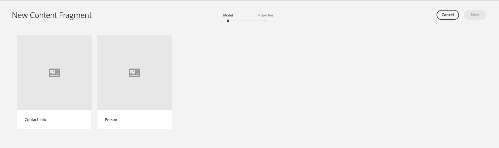
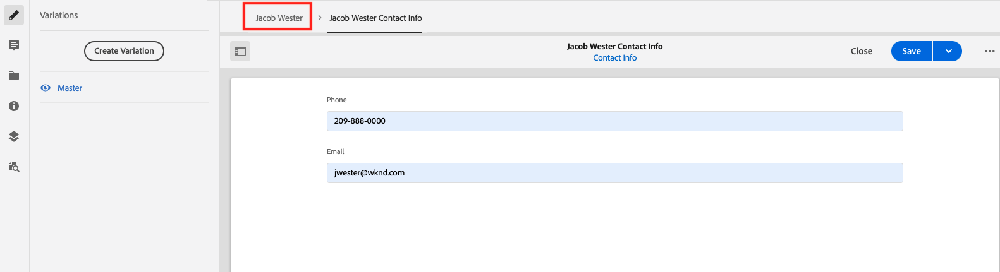
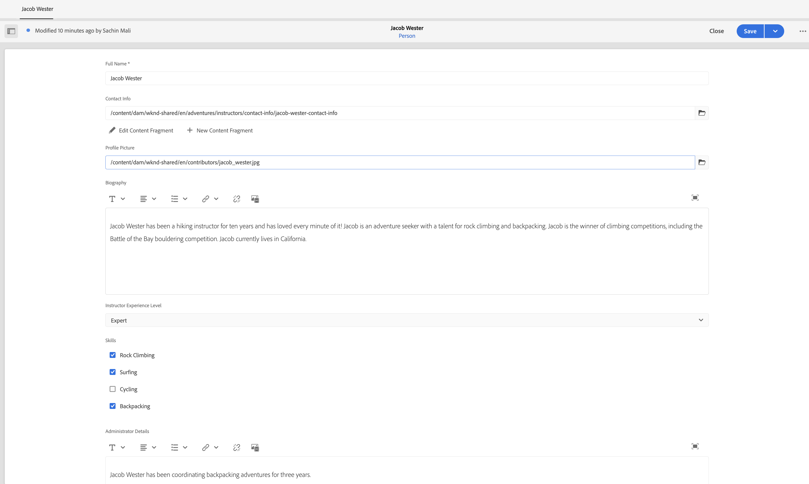
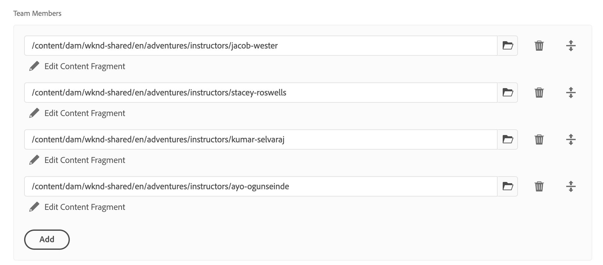

# Creare frammenti di contenuto

In [capitolo precedente](/help/headless-tutorial/graphql/advanced-graphql/create-content-fragment-models.md), sono stati creati cinque modelli per frammenti di contenuto: Persona, Team, Posizione, Indirizzo e Informazioni di contatto. Questo capitolo illustra i passaggi necessari per creare frammenti di contenuto basati su tali modelli. Inoltre, illustra come creare criteri per cartelle per limitare quali modelli per frammenti di contenuto possono essere utilizzati nella cartella.

## Prerequisiti {#prerequisites}

Questo documento fa parte di un&#39;esercitazione in più parti. Assicurati che il [capitolo precedente](create-content-fragment-models.md) è stato completato prima di procedere con questo capitolo.

## Obiettivi {#objectives}

In questo capitolo, scopri come:

* Creare cartelle e impostare limiti utilizzando i criteri delle cartelle
* Creare riferimenti ai frammenti direttamente dall’editor frammenti di contenuto
* Utilizzare i tipi di dati Tab, Date e JSON Object
* Inserire riferimenti a contenuti e frammenti nell’editor di testo su più righe
* Aggiungere più riferimenti a frammenti
* Nidificare frammenti di contenuto

## Installare il contenuto di esempio {#sample-content}

Installa un pacchetto AEM contenente diverse cartelle e immagini di esempio utilizzate per accelerare l’esercitazione.

1. Scarica [Advanced-GraphQL-Tutorial-Starter-Package-1.1.zip](/help/headless-tutorial/graphql/advanced-graphql/assets/tutorial-files/Advanced-GraphQL-Tutorial-Starter-Package-1.1.zip)
1. In AEM, vai a **Strumenti** > **Distribuzione** > **Pacchetti** per accedere **Gestione pacchetti**.
1. Carica e installa il pacchetto (file zip) scaricato nel passaggio precedente.

   

## Creare cartelle e impostare limiti utilizzando i criteri delle cartelle

Dalla home page dell’AEM, seleziona **Risorse** > **File** > **WKND condiviso** > **Inglese**. Qui puoi vedere le varie categorie di Frammenti di contenuto, tra cui Avventure e Collaboratori.

### Creare cartelle {#create-folders}

Accedi a **Avventure** cartella. È possibile notare che sono già state create cartelle per Team e Percorsi per memorizzare i frammenti di contenuto Team e Percorsi.

Crea una cartella per i frammenti di contenuto degli istruttori basati sul modello di frammento di contenuto della persona.

1. Dalla pagina Avventure, seleziona **Crea** > **Cartella** in alto a destra.

   

1. Nella finestra modale Crea cartella visualizzata, immetti &quot;Istruttori&quot; in **Titolo** campo. Prendi nota della &quot;s&quot; alla fine. I titoli delle cartelle che contengono molti frammenti devono essere plurali. Seleziona **Crea**.

   

   Ora hai creato una cartella in cui archiviare Adventure Instructors.

### Impostare i limiti utilizzando i criteri delle cartelle

AEM consente di definire autorizzazioni e criteri per le cartelle dei frammenti di contenuto. Utilizzando le autorizzazioni, è possibile concedere a determinati utenti (autori) o gruppi di autori l&#39;accesso a determinate cartelle. Utilizzando i criteri per cartelle, puoi limitare ciò che gli autori di modelli per frammenti di contenuto possono utilizzare in tali cartelle. In questo esempio, limiteremo una cartella ai modelli Info persona e Info contatto. Per configurare un criterio di cartella:

1. Seleziona la **Istruttori** cartella creata, quindi seleziona **Proprietà** dalla barra di navigazione superiore.

   

1. Seleziona la **Criteri** , quindi deseleziona **Ereditato da /content/dam/wknd-shared**. In **Modelli per frammenti di contenuto consentiti per percorso** , seleziona l’icona della cartella.

   

1. Nella finestra di dialogo Seleziona percorso visualizzata, segui il percorso **conf** > **WKND condiviso**. Il modello per frammenti di contenuto persona, creato nel capitolo precedente, contiene un riferimento al modello per frammenti di contenuto Informazioni contatto. Per creare un frammento di contenuto Istruttore, nella cartella Istruttori devono essere consentiti sia i modelli di informazioni persona che quelli di informazioni contatto. Seleziona **Persona** e **Informazioni di contatto**, quindi premere **Seleziona** per chiudere la finestra di dialogo

   

1. Seleziona **Salva e chiudi** e seleziona **OK** nella finestra di dialogo di successo che viene visualizzata.

1. È stato configurato un criterio di cartella per la cartella Istruttori. Accedi a **Istruttori** cartella e seleziona **Crea** > **Frammento di contenuto**. Gli unici modelli che è possibile selezionare sono **Persona** e **Informazioni di contatto**.

   

## Creazione di frammenti di contenuto per istruttori

Accedi a **Istruttori** cartella. Da qui, creiamo una cartella nidificata per memorizzare le informazioni di contatto degli istruttori.

Segui i passaggi descritti nella sezione su [creazione di cartelle](#create-folders) per creare una cartella denominata &quot;Informazioni di contatto&quot;. La cartella nidificata eredita i criteri di cartella della cartella principale. Puoi configurare criteri più specifici in modo che la cartella appena creata consenta l’utilizzo solo del modello Informazioni di contatto.

### Creare un frammento di contenuto Istruttore

Creiamo quattro persone che possono essere aggiunte a un team di Istruttori di Avventura.

1. Dalla cartella Istruttori, crea un frammento di contenuto basato sul modello di frammento di contenuto Persona e assegnagli il titolo &quot;Jacob Wester&quot;.

   Il nuovo frammento di contenuto creato si presenta come segue:

   

1. Immetti il seguente contenuto nei campi:

   * **Nome e cognome**: Jacob Wester
   * **Biografia**: Jacob Wester è stato un istruttore di trekking per dieci anni e ha amato ogni minuto di esso! Jacob è un cercatore di avventura con un talento per l&#39;arrampicata su roccia e zaino. Jacob è il vincitore delle gare di arrampicata, inclusa la gara di boulder della battaglia della baia. Jacob attualmente vive in California.
   * **Livello di esperienza istruttore**: esperto
   * **Abilità**: arrampicata su roccia, surf, zaino
   * **Dettagli amministratore**: Jacob Wester coordina le avventure del backpacking da tre anni.

1. In **Immagine profilo** , aggiungere un riferimento a un contenuto a un&#39;immagine. Sfoglia per **WKND condiviso** > **Inglese** > **Collaboratori** > **jacob_wester.jpg** per creare un percorso per l&#39;immagine.

### Creare un riferimento a un frammento dall’editor frammento di contenuto {#fragment-reference-from-editor}

AEM consente di creare un riferimento a un frammento direttamente dall’editor di frammenti di contenuto. Creiamo un riferimento alle informazioni di contatto di Jacob.

1. Seleziona **Nuovo frammento di contenuto** sotto **Informazioni di contatto** campo.

   

1. Viene visualizzata la finestra modale Nuovo frammento di contenuto. Nella scheda Seleziona destinazione, segui il percorso **Avventure** > **Istruttori** e seleziona la casella di controllo accanto al **Informazioni di contatto** cartella. Seleziona **Successivo** per passare alla scheda Proprietà.

   

1. Nella scheda Proprietà, immetti &quot;Jacob Wester Contact Info&quot; nel **Titolo** campo. Seleziona **Crea**, quindi premere **Apri** nella finestra di dialogo di successo che viene visualizzata.

   

   Vengono visualizzati nuovi campi che consentono di modificare il frammento di contenuto Informazioni contatto.

   

1. Immetti il seguente contenuto nei campi:

   * **Telefono**: 209-888-0000
   * **E-mail**: jwester@wknd.com

   Al termine, seleziona **Salva**. È stato creato un frammento di contenuto Informazioni contatto.

1. Per tornare al frammento di contenuto Istruttore, seleziona **Jacob Wester** nell’angolo in alto a sinistra dell’editor.

   

   Il **Informazioni di contatto** Il campo ora contiene il percorso del frammento di informazioni di contatto di riferimento. Questo è un riferimento a un frammento nidificato. Il frammento di contenuto dell’istruttore finito si presenta così:

   

1. Seleziona **Salva e chiudi** per salvare il frammento di contenuto. Ora disponi di un nuovo Frammento di contenuto Istruttore.

### Creare frammenti aggiuntivi

Seguire lo stesso processo descritto nella [sezione precedente](#fragment-reference-from-editor) per creare altri tre frammenti di contenuto Istruttori e tre frammenti di contenuto Informazioni contatto per questi istruttori. Aggiungi il seguente contenuto nei frammenti Istruttori:

**Stacey Roswells**

| Campi | Valori |
| --- | --- |
| Titolo frammento di contenuto | Stacey Roswells |
| Nome e cognome | Stacey Roswells |
| Informazioni di contatto | /content/dam/wknd-shared/en/adventures/istrors/contact-info/stacey-roswells-contact-info |
| Immagine profilo | /content/dam/wknd-shared/en/contributors/stacey-roswells.jpg |
| Biografia | Stacey Roswells è un esperto arrampicatore e avventuriero alpino. Nato a Baltimora, nel Maryland, Stacey è il più giovane di sei figli. Il padre di Stacey era un tenente colonnello della US Navy e la madre era un&#39;istruttrice di danza moderna. La famiglia di Stacey si spostò frequentemente con gli incarichi di lavoro del padre, e scattò le prime foto quando il padre era di stanza in Thailandia. Qui Stacey imparò a scalare la roccia. |
| Livello di esperienza istruttore | Avanzate  |
| Competenze | Arrampicata | Sci | Backpacking |

**Kumar Selvaraj**

| Campi | Valori |
| --- | --- |
| Titolo frammento di contenuto | Kumar Selvaraj |
| Nome e cognome | Kumar Selvaraj |
| Informazioni di contatto | /content/dam/wknd-shared/en/adventures/istrors/contact-info/kumar-selvaraj-contact-info |
| Immagine profilo | /content/dam/wknd-shared/en/contributors/kumar-selvaraj.jpg |
| Biografia | Kumar Selvaraj è un istruttore professionista certificato AMGA il cui obiettivo principale è quello di aiutare gli studenti a migliorare le loro abilità di arrampicata e trekking. |
| Livello di esperienza istruttore | Avanzate  |
| Competenze | Arrampicata | Backpacking |

**Ayo Ogunseinde**

| Campi | Valori |
| --- | --- |
| Titolo frammento di contenuto | Ayo Ogunseinde |
| Nome e cognome | Ayo Ogunseinde |
| Informazioni di contatto | /content/dam/wknd-shared/en/adventures/istrors/contact-info/ayo-ogunseinde-contact-info |
| Immagine profilo | /content/dam/wknd-shared/en/contributors/ayo-ogunseinde-237739.jpg |
| Biografia | Ayo Ogunseinde è un alpinista professionista e istruttore di zaino che vive a Fresno, California centrale. L&#39;obiettivo di Ayo è quello di guidare gli escursionisti nelle loro avventure nel parco nazionale più epico. |
| Livello di esperienza istruttore | Avanzate  |
| Competenze | Arrampicata | Ciclismo | Backpacking |

Lascia **Informazioni aggiuntive** campo vuoto.

Aggiungi le seguenti informazioni nei frammenti Informazioni contatto:

| Titolo frammento di contenuto | Telefono | E-mail |
| ------- | -------- | -------- |
| Informazioni di contatto Stacey Roswells | 209-888-0011 | sroswells@wknd.com |
| Kumar Selvaraj Informazioni di contatto | 209-888-0002 | kselvaraj@wknd.com |
| Informazioni di contatto Ayo Ogunseinde | 209-888-0304 | aogunseinde@wknd.com |

Ora puoi creare un team.

## Creare frammenti di contenuto per le posizioni

Accedi a **Posizioni** cartella. Qui puoi vedere due cartelle nidificate che sono già state create: Yosemite National Park e Yosemite Valley Lodge.


Ignora la cartella Yosemite Valley Lodge per il momento. Ritorniamo più avanti in questa sezione quando creiamo una posizione che funge da base per il nostro team di istruttori.

Accedi a **Parco nazionale dello yosemite** cartella. Attualmente, contiene solo un&#39;immagine del Parco Nazionale dello Yosemite. Creiamo un frammento di contenuto utilizzando il modello di frammento di contenuto Posizione e denominalo &quot;Parco nazionale Yosemite&quot;.

### Segnaposto scheda

AEM consente di utilizzare i segnaposto per schede per raggruppare diversi tipi di contenuto e semplificare la lettura e la gestione dei frammenti di contenuto. Nel capitolo precedente, hai aggiunto segnaposto per schede al modello Posizione. Di conseguenza, il frammento di contenuto Posizione ora dispone di due sezioni di scheda: **Dettagli località** e **Indirizzo località**.


Il **Dettagli località** La scheda contiene **Nome**, **Descrizione**, **Informazioni di contatto**, **Immagine posizione**, e **Meteo per stagione** campi, mentre il **Indirizzo località** La scheda contiene un riferimento a un frammento di contenuto Indirizzo. Le schede specificano chiaramente quali tipi di contenuto devono essere compilati, in modo che l’authoring dei contenuti sia più semplice da gestire.

### Tipo di dati oggetto JSON

Il **Meteo per stagione** è un tipo di dati Oggetto JSON, il che significa che accetta dati in formato JSON. Questo tipo di dati è flessibile e può essere utilizzato per tutti i dati da includere nel contenuto.

Per visualizzare la descrizione del campo creata nel capitolo precedente, passa il cursore sull’icona delle informazioni a destra del campo.


In questo caso, dobbiamo fornire il tempo medio per la posizione. Immetti i dati seguenti:

```json
{
    "summer": "81 / 89°F",
    "fall": "56 / 83°F",
    "winter": "46 / 51°F",
    "spring": "57 / 71°F"
}
```

Il **Meteo per stagione** ora il campo deve essere simile al seguente:


### Aggiungi contenuto

Aggiungiamo il resto del contenuto al frammento di contenuto Posizione per eseguire una query sulle informazioni con GraphQL nel capitolo successivo.

1. In **Dettagli località** , immettere le seguenti informazioni nei campi:

   * **Nome**: Parco nazionale dello Yosemite
   * **Descrizione**: Yosemite National Park si trova nelle montagne della Sierra Nevada in California. È famosa per le sue splendide cascate, gli alberi giganti di sequoia e le viste iconiche delle scogliere di El Capitan e Half Dome. Trekking e campeggio sono i modi migliori per vivere Yosemite. Numerosi percorsi offrono infinite opportunità per l&#39;avventura e l&#39;esplorazione.

1. Dalla sezione **Informazioni di contatto** creare un frammento di contenuto basato sul modello Informazioni di contatto e denominarlo &quot;Informazioni di contatto del parco nazionale Yosemite&quot;. Seguire la stessa procedura descritta nella sezione precedente su [creazione di un riferimento a un frammento dall’editor](#fragment-reference-from-editor) e inserisci i seguenti dati nei campi:

   * **Telefono**: 209-999-0000
   * **E-mail**: yosemite@wknd.com

1. Dalla sezione **Immagine posizione** campo, passa a **Avventure** > **Posizioni** > **Parco nazionale dello yosemite** > **yosemite-national-park.jpeg** per creare un percorso per l&#39;immagine.

   Ricorda che nel capitolo precedente hai configurato la convalida dell’immagine, pertanto le dimensioni dell’immagine Posizione devono essere inferiori a 2560 x 1800 e le dimensioni del file devono essere inferiori a 3 MB.

1. Con tutte le informazioni aggiunte, **Dettagli località** L&#39;aspetto della scheda è simile al seguente:

   

1. Accedi a **Indirizzo località** scheda. Dalla sezione **Indirizzo** creare un frammento di contenuto denominato &quot;Indirizzo del parco nazionale Yosemite&quot; utilizzando il modello per frammenti di contenuto dell’indirizzo creato nel capitolo precedente. Seguire la stessa procedura descritta nella sezione relativa a [creazione di un riferimento a un frammento dall’editor](#fragment-reference-from-editor) e inserisci i seguenti dati nei campi:

   * **Indirizzo**: 9010 Curry Village Drive
   * **Città**: Yosemite Valley
   * **Stato**: CA
   * **Codice postale**: 95389
   * **Paese**: Stati Uniti

1. Il completamento **Indirizzo località** La scheda del frammento del Parco nazionale di Yosemite è simile alla seguente:

   

1. Seleziona **Salva e chiudi**.

### Crea un altro frammento

1. Accedi a **Yosemite Valley Lodge** cartella. Crea un frammento di contenuto utilizzando il modello di frammento di contenuto Posizione e chiamalo &quot;Yosemite Valley Lodge&quot;.

1. In **Dettagli località** , immettere le seguenti informazioni nei campi:

   * **Nome**: Yosemite Valley Lodge
   * **Descrizione**: Yosemite Valley Lodge è un hub per riunioni di gruppo e tutti i tipi di attività, come lo shopping, la ristorazione, la pesca, l&#39;escursionismo e molti altri.

1. Dalla sezione **Informazioni di contatto** creare un frammento di contenuto basato sul modello Informazioni di contatto e denominarlo &quot;Informazioni di contatto di Yosemite Valley Lodge&quot;. Seguire la stessa procedura descritta nella sezione relativa a [creazione di un riferimento a un frammento dall’editor](#fragment-reference-from-editor) e immetti i seguenti dati nei campi del nuovo frammento di contenuto:

   * **Telefono**: 209-992-0000
   * **E-mail**: yosemitelodge@wknd.com

   Salva il frammento di contenuto appena creato.

1. Torna a **Yosemite Valley Lodge** e vai al **Indirizzo località** scheda. Dalla sezione **Indirizzo** creare un frammento di contenuto denominato &quot;Yosemite Valley Lodge Address&quot; utilizzando il modello per frammenti di contenuto dell’indirizzo creato nel capitolo precedente. Seguire la stessa procedura descritta nella sezione relativa a [creazione di un riferimento a un frammento dall’editor](#fragment-reference-from-editor) e inserisci i seguenti dati nei campi:

   * **Indirizzo**: 9006 Yosemite Lodge Drive
   * **Città**: Parco nazionale dello Yosemite
   * **Stato**: CA
   * **Codice postale**: 95389
   * **Paese**: Stati Uniti

   Salva il frammento di contenuto appena creato.

1. Torna a **Yosemite Valley Lodge**, quindi seleziona **Salva e chiudi**. Il **Yosemite Valley Lodge** La cartella ora contiene tre frammenti di contenuto: Yosemite Valley Lodge, Yosemite Valley Lodge Contact Info e Yosemite Valley Lodge Address.

   

## Creare un frammento di contenuto team

Sfoglia cartelle per **Team** > **Team Yosemite**. È possibile vedere che la cartella Team di Yosemite contiene attualmente solo il logo del team.


Creiamo un frammento di contenuto utilizzando il modello di frammento di contenuto del team e chiamiamolo &quot;Team Yosemite&quot;.

### Riferimenti a contenuti e frammenti nell’editor di testo su più righe

AEM consente di aggiungere contenuti e riferimenti a frammenti direttamente nell’editor di testo su più righe e di recuperarli in un secondo momento utilizzando le query GraphQL. Aggiungiamo sia il contenuto che i riferimenti ai frammenti nel **Descrizione** campo.

1. Innanzitutto, aggiungi il testo seguente al **Descrizione** campo: &quot;Il team di avventurieri professionisti e istruttori di trekking che lavorano nel Parco Nazionale Yosemite.&quot;

1. Per aggiungere un riferimento a un contenuto, selezionare **Inserisci risorsa** nella barra degli strumenti dell’editor di testo su più righe.

   

1. Nel modale visualizzato, seleziona **team-yosemite-logo.png** e premere **Seleziona**.

   

   Il riferimento al contenuto viene ora aggiunto nel **Descrizione** campo.

Nel capitolo precedente era possibile aggiungere riferimenti di frammento al **Descrizione** campo. Aggiungiamone uno qui.

1. Seleziona la **Inserisci frammento di contenuto** nella barra degli strumenti dell’editor di testo su più righe.

   

1. Sfoglia per **WKND condiviso** > **Inglese** > **Avventure** > **Posizioni** > **Yosemite Valley Lodge** > **Yosemite Valley Lodge**. Premi **Seleziona** per inserire il frammento di contenuto.

   

   Il **Descrizione** ora si presenta come il seguente:

   

Ora hai aggiunto i riferimenti a contenuto e frammento direttamente nell’editor di testo su più righe.

### Tipo di dati Data e ora

Esaminiamo il tipo di dati Data e ora. Seleziona la **Calendario** sul lato destro della **Data di fondazione team** per aprire la visualizzazione calendario.


Le date passate o future possono essere impostate utilizzando le frecce avanti e indietro su entrambi i lati del mese. Supponiamo che il team di Yosemite sia stato fondato il 24 maggio 2016, quindi fisseremo la data per allora.

### Aggiungere più riferimenti a frammenti

Aggiungiamo gli Istruttori al riferimento del frammento Membri del team.

1. Seleziona **Aggiungi** nel **Membri team** campo.

   

1. Nel nuovo campo visualizzato, seleziona l’icona della cartella per aprire il modale Seleziona percorso. Sfogliare le cartelle per **WKND condiviso** > **Inglese** > **Avventure** > **Istruttori**, quindi seleziona la casella di controllo accanto a **jacob-wester**. Premi **Seleziona** per salvare il percorso.

   

1. Seleziona la **Aggiungi** tre volte. Utilizza i nuovi campi per aggiungere i tre Istruttori rimanenti al team. Il **Membri team** ora il campo si presenta così:

   

1. Seleziona **Salva e chiudi** per salvare il frammento di contenuto Team.

### Aggiungere riferimenti di frammenti a un frammento di contenuto Avventura

Infine, aggiungiamo i nuovi frammenti di contenuto creati in un’avventura.

1. Accedi a **Avventure** > **Yosemite Backpacking** e apri il frammento di contenuto Yosemite Backpacking. Nella parte inferiore del modulo è possibile visualizzare i tre campi creati nel capitolo precedente: **Posizione**, **Team Istruttore**, e **Amministratore**.

1. Aggiungi il riferimento al frammento in **Posizione** campo. Il percorso della posizione deve fare riferimento al frammento di contenuto del parco nazionale di Yosemite che hai creato: `/content/dam/wknd-shared/en/adventures/locations/yosemite-national-park/yosemite-national-park`.

1. Aggiungi il riferimento al frammento in **Team Istruttore** campo. Il percorso del team deve fare riferimento al frammento di contenuto del team Yosemite creato: `/content/dam/wknd-shared/en/adventures/teams/yosemite-team/yosemite-team`. Questo è un riferimento a un frammento nidificato. Il frammento di contenuto del team contiene un riferimento al modello Persona che fa riferimento ai modelli Informazioni di contatto e Indirizzo. Pertanto, i frammenti di contenuto nidificati si trovano a tre livelli di profondità.

1. Aggiungi il riferimento al frammento in **Amministratore** campo. Supponiamo che Jacob Wester sia un amministratore della Yosemite Backpacking Adventure. Il percorso deve portare al frammento di contenuto di Jacob Wester e deve essere visualizzato come segue: `/content/dam/wknd-shared/en/adventures/instructors/jacob-wester`.

1. Sono stati aggiunti tre riferimenti a frammenti per un frammento di contenuto Avventura. I campi hanno un aspetto simile al seguente:

   

1. Seleziona **Salva e chiudi** per salvare il contenuto.

## Congratulazioni.

Congratulazioni. Ora hai creato Frammenti di contenuto basati sui modelli di Frammenti di contenuto avanzati creati nel capitolo precedente. Hai anche creato un criterio di cartella per limitare quali modelli per frammenti di contenuto possono essere selezionati all’interno di una cartella.

## Passaggi successivi

In [capitolo successivo](/help/headless-tutorial/graphql/advanced-graphql/explore-graphql-api.md), scopri come inviare query GraphQL avanzate utilizzando l’ambiente di sviluppo integrato (IDE) GraphiQL. Queste query ci consentono di visualizzare i dati creati in questo capitolo e, infine, di aggiungere queste query all’app WKND.
