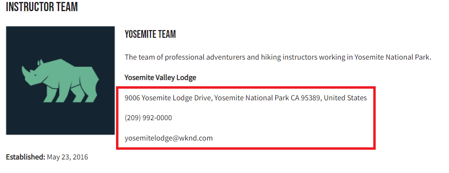

# Integrazione di applicazioni client

Nel capitolo precedente, hai creato e aggiornato query persistenti utilizzando richieste HTTP PUT e POST.

Questo capitolo illustra i passaggi per integrare le query persistenti con l’app WKND utilizzando richieste HTTP GET all’interno di cinque componenti React:

* Dove si trova
* Indirizzo
* Istruttori
* Administrator
* Team

## Prerequisiti {#prerequisites}

Questo documento fa parte di un tutorial in più parti. Assicurarsi che i capitoli precedenti siano stati completati prima di procedere con questo capitolo. Completamento del [esercitazione di base](/help/headless-tutorial/graphql/multi-step/overview.md) è consigliato.

_Le schermate IDE in questo capitolo provengono da [Codice di Visual Studio](https://code.visualstudio.com/)_

### Capitolo 1-4 Pacchetto soluzione (facoltativo) {#solution-package}

È disponibile un pacchetto di soluzioni da installare che completa i passaggi nell’interfaccia utente AEM per i capitoli da 1 a 4. Questo pacchetto è **non necessario** se i capitoli precedenti sono stati completati.

1. Scarica [Advanced-GraphQL-Tutorial-Solution-Package-1.1.zip](/help/headless-tutorial/graphql/advanced-graphql/assets/tutorial-files/Advanced-GraphQL-Tutorial-Solution-Package-1.1.zip).
1. In AEM, passa a **Strumenti** > **Distribuzione** > **Pacchetti** accesso **Gestione pacchetti**.
1. Carica e installa il pacchetto (file zip) scaricato nel passaggio precedente.

## Obiettivi {#objectives}

In questa esercitazione, imparerai a integrare le richieste di query persistenti nell’app di esempio WKND GraphQl React utilizzando AEM JavaScript headless [SDK](https://github.com/adobe/aem-headless-client-js).

## Installare ed eseguire l’applicazione client di esempio {#install-client-app}

Per accelerare l&#39;esercitazione, viene fornita un&#39;app JS React iniziale.

>[!NOTE]
> 
> Di seguito sono riportate le istruzioni per collegare l’app React a un **Autore** ambiente in AEM as a Cloud Service utilizzando un [token di accesso allo sviluppo locale](/help/headless-tutorial/authentication/local-development-access-token.md). È inoltre possibile collegare l’app a un [istanza di authoring locale tramite SDK AEMaaCS](/help/headless-tutorial/graphql/quick-setup/local-sdk.md) utilizzo dell’autenticazione di base.

1. Scarica **[aem-guides-wknd-headless-start-tutorial.zip](/help/headless-tutorial/graphql/advanced-graphql/assets/tutorial-files/aem-guides-wknd-headless-start-tutorial.zip)**.
1. Decomprimi il file e apri il progetto nell’IDE.
1. Ottenere un [token di sviluppo locale](/help/headless-tutorial/authentication/local-development-access-token.md) per l’ambiente AEM di destinazione.
1. Nel progetto, apri il file . `.env.development`.
   1. Imposta `REACT_APP_DEV_TOKEN` pari a `accessToken` dal token di sviluppo locale. (Non l’intero file JSON)
   1. Imposta `REACT_APP_HOST_URI` all’url del AEM **Autore** ambiente.

   
1. Apri un nuovo terminale e passa alla cartella del progetto. Esegui i seguenti comandi:

   ```shell
   $ npm install
   $ npm start
   ```

1. Viene aperto un nuovo browser in `http://localhost:3000/aem-guides-wknd-pwa`.
1. Tocca **Campeggio** > **Yosemite Backpack** per visualizzare i dettagli dell&#39;avventura del backpack Yosemite.

   

1. Apri gli strumenti di sviluppo del browser ed esamina `XHR` richiesta

   

   Dovresti visualizzare un `POST` all’endpoint GraphQL. Visualizzazione della `Payload`, puoi visualizzare l’intera query GraphQL inviata. Nelle sezioni successive, l’app verrà aggiornata per utilizzarla **persistente** query.


## Guida introduttiva

Nell’esercitazione di base, viene utilizzata una query GraphQl con parametri per richiedere un singolo frammento di contenuto ed eseguire il rendering dei dettagli dell’avventura. Quindi, aggiorna il `adventureDetailQuery` per includere nuovi campi e utilizzare query persistenti create nel capitolo precedente.

Vengono creati cinque componenti:

| Componente React | Dove si trova |
|-------|------|
| Amministratore | `src/components/Administrator.js` |
| Team | `src/components/Team.js` |
| Dove si trova | `src/components/Location.js` |
| Istruttori | `src/components/Instructors.js` |
| Indirizzo | `src/components/Address.js` |

## Aggiorna l&#39;hook useGraphQL

Personalizzazione [Aggancio a effetto reattivo](https://reactjs.org/docs/hooks-overview.html#effect-hook) è stato creato in ascolto delle modifiche apportate alle `query`, e al momento della modifica invia una richiesta HTTP POST all&#39;endpoint GraphQL AEM e restituisce la risposta JSON all&#39;app.

Crea un nuovo gancio da utilizzare **persistente** query. L’app può quindi effettuare richieste HTTP GET per i dettagli dell’avventura. La `runPersistedQuery` del [SDK client AEM headless](https://github.com/adobe/aem-headless-client-js) viene utilizzato per semplificare l’esecuzione di una query persistente.

1. Aprire il file `src/api/useGraphQL.js`
1. Aggiungi un nuovo gancio per `useGraphQLPersisted`:

   ```javascript
   /**
   * Custom React Hook to perform a GraphQL query to a persisted query endpoint
   * @param persistedPath - the short path to the persisted query
   * @param fragmentPathParam - optional parameters object that can be passed in for parameterized persistent queries
   */
   export function useGraphQLPersisted(persistedPath, fragmentPathVariable) {
       let [data, setData] = useState(null);
       let [errors, setErrors] = useState(null);
   
       useEffect(() => {
           let queryVariables = {};
   
           // we pass in a primitive fragmentPathVariable (String) and then construct the object {fragmentPath: fragmentPathParam} to pass as query params to the persisted query
           // It is simpler to pass a primitive into a React hooks, as comparing the state of a dependent object can be difficult. see https://reactjs.org/docs/hooks-faq.html#can-i-skip-an-effect-on-updates
           if(fragmentPathVariable) {
               queryVariables = {fragmentPath: fragmentPathVariable};
           }
   
           // execute a persisted query using the given path and pass in variables (if needed)
           sdk.runPersistedQuery(persistedPath, queryVariables)
               .then(({ data, errors }) => {
               if (errors) setErrors(mapErrors(errors));
               if (data) setData(data);
           })
           .catch((error) => {
           setErrors(error);
           });
   }, [persistedPath, fragmentPathVariable]);
   
   return { data, errors }
   }
   ```
1. Salva le modifiche apportate al file.

## Aggiorna componente Dettagli avventura

Il file `src/api/queries.js` contiene le query GraphQL utilizzate per alimentare l&#39;applicazione `adventureDetailQuery` restituisce i dettagli di una singola avventura utilizzando la richiesta POST GraphQL standard. Quindi, aggiorna il `AdventureDetail` per utilizzare la persistenza `wknd/all-adventure-details` query.

1. Apri `src/screens/AdventureDetail.js`.
1. Prima commenta la seguente riga:

   ```javascript
   export default function AdventureDetail() {
   
       ...
   
       //const { data, errors } = useGraphQL(adventureDetailQuery(adventureFragmentPath));
   ```

   In questo modo viene utilizzato lo standard GraphQL POST per recuperare i dettagli dell’avventura in base a un `adventureFragmentPath`

1. Per utilizzare `useGraphQLPersisted` gancio, aggiungi la seguente riga:

   ```javascript
   export default function AdventureDetail() {
   
      //const { data, errors } = useGraphQL(adventureDetailQuery(adventureFragmentPath));
       const {data, errors} = useGraphQLPersisted("wknd/all-adventure-details", adventureFragmentPath);
   ```

   Osserva il percorso `wknd/all-adventure-details` è il percorso della query persistente creata nel capitolo precedente.

   >[!CAUTION]
   >
   > Per utilizzare la query aggiornata come `wknd/all-adventure-details` deve essere mantenuto nell&#39;ambiente AEM di destinazione. Esamina i passaggi descritti in [Query GraphQL persistenti](/help/headless-tutorial/graphql/advanced-graphql/graphql-persisted-queries.md#cache-control-all-adventures) o installare [Pacchetto di soluzioni AEM](/help/headless-tutorial/graphql/advanced-graphql/assets/tutorial-files/Advanced-GraphQL-Tutorial-Solution-Package-1.1.zip)

1. Torna all’app in esecuzione nel browser e utilizza gli strumenti per sviluppatori del browser per controllare la richiesta dopo aver navigato in un **Dettagli sull&#39;avventura** pagina.

   

   ```
   http://localhost:3000/graphql/execute.json/wknd/all-adventure-details;fragmentPath=/content/dam/wknd/en/adventures/yosemite-backpacking/yosemite-backpacking
   ```

   Ora dovresti visualizzare un `GET` richiesta che utilizza la query persistente in `wknd/all-adventure-details`.

1. Passa ad altri dettagli avventura e osserva che lo stesso `GET` La richiesta viene effettuata ma con percorsi di frammento diversi. L&#39;applicazione deve continuare a funzionare come prima.

Fai riferimento a `AdventureDetail.js` in [aem-guides-wknd-headless-solution-tutorial.zip](/help/headless-tutorial/graphql/advanced-graphql/assets/tutorial-files/aem-guides-wknd-headless-solution-tutorial.zip) per un esempio completo del componente aggiornato.

Quindi, crea **Posizione**, **Amministratore** e **Istruttori** componenti per eseguire il rendering dei dati di posizione. La **Indirizzo** all’interno del **Team** componente.

## Sviluppa il componente Posizione

1. In `AdventureDetail.js` aggiungi un riferimento al `<Location>` il passaggio dei dati di posizione dal `adventure` oggetto dati:

   ```javascript
   export default function AdventureDetail() {
       ...
   
       return (
           ...
   
           <Location data={adventure.location} />
   ```

1. Esamina il file in `src/components/Location.js`. La `Location` il componente esegue il rendering dei dati relativi a dove soddisfare, informazioni di contatto, informazioni sul tempo e un’immagine della posizione dal **Posizione** Modello per frammento di contenuto. Come minimo, `Location` il componente prevede un `address` oggetto da trasmettere.
1. Fai riferimento a `Location.js` in [aem-guides-wknd-headless-solution-tutorial.zip](/help/headless-tutorial/graphql/advanced-graphql/assets/tutorial-files/aem-guides-wknd-headless-solution-tutorial.zip) per un esempio completo del componente aggiornato.

Una volta effettuati gli aggiornamenti, la pagina dei dettagli di cui è stato effettuato il rendering dovrebbe essere la seguente:


## Sviluppa il componente Team

1. In `AdventureDetail.js` aggiungi un riferimento al `<Team>` (sotto il `<Location>` passaggio del `instructorTeam` i dati `adventure` oggetto dati:

   ```javascript
   <Location data={adventure.location} />
   <Team data={adventure.instructorTeam} />
   ```

1. Esamina il file in `src/components/Team.js`. La `Team` il componente esegue il rendering dei dati relativi alla data di creazione, all’immagine e alla descrizione del team dal **Team** Frammento di contenuto.

1. In `Team.js` prende atto dell&#39;inclusione della `Address` componente.

   ```javascript
   export default function Team({data}) {
       ...
       {teamPath && <Address _path={teamPath}/>}
   ```

   In questo caso viene trasmesso un percorso al team corrente nel `Address` , che a sua volta esegue una query per ottenere l’indirizzo in base al team.

1. Fai riferimento a `Team.js` in [aem-guides-wknd-headless-solution-tutorial.zip](/help/headless-tutorial/graphql/advanced-graphql/assets/tutorial-files/aem-guides-wknd-headless-solution-tutorial.zip) per un esempio completo del componente.

Una volta integrata la query, avrà un aspetto simile al seguente:



## Sviluppa il componente Indirizzo

1. Esamina il file in `src/components/Address.js`. La `Address` il componente esegue il rendering delle informazioni relative all’indirizzo, ad esempio indirizzo stradale, città, stato, codice postale, paese dal **Indirizzo** Frammento di contenuto e telefono ed e-mail dal **Informazioni contatto** riferimento al frammento.
1. La `Address` è simile al `AdventureDetails` in quanto effettua una chiamata persistente per recuperare dati in base a un percorso. La differenza è che utilizza `/wknd/team-location-by-location-path` per effettuare la richiesta.
1. Fai riferimento a `Address.js` in [aem-guides-wknd-headless-solution-tutorial.zip](/help/headless-tutorial/graphql/advanced-graphql/assets/tutorial-files/aem-guides-wknd-headless-solution-tutorial.zip) per un esempio completo del componente.

## Sviluppa il componente Amministratore

1. In `AdventureDetail.js` aggiungi un riferimento al `<Adminstrator>` (sotto il `<Team>` passaggio del `administrator` i dati `adventure` oggetto dati:

   ```javascript
   <Location data={adventure.location} />
   <Team data={adventure.instructorTeam} />
   <Administrator data={adventure.administrator} /> 
   ```

1. Esamina il file in `src/components/Administrator.js`. La `Administrator` il componente esegue il rendering di dettagli quali il nome completo dal **Amministratore** Frammento di contenuto ed esegui il rendering di telefono ed e-mail dal **Informazioni contatto** riferimento al frammento.
1. Fai riferimento a `Administrator.js` in [aem-guides-wknd-headless-solution-tutorial.zip](/help/headless-tutorial/graphql/advanced-graphql/assets/tutorial-files/aem-guides-wknd-headless-solution-tutorial.zip) per un esempio completo del componente.

Dopo aver creato il componente Amministratore, puoi eseguire il rendering dell’applicazione. L&#39;output deve corrispondere all&#39;immagine seguente:


## Sviluppa il componente Istruttori

1. In `AdventureDetail.js` aggiungi un riferimento al `<Instructors>` (sotto il `<Administrator>` passaggio del `instructorTeam` i dati `adventure` oggetto dati:

   ```javascript
   <Location data={adventure.location} />
   <Team data={adventure.instructorTeam}/>
   <Administrator data={adventure.administrator} />             
   <Instructors data={adventure.instructorTeam} />
   ```

1. Esamina il file in `src/components/Instructors.js`. La `Instructors` Il componente esegue il rendering dei dati relativi a ciascun membro del team, inclusi nome completo, biografia, immagine, numero di telefono, livello di esperienza e competenze. Il componente si ripete su un array per visualizzare ogni membro.
1. Fai riferimento a `Instructors.js` in [aem-guides-wknd-headless-solution-tutorial.zip](/help/headless-tutorial/graphql/advanced-graphql/assets/tutorial-files/aem-guides-wknd-headless-solution-tutorial.zip) per un esempio completo del componente.

Una volta eseguito il rendering dell’applicazione, l’output deve corrispondere all’immagine seguente:


## App WKND di esempio completata

L&#39;app finita deve avere l&#39;aspetto seguente:


### Applicazione client finale

Puoi scaricare e utilizzare la versione finale dell’app:
**[aem-guides-wknd-headless-solution-tutorial.zip](/help/headless-tutorial/graphql/advanced-graphql/assets/tutorial-files/aem-guides-wknd-headless-solution-tutorial.zip)**

## Congratulazioni

Congratulazioni! Ora hai completato l’integrazione e l’implementazione delle query persistenti nell’app WKND di esempio.