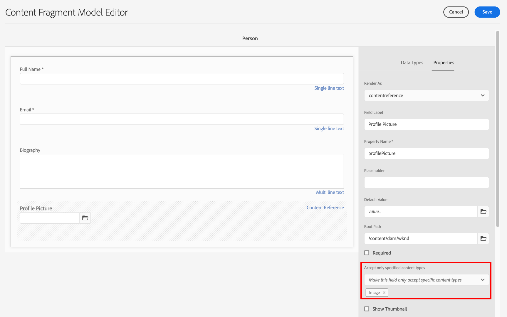
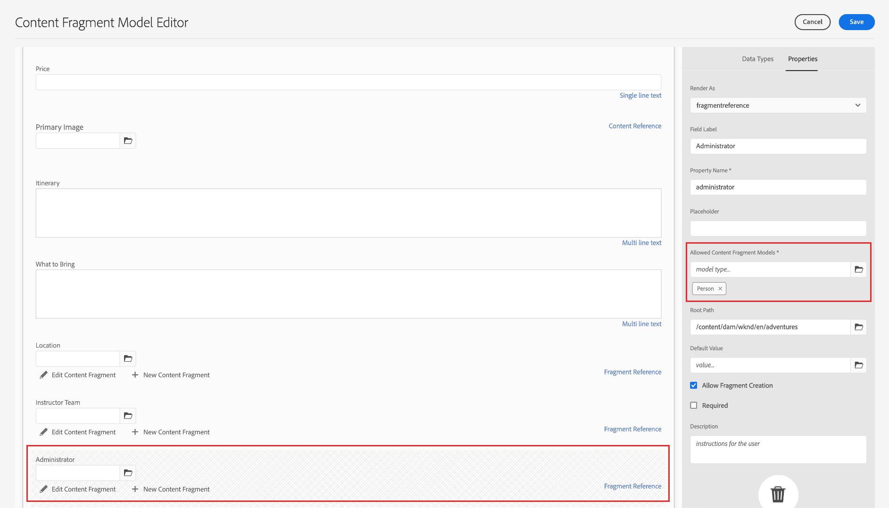

# Creare modelli di frammenti di contenuto {#create-content-fragment-models}

Questo capitolo illustra i passaggi necessari per creare cinque modelli per frammenti di contenuto:

* **Informazioni di contatto**
* **Indirizzo**
* **Persona**
* **Dove si trova**
* **Team**

I modelli per frammenti di contenuto consentono di definire relazioni tra i tipi di contenuto e di mantenere tali relazioni, ad esempio gli schemi. Utilizza riferimenti a frammenti nidificati, vari tipi di dati sul contenuto e il tipo di scheda per l’organizzazione del contenuto visivo. Tipi di dati più avanzati, ad esempio segnaposto per schede, riferimenti a frammenti, oggetti JSON e il tipo di dati data e ora.

Questo capitolo illustra anche come migliorare le regole di convalida per i riferimenti ai contenuti, come le immagini.

## Prerequisiti {#prerequisites}

Questo è un tutorial avanzato. Prima di procedere con questo capitolo, assicurarsi di aver completato [configurazione rapida](../quick-setup/cloud-service.md). Assicurati di aver letto anche il precedente [panoramica](../overview.md) per ulteriori informazioni sulla configurazione del tutorial avanzato.

## Obiettivi {#objectives}

* Creare modelli per frammenti di contenuto.
* Aggiungi segnaposto per schede, data e ora, oggetti JSON, riferimenti a frammenti e riferimenti a contenuti per i modelli.
* Aggiungi la convalida ai riferimenti di contenuto.

## Panoramica del modello per frammenti di contenuto {#content-fragment-model-overview}

Il video seguente fornisce una breve introduzione ai modelli per frammenti di contenuto e spiega come vengono utilizzati in questa esercitazione.

>[!VIDEO](https://video.tv.adobe.com/v/340037?quality=12&learn=on)

## Creare modelli di frammenti di contenuto {#create-models}

Creiamo alcuni modelli per frammenti di contenuto per l’app WKND. Per un’introduzione di base alla creazione di modelli per frammenti di contenuto, consulta il capitolo appropriato nella sezione [esercitazione di base](../multi-step/content-fragment-models.md).

1. Passa a **Strumenti** > **Generale** > **Modelli per frammenti di contenuto**.

   

1. Seleziona **WKND condiviso** per visualizzare l’elenco dei modelli per frammenti di contenuto esistenti per il sito.

### Modello informazioni contatto {#contact-info-model}

Quindi, crea un modello contenente le informazioni di contatto per una persona o una posizione.

1. Seleziona **Crea** in alto a destra.

1. Assegna al modello il titolo &quot;Informazioni di contatto&quot;, quindi seleziona **Crea**. Nella finestra modale di successo visualizzata, seleziona **Apri** per modificare il modello appena creato.

1. Per iniziare, trascina un’ **Testo su riga singola** sul modello. Assegna un **Etichetta campo** di &quot;Telefono&quot; nella **Proprietà** scheda. Il nome della proprietà viene compilato automaticamente come `phone`. Seleziona la casella di controllo per creare il campo **Obbligatorio**.

1. Accedi a **Tipi di dati** , quindi aggiungerne un&#39;altra **Testo su riga singola** sotto il campo &quot;Telefono&quot;. Assegna un **Etichetta campo** di &quot;E-mail&quot; e impostarlo su **Obbligatorio**.

Adobe Experience Manager viene fornito con alcuni metodi di convalida incorporati. Questi metodi di convalida ti consentono di aggiungere regole di governance a campi specifici nei modelli per frammenti di contenuto. In questo caso, aggiungiamo una regola di convalida per garantire che gli utenti possano immettere indirizzi e-mail validi solo durante la compilazione di questo campo. Sotto **Tipo di convalida** a discesa, seleziona **E-mail**.

Il modello per frammenti di contenuto completato deve essere simile al seguente:

Al termine, seleziona **Salva** per confermare le modifiche e chiudere Editor modello per frammenti di contenuto.

### Modello di indirizzo {#address-model}

Quindi, crea un modello per un indirizzo.

1. Dalla sezione **WKND condiviso**, seleziona **Crea** dall&#39;angolo in alto a destra.

1. Inserisci il titolo &quot;Address&quot; (Indirizzo), quindi seleziona **Crea**. Nella finestra modale di successo visualizzata, seleziona **Apri** per modificare il modello appena creato.

1. Trascina una **Testo su riga singola** sul modello e assegnargli un **Etichetta campo** di &quot;Indirizzo&quot;. Il nome della proprietà viene quindi compilato come `streetAddress`. Seleziona la **Obbligatorio** casella di controllo.

1. Ripetete i passaggi precedenti e aggiungete altri quattro campi &quot;Testo a riga singola&quot; al modello. Utilizza le seguenti etichette:

   * Città
   * Stato
   * Codice postale
   * Paese

1. Seleziona **Salva** per salvare le modifiche apportate al modello Address.

   Il modello di frammento &quot;Address&quot; completato deve essere simile al seguente:
   

### Modello della persona {#person-model}

Quindi, crea un modello che contenga informazioni su una persona.

1. Nell’angolo in alto a destra, seleziona **Crea**.

1. Assegna al modello il titolo &quot;Person&quot; (Persona), quindi seleziona **Crea**. Nella finestra modale di successo visualizzata, seleziona **Apri** per modificare il modello appena creato.

1. Per iniziare, trascina un’ **Testo su riga singola** sul modello. Assegna un **Etichetta campo** di &quot;Nome completo&quot;. Il nome della proprietà viene compilato automaticamente come `fullName`. Seleziona la casella di controllo per creare il campo **Obbligatorio**.

   

1. È possibile fare riferimento ai modelli per frammenti di contenuto in altri modelli. Accedi a **Tipi di dati** , quindi trascina e rilascia la **Riferimento frammento** e assegnargli l’etichetta &quot;Contact Info&quot; (Informazioni di contatto).

1. In **Proprietà** , sotto il **Modelli per frammenti di contenuto consentiti** , selezionare l&#39;icona della cartella e quindi scegliere il **Informazioni di contatto** modello di frammento creato in precedenza.

1. Aggiungi un **Riferimento contenuto** e fornisci un **Etichetta campo** di &quot;Profile Picture&quot; (Immagine profilo). Seleziona l’icona della cartella in **Percorso directory principale** per aprire la finestra modale di selezione del percorso. Seleziona un percorso principale selezionando **contenuto** > **Risorse**, quindi selezionando la casella di controllo per **WKND condiviso**. Utilizza il **Seleziona** in alto a destra per salvare il percorso. Il percorso finale del testo deve contenere `/content/dam/wknd-shared`.

   

1. Sotto **Accetta solo i tipi di contenuto specificati**, selezionare &quot;Image&quot;.

   

1. Per limitare le dimensioni e le dimensioni del file di immagine, esaminiamo alcune opzioni di convalida per il campo Riferimento contenuto.

   Sotto **Accetta solo dimensioni file specificate**, selezionare &quot;Minore o uguale a&quot; e di seguito vengono visualizzati campi aggiuntivi.
   

1. Per **Max**, immettere &quot;5&quot; e per **Seleziona unità**, selezionare &quot;Megabyte (MB)&quot;. Questa convalida consente di scegliere solo le immagini delle dimensioni specificate.

1. Sotto **Accetta solo la larghezza immagine specificata**, selezionare &quot;Maximum Width&quot; (Larghezza massima). In **Max. (pixel)** che viene visualizzato, immettere &quot;10000&quot;. Seleziona le stesse opzioni per **Accetta solo un&#39;altezza immagine specificata**.

   Queste convalide garantiscono che le immagini aggiunte non superino i valori specificati. Le regole di convalida ora dovrebbero essere simili al seguente:

   

1. Aggiungi un **Testo su più righe** e fornisci un **Etichetta campo** di &quot;Biografia&quot;. Lascia **Tipo predefinito** come opzione predefinita &quot;Rich Text&quot;.

   

1. Accedi a **Tipi di dati** , quindi trascina un **Enumerazione** campo sotto &quot;Biografia&quot;. Invece del predefinito **Rendering come** , seleziona **A discesa** e fornisci un **Etichetta campo** di &quot;Livello di esperienza istruttore&quot;. Immettere una selezione di opzioni del livello di esperienza istruttore, ad esempio _Esperto, avanzato, intermedio_.

1. Quindi, trascina un altro **Enumerazione** in &quot;Livello di esperienza istruttore&quot; e scegliere &quot;caselle di controllo&quot; in **Rendering come** opzione. Assegna un **Etichetta campo** di &quot;Skills&quot;. Acquisisci diverse abilità come arrampicata su roccia, surf, ciclismo, sci e zaino. L’etichetta dell’opzione e il valore dell’opzione devono corrispondere come segue:

   

1. Infine, crea un’etichetta di campo &quot;Dettagli amministratore&quot; utilizzando un’ **Testo su più righe** campo.

Seleziona **Salva** per confermare le modifiche e chiudere Editor modello per frammenti di contenuto.

### Modello di posizione {#location-model}

Il successivo modello per frammenti di contenuto descrive una posizione fisica. Questo modello utilizza segnaposto per tabulazioni. I segnaposto per schede consentono di organizzare i tipi di dati nell’editor modelli e il contenuto nell’editor frammenti, rispettivamente, suddividendo il contenuto in categorie. Ogni segnaposto crea una scheda, simile a una scheda in un browser Internet, nell’editor dei frammenti di contenuto. Il modello Posizione deve avere due schede: Dettagli posizione e Indirizzo posizione.

1. Come in precedenza, seleziona **Crea** per creare un altro modello per frammenti di contenuto. Per Titolo modello, immettete &quot;Posizione&quot;. Seleziona **Crea** seguito da **Apri** nella finestra modale di successo che viene visualizzata.

1. Aggiungi un **Segnaposto scheda** sul modello e la contrassegna come &quot;Location Details&quot; (Dettagli posizione).

1. Trascina e rilascia una **Testo su riga singola** e la chiami &quot;Nome&quot;. Sotto questa etichetta di campo, aggiungi un **testo su più righe** e la contrassegna come &quot;Descrizione&quot;.

1. Quindi, aggiungi un **Riferimento frammento** e la contrassegna come &quot;Informazioni di contatto&quot;. Nella scheda proprietà, sotto **Modelli per frammenti di contenuto consentiti**, seleziona la **Icona cartella** e scegli il modello di frammento &quot;Informazioni di contatto&quot; creato in precedenza.

1. Aggiungi un **Riferimento contenuto** in &quot;Contact Info&quot;. Etichettalo come &quot;Immagine posizione&quot;. Il **Percorso directory principale** dovrebbe essere `/content/dam/wknd-shared.` Sotto **Accetta solo i tipi di contenuto specificati**, selezionare &quot;Image&quot;.

1. Aggiungiamo anche un **Oggetto JSON** in &quot;Location Image&quot;. Poiché questo tipo di dati è flessibile, può essere utilizzato per visualizzare qualsiasi dato da includere nel contenuto. In questo caso, l’oggetto JSON viene utilizzato per visualizzare informazioni sul meteo. Etichetta l’oggetto JSON &quot;Meteo per stagione&quot;. In **Proprietà** , aggiungi un **Descrizione** quindi per l’utente è chiaro quali dati dovrebbero essere inseriti qui: &quot;Dati JSON relativi alla posizione dell’evento meteo per stagione (Primavera, Estate, Autunno, Inverno)&quot;.

   

1. Per creare la scheda Indirizzo, aggiungi un **Segnaposto scheda** sul modello e assegnarle l’etichetta &quot;Indirizzo località&quot;.

1. Trascina una **Riferimento frammento** e nella scheda delle proprietà, etichettarlo come &quot;Address&quot; e in **Modelli per frammenti di contenuto consentiti**, seleziona la **Indirizzo** modello.

1. Seleziona **Salva** per confermare le modifiche e chiudere Editor modello per frammenti di contenuto. Il modello di percorso completato dovrebbe essere visualizzato come segue:

   

### Modello team {#team-model}

Infine, crea un modello che descriva un team di persone.

1. Dalla sezione **WKND condiviso** pagina, seleziona **Crea** per creare un altro modello per frammenti di contenuto. Per Titolo modello, immetti &quot;Team&quot;. Come in precedenza, seleziona **Crea** seguito da **Apri** nella finestra modale di successo che viene visualizzata.

1. Aggiungi un **Testo su più righe** al modulo. Sotto **Etichetta campo**, immetti &quot;Description&quot;.

1. Aggiungi un **Data e ora** sul modello e la contrassegna come &quot;Data di fondazione del team&quot;. In questo caso, mantieni il valore predefinito **Tipo** impostato su &quot;Date&quot; (Data), ma è anche possibile utilizzare &quot;Date &amp; Time&quot; (Data e ora) o &quot;Time&quot; (Ora).

   

1. Accedi a **Tipi di dati** scheda. Sotto la &quot;Data di fondazione del team&quot;, aggiungi un **Riferimento frammento**. In **Rendering come** , seleziona &quot;multifield&quot;. Per **Etichetta campo**, immettere &quot;Membri team&quot;. Questo campo si collega al _Persona_ modello creato in precedenza. Poiché il tipo di dati è multicampo, è possibile aggiungere più frammenti di persona per creare un team di persone.

   

1. Sotto **Modelli per frammenti di contenuto consentiti**, utilizza l’icona della cartella per aprire il modale Seleziona percorso, quindi seleziona la **Persona** modello. Utilizza il **Seleziona** per salvare il percorso.

   

1. Seleziona **Salva** per confermare le modifiche e chiudere Editor modello per frammenti di contenuto.

## Aggiungere riferimenti frammento al modello di avventura {#fragment-references}

Similmente a come il modello Team ha un riferimento frammento al modello Persona, per visualizzare questi nuovi modelli nell’app WKND è necessario fare riferimento ai modelli Team e Posizione dal modello Adventure.

1. Dalla sezione **WKND condiviso** , seleziona la **Avventura** modello, quindi seleziona **Modifica** dalla navigazione in alto.

   

1. Nella parte inferiore del form, sotto &quot;What to Bring&quot; (Cosa portare), aggiungere un segno **Riferimento frammento** campo. Immetti un **Etichetta campo** di &quot;Location&quot;. Sotto **Modelli per frammenti di contenuto consentiti**, seleziona la **Posizione** modello.

   

1. Aggiungi un altro **Riferimento frammento** e denominarlo &quot;Squadra istruttore&quot;. Sotto **Modelli per frammenti di contenuto consentiti**, seleziona la **Team** modello.

   

1. Aggiungi un altro **Riferimento frammento** e assegnarle l&#39;etichetta &quot;Administrator&quot;.

   

1. Seleziona **Salva** per confermare le modifiche e chiudere Editor modello per frammenti di contenuto.

## Best practice {#best-practices}

Esistono alcune best practice relative alla creazione di modelli per frammenti di contenuto:

* Creare modelli mappati a componenti UX. Ad esempio, l’app WKND dispone di modelli di frammenti di contenuto per avventure, articoli e posizione. Puoi anche aggiungere intestazioni, promozioni o liberatorie. Ciascuno di questi esempi costituisce un componente UX specifico.

* Crea il minor numero di modelli possibile. Limitare il numero di modelli consente di massimizzare il riutilizzo e semplificare la gestione dei contenuti.

* Nidifica i modelli per frammenti di contenuto con la profondità necessaria, ma solo con la necessità. Ricorda che la nidificazione viene eseguita con riferimenti a frammenti o a contenuti. Considerare un massimo di cinque livelli di nidificazione.

## Congratulazioni. {#congratulations}

Congratulazioni. Ora hai aggiunto le schede, hai utilizzato i tipi di dati di oggetti data e ora e JSON e hai ulteriori informazioni sui riferimenti a frammenti e contenuti. Sono state inoltre aggiunte le regole di convalida dei riferimenti ai contenuti.

## Passaggi successivi {#next-steps}

Il prossimo capitolo di questa serie riguarderà: [creazione di frammenti di contenuto](/help/headless-tutorial/graphql/advanced-graphql/author-content-fragments.md) dai modelli creati in questo capitolo. Scopri come utilizzare i tipi di dati introdotti in questo capitolo e creare criteri per cartelle per limitare quali modelli per frammenti di contenuto possono essere creati in una cartella di risorse.

Anche se è opzionale per questo tutorial, assicurati di pubblicare tutti i contenuti in situazioni di produzione reali. Per una panoramica degli ambienti Author e Publish in AEM, consulta
[Serie video di AEM headless e GraphQL](/help/headless-tutorial/graphql/video-series/author-publish-architecture.md).
