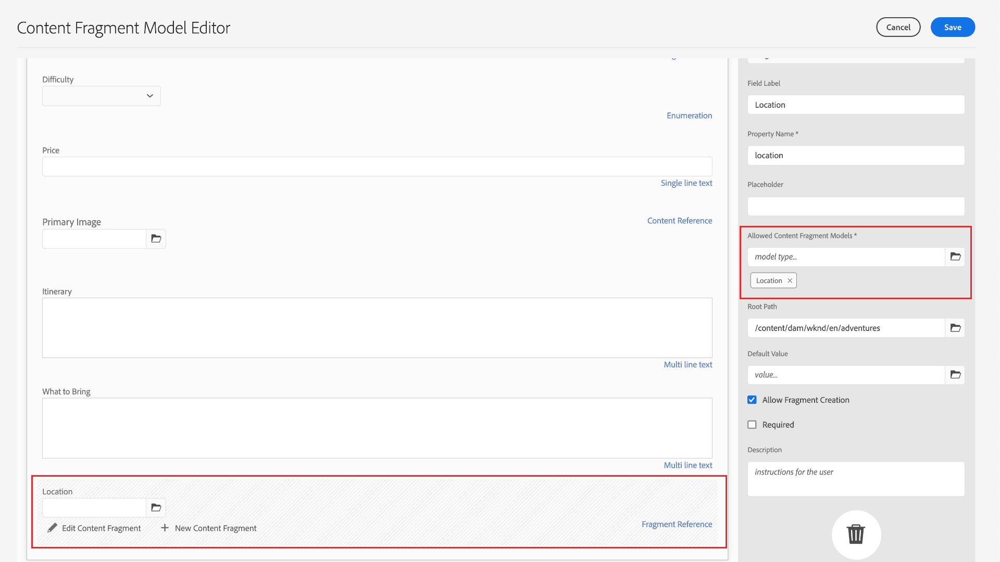

# Creare modelli di frammenti di contenuto {#create-content-fragment-models}

Questo capitolo illustra i passaggi necessari per creare cinque modelli per frammenti di contenuto:

* **Informazioni contatto**
* **Indirizzo**
* **Persona**
* **Dove si trova**
* **Team**

I modelli per frammenti di contenuto consentono di definire relazioni tra i tipi di contenuto e di mantenere tali relazioni, ad esempio gli schemi. Utilizza riferimenti a frammenti nidificati, vari tipi di dati sul contenuto e il tipo di scheda per l’organizzazione del contenuto visivo. Tipi di dati più avanzati, ad esempio segnaposto per schede, riferimenti a frammenti, oggetti JSON e il tipo di dati data e ora.

Questo capitolo illustra anche come migliorare le regole di convalida per i riferimenti ai contenuti, come le immagini.

## Prerequisiti {#prerequisites}

Questo è un tutorial avanzato. Prima di procedere con questo capitolo, assicurati di aver completato la [configurazione rapida](../quick-setup/cloud-service.md). Assicurati anche di aver letto il precedente capitolo [overview](../overview.md) per ulteriori informazioni sulla configurazione dell&#39;esercitazione avanzata.

## Obiettivi {#objectives}

* Creare modelli per frammenti di contenuto.
* Aggiungi segnaposto per schede, data e ora, oggetti JSON, riferimenti a frammenti e riferimenti a contenuti per i modelli.
* Aggiungi la convalida ai riferimenti di contenuto.

## Panoramica del modello per frammenti di contenuto {#content-fragment-model-overview}

Il video seguente fornisce una breve introduzione ai modelli per frammenti di contenuto e spiega come vengono utilizzati in questa esercitazione.

>[!VIDEO](https://video.tv.adobe.com/v/3449527?quality=12&learn=on&captions=ita)

## Creare modelli di frammenti di contenuto {#create-models}

Creiamo alcuni modelli per frammenti di contenuto per l’app WKND. Se hai bisogno di un&#39;introduzione di base alla creazione di modelli per frammenti di contenuto, consulta il capitolo appropriato nell&#39;[esercitazione di base](../multi-step/content-fragment-models.md).

1. Passa a **Strumenti** > **Generale** > **Modelli per frammenti di contenuto**.

   

1. Selezionare **Condiviso WKND** per visualizzare l&#39;elenco dei modelli per frammenti di contenuto esistenti per il sito.

### Modello informazioni contatto {#contact-info-model}

Quindi, crea un modello contenente le informazioni di contatto per una persona o una posizione.

1. Seleziona **Crea** nell&#39;angolo superiore destro.

1. Assegna al modello il titolo &quot;Informazioni di contatto&quot;, quindi seleziona **Crea**. Nella finestra modale di completamento visualizzata, seleziona **Apri** per modificare il modello appena creato.

1. Per iniziare, trascina un campo **Testo su riga singola** nel modello. Assegnagli un **Etichetta campo** di &quot;Telefono&quot; nella scheda **Proprietà**. Il nome della proprietà viene compilato automaticamente come `phone`. Selezionare la casella di controllo per rendere il campo **Obbligatorio**.

1. Passa alla scheda **Tipi di dati**, quindi aggiungi un altro campo **Testo a riga singola** sotto il campo &quot;Telefono&quot;. Assegnagli un **Etichetta campo** di &quot;E-mail&quot; e impostala su **Obbligatorio**.

Adobe Experience Manager viene fornito con alcuni metodi di convalida incorporati. Questi metodi di convalida ti consentono di aggiungere regole di governance a campi specifici nei modelli per frammenti di contenuto. In questo caso, aggiungiamo una regola di convalida per garantire che gli utenti possano immettere indirizzi e-mail validi solo durante la compilazione di questo campo. Nel menu a discesa **Tipo di convalida**, selezionare **Posta elettronica**.

Il modello per frammenti di contenuto completato deve essere simile al seguente:

Al termine, seleziona **Salva** per confermare le modifiche e chiudere l&#39;Editor modello per frammenti di contenuto.

### Modello di indirizzo {#address-model}

Quindi, crea un modello per un indirizzo.

1. Da **Condiviso WKND**, seleziona **Crea** dall&#39;angolo in alto a destra.

1. Immettere il titolo &quot;Indirizzo&quot; e selezionare **Crea**. Nella finestra modale di completamento visualizzata, seleziona **Apri** per modificare il modello appena creato.

1. Trascina e rilascia un campo **Testo su riga singola** sul modello e assegnagli un **Etichetta campo** di &quot;Indirizzo&quot;. Il nome della proprietà viene quindi compilato come `streetAddress`. Selezionare la casella di controllo **Obbligatorio**.

1. Ripetete i passaggi precedenti e aggiungete altri quattro campi &quot;Testo a riga singola&quot; al modello. Utilizza le seguenti etichette:

   * Città
   * Stato
   * Codice postale
   * Paese

1. Seleziona **Salva** per salvare le modifiche al modello di indirizzo.

   Il modello di frammento &quot;Address&quot; completato deve essere simile al seguente:
   

### Modello della persona {#person-model}

Quindi, crea un modello che contenga informazioni su una persona.

1. Nell&#39;angolo in alto a destra, seleziona **Crea**.

1. Assegna al modello il titolo &quot;Persona&quot;, quindi seleziona **Crea**. Nella finestra modale di completamento visualizzata, seleziona **Apri** per modificare il modello appena creato.

1. Per iniziare, trascina un campo **Testo su riga singola** nel modello. Assegnagli un **Etichetta campo** con &quot;Nome completo&quot;. Il nome della proprietà viene compilato automaticamente come `fullName`. Selezionare la casella di controllo per rendere il campo **Obbligatorio**.

   

1. È possibile fare riferimento ai modelli per frammenti di contenuto in altri modelli. Passa alla scheda **Tipi di dati**, quindi trascina e rilascia il campo **Riferimento frammento** e assegnagli l&#39;etichetta &quot;Informazioni di contatto&quot;.

1. Nella scheda **Proprietà**, seleziona il campo **Modelli per frammenti di contenuto consentiti** e fai clic sull&#39;icona della cartella, quindi scegli il modello per frammenti **Informazioni di contatto** creato in precedenza.

1. Aggiungi un campo **Riferimento contenuto** e assegnagli un&#39;etichetta **Campo** di &quot;Immagine profilo&quot;. Seleziona l&#39;icona della cartella in **Percorso principale** per aprire la finestra modale di selezione del percorso. Selezionare un percorso radice selezionando **contenuto** > **Assets**, quindi selezionando la casella di controllo per **Condiviso WKND**. Utilizza il pulsante **Seleziona** in alto a destra per salvare il percorso. Il percorso del testo finale deve contenere `/content/dam/wknd-shared`.

   

1. In **Accetta solo i tipi di contenuto specificati**, selezionare &quot;Immagine&quot;.

   

1. Per limitare le dimensioni e le dimensioni del file di immagine, esaminiamo alcune opzioni di convalida per il campo Riferimento contenuto.

   In **Accetta solo le dimensioni file specificate**, selezionare &quot;Minore o uguale a&quot; e di seguito vengono visualizzati campi aggiuntivi.
   

1. Per **Max**, immettere &quot;5&quot; e per **Seleziona unità**, selezionare &quot;Megabyte (MB)&quot;. Questa convalida consente di scegliere solo le immagini delle dimensioni specificate.

1. In **Accetta solo la larghezza immagine specificata**, selezionare &quot;Larghezza massima&quot;. Nel campo **Max (pixel)** visualizzato, immettere &quot;10000&quot;. Selezionare le stesse opzioni per **Accetta solo un&#39;altezza immagine specificata**.

   Queste convalide garantiscono che le immagini aggiunte non superino i valori specificati. Le regole di convalida ora dovrebbero essere simili al seguente:

   

1. Aggiungi un campo **Testo su più righe** e assegnagli un&#39;etichetta **Campo** di &quot;Biografia&quot;. Lascia l&#39;elenco a discesa **Tipo predefinito** come opzione predefinita &quot;Testo formattato&quot;.

   

1. Passa alla scheda **Tipi di dati**, quindi trascina un campo **Enumerazione** sotto &quot;Biografia&quot;. Invece dell&#39;opzione predefinita **Rendering come**, seleziona **Elenco a discesa** e assegnagli un **Etichetta campo** con &quot;Livello esperienza istruttore&quot;. Immettere una selezione di opzioni a livello di esperienza istruttore come _Expert, Advanced, Intermediate_.

1. Trascinare quindi un altro campo **Enumerazione** in &quot;Livello esperienza istruttore&quot; e scegliere &quot;caselle di controllo&quot; nell&#39;opzione **Rendering come**. Assegnagli un **Etichetta campo** di &quot;Abilità&quot;. Acquisisci diverse abilità come arrampicata su roccia, surf, ciclismo, sci e zaino. L’etichetta dell’opzione e il valore dell’opzione devono corrispondere come segue:

   

1. Infine, crea un&#39;etichetta di campo &quot;Dettagli amministratore&quot; utilizzando un campo **Testo su più righe**.

Seleziona **Salva** per confermare le modifiche e chiudere l&#39;Editor modello per frammenti di contenuto.

### Modello di posizione {#location-model}

Il successivo modello per frammenti di contenuto descrive una posizione fisica. Questo modello utilizza segnaposto per tabulazioni. I segnaposto per schede consentono di organizzare i tipi di dati nell’editor modelli e il contenuto nell’editor frammenti, rispettivamente, suddividendo il contenuto in categorie. Ogni segnaposto crea una scheda, simile a una scheda in un browser Internet, nell’editor dei frammenti di contenuto. Il modello Posizione deve avere due schede: Dettagli posizione e Indirizzo posizione.

1. Come in precedenza, seleziona **Crea** per creare un altro modello per frammenti di contenuto. Per Titolo modello, immettete &quot;Posizione&quot;. Seleziona **Crea** seguito da **Apri** nella finestra modale di successo visualizzata.

1. Aggiungi un campo **Segnaposto scheda** al modello ed etichettalo come &quot;Dettagli posizione&quot;.

1. Trascina e rilascia un **Testo su riga singola** e assegnagli l&#39;etichetta &quot;Nome&quot;. Sotto questa etichetta di campo, aggiungi un campo **testo su più righe** e impostalo su &quot;Descrizione&quot;.

1. Quindi, aggiungi un campo **Riferimento frammento** ed etichettalo come &quot;Informazioni di contatto&quot;. Nella scheda delle proprietà, in **Modelli per frammenti di contenuto consentiti**, seleziona l&#39;**Icona cartella** e scegli il modello per frammenti &quot;Informazioni di contatto&quot; creato in precedenza.

1. Aggiungi un campo **Riferimento contenuto** in &quot;Informazioni di contatto&quot;. Etichettalo come &quot;Immagine posizione&quot;. Il **percorso principale** deve essere `/content/dam/wknd-shared.` In **Accetta solo i tipi di contenuto specificati**, selezionare &quot;Immagine&quot;.

1. Aggiungiamo anche un campo **Oggetto JSON** sotto &quot;Immagine posizione&quot;. Poiché questo tipo di dati è flessibile, può essere utilizzato per visualizzare qualsiasi dato da includere nel contenuto. In questo caso, l’oggetto JSON viene utilizzato per visualizzare informazioni sul meteo. Etichetta l’oggetto JSON &quot;Meteo per stagione&quot;. Nella scheda **Proprietà**, aggiungi una **Descrizione** in modo che sia chiaro per l&#39;utente quali dati devono essere immessi qui: &quot;Dati JSON relativi alla posizione dell&#39;evento meteo per stagione (Primavera, Estate, Autunno, Inverno).&quot;

   

1. Per creare la scheda Indirizzo posizione, aggiungi un campo **Segnaposto scheda** al modello e assegnagli l&#39;etichetta &quot;Indirizzo posizione&quot;.

1. Trascina e rilascia un campo **Riferimento frammento** e, dalla scheda delle proprietà, etichettalo come &quot;Indirizzo&quot; e in **Modelli per frammenti di contenuto consentiti**, seleziona il modello **Indirizzo**.

1. Seleziona **Salva** per confermare le modifiche e chiudere l&#39;Editor modello per frammenti di contenuto. Il modello di percorso completato dovrebbe essere visualizzato come segue:

   

### Modello team {#team-model}

Infine, crea un modello che descriva un team di persone.

1. Dalla pagina **Condiviso WKND**, seleziona **Crea** per creare un altro modello per frammenti di contenuto. Per Titolo modello, immetti &quot;Team&quot;. Come in precedenza, seleziona **Crea** seguito da **Apri** nella finestra modale di successo visualizzata.

1. Aggiungi al modulo un campo **Testo su più righe**. In **Etichetta campo**, immettere &quot;Description&quot;.

1. Aggiungi un campo **Data e ora** al modello ed etichettalo come &quot;Data di fondazione del team&quot;. In questo caso, mantenere il **Tipo** predefinito impostato su &quot;Data&quot;, ma si noti che è anche possibile utilizzare &quot;Data e ora&quot; o &quot;Ora&quot;.

   

1. Passare alla scheda **Tipi di dati**. Sotto la &quot;Data di fondazione team&quot;, aggiungi un **Riferimento frammento**. Nel menu a discesa **Rendering come**, seleziona &quot;Multifield&quot;. Per **Etichetta campo**, immettere &quot;Membri team&quot;. Questo campo è collegato al modello _Persona_ creato in precedenza. Poiché il tipo di dati è multicampo, è possibile aggiungere più frammenti di persona per creare un team di persone.

   

1. In **Modelli per frammenti di contenuto consentiti**, utilizza l&#39;icona della cartella per aprire il modale Seleziona percorso, quindi seleziona il modello **Persona**. Usa il pulsante **Seleziona** per salvare il percorso.

   

1. Seleziona **Salva** per confermare le modifiche e chiudere l&#39;Editor modello per frammenti di contenuto.

## Aggiungere riferimenti frammento al modello di avventura {#fragment-references}

Similmente a come il modello Team ha un riferimento frammento al modello Persona, per visualizzare questi nuovi modelli nell’app WKND è necessario fare riferimento ai modelli Team e Posizione dal modello Adventure.

1. Dalla pagina **Condiviso WKND**, seleziona il modello **Avventura**, quindi seleziona **Modifica** dalla navigazione superiore.

   

1. Nella parte inferiore del modulo, sotto &quot;Cosa portare&quot;, aggiungi un campo **Riferimento frammento**. Immetti un **Etichetta campo** di &quot;Posizione&quot;. In **Modelli per frammenti di contenuto consentiti**, selezionare il modello **Posizione**.

   

1. Aggiungi un altro campo **Riferimento frammento** ed etichettalo come &quot;Team istruttore&quot;. In **Modelli per frammenti di contenuto consentiti**, selezionare il modello **Team**.

   

1. Aggiungi un altro campo **Riferimento frammento** ed etichettalo come &quot;Amministratore&quot;.

   

1. Seleziona **Salva** per confermare le modifiche e chiudere l&#39;Editor modello per frammenti di contenuto.

## Best practice {#best-practices}

Esistono alcune best practice relative alla creazione di modelli per frammenti di contenuto:

* Creare modelli mappati a componenti UX. Ad esempio, l’app WKND dispone di modelli di frammenti di contenuto per avventure, articoli e posizione. Puoi anche aggiungere intestazioni, promozioni o liberatorie. Ciascuno di questi esempi costituisce un componente UX specifico.

* Crea il minor numero di modelli possibile. Limitare il numero di modelli consente di massimizzare il riutilizzo e semplificare la gestione dei contenuti.

* Nidifica i modelli per frammenti di contenuto con la profondità necessaria, ma solo con la necessità. Ricorda che la nidificazione viene eseguita con riferimenti a frammenti o a contenuti. Considerare un massimo di cinque livelli di nidificazione.

## Congratulazioni. {#congratulations}

Congratulazioni Ora hai aggiunto le schede, hai utilizzato i tipi di dati di oggetti data e ora e JSON e hai ulteriori informazioni sui riferimenti a frammenti e contenuti. Sono state inoltre aggiunte le regole di convalida dei riferimenti ai contenuti.

## Passaggi successivi {#next-steps}

Il prossimo capitolo di questa serie tratta [la creazione di frammenti di contenuto](/help/headless-tutorial/graphql/advanced-graphql/author-content-fragments.md) dai modelli creati in questo capitolo. Scopri come utilizzare i tipi di dati introdotti in questo capitolo e creare criteri per cartelle per limitare quali modelli per frammenti di contenuto possono essere creati in una cartella di risorse.

Anche se è opzionale per questo tutorial, assicurati di pubblicare tutti i contenuti in situazioni di produzione reali. Per una panoramica degli ambienti di authoring e pubblicazione in AEM, consulta
[Serie video AEM Headless e GraphQL](/help/headless-tutorial/graphql/video-series/author-publish-architecture.md).
