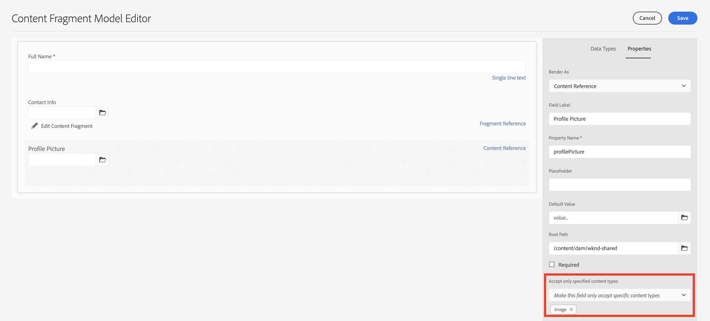
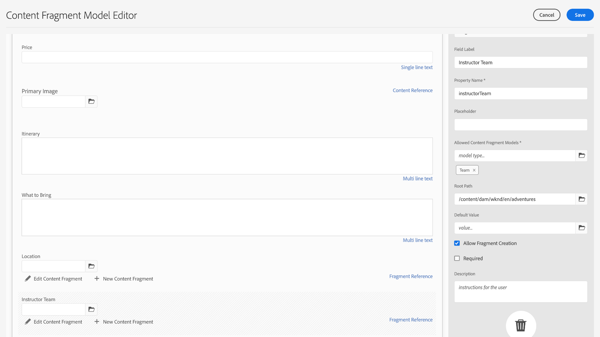

# Creare modelli di frammenti di contenuto {#create-content-fragment-models}

Questo capitolo descrive i passaggi necessari per creare cinque modelli di frammenti di contenuto:

* **Informazioni di contatto**
* **Indirizzo**
* **Persona**
* **Dove si trova**
* **Team**

I modelli di frammento di contenuto consentono di definire relazioni tra i tipi di contenuto e di mantenere relazioni come gli schemi. Utilizza i riferimenti ai frammenti nidificati, vari tipi di dati relativi al contenuto e il tipo di scheda per l’organizzazione dei contenuti visivi. Tipi di dati più avanzati, ad esempio segnaposto per schede, riferimenti a frammenti, oggetti JSON e il tipo di dati data e ora.

Questo capitolo illustra anche come migliorare le regole di convalida per i riferimenti di contenuto come le immagini.

## Prerequisiti {#prerequisites}

Questa è un&#39;esercitazione avanzata. Prima di procedere con questo capitolo, assicurati di aver completato il [configurazione rapida](../quick-setup/cloud-service.md). Assicurati di aver letto anche il precedente [panoramica](../overview.md) per ulteriori informazioni sulla configurazione dell’esercitazione avanzata.

## Obiettivi {#objectives}

* Creare modelli di frammenti di contenuto.
* Aggiungi ai modelli segnaposto, data e ora della scheda, oggetti JSON, riferimenti ai frammenti e riferimenti al contenuto.
* Aggiungi la convalida ai riferimenti di contenuto.

## Panoramica modello frammento di contenuto {#content-fragment-model-overview}

Il video seguente fornisce una breve introduzione ai modelli di frammento di contenuto e al modo in cui vengono utilizzati in questa esercitazione.

>[!VIDEO](https://video.tv.adobe.com/v/340037?quality=12&learn=on)

## Creare modelli di frammenti di contenuto {#create-models}

Creiamo alcuni modelli di frammenti di contenuto per l’app WKND. Se hai bisogno di un’introduzione di base alla creazione di modelli di frammenti di contenuto, consulta il capitolo appropriato nella sezione [esercitazione di base](../multi-step/content-fragment-models.md).

1. Passa a **Strumenti** > **Generale** > **Modelli per frammenti di contenuto**.

   

1. Seleziona **WKND condiviso** per visualizzare l’elenco dei modelli di frammento di contenuto esistenti per il sito.

### Modello informazioni contatto {#contact-info-model}

Quindi, creare un modello che contenga le informazioni di contatto per una persona o una posizione.

1. Seleziona **Crea** nell&#39;angolo in alto a destra.

1. Assegna al modello un titolo di &quot;Informazioni di contatto&quot;, quindi seleziona **Crea**. Nella finestra modale di successo visualizzata, seleziona **Apri** per modificare il modello appena creato.

1. Inizia trascinando un **Testo a riga singola** sul modello. Dagli un **Etichetta campo** di &quot;Phone&quot; nel **Proprietà** scheda . Il nome della proprietà viene compilato automaticamente come `phone`. Seleziona la casella di controllo per creare il campo **Obbligatorio**.

1. Passa a **Tipi di dati** , quindi aggiungi un altro **Testo a riga singola** campo sotto il campo &quot;Telefono&quot;. Dagli un **Etichetta campo** di &quot;Email&quot; e anche impostarlo su **Obbligatorio**.

Adobe Experience Manager include alcuni metodi di convalida incorporati. Questi metodi di convalida ti consentono di aggiungere regole di governance a campi specifici nei modelli di frammenti di contenuto. In questo caso, aggiungiamo una regola di convalida per garantire che gli utenti possano inserire solo indirizzi e-mail validi durante la compilazione di questo campo. Sotto la **Tipo di convalida** a discesa, seleziona **Posta elettronica**.

Il modello di frammento di contenuto completato deve essere simile al seguente:

Al termine, seleziona **Salva** per confermare le modifiche e chiudere l’Editor modello frammento di contenuto.

### Modello indirizzi {#address-model}

Quindi, crea un modello per un indirizzo.

1. Da **WKND condiviso**, seleziona **Crea** dall&#39;angolo in alto a destra.

1. Inserisci un titolo di &quot;Indirizzo&quot; e seleziona **Crea**. Nella finestra modale di successo visualizzata, seleziona **Apri** per modificare il modello appena creato.

1. Trascina e rilascia una **Testo a riga singola** sul modello e fornirgli un **Etichetta campo** di &quot;Street Address&quot;. Il nome della proprietà viene quindi compilato come `streetAddress`. Seleziona la **Obbligatorio** casella di controllo.

1. Ripetere i passaggi precedenti e aggiungere altri quattro campi &quot;Testo a riga singola&quot; al modello. Utilizza le seguenti etichette:

   * Città
   * Stadio
   * CAP
   * Paese

1. Seleziona **Salva** per salvare le modifiche apportate al modello Indirizzo.

   Il modello di frammento &quot;Indirizzo&quot; completato deve essere simile al seguente:
   

### Modello Persona {#person-model}

Quindi, crea un modello che contenga informazioni su una persona.

1. Nell’angolo in alto a destra, seleziona **Crea**.

1. Assegna al modello un titolo di &quot;Persona&quot;, quindi seleziona **Crea**. Nella finestra modale di successo visualizzata, seleziona **Apri** per modificare il modello appena creato.

1. Inizia trascinando un **Testo a riga singola** sul modello. Dagli un **Etichetta campo** di &quot;Nome completo&quot;. Il nome della proprietà viene compilato automaticamente come `fullName`. Seleziona la casella di controllo per creare il campo **Obbligatorio**.

   

1. I modelli per frammenti di contenuto possono essere indicati in altri modelli. Passa a **Tipi di dati** , quindi trascina e rilascia la **Riferimento frammento** campo e assegnargli un&#39;etichetta di &quot;Informazioni di contatto&quot;.

1. In **Proprietà** nella scheda **Modelli di frammenti di contenuto consentiti** , seleziona l’icona della cartella e scegli il **Informazioni contatto** modello di frammento creato in precedenza.

1. Aggiungi un **Riferimento contenuto** e fornisci un **Etichetta campo** di &quot;Immagine profilo&quot;. Seleziona l’icona della cartella sotto **Percorso radice** per aprire il modale di selezione del percorso. Selezionare un percorso principale selezionando **content** > **Risorse**, quindi selezionando la casella di controllo **WKND condiviso**. Utilizza la **Seleziona** in alto a destra per salvare il percorso. Il percorso di testo finale deve essere letto `/content/dam/wknd-shared`.

   

1. Sotto **Accetta solo tipi di contenuto specificati**, seleziona &quot;Immagine&quot;.

   

1. Per limitare le dimensioni e le dimensioni del file immagine, esaminiamo alcune opzioni di convalida per il campo di riferimento del contenuto.

   Sotto **Accetta solo le dimensioni del file specificato**, seleziona &quot;Minore o uguale a&quot; e sotto vengono visualizzati altri campi.
   

1. Per **Max**, immetti &quot;5&quot; e per **Seleziona unità**, selezionare &quot;Megabyte (MB)&quot;. Questa convalida consente di scegliere solo le immagini con la dimensione specificata.

1. Sotto **Accetta solo la larghezza dell’immagine specificata**, selezionare &quot;Larghezza massima&quot;. In **Max (pixel)** campo visualizzato, immettere &quot;10000&quot;. Seleziona le stesse opzioni per **Accettare solo un&#39;altezza immagine specificata**.

   Queste convalide garantiscono che le immagini aggiunte non superino i valori specificati. A questo punto le regole di convalida devono avere l&#39;aspetto seguente:

   

1. Aggiungi un **Testo a più righe** e fornisci un **Etichetta campo** di &quot;Biografia&quot;. Lascia la **Tipo predefinito** come opzione &quot;Rich Text&quot; predefinita.

   

1. Passa a **Tipi di dati** , quindi trascina un **Enumerazione** campo sotto &quot;Biografia&quot;. Invece del valore predefinito **Rendering come** seleziona **Elenco a discesa** e gli darai un **Etichetta campo** di &quot;Livello di esperienza istruttore&quot;. Immettere una selezione di opzioni per il livello di esperienza dell&#39;istruttore, ad esempio _Esperto, Avanzato, Intermedio_.

1. Quindi, trascina un altro **Enumerazione** in &quot;Livello esperienza istruttore&quot; e scegliere &quot;caselle di controllo&quot; sotto **Rendering come** opzione . Dagli un **Etichetta campo** di &quot;Abilità&quot;. Entra in diverse abilità come Rock Climbing, Surfing, Cycling, Sci, e Backpackaging. L’etichetta dell’opzione e il valore dell’opzione devono corrispondere come segue:

   

1. Infine, crea un’etichetta di campo &quot;Dettagli amministratore&quot; utilizzando un **Testo su più righe** campo .

Seleziona **Salva** per confermare le modifiche e chiudere l’Editor modello frammento di contenuto.

### Modello posizione {#location-model}

Il successivo modello di frammento di contenuto descrive una posizione fisica. Questo modello utilizza segnaposto a schede. I segnaposto per schede consentono di organizzare i tipi di dati nell’editor modelli e il contenuto nell’editor frammenti, rispettivamente, organizzando in categorie il contenuto. Ogni segnaposto crea una scheda, simile a una scheda in un browser Internet, nell’editor Frammento di contenuto. Il modello Posizione deve avere due schede: Dettagli della posizione e indirizzo della posizione.

1. Come in precedenza, seleziona **Crea** per creare un altro modello di frammento di contenuto. Per Titolo modello, immetti &quot;Posizione&quot;. Seleziona **Crea** seguito da **Apri** nel modale di successo visualizzato.

1. Aggiungi un **Segnaposto Tabulazione** al modello ed etichettalo &quot;Location Details&quot; (Dettagli posizione).

1. Trascina e rilascia una **Testo a riga singola** e etichettalo &quot;Name&quot;. Sotto questa etichetta di campo, aggiungi un **testo a più righe** campo ed etichetta &quot;Descrizione&quot;.

1. Quindi, aggiungi un **Riferimento frammento** campo ed etichetta &quot;Informazioni di contatto&quot;. Nella scheda delle proprietà, in **Modelli di frammenti di contenuto consentiti**, seleziona **Icona della cartella** e scegliere il modello di frammento &quot;Informazioni contatto&quot; creato in precedenza.

1. Aggiungi un **Riferimento contenuto** campo &quot;Informazioni di contatto&quot;. Etichettalo &quot;Immagine posizione&quot;. La **Percorso radice** devono `/content/dam/wknd-shared.` Sotto **Accetta solo tipi di contenuto specificati**, seleziona &quot;Immagine&quot;.

1. Aggiungiamo anche un **Oggetto JSON** sotto il campo &quot;Immagine posizione&quot;. Poiché questo tipo di dati è flessibile, può essere utilizzato per visualizzare tutti i dati che desideri includere nel contenuto. In questo caso, l’oggetto JSON viene utilizzato per visualizzare informazioni sul tempo. Etichettare l’oggetto JSON &quot;Meteo per stagione&quot;. In **Proprietà** aggiungi una scheda **Descrizione** quindi è chiaro all&#39;utente quali dati inserire qui: &quot;Dati JSON relativi alla posizione dell’evento meteo per stagione (primavera, estate, autunno, inverno).&quot;

   

1. Per creare la scheda Indirizzo posizione , aggiungi un **Segnaposto Tabulazione** sul modello e etichettarlo &quot;Location Address&quot;.

1. Trascina e rilascia una **Riferimento frammento** campo e dalla scheda proprietà, etichettarlo come &quot;Indirizzo&quot; e sotto **Modelli di frammenti di contenuto consentiti**, seleziona **Indirizzo** modello.

1. Seleziona **Salva** per confermare le modifiche e chiudere l’Editor modello frammento di contenuto. Il modello di posizione completato deve essere visualizzato come segue:

   

### Modello team {#team-model}

Infine, crea un modello che descrive un team di persone.

1. Da **WKND condiviso** pagina, seleziona **Crea** per creare un altro modello di frammento di contenuto. Per Titolo modello, immetti &quot;Team&quot;. Come in precedenza, seleziona **Crea** seguito da **Apri** nel modale di successo visualizzato.

1. Aggiungi un **Testo a più righe** al modulo. Sotto **Etichetta campo**, inserisci &quot;Descrizione&quot;.

1. Aggiungi un **Data e ora** campo al modello ed etichetta &quot;Data di fondazione del team&quot;. In questo caso, mantieni il valore predefinito **Tipo** impostato su &quot;Data&quot;, ma si noti che è anche possibile utilizzare &quot;Data e ora&quot; o &quot;Ora&quot;.

   

1. Passa a **Tipi di dati** scheda . Sotto &quot;Data di fondazione del team&quot;, aggiungi un **Riferimento frammento**. In **Rendering come** a discesa, seleziona &quot;multicampo&quot;. Per **Etichetta campo**, immetti &quot;Membri del team&quot;. Questo campo è collegato al _Persona_ modello creato in precedenza. Poiché il tipo di dati è un campo multiplo, è possibile aggiungere più frammenti Persona, consentendo la creazione di un team di persone.

   

1. Sotto **Modelli di frammenti di contenuto consentiti**, utilizza l’icona della cartella per aprire la finestra modale Seleziona percorso , quindi seleziona la **Persona** modello. Utilizza la **Seleziona** per salvare il percorso.

   

1. Seleziona **Salva** per confermare le modifiche e chiudere l’Editor modello frammento di contenuto.

## Aggiungi riferimenti a frammento al modello di avventura {#fragment-references}

Analogamente a come il modello Team dispone di un riferimento a un frammento al modello Persona, i modelli Team e Location devono essere referenziati dal modello Avventura per visualizzare questi nuovi modelli nell’app WKND.

1. Da **WKND condiviso** , seleziona la **Avventura** modello, quindi selezionare **Modifica** dalla navigazione superiore.

   

1. Nella parte inferiore del modulo, sotto &quot;Cosa portare&quot;, aggiungere un **Riferimento frammento** campo . Inserisci un **Etichetta campo** di &quot;Posizione&quot;. Sotto **Modelli di frammenti di contenuto consentiti**, seleziona **Posizione** modello.

   

1. Aggiungi un altro **Riferimento frammento** campo ed etichetta &quot;Istruttore team&quot;. Sotto **Modelli di frammenti di contenuto consentiti**, seleziona **Team** modello.

   

1. Aggiungi un altro **Riferimento frammento** campo ed etichetta &quot;Amministratore&quot;.

   

1. Seleziona **Salva** per confermare le modifiche e chiudere l’Editor modello frammento di contenuto.

## Best practice {#best-practices}

Esistono alcune best practice relative alla creazione di modelli di frammenti di contenuto:

* Crea modelli da associare ai componenti UX. Ad esempio, l’app WKND dispone di modelli di frammento di contenuto per avventure, articoli e posizione. Puoi anche aggiungere intestazioni, promozioni o liberatoria. Ciascuno di questi esempi costituisce un componente UX specifico.

* Crea il minor numero possibile di modelli. La limitazione del numero di modelli consente di ottimizzare il riutilizzo e semplificare la gestione dei contenuti.

* Nidifica i modelli di frammenti di contenuto in base alle esigenze ma solo se necessario. Ricorda che la nidificazione viene eseguita con riferimenti a frammenti o contenuti. Considera un massimo di cinque livelli di nidificazione.

## Congratulazioni.  {#congratulations}

Congratulazioni. Sono state aggiunte schede, sono stati utilizzati i tipi di dati data e ora e i tipi di dati oggetto JSON, oltre a ulteriori informazioni sui riferimenti a frammenti e contenuti. Sono state inoltre aggiunte regole di convalida dei riferimenti al contenuto.

## Passaggi successivi {#next-steps}

Il prossimo capitolo di questa serie riguarderà: [creazione di frammenti di contenuto](/help/headless-tutorial/graphql/advanced-graphql/author-content-fragments.md) dai modelli creati in questo capitolo. Scopri come utilizzare i tipi di dati introdotti in questo capitolo e creare criteri per le cartelle per limitare la creazione di modelli di frammenti di contenuto in una cartella di risorse.

Anche se è facoltativo per questa esercitazione, accertati di pubblicare tutti i contenuti in situazioni di produzione reali. Per una revisione degli ambienti Author e Publish in AEM, consulta
[Serie video AEM Headless e GraphQL](/help/headless-tutorial/graphql/video-series/author-publish-architecture.md).
