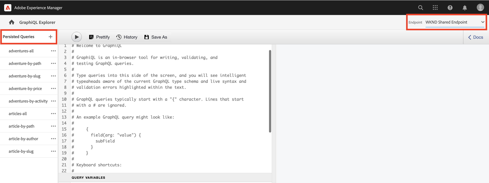

# Esplorare l’API GraphQL AEM

L’API GraphQL in AEM consente di esporre i dati dei frammenti di contenuto alle applicazioni downstream. Nell’esercitazione di base [esercitazione su GraphQL in più passaggi](../multi-step/explore-graphql-api.md), è stato utilizzato il Navigatore GraphiQL per testare e perfezionare le query GraphQL.

In questo capitolo, si utilizza Esplora risorse di GraphiQL per definire query più avanzate per raccogliere i dati dei frammenti di contenuto creati nel [capitolo precedente](../advanced-graphql/author-content-fragments.md).

## Prerequisiti {#prerequisites}

Questo documento fa parte di un tutorial in più parti. Assicurarsi che i capitoli precedenti siano stati completati prima di procedere con questo capitolo.

## Obiettivi {#objectives}

In questo capitolo viene illustrato come:

* Filtrare un elenco di frammenti di contenuto con riferimenti utilizzando variabili di query
* Filtrare il contenuto di un riferimento a un frammento
* Query per contenuti in linea e riferimenti a frammenti da un campo di testo su più righe
* Query tramite direttive
* Query per il tipo di contenuto dell’oggetto JSON

## Utilizzo di GraphiQL Explorer


La [Esplora risorse](https://experienceleague.adobe.com/docs/experience-manager-cloud-service/content/headless/graphql-api/graphiql-ide.html) lo strumento consente agli sviluppatori di creare e testare le query in base al contenuto nell’ambiente AEM corrente. Lo strumento GraphiQL consente inoltre agli utenti di **persistere o salvare** le query che devono essere utilizzate dalle applicazioni client in un&#39;impostazione di produzione.

Quindi, esplora la potenza di AEM API GraphQL utilizzando il GraphiQL Explorer integrato.

1. Dalla schermata iniziale AEM, passa a **Strumenti** > **Generale** > **Editor query GraphQL**.

   

>[!IMPORTANT]
>
>In, alcune versioni di AEM (6.X.X) lo strumento GraphiQL Explorer (aka GraphiQL IDE) deve essere installato manualmente, seguire [istruzioni da qui](../how-to/install-graphiql-aem-6-5.md).

1. Nell’angolo in alto a destra, assicurati che l’endpoint sia impostato su **Endpoint condiviso WKND**. Modifica della _Endpoint_ in questo caso, il valore del menu a discesa visualizza il valore esistente _Query persistenti_ nell&#39;angolo in alto a sinistra.

   

In questo modo tutte le query verranno estese ai modelli creati nella **WKND condiviso** progetto.


## Filtrare un elenco di frammenti di contenuto utilizzando le variabili di query

Nel precedente [esercitazione su GraphQL in più passaggi](../multi-step/explore-graphql-api.md), hai definito e utilizzato query persistenti di base per ottenere i dati dei frammenti di contenuto. In questo caso, espandi questa conoscenza e filtra i dati dei frammenti di contenuto trasmettendo le variabili alle query persistenti.

Quando si sviluppano applicazioni client, in genere è necessario filtrare i frammenti di contenuto in base ad argomenti dinamici. L’API GraphQL AEM ti consente di passare questi argomenti come variabili in una query per evitare la costruzione di stringhe sul lato client in fase di runtime. Per ulteriori informazioni sulle variabili di GraphQL, consulta la sezione [Documentazione di GraphQL](https://graphql.org/learn/queries/#variables).

Per questo esempio, eseguire una query su tutti gli istruttori che hanno una particolare abilità.

1. Nell’IDE GraphiQL, incolla la seguente query nel pannello a sinistra:

   ```graphql
   query listPersonBySkill ($skillFilter: String!){
     personList(
       _locale: "en"
       filter: {skills: {_expressions: [{value: $skillFilter}]}}
     ) {
       items {
         fullName
         contactInfo {
           phone
           email
         }
         profilePicture {
           ... on ImageRef {
             _path
           }
         }
         biography {
           plaintext
         }
         instructorExperienceLevel
         skills
       }
     }
   }
   ```

   La `listPersonBySkill` la query sopra accetta una variabile (`skillFilter`) obbligatoria `String`. Questa query esegue una ricerca per tutti i frammenti di contenuto personale e li filtra in base a `skills` e la stringa passata `skillFilter`.

   La `listPersonBySkill` include `contactInfo` proprietà, che è un riferimento a un frammento del modello Informazioni di contatto definito nei capitoli precedenti. Il modello Informazioni contatto contiene `phone` e `email` campi. Affinché la query possa essere eseguita correttamente, è necessario che almeno uno di questi campi sia presente.

   ```graphql
   contactInfo {
           phone
           email
         }
   ```

1. Poi, definiamo `skillFilter` e ottieni tutti gli istruttori che sono esperti nello sci. Incolla la seguente stringa JSON nel pannello Variabili query nell’IDE GraphiQL:

   ```json
   {
       "skillFilter": "Skiing"
   }
   ```

1. Esegui la query. Il risultato dovrebbe essere simile al seguente:

   ```json
   {
     "data": {
       "personList": {
         "items": [
           {
             "fullName": "Stacey Roswells",
             "contactInfo": {
               "phone": "209-888-0011",
               "email": "sroswells@wknd.com"
             },
             "profilePicture": {
               "_path": "/content/dam/wknd-shared/en/contributors/stacey-roswells.jpg"
             },
             "biography": {
               "plaintext": "Stacey Roswells is an accomplished rock climber and alpine adventurer. Born in Baltimore, Maryland, Stacey is the youngest of six children. Stacey's father was a lieutenant colonel in the US Navy and mother was a modern dance instructor. Stacey's family moved frequently with father's duty assignments and took the first pictures when father was stationed in Thailand. This is also where Stacey learned to rock climb."
             },
             "instructorExperienceLevel": "Advanced",
             "skills": [
               "Rock Climbing",
               "Skiing",
               "Backpacking"
             ]
           }
         ]
       }
     }
   }
   ```

Premere **Play** nel menu principale per eseguire la query. Dovresti visualizzare i risultati dei frammenti di contenuto del capitolo precedente:


## Filtrare il contenuto di un riferimento a un frammento

L’API GraphQL AEM consente di eseguire query sui frammenti di contenuto nidificati. Nel capitolo precedente, hai aggiunto tre nuovi riferimenti al frammento a un frammento di contenuto avventura: `location`, `instructorTeam`e `administrator`. Ora, filtra tutte le Avventure per qualsiasi Amministratore con un nome specifico.

>[!CAUTION]
>
>Affinché la query possa essere eseguita correttamente, è necessario consentire solo un modello come riferimento.

1. Nell’IDE GraphiQL, incolla la seguente query nel pannello a sinistra:

   ```graphql
   query getAdventureAdministratorDetailsByAdministratorName ($name: String!){
     adventureList(
     _locale: "en"
       filter: {administrator: {fullName: {_expressions: [{value: $name}]}}}
     ) {
       items {
         title
         administrator {
           fullName
           contactInfo {
             phone
             email
           }
           administratorDetails {
             json
           }
         }
       }
     }
   }
   ```

1. Quindi, incolla la seguente stringa JSON nel pannello Variabili di query :

   ```json
   {
       "name": "Jacob Wester"
   }
   ```

   La `getAdventureAdministratorDetailsByAdministratorName` query filtra tutte le avventure per qualsiasi `administrator` di `fullName` &quot;Jacob Wester&quot;, che restituisce informazioni da due frammenti di contenuto nidificati: Avventura e istruttore.

1. Esegui la query. Il risultato dovrebbe essere simile al seguente:

   ```json
   {
     "data": {
       "adventureList": {
         "items": [
           {
             "title": "Yosemite Backpacking",
             "administrator": {
               "fullName": "Jacob Wester",
               "contactInfo": {
                 "phone": "209-888-0000",
                 "email": "jwester@wknd.com"
               },
               "administratorDetails": {
                 "json": [
                   {
                     "nodeType": "paragraph",
                     "content": [
                       {
                         "nodeType": "text",
                         "value": "Jacob Wester has been coordinating backpacking adventures for three years."
                       }
                     ]
                   }
                 ]
               }
             }
           }
         ]
       }
     }
   }
   ```

## Query per riferimenti in linea da un campo di testo a più righe {#query-rte-reference}

L’API GraphQL AEM consente di eseguire query per i riferimenti a contenuti e frammenti all’interno di campi di testo a più righe. Nel capitolo precedente, hai aggiunto entrambi i tipi di riferimento nel **Descrizione** campo del frammento di contenuto del team di Yosemite. Ora, recuperiamo questi riferimenti.

1. Nell’IDE GraphiQL, incolla la seguente query nel pannello a sinistra:

   ```graphql
   query getTeamByAdventurePath ($fragmentPath: String!){
     adventureByPath (_path: $fragmentPath) {
       item {
         instructorTeam {
           _metadata {
             stringMetadata {
               name
               value
             }
         }
           teamFoundingDate
           description {
             plaintext
           }
         }
       }
       _references {
         ... on ImageRef {
           __typename
           _path
         }
         ... on LocationModel {
           __typename
           _path
           name
           address {
             streetAddress
             city
             zipCode
             country
           }
           contactInfo {
             phone
             email
           }
         }
       }
     }
   }
   ```

   La `getTeamByAdventurePath` query filtra tutte le avventure per percorso e restituisce i dati per `instructorTeam` riferimento al frammento di una specifica avventura.

   `_references` è un campo generato dal sistema che viene utilizzato per visualizzare i riferimenti, inclusi quelli inseriti nei campi di testo su più righe.

   La `getTeamByAdventurePath` query recupera più riferimenti. Innanzitutto, utilizza il `ImageRef` oggetto da recuperare `_path` e `__typename` di immagini inserite come riferimenti di contenuto nel campo di testo a più righe. Successivamente, utilizza `LocationModel` per recuperare i dati del frammento di contenuto posizione inserito nello stesso campo.

   La query include anche la `_metadata` campo . In questo modo puoi recuperare il nome del frammento di contenuto del team e visualizzarlo successivamente nell’app WKND.

1. Quindi, incolla la seguente stringa JSON nel pannello Variabili query per ottenere la Yosemite Backpackaging Avventure:

   ```json
   {
       "fragmentPath": "/content/dam/wknd-shared/en/adventures/yosemite-backpacking/yosemite-backpacking"
   }
   ```

1. Esegui la query. Il risultato dovrebbe essere simile al seguente:

   ```json
   {
     "data": {
       "adventureByPath": {
         "item": {
           "instructorTeam": {
             "_metadata": {
               "stringMetadata": [
                 {
                   "name": "title",
                   "value": "Yosemite Team"
                 },
                 {
                   "name": "description",
                   "value": ""
                 }
               ]
             },
             "teamFoundingDate": "2016-05-24",
             "description": {
               "plaintext": "\n\nThe team of professional adventurers and hiking instructors working in Yosemite National Park.\n\nYosemite Valley Lodge"
             }
           }
         },
         "_references": [
           {
             "__typename": "LocationModel",
             "_path": "/content/dam/wknd-shared/en/adventures/locations/yosemite-valley-lodge/yosemite-valley-lodge",
             "name": "Yosemite Valley Lodge",
             "address": {
               "streetAddress": "9006 Yosemite Lodge Drive",
               "city": "Yosemite National Park",
               "zipCode": "95389",
               "country": "United States"
             },
             "contactInfo": {
               "phone": "209-992-0000",
               "email": "yosemitelodge@wknd.com"
             }
           },
           {
             "__typename": "ImageRef",
             "_path": "/content/dam/wknd-shared/en/adventures/teams/yosemite-team/team-yosemite-logo.png"
           }
         ]
       }
     }
   }
   ```

   La `_references` mostra sia l&#39;immagine del logo che il frammento di contenuto del lodge Yosemite Valley inserito nel **Descrizione** campo .


## Query tramite direttive

A volte, durante lo sviluppo di applicazioni client, è necessario modificare la struttura delle query in modo condizionale. In questo caso, l’API GraphQL AEM ti consente di utilizzare le direttive GraphQL per modificare il comportamento delle query in base ai criteri specificati. Per ulteriori informazioni sulle direttive GraphQL, consulta la sezione [Documentazione di GraphQL](https://graphql.org/learn/queries/#directives).

In [sezione precedente](#query-rte-reference), hai imparato a cercare i riferimenti in linea all’interno di campi di testo a più righe. Il contenuto è stato recuperato dal `description` depositato nel `plaintext` formato. Quindi, espandiamo la query e utilizziamo una direttiva per recuperare in modo condizionale `description` in `json` anche il formato.

1. Nell’IDE GraphiQL, incolla la seguente query nel pannello a sinistra:

   ```graphql
   query getTeamByAdventurePath ($fragmentPath: String!, $includeJson: Boolean!){
     adventureByPath(_path: $fragmentPath) {
       item {
         instructorTeam {
           _metadata{
             stringMetadata{
               name
               value
             }
           }
           teamFoundingDate
           description {
             plaintext
             json @include(if: $includeJson)
           }
         }
       }
       _references {
         ... on ImageRef {
           __typename
           _path
         }
         ... on LocationModel {
           __typename
           _path
           name
           address {
             streetAddress
             city
             zipCode
             country
           }
           contactInfo {
             phone
             email
           }
         }
       }
     }
   }
   ```

   La query di cui sopra accetta un&#39;altra variabile (`includeJson`) obbligatoria `Boolean`, nota anche come direttiva della query. Una direttiva può essere utilizzata per includere i dati provenienti dal `description` nel campo `json` in base al formato booleano passato `includeJson`.

1. Quindi, incolla la seguente stringa JSON nel pannello Variabili di query :

   ```json
   {
     "fragmentPath": "/content/dam/wknd-shared/en/adventures/yosemite-backpacking/yosemite-backpacking",
     "includeJson": false
   }
   ```

1. Esegui la query. Dovresti ottenere lo stesso risultato della sezione precedente su [come eseguire query per riferimenti in linea all’interno di campi di testo a più righe](#query-rte-reference).

1. Aggiorna `includeJson` direttiva `true` ed esegui nuovamente la query. Il risultato dovrebbe essere simile al seguente:

   ```json
   {
     "data": {
       "adventureByPath": {
         "item": {
           "instructorTeam": {
             "_metadata": {
               "stringMetadata": [
                 {
                   "name": "title",
                   "value": "Yosemite Team"
                 },
                 {
                   "name": "description",
                   "value": ""
                 }
               ]
             },
             "teamFoundingDate": "2016-05-24",
             "description": {
               "plaintext": "\n\nThe team of professional adventurers and hiking instructors working in Yosemite National Park.\n\nYosemite Valley Lodge",
               "json": [
                 {
                   "nodeType": "paragraph",
                   "content": [
                     {
                       "nodeType": "reference",
                       "data": {
                         "path": "/content/dam/wknd-shared/en/adventures/teams/yosemite-team/team-yosemite-logo.png",
                         "mimetype": "image/png"
                       }
                     }
                   ]
                 },
                 {
                   "nodeType": "paragraph",
                   "content": [
                     {
                       "nodeType": "text",
                       "value": "The team of professional adventurers and hiking instructors working in Yosemite National Park."
                     }
                   ]
                 },
                 {
                   "nodeType": "paragraph",
                   "content": [
                     {
                       "nodeType": "reference",
                       "data": {
                         "href": "/content/dam/wknd-shared/en/adventures/locations/yosemite-valley-lodge/yosemite-valley-lodge",
                         "type": "fragment"
                       },
                       "value": "Yosemite Valley Lodge"
                     }
                   ]
                 }
               ]
             }
           }
         },
         "_references": [
           {
             "__typename": "LocationModel",
             "_path": "/content/dam/wknd-shared/en/adventures/locations/yosemite-valley-lodge/yosemite-valley-lodge",
             "name": "Yosemite Valley Lodge",
             "address": {
               "streetAddress": "9006 Yosemite Lodge Drive",
               "city": "Yosemite National Park",
               "zipCode": "95389",
               "country": "United States"
             },
             "contactInfo": {
               "phone": "209-992-0000",
               "email": "yosemitelodge@wknd.com"
             }
           },
           {
             "__typename": "ImageRef",
             "_path": "/content/dam/wknd-shared/en/adventures/teams/yosemite-team/team-yosemite-logo.png"
           }
         ]
       }
     }
   }
   ```

## Query per il tipo di contenuto dell’oggetto JSON

Nel capitolo precedente sull’authoring dei frammenti di contenuto, è stato aggiunto un oggetto JSON al **Meteo per stagione** campo . Ora recuperiamo tali dati all’interno del frammento di contenuto della posizione.

1. Nell’IDE GraphiQL, incolla la seguente query nel pannello a sinistra:

   ```graphql
   query getLocationDetailsByLocationPath ($fragmentPath: String!) {
     locationByPath(_path: $fragmentPath) {
       item {
         name
         description {
           json
         }
         contactInfo {
           phone
           email
         }
         locationImage {
           ... on ImageRef {
             _path
           }
         }
         weatherBySeason
         address {
           streetAddress
           city
           state
           zipCode
           country
         }
       }
     }
   }
   ```

1. Quindi, incolla la seguente stringa JSON nel pannello Variabili di query :

   ```json
   {
     "fragmentPath": "/content/dam/wknd-shared/en/adventures/locations/yosemite-national-park/yosemite-national-park"
   }
   ```

1. Esegui la query. Il risultato dovrebbe essere simile al seguente:

   ```json
   {
     "data": {
       "locationByPath": {
         "item": {
           "name": "Yosemite National Park",
           "description": {
             "json": [
               {
                 "nodeType": "paragraph",
                 "content": [
                   {
                     "nodeType": "text",
                     "value": "Yosemite National Park is in California's Sierra Nevada mountains. It's famous for its gorgeous waterfalls, giant sequoia trees, and iconic views of El Capitan and Half Dome cliffs."
                   }
                 ]
               },
               {
                 "nodeType": "paragraph",
                 "content": [
                   {
                     "nodeType": "text",
                     "value": "Hiking and camping are the best ways to experience Yosemite. Numerous trails provide endless opportunities for adventure and exploration."
                   }
                 ]
               }
             ]
           },
           "contactInfo": {
             "phone": "209-999-0000",
             "email": "yosemite@wknd.com"
           },
           "locationImage": {
             "_path": "/content/dam/wknd-shared/en/adventures/locations/yosemite-national-park/yosemite-national-park.jpeg"
           },
           "weatherBySeason": {
             "summer": "81 / 89°F",
             "fall": "56 / 83°F",
             "winter": "46 / 51°F",
             "spring": "57 / 71°F"
           },
           "address": {
             "streetAddress": "9010 Curry Village Drive",
             "city": "Yosemite Valley",
             "state": "CA",
             "zipCode": "95389",
             "country": "United States"
           }
         }
       }
     }
   }
   ```

   La `weatherBySeason` contiene l’oggetto JSON aggiunto nel capitolo precedente.

## Query per tutto il contenuto contemporaneamente

Finora sono state eseguite più query per illustrare le funzionalità dell’API GraphQL AEM.

Gli stessi dati possono essere recuperati con una sola query e questa query viene successivamente utilizzata nell&#39;applicazione client per recuperare informazioni aggiuntive come la posizione, il nome del team, i membri del team di un&#39;avventura:

```graphql
query getAdventureDetailsBySlug($slug: String!) {
  adventureList(filter: {slug: {_expressions: [{value: $slug}]}}) {
    items {
      _path
      title
      activity
      adventureType
      price
      tripLength
      groupSize
      difficulty
      primaryImage {
        ... on ImageRef {
          _path
          mimeType
          width
          height
        }
      }
      description {
        html
        json
      }
      itinerary {
        html
        json
      }
      location {
        _path
        name
        description {
          html
          json
        }
        contactInfo {
          phone
          email
        }
        locationImage {
          ... on ImageRef {
            _path
          }
        }
        weatherBySeason
        address {
          streetAddress
          city
          state
          zipCode
          country
        }
      }
      instructorTeam {
        _metadata {
          stringMetadata {
            name
            value
          }
        }
        teamFoundingDate
        description {
          json
        }
        teamMembers {
          fullName
          contactInfo {
            phone
            email
          }
          profilePicture {
            ... on ImageRef {
              _path
            }
          }
          instructorExperienceLevel
          skills
          biography {
            html
          }
        }
      }
      administrator {
        fullName
        contactInfo {
          phone
          email
        }
        biography {
          html
        }
      }
    }
    _references {
      ... on ImageRef {
        _path
        mimeType
      }
      ... on LocationModel {
        _path
        __typename
      }
    }
  }
}


# in Query Variables
{
  "slug": "yosemite-backpacking"
}
```

## Congratulazioni. 

Congratulazioni. Sono state testate query avanzate per raccogliere i dati dei frammenti di contenuto creati nel capitolo precedente.

## Passaggi successivi

In [capitolo successivo](/help/headless-tutorial/graphql/advanced-graphql/graphql-persisted-queries.md), verrà illustrato come persistere delle query GraphQL e perché è consigliabile utilizzare query persistenti nelle applicazioni.
