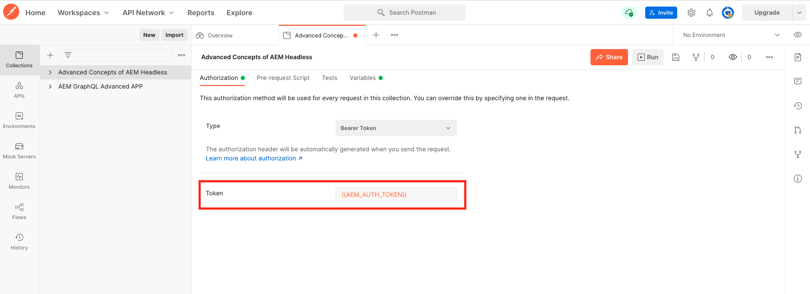

# Query GraphQL persistenti

Le query persistenti sono query memorizzate sul server Adobe Experience Manager (AEM). I client possono inviare una richiesta HTTP GET con il nome della query per eseguirla. Il vantaggio di questo approccio è la capacità di memorizzazione in cache. Anche se le query GraphQL lato client possono essere eseguite utilizzando richieste HTTP POST, che non possono essere memorizzate nella cache, le query persistenti possono essere memorizzate nella cache tramite cache HTTP o una rete CDN, migliorando le prestazioni. Le query persistenti consentono di semplificare le richieste e migliorare la sicurezza perché sono incapsulate sul server e l’amministratore AEM ha il pieno controllo su di esse. È consigliabile utilizzare query persistenti durante l’utilizzo dell’API GraphQL di AEM.

Nel capitolo precedente, hai esplorato alcune query GraphQL avanzate per raccogliere dati per l’app WKND. In questo capitolo persisterai queste query per AEM, aggiornarle e imparare a utilizzare il controllo della cache sulle query persistenti.

## Prerequisiti {#prerequisites}

Questo documento fa parte di un tutorial in più parti. Assicurarsi che i capitoli precedenti siano stati completati prima di procedere con questo capitolo.

Questa esercitazione utilizza [Postman](https://www.postman.com/) per eseguire richieste HTTP. Prima di avviare questo capitolo, assicurati di aver effettuato l&#39;iscrizione al servizio. Questa esercitazione richiede anche una buona conoscenza dell’app Postman, ad esempio come impostare una raccolta, creare variabili ed effettuare richieste. Vedi la documentazione di Postman su [creazione di richieste](https://learning.postman.com/docs/sending-requests/requests/) e [invio della prima richiesta](https://learning.postman.com/docs/getting-started/sending-the-first-request/) per maggiori dettagli su come effettuare richieste API nell’app.

In questo capitolo, le query esplorate nel capitolo precedente vengono mantenute a AEM. È possibile scaricare un file di testo con queste query GraphQL standard [qui](assets/graphql-persisted-queries/advanced-concepts-aem-headless-graphql-queries.txt) per un facile riferimento.

## Obiettivi {#objectives}

In questo capitolo, scopri come:

* Persistere le query GraphQL con i parametri
* Aggiornare le query persistenti
* Utilizzare parametri di controllo cache con query persistenti

## Panoramica sulle query persistenti

Questo video fornisce una panoramica su come persistere le query GraphQL, aggiornarle e utilizzare il controllo cache.

>[!VIDEO](https://video.tv.adobe.com/v/340036/?quality=12&learn=on)

## Abilitare le query persistenti

In primo luogo, assicurati che le query persistenti siano abilitate per il progetto WKND Site nella tua istanza AEM.

1. Passa a **Strumenti** > **Generale** > **Browser di configurazione**.

1. Seleziona **Sito WKND**, quindi seleziona **Proprietà** nella barra di navigazione superiore per aprire le proprietà di configurazione.

   

   Nella pagina Proprietà di configurazione, dovresti vedere che il **Query persistenti GraphQL** autorizzazione abilitata.

   

## Importa raccolta Postman

Per seguire più facilmente l&#39;esercitazione viene fornita una raccolta Postman. In alternativa, strumenti da riga di comando come `curl` potrebbero essere utilizzati.

1. Scarica e installa [Postman](https://www.postman.com/)
1. Scarica la [AdvancedConcetti diAEMHeadless.postman_collection.json](/help/headless-tutorial/graphql/advanced-graphql/assets/tutorial-files/AdvancedConceptsofAEMHeadless.postman_collection.json)
1. Apri l’app Postman
1. Seleziona **File** > **Importa** > **Carica file** e scegli `AdvancedConceptsofAEMHeadless.postman_collection.json` per importare la raccolta.

   

### Autenticazione

L’autenticazione è necessaria per inviare query contro un’istanza di authoring AEM. Questa esercitazione si basa sull’ambiente as a Cloud Service AEM e utilizza l’autenticazione al portatore con un token di sviluppo. Per configurare l&#39;autenticazione per la raccolta Postman, procedi come segue:

1. Per ottenere un token di sviluppo, passa alla console Cloud Developer Console e apri le **Integrazioni** e seleziona **Ottieni token di sviluppo locale**.

   

1. Nella tua raccolta Postman, passa alla **Autenticazione** e seleziona **Token portatore** in **Tipo** menu a discesa.

   

1. Immetti il token di sviluppo nel **Token** campo . Puoi passare il token attraverso una variabile, come spiegato nella sezione successiva.

   

### Variabili {#variables}

Puoi trasmettere valori come token di autenticazione e componenti URI attraverso variabili all’interno della tua raccolta Postman per semplificare il processo. Per questa esercitazione, utilizza i seguenti passaggi per creare le variabili:

1. Passa a **Variabili** all’interno della raccolta Postman e crea le seguenti variabili:

   | Variabile | Valore |
   | --- | --- |
   | `AEM_SCHEME` | `https` |
   | `AEM_AUTH_TOKEN` | (Token di sviluppo) |
   | `AEM_HOST` | (Il nome host della tua istanza AEM) |
   | `AEM_PROJECT` | `wknd` |

1. Puoi anche aggiungere variabili per ogni query persistente che desideri creare. Per questa esercitazione, persistete le seguenti query: `getAdventureAdministratorDetailsByAdministratorName`, `getTeamByAdventurePath`, `getLocationDetailsByLocationPath`, `getTeamMembersByAdventurePath`, `getLocationPathByAdventurePath`e `getTeamLocationByLocationPath`.

   Crea le seguenti variabili:

   * `AEM_GET_ADVENTURE_ADMINISTRATOR_DETAILS_BY_ADMINISTRATOR_NAME` : `adventure-administrator-details-by-administrator-name`
   * `AEM_GET_ADVENTURE_ADMINISTRATOR_DETAILS_BY_ADMINISTRATOR_NAME` : `adventure-administrator-details-by-administrator-name`
   * `AEM_GET_TEAM_LOCATION_BY_LOCATION_PATH` : `team-location-by-location-path`
   * `AEM_GET_TEAM_MEMBERS_BY_ADVENTURE_PATH` : `team-members-by-adventure-path`
   * `AEM_GET_LOCATION_DETAILS_BY_LOCATION_PATH` : `location-details-by-location-path`
   * `AEM_GET_LOCATION_PATH_BY_ADVENTURE_PATH` : `location-path-by-adventure-path`
   * `AEM_GET_TEAM_BY_ADVENTURE_PATH` : `team-by-adventure-path`

   Una volta completato, il **Variabili** La scheda della tua raccolta Postman deve essere simile alla seguente:

   

## Persistere le query GraphQL con i parametri

In [Serie video AEM Headless e GraphQL](../video-series/graphql-persisted-queries.md), hai imparato a creare query GraphQL persistenti. In questa sezione persistiamo ed eseguiamo una query GraphQL con un parametro.

### Creare una query persistente {#create-persisted-query}

Per questo esempio, persistiamo il `getAdventureAdministratorDetailsByAdministratorName` query creata nel capitolo precedente.

>[!NOTE]
>
>Il metodo HTTP PUT viene utilizzato per creare una query persistente e per aggiornarla viene utilizzato il metodo HTTP POST.

1. Per prima cosa, aggiungi una nuova richiesta all’interno della tua raccolta Postman. Selezionare il metodo HTTP PUT per creare una query persistente e utilizzare il seguente URI di richiesta:

   ```plaintext
   {{AEM_SCHEME}}://{{AEM_HOST}}/graphql/persist.json/{{AEM_PROJECT}}/{{AEM_GET_ADVENTURE_ADMINISTRATOR_DETAILS_BY_ADMINISTRATOR_NAME}}
   ```

   L’URI utilizza la variabile `/graphql/persist.json` azione.

1. Incolla `getAdventureAdministratorDetailsByAdministratorName` Query GraphQL nel corpo della richiesta. Si tratta della query GraphQL standard con una variabile `name` che richiede un `String`.

   

1. Esegui la richiesta. Dovresti ricevere la seguente risposta:

   

   Creazione di una query persistente denominata completata `adventure-administrator-details-by-administrator-name`.

### Esegui una query persistente

Esegui la query persistente creata.

1. Crea una nuova richiesta GET all&#39;interno della raccolta Postman utilizzando il seguente URI di richiesta:

   ```plaintext
   {{AEM_SCHEME}}://{{AEM_HOST}}/graphql/execute.json/{{AEM_PROJECT}}/{{AEM_GET_ADVENTURE_ADMINISTRATOR_DETAILS_BY_ADMINISTRATOR_NAME}}
   ```

   L’URI della richiesta ora include la variabile `execute.json` azione.

   Se esegui questa richiesta così com’è, viene generato un errore perché la query richiede una variabile `name`. È necessario passare questa variabile come parametro nell’URI della richiesta.

   

1. Quindi, recupera un amministratore con il nome Jacob Wester. I parametri per le query GraphQL persistenti devono essere separati dai componenti URI precedenti da `;` e codificato prima di trasmetterli nell’URI della richiesta. Nella console del browser esegui il seguente comando:

   ```js
   encodeURIComponent(";name=Jacob Wester")
   ```

   

1. Copia il risultato dalla console e incollalo alla fine dell’URI della richiesta in Postman. È necessario disporre del seguente URI di richiesta:

   ```plaintext
   {{AEM_SCHEME}}://{{AEM_HOST}}/graphql/execute.json/{{AEM_PROJECT}}/{{AEM_GET_ADVENTURE_ADMINISTRATOR_DETAILS_BY_ADMINISTRATOR_NAME}}%3Bname%3DJacob%20Wester
   ```

1. Esegui la richiesta GET. Dovresti ricevere la seguente risposta:

   

Ora hai creato ed eseguito una query GraphQL persistente con un parametro .

Puoi seguire i passaggi descritti in precedenza per persistere le altre query GraphQL dalla [file di testo](assets/graphql-persisted-queries/advanced-concepts-aem-headless-graphql-queries.txt) utilizzando le variabili create in [inizio del presente capitolo](#variables).

Il pieno [Collezione Postman](/help/headless-tutorial/graphql/advanced-graphql/assets/tutorial-files/AdvancedConceptsofAEMHeadless.postman_collection.json) è disponibile anche per il download e l’importazione.

## Aggiornare le query persistenti

Mentre le query persistenti vengono create utilizzando una richiesta di PUT, è necessario utilizzare una richiesta di POST per aggiornare una query persistente esistente. Per questa esercitazione, aggiorniamo la query persistente denominata `adventure-administrator-details-by-administrator-name` creato in [sezione precedente](#create-persisted-query).

1. Duplica la scheda utilizzata per la richiesta PUT nella sezione precedente. Nella copia, modifica il metodo HTTP in POST.

1. Nella query GraphQL, rimuoviamo il `plaintext` dal formato `administratorDetails` campo .

   

1. Esegui la richiesta. Dovresti ricevere la seguente risposta:

   

È stato aggiornato il `adventure-administrator-details-by-administrator-name` query persistente. È importante aggiornare sempre le query GraphQL in AEM se vengono apportate modifiche.

## Trasmettere i parametri di controllo cache nelle query persistenti {#cache-control-all-adventures}

L’API GraphQL AEM ti consente di aggiungere parametri di controllo della cache alle query per migliorare le prestazioni.

Utilizza la `getAllAdventureDetails` query creata nel capitolo precedente. La risposta alla query è grande ed è utile controllarne la `age` nella cache.

Questa query persistente viene utilizzata in seguito per aggiornare la [applicazione client](/help/headless-tutorial/graphql/advanced-graphql/client-application-integration.md).

1. Nella tua raccolta Postman, crea una nuova variabile:

   ```plaintext
   AEM_GET_ALL_AT_ONCE: all-adventure-details
   ```

1. Crea una nuova richiesta PUT per mantenere questa query.

1. In **Corpo** scheda della richiesta, seleziona la **grezzo** tipo di dati.

   

1. Per utilizzare il controllo della cache in una query, è necessario racchiudere la query in una struttura JSON e aggiungere parametri di controllo della cache alla fine. Copia e incolla la seguente query nel corpo della richiesta:

   ```json
   {
   "query": " query getAllAdventureDetails($fragmentPath: String!) { adventureByPath(_path: $fragmentPath){ item { _path adventureTitle adventureActivity adventureType adventurePrice adventureTripLength adventureGroupSize adventureDifficulty adventurePrice adventurePrimaryImage{ ...on ImageRef{ _path mimeType width height } } adventureDescription { html json } adventureItinerary { html json } location { _path name description { html json } contactInfo{ phone email } locationImage{ ...on ImageRef{ _path } } weatherBySeason address{ streetAddress city state zipCode country } } instructorTeam { _metadata{ stringMetadata{ name value } } teamFoundingDate description { json } teamMembers { fullName contactInfo { phone email } profilePicture{ ...on ImageRef { _path } } instructorExperienceLevel skills biography { html } } } administrator { fullName contactInfo { phone email } biography { html } } } _references { ...on ImageRef { _path mimeType } ...on LocationModel { _path __typename } } } }", 
   "cache-control": { "max-age": 300 }
   }
   ```

   >[!CAUTION]
   >
   >La query racchiusa non deve contenere interruzioni di riga.

   A questo punto la tua richiesta dovrebbe avere un aspetto simile al seguente:

   

1. Esegui la richiesta. Dovresti ricevere la risposta che indica che la `all-adventure-details` creazione della query persistente completata.

   

## Congratulazioni!

Congratulazioni! Ora hai imparato a mantenere le query GraphQL con parametri, aggiornare le query persistenti e utilizzare i parametri di controllo della cache con query persistenti.

## Passaggi successivi

In [capitolo successivo](/help/headless-tutorial/graphql/advanced-graphql/client-application-integration.md), implementerai le richieste per le query persistenti nell’app WKND.

Anche se è facoltativo per questa esercitazione, accertati di pubblicare tutti i contenuti in situazioni di produzione reali. Per una revisione degli ambienti Author e Publish in AEM, consulta [Serie video AEM Headless e GraphQL](../video-series/author-publish-architecture.md).