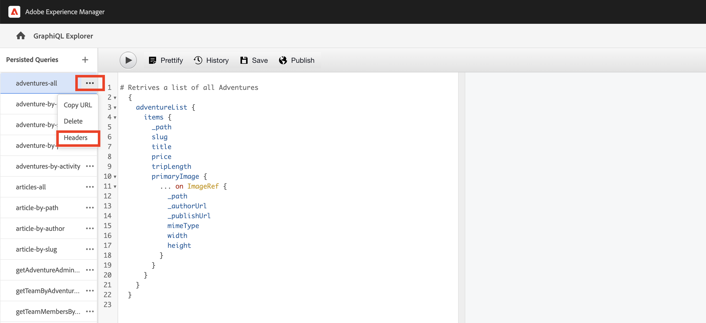

# Query GraphQL persistenti

Le query persistenti sono query memorizzate nel server Adobe Experience Manager (AEM). I client possono inviare una richiesta HTTP GET con il nome della query per eseguirla. Il vantaggio di questo approccio è la possibilità di memorizzazione in cache. Mentre le query GraphQL lato client possono essere eseguite anche utilizzando richieste HTTP POST, che non possono essere memorizzate nella cache, le query persistenti possono essere memorizzate nella cache da cache HTTP o da una rete CDN, migliorando le prestazioni. Le query persistenti consentono di semplificare le richieste e migliorare la sicurezza, in quanto sono incapsulate nel server e l’amministratore AEM ne ha il pieno controllo. È **best practice e vivamente consigliati** per utilizzare le query persistenti quando si lavora con l’API GraphQL dell’AEM.

Nel capitolo precedente, hai esplorato alcune query GraphQL avanzate per raccogliere dati per l’app WKND. In questo capitolo, rendi le query persistenti a AEM e scopri come utilizzare il controllo della cache sulle query persistenti.

## Prerequisiti {#prerequisites}

Questo documento fa parte di un&#39;esercitazione in più parti. Assicurati che il [capitolo precedente](explore-graphql-api.md) è stato completato prima di procedere con questo capitolo.

## Obiettivi {#objectives}

In questo capitolo, scopri come:

* Mantenere le query GraphQL con i parametri
* Utilizzare parametri di controllo cache con query persistenti

## Revisione _Query persistenti GraphQL_ configurazione

Vediamo un po&#39; _Query persistenti GraphQL_ sono abilitati per il progetto del sito WKND nell’istanza AEM.

1. Accedi a **Strumenti** > **Generale** > **Browser configurazioni**.

1. Seleziona **WKND condiviso**, quindi seleziona **Proprietà** nella barra di navigazione superiore per aprire le proprietà di configurazione. Nella pagina Proprietà di configurazione, dovresti notare che il **Query persistenti GraphQL** autorizzazione abilitata.

   

## Mantenere le query GraphQL utilizzando lo strumento GraphiQL Explorer incorporato

In questa sezione, rendiamo persistente la query GraphQL che viene successivamente utilizzata nell’applicazione client per recuperare ed eseguire il rendering dei dati dei frammenti di contenuto Adventure.

1. Immetti la seguente query in GraphiQL Explorer:

   ```graphql
   query getAdventureDetailsBySlug($slug: String!) {
   adventureList(filter: {slug: {_expressions: [{value: $slug}]}}) {
       items {
       _path
       title
       activity
       adventureType
       price
       tripLength
       groupSize
       difficulty
       primaryImage {
           ... on ImageRef {
           _path
           mimeType
           width
           height
           }
       }
       description {
           html
           json
       }
       itinerary {
           html
           json
       }
       location {
           _path
           name
           description {
           html
           json
           }
           contactInfo {
           phone
           email
           }
           locationImage {
           ... on ImageRef {
               _path
           }
           }
           weatherBySeason
           address {
           streetAddress
           city
           state
           zipCode
           country
           }
       }
       instructorTeam {
           _metadata {
           stringMetadata {
               name
               value
           }
           }
           teamFoundingDate
           description {
           json
           }
           teamMembers {
           fullName
           contactInfo {
               phone
               email
           }
           profilePicture {
               ... on ImageRef {
               _path
               }
           }
           instructorExperienceLevel
           skills
           biography {
               html
           }
           }
       }
       administrator {
           fullName
           contactInfo {
           phone
           email
           }
           biography {
           html
           }
       }
       }
       _references {
       ... on ImageRef {
           _path
           mimeType
       }
       ... on LocationModel {
           _path
           __typename
       }
       }
   }
   }
   ```

   Verifica che la query funzioni prima di salvarla.

1. Tocca Avanti Salva con nome e immetti `adventure-details-by-slug` come Nome query.

   

## Esecuzione di query persistenti con variabili tramite codifica di caratteri speciali

Comprendiamo in che modo le query persistenti con variabili vengono eseguite dall’applicazione lato client codificando i caratteri speciali.

Per eseguire una query persistente, l’applicazione client effettua una richiesta di GET utilizzando la seguente sintassi:

```
GET <AEM_HOST>/graphql/execute.json/<Project-Config-Name>/<Persisted-Query-Name>
```

Per eseguire una query persistente _con una variabile_, la sintassi precedente diventa:

```
GET <AEM_HOST>/graphql/execute.json/<Project-Config-Name>/<Persisted-Query-Name>;variable1=value1;variable2=value2
```

I caratteri speciali come punto e virgola (;), segno di uguale (=), barre (/) e spazio devono essere convertiti per utilizzare la codifica UTF-8 corrispondente.

Eseguendo la `getAllAdventureDetailsBySlug` query dal terminale della riga di comando, esaminiamo questi concetti in azione.

1. Apri GraphiQL Explorer e fai clic sul pulsante **ellissi** (...) accanto alla query persistente `getAllAdventureDetailsBySlug`, quindi fai clic su **Copia URL**. Incolla l’URL copiato in un riquadro di testo, come illustrato di seguito:

   ```code
       http://<AEM_HOST>/graphql/execute.json/wknd-shared/getAllAdventureDetailsBySlug;slug=
   ```

1. Aggiungi `yosemite-backpacking` come valore variabile

   ```code
       http://<AEM_HOST>/graphql/execute.json/wknd-shared/getAllAdventureDetailsBySlug;slug=yosemite-backpacking
   ```

1. Codificare i punti e virgola (;) e il segno di uguale (=) caratteri speciali

   ```code
       http://<AEM_HOST>/graphql/execute.json/wknd-shared/getAllAdventureDetailsBySlug%3Bslug%3Dyosemite-backpacking
   ```

1. Apri un terminale della riga di comando e utilizza [Curl](https://curl.se/) eseguire la query

   ```shell
   $ curl -X GET http://<AEM_HOST>/graphql/execute.json/wknd-shared/getAllAdventureDetailsBySlug%3Bslug%3Dyosemite-backpacking
   ```

>[!TIP]
>
>    Se esegui la query di cui sopra nell’ambiente di authoring AEM, devi inviare le credenziali. Consulta [Token di accesso per lo sviluppo locale](https://experienceleague.adobe.com/docs/experience-manager-learn/getting-started-with-aem-headless/authentication/local-development-access-token.html) per dimostrarlo e [Chiamata dell&#39;API AEM](https://experienceleague.adobe.com/docs/experience-manager-cloud-service/content/implementing/developing/generating-access-tokens-for-server-side-apis.html#calling-the-aem-api) per informazioni dettagliate sulla documentazione.

Inoltre, rivedi [Eseguire una query persistente](https://experienceleague.adobe.com/docs/experience-manager-cloud-service/content/headless/graphql-api/persisted-queries.html#execute-persisted-query), [Utilizzo delle variabili di query](https://experienceleague.adobe.com/docs/experience-manager-cloud-service/content/headless/graphql-api/persisted-queries.html#query-variables), e [Codifica dell’URL della query per l’utilizzo da parte di un’app](https://experienceleague.adobe.com/docs/experience-manager-cloud-service/content/headless/graphql-api/persisted-queries.html#encoding-query-url) per apprendere l’esecuzione di query persistenti da parte delle applicazioni client.

## Aggiornamento dei parametri di controllo cache nelle query persistenti {#cache-control-all-adventures}

L’API GraphQL dell’AEM ti consente di aggiornare i parametri predefiniti di controllo cache alle query per migliorare le prestazioni. I valori predefiniti per il controllo della cache sono:

* 60 secondi è il valore TTL predefinito (maxage=60) per il client (ad esempio, un browser)

* 7200 secondi, TTL predefinito (s-maxage=7200) per Dispatcher e CDN, o cache condivise

Utilizza il `adventures-all` per aggiornare i parametri di controllo cache. La risposta alla query è grande ed è utile controllarne la `age` nella cache. Questa query persistente viene utilizzata in seguito per aggiornare [applicazione client](/help/headless-tutorial/graphql/advanced-graphql/client-application-integration.md).

1. Apri GraphiQL Explorer e fai clic sul pulsante **ellissi** (...) accanto alla query persistente, quindi fai clic su **Intestazioni** per aprire **Configurazione cache** modale.

   


1. In **Configurazione cache** modale, aggiorna il `max-age` valore intestazione a `600 `secondi (10 minuti), quindi fai clic su **Salva**

   


Revisione [Memorizzazione in cache delle query persistenti](https://experienceleague.adobe.com/docs/experience-manager-cloud-service/content/headless/graphql-api/persisted-queries.html#caching-persisted-queries) per ulteriori informazioni sui parametri di controllo cache predefiniti.


## Congratulazioni.

Congratulazioni. Ora hai imparato a rendere persistenti le query GraphQL con parametri, aggiornare le query persistenti e utilizzare parametri di controllo cache con le query persistenti.

## Passaggi successivi

In [capitolo successivo](/help/headless-tutorial/graphql/advanced-graphql/client-application-integration.md), implementerai le richieste di query persistenti nell’app WKND.
