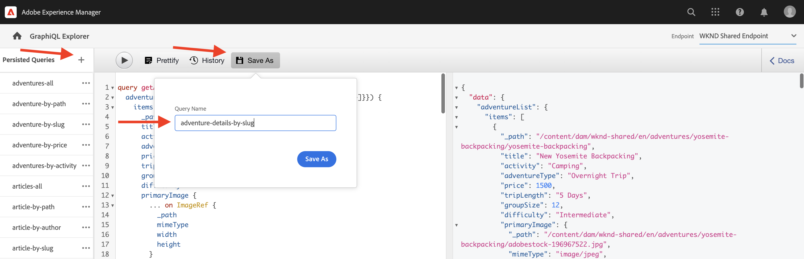

# Query GraphQL persistenti

Le query persistenti sono query memorizzate sul server Adobe Experience Manager (AEM). I client possono inviare una richiesta HTTP GET con il nome della query per eseguirla. Il vantaggio di questo approccio è la capacità di memorizzazione in cache. Anche se le query GraphQL lato client possono essere eseguite utilizzando richieste HTTP POST, che non possono essere memorizzate nella cache, le query persistenti possono essere memorizzate nella cache tramite cache HTTP o una rete CDN, migliorando le prestazioni. Le query persistenti consentono di semplificare le richieste e migliorare la sicurezza perché sono incapsulate sul server e l’amministratore AEM ha il pieno controllo su di esse. È **best practice e altamente raccomandati** per utilizzare query persistenti quando si lavora con l’API GraphQL AEM.

Nel capitolo precedente, hai esplorato alcune query GraphQL avanzate per raccogliere dati per l’app WKND. In questo capitolo, persistete le query da AEM e imparerete a utilizzare il controllo della cache sulle query persistenti.

## Prerequisiti {#prerequisites}

Questo documento fa parte di un tutorial in più parti. Assicurati che [capitolo precedente](explore-graphql-api.md) è stato completato prima di procedere con il presente capitolo.

## Obiettivi {#objectives}

In questo capitolo, scopri come:

* Persistere le query GraphQL con i parametri
* Utilizzare parametri di controllo cache con query persistenti

## Revisione _Query persistenti GraphQL_ impostazione di configurazione

Rivediamolo _Query persistenti GraphQL_ sono abilitate per il progetto WKND Site nell’istanza AEM.

1. Passa a **Strumenti** > **Generale** > **Browser di configurazione**.

1. Seleziona **WKND condiviso**, quindi seleziona **Proprietà** nella barra di navigazione superiore per aprire le proprietà di configurazione. Nella pagina Proprietà di configurazione, dovresti vedere che il **Query persistenti GraphQL** autorizzazione abilitata.

   

## Persistere le query GraphQL utilizzando lo strumento di compilazione GraphiQL Explorer

In questa sezione persistiamo la query GraphQL che viene successivamente utilizzata nell’applicazione client per recuperare ed eseguire il rendering dei dati del frammento di contenuto avventura.

1. Inserisci la seguente query in Esplora risorse:

   ```graphql
   query getAdventureDetailsBySlug($slug: String!) {
   adventureList(filter: {slug: {_expressions: [{value: $slug}]}}) {
       items {
       _path
       title
       activity
       adventureType
       price
       tripLength
       groupSize
       difficulty
       primaryImage {
           ... on ImageRef {
           _path
           mimeType
           width
           height
           }
       }
       description {
           html
           json
       }
       itinerary {
           html
           json
       }
       location {
           _path
           name
           description {
           html
           json
           }
           contactInfo {
           phone
           email
           }
           locationImage {
           ... on ImageRef {
               _path
           }
           }
           weatherBySeason
           address {
           streetAddress
           city
           state
           zipCode
           country
           }
       }
       instructorTeam {
           _metadata {
           stringMetadata {
               name
               value
           }
           }
           teamFoundingDate
           description {
           json
           }
           teamMembers {
           fullName
           contactInfo {
               phone
               email
           }
           profilePicture {
               ... on ImageRef {
               _path
               }
           }
           instructorExperienceLevel
           skills
           biography {
               html
           }
           }
       }
       administrator {
           fullName
           contactInfo {
           phone
           email
           }
           biography {
           html
           }
       }
       }
       _references {
       ... on ImageRef {
           _path
           mimeType
       }
       ... on LocationModel {
           _path
           __typename
       }
       }
   }
   }
   ```

   Verifica che la query funzioni prima di salvarla.

1. Tocca Salva con nome e immetti `adventure-details-by-slug` come Nome query.

   

## Esecuzione di query persistenti con variabili mediante codifica di caratteri speciali

Comprendiamo in che modo le query persistenti con variabili vengono eseguite dall’applicazione lato client codificando i caratteri speciali.

Per eseguire una query persistente, l&#39;applicazione client effettua una richiesta GET utilizzando la seguente sintassi:

```
GET <AEM_HOST>/graphql/execute.json/<Project-Config-Name>/<Persisted-Query-Name>
```

Per eseguire una query persistente _con una variabile_, la sintassi di cui sopra diventa:

```
GET <AEM_HOST>/graphql/execute.json/<Project-Config-Name>/<Persisted-Query-Name>;variable1=value1;variable2=value2
```

Per utilizzare la codifica UTF-8 corrispondente, è necessario convertire i caratteri speciali come punto e virgola (;), segno uguale (=), barre (/) e spazio.

Attivando la `getAllAdventureDetailsBySlug` dal terminale della riga di comando, esaminiamo questi concetti in azione.

1. Apri Esplora risorse e fai clic sul pulsante **ellissi** (...) accanto alla query persistente `getAllAdventureDetailsBySlug`, quindi fai clic su **Copia URL**. Incolla l’URL copiato in un riquadro di testo, come illustrato di seguito:

   ```code
       http://<AEM_HOST>/graphql/execute.json/wknd-shared/getAllAdventureDetailsBySlug;slug=
   ```

1. Aggiungi `yosemite-backpacking` come valore variabile

   ```code
       http://<AEM_HOST>/graphql/execute.json/wknd-shared/getAllAdventureDetailsBySlug;slug=yosemite-backpacking
   ```

1. Codificare i caratteri speciali punto e virgola (;) e segno uguale (=)

   ```code
       http://<AEM_HOST>/graphql/execute.json/wknd-shared/getAllAdventureDetailsBySlug%3Bslug%3Dyosemite-backpacking
   ```

1. Aprire un terminale della riga di comando e utilizzare [Curl](https://curl.se/) eseguire la query

   ```shell
   $ curl -X GET http://<AEM_HOST>/graphql/execute.json/wknd-shared/getAllAdventureDetailsBySlug%3Bslug%3Dyosemite-backpacking
   ```

>[!TIP]
>
>    Se esegui la query di cui sopra sull’ambiente di authoring di AEM, devi inviare le credenziali. Vedi [Token di accesso per lo sviluppo locale](https://experienceleague.adobe.com/docs/experience-manager-learn/getting-started-with-aem-headless/authentication/local-development-access-token.html) per dimostrarlo e [Chiamata dell&#39;API AEM](https://experienceleague.adobe.com/docs/experience-manager-cloud-service/content/implementing/developing/generating-access-tokens-for-server-side-apis.html#calling-the-aem-api) per i dettagli della documentazione.

Inoltre, la revisione [Come eseguire una query persistente](https://experienceleague.adobe.com/docs/experience-manager-cloud-service/content/headless/graphql-api/persisted-queries.html#execute-persisted-query), [Utilizzo delle variabili di query](https://experienceleague.adobe.com/docs/experience-manager-cloud-service/content/headless/graphql-api/persisted-queries.html#query-variables)e [Codifica dell’URL della query per l’utilizzo da parte di un’app](https://experienceleague.adobe.com/docs/experience-manager-cloud-service/content/headless/graphql-api/persisted-queries.html#encoding-query-url) per conoscere l’esecuzione persistente delle query da parte delle applicazioni client.

## Aggiorna i parametri di controllo della cache nelle query persistenti {#cache-control-all-adventures}

L’API GraphQL AEM ti consente di aggiornare i parametri predefiniti di controllo della cache alle query per migliorare le prestazioni. I valori predefiniti del controllo della cache sono:

* 60 secondi è il TTL predefinito (maxage=60) per il client (ad esempio, un browser)

* 7200 secondi è il TTL predefinito (s-maxage=7200) per il Dispatcher e il CDN; anche noto come cache condivise

Utilizza la `adventures-all` per aggiornare i parametri di controllo cache. La risposta alla query è grande ed è utile controllarne la `age` nella cache. Questa query persistente viene utilizzata in seguito per aggiornare la [applicazione client](/help/headless-tutorial/graphql/advanced-graphql/client-application-integration.md).

1. Apri Esplora risorse e fai clic sul pulsante **ellissi** (...) accanto alla query persistente, quindi fai clic su **Intestazioni** aprire **Configurazione cache** modale.

   


1. In **Configurazione cache** modale, aggiorna `max-age` valore di intestazione in `600 `secondi (10 minuti), quindi fai clic su **Salva**

   


Revisione [Memorizzazione in cache delle query persistenti](https://experienceleague.adobe.com/docs/experience-manager-cloud-service/content/headless/graphql-api/persisted-queries.html#caching-persisted-queries) per ulteriori informazioni sui parametri di controllo cache predefiniti.


## Congratulazioni. 

Congratulazioni. Ora hai imparato a mantenere le query GraphQL con parametri, aggiornare le query persistenti e utilizzare i parametri di controllo della cache con query persistenti.

## Passaggi successivi

In [capitolo successivo](/help/headless-tutorial/graphql/advanced-graphql/client-application-integration.md), implementerai le richieste per le query persistenti nell’app WKND.
