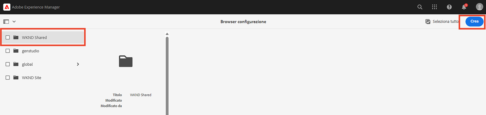
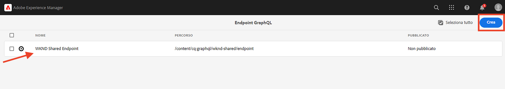

# Concetti avanzati di AEM headless

Questo tutorial completo continua [esercitazione di base](../multi-step/overview.md) che tratta le nozioni di base di Adobe Experience Manager (AEM) Headless e GraphQL. Il tutorial avanzato illustra gli aspetti approfonditi dell’utilizzo dei modelli per frammenti di contenuto, dei frammenti di contenuto e delle query persistenti GraphQL dell’AEM, incluso l’utilizzo delle query persistenti GraphQL in un’applicazione client.

## Prerequisiti

Completa il [configurazione rapida per AEM as a Cloud Service](../quick-setup/cloud-service.md) per configurare l’ambiente AEM as a Cloud Service.

Si consiglia vivamente di completare il [esercitazione di base](../multi-step/overview.md) e [serie video](../video-series/modeling-basics.md) prima di procedere con questa esercitazione avanzata. Sebbene sia possibile completare l&#39;esercitazione utilizzando un ambiente AEM locale, questa esercitazione riguarda solo il flusso di lavoro per AEM as a Cloud Service.

>[!CAUTION]
>
>Se non hai accesso all’ambiente AEM as a Cloud Service, puoi completare [Configurazione rapida AEM Headless tramite l’SDK locale](https://experienceleague.adobe.com/docs/experience-manager-learn/getting-started-with-aem-headless/graphql/quick-setup/local-sdk.html). Tuttavia, è importante notare che alcune pagine dell’interfaccia utente del prodotto, come la navigazione per frammenti di contenuto, sono diverse.

## Obiettivi

Questo tutorial tratta i seguenti argomenti:

* Crea modelli per frammenti di contenuto utilizzando le regole di convalida e tipi di dati più avanzati, ad esempio Segnaposto scheda, riferimenti a frammenti nidificati, oggetti JSON e tipi di dati Data e ora.
* Creare frammenti di contenuto quando si lavora con contenuti nidificati e riferimenti a frammenti e configurare criteri di cartella per la governance dell’authoring dei frammenti di contenuto.
* Esplora le funzionalità API GraphQL dell’AEM utilizzando le query GraphQL con variabili e direttive.
* Mantenere le query GraphQL con i parametri nell’AEM e imparare a utilizzare i parametri di controllo cache con le query persistenti.
* Integra le richieste di query persistenti nell’app WKND GraphQL React di esempio utilizzando l’SDK JavaScript headless dell’AEM.

## Panoramica sui concetti avanzati di AEM headless

Il video seguente offre una panoramica di alto livello dei concetti descritti in questa esercitazione. Il tutorial include la definizione di modelli per frammenti di contenuto con tipi di dati più avanzati, la nidificazione di frammenti di contenuto e le query GraphQL persistenti nell’AEM.

>[!VIDEO](https://video.tv.adobe.com/v/340035?quality=12&learn=on)

>[!CAUTION]
>
>Questo video (al minuto 2:25) parla dell’installazione dell’editor di query GraphiQL tramite Gestione pacchetti per esplorare le query GraphQL. Tuttavia, nelle versioni più recenti dell’AEM come Cloud Service di **GraphiQL Explorer** viene fornito, pertanto l’installazione del pacchetto non è necessaria. Consulta [Utilizzo dell’IDE GraphiQL](https://experienceleague.adobe.com/docs/experience-manager-cloud-service/content/headless/graphql-api/graphiql-ide.html) per ulteriori informazioni.

## Configurazione del progetto

Il progetto del sito WKND dispone di tutte le configurazioni necessarie, pertanto puoi avviare l’esercitazione subito dopo aver completato [configurazione rapida](../quick-setup/cloud-service.md). In questa sezione vengono evidenziati solo alcuni passaggi importanti che puoi utilizzare per creare un tuo progetto AEM headless.

### Verifica configurazione esistente

Il primo passo per avviare un nuovo progetto in AEM è la creazione della relativa configurazione, come area di lavoro e per creare endpoint API GraphQL. Per rivedere o creare una configurazione, vai a **Strumenti** > **Generale** > **Browser configurazioni**.

Osserva che il `WKND Shared` la configurazione del sito è già stata creata per l&#39;esercitazione. Per creare una configurazione per il tuo progetto, seleziona **Crea** nell’angolo in alto a destra e completa il modulo nella finestra modale Crea configurazione che viene visualizzata.

### Rivedi endpoint API GraphQL

Successivamente, devi configurare gli endpoint API a cui inviare le query GraphQL. Per esaminare gli endpoint esistenti o crearne uno, passare a **Strumenti** > **Generale** > **GraphQL**.

Osserva che il `WKND Shared Endpoint` è già stato creato. Per creare un endpoint per il progetto, seleziona **Crea** nell’angolo in alto a destra e segui il flusso di lavoro.

>[!NOTE]
>
> Dopo aver salvato l’endpoint, viene visualizzata una finestra modale per la visita alla console Sicurezza, che consente di regolare le impostazioni di sicurezza se si desidera configurare l’accesso all’endpoint. Tuttavia, le autorizzazioni di sicurezza stesse non rientrano nell’ambito di questa esercitazione. Per ulteriori informazioni, consulta [Documentazione AEM](https://experienceleague.adobe.com/docs/experience-manager-65/administering/security/security.html?lang=it).

### Rivedi la struttura del contenuto WKND e la cartella principale della lingua

Una struttura dei contenuti ben definita è fondamentale per il successo dell’implementazione headless dell’AEM. È utile per la scalabilità, l’usabilità e la gestione delle autorizzazioni dei contenuti.

Una cartella principale della lingua è una cartella il cui nome contiene un codice della lingua ISO, ad esempio EN o FR. Il sistema di gestione della traduzione AEM utilizza queste cartelle per definire la lingua principale dei contenuti e le lingue per la traduzione dei contenuti.

Vai a **Navigazione** > **Risorse** > **File**.

Accedi a **WKND condiviso** cartella. Osserva la cartella con il titolo &quot;English&quot; e il nome &quot;EN&quot;. Questa cartella è la cartella principale della lingua per il progetto del sito WKND.

Per il tuo progetto, crea una cartella principale della lingua all’interno della configurazione. Consulta la sezione su [creazione di cartelle](/help/headless-tutorial/graphql/advanced-graphql/author-content-fragments.md#create-folders) per ulteriori dettagli.

### Assegnare una configurazione alla cartella nidificata

Infine, devi assegnare la configurazione del progetto alla cartella principale della lingua. Questa assegnazione consente di creare frammenti di contenuto basati su modelli per frammenti di contenuto definiti nella configurazione del progetto.

Per assegnare la cartella principale della lingua alla configurazione, seleziona la cartella, quindi seleziona **Proprietà** nella barra di navigazione superiore.

Quindi, passa a **Cloud Services** e seleziona l’icona della cartella in **Configurazione cloud** campo.

Nella finestra modale visualizzata, seleziona la configurazione creata in precedenza per assegnarvi la cartella principale della lingua.

### Best practice

Di seguito sono riportate le best practice da seguire per creare un progetto personalizzato in AEM:

* La gerarchia delle cartelle deve essere modellata tenendo presente la localizzazione e la traduzione. In altre parole, le cartelle delle lingue devono essere nidificate all’interno delle cartelle di configurazione, il che consente di tradurre facilmente il contenuto all’interno di tali cartelle.
* La gerarchia delle cartelle deve essere semplice e lineare. Evita di spostare o rinominare cartelle e frammenti in un secondo momento, soprattutto dopo la pubblicazione per l’utilizzo live, in quanto modifica i percorsi che possono influenzare i riferimenti ai frammenti e le query GraphQL.

## Pacchetti di avvio e soluzioni

Due AEM **pacchetti** sono disponibili e possono essere installati tramite [Gestione pacchetti](/help/headless-tutorial/graphql/advanced-graphql/author-content-fragments.md#sample-content)

* [Advanced-GraphQL-Tutorial-Starter-Package-1.1.zip](/help/headless-tutorial/graphql/advanced-graphql/assets/tutorial-files/Advanced-GraphQL-Tutorial-Starter-Package-1.1.zip) viene utilizzato più avanti nell’esercitazione e contiene immagini e cartelle di esempio.
* [Advanced-GraphQL-Tutorial-Solution-Package-1.2.zip](/help/headless-tutorial/graphql/advanced-graphql/assets/tutorial-files/Advanced-GraphQL-Tutorial-Solution-Package-1.2.zip) contiene la soluzione completa per i capitoli 1-4, inclusi i nuovi modelli per frammenti di contenuto, frammenti di contenuto e query GraphQL persistenti. Utile per chi vuole passare direttamente al [Integrazione delle applicazioni client](/help/headless-tutorial/graphql/advanced-graphql/client-application-integration.md) capitolo.

Il [App React - Tutorial avanzato - Avventure WKND](https://github.com/adobe/aem-guides-wknd-graphql/blob/main/advanced-tutorial/README.md) project è disponibile per esaminare ed esplorare l’applicazione di esempio. Questa applicazione di esempio recupera il contenuto dall’AEM richiamando le query GraphQL persistenti ed esegue il rendering in un’esperienza coinvolgente.

## Guida introduttiva

Per iniziare a utilizzare questa esercitazione avanzata, segui questi passaggi:

1. Configurare un ambiente di sviluppo utilizzando [AEM as a Cloud Service](../quick-setup/cloud-service.md).
1. Avvia il capitolo del tutorial su [Creare modelli per frammenti di contenuto](/help/headless-tutorial/graphql/advanced-graphql/create-content-fragment-models.md).
