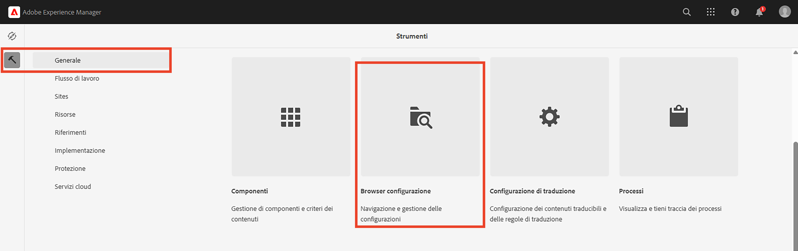
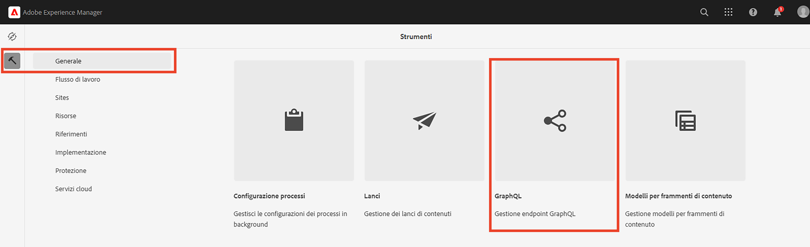
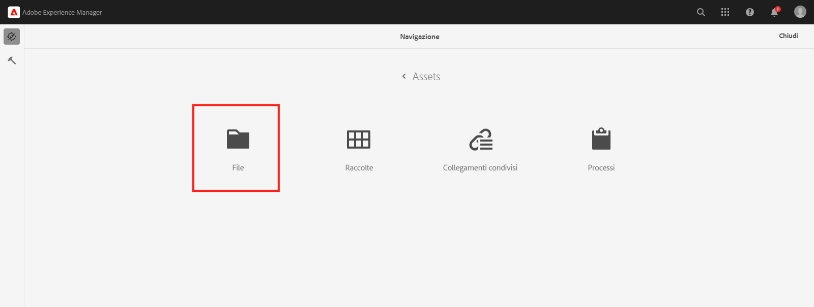
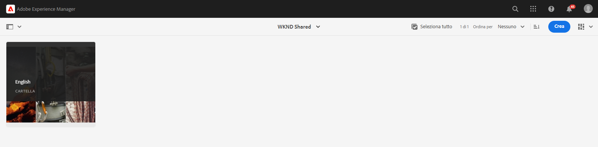
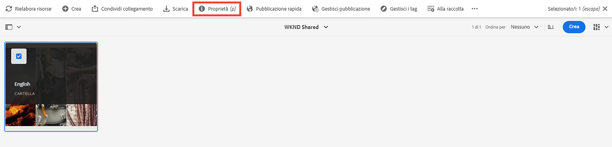
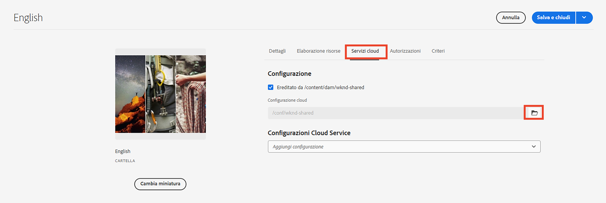

# Concetti avanzati di AEM senza testa

Questa esercitazione completa continua la [esercitazione di base](../multi-step/overview.md) che includeva le nozioni di base di Adobe Experience Manager (AEM) Headless e GraphQL. L’esercitazione avanzata illustra gli aspetti approfonditi dell’utilizzo dei modelli di frammenti di contenuto, dei frammenti di contenuto e dell’API GraphQL AEM, incluso l’utilizzo di GraphQL AEM in un’applicazione client.

## Prerequisiti

Completa il [configurazione rapida per AEM as a Cloud Service](../quick-setup/cloud-service.md) per configurare l’ambiente.

Si consiglia vivamente di completare il precedente [esercitazione di base](../multi-step/overview.md) e [serie video](../video-series/modeling-basics.md) tutorial prima di procedere con questa esercitazione avanzata. Anche se puoi completare l’esercitazione utilizzando un ambiente AEM locale, questa esercitazione copre solo il flusso di lavoro per AEM as a Cloud Service.

## Obiettivi

Questa esercitazione tratta i seguenti argomenti:

* Crea modelli di frammenti di contenuto utilizzando le regole di convalida e tipi di dati più avanzati, ad esempio segnaposto delle schede, riferimenti a frammenti nidificati, oggetti JSON e tipi di dati Data e ora.
* Creazione di frammenti di contenuto durante l’utilizzo di riferimenti a frammenti e contenuti nidificati e configurazione di criteri per la gestione dell’authoring dei frammenti di contenuto.
* Esplora AEM funzionalità dell’API GraphQL utilizzando query GraphQL con variabili e direttive.
* Permetti alle query GraphQL con parametri in AEM e impara a utilizzare parametri di controllo cache con query persistenti.
* Integra le richieste per le query persistenti nell’app WKND GraphQL React di esempio utilizzando l’SDK JavaScript senza intestazione AEM.

## Panoramica dei concetti avanzati di AEM Headless

Il video seguente fornisce una panoramica di alto livello dei concetti trattati in questa esercitazione. L’esercitazione include la definizione di modelli di frammenti di contenuto con tipi di dati più avanzati, la nidificazione di frammenti di contenuto e la persistenza di query GraphQL in AEM.

>[!VIDEO](https://video.tv.adobe.com/v/340035/?quality=12&learn=on)

## Configurazione del progetto

Il progetto WKND Site dispone di tutte le configurazioni necessarie, quindi puoi avviare l’esercitazione subito dopo aver completato il [configurazione rapida](../quick-setup/cloud-service.md). Questa sezione evidenzia solo alcuni passaggi importanti che puoi utilizzare per creare un tuo progetto AEM Headless.

### Creare una configurazione

Il primo passaggio per avviare un nuovo progetto in AEM è la creazione della sua configurazione, come area di lavoro e per creare endpoint API GraphQL. Per visualizzare o creare una configurazione, passa a **Strumenti** > **Generale** > **Browser di configurazione**.

Tieni presente che la configurazione del sito WKND è già stata creata per l’esercitazione. Per creare una configurazione per un progetto personalizzato, seleziona **Crea** nell’angolo in alto a destra e completa il modulo nella finestra modale Crea configurazione visualizzata.

### Creare endpoint API GraphQL

Successivamente, devi configurare gli endpoint API a cui inviare le query GraphQL. Per rivedere gli endpoint esistenti o crearne uno, passa a **Strumenti** > **Risorse** > **GraphQL**.

Osserva che gli endpoint globali e WKND sono già stati creati. Per creare un endpoint per il progetto, seleziona **Crea** nell’angolo in alto a destra e segui il flusso di lavoro .

>[!NOTE]
>
> Dopo aver salvato l’endpoint, verrà visualizzato un modale che illustra come visitare la console di sicurezza, che consente di modificare le impostazioni di sicurezza per configurare l’accesso all’endpoint. Tuttavia, le stesse autorizzazioni di sicurezza non rientrano nell’ambito di questa esercitazione. Per ulteriori informazioni, consulta la [Documentazione AEM](https://experienceleague.adobe.com/docs/experience-manager-64/administering/security/security.html).

### Creare una cartella principale della lingua per il progetto

Una cartella principale della lingua è una cartella con un codice della lingua ISO come nome, ad esempio EN o FR. Il sistema di gestione della traduzione AEM utilizza queste cartelle per definire la lingua principale dei contenuti e delle lingue per la traduzione dei contenuti.

Vai a **Navigazione** > **Risorse** > **File**.

Passa a **Sito WKND** cartella. Osserva la cartella con il titolo &quot;Inglese&quot; e il nome &quot;EN&quot;. Questa cartella è la cartella principale della lingua per il progetto WKND Site.

Per un progetto personalizzato, crea una cartella principale della lingua all’interno della configurazione. Vedi la sezione su [creazione di cartelle](/help/headless-tutorial/graphql/advanced-graphql/author-content-fragments.md#create-folders) per ulteriori dettagli.

### Assegnare una configurazione alla cartella nidificata

Infine, devi assegnare la configurazione del progetto alla cartella principale della lingua. Questa assegnazione consente di creare frammenti di contenuto basati su modelli di frammenti di contenuto definiti nella configurazione del progetto.

Per assegnare la cartella principale della lingua alla configurazione, selezionare la cartella, quindi selezionare **Proprietà** nella barra di navigazione superiore.

Quindi, passa alla **Cloud Services** e seleziona l’icona della cartella nella scheda **Configurazione cloud** campo .

Nel modale visualizzato, seleziona la configurazione creata in precedenza per assegnare la cartella principale della lingua.

### Best practice

Di seguito sono riportate le best practice per la creazione di un progetto personalizzato in AEM:

* La gerarchia delle cartelle deve essere basata sulla localizzazione e la traduzione. In altre parole, le cartelle di lingua devono essere nidificate all&#39;interno delle cartelle di configurazione, il che consente una facile traduzione del contenuto all&#39;interno di tali cartelle di configurazione.
* La gerarchia delle cartelle deve essere mantenuta semplice e lineare. Evita di spostare o rinominare cartelle e frammenti in un secondo momento, specialmente dopo la pubblicazione per l’utilizzo live, in quanto cambia i percorsi che possono influenzare i riferimenti ai frammenti e le query GraphQL.

## Pacchetti iniziali e di soluzione

Due AEM **pacchetti** sono disponibili e possono essere installati tramite [Gestione pacchetti](/help/headless-tutorial/graphql/advanced-graphql/author-content-fragments.md#sample-content)

* [Advanced-GraphQL-Tutorial-Starter-Package-1.0.zip](/help/headless-tutorial/graphql/advanced-graphql/assets/tutorial-files/Advanced-GraphQL-Tutorial-Starter-Package-1.0.zip) viene utilizzato più avanti nell’esercitazione e contiene immagini e cartelle di esempio.
* [Advanced-GraphQL-Tutorial-Solution-Package-1.1.zip](/help/headless-tutorial/graphql/advanced-graphql/assets/tutorial-files/Advanced-GraphQL-Tutorial-Solution-Package-1.1.zip) contiene la soluzione completa per i capitoli da 1 a 4, inclusi nuovi modelli di frammenti di contenuto, frammenti di contenuto e query GraphQL persistenti. Utile per coloro che desiderano saltare direttamente nel [Integrazione di applicazioni client](/help/headless-tutorial/graphql/advanced-graphql/client-application-integration.md) capitolo.

Sono disponibili due progetti React JS per sperimentare le query [da un&#39;applicazione client headless](/help/headless-tutorial/graphql/advanced-graphql/client-application-integration.md).

* [aem-guides-wknd-headless-start-tutorial.zip](/help/headless-tutorial/graphql/advanced-graphql/assets/tutorial-files/aem-guides-wknd-headless-start-tutorial.zip) - applicazione client iniziale completata in [Capitolo 5 - Integrazione delle applicazioni client](/help/headless-tutorial/graphql/advanced-graphql/client-application-integration.md).
* [aem-guides-wknd-headless-solution-tutorial.zip](/help/headless-tutorial/graphql/advanced-graphql/assets/tutorial-files/aem-guides-wknd-headless-solution-tutorial.zip) - applicazione client completata che utilizza **persistente** query.

## Guida introduttiva

Per iniziare a utilizzare questa esercitazione avanzata, segui questi passaggi:

1. Configurare un ambiente di sviluppo utilizzando [AEM as a Cloud Service](../quick-setup/cloud-service.md).
1. Avvia il capitolo tutorial su [creazione di modelli di frammenti di contenuto](/help/headless-tutorial/graphql/advanced-graphql/create-content-fragment-models.md).
